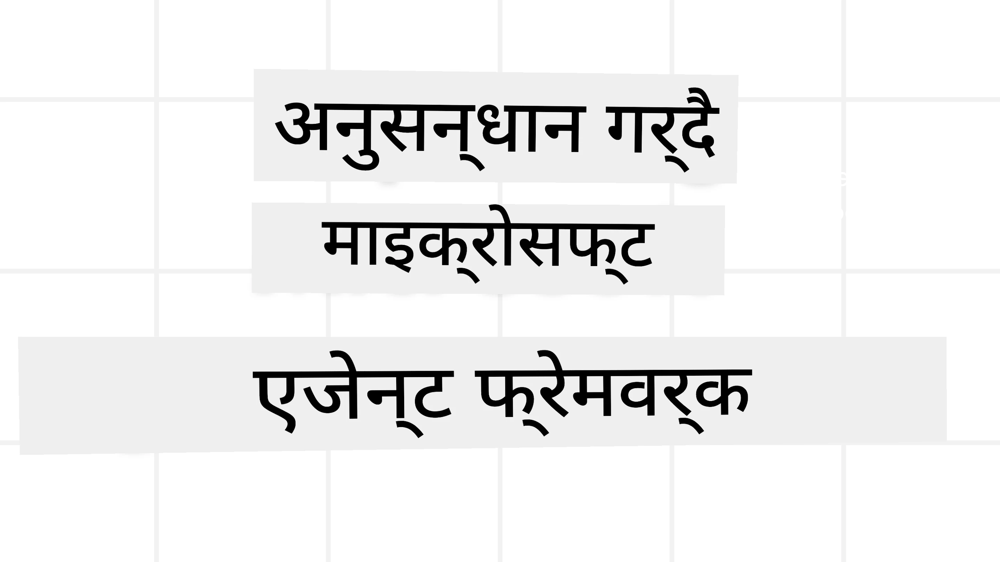
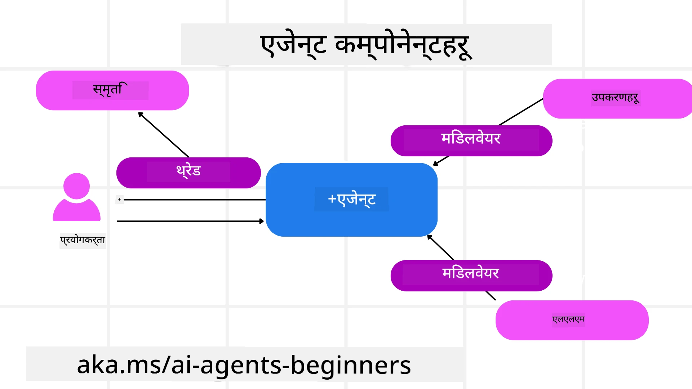

<!--
CO_OP_TRANSLATOR_METADATA:
{
  "original_hash": "19c4dab375acbc733855cc7f2f04edbc",
  "translation_date": "2025-10-02T11:16:02+00:00",
  "source_file": "14-microsoft-agent-framework/README.md",
  "language_code": "ne"
}
-->
# माइक्रोसफ्ट एजेन्ट फ्रेमवर्क अन्वेषण



### परिचय

यो पाठले समेट्नेछ:

- माइक्रोसफ्ट एजेन्ट फ्रेमवर्कको समझ: मुख्य विशेषताहरू र महत्त्व  
- माइक्रोसफ्ट एजेन्ट फ्रेमवर्कका मुख्य अवधारणाहरूको अन्वेषण
- MAF लाई सेमान्टिक कर्नेल र AutoGen सँग तुलना: माइग्रेशन गाइड

## सिकाइका लक्ष्यहरू

यो पाठ पूरा गरेपछि, तपाईंले जान्नुहुनेछ:

- माइक्रोसफ्ट एजेन्ट फ्रेमवर्क प्रयोग गरेर उत्पादन-तयार AI एजेन्टहरू निर्माण गर्ने
- आफ्ना एजेन्टिक प्रयोगका केसहरूमा माइक्रोसफ्ट एजेन्ट फ्रेमवर्कका मुख्य विशेषताहरू लागू गर्ने
- विद्यमान एजेन्टिक फ्रेमवर्क र उपकरणहरू माइग्रेट र एकीकृत गर्ने  

## कोड नमूनाहरू

[माइक्रोसफ्ट एजेन्ट फ्रेमवर्क (MAF)](https://aka.ms/ai-agents-beginners/agent-framewrok) का कोड नमूनाहरू यस रिपोजिटरीमा `xx-python-agent-framework` र `xx-dotnet-agent-framework` फाइलहरू अन्तर्गत उपलब्ध छन्।

## माइक्रोसफ्ट एजेन्ट फ्रेमवर्कको समझ


[माइक्रोसफ्ट एजेन्ट फ्रेमवर्क (MAF)](https://aka.ms/ai-agents-beginners/agent-framewrok) ले सेमान्टिक कर्नेल र AutoGen बाट सिकाइ र अनुभवलाई आधार मानेर निर्माण गरिएको हो। यसले उत्पादन र अनुसन्धान वातावरणमा देखिने विभिन्न प्रकारका एजेन्टिक प्रयोगका केसहरूलाई सम्बोधन गर्न लचिलोपन प्रदान गर्दछ, जस्तै:

- **क्रमिक एजेन्ट व्यवस्थापन**: जहाँ चरण-दर-चरण कार्यप्रवाह आवश्यक हुन्छ।
- **समानान्तर व्यवस्थापन**: जहाँ एजेन्टहरूले एकै समयमा कार्यहरू पूरा गर्नुपर्छ।
- **समूह च्याट व्यवस्थापन**: जहाँ एजेन्टहरूले एउटै कार्यमा सहकार्य गर्न सक्छन्।
- **ह्यान्डअफ व्यवस्थापन**: जहाँ एजेन्टहरूले उप-कार्यहरू पूरा गरेपछि कार्य एक-अर्कालाई हस्तान्तरण गर्छन्।
- **चुम्बकीय व्यवस्थापन**: जहाँ प्रबन्धक एजेन्टले कार्य सूची सिर्जना र परिमार्जन गर्छ र उप-एजेन्टहरूको समन्वय गर्छ।

उत्पादनमा AI एजेन्टहरू प्रदान गर्न, MAF ले निम्न विशेषताहरू समावेश गरेको छ:

- **अवलोकनीयता**: OpenTelemetry को प्रयोगद्वारा, जहाँ AI एजेन्टका प्रत्येक कार्यहरू, उपकरणको प्रयोग, व्यवस्थापन चरणहरू, तर्क प्रवाह र Azure AI Foundry ड्यासबोर्डहरू मार्फत प्रदर्शन अनुगमन गरिन्छ।
- **सुरक्षा**: Azure AI Foundry मा एजेन्टहरूलाई स्वाभाविक रूपमा होस्ट गरेर, जसमा भूमिका-आधारित पहुँच, निजी डाटा ह्यान्डलिङ र बिल्ट-इन सामग्री सुरक्षा जस्ता सुरक्षा नियन्त्रणहरू समावेश छन्।
- **दृढता**: एजेन्ट थ्रेडहरू र कार्यप्रवाहहरू रोक्न, पुनः सुरु गर्न र त्रुटिहरूबाट पुन: प्राप्त गर्न सक्षम छन्, जसले लामो समयसम्म चल्ने प्रक्रियाहरूलाई सक्षम बनाउँछ।
- **नियन्त्रण**: मानव-अनुमोदन आवश्यक पर्ने कार्यहरूलाई समर्थन गर्ने मानव-इन-द-लूप कार्यप्रवाहहरू।

माइक्रोसफ्ट एजेन्ट फ्रेमवर्कले अन्तरसञ्चालनमा पनि ध्यान केन्द्रित गरेको छ:

- **क्लाउड-अज्ञेयवादी**: एजेन्टहरू कन्टेनरहरूमा, अन-प्रिमाइज र विभिन्न क्लाउडहरूमा चल्न सक्छन्।
- **प्रदायक-अज्ञेयवादी**: एजेन्टहरू तपाईंको मनपर्ने SDK मार्फत सिर्जना गर्न सकिन्छ, जस्तै Azure OpenAI र OpenAI।
- **खुला मापदण्डहरूको एकीकरण**: एजेन्टहरूले Agent-to-Agent (A2A) र Model Context Protocol (MCP) जस्ता प्रोटोकलहरू प्रयोग गरेर अन्य एजेन्ट र उपकरणहरू पत्ता लगाउन र प्रयोग गर्न सक्छन्।
- **प्लगइन र कनेक्टरहरू**: Microsoft Fabric, SharePoint, Pinecone र Qdrant जस्ता डाटा र मेमोरी सेवाहरूमा जडान गर्न सकिन्छ।

अब, यी विशेषताहरू माइक्रोसफ्ट एजेन्ट फ्रेमवर्कका केही मुख्य अवधारणाहरूमा कसरी लागू गरिन्छन्, हेरौं।

## माइक्रोसफ्ट एजेन्ट फ्रेमवर्कका मुख्य अवधारणाहरू

### एजेन्टहरू



**एजेन्ट सिर्जना**

एजेन्ट सिर्जना गर्दा, अनुमान सेवा (LLM प्रदायक), AI एजेन्टले पालना गर्नुपर्ने निर्देशनहरूको सेट, र एउटा `name` परिभाषित गरिन्छ:

```python
agent = AzureOpenAIChatClient(credential=AzureCliCredential()).create_agent( instructions="You are good at recommending trips to customers based on their preferences.", name="TripRecommender" )
```

माथिको उदाहरणमा `Azure OpenAI` प्रयोग गरिएको छ, तर एजेन्टहरू `Azure AI Foundry Agent Service` सहित विभिन्न सेवाहरू प्रयोग गरेर सिर्जना गर्न सकिन्छ:

```python
AzureAIAgentClient(async_credential=credential).create_agent( name="HelperAgent", instructions="You are a helpful assistant." ) as agent
```

OpenAI `Responses`, `ChatCompletion` APIs

```python
agent = OpenAIResponsesClient().create_agent( name="WeatherBot", instructions="You are a helpful weather assistant.", )
```

```python
agent = OpenAIChatClient().create_agent( name="HelpfulAssistant", instructions="You are a helpful assistant.", )
```

वा A2A प्रोटोकल प्रयोग गरेर रिमोट एजेन्टहरू:

```python
agent = A2AAgent( name=agent_card.name, description=agent_card.description, agent_card=agent_card, url="https://your-a2a-agent-host" )
```

**एजेन्ट चलाउने**

एजेन्टहरू `.run` वा `.run_stream` विधिहरू प्रयोग गरेर चलाइन्छन्, गैर-स्ट्रीमिङ वा स्ट्रीमिङ प्रतिक्रियाहरूका लागि।

```python
result = await agent.run("What are good places to visit in Amsterdam?")
print(result.text)
```

```python
async for update in agent.run_stream("What are the good places to visit in Amsterdam?"):
    if update.text:
        print(update.text, end="", flush=True)

```

प्रत्येक एजेन्ट रनमा `max_tokens`, `tools`, र `model` जस्ता प्यारामिटरहरू अनुकूलन गर्न विकल्पहरू पनि हुन्छन्।

यो उपयोगी हुन्छ जब प्रयोगकर्ताको कार्य पूरा गर्न विशिष्ट मोडेलहरू वा उपकरणहरू आवश्यक हुन्छन्।

**उपकरणहरू**

उपकरणहरू एजेन्ट परिभाषा गर्दा:

```python
def get_attractions( location: Annotated[str, Field(description="The location to get the top tourist attractions for")], ) -> str: """Get the top tourist attractions for a given location.""" return f"The top attractions for {location} are." 


# When creating a ChatAgent directly 

agent = ChatAgent( chat_client=OpenAIChatClient(), instructions="You are a helpful assistant", tools=[get_attractions]

```

र एजेन्ट चलाउँदा पनि परिभाषित गर्न सकिन्छ:

```python

result1 = await agent.run( "What's the best place to visit in Seattle?", tools=[get_attractions] # Tool provided for this run only )
```

**एजेन्ट थ्रेडहरू**

एजेन्ट थ्रेडहरू बहु-वार्ता सम्हाल्न प्रयोग गरिन्छ। थ्रेडहरू निम्न तरिकाहरूबाट सिर्जना गर्न सकिन्छ:

- `get_new_thread()` प्रयोग गरेर, जसले थ्रेडलाई समयसँगै सुरक्षित गर्न सक्षम बनाउँछ।
- एजेन्ट चलाउँदा स्वचालित रूपमा थ्रेड सिर्जना गरेर, जुन केवल वर्तमान रनको अवधिमा रहन्छ।

थ्रेड सिर्जना गर्न, कोड यस प्रकार देखिन्छ:

```python
# Create a new thread. 
thread = agent.get_new_thread() # Run the agent with the thread. 
response = await agent.run("Hello, I am here to help you book travel. Where would you like to go?", thread=thread)

```

पछि प्रयोगका लागि थ्रेडलाई सिरियलाइज गर्न सकिन्छ:

```python
# Create a new thread. 
thread = agent.get_new_thread() 

# Run the agent with the thread. 

response = await agent.run("Hello, how are you?", thread=thread) 

# Serialize the thread for storage. 

serialized_thread = await thread.serialize() 

# Deserialize the thread state after loading from storage. 

resumed_thread = await agent.deserialize_thread(serialized_thread)
```

**एजेन्ट मिडलवेयर**

एजेन्टहरूले प्रयोगकर्ताको कार्यहरू पूरा गर्न उपकरण र LLM हरूसँग अन्तरक्रिया गर्छन्। केही परिदृश्यहरूमा, यी अन्तरक्रियाहरूको बीचमा कार्यहरू कार्यान्वयन गर्न वा ट्र्याक गर्न चाहिन्छ। एजेन्ट मिडलवेयरले यसलाई सक्षम बनाउँछ:

*फङ्सन मिडलवेयर*

यो मिडलवेयरले एजेन्ट र उपकरण/फङ्सनको बीचमा कार्य कार्यान्वयन गर्न अनुमति दिन्छ। उदाहरणका लागि, तपाईं फङ्सन कलमा केही लगिङ गर्न चाहनुहुन्छ भने यो उपयोगी हुन्छ।

```python
async def logging_function_middleware(
    context: FunctionInvocationContext,
    next: Callable[[FunctionInvocationContext], Awaitable[None]],
) -> None:
    """Function middleware that logs function execution."""
    # Pre-processing: Log before function execution
    print(f"[Function] Calling {context.function.name}")

    # Continue to next middleware or function execution
    await next(context)

    # Post-processing: Log after function execution
    print(f"[Function] {context.function.name} completed")
```

*च्याट मिडलवेयर*

यो मिडलवेयरले एजेन्ट र LLM बीचको अनुरोधहरूको बीचमा कार्य कार्यान्वयन गर्न वा लग गर्न अनुमति दिन्छ।

```python
async def logging_chat_middleware(
    context: ChatContext,
    next: Callable[[ChatContext], Awaitable[None]],
) -> None:
    """Chat middleware that logs AI interactions."""
    # Pre-processing: Log before AI call
    print(f"[Chat] Sending {len(context.messages)} messages to AI")

    # Continue to next middleware or AI service
    await next(context)

    # Post-processing: Log after AI response
    print("[Chat] AI response received")

```

**एजेन्ट मेमोरी**

`Agentic Memory` पाठमा समेटिएको जस्तै, मेमोरी एजेन्टलाई विभिन्न सन्दर्भहरूमा सञ्चालन गर्न सक्षम बनाउन महत्त्वपूर्ण तत्व हो। MAF ले विभिन्न प्रकारका मेमोरीहरू प्रदान गर्दछ:

*इन-मेमोरी स्टोरेज*

यो एप्लिकेसन रनटाइमको दौरान थ्रेडहरूमा भण्डारण गरिएको मेमोरी हो।

```python
# Create a new thread. 
thread = agent.get_new_thread() # Run the agent with the thread. 
response = await agent.run("Hello, I am here to help you book travel. Where would you like to go?", thread=thread)
```

*स्थायी सन्देशहरू*

यो मेमोरी विभिन्न सत्रहरूमा वार्तालाप इतिहास भण्डारण गर्न प्रयोग गरिन्छ। यो `chat_message_store_factory` प्रयोग गरेर परिभाषित गरिन्छ:

```python
from agent_framework import ChatMessageStore

# Create a custom message store
def create_message_store():
    return ChatMessageStore()

agent = ChatAgent(
    chat_client=OpenAIChatClient(),
    instructions="You are a Travel assistant.",
    chat_message_store_factory=create_message_store
)

```

*डायनामिक मेमोरी*

यो मेमोरी एजेन्टहरू चलाउनु अघि सन्दर्भमा थपिन्छ। यी मेमोरीहरू बाह्य सेवाहरूमा भण्डारण गर्न सकिन्छ, जस्तै mem0:

```python
from agent_framework.mem0 import Mem0Provider

# Using Mem0 for advanced memory capabilities
memory_provider = Mem0Provider(
    api_key="your-mem0-api-key",
    user_id="user_123",
    application_id="my_app"
)

agent = ChatAgent(
    chat_client=OpenAIChatClient(),
    instructions="You are a helpful assistant with memory.",
    context_providers=memory_provider
)

```

**एजेन्ट अवलोकनीयता**

एजेन्टिक प्रणालीहरू निर्माण गर्दा विश्वसनीयता र मर्मतयोग्यता महत्त्वपूर्ण हुन्छ। MAF ले OpenTelemetry सँग एकीकृत भएर राम्रो अवलोकनीयताका लागि ट्रेसिङ र मिटरहरू प्रदान गर्दछ।

```python
from agent_framework.observability import get_tracer, get_meter

tracer = get_tracer()
meter = get_meter()
with tracer.start_as_current_span("my_custom_span"):
    # do something
    pass
counter = meter.create_counter("my_custom_counter")
counter.add(1, {"key": "value"})
```

### कार्यप्रवाहहरू

MAF ले कार्यप्रवाहहरू प्रदान गर्दछ, जसले कार्य पूरा गर्न पूर्व-परिभाषित चरणहरू समावेश गर्दछ र ती चरणहरूमा AI एजेन्टहरूलाई समावेश गर्दछ।

कार्यप्रवाहहरू विभिन्न कम्पोनेन्टहरूबाट बनेका हुन्छन्, जसले राम्रो नियन्त्रण प्रवाहलाई अनुमति दिन्छ। कार्यप्रवाहहरूले **बहु-एजेन्ट व्यवस्थापन** र **चेकपोइन्टिङ** लाई पनि सक्षम बनाउँछ, जसले कार्यप्रवाह अवस्थाहरू सुरक्षित गर्दछ।

कार्यप्रवाहका मुख्य कम्पोनेन्टहरू हुन्:

**कार्यकारीहरू**

कार्यकारीहरूले इनपुट सन्देशहरू प्राप्त गर्छन्, तिनीहरूलाई तोकिएको कार्यहरू पूरा गर्छन्, र त्यसपछि आउटपुट सन्देश उत्पादन गर्छन्। यसले कार्यप्रवाहलाई ठूलो कार्य पूरा गर्न अगाडि बढाउँछ। कार्यकारीहरू AI एजेन्ट वा अनुकूलन तर्क हुन सक्छन्।

**एजहरू**

एजहरू कार्यप्रवाहमा सन्देशहरूको प्रवाह परिभाषित गर्न प्रयोग गरिन्छ। यी निम्न प्रकारका हुन सक्छन्:

*प्रत्यक्ष एजहरू* - कार्यकारीहरू बीचको साधारण एक-देखि-एक जडानहरू:

```python
from agent_framework import WorkflowBuilder

builder = WorkflowBuilder()
builder.add_edge(source_executor, target_executor)
builder.set_start_executor(source_executor)
workflow = builder.build()
```

*सर्त एजहरू* - निश्चित सर्त पूरा भएपछि सक्रिय हुन्छ। उदाहरणका लागि, होटलका कोठाहरू उपलब्ध नभएमा, कार्यकारीले अन्य विकल्पहरू सुझाव दिन सक्छ।

*स्विच-केस एजहरू* - परिभाषित सर्तहरूका आधारमा सन्देशहरू विभिन्न कार्यकारीहरूमा रुट गर्दछ। उदाहरणका लागि, यदि यात्रा ग्राहकसँग प्राथमिकता पहुँच छ भने, तिनीहरूको कार्यहरू अर्को कार्यप्रवाहमार्फत सम्हालिन्छ।

*फ्यान-आउट एजहरू* - एक सन्देशलाई धेरै लक्ष्यहरूमा पठाउँछ।

*फ्यान-इन एजहरू* - विभिन्न कार्यकारीहरूबाट धेरै सन्देशहरू सङ्कलन गरेर एक लक्ष्यमा पठाउँछ।

**घटनाहरू**

कार्यप्रवाहहरूमा राम्रो अवलोकनीयता प्रदान गर्न, MAF ले कार्यान्वयनका लागि बिल्ट-इन घटनाहरू प्रदान गर्दछ, जस्तै:

- `WorkflowStartedEvent`  - कार्यप्रवाह कार्यान्वयन सुरु हुन्छ
- `WorkflowOutputEvent` - कार्यप्रवाहले आउटपुट उत्पादन गर्छ
- `WorkflowErrorEvent` - कार्यप्रवाहले त्रुटि सामना गर्छ
- `ExecutorInvokeEvent`  - कार्यकारीले प्रक्रिया सुरु गर्छ
- `ExecutorCompleteEvent`  - कार्यकारीले प्रक्रिया पूरा गर्छ
- `RequestInfoEvent` - अनुरोध जारी गरिन्छ

## अन्य फ्रेमवर्कहरूबाट माइग्रेट गर्ने (सेमान्टिक कर्नेल र AutoGen)

### MAF र सेमान्टिक कर्नेल बीचका भिन्नताहरू

**सरल एजेन्ट सिर्जना**

सेमान्टिक कर्नेलले प्रत्येक एजेन्टका लागि कर्नेल उदाहरण सिर्जना गर्न आवश्यक पर्छ। MAF ले मुख्य प्रदायकहरूको लागि एक्सटेन्सन प्रयोग गरेर सरल दृष्टिकोण अपनाउँछ।

```python
agent = AzureOpenAIChatClient(credential=AzureCliCredential()).create_agent( instructions="You are good at reccomending trips to customers based on their preferences.", name="TripRecommender" )
```

**एजेन्ट थ्रेड सिर्जना**

सेमान्टिक कर्नेलमा थ्रेडहरू म्यानुअली सिर्जना गर्न आवश्यक पर्छ। MAF मा, एजेन्टलाई सिधै थ्रेड असाइन गरिन्छ।

```python
thread = agent.get_new_thread() # Run the agent with the thread. 
```

**उपकरण दर्ता**

सेमान्टिक कर्नेलमा, उपकरणहरू कर्नेलमा दर्ता गरिन्छ र त्यसपछि कर्नेल एजेन्टमा पास गरिन्छ। MAF मा, उपकरणहरू एजेन्ट सिर्जना प्रक्रियाको क्रममा सिधै दर्ता गरिन्छ।

```python
agent = ChatAgent( chat_client=OpenAIChatClient(), instructions="You are a helpful assistant", tools=[get_attractions]
```

### MAF र AutoGen बीचका भिन्नताहरू

**टीमहरू बनाम कार्यप्रवाहहरू**

AutoGen मा `टीमहरू` एजेन्टहरूसँग सम्बन्धित घटनाहरूको संरचना हो। MAF ले `कार्यप्रवाहहरू` प्रयोग गर्दछ, जसले ग्राफ-आधारित आर्किटेक्चरमार्फत डाटालाई कार्यकारीहरूमा रुट गर्दछ।

**उपकरण सिर्जना**

AutoGen ले एजेन्टहरूले कल गर्नका लागि फङ्सनलाई र्‍याप गर्न `FunctionTool` प्रयोग गर्दछ। MAF ले @ai_function प्रयोग गर्दछ, जसले प्रत्येक फङ्सनका लागि स्किमाहरू स्वचालित रूपमा अनुमान गर्छ।

**एजेन्ट व्यवहार**

AutoGen मा, एजेन्टहरू डिफल्ट रूपमा एक-टर्न एजेन्टहरू हुन्, जबसम्म `max_tool_iterations` उच्च सेट गरिएको छैन। MAF मा, `ChatAgent` डिफल्ट रूपमा बहु-टर्न हुन्छ, जसले प्रयोगकर्ताको कार्य पूरा नभएसम्म उपकरणहरू कल गर्न जारी राख्छ।

## कोड नमूनाहरू

माइक्रोसफ्ट एजेन्ट फ्रेमवर्कका कोड नमूनाहरू यस रिपोजिटरीमा `xx-python-agent-framework` र `xx-dotnet-agent-framework` फाइलहरू अन्तर्गत उपलब्ध छन्।

## माइक्रोसफ्ट एजेन्ट फ्रेमवर्कबारे थप प्रश्नहरू छन्?

[Azure AI Foundry Discord](https://aka.ms/ai-agents/discord) मा सामेल हुनुहोस्, अन्य सिक्नेहरूसँग भेट्नुहोस्, अफिस आवरहरूमा सहभागी हुनुहोस् र आफ्नो AI एजेन्टसम्बन्धी प्रश्नहरूको उत्तर पाउनुहोस्।

---

**अस्वीकरण**:  
यो दस्तावेज़ AI अनुवाद सेवा [Co-op Translator](https://github.com/Azure/co-op-translator) प्रयोग गरेर अनुवाद गरिएको हो। हामी यथासम्भव शुद्धता सुनिश्चित गर्न प्रयास गर्छौं, तर कृपया ध्यान दिनुहोस् कि स्वचालित अनुवादमा त्रुटिहरू वा अशुद्धताहरू हुन सक्छ। मूल दस्तावेज़ यसको मातृभाषामा आधिकारिक स्रोत मानिनुपर्छ। महत्वपूर्ण जानकारीको लागि, व्यावसायिक मानव अनुवाद सिफारिस गरिन्छ। यस अनुवादको प्रयोगबाट उत्पन्न हुने कुनै पनि गलतफहमी वा गलत व्याख्याको लागि हामी जिम्मेवार हुने छैनौं।