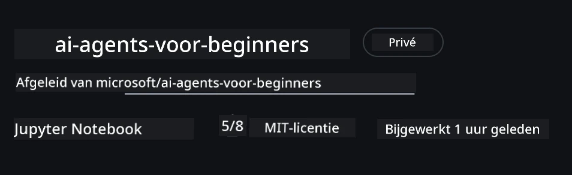
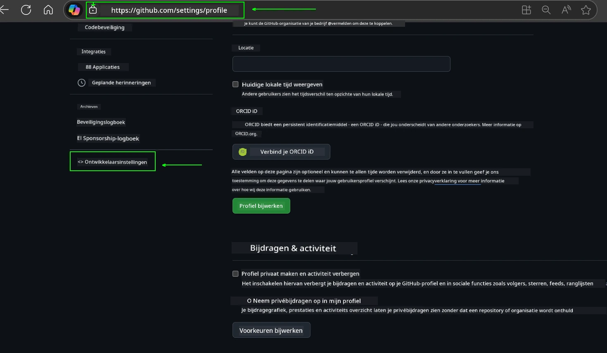
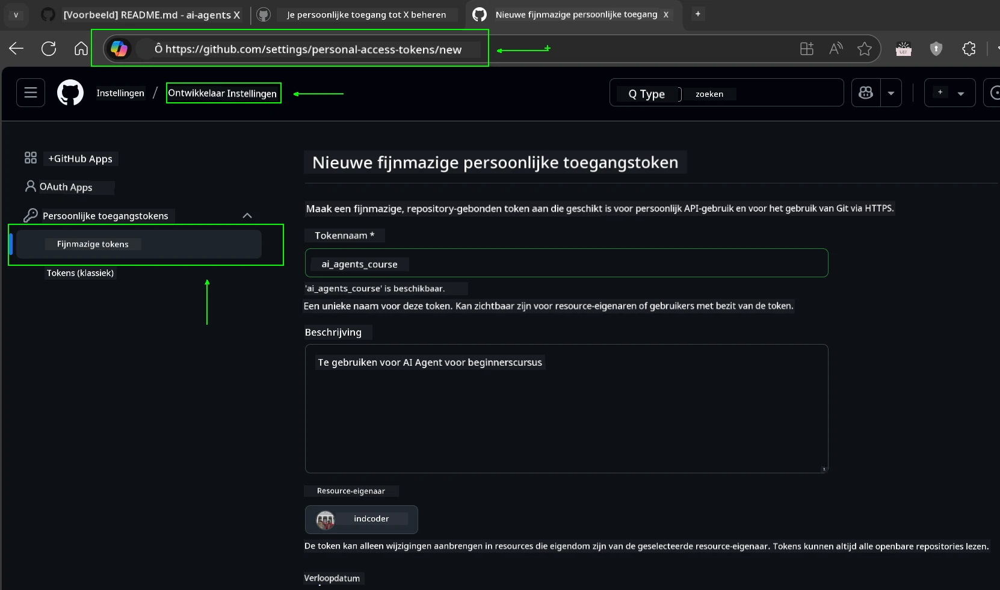
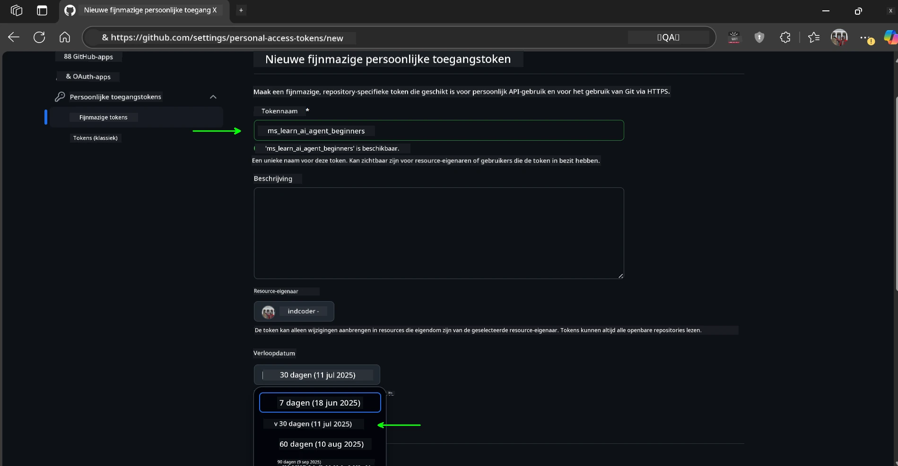
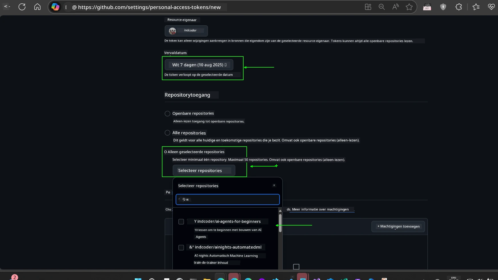
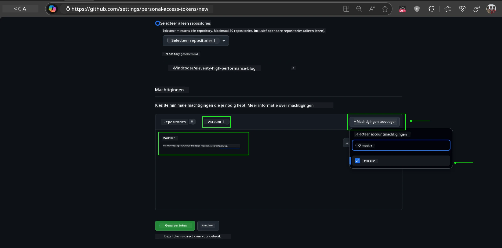
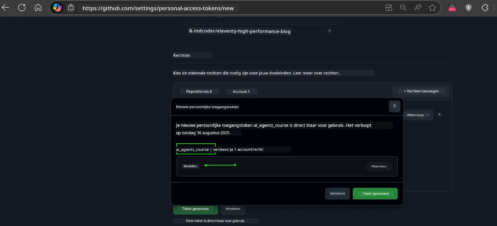
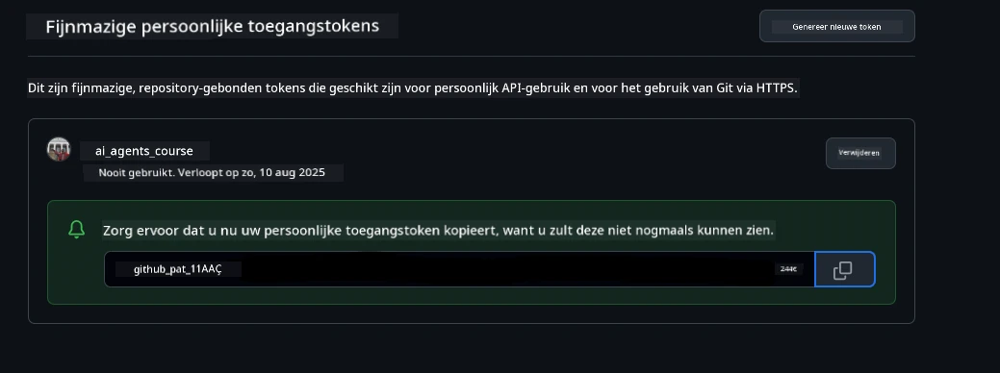
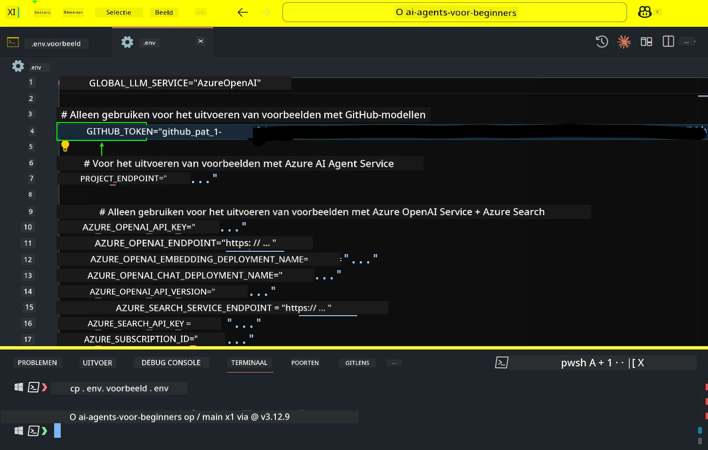
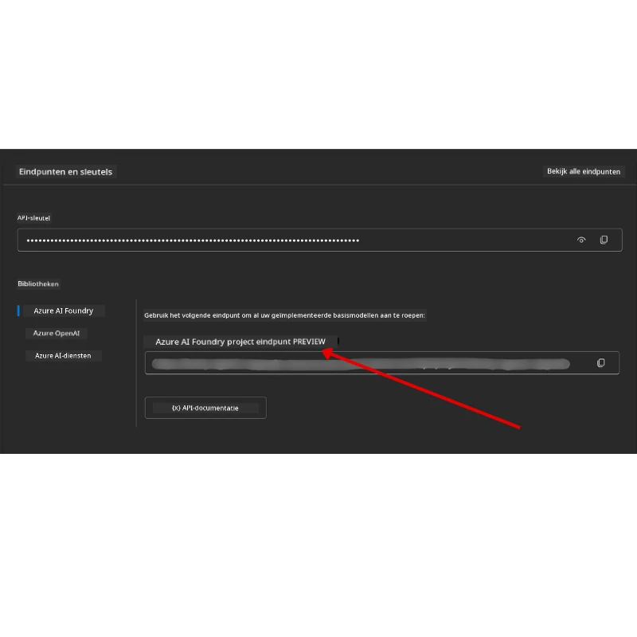

<!--
CO_OP_TRANSLATOR_METADATA:
{
  "original_hash": "63b1a8f6e840df15934935b728e569f0",
  "translation_date": "2025-12-03T14:37:32+00:00",
  "source_file": "00-course-setup/README.md",
  "language_code": "nl"
}
-->
# Cursusopzet

## Introductie

In deze les leer je hoe je de codevoorbeelden van deze cursus kunt uitvoeren.

## Sluit je aan bij andere cursisten en krijg hulp

Voordat je je repository gaat klonen, sluit je aan bij het [AI Agents For Beginners Discord-kanaal](https://aka.ms/ai-agents/discord) om hulp te krijgen bij de installatie, vragen over de cursus te stellen of om in contact te komen met andere cursisten.

## Clone of fork deze repository

Om te beginnen, kloon of fork de GitHub-repository. Hiermee maak je je eigen versie van het cursusmateriaal, zodat je de code kunt uitvoeren, testen en aanpassen!

Dit kan door op de link te klikken om de <a href="https://github.com/microsoft/ai-agents-for-beginners/fork" target="_blank">repository te forken</a>.

Je hebt nu je eigen geforkte versie van deze cursus via de volgende link:



### Shallow Clone (aanbevolen voor workshop / Codespaces)

  >De volledige repository kan groot zijn (~3 GB) als je de volledige geschiedenis en alle bestanden downloadt. Als je alleen de workshop bijwoont of slechts een paar lesmappen nodig hebt, vermijd je met een shallow clone (of een sparse clone) het grootste deel van die download door de geschiedenis in te korten en/of blobs over te slaan.

#### Snelle shallow clone — minimale geschiedenis, alle bestanden

Vervang `<your-username>` in de onderstaande commando's door je fork-URL (of de upstream-URL als je dat liever hebt).

Om alleen de laatste commitgeschiedenis te klonen (kleine download):

```bash|powershell
git clone --depth 1 https://github.com/<your-username>/ai-agents-for-beginners.git
```

Om een specifieke branch te klonen:

```bash|powershell
git clone --depth 1 --branch <branch-name> https://github.com/<your-username>/ai-agents-for-beginners.git
```

#### Gedeeltelijke (sparse) clone — minimale blobs + alleen geselecteerde mappen

Dit gebruikt een gedeeltelijke clone en sparse-checkout (vereist Git 2.25+ en een moderne Git met ondersteuning voor gedeeltelijke clones wordt aanbevolen):

```bash|powershell
git clone --depth 1 --filter=blob:none --sparse https://github.com/<your-username>/ai-agents-for-beginners.git
```

Ga naar de repo-map:

```bash|powershell
cd ai-agents-for-beginners
```

Specificeer vervolgens welke mappen je wilt (voorbeeld hieronder toont twee mappen):

```bash|powershell
git sparse-checkout set 00-course-setup 01-intro-to-ai-agents
```

Na het klonen en verifiëren van de bestanden, als je alleen bestanden nodig hebt en ruimte wilt vrijmaken (geen git-geschiedenis), verwijder dan de repository-metadata (💀onherroepelijk — je verliest alle Git-functionaliteit: geen commits, pulls, pushes of toegang tot geschiedenis).

```bash
# zsh/bash
rm -rf .git
```

```powershell
# PowerShell
Remove-Item -Recurse -Force .git
```

#### Gebruik van GitHub Codespaces (aanbevolen om lokale grote downloads te vermijden)

- Maak een nieuwe Codespace voor deze repo via de [GitHub UI](https://github.com/codespaces).  

- Voer in de terminal van de nieuw aangemaakte Codespace een van de shallow/sparse clone-commando's hierboven uit om alleen de lesmappen die je nodig hebt naar de Codespace-werkruimte te halen.
- Optioneel: verwijder na het klonen binnen Codespaces .git om extra ruimte terug te winnen (zie verwijdercommando's hierboven).
- Opmerking: Als je de repo liever direct in Codespaces opent (zonder extra clone), houd er dan rekening mee dat Codespaces de devcontainer-omgeving zal opzetten en mogelijk meer zal provisioneren dan je nodig hebt. Het klonen van een shallow copy binnen een nieuwe Codespace geeft je meer controle over het schijfgebruik.

#### Tips

- Vervang altijd de clone-URL door je fork als je wilt bewerken/committen.
- Als je later meer geschiedenis of bestanden nodig hebt, kun je deze ophalen of sparse-checkout aanpassen om extra mappen op te nemen.

## De code uitvoeren

Deze cursus biedt een reeks Jupyter Notebooks waarmee je hands-on ervaring kunt opdoen in het bouwen van AI Agents.

De codevoorbeelden gebruiken:

**Vereist een GitHub-account - Gratis**:

1) Semantic Kernel Agent Framework + GitHub Models Marketplace. Gelabeld als (semantic-kernel.ipynb)
2) AutoGen Framework + GitHub Models Marketplace. Gelabeld als (autogen.ipynb)

**Vereist een Azure-abonnement**:

3) Azure AI Foundry + Azure AI Agent Service. Gelabeld als (azureaiagent.ipynb)

We moedigen je aan om alle drie de soorten voorbeelden uit te proberen om te zien welke het beste voor jou werkt.

Welke optie je ook kiest, dit bepaalt welke installatie-instructies je hieronder moet volgen:

## Vereisten

- Python 3.12+
  - **NOTE**: Als je Python3.12 niet hebt geïnstalleerd, zorg er dan voor dat je het installeert. Maak vervolgens je venv met python3.12 om ervoor te zorgen dat de juiste versies worden geïnstalleerd vanuit het requirements.txt-bestand.
  
    >Voorbeeld

    Maak een Python venv-map:

    ```bash|powershell
    python -m venv venv
    ```

    Activeer vervolgens de venv-omgeving voor:

    ```bash
    # zsh/bash
    source venv/bin/activate
    ```
  
    ```dos
    # Command Prompt for Windows
    venv\Scripts\activate
    ```

- .NET 10+: Voor de voorbeeldcodes die .NET gebruiken, zorg ervoor dat je de [.NET 10 SDK](https://dotnet.microsoft.com/download/dotnet/10.0) of later installeert. Controleer vervolgens je geïnstalleerde .NET SDK-versie:

    ```bash|powershell
    dotnet --list-sdks
    ```

- Een GitHub-account - Voor toegang tot de GitHub Models Marketplace
- Azure-abonnement - Voor toegang tot Azure AI Foundry
- Azure AI Foundry-account - Voor toegang tot de Azure AI Agent Service

We hebben een `requirements.txt`-bestand opgenomen in de root van deze repository dat alle vereiste Python-pakketten bevat om de codevoorbeelden uit te voeren.

Je kunt ze installeren door het volgende commando in je terminal in de root van de repository uit te voeren:

```bash|powershell
pip install -r requirements.txt
```

We raden aan om een Python virtual environment te maken om conflicten en problemen te voorkomen.

## VSCode instellen

Zorg ervoor dat je de juiste versie van Python gebruikt in VSCode.


## Instellen voor voorbeelden met GitHub-modellen

### Stap 1: Haal je GitHub Personal Access Token (PAT) op

Deze cursus maakt gebruik van de GitHub Models Marketplace, die gratis toegang biedt tot Large Language Models (LLM's) die je zult gebruiken om AI Agents te bouwen.

Om de GitHub-modellen te gebruiken, moet je een [GitHub Personal Access Token](https://docs.github.com/en/authentication/keeping-your-account-and-data-secure/managing-your-personal-access-tokens) aanmaken.

Dit kan door naar je <a href="https://github.com/settings/personal-access-tokens" target="_blank">instellingen voor persoonlijke toegangstokens</a> in je GitHub-account te gaan.

Volg het [Principe van Minimale Toegang](https://docs.github.com/en/get-started/learning-to-code/storing-your-secrets-safely) bij het aanmaken van je token. Dit betekent dat je het token alleen de rechten moet geven die nodig zijn om de codevoorbeelden in deze cursus uit te voeren.

1. Selecteer de optie `Fine-grained tokens` aan de linkerkant van je scherm door naar de **Developer settings** te gaan.

   

   Selecteer vervolgens `Generate new token`.

   

2. Geef je token een beschrijvende naam die het doel weerspiegelt, zodat je het later gemakkelijk kunt identificeren.

    🔐 Aanbevolen tokenduur

    Aanbevolen duur: 30 dagen  
    Voor een veiliger gebruik kun je kiezen voor een kortere periode, zoals 7 dagen 🛡️  
    Dit is een geweldige manier om jezelf een persoonlijk doel te stellen en de cursus te voltooien terwijl je leerdrang hoog is 🚀.

    

3. Beperk de scope van het token tot je fork van deze repository.

    

4. Beperk de rechten van het token: Onder **Permissions**, klik op het tabblad **Account** en klik op de knop "+ Add permissions". Er verschijnt een dropdownmenu. Zoek naar **Models** en vink het vakje aan.

    

5. Controleer de vereiste rechten voordat je het token genereert. 

6. Zorg ervoor dat je het token op een veilige plaats opslaat, zoals een wachtwoordmanager, voordat je het genereert, want het wordt niet opnieuw weergegeven nadat je het hebt aangemaakt. 

Kopieer je nieuwe token dat je zojuist hebt aangemaakt. Je voegt dit nu toe aan je `.env`-bestand dat bij deze cursus is inbegrepen.

### Stap 2: Maak je `.env`-bestand

Om je `.env`-bestand te maken, voer je het volgende commando uit in je terminal.

```bash
# zsh/bash
cp .env.example .env
```

```powershell
# PowerShell
Copy-Item .env.example .env
```

Dit kopieert het voorbeeldbestand en maakt een `.env` in je map waar je de waarden voor de omgevingsvariabelen invult.

Met je gekopieerde token open je het `.env`-bestand in je favoriete teksteditor en plak je je token in het `GITHUB_TOKEN`-veld.



Je zou nu in staat moeten zijn om de codevoorbeelden van deze cursus uit te voeren.

## Instellen voor voorbeelden met Azure AI Foundry en Azure AI Agent Service

### Stap 1: Haal je Azure Project Endpoint op

Volg de stappen om een hub en project te maken in Azure AI Foundry zoals beschreven hier: [Hub resources overzicht](https://learn.microsoft.com/azure/ai-foundry/concepts/ai-resources)

Zodra je je project hebt aangemaakt, moet je de verbindingsreeks voor je project ophalen.

Dit kan door naar de **Overzicht**-pagina van je project in het Azure AI Foundry-portaal te gaan.



### Stap 2: Maak je `.env`-bestand

Om je `.env`-bestand te maken, voer je het volgende commando uit in je terminal.

```bash
# zsh/bash
cp .env.example .env
```

```powershell
# PowerShell
Copy-Item .env.example .env
```

Dit kopieert het voorbeeldbestand en maakt een `.env` in je map waar je de waarden voor de omgevingsvariabelen invult.

Met je gekopieerde token open je het `.env`-bestand in je favoriete teksteditor en plak je je token in het `PROJECT_ENDPOINT`-veld.

### Stap 3: Meld je aan bij Azure

Als een beveiligingsbest practice gebruiken we [keyless authenticatie](https://learn.microsoft.com/azure/developer/ai/keyless-connections?tabs=csharp%2Cazure-cli?WT.mc_id=academic-105485-koreyst) om te authenticeren bij Azure OpenAI met Microsoft Entra ID. 

Open vervolgens een terminal en voer `az login --use-device-code` uit om je aan te melden bij je Azure-account.

Zodra je bent ingelogd, selecteer je je abonnement in de terminal.

## Extra omgevingsvariabelen - Azure Search en Azure OpenAI 

Voor de Agentic RAG-les - Les 5 - zijn er voorbeelden die Azure Search en Azure OpenAI gebruiken.

Als je deze voorbeelden wilt uitvoeren, moet je de volgende omgevingsvariabelen toevoegen aan je `.env`-bestand:

### Overzichtspagina (Project)

- `AZURE_SUBSCRIPTION_ID` - Controleer **Projectdetails** op de **Overzicht**-pagina van je project.

- `AZURE_AI_PROJECT_NAME` - Kijk bovenaan de **Overzicht**-pagina van je project.

- `AZURE_OPENAI_SERVICE` - Vind dit in het tabblad **Included capabilities** voor **Azure OpenAI Service** op de **Overzicht**-pagina.

### Managementcentrum

- `AZURE_OPENAI_RESOURCE_GROUP` - Ga naar **Projecteigenschappen** op de **Overzicht**-pagina van het **Managementcentrum**.

- `GLOBAL_LLM_SERVICE` - Onder **Connected resources**, vind de **Azure AI Services**-verbindingsnaam. Als deze niet wordt vermeld, controleer dan de **Azure-portaal** onder je resourcegroep voor de AI Services-resource naam.

### Modellen + Eindpuntenpagina

- `AZURE_OPENAI_EMBEDDING_DEPLOYMENT_NAME` - Selecteer je embedding-model (bijv. `text-embedding-ada-002`) en noteer de **Deployment name** uit de modeldetails.

- `AZURE_OPENAI_CHAT_DEPLOYMENT_NAME` - Selecteer je chatmodel (bijv. `gpt-4o-mini`) en noteer de **Deployment name** uit de modeldetails.

### Azure-portaal

- `AZURE_OPENAI_ENDPOINT` - Zoek naar **Azure AI services**, klik erop, ga vervolgens naar **Resourcebeheer**, **Sleutels en Eindpunt**, scroll naar beneden naar de "Azure OpenAI-eindpunten" en kopieer degene die "Language APIs" zegt.

- `AZURE_OPENAI_API_KEY` - Kopieer vanaf hetzelfde scherm SLEUTEL 1 of SLEUTEL 2.

- `AZURE_SEARCH_SERVICE_ENDPOINT` - Zoek je **Azure AI Search**-resource, klik erop en bekijk **Overzicht**.

- `AZURE_SEARCH_API_KEY` - Ga vervolgens naar **Instellingen** en daarna **Sleutels** om de primaire of secundaire beheerderssleutel te kopiëren.

### Externe webpagina

- `AZURE_OPENAI_API_VERSION` - Bezoek de [API-versie levenscyclus](https://learn.microsoft.com/azure/ai-services/openai/api-version-deprecation#latest-ga-api-release) pagina onder **Laatste GA API-release**.

### Keyless authenticatie instellen

In plaats van je inloggegevens hard te coderen, gebruiken we een keyless verbinding met Azure OpenAI. Hiervoor importeren we `DefaultAzureCredential` en roepen we later de `DefaultAzureCredential`-functie aan om de inloggegevens te verkrijgen.

```python
# Python
from azure.identity import DefaultAzureCredential, InteractiveBrowserCredential
```

## Zit je ergens vast?
Als je problemen hebt met het uitvoeren van deze setup, ga dan naar onze <a href="https://discord.gg/kzRShWzttr" target="_blank">Azure AI Community Discord</a> of <a href="https://github.com/microsoft/ai-agents-for-beginners/issues?WT.mc_id=academic-105485-koreyst" target="_blank">maak een issue aan</a>.

## Volgende Les

Je bent nu klaar om de code voor deze cursus uit te voeren. Veel plezier met het leren over de wereld van AI Agents!

[Introductie tot AI Agents en Gebruikscases](../01-intro-to-ai-agents/README.md)

---

<!-- CO-OP TRANSLATOR DISCLAIMER START -->
**Disclaimer**:  
Dit document is vertaald met behulp van de AI-vertalingsservice [Co-op Translator](https://github.com/Azure/co-op-translator). Hoewel we streven naar nauwkeurigheid, dient u zich ervan bewust te zijn dat geautomatiseerde vertalingen fouten of onnauwkeurigheden kunnen bevatten. Het originele document in de oorspronkelijke taal moet worden beschouwd als de gezaghebbende bron. Voor kritieke informatie wordt professionele menselijke vertaling aanbevolen. Wij zijn niet aansprakelijk voor misverstanden of verkeerde interpretaties die voortvloeien uit het gebruik van deze vertaling.
<!-- CO-OP TRANSLATOR DISCLAIMER END -->