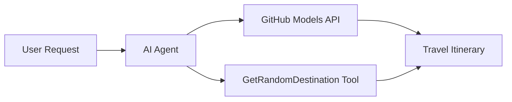

<!--
CO_OP_TRANSLATOR_METADATA:
{
  "original_hash": "5f351412e934f0833c8c821a0a60efaf",
  "translation_date": "2025-11-13T13:02:52+00:00",
  "source_file": "01-intro-to-ai-agents/code_samples/01-dotnet-agent-framework.md",
  "language_code": "nl"
}
-->
# 🌍 AI Reisagent met Microsoft Agent Framework (.NET)

## 📋 Scenario-overzicht

Dit voorbeeld laat zien hoe je een intelligente reisplanner kunt bouwen met behulp van het Microsoft Agent Framework voor .NET. De agent kan automatisch gepersonaliseerde dagtriproutes genereren voor willekeurige bestemmingen over de hele wereld.

### Belangrijkste mogelijkheden:

- 🎲 **Willekeurige bestemmingskeuze**: Gebruikt een aangepaste tool om vakantiebestemmingen te selecteren
- 🗺️ **Intelligente reisplanning**: Creëert gedetailleerde dag-tot-dag routes
- 🔄 **Realtime streaming**: Ondersteunt zowel directe als streaming-antwoorden
- 🛠️ **Integratie van aangepaste tools**: Laat zien hoe je de mogelijkheden van de agent kunt uitbreiden

## 🔧 Technische architectuur

### Kerntechnologieën

- **Microsoft Agent Framework**: De nieuwste .NET-implementatie voor AI-agentontwikkeling
- **GitHub Models-integratie**: Maakt gebruik van de AI-modelinferenceservice van GitHub
- **OpenAI API-compatibiliteit**: Benut OpenAI-clientbibliotheken met aangepaste eindpunten
- **Veilige configuratie**: API-sleutelbeheer op basis van omgevingsvariabelen

### Belangrijke componenten

1. **AIAgent**: De belangrijkste agent-orkestrator die de gespreksstroom beheert
2. **Aangepaste tools**: `GetRandomDestination()`-functie beschikbaar voor de agent
3. **Chatclient**: Gespreksinterface ondersteund door GitHub Models
4. **Streamingondersteuning**: Mogelijkheden voor realtime antwoordgeneratie

### Integratiepatroon



## 🚀 Aan de slag

### Vereisten

- [.NET 10 SDK](https://dotnet.microsoft.com/download/dotnet/10.0) of hoger
- [GitHub Models API-toegangstoken](https://docs.github.com/github-models/github-models-at-scale/using-your-own-api-keys-in-github-models)

### Vereiste omgevingsvariabelen

```bash
# zsh/bash
export GH_TOKEN=<your_github_token>
export GH_ENDPOINT=https://models.github.ai/inference
export GH_MODEL_ID=openai/gpt-5-mini
```

```powershell
# PowerShell
$env:GH_TOKEN = "<your_github_token>"
$env:GH_ENDPOINT = "https://models.github.ai/inference"
$env:GH_MODEL_ID = "openai/gpt-5-mini"
```

### Voorbeeldcode

Om het codevoorbeeld uit te voeren,

```bash
# zsh/bash
chmod +x ./01-dotnet-agent-framework.cs
./01-dotnet-agent-framework.cs
```

Of gebruik de dotnet CLI:

```bash
dotnet run ./01-dotnet-agent-framework.cs
```

Zie [`01-dotnet-agent-framework.cs`](../../../../01-intro-to-ai-agents/code_samples/01-dotnet-agent-framework.cs) voor de volledige code.

```csharp
#!/usr/bin/dotnet run

#:package Microsoft.Extensions.AI@9.*
#:package Microsoft.Agents.AI.OpenAI@1.*-*

using System.ClientModel;
using System.ComponentModel;

using Microsoft.Agents.AI;
using Microsoft.Extensions.AI;

using OpenAI;

// Tool Function: Random Destination Generator
// This static method will be available to the agent as a callable tool
// The [Description] attribute helps the AI understand when to use this function
// This demonstrates how to create custom tools for AI agents
[Description("Provides a random vacation destination.")]
static string GetRandomDestination()
{
    // List of popular vacation destinations around the world
    // The agent will randomly select from these options
    var destinations = new List<string>
    {
        "Paris, France",
        "Tokyo, Japan",
        "New York City, USA",
        "Sydney, Australia",
        "Rome, Italy",
        "Barcelona, Spain",
        "Cape Town, South Africa",
        "Rio de Janeiro, Brazil",
        "Bangkok, Thailand",
        "Vancouver, Canada"
    };

    // Generate random index and return selected destination
    // Uses System.Random for simple random selection
    var random = new Random();
    int index = random.Next(destinations.Count);
    return destinations[index];
}

// Extract configuration from environment variables
// Retrieve the GitHub Models API endpoint, defaults to https://models.github.ai/inference if not specified
// Retrieve the model ID, defaults to openai/gpt-5-mini if not specified
// Retrieve the GitHub token for authentication, throws exception if not specified
var github_endpoint = Environment.GetEnvironmentVariable("GH_ENDPOINT") ?? "https://models.github.ai/inference";
var github_model_id = Environment.GetEnvironmentVariable("GH_MODEL_ID") ?? "openai/gpt-5-mini";
var github_token = Environment.GetEnvironmentVariable("GH_TOKEN") ?? throw new InvalidOperationException("GH_TOKEN is not set.");

// Configure OpenAI Client Options
// Create configuration options to point to GitHub Models endpoint
// This redirects OpenAI client calls to GitHub's model inference service
var openAIOptions = new OpenAIClientOptions()
{
    Endpoint = new Uri(github_endpoint)
};

// Initialize OpenAI Client with GitHub Models Configuration
// Create OpenAI client using GitHub token for authentication
// Configure it to use GitHub Models endpoint instead of OpenAI directly
var openAIClient = new OpenAIClient(new ApiKeyCredential(github_token), openAIOptions);

// Create AI Agent with Travel Planning Capabilities
// Initialize OpenAI client, get chat client for specified model, and create AI agent
// Configure agent with travel planning instructions and random destination tool
// The agent can now plan trips using the GetRandomDestination function
AIAgent agent = openAIClient
    .GetChatClient(github_model_id)
    .CreateAIAgent(
        instructions: "You are a helpful AI Agent that can help plan vacations for customers at random destinations",
        tools: [AIFunctionFactory.Create(GetRandomDestination)]
    );

// Execute Agent: Plan a Day Trip
// Run the agent with streaming enabled for real-time response display
// Shows the agent's thinking and response as it generates the content
// Provides better user experience with immediate feedback
await foreach (var update in agent.RunStreamingAsync("Plan me a day trip"))
{
    await Task.Delay(10);
    Console.Write(update);
}
```

## 🎓 Belangrijke inzichten

1. **Agentarchitectuur**: Het Microsoft Agent Framework biedt een duidelijke, type-veilige aanpak voor het bouwen van AI-agents in .NET
2. **Toolintegratie**: Functies met `[Description]`-attributen worden beschikbaar als tools voor de agent
3. **Configuratiebeheer**: Omgevingsvariabelen en veilige referentiebeheer volgen de beste praktijken van .NET
4. **OpenAI-compatibiliteit**: GitHub Models-integratie werkt naadloos via OpenAI-compatibele API's

## 🔗 Aanvullende bronnen

- [Microsoft Agent Framework-documentatie](https://learn.microsoft.com/agent-framework)
- [GitHub Models Marketplace](https://github.com/marketplace?type=models)
- [Microsoft.Extensions.AI](https://learn.microsoft.com/dotnet/ai/microsoft-extensions-ai)
- [.NET Single File Apps](https://devblogs.microsoft.com/dotnet/announcing-dotnet-run-app)

---

<!-- CO-OP TRANSLATOR DISCLAIMER START -->
**Disclaimer**:  
Dit document is vertaald met behulp van de AI-vertalingsservice [Co-op Translator](https://github.com/Azure/co-op-translator). Hoewel we streven naar nauwkeurigheid, dient u zich ervan bewust te zijn dat geautomatiseerde vertalingen fouten of onnauwkeurigheden kunnen bevatten. Het originele document in de oorspronkelijke taal moet worden beschouwd als de gezaghebbende bron. Voor kritieke informatie wordt professionele menselijke vertaling aanbevolen. Wij zijn niet aansprakelijk voor eventuele misverstanden of verkeerde interpretaties die voortvloeien uit het gebruik van deze vertaling.
<!-- CO-OP TRANSLATOR DISCLAIMER END -->