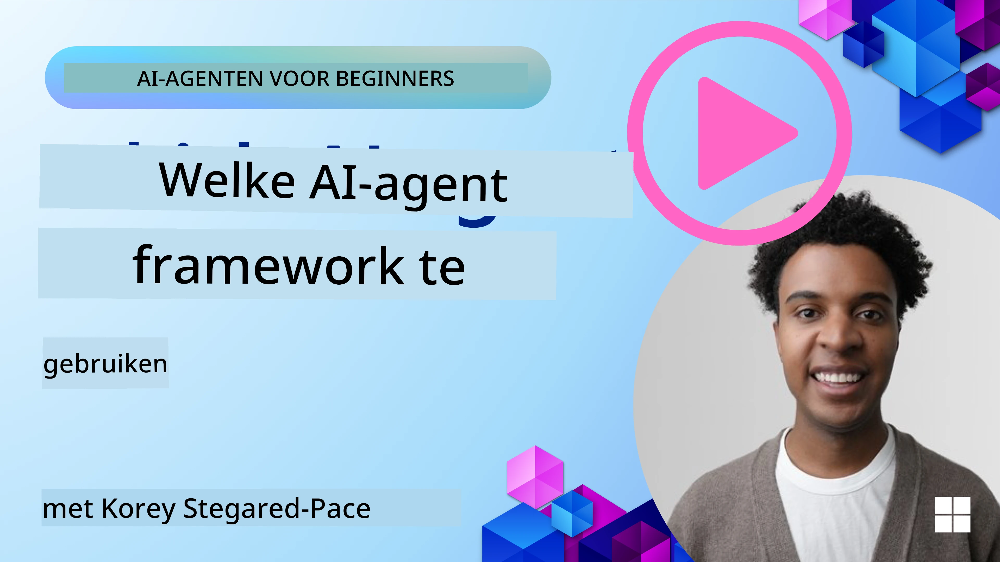

<!--
CO_OP_TRANSLATOR_METADATA:
{
  "original_hash": "7120197753abacc827b64ac2d5d6966f",
  "translation_date": "2025-11-13T13:04:10+00:00",
  "source_file": "02-explore-agentic-frameworks/README.md",
  "language_code": "nl"
}
-->
[](https://youtu.be/ODwF-EZo_O8?si=1xoy_B9RNQfrYdF7)

> _(Klik op de afbeelding hierboven om de video van deze les te bekijken)_

# AI Agent Frameworks Verkennen

AI agent frameworks zijn softwareplatforms die zijn ontworpen om het creëren, implementeren en beheren van AI-agenten te vereenvoudigen. Deze frameworks bieden ontwikkelaars vooraf gebouwde componenten, abstracties en tools die het ontwikkelen van complexe AI-systemen stroomlijnen.

Deze frameworks helpen ontwikkelaars zich te concentreren op de unieke aspecten van hun toepassingen door gestandaardiseerde benaderingen te bieden voor veelvoorkomende uitdagingen in AI-agentontwikkeling. Ze verbeteren de schaalbaarheid, toegankelijkheid en efficiëntie bij het bouwen van AI-systemen.

## Introductie 

Deze les behandelt:

- Wat zijn AI Agent Frameworks en wat stellen ze ontwikkelaars in staat te bereiken?
- Hoe kunnen teams deze gebruiken om snel prototypes te maken, itereren en de capaciteiten van hun agent verbeteren?
- Wat zijn de verschillen tussen de frameworks en tools ontwikkeld door Microsoft <a href="https://aka.ms/ai-agents/autogen" target="_blank">AutoGen</a>, <a href="https://aka.ms/ai-agents-beginners/semantic-kernel" target="_blank">Semantic Kernel</a>, en <a href="https://aka.ms/ai-agents-beginners/ai-agent-service" target="_blank">Azure AI Agent Service</a>?
- Kan ik mijn bestaande Azure-ecosysteemtools direct integreren, of heb ik aparte oplossingen nodig?
- Wat is de Azure AI Agents-service en hoe helpt deze mij?

## Leerdoelen

De doelen van deze les zijn om je te helpen begrijpen:

- De rol van AI Agent Frameworks in AI-ontwikkeling.
- Hoe je AI Agent Frameworks kunt benutten om intelligente agenten te bouwen.
- Belangrijke mogelijkheden die worden geboden door AI Agent Frameworks.
- De verschillen tussen AutoGen, Semantic Kernel en Azure AI Agent Service.

## Wat zijn AI Agent Frameworks en wat stellen ze ontwikkelaars in staat te doen?

Traditionele AI Frameworks kunnen je helpen AI in je apps te integreren en deze apps op de volgende manieren te verbeteren:

- **Personalisatie**: AI kan gebruikersgedrag en voorkeuren analyseren om gepersonaliseerde aanbevelingen, inhoud en ervaringen te bieden.
Voorbeeld: Streamingdiensten zoals Netflix gebruiken AI om films en series aan te bevelen op basis van kijkgeschiedenis, wat de gebruikersbetrokkenheid en tevredenheid verhoogt.
- **Automatisering en Efficiëntie**: AI kan repetitieve taken automatiseren, workflows stroomlijnen en operationele efficiëntie verbeteren.
Voorbeeld: Klantenservice-apps gebruiken AI-aangedreven chatbots om veelvoorkomende vragen af te handelen, waardoor reactietijden worden verkort en menselijke medewerkers meer tijd hebben voor complexere problemen.
- **Verbeterde Gebruikerservaring**: AI kan de algehele gebruikerservaring verbeteren door intelligente functies zoals spraakherkenning, natuurlijke taalverwerking en voorspellende tekst te bieden.
Voorbeeld: Virtuele assistenten zoals Siri en Google Assistant gebruiken AI om spraakopdrachten te begrijpen en erop te reageren, waardoor het voor gebruikers gemakkelijker wordt om met hun apparaten te communiceren.

### Dat klinkt allemaal geweldig, toch? Dus waarom hebben we AI Agent Frameworks nodig?

AI Agent Frameworks gaan verder dan alleen AI-frameworks. Ze zijn ontworpen om de creatie van intelligente agenten mogelijk te maken die kunnen communiceren met gebruikers, andere agenten en de omgeving om specifieke doelen te bereiken. Deze agenten kunnen autonoom gedrag vertonen, beslissingen nemen en zich aanpassen aan veranderende omstandigheden. Laten we enkele belangrijke mogelijkheden bekijken die worden geboden door AI Agent Frameworks:

- **Samenwerking en Coördinatie tussen Agenten**: Mogelijkheid om meerdere AI-agenten te creëren die samen kunnen werken, communiceren en coördineren om complexe taken op te lossen.
- **Taakautomatisering en Beheer**: Mechanismen bieden voor het automatiseren van meerstaps-workflows, taakdelegatie en dynamisch taakbeheer tussen agenten.
- **Contextueel Begrip en Aanpassing**: Agenten uitrusten met de mogelijkheid om context te begrijpen, zich aan te passen aan veranderende omgevingen en beslissingen te nemen op basis van realtime informatie.

Kortom, agenten stellen je in staat meer te doen, automatisering naar een hoger niveau te tillen en intelligentere systemen te creëren die kunnen leren en zich aanpassen aan hun omgeving.

## Hoe snel prototypes maken, itereren en de capaciteiten van de agent verbeteren?

Dit is een snel veranderend landschap, maar er zijn enkele gemeenschappelijke kenmerken van de meeste AI Agent Frameworks die je kunnen helpen snel prototypes te maken en te itereren, namelijk modulaire componenten, collaboratieve tools en realtime leren. Laten we hier dieper op ingaan:

- **Gebruik Modulaire Componenten**: AI SDK's bieden vooraf gebouwde componenten zoals AI- en geheugenconnectors, functieaanroepen met natuurlijke taal of code-plugins, prompttemplates en meer.
- **Benut Collaboratieve Tools**: Ontwerp agenten met specifieke rollen en taken, zodat ze collaboratieve workflows kunnen testen en verfijnen.
- **Leer in Realtime**: Implementeer feedbackloops waarin agenten leren van interacties en hun gedrag dynamisch aanpassen.

### Gebruik Modulaire Componenten

SDK's zoals Microsoft Semantic Kernel en LangChain bieden vooraf gebouwde componenten zoals AI-connectors, prompttemplates en geheugenbeheer.

**Hoe teams deze kunnen gebruiken**: Teams kunnen deze componenten snel samenstellen om een functioneel prototype te creëren zonder vanaf nul te beginnen, wat snelle experimenten en iteratie mogelijk maakt.

**Hoe het in de praktijk werkt**: Je kunt een vooraf gebouwde parser gebruiken om informatie uit gebruikersinvoer te halen, een geheugenmodule om gegevens op te slaan en op te halen, en een promptgenerator om met gebruikers te communiceren, allemaal zonder deze componenten zelf te hoeven bouwen.

**Voorbeeldcode**. Laten we voorbeelden bekijken van hoe je een vooraf gebouwde AI Connector kunt gebruiken met Semantic Kernel Python en .Net die automatische functieaanroepen gebruikt om het model te laten reageren op gebruikersinvoer:

``` python
# Semantic Kernel Python Example

import asyncio
from typing import Annotated

from semantic_kernel.connectors.ai import FunctionChoiceBehavior
from semantic_kernel.connectors.ai.open_ai import AzureChatCompletion, AzureChatPromptExecutionSettings
from semantic_kernel.contents import ChatHistory
from semantic_kernel.functions import kernel_function
from semantic_kernel.kernel import Kernel

# Define a ChatHistory object to hold the conversation's context
chat_history = ChatHistory()
chat_history.add_user_message("I'd like to go to New York on January 1, 2025")


# Define a sample plugin that contains the function to book travel
class BookTravelPlugin:
    """A Sample Book Travel Plugin"""

    @kernel_function(name="book_flight", description="Book travel given location and date")
    async def book_flight(
        self, date: Annotated[str, "The date of travel"], location: Annotated[str, "The location to travel to"]
    ) -> str:
        return f"Travel was booked to {location} on {date}"

# Create the Kernel
kernel = Kernel()

# Add the sample plugin to the Kernel object
kernel.add_plugin(BookTravelPlugin(), plugin_name="book_travel")

# Define the Azure OpenAI AI Connector
chat_service = AzureChatCompletion(
    deployment_name="YOUR_DEPLOYMENT_NAME", 
    api_key="YOUR_API_KEY", 
    endpoint="https://<your-resource>.azure.openai.com/",
)

# Define the request settings to configure the model with auto-function calling
request_settings = AzureChatPromptExecutionSettings(function_choice_behavior=FunctionChoiceBehavior.Auto())


async def main():
    # Make the request to the model for the given chat history and request settings
    # The Kernel contains the sample that the model will request to invoke
    response = await chat_service.get_chat_message_content(
        chat_history=chat_history, settings=request_settings, kernel=kernel
    )
    assert response is not None

    """
    Note: In the auto function calling process, the model determines it can invoke the 
    `BookTravelPlugin` using the `book_flight` function, supplying the necessary arguments. 
    
    For example:

    "tool_calls": [
        {
            "id": "call_abc123",
            "type": "function",
            "function": {
                "name": "BookTravelPlugin-book_flight",
                "arguments": "{'location': 'New York', 'date': '2025-01-01'}"
            }
        }
    ]

    Since the location and date arguments are required (as defined by the kernel function), if the 
    model lacks either, it will prompt the user to provide them. For instance:

    User: Book me a flight to New York.
    Model: Sure, I'd love to help you book a flight. Could you please specify the date?
    User: I want to travel on January 1, 2025.
    Model: Your flight to New York on January 1, 2025, has been successfully booked. Safe travels!
    """

    print(f"`{response}`")
    # Example AI Model Response: `Your flight to New York on January 1, 2025, has been successfully booked. Safe travels! ✈️🗽`

    # Add the model's response to our chat history context
    chat_history.add_assistant_message(response.content)


if __name__ == "__main__":
    asyncio.run(main())
```
```csharp
// Semantic Kernel C# example

using Microsoft.SemanticKernel;
using Microsoft.SemanticKernel.ChatCompletion;
using System.ComponentModel;
using Microsoft.SemanticKernel.Connectors.AzureOpenAI;

ChatHistory chatHistory = [];
chatHistory.AddUserMessage("I'd like to go to New York on January 1, 2025");

var kernelBuilder = Kernel.CreateBuilder();
kernelBuilder.AddAzureOpenAIChatCompletion(
    deploymentName: "NAME_OF_YOUR_DEPLOYMENT",
    apiKey: "YOUR_API_KEY",
    endpoint: "YOUR_AZURE_ENDPOINT"
);
kernelBuilder.Plugins.AddFromType<BookTravelPlugin>("BookTravel"); 
var kernel = kernelBuilder.Build();

var settings = new AzureOpenAIPromptExecutionSettings()
{
    FunctionChoiceBehavior = FunctionChoiceBehavior.Auto()
};

var chatCompletion = kernel.GetRequiredService<IChatCompletionService>();

var response = await chatCompletion.GetChatMessageContentAsync(chatHistory, settings, kernel);

/*
Behind the scenes, the model recognizes the tool to call, what arguments it already has (location) and (date)
{

"tool_calls": [
    {
        "id": "call_abc123",
        "type": "function",
        "function": {
            "name": "BookTravelPlugin-book_flight",
            "arguments": "{'location': 'New York', 'date': '2025-01-01'}"
        }
    }
]
*/

Console.WriteLine(response.Content);
chatHistory.AddMessage(response!.Role, response!.Content!);

// Example AI Model Response: Your flight to New York on January 1, 2025, has been successfully booked. Safe travels! ✈️🗽

// Define a plugin that contains the function to book travel
public class BookTravelPlugin
{
    [KernelFunction("book_flight")]
    [Description("Book travel given location and date")]
    public async Task<string> BookFlight(DateTime date, string location)
    {
        return await Task.FromResult( $"Travel was booked to {location} on {date}");
    }
}
```

Wat je in dit voorbeeld ziet, is hoe je een vooraf gebouwde parser kunt gebruiken om belangrijke informatie uit gebruikersinvoer te halen, zoals de herkomst, bestemming en datum van een vluchtboekingsverzoek. Deze modulaire aanpak stelt je in staat je te concentreren op de hogere logica.

### Benut Collaboratieve Tools

Frameworks zoals CrewAI, Microsoft AutoGen en Semantic Kernel faciliteren de creatie van meerdere agenten die samen kunnen werken.

**Hoe teams deze kunnen gebruiken**: Teams kunnen agenten ontwerpen met specifieke rollen en taken, zodat ze collaboratieve workflows kunnen testen en verfijnen en de algehele systeemefficiëntie kunnen verbeteren.

**Hoe het in de praktijk werkt**: Je kunt een team van agenten creëren waarbij elke agent een gespecialiseerde functie heeft, zoals gegevens ophalen, analyseren of beslissingen nemen. Deze agenten kunnen communiceren en informatie delen om een gemeenschappelijk doel te bereiken, zoals het beantwoorden van een gebruikersvraag of het voltooien van een taak.

**Voorbeeldcode (AutoGen)**:

```python
# creating agents, then create a round robin schedule where they can work together, in this case in order

# Data Retrieval Agent
# Data Analysis Agent
# Decision Making Agent

agent_retrieve = AssistantAgent(
    name="dataretrieval",
    model_client=model_client,
    tools=[retrieve_tool],
    system_message="Use tools to solve tasks."
)

agent_analyze = AssistantAgent(
    name="dataanalysis",
    model_client=model_client,
    tools=[analyze_tool],
    system_message="Use tools to solve tasks."
)

# conversation ends when user says "APPROVE"
termination = TextMentionTermination("APPROVE")

user_proxy = UserProxyAgent("user_proxy", input_func=input)

team = RoundRobinGroupChat([agent_retrieve, agent_analyze, user_proxy], termination_condition=termination)

stream = team.run_stream(task="Analyze data", max_turns=10)
# Use asyncio.run(...) when running in a script.
await Console(stream)
```

Wat je in de vorige code ziet, is hoe je een taak kunt creëren waarbij meerdere agenten samenwerken om gegevens te analyseren. Elke agent voert een specifieke functie uit, en de taak wordt uitgevoerd door de agenten te coördineren om het gewenste resultaat te bereiken. Door toegewijde agenten met gespecialiseerde rollen te creëren, kun je de efficiëntie en prestaties van taken verbeteren.

### Leer in Realtime

Geavanceerde frameworks bieden mogelijkheden voor realtime contextbegrip en aanpassing.

**Hoe teams deze kunnen gebruiken**: Teams kunnen feedbackloops implementeren waarin agenten leren van interacties en hun gedrag dynamisch aanpassen, wat leidt tot voortdurende verbetering en verfijning van capaciteiten.

**Hoe het in de praktijk werkt**: Agenten kunnen gebruikersfeedback, omgevingsgegevens en taakresultaten analyseren om hun kennisbasis bij te werken, besluitvormingsalgoritmen aan te passen en prestaties in de loop van de tijd te verbeteren. Dit iteratieve leerproces stelt agenten in staat zich aan te passen aan veranderende omstandigheden en gebruikersvoorkeuren, waardoor de algehele systeemeffectiviteit wordt verbeterd.

## Wat zijn de verschillen tussen de frameworks AutoGen, Semantic Kernel en Azure AI Agent Service?

Er zijn veel manieren om deze frameworks te vergelijken, maar laten we enkele belangrijke verschillen bekijken op het gebied van ontwerp, mogelijkheden en beoogde gebruiksscenario's:

## AutoGen

AutoGen is een open-source framework ontwikkeld door Microsoft Research's AI Frontiers Lab. Het richt zich op event-driven, gedistribueerde *agentic* toepassingen, waarbij meerdere LLM's en SLM's, tools en geavanceerde multi-agent ontwerpmodellen worden ondersteund.

AutoGen is gebouwd rond het kernconcept van agenten, autonome entiteiten die hun omgeving kunnen waarnemen, beslissingen kunnen nemen en acties kunnen ondernemen om specifieke doelen te bereiken. Agenten communiceren via asynchrone berichten, waardoor ze onafhankelijk en parallel kunnen werken, wat de schaalbaarheid en responsiviteit van het systeem verbetert.

<a href="https://en.wikipedia.org/wiki/Actor_model" target="_blank">Agenten zijn gebaseerd op het actormodel</a>. Volgens Wikipedia is een actor _het fundamentele bouwblok van gelijktijdige berekening. In reactie op een ontvangen bericht kan een actor: lokale beslissingen nemen, meer actoren creëren, meer berichten verzenden en bepalen hoe te reageren op het volgende ontvangen bericht_.

**Gebruiksscenario's**: Automatiseren van codegeneratie, data-analysetaken en het bouwen van aangepaste agenten voor plannings- en onderzoeksfuncties.

Hier zijn enkele belangrijke kernconcepten van AutoGen:

- **Agenten**. Een agent is een software-entiteit die:
  - **Communiceert via berichten**, deze berichten kunnen synchroon of asynchroon zijn.
  - **Beheert zijn eigen status**, die kan worden gewijzigd door inkomende berichten.
  - **Voert acties uit** in reactie op ontvangen berichten of wijzigingen in zijn status. Deze acties kunnen de status van de agent wijzigen en externe effecten veroorzaken, zoals het bijwerken van berichtlogboeken, het verzenden van nieuwe berichten, het uitvoeren van code of het maken van API-aanroepen.
    
  Hier is een korte codefragment waarin je je eigen agent met chatmogelijkheden creëert:

    ```python
    from autogen_agentchat.agents import AssistantAgent
    from autogen_agentchat.messages import TextMessage
    from autogen_ext.models.openai import OpenAIChatCompletionClient


    class MyAgent(RoutedAgent):
        def __init__(self, name: str) -> None:
            super().__init__(name)
            model_client = OpenAIChatCompletionClient(model="gpt-4o")
            self._delegate = AssistantAgent(name, model_client=model_client)
    
        @message_handler
        async def handle_my_message_type(self, message: MyMessageType, ctx: MessageContext) -> None:
            print(f"{self.id.type} received message: {message.content}")
            response = await self._delegate.on_messages(
                [TextMessage(content=message.content, source="user")], ctx.cancellation_token
            )
            print(f"{self.id.type} responded: {response.chat_message.content}")
    ```
    
    In de vorige code is `MyAgent` gemaakt en erft van `RoutedAgent`. Het heeft een berichtverwerker die de inhoud van het bericht afdrukt en vervolgens een reactie verzendt met behulp van de `AssistantAgent` delegate. Let vooral op hoe we aan `self._delegate` een instantie van `AssistantAgent` toewijzen, een vooraf gebouwde agent die chatcompletions kan verwerken.


    Laten we AutoGen informeren over dit type agent en het programma starten:

    ```python
    
    # main.py
    runtime = SingleThreadedAgentRuntime()
    await MyAgent.register(runtime, "my_agent", lambda: MyAgent())

    runtime.start()  # Start processing messages in the background.
    await runtime.send_message(MyMessageType("Hello, World!"), AgentId("my_agent", "default"))
    ```

    In de vorige code worden de agenten geregistreerd bij de runtime en vervolgens wordt een bericht naar de agent verzonden, wat resulteert in de volgende uitvoer:

    ```text
    # Output from the console:
    my_agent received message: Hello, World!
    my_assistant received message: Hello, World!
    my_assistant responded: Hello! How can I assist you today?
    ```

- **Multi-agenten**. AutoGen ondersteunt de creatie van meerdere agenten die samen kunnen werken om complexe taken uit te voeren. Agenten kunnen communiceren, informatie delen en hun acties coördineren om problemen efficiënter op te lossen. Om een multi-agentsysteem te creëren, kun je verschillende soorten agenten definiëren met gespecialiseerde functies en rollen, zoals gegevens ophalen, analyseren, beslissingen nemen en gebruikersinteractie. Laten we eens kijken hoe zo'n creatie eruitziet:

    ```python
    editor_description = "Editor for planning and reviewing the content."

    # Example of declaring an Agent
    editor_agent_type = await EditorAgent.register(
    runtime,
    editor_topic_type,  # Using topic type as the agent type.
    lambda: EditorAgent(
        description=editor_description,
        group_chat_topic_type=group_chat_topic_type,
        model_client=OpenAIChatCompletionClient(
            model="gpt-4o-2024-08-06",
            # api_key="YOUR_API_KEY",
        ),
        ),
    )

    # remaining declarations shortened for brevity

    # Group chat
    group_chat_manager_type = await GroupChatManager.register(
    runtime,
    "group_chat_manager",
    lambda: GroupChatManager(
        participant_topic_types=[writer_topic_type, illustrator_topic_type, editor_topic_type, user_topic_type],
        model_client=OpenAIChatCompletionClient(
            model="gpt-4o-2024-08-06",
            # api_key="YOUR_API_KEY",
        ),
        participant_descriptions=[
            writer_description, 
            illustrator_description, 
            editor_description, 
            user_description
        ],
        ),
    )
    ```

    In de vorige code hebben we een `GroupChatManager` die is geregistreerd bij de runtime. Deze manager is verantwoordelijk voor het coördineren van de interacties tussen verschillende soorten agenten, zoals schrijvers, illustratoren, redacteuren en gebruikers.

- **Agent Runtime**. Het framework biedt een runtime-omgeving, waarmee communicatie tussen agenten mogelijk wordt gemaakt, hun identiteiten en levenscycli worden beheerd, en beveiligings- en privacygrenzen worden gehandhaafd. Dit betekent dat je je agenten kunt uitvoeren in een veilige en gecontroleerde omgeving, zodat ze veilig en efficiënt kunnen communiceren. Er zijn twee interessante runtimes:
  - **Stand-alone runtime**. Dit is een goede keuze voor single-process toepassingen waarbij alle agenten in dezelfde programmeertaal zijn geïmplementeerd en in hetzelfde proces worden uitgevoerd. Hier is een illustratie van hoe het werkt:
  
    <a href="https://microsoft.github.io/autogen/stable/_images/architecture-standalone.svg" target="_blank">Stand-alone runtime</a>   
Applicatiestack

    *agenten communiceren via berichten via de runtime, en de runtime beheert de levenscyclus van agenten*

  - **Gedistribueerde agent runtime**, is geschikt voor multi-process toepassingen waarbij agenten mogelijk in verschillende programmeertalen zijn geïmplementeerd en op verschillende machines draaien. Hier is een illustratie van hoe het werkt:
  
    <a href="https://microsoft.github.io/autogen/stable/_images/architecture-distributed.svg" target="_blank">Gedistribueerde runtime</a>

## Semantic Kernel + Agent Framework

Semantic Kernel is een enterprise-ready AI Orchestration SDK. Het bestaat uit AI- en geheugenconnectors, samen met een Agent Framework.

Laten we eerst enkele kerncomponenten behandelen:

- **AI Connectors**: Dit is een interface met externe AI-services en gegevensbronnen voor gebruik in zowel Python als C#.

  ```python
  # Semantic Kernel Python
  from semantic_kernel.connectors.ai.open_ai import AzureChatCompletion
  from semantic_kernel.kernel import Kernel

  kernel = Kernel()
  kernel.add_service(
    AzureChatCompletion(
        deployment_name="your-deployment-name",
        api_key="your-api-key",
        endpoint="your-endpoint",
    )
  )
  ```  

    ```csharp
    // Semantic Kernel C#
    using Microsoft.SemanticKernel;

    // Create kernel
    var builder = Kernel.CreateBuilder();
    
    // Add a chat completion service:
    builder.Services.AddAzureOpenAIChatCompletion(
        "your-resource-name",
        "your-endpoint",
        "your-resource-key",
        "deployment-model");
    var kernel = builder.Build();
    ```

    Hier heb je een eenvoudig voorbeeld van hoe je een kernel kunt maken en een chatcompletionservice kunt toevoegen. Semantic Kernel maakt een verbinding met een externe AI-service, in dit geval Azure OpenAI Chat Completion.

- **Plugins**: Deze encapsuleren functies die een toepassing kan gebruiken. Er zijn zowel kant-en-klare plugins als aangepaste plugins die je kunt maken. Een gerelateerd concept is "promptfuncties." In plaats van natuurlijke taal aanwijzingen te geven voor functieaanroep, zend je bepaalde functies uit naar het model. Op basis van de huidige chatcontext kan het model ervoor kiezen een van deze functies aan te roepen om een verzoek of vraag te voltooien. Hier is een voorbeeld:

  ```python
  from semantic_kernel.connectors.ai.open_ai.services.azure_chat_completion import AzureChatCompletion


  async def main():
      from semantic_kernel.functions import KernelFunctionFromPrompt
      from semantic_kernel.kernel import Kernel

      kernel = Kernel()
      kernel.add_service(AzureChatCompletion())

      user_input = input("User Input:> ")

      kernel_function = KernelFunctionFromPrompt(
          function_name="SummarizeText",
          prompt="""
          Summarize the provided unstructured text in a sentence that is easy to understand.
          Text to summarize: {{$user_input}}
          """,
      )

      response = await kernel_function.invoke(kernel=kernel, user_input=user_input)
      print(f"Model Response: {response}")

      """
      Sample Console Output:

      User Input:> I like dogs
      Model Response: The text expresses a preference for dogs.
      """


  if __name__ == "__main__":
    import asyncio
    asyncio.run(main())
  ```

    ```csharp
    var userInput = Console.ReadLine();

    // Define semantic function inline.
    string skPrompt = @"Summarize the provided unstructured text in a sentence that is easy to understand.
                        Text to summarize: {{$userInput}}";
    
    // create the function from the prompt
    KernelFunction summarizeFunc = kernel.CreateFunctionFromPrompt(
        promptTemplate: skPrompt,
        functionName: "SummarizeText"
    );

    //then import into the current kernel
    kernel.ImportPluginFromFunctions("SemanticFunctions", [summarizeFunc]);

    ```

    Hier heb je eerst een templateprompt `skPrompt` die ruimte laat voor de gebruiker om tekst in te voeren, `$userInput`. Vervolgens creëer je de kernelfunctie `SummarizeText` en importeer je deze in de kernel met de pluginnaam `SemanticFunctions`. Let op de naam van de functie die Semantic Kernel helpt begrijpen wat de functie doet en wanneer deze moet worden aangeroepen.

- **Native functie**: Er zijn ook native functies die het framework direct kan aanroepen om de taak uit te voeren. Hier is een voorbeeld van zo'n functie die de inhoud van een bestand ophaalt:

    ```csharp
    public class NativeFunctions {

        [SKFunction, Description("Retrieve content from local file")]
        public async Task<string> RetrieveLocalFile(string fileName, int maxSize = 5000)
        {
            string content = await File.ReadAllTextAsync(fileName);
            if (content.Length <= maxSize) return content;
            return content.Substring(0, maxSize);
        }
    }
    
    //Import native function
    string plugInName = "NativeFunction";
    string functionName = "RetrieveLocalFile";

   //To add the functions to a kernel use the following function
    kernel.ImportPluginFromType<NativeFunctions>();

    ```

- **Geheugen**: Abstraheert en vereenvoudigt contextbeheer voor AI-apps. Het idee van geheugen is dat dit iets is waar de LLM van op de hoogte moet zijn. Je kunt deze informatie opslaan in een vectorstore, wat uiteindelijk een in-memory database of een vectordatabase of iets dergelijks is. Hier is een voorbeeld van een zeer vereenvoudigd scenario waarin *feiten* aan het geheugen worden toegevoegd:

    ```csharp
    var facts = new Dictionary<string,string>();
    facts.Add(
        "Azure Machine Learning; https://learn.microsoft.com/azure/machine-learning/",
        @"Azure Machine Learning is a cloud service for accelerating and
        managing the machine learning project lifecycle. Machine learning professionals,
        data scientists, and engineers can use it in their day-to-day workflows"
    );
    
    facts.Add(
        "Azure SQL Service; https://learn.microsoft.com/azure/azure-sql/",
        @"Azure SQL is a family of managed, secure, and intelligent products
        that use the SQL Server database engine in the Azure cloud."
    );
    
    string memoryCollectionName = "SummarizedAzureDocs";
    
    foreach (var fact in facts) {
        await memoryBuilder.SaveReferenceAsync(
            collection: memoryCollectionName,
            description: fact.Key.Split(";")[1].Trim(),
            text: fact.Value,
            externalId: fact.Key.Split(";")[2].Trim(),
            externalSourceName: "Azure Documentation"
        );
    }
    ```

Deze feiten worden vervolgens opgeslagen in de geheugenverzameling `SummarizedAzureDocs`. Dit is een zeer vereenvoudigd voorbeeld, maar je kunt zien hoe je informatie in het geheugen kunt opslaan voor gebruik door de LLM.

Dat zijn de basisprincipes van het Semantic Kernel-framework, maar hoe zit het met het Agent Framework?

## Azure AI Agent Service

Azure AI Agent Service is een recentere toevoeging, geïntroduceerd tijdens Microsoft Ignite 2024. Het stelt je in staat om AI-agents te ontwikkelen en implementeren met flexibelere modellen, zoals het direct aanroepen van open-source LLM's zoals Llama 3, Mistral en Cohere.

Azure AI Agent Service biedt sterkere beveiligingsmechanismen en methoden voor gegevensopslag, waardoor het geschikt is voor zakelijke toepassingen.

Het werkt direct samen met multi-agent orkestratieframeworks zoals AutoGen en Semantic Kernel.

Deze service bevindt zich momenteel in Public Preview en ondersteunt Python en C# voor het bouwen van agents.

Met Semantic Kernel Python kunnen we een Azure AI Agent maken met een door de gebruiker gedefinieerde plugin:

```python
import asyncio
from typing import Annotated

from azure.identity.aio import DefaultAzureCredential

from semantic_kernel.agents import AzureAIAgent, AzureAIAgentSettings, AzureAIAgentThread
from semantic_kernel.contents import ChatMessageContent
from semantic_kernel.contents import AuthorRole
from semantic_kernel.functions import kernel_function


# Define a sample plugin for the sample
class MenuPlugin:
    """A sample Menu Plugin used for the concept sample."""

    @kernel_function(description="Provides a list of specials from the menu.")
    def get_specials(self) -> Annotated[str, "Returns the specials from the menu."]:
        return """
        Special Soup: Clam Chowder
        Special Salad: Cobb Salad
        Special Drink: Chai Tea
        """

    @kernel_function(description="Provides the price of the requested menu item.")
    def get_item_price(
        self, menu_item: Annotated[str, "The name of the menu item."]
    ) -> Annotated[str, "Returns the price of the menu item."]:
        return "$9.99"


async def main() -> None:
    ai_agent_settings = AzureAIAgentSettings.create()

    async with (
        DefaultAzureCredential() as creds,
        AzureAIAgent.create_client(
            credential=creds,
            conn_str=ai_agent_settings.project_connection_string.get_secret_value(),
        ) as client,
    ):
        # Create agent definition
        agent_definition = await client.agents.create_agent(
            model=ai_agent_settings.model_deployment_name,
            name="Host",
            instructions="Answer questions about the menu.",
        )

        # Create the AzureAI Agent using the defined client and agent definition
        agent = AzureAIAgent(
            client=client,
            definition=agent_definition,
            plugins=[MenuPlugin()],
        )

        # Create a thread to hold the conversation
        # If no thread is provided, a new thread will be
        # created and returned with the initial response
        thread: AzureAIAgentThread | None = None

        user_inputs = [
            "Hello",
            "What is the special soup?",
            "How much does that cost?",
            "Thank you",
        ]

        try:
            for user_input in user_inputs:
                print(f"# User: '{user_input}'")
                # Invoke the agent for the specified thread
                response = await agent.get_response(
                    messages=user_input,
                    thread_id=thread,
                )
                print(f"# {response.name}: {response.content}")
                thread = response.thread
        finally:
            await thread.delete() if thread else None
            await client.agents.delete_agent(agent.id)


if __name__ == "__main__":
    asyncio.run(main())
```

### Kernconcepten

Azure AI Agent Service heeft de volgende kernconcepten:

- **Agent**. Azure AI Agent Service integreert met Azure AI Foundry. Binnen AI Foundry fungeert een AI Agent als een "slimme" microservice die kan worden gebruikt om vragen te beantwoorden (RAG), acties uit te voeren of workflows volledig te automatiseren. Dit wordt bereikt door de kracht van generatieve AI-modellen te combineren met tools die toegang bieden tot en interactie mogelijk maken met gegevensbronnen uit de echte wereld. Hier is een voorbeeld van een agent:

    ```python
    agent = project_client.agents.create_agent(
        model="gpt-4o-mini",
        name="my-agent",
        instructions="You are helpful agent",
        tools=code_interpreter.definitions,
        tool_resources=code_interpreter.resources,
    )
    ```

    In dit voorbeeld wordt een agent gemaakt met het model `gpt-4o-mini`, een naam `my-agent`, en instructies `You are helpful agent`. De agent is uitgerust met tools en middelen om taken zoals code-interpretatie uit te voeren.

- **Thread en berichten**. De thread is een ander belangrijk concept. Het vertegenwoordigt een gesprek of interactie tussen een agent en een gebruiker. Threads kunnen worden gebruikt om de voortgang van een gesprek bij te houden, contextinformatie op te slaan en de status van de interactie te beheren. Hier is een voorbeeld van een thread:

    ```python
    thread = project_client.agents.create_thread()
    message = project_client.agents.create_message(
        thread_id=thread.id,
        role="user",
        content="Could you please create a bar chart for the operating profit using the following data and provide the file to me? Company A: $1.2 million, Company B: $2.5 million, Company C: $3.0 million, Company D: $1.8 million",
    )
    
    # Ask the agent to perform work on the thread
    run = project_client.agents.create_and_process_run(thread_id=thread.id, agent_id=agent.id)
    
    # Fetch and log all messages to see the agent's response
    messages = project_client.agents.list_messages(thread_id=thread.id)
    print(f"Messages: {messages}")
    ```

    In de bovenstaande code wordt een thread aangemaakt. Vervolgens wordt een bericht naar de thread gestuurd. Door `create_and_process_run` aan te roepen, wordt de agent gevraagd om werk uit te voeren op de thread. Ten slotte worden de berichten opgehaald en gelogd om de reactie van de agent te zien. De berichten geven de voortgang van het gesprek tussen de gebruiker en de agent aan. Het is ook belangrijk om te begrijpen dat de berichten van verschillende typen kunnen zijn, zoals tekst, afbeelding of bestand, wat betekent dat het werk van de agent bijvoorbeeld heeft geresulteerd in een afbeelding of een tekstreactie. Als ontwikkelaar kun je deze informatie vervolgens gebruiken om de reactie verder te verwerken of aan de gebruiker te presenteren.

- **Integratie met andere AI-frameworks**. Azure AI Agent Service kan samenwerken met andere frameworks zoals AutoGen en Semantic Kernel, wat betekent dat je een deel van je app in een van deze frameworks kunt bouwen en bijvoorbeeld de Agent Service kunt gebruiken als orkestrator, of je kunt alles in de Agent Service bouwen.

**Toepassingen**: Azure AI Agent Service is ontworpen voor zakelijke toepassingen die veilige, schaalbare en flexibele AI-agentimplementatie vereisen.

## Wat is het verschil tussen deze frameworks?

Het lijkt misschien alsof er veel overlap is tussen deze frameworks, maar er zijn enkele belangrijke verschillen in termen van ontwerp, mogelijkheden en beoogde toepassingen:

- **AutoGen**: Is een experimenteerframework gericht op geavanceerd onderzoek naar multi-agent systemen. Het is de beste keuze om te experimenteren en prototypen van geavanceerde multi-agent systemen te maken.
- **Semantic Kernel**: Is een productieklare agentbibliotheek voor het bouwen van zakelijke agenttoepassingen. Het richt zich op event-gedreven, gedistribueerde agenttoepassingen, waarbij meerdere LLM's en SLM's, tools en enkelvoudige/multi-agent ontwerpmodellen worden ondersteund.
- **Azure AI Agent Service**: Is een platform- en implementatieservice in Azure Foundry voor agents. Het biedt connectiviteit met services die door Azure Foundry worden ondersteund, zoals Azure OpenAI, Azure AI Search, Bing Search en code-uitvoering.

Nog steeds niet zeker welke je moet kiezen?

### Toepassingen

Laten we kijken of we je kunnen helpen door enkele veelvoorkomende toepassingen door te nemen:

> V: Ik ben aan het experimenteren, leren en het bouwen van proof-of-concept agenttoepassingen, en ik wil snel kunnen bouwen en experimenteren.
>

>A: AutoGen zou een goede keuze zijn voor dit scenario, omdat het zich richt op event-gedreven, gedistribueerde agenttoepassingen en geavanceerde multi-agent ontwerpmodellen ondersteunt.

> V: Wat maakt AutoGen een betere keuze dan Semantic Kernel en Azure AI Agent Service voor dit gebruiksscenario?
>
> A: AutoGen is specifiek ontworpen voor event-gedreven, gedistribueerde agenttoepassingen, waardoor het goed geschikt is voor het automatiseren van codegeneratie- en data-analysetaken. Het biedt de benodigde tools en mogelijkheden om complexe multi-agent systemen efficiënt te bouwen.

>V: Het lijkt erop dat Azure AI Agent Service hier ook zou kunnen werken, het heeft tools voor codegeneratie en meer?

>
> A: Ja, Azure AI Agent Service is een platformservice voor agents en biedt ingebouwde mogelijkheden voor meerdere modellen, Azure AI Search, Bing Search en Azure Functions. Het maakt het eenvoudig om je agents te bouwen in de Foundry Portal en ze op schaal te implementeren.

> V: Ik ben nog steeds in de war, geef me gewoon één optie.
>
> A: Een geweldige keuze is om je applicatie eerst in Semantic Kernel te bouwen en vervolgens Azure AI Agent Service te gebruiken om je agent te implementeren. Deze aanpak stelt je in staat om je agents eenvoudig te behouden terwijl je profiteert van de kracht om multi-agent systemen te bouwen in Semantic Kernel. Bovendien heeft Semantic Kernel een connector in AutoGen, waardoor het eenvoudig is om beide frameworks samen te gebruiken.

Laten we de belangrijkste verschillen samenvatten in een tabel:

| Framework | Focus | Kernconcepten | Toepassingen |
| --- | --- | --- | --- |
| AutoGen | Event-gedreven, gedistribueerde agenttoepassingen | Agents, Personas, Functies, Data | Codegeneratie, data-analysetaken |
| Semantic Kernel | Begrijpen en genereren van mensachtige tekstinhoud | Agents, Modulaire Componenten, Samenwerking | Natuurlijke taalbegrip, inhoudsgeneratie |
| Azure AI Agent Service | Flexibele modellen, zakelijke beveiliging, Codegeneratie, Toolaanroepen | Modulariteit, Samenwerking, Procesorkestratie | Veilige, schaalbare en flexibele AI-agentimplementatie |

Wat is de ideale toepassing voor elk van deze frameworks?

## Kan ik mijn bestaande Azure-ecosysteemtools direct integreren, of heb ik aparte oplossingen nodig?

Het antwoord is ja, je kunt je bestaande Azure-ecosysteemtools direct integreren met Azure AI Agent Service, vooral omdat het is gebouwd om naadloos samen te werken met andere Azure-services. Je zou bijvoorbeeld Bing, Azure AI Search en Azure Functions kunnen integreren. Er is ook een diepe integratie met Azure AI Foundry.

Voor AutoGen en Semantic Kernel kun je ook integreren met Azure-services, maar het kan nodig zijn om de Azure-services vanuit je code aan te roepen. Een andere manier om te integreren is door de Azure SDK's te gebruiken om vanuit je agents met Azure-services te communiceren. Bovendien kun je, zoals eerder vermeld, Azure AI Agent Service gebruiken als een orkestrator voor je agents die zijn gebouwd in AutoGen of Semantic Kernel, wat eenvoudige toegang tot het Azure-ecosysteem biedt.

## Voorbeeldcodes

- Python: [Agent Framework](./code_samples/02-python-agent-framework.ipynb)
- .NET: [Agent Framework](./code_samples/02-dotnet-agent-framework.md)

## Heb je meer vragen over AI Agent Frameworks?

Word lid van de [Azure AI Foundry Discord](https://aka.ms/ai-agents/discord) om andere leerlingen te ontmoeten, kantooruurtjes bij te wonen en je vragen over AI Agents beantwoord te krijgen.

## Referenties

- <a href="https://techcommunity.microsoft.com/blog/azure-ai-services-blog/introducing-azure-ai-agent-service/4298357" target="_blank">Azure Agent Service</a>
- <a href="https://devblogs.microsoft.com/semantic-kernel/microsofts-agentic-ai-frameworks-autogen-and-semantic-kernel/" target="_blank">Semantic Kernel en AutoGen</a>
- <a href="https://learn.microsoft.com/semantic-kernel/frameworks/agent/?pivots=programming-language-python" target="_blank">Semantic Kernel Python Agent Framework</a>
- <a href="https://learn.microsoft.com/semantic-kernel/frameworks/agent/?pivots=programming-language-csharp" target="_blank">Semantic Kernel .Net Agent Framework</a>
- <a href="https://learn.microsoft.com/azure/ai-services/agents/overview" target="_blank">Azure AI Agent service</a>
- <a href="https://techcommunity.microsoft.com/blog/educatordeveloperblog/using-azure-ai-agent-service-with-autogen--semantic-kernel-to-build-a-multi-agen/4363121" target="_blank">Azure AI Agent Service gebruiken met AutoGen / Semantic Kernel om een multi-agent oplossing te bouwen</a>

## Vorige Les

[Introductie tot AI Agents en Toepassingen](../01-intro-to-ai-agents/README.md)

## Volgende Les

[Begrip van Agentic Ontwerpmodellen](../03-agentic-design-patterns/README.md)

---

<!-- CO-OP TRANSLATOR DISCLAIMER START -->
**Disclaimer**:  
Dit document is vertaald met behulp van de AI-vertalingsservice [Co-op Translator](https://github.com/Azure/co-op-translator). Hoewel we streven naar nauwkeurigheid, dient u zich ervan bewust te zijn dat geautomatiseerde vertalingen fouten of onnauwkeurigheden kunnen bevatten. Het originele document in de oorspronkelijke taal moet worden beschouwd als de gezaghebbende bron. Voor kritieke informatie wordt professionele menselijke vertaling aanbevolen. Wij zijn niet aansprakelijk voor eventuele misverstanden of verkeerde interpretaties die voortvloeien uit het gebruik van deze vertaling.
<!-- CO-OP TRANSLATOR DISCLAIMER END -->