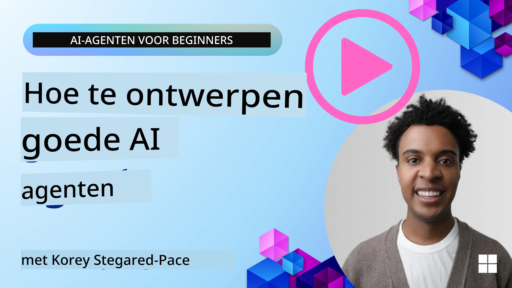
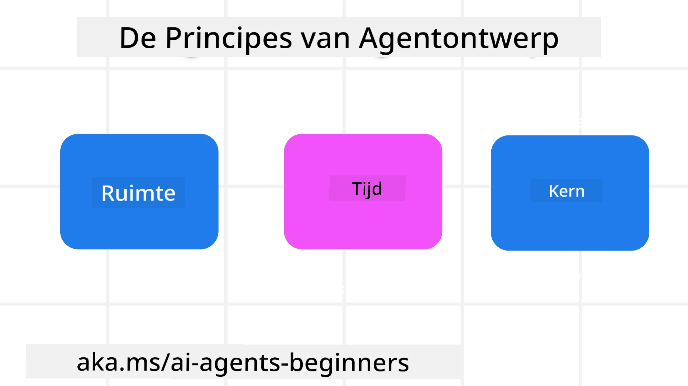

<!--
CO_OP_TRANSLATOR_METADATA:
{
  "original_hash": "d71524fe83a23829ae7a23b4031aaac8",
  "translation_date": "2025-11-13T13:06:15+00:00",
  "source_file": "03-agentic-design-patterns/README.md",
  "language_code": "nl"
}
-->

> _(Klik op de afbeelding hierboven om de video van deze les te bekijken)_
# Principes voor het ontwerpen van AI-agenten

## Introductie

Er zijn veel manieren om na te denken over het bouwen van AI-agentensystemen. Omdat ambiguïteit een kenmerk is en geen fout in het ontwerp van Generatieve AI, is het soms lastig voor ingenieurs om te bepalen waar ze moeten beginnen. We hebben een reeks mensgerichte UX-ontwerpprincipes opgesteld om ontwikkelaars te helpen klantgerichte agentensystemen te bouwen die hun zakelijke behoeften oplossen. Deze ontwerpprincipes vormen geen voorgeschreven architectuur, maar eerder een startpunt voor teams die agentervaringen definiëren en ontwikkelen.

Over het algemeen zouden agenten moeten:

- Menselijke capaciteiten uitbreiden en opschalen (brainstormen, probleemoplossing, automatisering, enz.)
- Kennislacunes opvullen (me bijpraten over kennisdomeinen, vertaling, enz.)
- Samenwerking vergemakkelijken en ondersteunen op manieren waarop wij als individuen graag met anderen werken
- Ons betere versies van onszelf maken (bijv. levenscoach/taakmeester, ons helpen emotionele regulatie en mindfulnessvaardigheden te leren, veerkracht opbouwen, enz.)

## Wat deze les behandelt

- Wat zijn de ontwerpprincipes voor agenten
- Welke richtlijnen kun je volgen bij het implementeren van deze ontwerpprincipes
- Wat zijn enkele voorbeelden van het gebruik van de ontwerpprincipes

## Leerdoelen

Na het voltooien van deze les kun je:

1. Uitleggen wat de ontwerpprincipes voor agenten zijn
2. De richtlijnen voor het gebruik van de ontwerpprincipes voor agenten uitleggen
3. Begrijpen hoe je een agent kunt bouwen met behulp van de ontwerpprincipes voor agenten

## De ontwerpprincipes voor agenten

### Agent (Ruimte)

Dit is de omgeving waarin de agent opereert. Deze principes geven richting aan hoe we agenten ontwerpen die actief zijn in fysieke en digitale werelden.

- **Verbinden, niet vervangen** – help mensen verbinden met andere mensen, gebeurtenissen en bruikbare kennis om samenwerking en verbinding mogelijk te maken.
- Agenten helpen gebeurtenissen, kennis en mensen met elkaar te verbinden.
- Agenten brengen mensen dichter bij elkaar. Ze zijn niet ontworpen om mensen te vervangen of te kleineren.
- **Gemakkelijk toegankelijk maar soms onzichtbaar** – de agent opereert grotendeels op de achtergrond en geeft alleen een seintje wanneer dat relevant en gepast is.
  - De agent is gemakkelijk vindbaar en toegankelijk voor geautoriseerde gebruikers op elk apparaat of platform.
  - De agent ondersteunt multimodale invoer en uitvoer (geluid, stem, tekst, enz.).
  - De agent kan naadloos schakelen tussen voorgrond en achtergrond; tussen proactief en reactief, afhankelijk van de behoeften van de gebruiker.
  - De agent kan onzichtbaar opereren, maar het pad van de achtergrondprocessen en de samenwerking met andere agenten is transparant en controleerbaar door de gebruiker.

### Agent (Tijd)

Dit is hoe de agent opereert in de tijd. Deze principes geven richting aan hoe we agenten ontwerpen die interactie hebben met het verleden, heden en toekomst.

- **Verleden**: Reflecteren op geschiedenis die zowel toestand als context omvat.
  - De agent biedt relevantere resultaten op basis van analyse van rijkere historische gegevens, niet alleen van de gebeurtenis, mensen of toestanden.
  - De agent creëert verbindingen vanuit gebeurtenissen uit het verleden en reflecteert actief op geheugen om te reageren op huidige situaties.
- **Nu**: Aansporen meer dan informeren.
  - De agent belichaamt een uitgebreide aanpak van interactie met mensen. Wanneer een gebeurtenis plaatsvindt, gaat de agent verder dan statische meldingen of andere formele statische vormen. De agent kan processen vereenvoudigen of dynamisch aanwijzingen genereren om de aandacht van de gebruiker op het juiste moment te richten.
  - De agent levert informatie op basis van de contextuele omgeving, sociale en culturele veranderingen en afgestemd op de intentie van de gebruiker.
  - De interactie met de agent kan geleidelijk zijn, evolueren/groeien in complexiteit om gebruikers op de lange termijn te versterken.
- **Toekomst**: Aanpassen en evolueren.
  - De agent past zich aan verschillende apparaten, platforms en modaliteiten aan.
  - De agent past zich aan het gedrag van de gebruiker, toegankelijkheidsbehoeften en is vrij aanpasbaar.
  - De agent wordt gevormd door en evolueert door voortdurende interactie met de gebruiker.

### Agent (Kern)

Dit zijn de belangrijkste elementen in de kern van het ontwerp van een agent.

- **Omarm onzekerheid maar bouw vertrouwen op**.
  - Een bepaald niveau van onzekerheid bij de agent wordt verwacht. Onzekerheid is een belangrijk element van het ontwerp van de agent.
  - Vertrouwen en transparantie zijn fundamentele lagen van het ontwerp van de agent.
  - Mensen hebben controle over wanneer de agent aan/uit staat en de status van de agent is altijd duidelijk zichtbaar.

## De richtlijnen om deze principes te implementeren

Bij het gebruik van de bovenstaande ontwerpprincipes kun je de volgende richtlijnen volgen:

1. **Transparantie**: Informeer de gebruiker dat AI betrokken is, hoe het werkt (inclusief eerdere acties), en hoe feedback kan worden gegeven en het systeem kan worden aangepast.
2. **Controle**: Geef de gebruiker de mogelijkheid om het systeem aan te passen, voorkeuren te specificeren en te personaliseren, en controle te hebben over het systeem en zijn attributen (inclusief de mogelijkheid om te vergeten).
3. **Consistentie**: Streef naar consistente, multimodale ervaringen over apparaten en eindpunten. Gebruik waar mogelijk vertrouwde UI/UX-elementen (bijv. microfoonpictogram voor spraakinteractie) en verminder de cognitieve belasting van de klant zoveel mogelijk (bijv. streef naar beknopte antwoorden, visuele hulpmiddelen en 'Meer informatie'-inhoud).

## Hoe ontwerp je een reisagent met behulp van deze principes en richtlijnen

Stel je voor dat je een reisagent ontwerpt, zo kun je denken aan het gebruik van de ontwerpprincipes en richtlijnen:

1. **Transparantie** – Laat de gebruiker weten dat de reisagent een AI-gestuurde agent is. Geef enkele basisinstructies over hoe te beginnen (bijv. een "Hallo"-bericht, voorbeeldprompts). Documenteer dit duidelijk op de productpagina. Toon de lijst met prompts die een gebruiker in het verleden heeft gevraagd. Maak duidelijk hoe feedback kan worden gegeven (duimpje omhoog en omlaag, Feedback verzenden-knop, enz.). Geef duidelijk aan of de agent gebruiks- of onderwerpbeperkingen heeft.
2. **Controle** – Zorg ervoor dat het duidelijk is hoe de gebruiker de agent kan aanpassen nadat deze is gemaakt, bijvoorbeeld met de systeemprompt. Geef de gebruiker de mogelijkheid om te kiezen hoe uitgebreid de agent is, zijn schrijfstijl, en eventuele beperkingen over waar de agent niet over mag praten. Sta de gebruiker toe om geassocieerde bestanden of gegevens, prompts en eerdere gesprekken te bekijken en te verwijderen.
3. **Consistentie** – Zorg ervoor dat de pictogrammen voor Prompt delen, een bestand of foto toevoegen en iemand of iets taggen standaard en herkenbaar zijn. Gebruik het paperclip-pictogram om aan te geven dat bestanden worden geüpload/gedeeld met de agent, en een afbeeldingspictogram om aan te geven dat grafische bestanden worden geüpload.

## Voorbeeldcodes

- Python: [Agent Framework](./code_samples/03-python-agent-framework.ipynb)
- .NET: [Agent Framework](./code_samples/03-dotnet-agent-framework.md)

## Heb je meer vragen over AI-ontwerppatronen voor agenten?

Word lid van de [Azure AI Foundry Discord](https://aka.ms/ai-agents/discord) om andere leerlingen te ontmoeten, spreekuren bij te wonen en je vragen over AI-agenten beantwoord te krijgen.

## Aanvullende bronnen

- <a href="https://openai.com" target="_blank">Praktijken voor het beheren van agentische AI-systemen | OpenAI</a>
- <a href="https://microsoft.com" target="_blank">Het HAX Toolkit Project - Microsoft Research</a>
- <a href="https://responsibleaitoolbox.ai" target="_blank">Responsible AI Toolbox</a>

## Vorige les

[Agentische kaders verkennen](../02-explore-agentic-frameworks/README.md)

## Volgende les

[Ontwerppatroon voor hulpmiddelen](../04-tool-use/README.md)

---

<!-- CO-OP TRANSLATOR DISCLAIMER START -->
**Disclaimer**:  
Dit document is vertaald met behulp van de AI-vertalingsservice [Co-op Translator](https://github.com/Azure/co-op-translator). Hoewel we streven naar nauwkeurigheid, dient u zich ervan bewust te zijn dat geautomatiseerde vertalingen fouten of onnauwkeurigheden kunnen bevatten. Het originele document in de oorspronkelijke taal moet worden beschouwd als de gezaghebbende bron. Voor kritieke informatie wordt professionele menselijke vertaling aanbevolen. Wij zijn niet aansprakelijk voor eventuele misverstanden of verkeerde interpretaties die voortvloeien uit het gebruik van deze vertaling.
<!-- CO-OP TRANSLATOR DISCLAIMER END -->