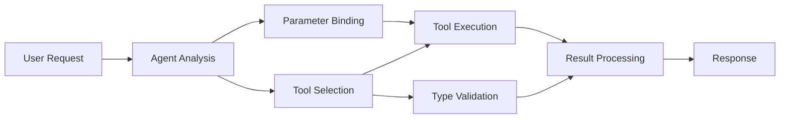

<!--
CO_OP_TRANSLATOR_METADATA:
{
  "original_hash": "91d6061e402489603f2ec8b528cae59b",
  "translation_date": "2025-11-18T17:50:08+00:00",
  "source_file": "04-tool-use/code_samples/04-dotnet-agent-framework.md",
  "language_code": "nl"
}
-->
# 🛠️ Geavanceerd gebruik van tools met GitHub-modellen (.NET)

## 📋 Leerdoelen

Deze notebook demonstreert integratiepatronen van enterprise-niveau met behulp van het Microsoft Agent Framework in .NET en GitHub-modellen. Je leert geavanceerde agents bouwen met meerdere gespecialiseerde tools, waarbij je gebruik maakt van de sterke typificatie van C# en de enterprise-functionaliteiten van .NET.

### Geavanceerde toolmogelijkheden die je zult beheersen

- 🔧 **Multi-Tool Architectuur**: Agents bouwen met meerdere gespecialiseerde mogelijkheden
- 🎯 **Type-Safe Tool Uitvoering**: Gebruik maken van C#'s compile-time validatie
- 📊 **Enterprise Tool Patronen**: Productieklaar toolontwerp en foutafhandeling
- 🔗 **Toolcompositie**: Tools combineren voor complexe bedrijfsworkflows

## 🎯 Voordelen van .NET Tool Architectuur

### Enterprise Tool Functionaliteiten

- **Compile-Time Validatie**: Sterke typificatie zorgt voor correcte toolparameters
- **Dependency Injection**: IoC-containerintegratie voor toolbeheer
- **Async/Await Patronen**: Niet-blokkerende tooluitvoering met goed resourcebeheer
- **Gestructureerd Loggen**: Ingebouwde loggingintegratie voor monitoring van tooluitvoering

### Productieklare Patronen

- **Foutafhandeling**: Uitgebreid foutbeheer met getypeerde uitzonderingen
- **Resourcebeheer**: Correcte dispositiepatronen en geheugenbeheer
- **Prestatiemonitoring**: Ingebouwde metrics en prestatiecounters
- **Configuratiebeheer**: Type-veilige configuratie met validatie

## 🔧 Technische Architectuur

### Kerncomponenten van .NET Tools

- **Microsoft.Extensions.AI**: Geünificeerde abstractielaag voor tools
- **Microsoft.Agents.AI**: Enterprise-grade toolorkestratie
- **GitHub Models Integratie**: Hoogpresterende API-client met connection pooling

### Tooluitvoeringspipeline



## 🛠️ Toolcategorieën & Patronen

### 1. **Dataverwerkingstools**

- **Inputvalidatie**: Sterke typificatie met data-annotaties
- **Transformatieoperaties**: Type-veilige dataconversie en formattering
- **Bedrijfslogica**: Domeinspecifieke berekening en analysetools
- **Outputformatteringen**: Gestructureerde responsgeneratie

### 2. **Integratietools**

- **API Connectors**: RESTful service-integratie met HttpClient
- **Databasetools**: Entity Framework-integratie voor data-toegang
- **Bestandsoperaties**: Veilige bestandssysteemoperaties met validatie
- **Externe diensten**: Integratiepatronen voor derde partijen

### 3. **Hulpprogramma's**

- **Tekstverwerking**: Hulpmiddelen voor stringmanipulatie en formattering
- **Datum/tijd operaties**: Cultuurgevoelige berekeningen met datum/tijd
- **Wiskundige tools**: Nauwkeurige berekeningen en statistische operaties
- **Validatietools**: Validatie van bedrijfsregels en gegevensverificatie

Klaar om enterprise-grade agents te bouwen met krachtige, type-veilige toolmogelijkheden in .NET? Laten we professionele oplossingen ontwerpen! 🏢⚡

## 🚀 Aan de slag

### Vereisten

- [.NET 10 SDK](https://dotnet.microsoft.com/download/dotnet/10.0) of hoger
- [GitHub Models API toegangstoken](https://docs.github.com/github-models/github-models-at-scale/using-your-own-api-keys-in-github-models)

### Vereiste Omgevingsvariabelen

```bash
# zsh/bash
export GH_TOKEN=<your_github_token>
export GH_ENDPOINT=https://models.github.ai/inference
export GH_MODEL_ID=openai/gpt-5-mini
```

```powershell
# PowerShell
$env:GH_TOKEN = "<your_github_token>"
$env:GH_ENDPOINT = "https://models.github.ai/inference"
$env:GH_MODEL_ID = "openai/gpt-5-mini"
```

### Voorbeeldcode

Om het codevoorbeeld uit te voeren,

```bash
# zsh/bash
chmod +x ./04-dotnet-agent-framework.cs
./04-dotnet-agent-framework.cs
```

Of gebruik de dotnet CLI:

```bash
dotnet run ./04-dotnet-agent-framework.cs
```

Zie [`04-dotnet-agent-framework.cs`](../../../../04-tool-use/code_samples/04-dotnet-agent-framework.cs) voor de volledige code.

```csharp
#!/usr/bin/dotnet run

#:package Microsoft.Extensions.AI@10.*
#:package Microsoft.Agents.AI.OpenAI@1.*-*

using System.ClientModel;
using System.ComponentModel;

using Microsoft.Agents.AI;
using Microsoft.Extensions.AI;

using OpenAI;

// Tool Function: Random Destination Generator
// This static method will be available to the agent as a callable tool
// The [Description] attribute helps the AI understand when to use this function
// This demonstrates how to create custom tools for AI agents
[Description("Provides a random vacation destination.")]
static string GetRandomDestination()
{
    // List of popular vacation destinations around the world
    // The agent will randomly select from these options
    var destinations = new List<string>
    {
        "Paris, France",
        "Tokyo, Japan",
        "New York City, USA",
        "Sydney, Australia",
        "Rome, Italy",
        "Barcelona, Spain",
        "Cape Town, South Africa",
        "Rio de Janeiro, Brazil",
        "Bangkok, Thailand",
        "Vancouver, Canada"
    };

    // Generate random index and return selected destination
    // Uses System.Random for simple random selection
    var random = new Random();
    int index = random.Next(destinations.Count);
    return destinations[index];
}

// Extract configuration from environment variables
// Retrieve the GitHub Models API endpoint, defaults to https://models.github.ai/inference if not specified
// Retrieve the model ID, defaults to openai/gpt-5-mini if not specified
// Retrieve the GitHub token for authentication, throws exception if not specified
var github_endpoint = Environment.GetEnvironmentVariable("GH_ENDPOINT") ?? "https://models.github.ai/inference";
var github_model_id = Environment.GetEnvironmentVariable("GH_MODEL_ID") ?? "openai/gpt-5-mini";
var github_token = Environment.GetEnvironmentVariable("GH_TOKEN") ?? throw new InvalidOperationException("GH_TOKEN is not set.");

// Configure OpenAI Client Options
// Create configuration options to point to GitHub Models endpoint
// This redirects OpenAI client calls to GitHub's model inference service
var openAIOptions = new OpenAIClientOptions()
{
    Endpoint = new Uri(github_endpoint)
};

// Initialize OpenAI Client with GitHub Models Configuration
// Create OpenAI client using GitHub token for authentication
// Configure it to use GitHub Models endpoint instead of OpenAI directly
var openAIClient = new OpenAIClient(new ApiKeyCredential(github_token), openAIOptions);

// Define Agent Identity and Comprehensive Instructions
// Agent name for identification and logging purposes
var AGENT_NAME = "TravelAgent";

// Detailed instructions that define the agent's personality, capabilities, and behavior
// This system prompt shapes how the agent responds and interacts with users
var AGENT_INSTRUCTIONS = """
You are a helpful AI Agent that can help plan vacations for customers.

Important: When users specify a destination, always plan for that location. Only suggest random destinations when the user hasn't specified a preference.

When the conversation begins, introduce yourself with this message:
"Hello! I'm your TravelAgent assistant. I can help plan vacations and suggest interesting destinations for you. Here are some things you can ask me:
1. Plan a day trip to a specific location
2. Suggest a random vacation destination
3. Find destinations with specific features (beaches, mountains, historical sites, etc.)
4. Plan an alternative trip if you don't like my first suggestion

What kind of trip would you like me to help you plan today?"

Always prioritize user preferences. If they mention a specific destination like "Bali" or "Paris," focus your planning on that location rather than suggesting alternatives.
""";

// Create AI Agent with Advanced Travel Planning Capabilities
// Initialize complete agent pipeline: OpenAI client → Chat client → AI agent
// Configure agent with name, detailed instructions, and available tools
// This demonstrates the .NET agent creation pattern with full configuration
AIAgent agent = openAIClient
    .GetChatClient(github_model_id)
    .CreateAIAgent(
        name: AGENT_NAME,
        instructions: AGENT_INSTRUCTIONS,
        tools: [AIFunctionFactory.Create(GetRandomDestination)]
    );

// Create New Conversation Thread for Context Management
// Initialize a new conversation thread to maintain context across multiple interactions
// Threads enable the agent to remember previous exchanges and maintain conversational state
// This is essential for multi-turn conversations and contextual understanding
AgentThread thread = agent.GetNewThread();

// Execute Agent: First Travel Planning Request
// Run the agent with an initial request that will likely trigger the random destination tool
// The agent will analyze the request, use the GetRandomDestination tool, and create an itinerary
// Using the thread parameter maintains conversation context for subsequent interactions
await foreach (var update in agent.RunStreamingAsync("Plan me a day trip", thread))
{
    await Task.Delay(10);
    Console.Write(update);
}

Console.WriteLine();

// Execute Agent: Follow-up Request with Context Awareness
// Demonstrate contextual conversation by referencing the previous response
// The agent remembers the previous destination suggestion and will provide an alternative
// This showcases the power of conversation threads and contextual understanding in .NET agents
await foreach (var update in agent.RunStreamingAsync("I don't like that destination. Plan me another vacation.", thread))
{
    await Task.Delay(10);
    Console.Write(update);
}
```

---

<!-- CO-OP TRANSLATOR DISCLAIMER START -->
**Disclaimer**:  
Dit document is vertaald met behulp van de AI-vertalingsservice [Co-op Translator](https://github.com/Azure/co-op-translator). Hoewel we streven naar nauwkeurigheid, dient u zich ervan bewust te zijn dat geautomatiseerde vertalingen fouten of onnauwkeurigheden kunnen bevatten. Het originele document in de oorspronkelijke taal moet worden beschouwd als de gezaghebbende bron. Voor kritieke informatie wordt professionele menselijke vertaling aanbevolen. Wij zijn niet aansprakelijk voor misverstanden of verkeerde interpretaties die voortvloeien uit het gebruik van deze vertaling.
<!-- CO-OP TRANSLATOR DISCLAIMER END -->