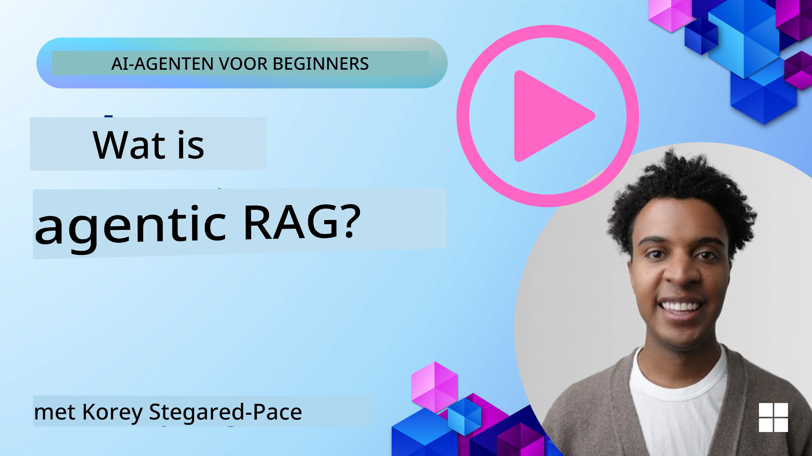
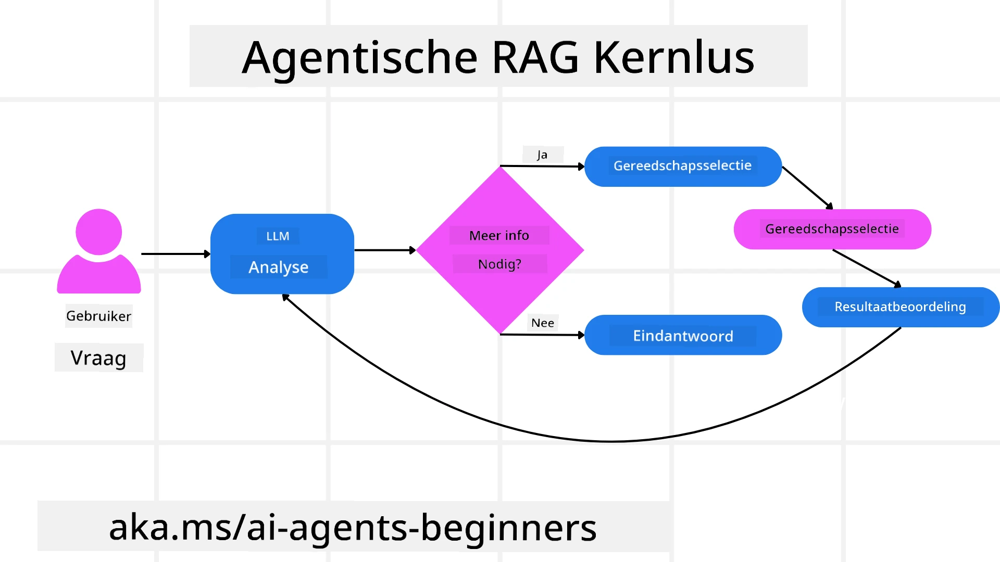
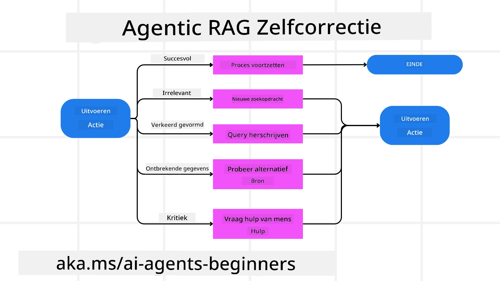
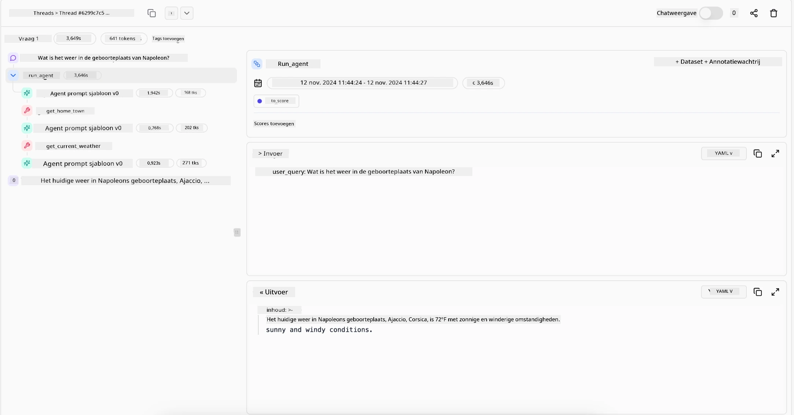

<!--
CO_OP_TRANSLATOR_METADATA:
{
  "original_hash": "0ebf6b2290db55dbf2d10cc49655523b",
  "translation_date": "2025-09-30T07:21:57+00:00",
  "source_file": "05-agentic-rag/README.md",
  "language_code": "nl"
}
-->

> _(Klik op de afbeelding hierboven om de video van deze les te bekijken)_

# Agentic RAG

Deze les biedt een uitgebreide introductie tot Agentic Retrieval-Augmented Generation (Agentic RAG), een opkomend AI-paradigma waarbij grote taalmodellen (LLMs) zelfstandig hun volgende stappen plannen terwijl ze informatie ophalen uit externe bronnen. In tegenstelling tot statische patronen van ophalen en lezen, omvat Agentic RAG iteratieve oproepen naar het LLM, afgewisseld met tool- of functieoproepen en gestructureerde outputs. Het systeem evalueert resultaten, verfijnt zoekopdrachten, roept indien nodig extra tools aan en herhaalt deze cyclus totdat een bevredigende oplossing is bereikt.

## Introductie

Deze les behandelt:

- **Begrijp Agentic RAG:** Leer over het opkomende AI-paradigma waarbij grote taalmodellen (LLMs) zelfstandig hun volgende stappen plannen terwijl ze informatie ophalen uit externe databronnen.
- **Begrijp Iteratieve Maker-Checker Stijl:** Begrijp de iteratieve cyclus van oproepen naar het LLM, afgewisseld met tool- of functieoproepen en gestructureerde outputs, ontworpen om de nauwkeurigheid te verbeteren en foutieve zoekopdrachten te corrigeren.
- **Verken Praktische Toepassingen:** Identificeer scenario's waarin Agentic RAG uitblinkt, zoals omgevingen waar nauwkeurigheid voorop staat, complexe database-interacties en uitgebreide workflows.

## Leerdoelen

Na het voltooien van deze les weet je hoe je:

- **Agentic RAG begrijpt:** Leer over het opkomende AI-paradigma waarbij grote taalmodellen (LLMs) zelfstandig hun volgende stappen plannen terwijl ze informatie ophalen uit externe databronnen.
- **Iteratieve Maker-Checker Stijl:** Begrijp het concept van een iteratieve cyclus van oproepen naar het LLM, afgewisseld met tool- of functieoproepen en gestructureerde outputs, ontworpen om de nauwkeurigheid te verbeteren en foutieve zoekopdrachten te corrigeren.
- **De redeneringsprocessen beheren:** Begrijp het vermogen van het systeem om zijn eigen redeneringsproces te beheren en beslissingen te nemen over hoe problemen aan te pakken zonder te vertrouwen op vooraf gedefinieerde paden.
- **Workflow:** Begrijp hoe een agentisch model zelfstandig besluit om markttrendrapporten op te halen, concurrentiedata te identificeren, interne verkoopstatistieken te correleren, bevindingen te synthetiseren en de strategie te evalueren.
- **Iteratieve cycli, toolintegratie en geheugen:** Leer over de afhankelijkheid van het systeem van een interactiepatroon met cycli, waarbij het status en geheugen behoudt over stappen om herhaling te vermijden en geïnformeerde beslissingen te nemen.
- **Omgaan met faalmodi en zelfcorrectie:** Verken de robuuste zelfcorrectiemechanismen van het systeem, waaronder itereren en opnieuw zoeken, diagnostische tools gebruiken en terugvallen op menselijke controle.
- **Grenzen van autonomie:** Begrijp de beperkingen van Agentic RAG, met focus op domeinspecifieke autonomie, afhankelijkheid van infrastructuur en respect voor veiligheidsmaatregelen.
- **Praktische toepassingen en waarde:** Identificeer scenario's waarin Agentic RAG uitblinkt, zoals omgevingen waar nauwkeurigheid voorop staat, complexe database-interacties en uitgebreide workflows.
- **Governance, transparantie en vertrouwen:** Leer over het belang van governance en transparantie, inclusief uitlegbare redenering, controle van vooringenomenheid en menselijke controle.

## Wat is Agentic RAG?

Agentic Retrieval-Augmented Generation (Agentic RAG) is een opkomend AI-paradigma waarbij grote taalmodellen (LLMs) zelfstandig hun volgende stappen plannen terwijl ze informatie ophalen uit externe bronnen. In tegenstelling tot statische patronen van ophalen en lezen, omvat Agentic RAG iteratieve oproepen naar het LLM, afgewisseld met tool- of functieoproepen en gestructureerde outputs. Het systeem evalueert resultaten, verfijnt zoekopdrachten, roept indien nodig extra tools aan en herhaalt deze cyclus totdat een bevredigende oplossing is bereikt. Deze iteratieve “maker-checker” stijl verbetert de nauwkeurigheid, corrigeert foutieve zoekopdrachten en zorgt voor hoogwaardige resultaten.

Het systeem beheert actief zijn eigen redeneringsproces, herschrijft mislukte zoekopdrachten, kiest verschillende ophaalmethoden en integreert meerdere tools—zoals vectorzoekopdrachten in Azure AI Search, SQL-databases of aangepaste API's—voordat het zijn antwoord afrondt. De onderscheidende eigenschap van een agentisch systeem is het vermogen om zijn eigen redeneringsproces te beheren. Traditionele RAG-implementaties vertrouwen op vooraf gedefinieerde paden, maar een agentisch systeem bepaalt autonoom de volgorde van stappen op basis van de kwaliteit van de gevonden informatie.

## Definitie van Agentic Retrieval-Augmented Generation (Agentic RAG)

Agentic Retrieval-Augmented Generation (Agentic RAG) is een opkomend paradigma in AI-ontwikkeling waarbij LLMs niet alleen informatie ophalen uit externe databronnen, maar ook zelfstandig hun volgende stappen plannen. In tegenstelling tot statische patronen van ophalen en lezen of zorgvuldig gescripte promptreeksen, omvat Agentic RAG een cyclus van iteratieve oproepen naar het LLM, afgewisseld met tool- of functieoproepen en gestructureerde outputs. Bij elke stap evalueert het systeem de verkregen resultaten, beslist of het zoekopdrachten moet verfijnen, roept indien nodig extra tools aan en herhaalt deze cyclus totdat een bevredigende oplossing is bereikt.

Deze iteratieve “maker-checker” stijl van werken is ontworpen om de nauwkeurigheid te verbeteren, foutieve zoekopdrachten naar gestructureerde databases (bijv. NL2SQL) te corrigeren en gebalanceerde, hoogwaardige resultaten te garanderen. In plaats van uitsluitend te vertrouwen op zorgvuldig ontworpen promptketens, beheert het systeem actief zijn eigen redeneringsproces. Het kan zoekopdrachten herschrijven die mislukken, verschillende ophaalmethoden kiezen en meerdere tools integreren—zoals vectorzoekopdrachten in Azure AI Search, SQL-databases of aangepaste API's—voordat het zijn antwoord afrondt. Dit elimineert de noodzaak voor overdreven complexe orkestratiekaders. In plaats daarvan kan een relatief eenvoudige cyclus van “LLM-oproep → toolgebruik → LLM-oproep → …” leiden tot verfijnde en goed onderbouwde outputs.

## Het Redeneringsproces Beheren

De onderscheidende eigenschap die een systeem “agentisch” maakt, is het vermogen om zijn eigen redeneringsproces te beheren. Traditionele RAG-implementaties vertrouwen vaak op mensen om een pad voor het model vooraf te definiëren: een chain-of-thought die aangeeft wat te halen en wanneer. Maar wanneer een systeem echt agentisch is, beslist het intern hoe het probleem moet worden aangepakt. Het voert niet alleen een script uit; het bepaalt autonoom de volgorde van stappen op basis van de kwaliteit van de gevonden informatie.

Bijvoorbeeld, als het wordt gevraagd om een strategie voor een productlancering te creëren, vertrouwt het niet alleen op een prompt die de hele onderzoeks- en besluitvormingsworkflow beschrijft. In plaats daarvan besluit het agentische model zelfstandig om:

1. Actuele markttrendrapporten op te halen via Bing Web Grounding.
2. Relevante concurrentiedata te identificeren met Azure AI Search.
3. Historische interne verkoopstatistieken te correleren via Azure SQL Database.
4. De bevindingen te synthetiseren tot een samenhangende strategie, georkestreerd via Azure OpenAI Service.
5. De strategie te evalueren op hiaten of inconsistenties, wat kan leiden tot een nieuwe ronde van ophalen indien nodig.

Al deze stappen—zoekopdrachten verfijnen, bronnen kiezen, itereren totdat het “tevreden” is met het antwoord—worden door het model zelf beslist, niet vooraf gescript door een mens.

## Iteratieve Cycli, Toolintegratie en Geheugen

Een agentisch systeem vertrouwt op een interactiepatroon met cycli:

- **Initiële Oproep:** Het doel van de gebruiker (oftewel gebruikersprompt) wordt aan het LLM gepresenteerd.
- **Toolgebruik:** Als het model ontbrekende informatie of onduidelijke instructies identificeert, selecteert het een tool of ophaalmethode—zoals een vectorzoekopdracht (bijv. Azure AI Search Hybrid search over privédata) of een gestructureerde SQL-oproep—om meer context te verzamelen.
- **Beoordeling & Verfijning:** Na het beoordelen van de verkregen data beslist het model of de informatie voldoende is. Zo niet, dan verfijnt het de zoekopdracht, probeert een andere tool of past zijn aanpak aan.
- **Herhalen Tot Tevredenheid:** Deze cyclus gaat door totdat het model bepaalt dat het voldoende duidelijkheid en bewijs heeft om een definitief, goed onderbouwd antwoord te geven.
- **Geheugen & Status:** Omdat het systeem status en geheugen behoudt over stappen, kan het eerdere pogingen en hun resultaten herinneren, herhaling vermijden en meer geïnformeerde beslissingen nemen naarmate het verder gaat.

Na verloop van tijd creëert dit een gevoel van evoluerend begrip, waardoor het model complexe, meerstaps taken kan uitvoeren zonder dat een mens constant hoeft in te grijpen of de prompt opnieuw moet vormgeven.

## Omgaan met Faalmodi en Zelfcorrectie

De autonomie van Agentic RAG omvat ook robuuste zelfcorrectiemechanismen. Wanneer het systeem op doodlopende wegen stuit—zoals het ophalen van irrelevante documenten of het tegenkomen van foutieve zoekopdrachten—kan het:

- **Itereren en Opnieuw Zoeken:** In plaats van antwoorden van lage waarde te retourneren, probeert het model nieuwe zoekstrategieën, herschrijft databasezoekopdrachten of bekijkt alternatieve datasets.
- **Diagnostische Tools Gebruiken:** Het systeem kan extra functies oproepen die zijn ontworpen om te helpen bij het debuggen van zijn redeneringsstappen of de juistheid van opgehaalde data te bevestigen. Tools zoals Azure AI Tracing zullen belangrijk zijn om robuuste observatie en monitoring mogelijk te maken.
- **Terugvallen op Menselijke Controle:** Voor scenario's met hoge inzet of herhaaldelijk falen kan het model onzekerheid signaleren en menselijke begeleiding aanvragen. Zodra de mens corrigerende feedback geeft, kan het model die les voortaan opnemen.

Deze iteratieve en dynamische aanpak stelt het model in staat om continu te verbeteren, waardoor het niet slechts een eenmalig systeem is, maar een systeem dat leert van zijn fouten tijdens een sessie.

## Grenzen van Autonomie

Ondanks zijn autonomie binnen een taak is Agentic RAG niet vergelijkbaar met Artificial General Intelligence. Zijn “agentische” capaciteiten zijn beperkt tot de tools, databronnen en beleidsregels die door menselijke ontwikkelaars worden geleverd. Het kan geen eigen tools uitvinden of buiten de domeingrenzen treden die zijn ingesteld. In plaats daarvan blinkt het uit in het dynamisch orkestreren van de beschikbare middelen.

Belangrijke verschillen met meer geavanceerde AI-vormen zijn:

1. **Domeinspecifieke Autonomie:** Agentic RAG-systemen zijn gericht op het bereiken van door de gebruiker gedefinieerde doelen binnen een bekend domein, waarbij strategieën zoals zoekopdrachten herschrijven of toolselectie worden gebruikt om resultaten te verbeteren.
2. **Afhankelijk van Infrastructuur:** De capaciteiten van het systeem hangen af van de tools en data die door ontwikkelaars zijn geïntegreerd. Het kan deze grenzen niet overschrijden zonder menselijke tussenkomst.
3. **Respect voor Veiligheidsmaatregelen:** Ethische richtlijnen, nalevingsregels en bedrijfsbeleid blijven erg belangrijk. De vrijheid van de agent wordt altijd beperkt door veiligheidsmaatregelen en controlemechanismen (hopelijk?).

## Praktische Toepassingen en Waarde

Agentic RAG blinkt uit in scenario's die iteratieve verfijning en precisie vereisen:

1. **Omgevingen Waar Nauwkeurigheid Voorop Staat:** Bij nalevingscontroles, regelgevingsanalyses of juridisch onderzoek kan het agentische model feiten herhaaldelijk verifiëren, meerdere bronnen raadplegen en zoekopdrachten herschrijven totdat het een grondig gecontroleerd antwoord produceert.
2. **Complexe Database-Interacties:** Bij gestructureerde data waar zoekopdrachten vaak kunnen mislukken of moeten worden aangepast, kan het systeem zelfstandig zoekopdrachten verfijnen met Azure SQL of Microsoft Fabric OneLake, zodat de uiteindelijke resultaten aansluiten bij de intentie van de gebruiker.
3. **Uitgebreide Workflows:** Langdurige sessies kunnen evolueren naarmate nieuwe informatie beschikbaar komt. Agentic RAG kan continu nieuwe data opnemen en strategieën aanpassen naarmate het meer leert over de probleemruimte.

## Governance, Transparantie en Vertrouwen

Naarmate deze systemen autonomer worden in hun redenering, zijn governance en transparantie cruciaal:

- **Uitlegbare Redenering:** Het model kan een audittrail bieden van de zoekopdrachten die het heeft uitgevoerd, de bronnen die het heeft geraadpleegd en de redeneringsstappen die het heeft genomen om tot zijn conclusie te komen. Tools zoals Azure AI Content Safety en Azure AI Tracing / GenAIOps kunnen helpen transparantie te behouden en risico's te beperken.
- **Controle van Vooringenomenheid en Gebalanceerd Ophalen:** Ontwikkelaars kunnen ophaalstrategieën afstemmen om ervoor te zorgen dat gebalanceerde, representatieve databronnen worden overwogen, en outputs regelmatig auditen om vooringenomenheid of scheve patronen te detecteren met behulp van aangepaste modellen voor geavanceerde data science-organisaties met Azure Machine Learning.
- **Menselijke Controle en Naleving:** Voor gevoelige taken blijft menselijke beoordeling essentieel. Agentic RAG vervangt geen menselijke oordeelsvorming bij beslissingen met hoge inzet—het versterkt deze door meer grondig gecontroleerde opties te leveren.

Het hebben van tools die een duidelijk overzicht van acties bieden is essentieel. Zonder deze tools kan het debuggen van een meerstapsproces erg moeilijk zijn. Zie het volgende voorbeeld van Literal AI (bedrijf achter Chainlit) voor een Agent-run:

## Conclusie

Agentic RAG vertegenwoordigt een natuurlijke evolutie in hoe AI-systemen complexe, data-intensieve taken aanpakken. Door een interactiepatroon met cycli te adopteren, tools autonoom te selecteren en zoekopdrachten te verfijnen totdat een hoogwaardig resultaat is bereikt, beweegt het systeem voorbij statisch prompt-volgen naar een meer adaptieve, contextbewuste besluitvormer. Hoewel het nog steeds beperkt is door menselijk gedefinieerde infrastructuren en ethische richtlijnen, maken deze agentische capaciteiten rijkere, dynamischere en uiteindelijk nuttigere AI-interacties mogelijk voor zowel bedrijven als eindgebruikers.

### Meer Vragen over Agentic RAG?

Word lid van de [Azure AI Foundry Discord](https://aka.ms/ai-agents/discord) om andere leerlingen te ontmoeten, kantooruren bij te wonen en je vragen over AI Agents beantwoord te krijgen.

## Aanvullende Bronnen

- <a href="https://learn.microsoft.com/training/modules/use-own-data-azure-openai" target="_blank">Implement Retrieval Augmented Generation (RAG) met Azure OpenAI Service: Leer hoe je je eigen data kunt gebruiken met de Azure OpenAI Service. Deze Microsoft Learn-module biedt een uitgebreide gids over het implementeren van RAG</a>
- <a href="https://learn.microsoft.com/azure/ai-studio/concepts/evaluation-approach-gen-ai" target="_blank">Evaluatie van generatieve AI-toepassingen met Azure AI Foundry: Dit artikel behandelt de evaluatie en vergelijking van modellen op openbaar beschikbare datasets, inclusief Agentic AI-toepassingen en RAG-architecturen</a>
- <a href="https://weaviate.io/blog/what-is-agentic-rag" target="_blank">Wat is Agentic RAG | Weaviate</a>
- <a href="https://ragaboutit.com/agentic-rag-a-complete-guide-to-agent-based-retrieval-augmented-generation/" target="_blank">Agentic RAG: Een complete gids voor op agenten gebaseerde Retrieval Augmented Generation – Nieuws van generatie RAG</a>
- <a href="https://huggingface.co/learn/cookbook/agent_rag" target="_blank">Agentic RAG: geef je RAG een boost met queryherformulering en zelf-query! Hugging Face Open-Source AI Cookbook</a>
- <a href="https://youtu.be/aQ4yQXeB1Ss?si=2HUqBzHoeB5tR04U" target="_blank">Agentische lagen toevoegen aan RAG</a>
- <a href="https://www.youtube.com/watch?v=zeAyuLc_f3Q&t=244s" target="_blank">De toekomst van kennisassistenten: Jerry Liu</a>
- <a href="https://www.youtube.com/watch?v=AOSjiXP1jmQ" target="_blank">Hoe bouw je agentische RAG-systemen</a>
- <a href="https://ignite.microsoft.com/sessions/BRK102?source=sessions" target="_blank">Azure AI Foundry Agent Service gebruiken om je AI-agenten op te schalen</a>

### Academische artikelen

- <a href="https://arxiv.org/abs/2303.17651" target="_blank">2303.17651 Self-Refine: Iteratieve verfijning met zelf-feedback</a>
- <a href="https://arxiv.org/abs/2303.11366" target="_blank">2303.11366 Reflexion: Taalagenten met verbaal versterkend leren</a>
- <a href="https://arxiv.org/abs/2305.11738" target="_blank">2305.11738 CRITIC: Grote taalmodellen kunnen zichzelf corrigeren met tool-interactieve kritiek</a>
- <a href="https://arxiv.org/abs/2501.09136" target="_blank">2501.09136 Agentic Retrieval-Augmented Generation: Een overzicht van Agentic RAG</a>

## Vorige les

[Toolgebruik ontwerp patroon](../04-tool-use/README.md)

## Volgende les

[Vertrouwen opbouwen in AI-agenten](../06-building-trustworthy-agents/README.md)

---

**Disclaimer**:  
Dit document is vertaald met behulp van de AI-vertalingsservice [Co-op Translator](https://github.com/Azure/co-op-translator). Hoewel we streven naar nauwkeurigheid, dient u zich ervan bewust te zijn dat geautomatiseerde vertalingen fouten of onnauwkeurigheden kunnen bevatten. Het originele document in de oorspronkelijke taal moet worden beschouwd als de gezaghebbende bron. Voor cruciale informatie wordt professionele menselijke vertaling aanbevolen. Wij zijn niet aansprakelijk voor eventuele misverstanden of verkeerde interpretaties die voortvloeien uit het gebruik van deze vertaling.