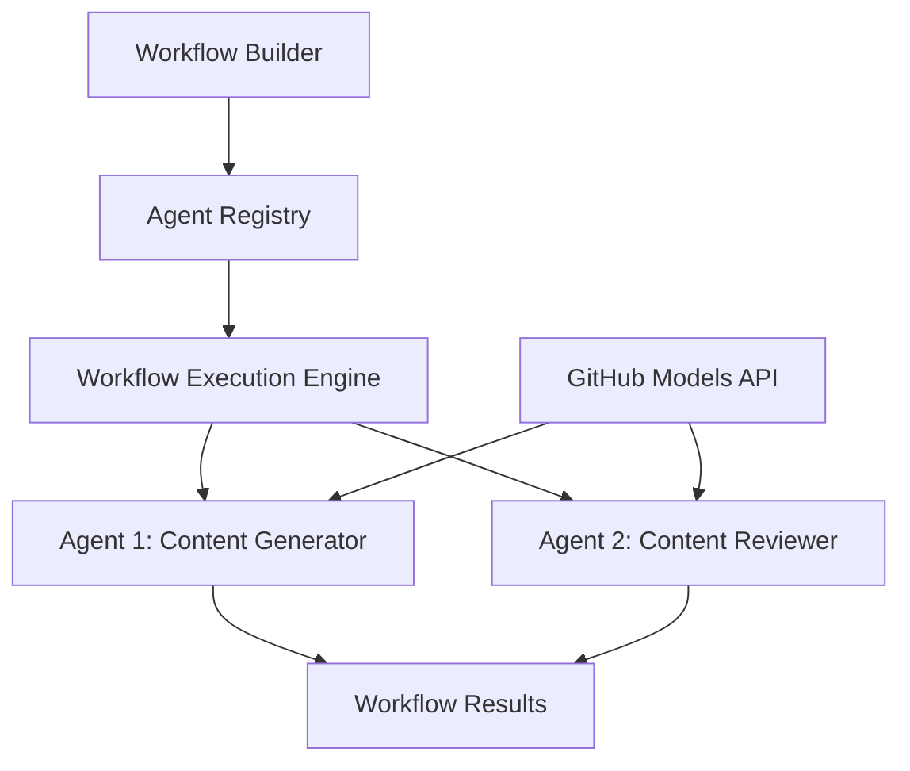

<!--
CO_OP_TRANSLATOR_METADATA:
{
  "original_hash": "034158688d0a45aae06dcbb21b0da5ae",
  "translation_date": "2025-11-11T12:52:55+00:00",
  "source_file": "08-multi-agent/code_samples/workflows-agent-framework/dotNET/01.dotnet-agent-framework-workflow-ghmodel-basic.md",
  "language_code": "nl"
}
-->
# 🔄 Basis Agent Workflows met GitHub Modellen (.NET)

## 📋 Tutorial Workflow Orchestratie

Deze notebook laat zien hoe je geavanceerde **agent workflows** kunt bouwen met het Microsoft Agent Framework voor .NET en GitHub Modellen. Je leert hoe je meerstaps bedrijfsprocessen kunt creëren waarbij AI-agenten samenwerken om complexe taken te voltooien via gestructureerde orkestratiepatronen.

## 🎯 Leerdoelen

### 🏗️ **Basisprincipes van Workflow Architectuur**
- **Workflow Builder**: Ontwerp en orkestreer complexe meerstaps AI-processen
- **Agentcoördinatie**: Coördineer meerdere gespecialiseerde agenten binnen workflows
- **GitHub Modellen Integratie**: Gebruik GitHub's AI-model inferentie service in workflows
- **Visueel Workflow Ontwerp**: Creëer en visualiseer workflowstructuren voor beter begrip

### 🔄 **Patronen voor Procesorkestratie**
- **Sequentiële Verwerking**: Koppel meerdere agenttaken in logische volgorde
- **Staatbeheer**: Behoud context en gegevensstroom tussen workflowstadia
- **Foutafhandeling**: Implementeer robuuste foutherstel en workflowbestendigheid
- **Prestatieoptimalisatie**: Ontwerp efficiënte workflows voor operaties op ondernemingsschaal

### 🏢 **Toepassingen voor Enterprise Workflows**
- **Automatisering van Bedrijfsprocessen**: Automatiseer complexe organisatorische workflows
- **Contentproductie Pijplijn**: Redactionele workflows met beoordelings- en goedkeuringsstadia
- **Klantenservice Automatisering**: Meerstaps oplossing van klantvragen
- **Gegevensverwerkingsworkflows**: ETL-workflows met AI-gestuurde transformatie

## ⚙️ Vereisten & Setup

### 📦 **Benodigde NuGet Packages**

Deze workflowdemonstratie maakt gebruik van verschillende belangrijke .NET-packages:

```xml
<!-- Core AI Framework -->
<PackageReference Include="Microsoft.Extensions.AI" Version="9.9.0" />

<!-- Agent Framework (Local Development) -->
<!-- Microsoft.Agents.AI.dll - Core agent abstractions -->
<!-- Microsoft.Agents.AI.OpenAI.dll - OpenAI/GitHub Models integration -->

<!-- Configuration and Environment -->
<PackageReference Include="DotNetEnv" Version="3.1.1" />
```

### 🔑 **GitHub Modellen Configuratie**

**Omgevingsinstellingen (.env bestand):**
```env
GITHUB_TOKEN=your_github_personal_access_token
GITHUB_ENDPOINT=https://models.inference.ai.azure.com
GITHUB_MODEL_ID=gpt-4o-mini
```

**Toegang tot GitHub Modellen:**
1. Meld je aan voor GitHub Modellen (momenteel in preview)
2. Genereer een persoonlijke toegangstoken met modeltoegangsrechten
3. Configureer omgevingsvariabelen zoals hierboven weergegeven

### 🏗️ **Overzicht Workflow Architectuur**



**Belangrijke Componenten:**
- **WorkflowBuilder**: Hoofdorkestratiemotor voor het ontwerpen van workflows
- **AIAgent**: Individuele gespecialiseerde agenten met specifieke capaciteiten
- **GitHub Models Client**: Integratie van AI-model inferentie service
- **Execution Context**: Beheert staat en gegevensstroom tussen workflowstadia

## 🎨 **Ontwerp Patronen voor Enterprise Workflows**

### 📝 **Contentproductie Workflow**
```
User Request → Content Generation → Quality Review → Final Output
```

### 🔍 **Documentverwerkingspijplijn**
```
Document Input → Analysis → Extraction → Validation → Structured Output
```

### 💼 **Business Intelligence Workflow**
```
Data Collection → Processing → Analysis → Report Generation → Distribution
```

### 🤝 **Automatisering van Klantenservice**
```
Customer Inquiry → Classification → Processing → Response Generation → Follow-up
```

## 🏢 **Voordelen voor Enterprises**

### 🎯 **Betrouwbaarheid & Schaalbaarheid**
- **Deterministische Uitvoering**: Consistente, herhaalbare workflowresultaten
- **Foutherstel**: Gracieus omgaan met fouten in elke workflowfase
- **Prestatiemonitoring**: Volg uitvoeringsstatistieken en optimalisatiemogelijkheden
- **Resourcebeheer**: Efficiënte toewijzing en benutting van AI-modelbronnen

### 🔒 **Beveiliging & Naleving**
- **Veilige Authenticatie**: GitHub token-gebaseerde authenticatie voor API-toegang
- **Audit Trails**: Volledige logging van workflowuitvoering en beslissingspunten
- **Toegangscontrole**: Gedetailleerde rechten voor workflowuitvoering en monitoring
- **Gegevensprivacy**: Veilige verwerking van gevoelige informatie binnen workflows

### 📊 **Observatie & Beheer**
- **Visueel Workflow Ontwerp**: Duidelijke weergave van processtromen en afhankelijkheden
- **Uitvoeringsmonitoring**: Real-time tracking van workflowvoortgang en prestaties
- **Foutrapportage**: Gedetailleerde foutanalyse en debuggingmogelijkheden
- **Prestatieanalyse**: Statistieken voor optimalisatie en capaciteitsplanning

Laten we je eerste enterprise-ready AI-workflow bouwen! 🚀

## 💻 Code Uitvoeren

De volledige implementatie is beschikbaar in `01.dotnet-agent-framework-workflow-ghmodel-basic.cs`. Dit bestand demonstreert:

1. **Omgevingsconfiguratie** - Laden van GitHub Modellen referenties uit `.env` bestand
2. **OpenAI Client Setup** - Configureren van de client om GitHub Modellen endpoint te gebruiken
3. **Agent Creatie** - Definiëren van gespecialiseerde agenten (Front Desk en Concierge)
4. **Workflow Builder** - Creëren van een multi-agent workflow met sequentiële verwerking
5. **Workflow Uitvoering** - Uitvoeren van de workflow met streaming resultaten

### 🚀 Voorbeeld Uitvoeren

```bash
# Make the script executable (Unix/Linux/macOS)
chmod +x 01.dotnet-agent-framework-workflow-ghmodel-basic.cs

# Run the workflow
./01.dotnet-agent-framework-workflow-ghmodel-basic.cs
```

Of op Windows:
```powershell
dotnet run 01.dotnet-agent-framework-workflow-ghmodel-basic.cs
```

### 📝 Verwachte Output

De workflow zal:
1. Je reisbestemming verzoek accepteren ("Ik wil naar Parijs")
2. De Front Desk agent geeft een eerste aanbeveling
3. De Concierge agent beoordeelt en verfijnt de aanbeveling
4. De uiteindelijke output toont de volledige gespreksstroom

### 🔧 Aanpassing

Je kunt de workflow aanpassen door:
- Agentinstructies te wijzigen om hun gedrag te veranderen
- Meer agenten toe te voegen om complexe meerstaps workflows te creëren
- Het gebruikersbericht te wijzigen om verschillende scenario's te testen
- De workflowverbindingen aan te passen om verschillende uitvoeringspatronen te creëren

---

<!-- CO-OP TRANSLATOR DISCLAIMER START -->
**Disclaimer**:  
Dit document is vertaald met behulp van de AI-vertalingsservice [Co-op Translator](https://github.com/Azure/co-op-translator). Hoewel we streven naar nauwkeurigheid, dient u zich ervan bewust te zijn dat geautomatiseerde vertalingen fouten of onnauwkeurigheden kunnen bevatten. Het originele document in de oorspronkelijke taal moet worden beschouwd als de gezaghebbende bron. Voor kritieke informatie wordt professionele menselijke vertaling aanbevolen. Wij zijn niet aansprakelijk voor eventuele misverstanden of verkeerde interpretaties die voortvloeien uit het gebruik van deze vertaling.
<!-- CO-OP TRANSLATOR DISCLAIMER END -->