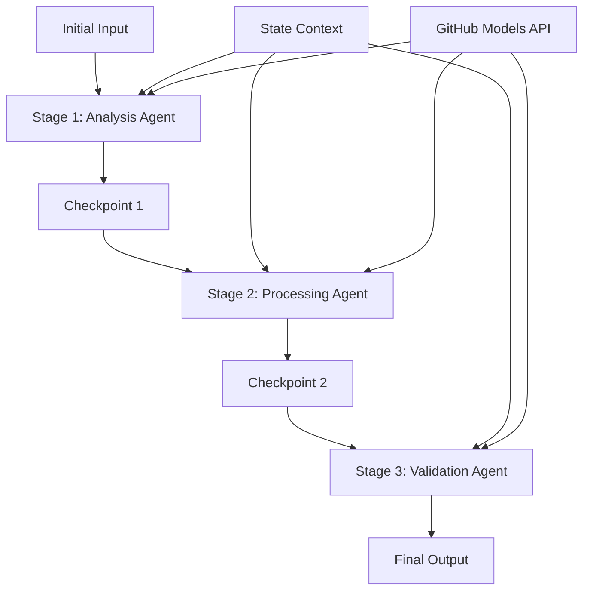

<!--
CO_OP_TRANSLATOR_METADATA:
{
  "original_hash": "1be9c8dcbd79a02d33d2c138684c1394",
  "translation_date": "2025-11-11T13:56:42+00:00",
  "source_file": "08-multi-agent/code_samples/workflows-agent-framework/dotNET/02.dotnet-agent-framework-workflow-ghmodel-sequential.md",
  "language_code": "nl"
}
-->
# ⏩ Sequentiële Agent Workflows met GitHub Modellen (.NET)

## 📋 Geavanceerde Tutorial voor Sequentiële Verwerking

Deze notebook demonstreert **sequentiële workflowpatronen** met behulp van het Microsoft Agent Framework voor .NET en GitHub Modellen. Je leert hoe je geavanceerde, stapsgewijze verwerkingspijplijnen kunt bouwen waarbij agents in een specifieke volgorde worden uitgevoerd, en elke fase voortbouwt op de resultaten van de vorige fase.

## 🎯 Leerdoelen

### 🔄 **Sequentiële Verwerkingsarchitectuur**
- **Lineaire Workflow Ontwerp**: Maak stapsgewijze verwerkingspijplijnen met duidelijke afhankelijkheden
- **State Management**: Behoud context en gegevensstroom tussen sequentiële workflowfasen
- **GitHub Modellen Integratie**: Gebruik GitHub's AI-modellen in meerfasige .NET workflows
- **Enterprise Pipeline Patronen**: Bouw productieklare sequentiële verwerkingssystemen

### 🏗️ **Geavanceerde Sequentiële Patronen**
- **Stage-Gate Verwerking**: Implementeer validatiecontrolepunten tussen workflowfasen
- **Contextbehoud**: Behoud state en verzamelde kennis over alle fasen
- **Foutpropagatie**: Behandel fouten op een elegante manier in sequentiële verwerkingsketens
- **Prestatieoptimalisatie**: Efficiënte sequentiële uitvoering met minimale overhead

### 🏢 **Sequentiële Toepassingen voor Bedrijven**
- **Documentverwerkingspijplijn**: Meerfasige documentanalyse, transformatie en validatie
- **Kwaliteitscontrole Workflows**: Sequentiële beoordeling, validatie en goedkeuringsprocessen
- **Contentproductiepijplijn**: Onderzoek → Schrijven → Bewerken → Beoordelen → Publiceren
- **Automatisering van Bedrijfsprocessen**: Meerfasige bedrijfsworkflows met duidelijke faseafhankelijkheden

## ⚙️ Vereisten & Setup

### 📦 **Benodigde NuGet Packages**

Essentiële pakketten voor .NET sequentiële workflows:

```xml
<!-- Core AI Framework -->
<PackageReference Include="Microsoft.Extensions.AI" Version="9.9.0" />

<!-- Client Model Abstractions -->
<PackageReference Include="System.ClientModel" Version="1.6.1.0" />

<!-- Azure Identity and Async LINQ Support -->
<PackageReference Include="Azure.Identity" Version="1.15.0" />
<PackageReference Include="System.Linq.Async" Version="6.0.3" />

<!-- Local Agent Framework References -->
<!-- Microsoft.Agents.AI.dll - Core agent abstractions -->
<!-- Microsoft.Agents.AI.OpenAI.dll - GitHub Models integration -->
```

### 🔑 **GitHub Modellen Configuratie**

**Omgevingsinstellingen (.env bestand):**
```env
GITHUB_TOKEN=your_github_personal_access_token
GITHUB_ENDPOINT=https://models.inference.ai.azure.com
GITHUB_MODEL_ID=gpt-4o-mini
```

**Configuratiebeheer:**
```csharp
// Load environment variables securely
Env.Load("../../../.env");
var githubToken = Environment.GetEnvironmentVariable("GITHUB_TOKEN");
var githubEndpoint = Environment.GetEnvironmentVariable("GITHUB_ENDPOINT");
var modelId = Environment.GetEnvironmentVariable("GITHUB_MODEL_ID");
```

### 🏗️ **Sequentiële Workflow Architectuur**



**Belangrijke Componenten:**
- **Sequentiële Agents**: Gespecialiseerde agents voor elke verwerkingsfase
- **State Context**: Behoud verzamelde gegevens en beslissingen over fasen
- **Controlepunten**: Validatiepunten tussen fasen om kwaliteit en consistentie te waarborgen
- **GitHub Modellen Client**: Consistente toegang tot AI-modellen in alle workflowfasen

## 🎨 **Ontwerp Patronen voor Sequentiële Workflows**

### 📝 **Documentverwerkingspijplijn**
```
Raw Document → Content Extraction → Analysis → Validation → Structured Output
```

### 🎯 **Contentcreatie Workflow**
```
Brief/Requirements → Research → Content Creation → Review → Final Polish
```

### 🔍 **Kwaliteitscontrole Pijplijn**
```
Initial Review → Technical Validation → Compliance Check → Final Approval
```

### 💼 **Business Intelligence Workflow**
```
Data Collection → Processing → Analysis → Report Generation → Distribution
```

## 🏢 **Voordelen van Sequentiële Workflows voor Bedrijven**

### 🎯 **Betrouwbaarheid & Kwaliteit**
- **Deterministische Verwerking**: Consistente, herhaalbare resultaten door gestructureerde fasen
- **Kwaliteitscontrolepunten**: Validatiepunten waarborgen kwaliteit in elke fase
- **Foutisolatie**: Problemen in één fase verspreiden zich niet naar volgende fasen
- **Audit Trails**: Volledige tracking van beslissingen en transformaties in elke fase

### 📈 **Schaalbaarheid & Prestaties**
- **Modulair Ontwerp**: Elke fase kan onafhankelijk worden geoptimaliseerd
- **Resourcebeheer**: Efficiënte toewijzing van AI-modelbronnen over fasen
- **State Optimalisatie**: Minimale state-overdracht tussen fasen voor optimale prestaties
- **Parallelle Fasegroepen**: Meerdere sequentiële workflows kunnen parallel worden uitgevoerd

### 🔒 **Beveiliging & Naleving**
- **Fase-niveau Beveiliging**: Verschillende beveiligingsbeleid voor verschillende verwerkingsfasen
- **Gegevensvalidatie**: Waarborg gegevensintegriteit en naleving bij elk controlepunt
- **Toegangscontrole**: Gedetailleerde machtigingen voor verschillende workflowfasen
- **Regelgevingsnaleving**: Voldoen aan regelgevingseisen door gestructureerde verwerking

### 📊 **Monitoring & Analyse**
- **Fase-niveau Metrics**: Prestatiemonitoring voor elke workflowfase
- **Bottleneck Identificatie**: Identificeer en optimaliseer trage fasen
- **Kwaliteitsmetrics**: Volg kwaliteit en succespercentages in elke fase
- **Procesoptimalisatie**: Continue verbetering op basis van fase-niveau analyses

Laten we robuuste sequentiële AI-verwerkingspijplijnen bouwen! 🚀

## 💻 Code Uitvoeren

De volledige implementatie is beschikbaar in `02.dotnet-agent-framework-workflow-ghmodel-sequential.cs`. Dit bestand demonstreert een **driefasige meubelanalyse workflow**:

1. **Fase 1 - Sales Agent**: Analyseert meubelafbeeldingen en geeft aankoopvoorstellen
2. **Fase 2 - Price Agent**: Biedt gedetailleerde prijsanalyses en budgetopties
3. **Fase 3 - Quote Agent**: Genereert een professioneel offerte-document in Markdown-formaat

### 🏗️ **Workflow Architectuur**

```
Image Input → Sales Analysis → Price Estimation → Quote Generation → Final Output
```

Elke agent:
- Ontvangt de output van de vorige fase als context
- Bouwt voort op eerdere analyses met gespecialiseerde expertise
- Behoudt workflowcontinuïteit door state management

### 🚀 Voorbeeld Uitvoeren

**Vereisten:**
- Plaats een meubelafbeelding op `../imgs/home.png` (of werk de `imgPath` variabele bij)
- Configureer je `.env` bestand met GitHub Modellen credentials

```bash
# Make the script executable (Unix/Linux/macOS)
chmod +x 02.dotnet-agent-framework-workflow-ghmodel-sequential.cs

# Run the sequential workflow
./02.dotnet-agent-framework-workflow-ghmodel-sequential.cs
```

Of op Windows:
```powershell
dotnet run 02.dotnet-agent-framework-workflow-ghmodel-sequential.cs
```

### 📝 Verwachte Output

De workflow zal:
1. **Sales Agent**: Meubelstukken identificeren uit de afbeelding en aanbevelingen geven
2. **Price Agent**: Gedetailleerde prijsanalyse toevoegen met budgetniveaus en winkeladvies
3. **Quote Agent**: Een geformatteerd offerte-document genereren met alle gesynthetiseerde informatie

De uiteindelijke output zal een uitgebreide, professionele meubelofferte zijn gebaseerd op beeldanalyse.

### 🔧 Aanpassingsopties

**Gedrag van Agents Wijzigen:**
```csharp
// Adjust agent instructions to change their focus
const string SalesAgentInstructions = "Your custom instructions...";
```

**Sequentiële Flow Aanpassen:**
```csharp
// Add or reorder workflow stages
var workflow = new WorkflowBuilder(salesagent)
    .AddEdge(salesagent, priceagent)
    .AddEdge(priceagent, quoteagent)
    .AddEdge(quoteagent, newAgent)  // Add another stage
    .Build();
```

**Andere Input Gebruiken:**
```csharp
// Process text instead of images
ChatMessage userMessage = new ChatMessage(ChatRole.User, [
    new TextContent("Analyze pricing for a modern living room set")
]);
```

### 🎯 Toepassingen in de Praktijk

Dit sequentiële patroon is ideaal voor:
- **E-commerce**: Productanalyse → Prijsstelling → Offertegeneratie
- **Vastgoed**: Eigendomanalyse → Waardebepaling → Advertentiecreatie
- **Verzekeringen**: Claimanalyse → Beoordeling → Offertegeneratie
- **Contentcreatie**: Onderzoek → Schrijven → Bewerken → Publiceren

### 🔍 Begrip van State Flow

Elke agent in de sequentie ontvangt:
- **Originele Input**: Het initiële gebruikersbericht (afbeelding + tekst)
- **Output van Vorige Agents**: Alle eerdere agentreacties in de gespreksgeschiedenis
- **Verzamelde Context**: Volledige state die gedurende de workflow wordt behouden

Dit maakt geavanceerde meerfasige verwerking mogelijk waarbij elke agent voortbouwt op uitgebreide context van alle voorgaande fasen.

---

<!-- CO-OP TRANSLATOR DISCLAIMER START -->
**Disclaimer**:  
Dit document is vertaald met behulp van de AI-vertalingsservice [Co-op Translator](https://github.com/Azure/co-op-translator). Hoewel we streven naar nauwkeurigheid, dient u zich ervan bewust te zijn dat geautomatiseerde vertalingen fouten of onnauwkeurigheden kunnen bevatten. Het originele document in de oorspronkelijke taal moet worden beschouwd als de gezaghebbende bron. Voor kritieke informatie wordt professionele menselijke vertaling aanbevolen. Wij zijn niet aansprakelijk voor misverstanden of verkeerde interpretaties die voortvloeien uit het gebruik van deze vertaling.
<!-- CO-OP TRANSLATOR DISCLAIMER END -->