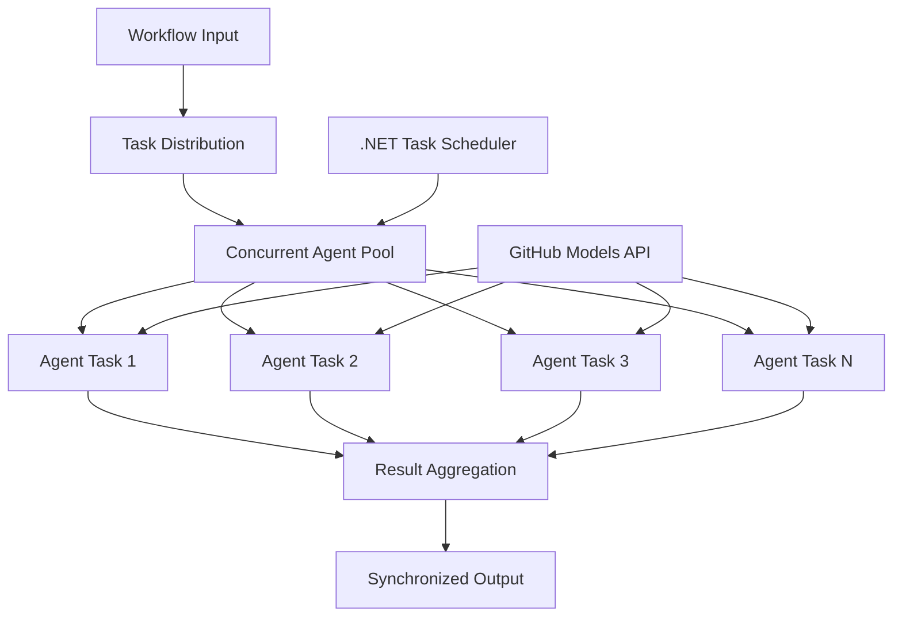

<!--
CO_OP_TRANSLATOR_METADATA:
{
  "original_hash": "b9c6e32c9b5f2fed20b6916984440d88",
  "translation_date": "2025-11-11T13:23:40+00:00",
  "source_file": "08-multi-agent/code_samples/workflows-agent-framework/dotNET/03.dotnet-agent-framework-workflow-ghmodel-concurrent.md",
  "language_code": "nl"
}
-->
# ⚡ Gelijktijdige Agent Workflows met GitHub Modellen (.NET)

## 📋 Handleiding voor Hoge-Snelheid Parallelle Verwerking

Deze notebook demonstreert **gelijktijdige workflowpatronen** met behulp van het Microsoft Agent Framework voor .NET en GitHub Modellen. Je leert hoe je workflows kunt bouwen voor hoge-snelheid, parallelle verwerking die de doorvoer maximaliseren door meerdere AI-agents tegelijkertijd uit te voeren, terwijl coördinatie en gegevensconsistentie behouden blijven.

## 🎯 Leerdoelen

### 🚀 **Basisprincipes van Gelijktijdige Verwerking**
- **Parallelle Agentuitvoering**: Voer meerdere AI-agents tegelijkertijd uit voor maximale prestaties
- **Async/Await Patronen**: Maak gebruik van het async-programmeermodel van .NET voor efficiënte gelijktijdigheid
- **GitHub Modellen Integratie**: Coördineer meerdere gelijktijdige oproepen naar de AI-model inferentie service van GitHub
- **Resourcebeheer**: Beheer AI-modelbronnen efficiënt tijdens gelijktijdige operaties

### 🏗️ **Geavanceerde Architectuur voor Gelijktijdigheid**
- **Taakgebaseerde Parallelisme**: Gebruik de .NET Task Parallel Library voor optimale gelijktijdige uitvoering
- **Synchronisatiepatronen**: Coördineer gelijktijdige agents en voorkom racecondities
- **Load Balancing**: Verdeel werk efficiënt over beschikbare gelijktijdige verwerkingscapaciteit
- **Fouttolerantie**: Behandel individuele agentfouten zonder de hele workflow te stoppen

### 🏢 **Gelijktijdige Toepassingen voor Bedrijven**
- **Documentverwerking op Hoge-Snelheid**: Verwerk meerdere documenten tegelijkertijd
- **Realtime Inhoudsanalyse**: Gelijktijdige analyse van inkomende datastromen
- **Batchverwerkingsoptimalisatie**: Maximaliseer de doorvoer voor grootschalige gegevensverwerkingsoperaties
- **Multi-Modale Analyse**: Parallelle verwerking van verschillende inhoudstypen en formaten

## ⚙️ Vereisten & Setup

### 📦 **Benodigde NuGet Packages**

Essentiële pakketten voor workflows met hoge-snelheid gelijktijdige verwerking:

```xml
<!-- Core AI Framework with Async Support -->
<PackageReference Include="Microsoft.Extensions.AI" Version="9.9.0" />

<!-- Client Model Abstractions for API Communication -->
<PackageReference Include="System.ClientModel" Version="1.6.1.0" />

<!-- Azure Identity and Async LINQ for Advanced Operations -->
<PackageReference Include="Azure.Identity" Version="1.15.0" />
<PackageReference Include="System.Linq.Async" Version="6.0.3" />

<!-- Local Agent Framework References -->
<!-- Microsoft.Agents.AI.dll - Core agent abstractions with async support -->
<!-- Microsoft.Agents.AI.OpenAI.dll - GitHub Models integration with concurrency -->
```

### 🔑 **GitHub Modellen Configuratie**

**Omgevingsinstellingen (.env bestand):**
```env
GITHUB_TOKEN=your_github_personal_access_token
GITHUB_ENDPOINT=https://models.inference.ai.azure.com
GITHUB_MODEL_ID=gpt-4o-mini
```

**Overwegingen voor Gelijktijdige Verwerking:**
```csharp
// Configure for concurrent operations
var clientOptions = new OpenAIClientOptions()
{
    Endpoint = new Uri(githubEndpoint),
    // Configure connection pooling for concurrent requests
    NetworkTimeout = TimeSpan.FromMinutes(5)
};
```

### 🏗️ **Architectuur van Gelijktijdige Workflows**



**Belangrijke Componenten:**
- **Task Parallel Library**: Ingebouwde ondersteuning van .NET voor gelijktijdige operaties
- **Agent Pool**: Meerdere agent-instanties voor parallelle verwerking
- **Resultaataggregatie**: Coördinatie en samenvoeging van resultaten van gelijktijdige agents
- **Synchronisatiepunten**: Zorg voor gegevensconsistentie tijdens gelijktijdige operaties

## 🎨 **Ontwerp Patronen voor Gelijktijdige Workflows**

### 🔍 **Parallel Onderzoek & Analyse**
```
Research Topic → Concurrent Research Agents → Result Synthesis → Final Report
```

### 📊 **Multi-Bron Gegevensverwerking**
```
Data Sources → Parallel Processing Agents → Data Integration → Unified Output
```

### 🎭 **Inhoud Generatie Pipeline**
```
Content Requirements → Concurrent Content Generators → Quality Review → Final Content
```

### 🔄 **Fan-Out/Fan-In Verwerking**
```
Single Input → Multiple Concurrent Processors → Result Aggregation → Single Output
```

## 🏢 **Voordelen voor Bedrijfsprestaties**

### ⚡ **Doorvoer & Schaalbaarheid**
- **Lineaire Prestatie Schaling**: Voeg meer gelijktijdige agents toe om de doorvoer te verhogen
- **Resourcegebruik**: Maximale efficiëntie van beschikbare AI-modelcapaciteit
- **Verminderde Verwerkingstijd**: Significante tijdsreductie door parallelle uitvoering
- **Elastische Schaling**: Pas het aantal gelijktijdige agents dynamisch aan op basis van de werklast

### 🛡️ **Betrouwbaarheid & Veerkracht**
- **Foutisolatie**: Individuele agentfouten beïnvloeden andere gelijktijdige operaties niet
- **Geleidelijke Degradatie**: Het systeem blijft werken met verminderde agentcapaciteit
- **Foutherstel**: Automatische retry-mechanismen voor mislukte gelijktijdige operaties
- **Werkverdeling**: Gelijke verdeling van werk over beschikbare agents

### 📊 **Prestatiemonitoring**
- **Gelijktijdige Uitvoeringsstatistieken**: Volg de prestaties van alle parallelle operaties
- **Resourcegebruik Analyse**: Monitor CPU-, geheugen- en netwerkgebruik
- **Doorvoer Analyse**: Meet efficiëntiewinst door gelijktijdige verwerking
- **Knelpunt Detectie**: Identificeer en los prestatiebeperkingen op

### 🔧 **Ontwikkeling & Operaties**
- **Async Programmeermodel**: Maak gebruik van de volwassen async/await patronen van .NET
- **Taakcoördinatie**: Ingebouwde taakbeheer- en coördinatiemogelijkheden
- **Foutafhandeling**: Uitgebreide foutafhandeling voor gelijktijdige operaties
- **Debugging Ondersteuning**: Visual Studio debugging tools voor gelijktijdige workflows

Laten we gelijktijdige AI-workflows met hoge prestaties bouwen met .NET! 🚀

## 💻 Code Uitvoeren

De volledige implementatie is beschikbaar in `03.dotnet-agent-framework-workflow-ghmodel-concurrent.cs`. Dit bestand demonstreert een **Fan-Out/Fan-In gelijktijdige workflow** voor reisplanning:

### 🏗️ **Workflow Architectuur**

```
User Request → ConcurrentStartExecutor → [Researcher Agent || Planner Agent] → ConcurrentAggregationExecutor → Final Output
```

**Belangrijke Componenten:**

1. **ConcurrentStartExecutor**: Zendt het gebruikersverzoek gelijktijdig naar alle agents
2. **Researcher Agent**: Analyseert bestemmingen en attracties gelijktijdig
3. **Planner Agent**: Maakt gedetailleerde reisplannen gelijktijdig
4. **ConcurrentAggregationExecutor**: Verzamelt en voegt resultaten van beide agents samen

### 🎯 **Fan-Out/Fan-In Patroon**

Deze workflow demonstreert het klassieke **Fan-Out/Fan-In** patroon:
- **Fan-Out**: Eén invoerbericht wordt gelijktijdig naar meerdere agents verzonden
- **Gelijktijdige Verwerking**: Meerdere agents werken parallel aan dezelfde taak
- **Fan-In**: Resultaten van alle agents worden verzameld en samengevoegd tot één uitvoer

### 🚀 Voorbeeld Uitvoeren

```bash
# Make the script executable (Unix/Linux/macOS)
chmod +x 03.dotnet-agent-framework-workflow-ghmodel-concurrent.cs

# Run the concurrent workflow
./03.dotnet-agent-framework-workflow-ghmodel-concurrent.cs
```

Of op Windows:
```powershell
dotnet run 03.dotnet-agent-framework-workflow-ghmodel-concurrent.cs
```

### 📝 Verwachte Uitvoer

De workflow zal:
1. **Verzoek Verzenden**: Stuur "Plan een reis naar Seattle in december" naar beide agents
2. **Gelijktijdige Verwerking**: Beide agents werken tegelijkertijd:
   - Researcher identificeert attracties en details
   - Planner maakt een reisroute en logistiek
3. **Aggregatie**: Combineer beide reacties tot een uitgebreide uitvoer
4. **Resultaten Tonen**: Toon het samengevoegde reisplan met alle informatie

### 🔧 Aanpassingsopties

**Voeg Meer Gelijktijdige Agents Toe:**
```csharp
// Create additional specialized agents
AIAgent budgetAgent = openAIClient.GetChatClient(github_model_id).CreateAIAgent(
    name: "Budget-Agent", instructions: "Calculate travel costs...");

// Add to fan-out
var workflow = new WorkflowBuilder(startExecutor)
    .AddFanOutEdge(startExecutor, targets: [researcherAgent, plannerAgent, budgetAgent])
    .AddFanInEdge(aggregationExecutor, sources: [researcherAgent, plannerAgent, budgetAgent])
    .WithOutputFrom(aggregationExecutor)
    .Build();

// Update aggregation count
if (this._messages.Count == 3) { ... }
```

**Wijzig Agent Instructies:**
```csharp
const string ResearcherAgentInstructions = "Your custom instructions for research...";
const string PlanAgentInstructions = "Your custom instructions for planning...";
```

**Verander de Taak:**
```csharp
StreamingRun run = await InProcessExecution.StreamAsync(
    workflow, 
    "Plan a European vacation for 2 weeks in summer"
);
```

### 🎯 Toepassingen in de Praktijk

Dit gelijktijdige patroon is ideaal voor:
- **Inhoud Creatie**: Meerdere schrijvers die verschillende secties tegelijkertijd maken
- **Code Review**: Meerdere reviewers die code vanuit verschillende perspectieven analyseren
- **Marktonderzoek**: Parallelle analyse van verschillende marktsegmenten
- **Documentverwerking**: Gelijktijdige extractie, analyse en validatie
- **Multi-Perspectief Analyse**: Diverse standpunten verkrijgen over dezelfde invoer

### 🔍 Begrip van Aangepaste Executors

**ConcurrentStartExecutor:**
- Implementeert `IMessageHandler<string>` om string-invoer te accepteren
- Zendt berichten naar alle verbonden agents
- Stuurt `TurnToken` om gelijktijdige verwerking te activeren

**ConcurrentAggregationExecutor:**
- Implementeert `IMessageHandler<ChatMessage>` om agentreacties te ontvangen
- Verzamelt berichten op een thread-safe manier
- Voegt samen wanneer alle verwachte reacties binnen zijn
- Levert de uiteindelijke uitvoer met `context.YieldOutputAsync()`

### ⚡ Prestatievoordelen

**Gelijktijdig vs Sequentieel:**
- Sequentieel: Agent1 (30s) → Agent2 (30s) = **60 seconden totaal**
- Gelijktijdig: Agent1 (30s) || Agent2 (30s) = **30 seconden totaal**

**Doorvoerverbetering**: Tot N× sneller voor N gelijktijdige agents (afhankelijk van werklast en resources)

### 🛡️ Foutafhandeling

De workflow behandelt individuele agentfouten op een elegante manier:
- Als één agent faalt, blijven anderen doorgaan
- Aggregator kan time-outlogica implementeren
- Gedeeltelijke resultaten kunnen indien nodig worden geretourneerd

### 📊 Geavanceerde Functies

**Dynamisch Aantal Agents:**
Pas de aggregatielogica aan om variabele aantallen agents te ondersteunen:

```csharp
private int _expectedAgentCount;
private readonly List<ChatMessage> _messages = [];

public async ValueTask HandleAsync(ChatMessage message, IWorkflowContext context)
{
    this._messages.Add(message);
    if (this._messages.Count == _expectedAgentCount)
    {
        // Process aggregation
    }
}
```

Dit gelijktijdige workflowpatroon is essentieel voor het bouwen van AI-agent systemen met hoge prestaties en schaalbaarheid!

---

<!-- CO-OP TRANSLATOR DISCLAIMER START -->
**Disclaimer**:  
Dit document is vertaald met behulp van de AI-vertalingsservice [Co-op Translator](https://github.com/Azure/co-op-translator). Hoewel we streven naar nauwkeurigheid, dient u zich ervan bewust te zijn dat geautomatiseerde vertalingen fouten of onnauwkeurigheden kunnen bevatten. Het originele document in de oorspronkelijke taal moet worden beschouwd als de gezaghebbende bron. Voor kritieke informatie wordt professionele menselijke vertaling aanbevolen. Wij zijn niet aansprakelijk voor eventuele misverstanden of verkeerde interpretaties die voortvloeien uit het gebruik van deze vertaling.
<!-- CO-OP TRANSLATOR DISCLAIMER END -->