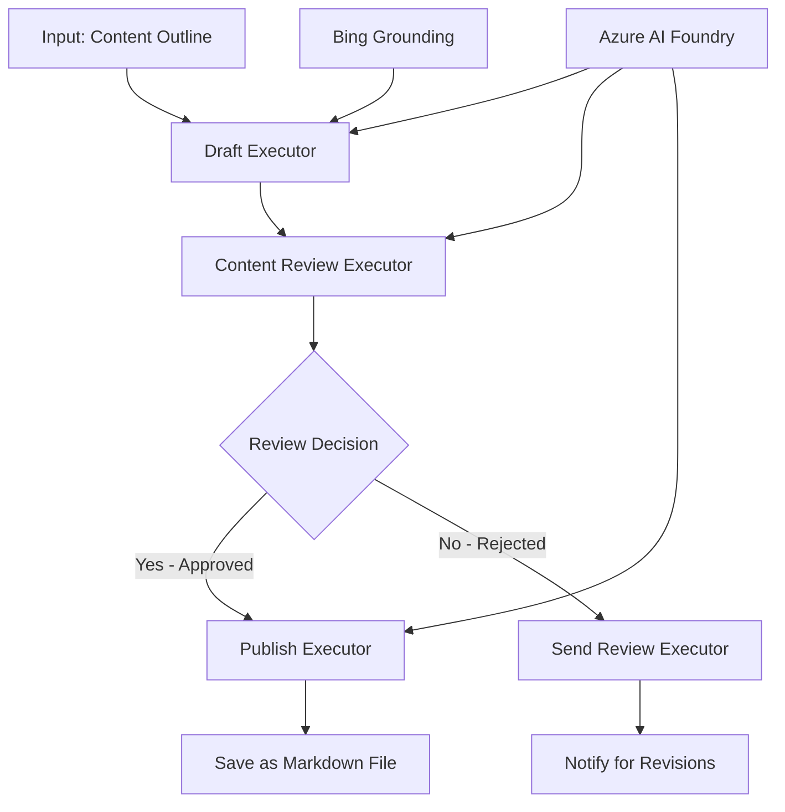

<!--
CO_OP_TRANSLATOR_METADATA:
{
  "original_hash": "8abd335151cee553293b637ee3d80d10",
  "translation_date": "2025-11-11T12:21:29+00:00",
  "source_file": "08-multi-agent/code_samples/workflows-agent-framework/dotNET/04.dotnet-agent-framework-workflow-aifoundry-condition.md",
  "language_code": "nl"
}
-->
# 🔀 Voorwaardelijke Agent Workflows met Azure AI Foundry (.NET)

## 📋 Tutorial voor Intelligente Beslissingsgebaseerde Workflows

Deze notebook demonstreert **voorwaardelijke workflowpatronen** met Azure AI Foundry en het Microsoft Agent Framework voor .NET. Je leert hoe je geavanceerde, besluitgestuurde workflows kunt bouwen die verwerking intelligent routeren op basis van AI-analyse, bedrijfsregels en dynamische voorwaarden voor automatisering op ondernemingsniveau.

## 🎯 Leerdoelen

### 🧠 **Intelligente Beslissingsarchitectuur**
- **Implementatie van Voorwaardelijke Logica**: Bouw complexe beslissingsbomen met meerdere vertakkingspunten
- **AI-gestuurde Routering**: Gebruik Azure AI Foundry-modellen om intelligente routeringsbeslissingen te nemen
- **Dynamische Workflowaanpassing**: Pas het gedrag van workflows aan op basis van runtime-analyse en voorwaarden
- **Integratie van Bedrijfsregels**: Verwerk bedrijfslogica en nalevingsvereisten in workflows

### 🔀 **Geavanceerde Voorwaardelijke Patronen**
- **Besluitvorming op Basis van Meerdere Criteria**: Evalueer meerdere factoren voor routeringsbeslissingen
- **Contextbewuste Verwerking**: Neem beslissingen op basis van geaccumuleerde workflowcontext en geschiedenis
- **Aanpasbare Workflowmodificatie**: Pas verwerkingspaden dynamisch aan op basis van realtime voorwaarden
- **Integratie van Regelengines**: Implementeer geavanceerde bedrijfsregelengines binnen workflows

### 🏢 **Voorwaardelijke Toepassingen op Ondernemingsniveau**
- **Documentclassificatie en Routering**: Classificeer en routeer documenten automatisch naar de juiste workflows
- **Klantenservice Triage**: Intelligente routering van klantvragen naar gespecialiseerde teams
- **Nalevings- en Risicoprocessen**: Pas verschillende validatie- en beoordelingsprocessen toe op basis van risicobeoordeling
- **Workflows voor Kwaliteitscontrole**: Routeer inhoud door geschikte beoordelingsprocessen op basis van kwaliteitscriteria

## ⚙️ Vereisten & Setup

### 📦 **Benodigde NuGet-pakketten**

Geavanceerde pakketten voor voorwaardelijke workflowverwerking:

```xml
<!-- Core AI Framework -->
<PackageReference Include="Microsoft.Extensions.AI" Version="9.9.0" />

<!-- Azure AI Agents with Persistent State -->
<PackageReference Include="Azure.AI.Agents.Persistent" Version="1.2.0-beta.5" />

<!-- Azure Identity and Utilities -->
<PackageReference Include="Azure.Identity" Version="1.15.0" />
<PackageReference Include="System.Linq.Async" Version="6.0.3" />
<PackageReference Include="DotNetEnv" Version="3.1.1" />

<!-- Local Workflow Framework References -->
<!-- Microsoft.Agents.Workflows.dll - Advanced workflow orchestration -->
<!-- Microsoft.Agents.AI.AzureAI.dll - Azure AI Foundry integration -->
<!-- Microsoft.Agents.AI.dll - Core agent abstractions -->
```

### 🔑 **Azure AI Foundry Configuratie**

**Benodigde Azure-resources:**
- Azure AI Foundry-werkruimte met modellen voor voorwaardelijke verwerking
- Azure-abonnement met geschikte compute-quota's en machtigingen
- Geïmplementeerde AI-modellen voor besluitvorming en inhoudsanalyse
- (Optioneel) Bing Search API-verbinding voor groundingmogelijkheden

**Omgevingsconfiguratie (.env-bestand):**
```env
# Azure AI Foundry Configuration
AZURE_AI_PROJECT_ENDPOINT=https://your-project.cognitiveservices.azure.com/
BING_CONNECTION_ID=your-bing-connection-id
```

**Authenticatie Setup:**
```csharp
// Azure CLI or Managed Identity authentication
using Azure.Identity;
var credential = new AzureCliCredential();

// Load environment configuration
DotNetEnv.Env.Load("../../../.env");
```

### 🏗️ **Voorwaardelijke Workflowarchitectuur**



**Belangrijke Componenten:**
- **Draft Executor**: AI-agent die initiële inhoudconcepten maakt op basis van outlines
- **Content Review Executor**: AI-agent die de kwaliteit en naleving van concepten beoordeelt
- **Voorwaardelijke Routering**: Beslissingslogica die routeert op basis van beoordelingsresultaten
- **Publiceer-/Beoordelingspaden**: Gescheiden verwerkingspaden voor goedgekeurde versus afgekeurde inhoud
- **State Management**: Behoudt inhoud en beoordelingscontext gedurende de workflow

## 🎨 **Ontwerp Patronen voor Voorwaardelijke Workflows**

### 📋 **Inhoudsproductie met Kwaliteitscontroles**
```
Outline → Draft Creation → Quality Review → {Approve: Publish | Reject: Revise}
```

### 🎯 **Risicogebaseerde Documentverwerking**
```
Document → Risk Assessment → {Low: Standard | High: Enhanced Review}
```

### 🔍 **Intelligente Routering voor Klantenservice**
```
Customer Query → Analysis → {Simple: FAQ Bot | Complex: Human Agent}
```

### 💼 **Nalevingsgestuurde Workflows**
```
Content → Compliance Check → {Pass: Publish | Fail: Legal Review}
```

## 🏢 **Voordelen van Voorwaardelijke Workflows op Ondernemingsniveau**

### 🎯 **Intelligente Automatisering**
- **Slimme Besluitvorming**: AI-gestuurde routeringsbeslissingen op basis van inhoudsanalyse en context
- **Aanpasbare Verwerking**: Workflows die automatisch aanpassen aan veranderende omstandigheden
- **Handhaving van Bedrijfsregels**: Automatische toepassing van complexe bedrijfslogica en beleidsregels
- **Contextbewuste Routering**: Beslissingen gebaseerd op volledige workflowgeschiedenis en geaccumuleerde context

### 📈 **Operationele Uitmuntendheid**
- **Geoptimaliseerde Resourceallocatie**: Routeer werk naar de meest geschikte specialisten en processen
- **Verminderde Handmatige Interventie**: Geautomatiseerde besluitvorming minimaliseert de noodzaak van menselijke routering
- **Snellere Oplostijden**: Directe routering naar geschikte expertise en verwerkingsmogelijkheden
- **Consistente Toepassing**: Uniforme toepassing van bedrijfsregels en beslissingscriteria

### 🛡️ **Risicobeheer & Naleving**
- **Geautomatiseerde Risicobeoordeling**: AI-gestuurde evaluatie van inhoud en situatie-risiconiveaus
- **Handhaving van Naleving**: Automatische routering door vereiste regelgevingsprocessen
- **Toepassing van Beveiligingsprotocollen**: Verbeterde beveiligingsmaatregelen toegepast op basis van risicobeoordeling
- **Onderhoud van Audit Trails**: Volledige documentatie van routeringsbeslissingen en onderbouwing

### 📊 **Analytics & Continue Verbetering**
- **Beslissingsanalyse**: Volg de effectiviteit en nauwkeurigheid van routeringsbeslissingen
- **Patroonherkenning**: Identificeer trends en patronen in routeringsbeslissingen in de tijd
- **Prestatieoptimalisatie**: Continue verbetering van beslissingscriteria en routeringsefficiëntie
- **Business Intelligence**: Inzichten in inhoudskenmerken en verwerkingsvereisten

### 🔧 **Technische Uitmuntendheid**
- **Persistent State Management**: Behoud complexe status gedurende workflowuitvoering
- **Schaalbare Architectuur**: Verwerk hoge volumes voorwaardelijke verwerkingseisen
- **Integratiemogelijkheden**: Naadloze integratie met bestaande bedrijfsystemen en processen
- **Monitoring & Observability**: Uitgebreide tracking van workflowprestaties en beslissingen

Laten we intelligente, besluitgestuurde workflows voor ondernemingen bouwen met .NET! 🚀

## 💻 Code Uitvoeren

De volledige implementatie is beschikbaar in `04.dotnet-agent-framework-workflow-aifoundry-condition.cs`. Dit demonstreert een **inhoudsproductieworkflow met kwaliteitscontroles**:

### 🏗️ **Workflowarchitectuur**

```
Content Outline → Draft Creation → Quality Review → Conditional Routing:
                                                      ├─ Approved (>200 words) → Publish
                                                      └─ Rejected (<200 words) → Review Notification
```

**Agents in de Workflow:**
1. **Evangelist Agent**: Maakt tutorialconcepten van outlines met Bing-grounding
2. **Content Reviewer Agent**: Beoordeelt de kwaliteit van concepten (woordenaantal, volledigheid)
3. **Publisher Agent**: Slaat goedgekeurde inhoud op als timestamped Markdown-bestanden

**Aangepaste Executors:**
1. **DraftExecutor**: Orkestreert het maken van concepten
2. **ContentReviewExecutor**: Voert kwaliteitsbeoordeling uit
3. **PublishExecutor**: Behandelt publicatie van goedgekeurde inhoud
4. **SendReviewExecutor**: Beheert notificaties voor afgekeurde inhoud

### 🚀 Voorbeeld Uitvoeren

**Vereisten:**
- Geconfigureerde Azure AI Foundry-werkruimte
- Azure CLI-authenticatie (`az login`)
- (Optioneel) Bing Search-verbinding voor grounding

```bash
# Make the script executable (Unix/Linux/macOS)
chmod +x 04.dotnet-agent-framework-workflow-aifoundry-condition.cs

# Run the conditional workflow
./04.dotnet-agent-framework-workflow-aifoundry-condition.cs
```

Of op Windows:
```powershell
dotnet run 04.dotnet-agent-framework-workflow-aifoundry-condition.cs
```

### 📝 Verwachte Output

De workflow zal:
1. **Agents Creëren**: Drie gespecialiseerde Azure AI Foundry-agents initialiseren
2. **Concept Genereren**: Evangelist-agent maakt tutorialconcept van outline
3. **Inhoud Beoordelen**: Content Reviewer beoordeelt de kwaliteit van het concept
4. **Voorwaardelijke Routering**:
   - **Als goedgekeurd (>200 woorden)**: Publish executor slaat op als Markdown-bestand
   - **Als afgekeurd (<200 woorden)**: Stuur beoordelingsnotificatie
5. **Resultaten Tonen**: Laat het uiteindelijke workflowresultaat zien

### 🔧 Aanpassingsopties

**Beoordelingscriteria Wijzigen:**
```csharp
const string ContentReviewerInstructions = @"
You are a content reviewer...
1. Check if content is more than 500 words (instead of 200)
2. Verify technical accuracy
3. Ensure proper formatting
...";
```

**Meer Voorwaardelijke Paden Toevoegen:**
```csharp
var workflow = new WorkflowBuilder(draftExecutor)
    .AddEdge(draftExecutor, contentReviewerExecutor)
    .AddEdge(contentReviewerExecutor, publishExecutor, condition: GetCondition("Excellent"))
    .AddEdge(contentReviewerExecutor, editExecutor, condition: GetCondition("Good"))
    .AddEdge(contentReviewerExecutor, sendReviewerExecutor, condition: GetCondition("Poor"))
    .Build();
```

**Inhoudseisen Wijzigen:**
```csharp
string OUTLINE_Content = @"
# Your Custom Topic
## Section 1
https://your-reference-url
## Section 2
...
";
```

### 🎯 Toepassingen in de Praktijk

Dit voorwaardelijke workflowpatroon is ideaal voor:
- **Content Management Systemen**: Geautomatiseerde redactionele workflows met kwaliteitscontroles
- **Documentverwerking**: Routeer documenten op basis van classificatie en naleving
- **Klantenondersteuning**: Intelligente ticketroutering op basis van complexiteit en urgentie
- **Juridische Beoordeling**: Routeer contracten op basis van risicobeoordeling en waarde
- **HR-processen**: Routeer sollicitaties door geschikte screeningsworkflows

### 🔍 Begrip van Voorwaardelijke Logica

**Condition Functie:**
```csharp
public Func<object?, bool> GetCondition(string expectedResult) =>
    reviewResult => reviewResult is ReviewResult review && review.Result == expectedResult;
```

Deze functie creëert een predicaat dat:
1. Controleert of het resultaat van het type `ReviewResult` is
2. De eigenschap `Result` vergelijkt met de verwachte waarde
3. True/false retourneert om routering te bepalen

**Workflow Edges met Voorwaarden:**
```csharp
.AddEdge(contentReviewerExecutor, publishExecutor, condition: GetCondition("Yes"))
.AddEdge(contentReviewerExecutor, sendReviewerExecutor, condition: GetCondition("No"))
```

### 📊 Geavanceerde Functies

**JSON Schema Validatie:**
De workflow gebruikt JSON-schema's om gestructureerde antwoorden te garanderen:

```csharp
// Define response structure
public class ReviewResult
{
    [JsonPropertyName("review_result")]
    public string Result { get; set; } = string.Empty;
    
    [JsonPropertyName("reason")]
    public string Reason { get; set; } = string.Empty;
    
    [JsonPropertyName("draft_content")]
    public string DraftContent { get; set; } = string.Empty;
}

// Apply to agent
ResponseFormat = ChatResponseFormat.ForJsonSchema(
    AIJsonUtilities.CreateJsonSchema(typeof(ReviewResult)), 
    "ReviewResult", 
    "Review Result From DraftContent"
)
```

**Bing Grounding Integratie:**
De Evangelist-agent gebruikt Bing-grounding om toegang te krijgen tot realtime informatie:

```csharp
var bingGroundingConfig = new BingGroundingSearchConfiguration(bing_conn_id);
BingGroundingToolDefinition bingGroundingTool = new(
    new BingGroundingSearchToolParameters([bingGroundingConfig])
);
```

Dit stelt de agent in staat om URL's in de outline te volgen en actuele informatie te extraheren.

### 🛡️ Foutafhandeling

De workflow bevat robuuste foutafhandeling voor afgekeurde inhoud:
- Beoordelingsfouten activeren het alternatieve pad
- Notificaties bieden duidelijke redenen voor afwijzing
- Inhoud wordt bewaard voor revisie

### 🔄 Workflow Uitbreiden

**Een Revisielus Toevoegen:**
Creëer een feedbacklus die inhoud automatisch opnieuw opstelt:

```csharp
.AddEdge(contentReviewerExecutor, publishExecutor, condition: GetCondition("Yes"))
.AddEdge(contentReviewerExecutor, draftExecutor, condition: GetCondition("No")) // Loop back
```

**Meerdere Beoordelingsniveaus Implementeren:**
Voeg meerdere beoordelingsstadia toe met verschillende criteria:

```csharp
.AddEdge(draftExecutor, technicalReviewer)
.AddEdge(technicalReviewer, editorialReviewer, condition: GetCondition("TechPass"))
.AddEdge(editorialReviewer, publishExecutor, condition: GetCondition("EditPass"))
```

Dit voorwaardelijke workflowpatroon biedt de basis voor het bouwen van geavanceerde, intelligente automatiseringssystemen voor ondernemingen! 🚀

---

<!-- CO-OP TRANSLATOR DISCLAIMER START -->
**Disclaimer**:  
Dit document is vertaald met behulp van de AI-vertalingsservice [Co-op Translator](https://github.com/Azure/co-op-translator). Hoewel we streven naar nauwkeurigheid, dient u zich ervan bewust te zijn dat geautomatiseerde vertalingen fouten of onnauwkeurigheden kunnen bevatten. Het originele document in de oorspronkelijke taal moet worden beschouwd als de gezaghebbende bron. Voor kritieke informatie wordt professionele menselijke vertaling aanbevolen. Wij zijn niet aansprakelijk voor eventuele misverstanden of verkeerde interpretaties die voortvloeien uit het gebruik van deze vertaling.
<!-- CO-OP TRANSLATOR DISCLAIMER END -->