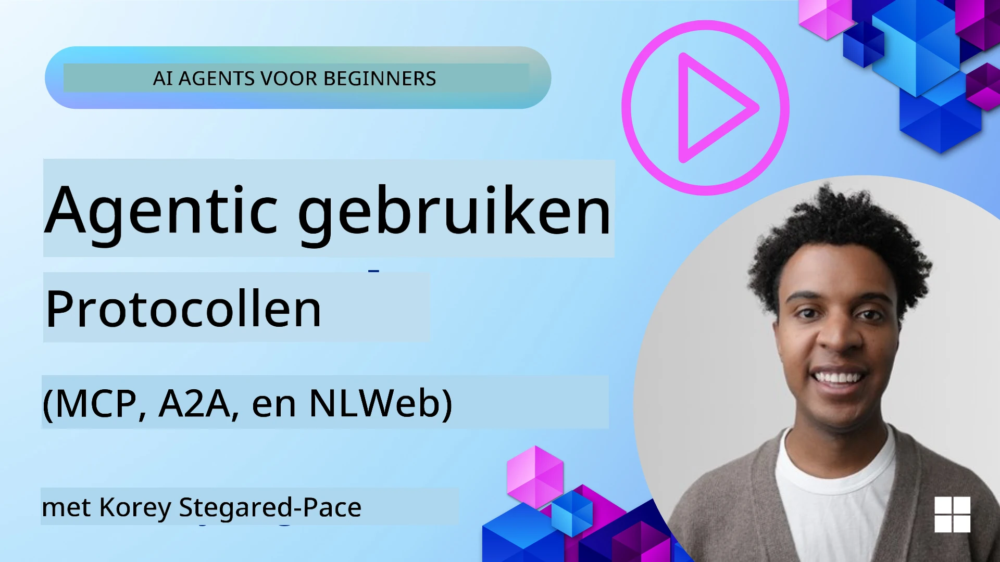
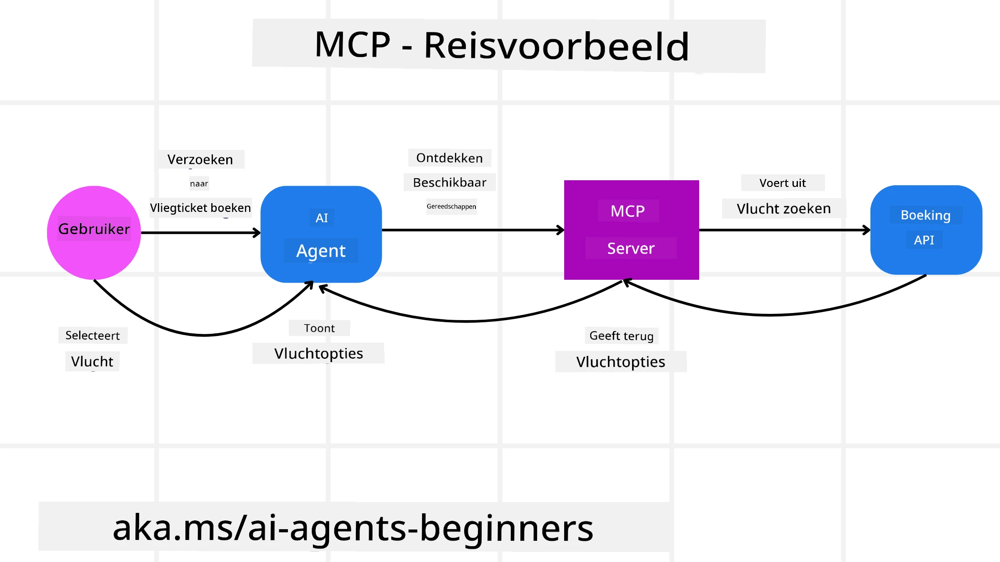
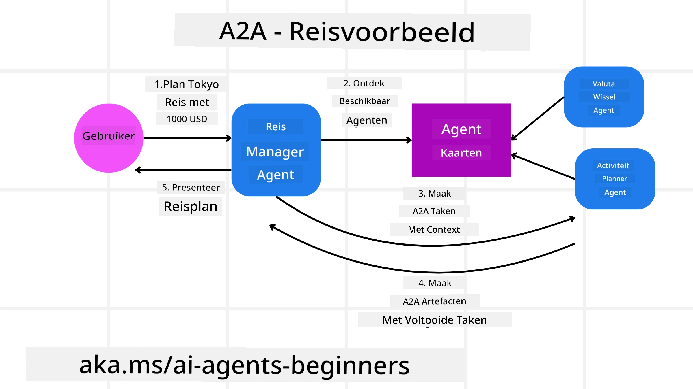
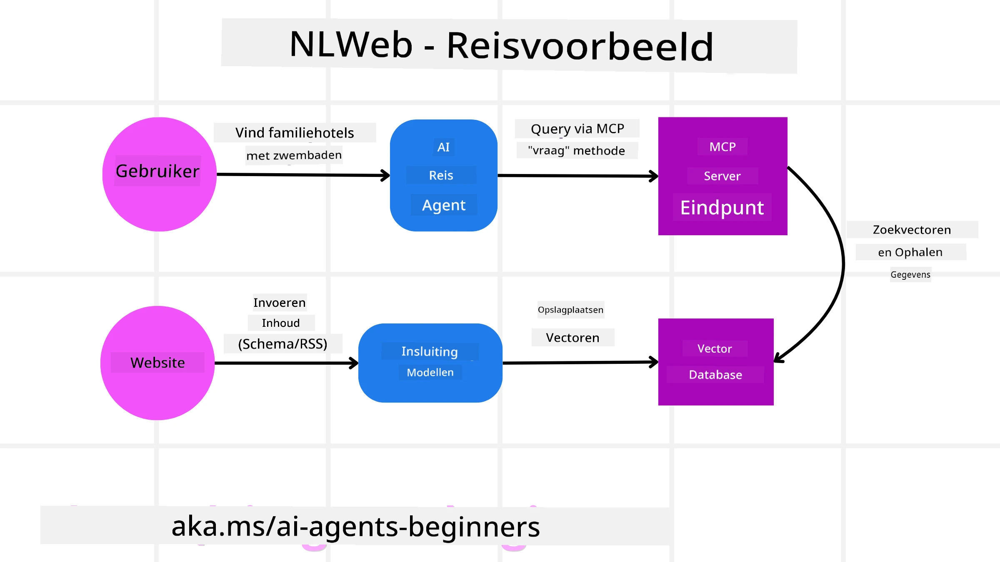

<!--
CO_OP_TRANSLATOR_METADATA:
{
  "original_hash": "aff92c6f019b4627ca9399c6e3882e17",
  "translation_date": "2025-09-18T15:11:15+00:00",
  "source_file": "11-agentic-protocols/README.md",
  "language_code": "nl"
}
-->
# Gebruik van Agentische Protocollen (MCP, A2A en NLWeb)

> _(Klik op de afbeelding hierboven om de video van deze les te bekijken)_

Naarmate het gebruik van AI-agenten toeneemt, groeit ook de behoefte aan protocollen die standaardisatie, beveiliging en open innovatie ondersteunen. In deze les behandelen we drie protocollen die aan deze behoefte proberen te voldoen: Model Context Protocol (MCP), Agent to Agent (A2A) en Natural Language Web (NLWeb).

## Introductie

In deze les behandelen we:

• Hoe **MCP** AI-agenten in staat stelt om externe tools en gegevens te gebruiken om taken voor gebruikers uit te voeren.

• Hoe **A2A** communicatie en samenwerking tussen verschillende AI-agenten mogelijk maakt.

• Hoe **NLWeb** natuurlijke taalinterfaces naar elke website brengt, waardoor AI-agenten de inhoud kunnen ontdekken en ermee kunnen interageren.

## Leerdoelen

• **Identificeer** het kerngebruik en de voordelen van MCP, A2A en NLWeb in de context van AI-agenten.

• **Leg uit** hoe elk protocol communicatie en interactie tussen LLM's, tools en andere agenten faciliteert.

• **Herken** de verschillende rollen die elk protocol speelt bij het bouwen van complexe agentische systemen.

## Model Context Protocol

Het **Model Context Protocol (MCP)** is een open standaard die een gestandaardiseerde manier biedt voor applicaties om context en tools aan LLM's te leveren. Dit maakt een "universele adapter" mogelijk voor verschillende gegevensbronnen en tools waarmee AI-agenten op een consistente manier verbinding kunnen maken.

Laten we kijken naar de componenten van MCP, de voordelen ten opzichte van direct API-gebruik en een voorbeeld van hoe AI-agenten een MCP-server kunnen gebruiken.

### MCP Kerncomponenten

MCP werkt op een **client-serverarchitectuur** en de kerncomponenten zijn:

• **Hosts** zijn LLM-applicaties (bijvoorbeeld een code-editor zoals VSCode) die verbindingen met een MCP-server starten.

• **Clients** zijn componenten binnen de hostapplicatie die één-op-één verbindingen met servers onderhouden.

• **Servers** zijn lichte programma's die specifieke mogelijkheden bieden.

Het protocol bevat drie kernprimitieven die de mogelijkheden van een MCP-server vormen:

• **Tools**: Dit zijn afzonderlijke acties of functies die een AI-agent kan oproepen om een actie uit te voeren. Bijvoorbeeld, een weerservice kan een "get weather"-tool aanbieden, of een e-commerceserver kan een "purchase product"-tool aanbieden. MCP-servers adverteren de naam, beschrijving en input/output-schema van elke tool in hun capaciteitenlijst.

• **Resources**: Dit zijn alleen-lezen gegevensitems of documenten die een MCP-server kan leveren, en clients kunnen ze op aanvraag ophalen. Voorbeelden zijn bestandsinhoud, databasegegevens of logbestanden. Resources kunnen tekst zijn (zoals code of JSON) of binair (zoals afbeeldingen of PDF's).

• **Prompts**: Dit zijn vooraf gedefinieerde sjablonen die voorgestelde prompts bieden, waardoor complexere workflows mogelijk worden.

### Voordelen van MCP

MCP biedt aanzienlijke voordelen voor AI-agenten:

• **Dynamische Toolontdekking**: Agenten kunnen dynamisch een lijst ontvangen van beschikbare tools van een server, samen met beschrijvingen van wat ze doen. Dit verschilt van traditionele API's, die vaak statische codering voor integraties vereisen, wat betekent dat elke API-wijziging code-updates vereist. MCP biedt een "eenmalig integreren"-benadering, wat leidt tot meer flexibiliteit.

• **Interoperabiliteit tussen LLM's**: MCP werkt met verschillende LLM's, waardoor flexibiliteit ontstaat om kernmodellen te wisselen en te evalueren voor betere prestaties.

• **Gestandaardiseerde Beveiliging**: MCP bevat een standaard authenticatiemethode, wat de schaalbaarheid verbetert bij het toevoegen van toegang tot extra MCP-servers. Dit is eenvoudiger dan het beheren van verschillende sleutels en authenticatietypen voor diverse traditionele API's.

### MCP Voorbeeld

Stel je voor dat een gebruiker een vlucht wil boeken met behulp van een AI-assistent die wordt aangedreven door MCP.

1. **Verbinding**: De AI-assistent (de MCP-client) maakt verbinding met een MCP-server van een luchtvaartmaatschappij.

2. **Toolontdekking**: De client vraagt de MCP-server van de luchtvaartmaatschappij: "Welke tools zijn beschikbaar?" De server reageert met tools zoals "search flights" en "book flights".

3. **Tooloproep**: Je vraagt de AI-assistent: "Zoek een vlucht van Portland naar Honolulu." De AI-assistent, gebruikmakend van zijn LLM, identificeert dat hij de "search flights"-tool moet oproepen en geeft de relevante parameters (vertrekpunt, bestemming) door aan de MCP-server.

4. **Uitvoering en Reactie**: De MCP-server, die fungeert als een wrapper, voert de daadwerkelijke oproep uit naar de interne boekings-API van de luchtvaartmaatschappij. Vervolgens ontvangt het de vluchtinformatie (bijv. JSON-gegevens) en stuurt deze terug naar de AI-assistent.

5. **Verdere Interactie**: De AI-assistent presenteert de vluchtopties. Zodra je een vlucht selecteert, kan de assistent de "book flight"-tool op dezelfde MCP-server oproepen om de boeking te voltooien.

## Agent-to-Agent Protocol (A2A)

Terwijl MCP zich richt op het verbinden van LLM's met tools, gaat het **Agent-to-Agent (A2A) protocol** een stap verder door communicatie en samenwerking tussen verschillende AI-agenten mogelijk te maken. A2A verbindt AI-agenten van verschillende organisaties, omgevingen en technologieën om een gedeelde taak te voltooien.

We zullen de componenten en voordelen van A2A onderzoeken, samen met een voorbeeld van hoe het kan worden toegepast in onze reisapplicatie.

### A2A Kerncomponenten

A2A richt zich op het mogelijk maken van communicatie tussen agenten en hen laten samenwerken om een subtaken van de gebruiker te voltooien. Elke component van het protocol draagt hieraan bij:

#### Agentkaart

Net zoals een MCP-server een lijst met tools deelt, bevat een Agentkaart:
- De naam van de agent.
- Een **beschrijving van de algemene taken** die hij uitvoert.
- Een **lijst van specifieke vaardigheden** met beschrijvingen om andere agenten (of zelfs menselijke gebruikers) te helpen begrijpen wanneer en waarom ze deze agent zouden willen oproepen.
- De **huidige Endpoint-URL** van de agent.
- De **versie** en **mogelijkheden** van de agent, zoals streamingreacties en pushmeldingen.

#### Agentuitvoerder

De Agentuitvoerder is verantwoordelijk voor **het doorgeven van de context van de gebruikerschat aan de externe agent**, zodat de externe agent begrijpt welke taak moet worden uitgevoerd. In een A2A-server gebruikt een agent zijn eigen Large Language Model (LLM) om binnenkomende verzoeken te verwerken en taken uit te voeren met zijn eigen interne tools.

#### Artefact

Zodra een externe agent de gevraagde taak heeft voltooid, wordt het werkproduct gecreëerd als een artefact. Een artefact **bevat het resultaat van het werk van de agent**, een **beschrijving van wat is voltooid**, en de **tekstcontext** die via het protocol wordt verzonden. Nadat het artefact is verzonden, wordt de verbinding met de externe agent gesloten totdat deze opnieuw nodig is.

#### Gebeurtenissenwachtrij

Deze component wordt gebruikt voor **het afhandelen van updates en het doorgeven van berichten**. Het is vooral belangrijk in productie voor agentische systemen om te voorkomen dat de verbinding tussen agenten wordt gesloten voordat een taak is voltooid, vooral wanneer de voltooiingstijd langer kan duren.

### Voordelen van A2A

• **Verbeterde Samenwerking**: Het stelt agenten van verschillende leveranciers en platforms in staat om te interageren, context te delen en samen te werken, wat naadloze automatisering mogelijk maakt tussen traditioneel losgekoppelde systemen.

• **Flexibiliteit in Modelselectie**: Elke A2A-agent kan beslissen welk LLM hij gebruikt om zijn verzoeken te verwerken, waardoor geoptimaliseerde of fijn afgestemde modellen per agent mogelijk zijn, in tegenstelling tot een enkele LLM-verbinding in sommige MCP-scenario's.

• **Ingebouwde Authenticatie**: Authenticatie is direct geïntegreerd in het A2A-protocol, wat een robuust beveiligingskader biedt voor interacties tussen agenten.

### A2A Voorbeeld

Laten we ons reisscenario uitbreiden, maar deze keer met A2A.

1. **Gebruikersverzoek aan Multi-Agent**: Een gebruiker communiceert met een "Reisagent" A2A-client/agent, bijvoorbeeld door te zeggen: "Boek een volledige reis naar Honolulu voor volgende week, inclusief vluchten, een hotel en een huurauto."

2. **Orchestratie door Reisagent**: De Reisagent ontvangt dit complexe verzoek. Hij gebruikt zijn LLM om na te denken over de taak en bepaalt dat hij moet communiceren met andere gespecialiseerde agenten.

3. **Inter-Agent Communicatie**: De Reisagent gebruikt vervolgens het A2A-protocol om verbinding te maken met downstream-agenten, zoals een "Luchtvaartmaatschappijagent," een "Hotelagent," en een "Autoverhuuragent" die door verschillende bedrijven zijn gemaakt.

4. **Uitvoering van Gedelegeerde Taken**: De Reisagent stuurt specifieke taken naar deze gespecialiseerde agenten (bijv. "Zoek vluchten naar Honolulu," "Boek een hotel," "Huur een auto"). Elk van deze gespecialiseerde agenten, die hun eigen LLM's draaien en hun eigen tools gebruiken (die zelf MCP-servers kunnen zijn), voert zijn specifieke deel van de boeking uit.

5. **Geconsolideerde Reactie**: Zodra alle downstream-agenten hun taken hebben voltooid, stelt de Reisagent de resultaten samen (vluchtgegevens, hotelbevestiging, autoverhuurboeking) en stuurt een uitgebreide, chatstijlreactie terug naar de gebruiker.

## Natural Language Web (NLWeb)

Websites zijn al lang de primaire manier voor gebruikers om informatie en gegevens op internet te vinden.

Laten we kijken naar de verschillende componenten van NLWeb, de voordelen van NLWeb en een voorbeeld van hoe NLWeb werkt door naar onze reisapplicatie te kijken.

### Componenten van NLWeb

- **NLWeb Applicatie (Kernservicecode)**: Het systeem dat natuurlijke taalvragen verwerkt. Het verbindt de verschillende delen van het platform om antwoorden te genereren. Je kunt het zien als de **motor die de natuurlijke taalfunctionaliteiten van een website aandrijft**.

- **NLWeb Protocol**: Dit is een **basisset regels voor natuurlijke taalinteractie** met een website. Het stuurt antwoorden terug in JSON-formaat (vaak met Schema.org). Het doel is om een eenvoudige basis te creëren voor het "AI-web," op dezelfde manier waarop HTML het mogelijk maakte om documenten online te delen.

- **MCP Server (Model Context Protocol Endpoint)**: Elke NLWeb-setup werkt ook als een **MCP-server**. Dit betekent dat het **tools (zoals een "ask"-methode) en gegevens** kan delen met andere AI-systemen. In de praktijk maakt dit de inhoud en mogelijkheden van de website bruikbaar voor AI-agenten, waardoor de site deel uitmaakt van het bredere "agentecosysteem."

- **Embedding Modellen**: Deze modellen worden gebruikt om **website-inhoud om te zetten in numerieke representaties, zogenaamde vectoren** (embeddings). Deze vectoren vangen betekenis op een manier die computers kunnen vergelijken en doorzoeken. Ze worden opgeslagen in een speciale database, en gebruikers kunnen kiezen welk embeddingmodel ze willen gebruiken.

- **Vector Database (Ophaalmechanisme)**: Deze database **slaat de embeddings van de website-inhoud op**. Wanneer iemand een vraag stelt, controleert NLWeb de vectordatabase om snel de meest relevante informatie te vinden. Het geeft een snelle lijst van mogelijke antwoorden, gerangschikt op overeenkomst. NLWeb werkt met verschillende vectoropslagsystemen zoals Qdrant, Snowflake, Milvus, Azure AI Search en Elasticsearch.

### NLWeb Voorbeeld

Laten we onze reisboekingswebsite opnieuw bekijken, maar deze keer aangedreven door NLWeb.

1. **Gegevensinvoer**: De bestaande productcatalogi van de reiswebsite (bijv. vluchtlijsten, hotelbeschrijvingen, reisarrangementen) worden geformatteerd met Schema.org of geladen via RSS-feeds. De tools van NLWeb verwerken deze gestructureerde gegevens, maken embeddings en slaan ze op in een lokale of externe vectordatabase.

2. **Natuurlijke Taalvraag (Mens)**: Een gebruiker bezoekt de website en typt in plaats van menu's te navigeren in een chatinterface: "Vind een gezinsvriendelijk hotel in Honolulu met een zwembad voor volgende week."

3. **NLWeb Verwerking**: De NLWeb-applicatie ontvangt deze vraag. Het stuurt de vraag naar een LLM voor interpretatie en zoekt tegelijkertijd in zijn vectordatabase naar relevante hotelbeschrijvingen.

4. **Nauwkeurige Resultaten**: De LLM helpt de zoekresultaten uit de database te interpreteren, identificeert de beste matches op basis van "gezinsvriendelijk," "zwembad," en "Honolulu"-criteria, en formatteert een natuurlijke taalreactie. Cruciaal is dat de reactie verwijst naar daadwerkelijke hotels uit de catalogus van de website, waardoor verzonnen informatie wordt vermeden.

5. **Interactie met AI-agent**: Omdat NLWeb fungeert als een MCP-server, kan een externe AI-reisagent ook verbinding maken met de NLWeb-instantie van deze website. De AI-agent kan dan de `ask` MCP-methode gebruiken om de website direct te bevragen: `ask("Zijn er veganistische restaurants in de buurt van Honolulu aanbevolen door het hotel?")`. De NLWeb-instantie zou dit verwerken, gebruikmakend van zijn database met restaurantinformatie (indien geladen), en een gestructureerde JSON-reactie terugsturen.

### Meer Vragen over MCP/A2A/NLWeb?

Word lid van de [Azure AI Foundry Discord](https://aka.ms/ai-agents/discord) om andere leerlingen te ontmoeten, spreekuren bij te wonen en je vragen over AI-agenten beantwoord te krijgen.

## Bronnen

- [MCP voor Beginners](https://aka.ms/mcp-for-beginners)  
- [MCP Documentatie](https://github.com/microsoft/semantic-kernel/tree/main/python/semantic-kernel/semantic_kernel/connectors/mcp)
- [NLWeb Repo](https://github.com/nlweb-ai/NLWeb)
- [Semantic Kernel Gidsen](https://learn.microsoft.com/semantic-kernel/)

---

**Disclaimer**:  
Dit document is vertaald met behulp van de AI-vertalingsservice [Co-op Translator](https://github.com/Azure/co-op-translator). Hoewel we streven naar nauwkeurigheid, dient u zich ervan bewust te zijn dat geautomatiseerde vertalingen fouten of onnauwkeurigheden kunnen bevatten. Het originele document in zijn oorspronkelijke taal moet worden beschouwd als de gezaghebbende bron. Voor cruciale informatie wordt professionele menselijke vertaling aanbevolen. Wij zijn niet aansprakelijk voor eventuele misverstanden of verkeerde interpretaties die voortvloeien uit het gebruik van deze vertaling.