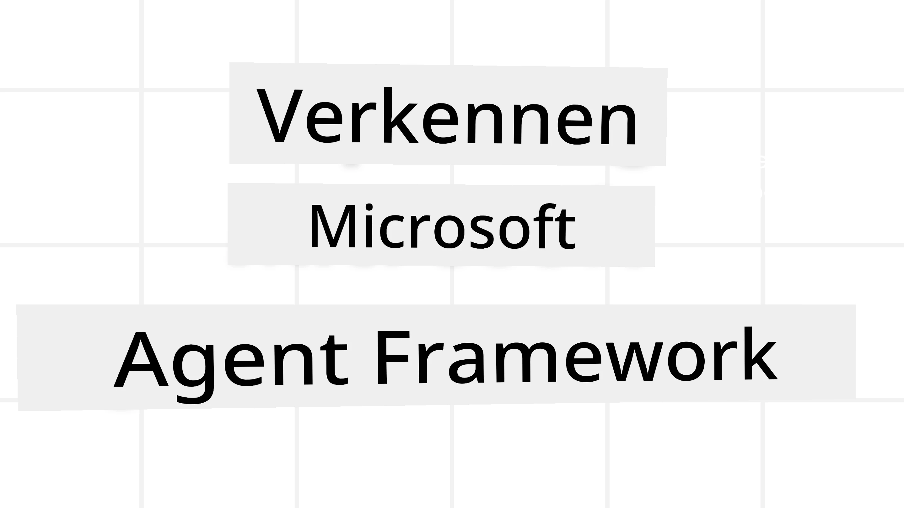
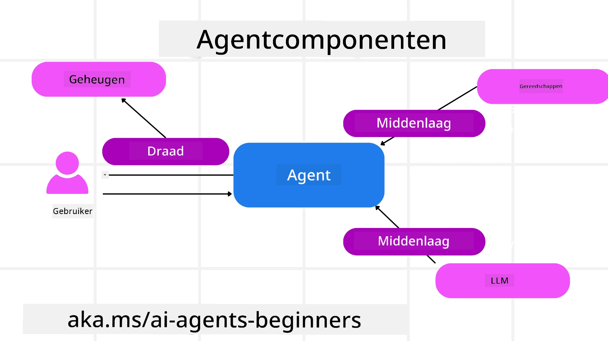

<!--
CO_OP_TRANSLATOR_METADATA:
{
  "original_hash": "19c4dab375acbc733855cc7f2f04edbc",
  "translation_date": "2025-10-02T17:25:49+00:00",
  "source_file": "14-microsoft-agent-framework/README.md",
  "language_code": "nl"
}
-->
# Microsoft Agent Framework Verkennen



### Introductie

Deze les behandelt:

- Begrijpen van Microsoft Agent Framework: Belangrijke kenmerken en waarde  
- Verkennen van de kernconcepten van Microsoft Agent Framework
- Vergelijken van MAF met Semantic Kernel en AutoGen: Migratiegids

## Leerdoelen

Na het voltooien van deze les kun je:

- Productieklare AI-agents bouwen met Microsoft Agent Framework
- De kernfuncties van Microsoft Agent Framework toepassen op jouw agent-gebaseerde use cases
- Bestaande agent-frameworks en tools migreren en integreren  

## Codevoorbeelden 

Codevoorbeelden voor [Microsoft Agent Framework (MAF)](https://aka.ms/ai-agents-beginners/agent-framewrok) zijn te vinden in deze repository onder de bestanden `xx-python-agent-framework` en `xx-dotnet-agent-framework`.

## Microsoft Agent Framework Begrijpen


[Microsoft Agent Framework (MAF)](https://aka.ms/ai-agents-beginners/agent-framewrok) bouwt voort op de ervaring en inzichten van Semantic Kernel en AutoGen. Het biedt flexibiliteit om een breed scala aan agent-gebaseerde use cases aan te pakken, zowel in productie- als onderzoeksomgevingen, waaronder:

- **Sequentiële agent-orkestratie** in scenario's waar stapsgewijze workflows nodig zijn.
- **Gelijktijdige orkestratie** in scenario's waar agents taken tegelijkertijd moeten voltooien.
- **Groepschat-orkestratie** in scenario's waar agents samen kunnen werken aan één taak.
- **Overdrachtsorkestratie** in scenario's waar agents taken aan elkaar overdragen zodra subtaken zijn voltooid.
- **Magnetische orkestratie** in scenario's waar een manager-agent een takenlijst maakt en wijzigt en de coördinatie van subagents beheert om de taak te voltooien.

Om AI-agents in productie te leveren, bevat MAF ook functies voor:

- **Observatie** door gebruik te maken van OpenTelemetry, waarbij elke actie van de AI-agent, inclusief tooloproepen, orkestratiestappen, redeneerflows en prestatiemonitoring via Azure AI Foundry-dashboards, wordt gevolgd.
- **Beveiliging** door agents native te hosten op Azure AI Foundry, inclusief beveiligingscontroles zoals rolgebaseerde toegang, privégegevensbeheer en ingebouwde inhoudsveiligheid.
- **Duurzaamheid** omdat agent-threads en workflows kunnen pauzeren, hervatten en herstellen van fouten, wat langere processen mogelijk maakt.
- **Controle** omdat workflows met menselijke tussenkomst worden ondersteund, waarbij taken worden gemarkeerd als vereisend menselijke goedkeuring.

Microsoft Agent Framework richt zich ook op interoperabiliteit door:

- **Cloud-agnostisch te zijn** - Agents kunnen draaien in containers, on-premises en op verschillende clouds.
- **Provider-agnostisch te zijn** - Agents kunnen worden gemaakt via jouw voorkeurs-SDK, inclusief Azure OpenAI en OpenAI.
- **Open standaarden te integreren** - Agents kunnen protocollen zoals Agent-to-Agent (A2A) en Model Context Protocol (MCP) gebruiken om andere agents en tools te ontdekken en te gebruiken.
- **Plugins en connectors** - Verbindingen kunnen worden gemaakt met data- en geheugenservices zoals Microsoft Fabric, SharePoint, Pinecone en Qdrant.

Laten we kijken hoe deze functies worden toegepast op enkele kernconcepten van Microsoft Agent Framework.

## Kernconcepten van Microsoft Agent Framework

### Agents



**Agents maken**

Het maken van agents gebeurt door de inferentieservice (LLM-provider) te definiëren, een set instructies voor de AI-agent om te volgen, en een toegewezen `naam`:

```python
agent = AzureOpenAIChatClient(credential=AzureCliCredential()).create_agent( instructions="You are good at recommending trips to customers based on their preferences.", name="TripRecommender" )
```

Hierboven wordt `Azure OpenAI` gebruikt, maar agents kunnen worden gemaakt met verschillende services, waaronder `Azure AI Foundry Agent Service`:

```python
AzureAIAgentClient(async_credential=credential).create_agent( name="HelperAgent", instructions="You are a helpful assistant." ) as agent
```

OpenAI `Responses`, `ChatCompletion` API's

```python
agent = OpenAIResponsesClient().create_agent( name="WeatherBot", instructions="You are a helpful weather assistant.", )
```

```python
agent = OpenAIChatClient().create_agent( name="HelpfulAssistant", instructions="You are a helpful assistant.", )
```

of externe agents via het A2A-protocol:

```python
agent = A2AAgent( name=agent_card.name, description=agent_card.description, agent_card=agent_card, url="https://your-a2a-agent-host" )
```

**Agents uitvoeren**

Agents worden uitgevoerd met de methoden `.run` of `.run_stream` voor respectievelijk niet-streaming of streaming reacties.

```python
result = await agent.run("What are good places to visit in Amsterdam?")
print(result.text)
```

```python
async for update in agent.run_stream("What are the good places to visit in Amsterdam?"):
    if update.text:
        print(update.text, end="", flush=True)

```

Elke agent-run kan ook opties bevatten om parameters aan te passen, zoals `max_tokens` die door de agent worden gebruikt, `tools` die de agent kan oproepen, en zelfs het `model` zelf dat door de agent wordt gebruikt.

Dit is handig in gevallen waarin specifieke modellen of tools nodig zijn om een taak van de gebruiker te voltooien.

**Tools**

Tools kunnen worden gedefinieerd zowel bij het definiëren van de agent:

```python
def get_attractions( location: Annotated[str, Field(description="The location to get the top tourist attractions for")], ) -> str: """Get the top tourist attractions for a given location.""" return f"The top attractions for {location} are." 


# When creating a ChatAgent directly 

agent = ChatAgent( chat_client=OpenAIChatClient(), instructions="You are a helpful assistant", tools=[get_attractions]

```

als bij het uitvoeren van de agent:

```python

result1 = await agent.run( "What's the best place to visit in Seattle?", tools=[get_attractions] # Tool provided for this run only )
```

**Agent Threads**

Agent-threads worden gebruikt om gesprekken met meerdere beurten te beheren. Threads kunnen worden gemaakt door:

- Gebruik te maken van `get_new_thread()`, waarmee de thread in de loop van de tijd kan worden opgeslagen.
- Een thread automatisch te maken bij het uitvoeren van een agent, waarbij de thread alleen tijdens de huidige run blijft bestaan.

Om een thread te maken, ziet de code er als volgt uit:

```python
# Create a new thread. 
thread = agent.get_new_thread() # Run the agent with the thread. 
response = await agent.run("Hello, I am here to help you book travel. Where would you like to go?", thread=thread)

```

Je kunt de thread vervolgens serialiseren om later te bewaren:

```python
# Create a new thread. 
thread = agent.get_new_thread() 

# Run the agent with the thread. 

response = await agent.run("Hello, how are you?", thread=thread) 

# Serialize the thread for storage. 

serialized_thread = await thread.serialize() 

# Deserialize the thread state after loading from storage. 

resumed_thread = await agent.deserialize_thread(serialized_thread)
```

**Agent Middleware**

Agents werken samen met tools en LLM's om taken van gebruikers te voltooien. In bepaalde scenario's willen we acties uitvoeren of volgen tussen deze interacties. Agent-middleware stelt ons in staat dit te doen via:

*Function Middleware*

Deze middleware stelt ons in staat een actie uit te voeren tussen de agent en een functie/tool die hij zal oproepen. Een voorbeeld hiervan is wanneer je mogelijk een logboek wilt bijhouden van de functieoproep.

In de onderstaande code definieert `next` of de volgende middleware of de daadwerkelijke functie moet worden aangeroepen.

```python
async def logging_function_middleware(
    context: FunctionInvocationContext,
    next: Callable[[FunctionInvocationContext], Awaitable[None]],
) -> None:
    """Function middleware that logs function execution."""
    # Pre-processing: Log before function execution
    print(f"[Function] Calling {context.function.name}")

    # Continue to next middleware or function execution
    await next(context)

    # Post-processing: Log after function execution
    print(f"[Function] {context.function.name} completed")
```

*Chat Middleware*

Deze middleware stelt ons in staat een actie uit te voeren of te loggen tussen de agent en de verzoeken tussen de LLM.

Dit bevat belangrijke informatie zoals de `messages` die naar de AI-service worden verzonden.

```python
async def logging_chat_middleware(
    context: ChatContext,
    next: Callable[[ChatContext], Awaitable[None]],
) -> None:
    """Chat middleware that logs AI interactions."""
    # Pre-processing: Log before AI call
    print(f"[Chat] Sending {len(context.messages)} messages to AI")

    # Continue to next middleware or AI service
    await next(context)

    # Post-processing: Log after AI response
    print("[Chat] AI response received")

```

**Agent Memory**

Zoals behandeld in de les `Agentic Memory`, is geheugen een belangrijk element om de agent in staat te stellen over verschillende contexten te opereren. MAF biedt verschillende soorten geheugen:

*In-Memory Storage*

Dit is het geheugen dat wordt opgeslagen in threads tijdens de runtime van de applicatie.

```python
# Create a new thread. 
thread = agent.get_new_thread() # Run the agent with the thread. 
response = await agent.run("Hello, I am here to help you book travel. Where would you like to go?", thread=thread)
```

*Persistent Messages*

Dit geheugen wordt gebruikt bij het opslaan van gespreksgeschiedenis over verschillende sessies. Het wordt gedefinieerd met behulp van de `chat_message_store_factory`:

```python
from agent_framework import ChatMessageStore

# Create a custom message store
def create_message_store():
    return ChatMessageStore()

agent = ChatAgent(
    chat_client=OpenAIChatClient(),
    instructions="You are a Travel assistant.",
    chat_message_store_factory=create_message_store
)

```

*Dynamic Memory*

Dit geheugen wordt toegevoegd aan de context voordat agents worden uitgevoerd. Deze herinneringen kunnen worden opgeslagen in externe services zoals mem0:

```python
from agent_framework.mem0 import Mem0Provider

# Using Mem0 for advanced memory capabilities
memory_provider = Mem0Provider(
    api_key="your-mem0-api-key",
    user_id="user_123",
    application_id="my_app"
)

agent = ChatAgent(
    chat_client=OpenAIChatClient(),
    instructions="You are a helpful assistant with memory.",
    context_providers=memory_provider
)

```

**Agent Observability**

Observatie is belangrijk voor het bouwen van betrouwbare en onderhoudbare agent-systemen. MAF integreert met OpenTelemetry om tracing en meters te bieden voor betere observatie.

```python
from agent_framework.observability import get_tracer, get_meter

tracer = get_tracer()
meter = get_meter()
with tracer.start_as_current_span("my_custom_span"):
    # do something
    pass
counter = meter.create_counter("my_custom_counter")
counter.add(1, {"key": "value"})
```

### Workflows

MAF biedt workflows die vooraf gedefinieerde stappen bevatten om een taak te voltooien en AI-agents als componenten in die stappen opnemen.

Workflows bestaan uit verschillende componenten die een betere controleflow mogelijk maken. Workflows maken ook **multi-agent orkestratie** en **checkpointing** mogelijk om workflowstatussen op te slaan.

De kerncomponenten van een workflow zijn:

**Executors**

Executors ontvangen invoerberichten, voeren hun toegewezen taken uit en produceren vervolgens een uitvoerbericht. Dit brengt de workflow dichter bij het voltooien van de grotere taak. Executors kunnen AI-agents of aangepaste logica zijn.

**Edges**

Edges worden gebruikt om de stroom van berichten in een workflow te definiëren. Deze kunnen zijn:

*Direct Edges* - Eenvoudige één-op-één verbindingen tussen executors:

```python
from agent_framework import WorkflowBuilder

builder = WorkflowBuilder()
builder.add_edge(source_executor, target_executor)
builder.set_start_executor(source_executor)
workflow = builder.build()
```

*Conditional Edges* - Geactiveerd nadat aan een bepaalde voorwaarde is voldaan. Bijvoorbeeld, wanneer hotelkamers niet beschikbaar zijn, kan een executor andere opties voorstellen.

*Switch-case Edges* - Routeer berichten naar verschillende executors op basis van gedefinieerde voorwaarden. Bijvoorbeeld, als een reisklant prioritaire toegang heeft, worden hun taken afgehandeld via een andere workflow.

*Fan-out Edges* - Stuur één bericht naar meerdere doelen.

*Fan-in Edges* - Verzamel meerdere berichten van verschillende executors en stuur ze naar één doel.

**Events**

Om workflows beter observeerbaar te maken, biedt MAF ingebouwde events voor uitvoering, waaronder:

- `WorkflowStartedEvent`  - Workflow-uitvoering begint
- `WorkflowOutputEvent` - Workflow produceert een uitvoer
- `WorkflowErrorEvent` - Workflow ondervindt een fout
- `ExecutorInvokeEvent`  - Executor begint met verwerken
- `ExecutorCompleteEvent`  - Executor voltooit verwerking
- `RequestInfoEvent` - Er wordt een verzoek uitgegeven

## Migreren van andere frameworks (Semantic Kernel en AutoGen)

### Verschillen tussen MAF en Semantic Kernel

**Vereenvoudigde agent-creatie**

Semantic Kernel vereist het maken van een Kernel-instance voor elke agent. MAF gebruikt een vereenvoudigde aanpak door extensies te gebruiken voor de belangrijkste providers.

```python
agent = AzureOpenAIChatClient(credential=AzureCliCredential()).create_agent( instructions="You are good at reccomending trips to customers based on their preferences.", name="TripRecommender" )
```

**Agent-thread-creatie**

Semantic Kernel vereist dat threads handmatig worden gemaakt. In MAF wordt de agent direct een thread toegewezen.

```python
thread = agent.get_new_thread() # Run the agent with the thread. 
```

**Toolregistratie**

In Semantic Kernel worden tools geregistreerd bij de Kernel en wordt de Kernel vervolgens doorgegeven aan de agent. In MAF worden tools direct geregistreerd tijdens het proces van agent-creatie.

```python
agent = ChatAgent( chat_client=OpenAIChatClient(), instructions="You are a helpful assistant", tools=[get_attractions]
```

### Verschillen tussen MAF en AutoGen

**Teams versus Workflows**

`Teams` zijn de eventstructuur voor gebeurtenisgestuurde activiteit met agents in AutoGen. MAF gebruikt `Workflows` die gegevens naar executors routeren via een grafiekgebaseerde architectuur.

**Toolcreatie**

AutoGen gebruikt `FunctionTool` om functies in te kapselen die door agents kunnen worden aangeroepen. MAF gebruikt @ai_function, wat vergelijkbaar werkt maar ook automatisch de schema's voor elke functie afleidt.

**Agentgedrag**

Agents zijn standaard single-turn agents in AutoGen, tenzij `max_tool_iterations` op een hogere waarde wordt ingesteld. Binnen MAF is de `ChatAgent` standaard multi-turn, wat betekent dat hij tools blijft oproepen totdat de taak van de gebruiker is voltooid.

## Codevoorbeelden 

Codevoorbeelden voor Microsoft Agent Framework zijn te vinden in deze repository onder de bestanden `xx-python-agent-framework` en `xx-dotnet-agent-framework`.

## Meer vragen over Microsoft Agent Framework?

Word lid van de [Azure AI Foundry Discord](https://aka.ms/ai-agents/discord) om andere leerlingen te ontmoeten, kantooruren bij te wonen en je vragen over AI-agents beantwoord te krijgen.

---

**Disclaimer**:  
Dit document is vertaald met behulp van de AI-vertalingsservice [Co-op Translator](https://github.com/Azure/co-op-translator). Hoewel we streven naar nauwkeurigheid, dient u zich ervan bewust te zijn dat geautomatiseerde vertalingen fouten of onnauwkeurigheden kunnen bevatten. Het originele document in de oorspronkelijke taal moet worden beschouwd als de gezaghebbende bron. Voor cruciale informatie wordt professionele menselijke vertaling aanbevolen. Wij zijn niet aansprakelijk voor misverstanden of verkeerde interpretaties die voortvloeien uit het gebruik van deze vertaling.