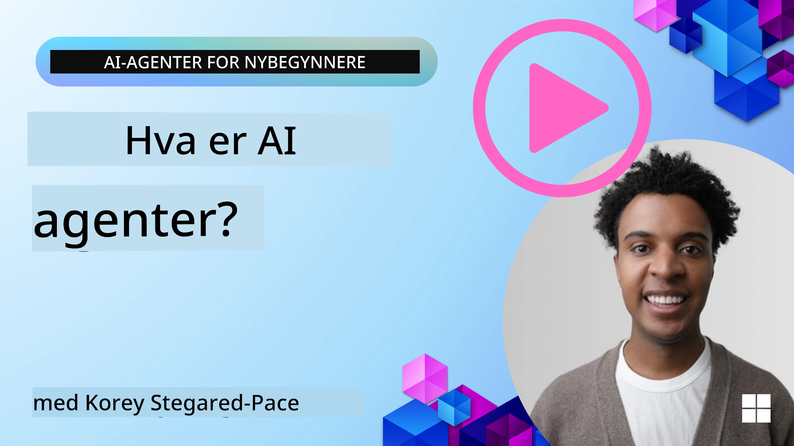
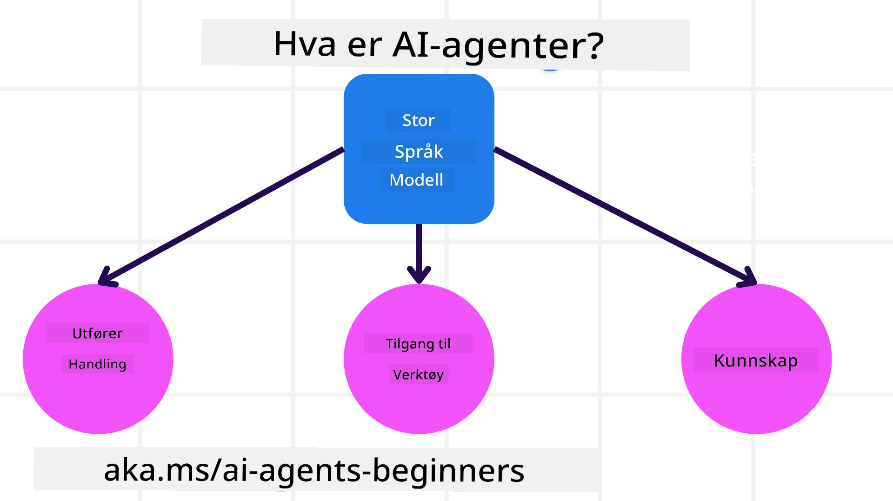
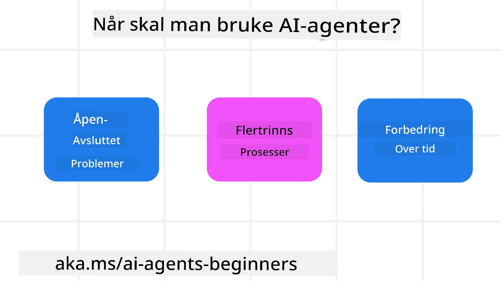

<!--
CO_OP_TRANSLATOR_METADATA:
{
  "original_hash": "cdd28bc00816d2773bb2b5968d782abc",
  "translation_date": "2025-11-11T11:22:05+00:00",
  "source_file": "01-intro-to-ai-agents/README.md",
  "language_code": "no"
}
-->

> _(Klikk på bildet over for å se videoen til denne leksjonen)_

# Introduksjon til AI-agenter og bruksområder

Velkommen til kurset "AI-agenter for nybegynnere"! Dette kurset gir grunnleggende kunnskap og praktiske eksempler for å bygge AI-agenter.

Bli med i <a href="https://discord.gg/kzRShWzttr" target="_blank">Azure AI Discord-fellesskapet</a> for å møte andre lærende og AI-agentutviklere, og still spørsmål du har om dette kurset.

For å starte kurset, begynner vi med å få en bedre forståelse av hva AI-agenter er og hvordan vi kan bruke dem i applikasjoner og arbeidsflyter vi bygger.

## Introduksjon

Denne leksjonen dekker:

- Hva er AI-agenter, og hvilke typer agenter finnes?
- Hvilke bruksområder passer best for AI-agenter, og hvordan kan de hjelpe oss?
- Hva er noen av de grunnleggende byggesteinene når man designer agentbaserte løsninger?

## Læringsmål
Etter å ha fullført denne leksjonen, skal du kunne:

- Forstå AI-agentkonsepter og hvordan de skiller seg fra andre AI-løsninger.
- Bruke AI-agenter mest effektivt.
- Designe agentbaserte løsninger produktivt for både brukere og kunder.

## Definere AI-agenter og typer AI-agenter

### Hva er AI-agenter?

AI-agenter er **systemer** som gjør det mulig for **Large Language Models (LLMs)** å **utføre handlinger** ved å utvide deres evner gjennom tilgang til **verktøy** og **kunnskap**.

La oss dele opp denne definisjonen i mindre deler:

- **System** - Det er viktig å tenke på agenter som et system av mange komponenter, ikke bare en enkelt komponent. På det grunnleggende nivået består komponentene i en AI-agent av:
  - **Miljø** - Det definerte rommet der AI-agenten opererer. For eksempel, hvis vi hadde en reisebestillingsagent, kunne miljøet være reisebestillingssystemet som agenten bruker for å utføre oppgaver.
  - **Sensorer** - Miljøer har informasjon og gir tilbakemeldinger. AI-agenter bruker sensorer for å samle inn og tolke denne informasjonen om miljøets nåværende tilstand. I eksempelet med reisebestillingsagenten kan systemet gi informasjon som hotelltilgjengelighet eller flypriser.
  - **Aktuatorer** - Når AI-agenten mottar miljøets nåværende tilstand, bestemmer agenten hvilken handling som skal utføres for å endre miljøet. For reisebestillingsagenten kan det være å bestille et tilgjengelig rom for brukeren.

**Large Language Models** - Konseptet med agenter eksisterte før LLMs ble utviklet. Fordelen med å bygge AI-agenter med LLMs er deres evne til å tolke menneskelig språk og data. Denne evnen gjør det mulig for LLMs å tolke miljøinformasjon og definere en plan for å endre miljøet.

**Utføre handlinger** - Utenfor AI-agent-systemer er LLMs begrenset til situasjoner der handlingen er å generere innhold eller informasjon basert på en brukers forespørsel. Innenfor AI-agent-systemer kan LLMs utføre oppgaver ved å tolke brukerens forespørsel og bruke verktøy som er tilgjengelige i deres miljø.

**Tilgang til verktøy** - Hvilke verktøy LLM har tilgang til, defineres av 1) miljøet det opererer i og 2) utvikleren av AI-agenten. For vårt reiseagenteksempel er agentens verktøy begrenset av operasjonene som er tilgjengelige i bestillingssystemet, og/eller utvikleren kan begrense agentens verktøytilgang til flyreiser.

**Minne + Kunnskap** - Minne kan være kortsiktig i konteksten av samtalen mellom brukeren og agenten. Langsiktig, utenfor informasjonen som gis av miljøet, kan AI-agenter også hente kunnskap fra andre systemer, tjenester, verktøy og til og med andre agenter. I reiseagenteksempelet kan denne kunnskapen være informasjon om brukerens reisepreferanser som finnes i en kundedatabase.

### De forskjellige typene agenter

Nå som vi har en generell definisjon av AI-agenter, la oss se på noen spesifikke agenttyper og hvordan de kan brukes i en reisebestillingsagent.

| **Agenttype**                | **Beskrivelse**                                                                                                                       | **Eksempel**                                                                                                                                                                                                                   |
| ----------------------------- | ------------------------------------------------------------------------------------------------------------------------------------- | ----------------------------------------------------------------------------------------------------------------------------------------------------------------------------------------------------------------------------- |
| **Enkle refleksagenter**      | Utfører umiddelbare handlinger basert på forhåndsdefinerte regler.                                                                                  | Reiseagent tolker konteksten i e-posten og videresender klager til kundeservice.                                                                                                                          |
| **Modellbaserte refleksagenter** | Utfører handlinger basert på en modell av verden og endringer i den modellen.                                                              | Reiseagent prioriterer ruter med betydelige prisendringer basert på tilgang til historiske prisdata.                                                                                                             |
| **Målbaserte agenter**         | Lager planer for å oppnå spesifikke mål ved å tolke målet og bestemme handlinger for å nå det.                                  | Reiseagent bestiller en reise ved å bestemme nødvendige reiseordninger (bil, offentlig transport, fly) fra nåværende sted til destinasjonen.                                                                                |
| **Nyttebaserte agenter**      | Vurderer preferanser og veier avveininger numerisk for å bestemme hvordan man skal oppnå mål.                                               | Reiseagent maksimerer nytte ved å veie bekvemmelighet mot kostnad når man bestiller reise.                                                                                                                                          |
| **Lærende agenter**           | Forbedrer seg over tid ved å respondere på tilbakemeldinger og justere handlinger deretter.                                                        | Reiseagent forbedrer seg ved å bruke kundetilbakemeldinger fra etter-reise-undersøkelser for å gjøre justeringer til fremtidige bestillinger.                                                                                                               |
| **Hierarkiske agenter**       | Har flere agenter i et lagdelt system, der høyere nivå-agenter deler oppgaver i deloppgaver for lavere nivå-agenter å fullføre. | Reiseagent kansellerer en reise ved å dele oppgaven i deloppgaver (for eksempel å kansellere spesifikke bestillinger) og la lavere nivå-agenter fullføre dem, og rapportere tilbake til høyere nivå-agenten.                                     |
| **Multi-agent-systemer (MAS)** | Agenter fullfører oppgaver uavhengig, enten samarbeidsvillig eller konkurrerende.                                                           | Samarbeid: Flere agenter bestiller spesifikke reisetjenester som hoteller, fly og underholdning. Konkurranse: Flere agenter administrerer og konkurrerer om en delt hotellbestillingskalender for å booke kunder inn på hotellet. |

## Når skal man bruke AI-agenter

I den tidligere delen brukte vi reiseagent-bruksområdet for å forklare hvordan de forskjellige typene agenter kan brukes i ulike scenarier for reisebestilling. Vi vil fortsette å bruke denne applikasjonen gjennom hele kurset.

La oss se på hvilke typer bruksområder AI-agenter egner seg best for:

- **Åpne problemer** - lar LLM bestemme nødvendige steg for å fullføre en oppgave fordi det ikke alltid kan hardkodes inn i en arbeidsflyt.
- **Flertrinnsprosesser** - oppgaver som krever et nivå av kompleksitet der AI-agenten må bruke verktøy eller informasjon over flere omganger i stedet for enkelthentinger.  
- **Forbedring over tid** - oppgaver der agenten kan forbedre seg over tid ved å motta tilbakemeldinger fra enten miljøet eller brukerne for å gi bedre nytte.

Vi dekker flere betraktninger rundt bruk av AI-agenter i leksjonen om å bygge pålitelige AI-agenter.

## Grunnleggende om agentbaserte løsninger

### Agentutvikling

Det første steget i å designe et AI-agent-system er å definere verktøy, handlinger og oppførsel. I dette kurset fokuserer vi på å bruke **Azure AI Agent Service** for å definere våre agenter. Det tilbyr funksjoner som:

- Valg av åpne modeller som OpenAI, Mistral og Llama
- Bruk av lisensierte data gjennom leverandører som Tripadvisor
- Bruk av standardiserte OpenAPI 3.0-verktøy

### Agentbaserte mønstre

Kommunikasjon med LLMs skjer gjennom oppfordringer. Gitt den semi-autonome naturen til AI-agenter, er det ikke alltid mulig eller nødvendig å manuelt gi nye oppfordringer til LLM etter en endring i miljøet. Vi bruker **agentbaserte mønstre** som lar oss gi oppfordringer til LLM over flere steg på en mer skalerbar måte.

Dette kurset er delt inn i noen av de nåværende populære agentbaserte mønstrene.

### Agentbaserte rammeverk

Agentbaserte rammeverk lar utviklere implementere agentbaserte mønstre gjennom kode. Disse rammeverkene tilbyr maler, plugins og verktøy for bedre samarbeid mellom AI-agenter. Disse fordelene gir muligheter for bedre observasjon og feilsøking av AI-agent-systemer.

I dette kurset vil vi utforske det forskningsdrevne AutoGen-rammeverket og det produksjonsklare Agent-rammeverket fra Semantic Kernel.

## Eksempelkoder

- Python: [Agent Framework](./code_samples/01-python-agent-framework.ipynb)
- .NET: [Agent Framework](./code_samples/01-dotnet-agent-framework.md)

## Har du flere spørsmål om AI-agenter?

Bli med i [Azure AI Foundry Discord](https://aka.ms/ai-agents/discord) for å møte andre lærende, delta på kontortimer og få svar på spørsmålene dine om AI-agenter.

## Forrige leksjon

[Oppsett av kurs](../00-course-setup/README.md)

## Neste leksjon

[Utforske agentbaserte rammeverk](../02-explore-agentic-frameworks/README.md)

---

<!-- CO-OP TRANSLATOR DISCLAIMER START -->
**Ansvarsfraskrivelse**:  
Dette dokumentet er oversatt ved hjelp av AI-oversettelsestjenesten [Co-op Translator](https://github.com/Azure/co-op-translator). Selv om vi streber etter nøyaktighet, vær oppmerksom på at automatiske oversettelser kan inneholde feil eller unøyaktigheter. Det originale dokumentet på dets opprinnelige språk bør anses som den autoritative kilden. For kritisk informasjon anbefales profesjonell menneskelig oversettelse. Vi er ikke ansvarlige for misforståelser eller feiltolkninger som oppstår ved bruk av denne oversettelsen.
<!-- CO-OP TRANSLATOR DISCLAIMER END -->