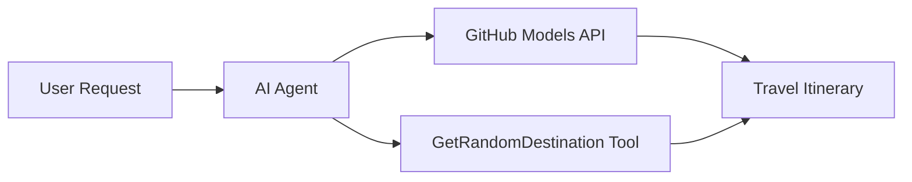

<!--
CO_OP_TRANSLATOR_METADATA:
{
  "original_hash": "5f351412e934f0833c8c821a0a60efaf",
  "translation_date": "2025-11-13T12:52:13+00:00",
  "source_file": "01-intro-to-ai-agents/code_samples/01-dotnet-agent-framework.md",
  "language_code": "no"
}
-->
# 🌍 AI Reiseagent med Microsoft Agent Framework (.NET)

## 📋 Scenariooversikt

Dette eksempelet viser hvordan man kan bygge en intelligent reiseplanleggingsagent ved hjelp av Microsoft Agent Framework for .NET. Agenten kan automatisk generere personlige dagsplaner for tilfeldige destinasjoner rundt om i verden.

### Nøkkelfunksjoner:

- 🎲 **Tilfeldig destinasjonsvalg**: Bruker et tilpasset verktøy for å velge feriesteder
- 🗺️ **Intelligent reiseplanlegging**: Lager detaljerte dagsplaner
- 🔄 **Sanntidsstrømming**: Støtter både umiddelbare og strømmende svar
- 🛠️ **Integrasjon av tilpassede verktøy**: Viser hvordan man kan utvide agentens funksjonalitet

## 🔧 Teknisk arkitektur

### Kjerne-teknologier

- **Microsoft Agent Framework**: Nyeste .NET-implementering for utvikling av AI-agenter
- **GitHub Models-integrasjon**: Bruker GitHubs AI-modellinferenstjeneste
- **OpenAI API-kompatibilitet**: Utnytter OpenAI-klientbiblioteker med tilpassede endepunkter
- **Sikker konfigurasjon**: Miljøbasert API-nøkkelhåndtering

### Hovedkomponenter

1. **AIAgent**: Hovedagenten som styrer samtaleflyten
2. **Tilpassede verktøy**: `GetRandomDestination()`-funksjon tilgjengelig for agenten
3. **Chatklient**: Samtalegrensesnitt støttet av GitHub Models
4. **Strømmestøtte**: Sanntidsgenerering av svar

### Integrasjonsmønster



## 🚀 Komme i gang

### Forutsetninger

- [.NET 10 SDK](https://dotnet.microsoft.com/download/dotnet/10.0) eller nyere
- [GitHub Models API-tilgangstoken](https://docs.github.com/github-models/github-models-at-scale/using-your-own-api-keys-in-github-models)

### Nødvendige miljøvariabler

```bash
# zsh/bash
export GH_TOKEN=<your_github_token>
export GH_ENDPOINT=https://models.github.ai/inference
export GH_MODEL_ID=openai/gpt-5-mini
```

```powershell
# PowerShell
$env:GH_TOKEN = "<your_github_token>"
$env:GH_ENDPOINT = "https://models.github.ai/inference"
$env:GH_MODEL_ID = "openai/gpt-5-mini"
```

### Eksempelkode

For å kjøre kodeeksempelet,

```bash
# zsh/bash
chmod +x ./01-dotnet-agent-framework.cs
./01-dotnet-agent-framework.cs
```

Eller ved å bruke dotnet CLI:

```bash
dotnet run ./01-dotnet-agent-framework.cs
```

Se [`01-dotnet-agent-framework.cs`](../../../../01-intro-to-ai-agents/code_samples/01-dotnet-agent-framework.cs) for fullstendig kode.

```csharp
#!/usr/bin/dotnet run

#:package Microsoft.Extensions.AI@9.*
#:package Microsoft.Agents.AI.OpenAI@1.*-*

using System.ClientModel;
using System.ComponentModel;

using Microsoft.Agents.AI;
using Microsoft.Extensions.AI;

using OpenAI;

// Tool Function: Random Destination Generator
// This static method will be available to the agent as a callable tool
// The [Description] attribute helps the AI understand when to use this function
// This demonstrates how to create custom tools for AI agents
[Description("Provides a random vacation destination.")]
static string GetRandomDestination()
{
    // List of popular vacation destinations around the world
    // The agent will randomly select from these options
    var destinations = new List<string>
    {
        "Paris, France",
        "Tokyo, Japan",
        "New York City, USA",
        "Sydney, Australia",
        "Rome, Italy",
        "Barcelona, Spain",
        "Cape Town, South Africa",
        "Rio de Janeiro, Brazil",
        "Bangkok, Thailand",
        "Vancouver, Canada"
    };

    // Generate random index and return selected destination
    // Uses System.Random for simple random selection
    var random = new Random();
    int index = random.Next(destinations.Count);
    return destinations[index];
}

// Extract configuration from environment variables
// Retrieve the GitHub Models API endpoint, defaults to https://models.github.ai/inference if not specified
// Retrieve the model ID, defaults to openai/gpt-5-mini if not specified
// Retrieve the GitHub token for authentication, throws exception if not specified
var github_endpoint = Environment.GetEnvironmentVariable("GH_ENDPOINT") ?? "https://models.github.ai/inference";
var github_model_id = Environment.GetEnvironmentVariable("GH_MODEL_ID") ?? "openai/gpt-5-mini";
var github_token = Environment.GetEnvironmentVariable("GH_TOKEN") ?? throw new InvalidOperationException("GH_TOKEN is not set.");

// Configure OpenAI Client Options
// Create configuration options to point to GitHub Models endpoint
// This redirects OpenAI client calls to GitHub's model inference service
var openAIOptions = new OpenAIClientOptions()
{
    Endpoint = new Uri(github_endpoint)
};

// Initialize OpenAI Client with GitHub Models Configuration
// Create OpenAI client using GitHub token for authentication
// Configure it to use GitHub Models endpoint instead of OpenAI directly
var openAIClient = new OpenAIClient(new ApiKeyCredential(github_token), openAIOptions);

// Create AI Agent with Travel Planning Capabilities
// Initialize OpenAI client, get chat client for specified model, and create AI agent
// Configure agent with travel planning instructions and random destination tool
// The agent can now plan trips using the GetRandomDestination function
AIAgent agent = openAIClient
    .GetChatClient(github_model_id)
    .CreateAIAgent(
        instructions: "You are a helpful AI Agent that can help plan vacations for customers at random destinations",
        tools: [AIFunctionFactory.Create(GetRandomDestination)]
    );

// Execute Agent: Plan a Day Trip
// Run the agent with streaming enabled for real-time response display
// Shows the agent's thinking and response as it generates the content
// Provides better user experience with immediate feedback
await foreach (var update in agent.RunStreamingAsync("Plan me a day trip"))
{
    await Task.Delay(10);
    Console.Write(update);
}
```

## 🎓 Viktige lærdommer

1. **Agentarkitektur**: Microsoft Agent Framework gir en ren, type-sikker tilnærming til å bygge AI-agenter i .NET
2. **Verktøyintegrasjon**: Funksjoner dekorert med `[Description]`-attributter blir tilgjengelige verktøy for agenten
3. **Konfigurasjonshåndtering**: Miljøvariabler og sikker håndtering av legitimasjon følger beste praksis for .NET
4. **OpenAI-kompatibilitet**: GitHub Models-integrasjon fungerer sømløst gjennom OpenAI-kompatible API-er

## 🔗 Tilleggsressurser

- [Microsoft Agent Framework-dokumentasjon](https://learn.microsoft.com/agent-framework)
- [GitHub Models Marketplace](https://github.com/marketplace?type=models)
- [Microsoft.Extensions.AI](https://learn.microsoft.com/dotnet/ai/microsoft-extensions-ai)
- [.NET Single File Apps](https://devblogs.microsoft.com/dotnet/announcing-dotnet-run-app)

---

<!-- CO-OP TRANSLATOR DISCLAIMER START -->
**Ansvarsfraskrivelse**:  
Dette dokumentet er oversatt ved hjelp av AI-oversettelsestjenesten [Co-op Translator](https://github.com/Azure/co-op-translator). Selv om vi streber etter nøyaktighet, vær oppmerksom på at automatiserte oversettelser kan inneholde feil eller unøyaktigheter. Det originale dokumentet på sitt opprinnelige språk bør anses som den autoritative kilden. For kritisk informasjon anbefales profesjonell menneskelig oversettelse. Vi er ikke ansvarlige for misforståelser eller feiltolkninger som oppstår ved bruk av denne oversettelsen.
<!-- CO-OP TRANSLATOR DISCLAIMER END -->