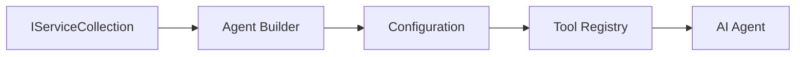

<!--
CO_OP_TRANSLATOR_METADATA:
{
  "original_hash": "bcc874e190347bd6a095aed56dc16de8",
  "translation_date": "2025-11-13T12:56:00+00:00",
  "source_file": "03-agentic-design-patterns/code_samples/03-dotnet-agent-framework.md",
  "language_code": "no"
}
-->
# 🎨 Agentiske designmønstre med GitHub-modeller (.NET)

## 📋 Læringsmål

Dette eksempelet viser designmønstre på bedriftsnivå for å bygge intelligente agenter ved hjelp av Microsoft Agent Framework i .NET med integrasjon av GitHub-modeller. Du vil lære profesjonelle mønstre og arkitektoniske tilnærminger som gjør agenter klare for produksjon, vedlikeholdbare og skalerbare.

### Designmønstre for bedrifter

- 🏭 **Fabrikkmønster**: Standardisert agentopprettelse med avhengighetsinjeksjon
- 🔧 **Byggemønster**: Flytende agentkonfigurasjon og oppsett
- 🧵 **Trådsikre mønstre**: Håndtering av samtidige samtaler
- 📋 **Repositormønster**: Organisert verktøy- og kapabilitetshåndtering

## 🎯 Arkitektoniske fordeler med .NET

### Funksjoner for bedrifter

- **Sterk typisering**: Validering under kompilering og IntelliSense-støtte
- **Avhengighetsinjeksjon**: Innebygd DI-containerintegrasjon
- **Konfigurasjonsstyring**: IConfiguration og Options-mønstre
- **Async/Await**: Førsteklasses støtte for asynkron programmering

### Produksjonsklare mønstre

- **Loggintegrasjon**: ILogger og støtte for strukturert logging
- **Helsesjekker**: Innebygd overvåking og diagnostikk
- **Konfigurasjonsvalidering**: Sterk typisering med dataannotasjoner
- **Feilhåndtering**: Strukturert unntakshåndtering

## 🔧 Teknisk arkitektur

### Kjernekomponenter i .NET

- **Microsoft.Extensions.AI**: Enhetlige AI-tjenesteabstraksjoner
- **Microsoft.Agents.AI**: Rammeverk for agentorkestrering på bedriftsnivå
- **GitHub-modellintegrasjon**: API-klientmønstre med høy ytelse
- **Konfigurasjonssystem**: appsettings.json og miljøintegrasjon

### Implementering av designmønstre



## 🏗️ Demonstrerte mønstre for bedrifter

### 1. **Opprettelsesmønstre**

- **Agentfabrikk**: Sentralisert agentopprettelse med konsistent konfigurasjon
- **Byggemønster**: Flytende API for kompleks agentkonfigurasjon
- **Singleton-mønster**: Delt ressurs- og konfigurasjonsstyring
- **Avhengighetsinjeksjon**: Løs kobling og testbarhet

### 2. **Atferdsmønstre**

- **Strategimønster**: Utskiftbare strategier for verktøykjøring
- **Kommandomønster**: Innkapslede agentoperasjoner med angre/gjenta
- **Observatørmønster**: Hendelsesdrevet agentlivssyklusadministrasjon
- **Templatmetode**: Standardiserte arbeidsflyter for agentutførelse

### 3. **Strukturelle mønstre**

- **Adaptermønster**: Integrasjonslag for GitHub-modeller API
- **Dekoratørmønster**: Forbedring av agentkapabiliteter
- **Fasademønster**: Forenklede grensesnitt for agentinteraksjon
- **Proksymønster**: Lazy loading og caching for ytelse

## 📚 Designprinsipper i .NET

### SOLID-prinsipper

- **Enkelt ansvar**: Hver komponent har ett klart formål
- **Åpen/lukket**: Utvidbar uten modifikasjon
- **Liskovs substitusjonsprinsipp**: Verktøyimplementasjoner basert på grensesnitt
- **Grensesnittsegregering**: Fokuserte, sammenhengende grensesnitt
- **Avhengighetsinversjon**: Avheng av abstraksjoner, ikke konkrete implementasjoner

### Ren arkitektur

- **Domenelag**: Kjerneabstraksjoner for agenter og verktøy
- **Applikasjonslag**: Agentorkestrering og arbeidsflyter
- **Infrastrukturlag**: GitHub-modellintegrasjon og eksterne tjenester
- **Presentasjonslag**: Brukerinteraksjon og responsformatering

## 🔒 Betraktninger for bedrifter

### Sikkerhet

- **Håndtering av legitimasjon**: Sikker håndtering av API-nøkler med IConfiguration
- **Inputvalidering**: Sterk typisering og validering med dataannotasjoner
- **Outputsanitering**: Sikker behandling og filtrering av responser
- **Revisjonslogging**: Omfattende sporing av operasjoner

### Ytelse

- **Asynkrone mønstre**: Ikke-blokkerende I/O-operasjoner
- **Tilkoblingspooling**: Effektiv håndtering av HTTP-klienter
- **Caching**: Responscaching for forbedret ytelse
- **Ressursstyring**: Riktig disponering og oppryddingsmønstre

### Skalerbarhet

- **Trådsikkerhet**: Støtte for samtidige agentutførelser
- **Ressurspooling**: Effektiv ressursutnyttelse
- **Laststyring**: Ratebegrensning og håndtering av tilbakeslag
- **Overvåking**: Ytelsesmetrikker og helsesjekker

## 🚀 Produksjonsutrulling

- **Konfigurasjonsstyring**: Miljøspesifikke innstillinger
- **Loggstrategi**: Strukturert logging med korrelasjons-ID-er
- **Feilhåndtering**: Global unntakshåndtering med riktig gjenoppretting
- **Overvåking**: Application Insights og ytelsestellere
- **Testing**: Enhetstester, integrasjonstester og lasttestmønstre

Klar til å bygge intelligente agenter på bedriftsnivå med .NET? La oss arkitektere noe robust! 🏢✨

## 🚀 Kom i gang

### Forutsetninger

- [.NET 10 SDK](https://dotnet.microsoft.com/download/dotnet/10.0) eller nyere
- [GitHub Models API-tilgangstoken](https://docs.github.com/github-models/github-models-at-scale/using-your-own-api-keys-in-github-models)

### Påkrevde miljøvariabler

```bash
# zsh/bash
export GH_TOKEN=<your_github_token>
export GH_ENDPOINT=https://models.github.ai/inference
export GH_MODEL_ID=openai/gpt-5-mini
```

```powershell
# PowerShell
$env:GH_TOKEN = "<your_github_token>"
$env:GH_ENDPOINT = "https://models.github.ai/inference"
$env:GH_MODEL_ID = "openai/gpt-5-mini"
```

### Eksempelkode

For å kjøre kodeeksempelet,

```bash
# zsh/bash
chmod +x ./03-dotnet-agent-framework.cs
./03-dotnet-agent-framework.cs
```

Eller ved å bruke dotnet CLI:

```bash
dotnet run ./03-dotnet-agent-framework.cs
```

Se [`03-dotnet-agent-framework.cs`](../../../../03-agentic-design-patterns/code_samples/03-dotnet-agent-framework.cs) for fullstendig kode.

```csharp
#!/usr/bin/dotnet run

#:package Microsoft.Extensions.AI@10.*
#:package Microsoft.Agents.AI.OpenAI@1.*-*

using System.ClientModel;
using System.ComponentModel;

using Microsoft.Agents.AI;
using Microsoft.Extensions.AI;

using OpenAI;

// Tool Function: Random Destination Generator
// This static method will be available to the agent as a callable tool
// The [Description] attribute helps the AI understand when to use this function
// This demonstrates how to create custom tools for AI agents
[Description("Provides a random vacation destination.")]
static string GetRandomDestination()
{
    // List of popular vacation destinations around the world
    // The agent will randomly select from these options
    var destinations = new List<string>
    {
        "Paris, France",
        "Tokyo, Japan",
        "New York City, USA",
        "Sydney, Australia",
        "Rome, Italy",
        "Barcelona, Spain",
        "Cape Town, South Africa",
        "Rio de Janeiro, Brazil",
        "Bangkok, Thailand",
        "Vancouver, Canada"
    };

    // Generate random index and return selected destination
    // Uses System.Random for simple random selection
    var random = new Random();
    int index = random.Next(destinations.Count);
    return destinations[index];
}

// Extract configuration from environment variables
// Retrieve the GitHub Models API endpoint, defaults to https://models.github.ai/inference if not specified
// Retrieve the model ID, defaults to openai/gpt-5-mini if not specified
// Retrieve the GitHub token for authentication, throws exception if not specified
var github_endpoint = Environment.GetEnvironmentVariable("GH_ENDPOINT") ?? "https://models.github.ai/inference";
var github_model_id = Environment.GetEnvironmentVariable("GH_MODEL_ID") ?? "openai/gpt-5-mini";
var github_token = Environment.GetEnvironmentVariable("GH_TOKEN") ?? throw new InvalidOperationException("GH_TOKEN is not set.");

// Configure OpenAI Client Options
// Create configuration options to point to GitHub Models endpoint
// This redirects OpenAI client calls to GitHub's model inference service
var openAIOptions = new OpenAIClientOptions()
{
    Endpoint = new Uri(github_endpoint)
};

// Initialize OpenAI Client with GitHub Models Configuration
// Create OpenAI client using GitHub token for authentication
// Configure it to use GitHub Models endpoint instead of OpenAI directly
var openAIClient = new OpenAIClient(new ApiKeyCredential(github_token), openAIOptions);

// Define Agent Identity and Comprehensive Instructions
// Agent name for identification and logging purposes
var AGENT_NAME = "TravelAgent";

// Detailed instructions that define the agent's personality, capabilities, and behavior
// This system prompt shapes how the agent responds and interacts with users
var AGENT_INSTRUCTIONS = """
You are a helpful AI Agent that can help plan vacations for customers.

Important: When users specify a destination, always plan for that location. Only suggest random destinations when the user hasn't specified a preference.

When the conversation begins, introduce yourself with this message:
"Hello! I'm your TravelAgent assistant. I can help plan vacations and suggest interesting destinations for you. Here are some things you can ask me:
1. Plan a day trip to a specific location
2. Suggest a random vacation destination
3. Find destinations with specific features (beaches, mountains, historical sites, etc.)
4. Plan an alternative trip if you don't like my first suggestion

What kind of trip would you like me to help you plan today?"

Always prioritize user preferences. If they mention a specific destination like "Bali" or "Paris," focus your planning on that location rather than suggesting alternatives.
""";

// Create AI Agent with Advanced Travel Planning Capabilities
// Initialize complete agent pipeline: OpenAI client → Chat client → AI agent
// Configure agent with name, detailed instructions, and available tools
// This demonstrates the .NET agent creation pattern with full configuration
AIAgent agent = openAIClient
    .GetChatClient(github_model_id)
    .CreateAIAgent(
        name: AGENT_NAME,
        instructions: AGENT_INSTRUCTIONS,
        tools: [AIFunctionFactory.Create(GetRandomDestination)]
    );

// Create New Conversation Thread for Context Management
// Initialize a new conversation thread to maintain context across multiple interactions
// Threads enable the agent to remember previous exchanges and maintain conversational state
// This is essential for multi-turn conversations and contextual understanding
AgentThread thread = agent.GetNewThread();

// Execute Agent: First Travel Planning Request
// Run the agent with an initial request that will likely trigger the random destination tool
// The agent will analyze the request, use the GetRandomDestination tool, and create an itinerary
// Using the thread parameter maintains conversation context for subsequent interactions
await foreach (var update in agent.RunStreamingAsync("Plan me a day trip", thread))
{
    await Task.Delay(10);
    Console.Write(update);
}

Console.WriteLine();

// Execute Agent: Follow-up Request with Context Awareness
// Demonstrate contextual conversation by referencing the previous response
// The agent remembers the previous destination suggestion and will provide an alternative
// This showcases the power of conversation threads and contextual understanding in .NET agents
await foreach (var update in agent.RunStreamingAsync("I don't like that destination. Plan me another vacation.", thread))
{
    await Task.Delay(10);
    Console.Write(update);
}
```

---

<!-- CO-OP TRANSLATOR DISCLAIMER START -->
**Ansvarsfraskrivelse**:  
Dette dokumentet er oversatt ved hjelp av AI-oversettelsestjenesten [Co-op Translator](https://github.com/Azure/co-op-translator). Selv om vi tilstreber nøyaktighet, vennligst vær oppmerksom på at automatiserte oversettelser kan inneholde feil eller unøyaktigheter. Det originale dokumentet på sitt opprinnelige språk bør betraktes som den autoritative kilden. For kritisk informasjon anbefales profesjonell menneskelig oversettelse. Vi er ikke ansvarlige for eventuelle misforståelser eller feiltolkninger som oppstår ved bruk av denne oversettelsen.
<!-- CO-OP TRANSLATOR DISCLAIMER END -->