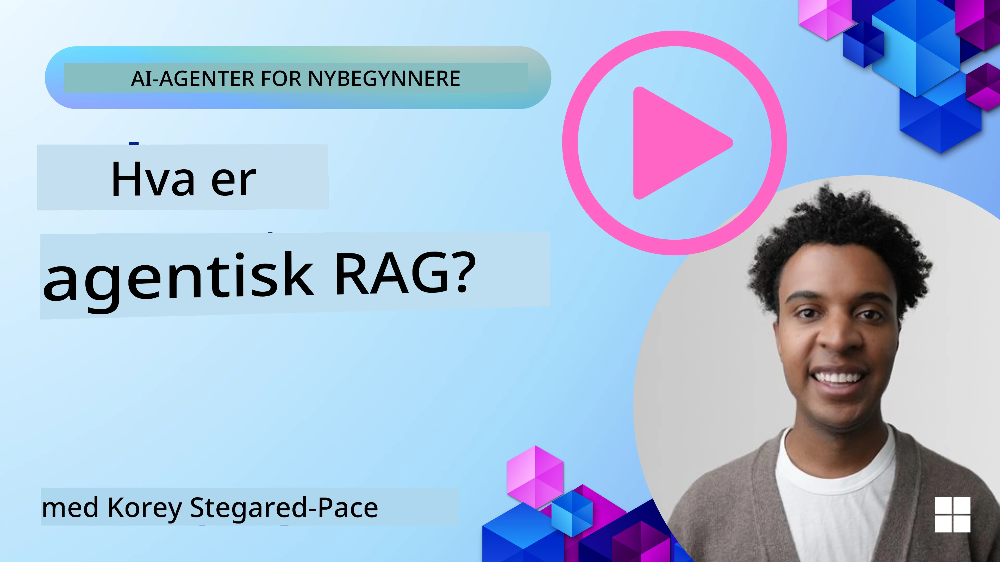
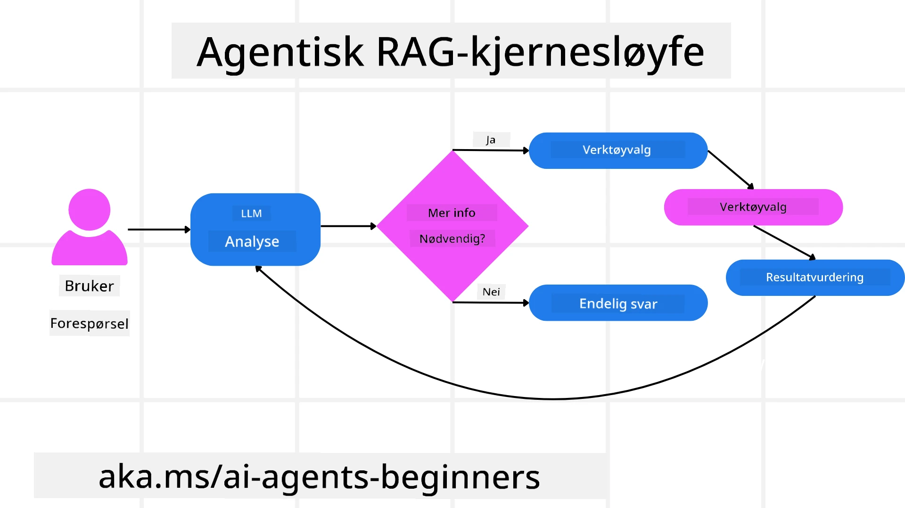
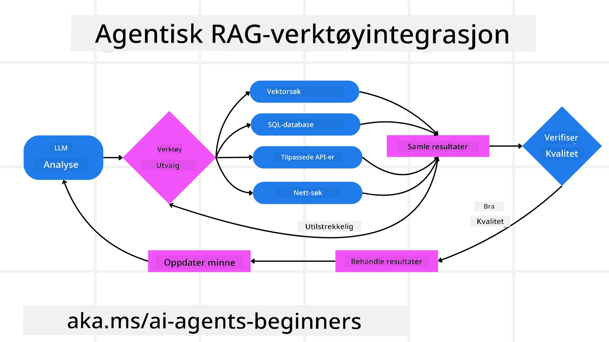
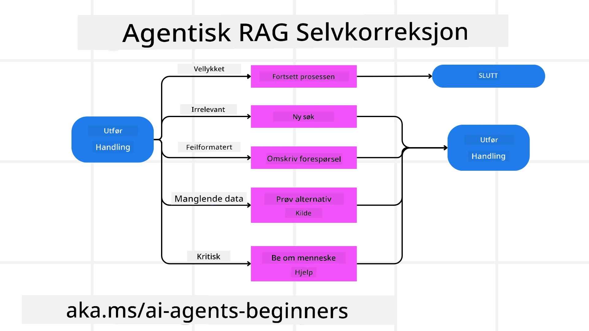
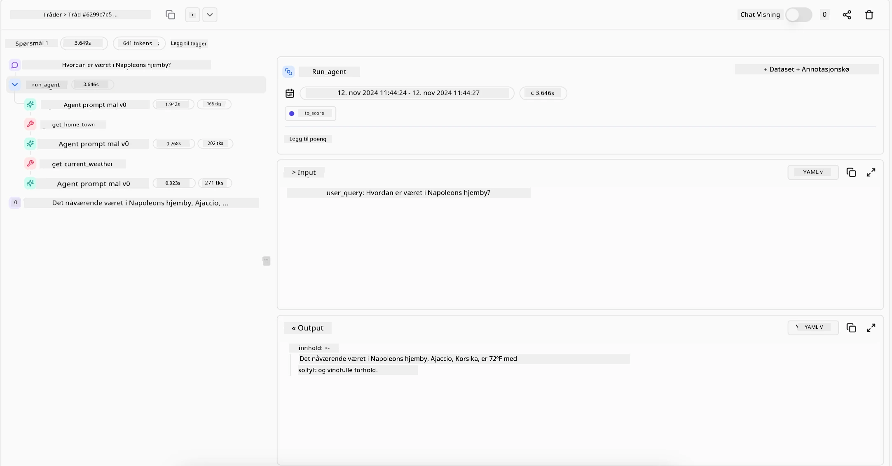

<!--
CO_OP_TRANSLATOR_METADATA:
{
  "original_hash": "0ebf6b2290db55dbf2d10cc49655523b",
  "translation_date": "2025-09-30T07:16:50+00:00",
  "source_file": "05-agentic-rag/README.md",
  "language_code": "no"
}
-->

> _(Klikk på bildet over for å se videoen til denne leksjonen)_

# Agentic RAG

Denne leksjonen gir en omfattende oversikt over Agentic Retrieval-Augmented Generation (Agentic RAG), et fremvoksende AI-paradigme der store språkmodeller (LLMs) autonomt planlegger sine neste steg mens de henter informasjon fra eksterne kilder. I motsetning til statiske mønstre for henting og lesing, innebærer Agentic RAG iterative kall til LLM, avbrutt av verktøy- eller funksjonskall og strukturerte utdata. Systemet evaluerer resultater, forbedrer forespørsler, bruker flere verktøy ved behov og fortsetter denne syklusen til en tilfredsstillende løsning er oppnådd.

## Introduksjon

Denne leksjonen vil dekke:

- **Forstå Agentic RAG:** Lær om det fremvoksende paradigmet innen AI der store språkmodeller (LLMs) autonomt planlegger sine neste steg mens de henter informasjon fra eksterne datakilder.
- **Forstå Iterativ Maker-Checker-stil:** Forstå loopen med iterative kall til LLM, avbrutt av verktøy- eller funksjonskall og strukturerte utdata, designet for å forbedre korrekthet og håndtere feilformede forespørsler.
- **Utforsk praktiske anvendelser:** Identifiser scenarier der Agentic RAG utmerker seg, som miljøer med fokus på korrekthet, komplekse databaseinteraksjoner og utvidede arbeidsflyter.

## Læringsmål

Etter å ha fullført denne leksjonen, vil du vite hvordan du/forstå:

- **Forstå Agentic RAG:** Lær om det fremvoksende paradigmet innen AI der store språkmodeller (LLMs) autonomt planlegger sine neste steg mens de henter informasjon fra eksterne datakilder.
- **Iterativ Maker-Checker-stil:** Forstå konseptet med en loop av iterative kall til LLM, avbrutt av verktøy- eller funksjonskall og strukturerte utdata, designet for å forbedre korrekthet og håndtere feilformede forespørsler.
- **Eie resonnementet:** Forstå systemets evne til å eie sin resonnementprosess, ta beslutninger om hvordan man skal nærme seg problemer uten å være avhengig av forhåndsdefinerte veier.
- **Arbeidsflyt:** Forstå hvordan en agentisk modell selvstendig bestemmer seg for å hente markedsrapporttrender, identifisere konkurrentdata, korrelere interne salgsmetrikker, syntetisere funn og evaluere strategien.
- **Iterative looper, verktøyintegrasjon og minne:** Lær om systemets avhengighet av et loopet interaksjonsmønster, opprettholde tilstand og minne på tvers av steg for å unngå repetitive looper og ta informerte beslutninger.
- **Håndtering av feilmoduser og selvkorrigering:** Utforsk systemets robuste selvkorrigeringsmekanismer, inkludert iterering og nyforespørsel, bruk av diagnostiske verktøy og fallback til menneskelig tilsyn.
- **Begrensninger av autonomi:** Forstå begrensningene til Agentic RAG, med fokus på domenespesifikk autonomi, avhengighet av infrastruktur og respekt for sikkerhetsrammer.
- **Praktiske bruksområder og verdi:** Identifiser scenarier der Agentic RAG utmerker seg, som miljøer med fokus på korrekthet, komplekse databaseinteraksjoner og utvidede arbeidsflyter.
- **Styring, transparens og tillit:** Lær om viktigheten av styring og transparens, inkludert forklarbart resonnement, kontroll av skjevhet og menneskelig tilsyn.

## Hva er Agentic RAG?

Agentic Retrieval-Augmented Generation (Agentic RAG) er et fremvoksende AI-paradigme der store språkmodeller (LLMs) autonomt planlegger sine neste steg mens de henter informasjon fra eksterne kilder. I motsetning til statiske mønstre for henting og lesing, innebærer Agentic RAG iterative kall til LLM, avbrutt av verktøy- eller funksjonskall og strukturerte utdata. Systemet evaluerer resultater, forbedrer forespørsler, bruker flere verktøy ved behov og fortsetter denne syklusen til en tilfredsstillende løsning er oppnådd. Denne iterative "maker-checker"-stilen forbedrer korrekthet, håndterer feilformede forespørsler og sikrer resultater av høy kvalitet.

Systemet eier aktivt sin resonnementprosess, omskriver mislykkede forespørsler, velger forskjellige metoder for henting og integrerer flere verktøy—som vektorsøk i Azure AI Search, SQL-databaser eller tilpassede API-er—før det gir sitt endelige svar. Den distinkte kvaliteten til et agentisk system er dets evne til å eie sin resonnementprosess. Tradisjonelle RAG-implementeringer er avhengige av forhåndsdefinerte veier, men et agentisk system bestemmer autonomt rekkefølgen av steg basert på kvaliteten på informasjonen det finner.

## Definere Agentic Retrieval-Augmented Generation (Agentic RAG)

Agentic Retrieval-Augmented Generation (Agentic RAG) er et fremvoksende paradigme innen AI-utvikling der LLMs ikke bare henter informasjon fra eksterne datakilder, men også autonomt planlegger sine neste steg. I motsetning til statiske mønstre for henting og lesing eller nøye skriptede promptsekvenser, innebærer Agentic RAG en loop av iterative kall til LLM, avbrutt av verktøy- eller funksjonskall og strukturerte utdata. Ved hvert steg evaluerer systemet resultatene det har oppnådd, bestemmer om det skal forbedre forespørslene, bruker flere verktøy ved behov og fortsetter denne syklusen til det oppnår en tilfredsstillende løsning.

Denne iterative "maker-checker"-stilen er designet for å forbedre korrekthet, håndtere feilformede forespørsler til strukturerte databaser (f.eks. NL2SQL) og sikre balanserte, høykvalitetsresultater. I stedet for å være avhengig av nøye konstruerte promptkjeder, eier systemet aktivt sin resonnementprosess. Det kan omskrive forespørsler som mislykkes, velge forskjellige metoder for henting og integrere flere verktøy—som vektorsøk i Azure AI Search, SQL-databaser eller tilpassede API-er—før det gir sitt endelige svar. Dette eliminerer behovet for altfor komplekse orkestreringsrammeverk. I stedet kan en relativt enkel loop av "LLM-kall → verktøybruk → LLM-kall → …" gi sofistikerte og godt begrunnede utdata.

## Eie resonnementet

Den distinkte kvaliteten som gjør et system "agentisk" er dets evne til å eie sin resonnementprosess. Tradisjonelle RAG-implementeringer er ofte avhengige av at mennesker forhåndsdefinerer en vei for modellen: en tankerekke som skisserer hva som skal hentes og når.  
Men når et system er virkelig agentisk, bestemmer det internt hvordan det skal nærme seg problemet. Det utfører ikke bare et skript; det bestemmer autonomt rekkefølgen av steg basert på kvaliteten på informasjonen det finner.  
For eksempel, hvis det blir bedt om å lage en produktlanseringsstrategi, er det ikke avhengig av en prompt som beskriver hele forsknings- og beslutningsprosessen. I stedet bestemmer den agentiske modellen seg selvstendig for å:

1. Hente rapporter om nåværende markedstrender ved hjelp av Bing Web Grounding.
2. Identifisere relevant konkurrentdata ved hjelp av Azure AI Search.
3. Korrelere historiske interne salgsmetrikker ved hjelp av Azure SQL Database.
4. Syntetisere funnene til en sammenhengende strategi orkestrert via Azure OpenAI Service.
5. Evaluere strategien for mangler eller inkonsistenser, og igangsette en ny runde med henting om nødvendig.  

Alle disse stegene—forbedring av forespørsler, valg av kilder, iterering til modellen er "fornøyd" med svaret—bestemmes av modellen, ikke forhåndsskriptet av et menneske.

## Iterative looper, verktøyintegrasjon og minne

Et agentisk system er avhengig av et loopet interaksjonsmønster:

- **Første kall:** Brukerens mål (aka. brukerprompt) presenteres for LLM.
- **Verktøybruk:** Hvis modellen identifiserer manglende informasjon eller tvetydige instruksjoner, velger den et verktøy eller en metode for henting—som en vektordatabaseforespørsel (f.eks. Azure AI Search Hybrid-søk over privat data) eller et strukturert SQL-kall—for å samle mer kontekst.
- **Vurdering og forbedring:** Etter å ha gjennomgått de returnerte dataene, bestemmer modellen om informasjonen er tilstrekkelig. Hvis ikke, forbedrer den forespørselen, prøver et annet verktøy eller justerer tilnærmingen.
- **Gjenta til fornøyd:** Denne syklusen fortsetter til modellen bestemmer at den har nok klarhet og bevis til å levere et endelig, godt begrunnet svar.
- **Minne og tilstand:** Fordi systemet opprettholder tilstand og minne på tvers av steg, kan det huske tidligere forsøk og deres resultater, unngå repetitive looper og ta mer informerte beslutninger etter hvert som det går fremover.

Over tid skaper dette en følelse av utviklende forståelse, som gjør det mulig for modellen å navigere komplekse, flertrinnsoppgaver uten at et menneske konstant må gripe inn eller omforme prompten.

## Håndtering av feilmoduser og selvkorrigering

Agentic RAGs autonomi innebærer også robuste selvkorrigeringsmekanismer. Når systemet møter blindveier—som å hente irrelevante dokumenter eller støte på feilformede forespørsler—kan det:

- **Iterere og nyforespørre:** I stedet for å returnere lavverdige svar, prøver modellen nye søkestrategier, omskriver databaseforespørsler eller ser på alternative datasett.
- **Bruke diagnostiske verktøy:** Systemet kan bruke ekstra funksjoner designet for å hjelpe det med å feilsøke resonnementstrinnene eller bekrefte korrektheten av hentede data. Verktøy som Azure AI Tracing vil være viktige for å muliggjøre robust observasjon og overvåking.
- **Fallback til menneskelig tilsyn:** For høyrisiko- eller gjentatte feilscenarier kan modellen flagge usikkerhet og be om menneskelig veiledning. Når mennesket gir korrigerende tilbakemelding, kan modellen inkorporere den lærdommen fremover.

Denne iterative og dynamiske tilnærmingen gjør det mulig for modellen å forbedre seg kontinuerlig, og sikrer at den ikke bare er et engangssystem, men et som lærer av sine feil under en gitt sesjon.

## Begrensninger av autonomi

Til tross for sin autonomi innenfor en oppgave, er Agentic RAG ikke analogt med kunstig generell intelligens. Dens "agentiske" evner er begrenset til verktøyene, datakildene og retningslinjene som er gitt av menneskelige utviklere. Den kan ikke finne opp sine egne verktøy eller gå utenfor de domenebegrensningene som er satt. I stedet utmerker den seg ved dynamisk å orkestrere ressursene som er tilgjengelige.  
Viktige forskjeller fra mer avanserte AI-former inkluderer:

1. **Domenespesifikk autonomi:** Agentic RAG-systemer fokuserer på å oppnå brukerdefinerte mål innenfor et kjent domene, og bruker strategier som omskriving av forespørsler eller verktøyvalg for å forbedre resultater.
2. **Avhengig av infrastruktur:** Systemets evner er avhengige av verktøyene og dataene som er integrert av utviklere. Det kan ikke overskride disse grensene uten menneskelig inngripen.
3. **Respekt for sikkerhetsrammer:** Etiske retningslinjer, samsvarsregler og forretningspolitikker forblir svært viktige. Agentens frihet er alltid begrenset av sikkerhetstiltak og tilsynsmekanismer (forhåpentligvis?).

## Praktiske bruksområder og verdi

Agentic RAG utmerker seg i scenarier som krever iterativ forbedring og presisjon:

1. **Miljøer med fokus på korrekthet:** I samsvarskontroller, regulatorisk analyse eller juridisk forskning kan den agentiske modellen gjentatte ganger verifisere fakta, konsultere flere kilder og omskrive forespørsler til den produserer et grundig gjennomgått svar.
2. **Komplekse databaseinteraksjoner:** Når man arbeider med strukturerte data der forespørsler ofte kan mislykkes eller trenge justering, kan systemet autonomt forbedre sine forespørsler ved hjelp av Azure SQL eller Microsoft Fabric OneLake, og sikre at den endelige hentingen samsvarer med brukerens intensjon.
3. **Utvidede arbeidsflyter:** Lengre sesjoner kan utvikle seg etter hvert som ny informasjon dukker opp. Agentic RAG kan kontinuerlig inkorporere ny data, endre strategier etter hvert som den lærer mer om problemområdet.

## Styring, transparens og tillit

Etter hvert som disse systemene blir mer autonome i sitt resonnement, er styring og transparens avgjørende:

- **Forklarbart resonnement:** Modellen kan gi en revisjonsspor av forespørslene den gjorde, kildene den konsulterte og resonnementstrinnene den tok for å komme frem til sin konklusjon. Verktøy som Azure AI Content Safety og Azure AI Tracing / GenAIOps kan bidra til å opprettholde transparens og redusere risiko.
- **Kontroll av skjevhet og balansert henting:** Utviklere kan justere hentingsstrategier for å sikre at balanserte, representative datakilder vurderes, og regelmessig gjennomgå utdata for å oppdage skjevhet eller skjeve mønstre ved hjelp av tilpassede modeller for avanserte data science-organisasjoner som bruker Azure Machine Learning.
- **Menneskelig tilsyn og samsvar:** For sensitive oppgaver forblir menneskelig gjennomgang essensielt. Agentic RAG erstatter ikke menneskelig dømmekraft i høyrisikoavgjørelser—den forsterker den ved å levere mer grundig gjennomgåtte alternativer.

Å ha verktøy som gir en klar oversikt over handlinger er avgjørende. Uten dem kan det være svært vanskelig å feilsøke en flertrinnsprosess. Se følgende eksempel fra Literal AI (selskapet bak Chainlit) for en Agent-run:

## Konklusjon

Agentic RAG representerer en naturlig utvikling i hvordan AI-systemer håndterer komplekse, dataintensive oppgaver. Ved å adoptere et loopet interaksjonsmønster, autonomt velge verktøy og forbedre forespørsler til det oppnår et høykvalitetsresultat, beveger systemet seg utover statisk prompt-følgning til en mer adaptiv, kontekstbevisst beslutningstaker. Selv om det fortsatt er begrenset av menneskedefinerte infrastrukturer og etiske retningslinjer, muliggjør disse agentiske evnene rikere, mer dynamiske og til slutt mer nyttige AI-interaksjoner for både bedrifter og sluttbrukere.

### Har du flere spørsmål om Agentic RAG?

Bli med i [Azure AI Foundry Discord](https://aka.ms/ai-agents/discord) for å møte andre lærende, delta på kontortimer og få svar på dine spørsmål om AI-agenter.

## Tilleggsressurser

- <a href="https://learn.microsoft.com/training/modules/use-own-data-azure-openai" target="_blank">Implementer Retrieval Augmented Generation (RAG) med Azure OpenAI Service: Lær hvordan du bruker dine egne data med Azure OpenAI Service. Denne Microsoft Learn-modulen gir en omfattende guide til implementering av RAG</a>
- <a href="https://learn.microsoft.com/azure/ai-studio/concepts/evaluation-approach-gen-ai" target="_blank">Evaluering av generative AI-applikasjoner med Azure AI Foundry: Denne artikkelen dekker evaluering og sammenligning av modeller på offentlig tilgjengelige datasett, inkludert Agentic AI-applikasjoner og RAG-arkitekturer</a>
- <a href="https://weaviate.io/blog/what-is-agentic-rag" target="_blank">Hva er Agentic RAG | Weaviate</a>
- <a href="https://ragaboutit.com/agentic-rag-a-complete-guide-to-agent-based-retrieval-augmented-generation/" target="_blank">Agentisk RAG: En komplett guide til agentbasert Retrieval Augmented Generation – Nyheter fra generasjon RAG</a>
- <a href="https://huggingface.co/learn/cookbook/agent_rag" target="_blank">Agentisk RAG: gi fart til RAG med spørringsreformulering og selvspørring! Hugging Face Open-Source AI Cookbook</a>
- <a href="https://youtu.be/aQ4yQXeB1Ss?si=2HUqBzHoeB5tR04U" target="_blank">Legge til agentiske lag i RAG</a>
- <a href="https://www.youtube.com/watch?v=zeAyuLc_f3Q&t=244s" target="_blank">Fremtiden for kunnskapsassistenter: Jerry Liu</a>
- <a href="https://www.youtube.com/watch?v=AOSjiXP1jmQ" target="_blank">Hvordan bygge agentiske RAG-systemer</a>
- <a href="https://ignite.microsoft.com/sessions/BRK102?source=sessions" target="_blank">Bruke Azure AI Foundry Agent Service for å skalere AI-agenter</a>

### Akademiske artikler

- <a href="https://arxiv.org/abs/2303.17651" target="_blank">2303.17651 Self-Refine: Iterativ forbedring med selvtilbakemelding</a>
- <a href="https://arxiv.org/abs/2303.11366" target="_blank">2303.11366 Reflexion: Språkagenter med verbal forsterkningslæring</a>
- <a href="https://arxiv.org/abs/2305.11738" target="_blank">2305.11738 CRITIC: Store språkmodeller kan korrigere seg selv med verktøy-interaktiv kritikk</a>
- <a href="https://arxiv.org/abs/2501.09136" target="_blank">2501.09136 Agentisk Retrieval-Augmented Generation: En undersøkelse om agentisk RAG</a>

## Forrige leksjon

[Designmønster for verktøybruk](../04-tool-use/README.md)

## Neste leksjon

[Bygge pålitelige AI-agenter](../06-building-trustworthy-agents/README.md)

---

**Ansvarsfraskrivelse**:  
Dette dokumentet er oversatt ved hjelp av AI-oversettelsestjenesten [Co-op Translator](https://github.com/Azure/co-op-translator). Selv om vi tilstreber nøyaktighet, vær oppmerksom på at automatiserte oversettelser kan inneholde feil eller unøyaktigheter. Det originale dokumentet på sitt opprinnelige språk bør anses som den autoritative kilden. For kritisk informasjon anbefales profesjonell menneskelig oversettelse. Vi er ikke ansvarlige for eventuelle misforståelser eller feiltolkninger som oppstår ved bruk av denne oversettelsen.