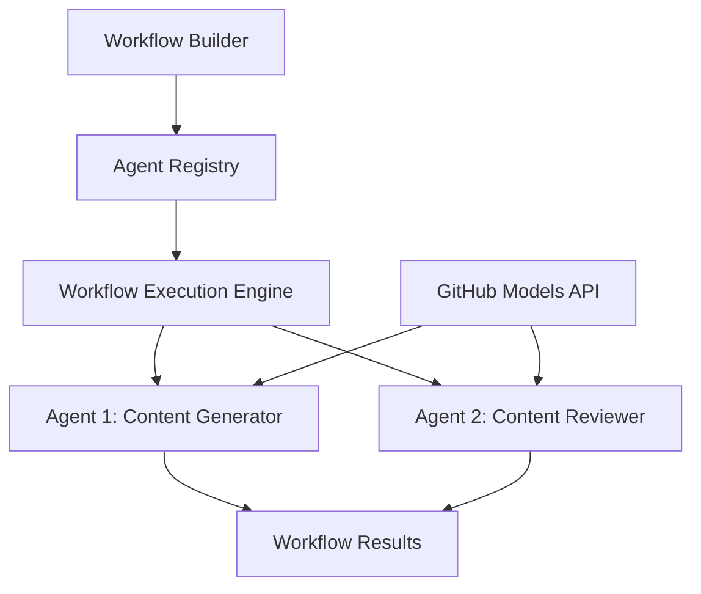

<!--
CO_OP_TRANSLATOR_METADATA:
{
  "original_hash": "034158688d0a45aae06dcbb21b0da5ae",
  "translation_date": "2025-11-11T12:51:51+00:00",
  "source_file": "08-multi-agent/code_samples/workflows-agent-framework/dotNET/01.dotnet-agent-framework-workflow-ghmodel-basic.md",
  "language_code": "no"
}
-->
# 🔄 Grunnleggende Agentarbeidsflyter med GitHub-modeller (.NET)

## 📋 Veiledning for arbeidsflytorkestrering

Denne notatboken viser hvordan du kan bygge sofistikerte **agentarbeidsflyter** ved hjelp av Microsoft Agent Framework for .NET og GitHub-modeller. Du vil lære å lage flertrinns forretningsprosesser der AI-agenter samarbeider for å utføre komplekse oppgaver gjennom strukturerte orkestreringsmønstre.

## 🎯 Læringsmål

### 🏗️ **Grunnleggende om arbeidsflytarkitektur**
- **Workflow Builder**: Design og orkestrer komplekse flertrinns AI-prosesser
- **Agentkoordinering**: Koordiner flere spesialiserte agenter innen arbeidsflyter
- **GitHub-modeller integrasjon**: Utnytt GitHubs AI-modelltjeneste i arbeidsflyter
- **Visuell arbeidsflytdesign**: Lag og visualiser arbeidsflytstrukturer for bedre forståelse

### 🔄 **Prosessorkestreringsmønstre**
- **Sekvensiell behandling**: Kjed sammen flere agentoppgaver i logisk rekkefølge
- **Tilstandshåndtering**: Oppretthold kontekst og dataflyt gjennom arbeidsflytstadier
- **Feilhåndtering**: Implementer robust feilgjenoppretting og arbeidsflytresiliens
- **Ytelsesoptimalisering**: Design effektive arbeidsflyter for operasjoner i stor skala

### 🏢 **Arbeidsflytapplikasjoner for bedrifter**
- **Automatisering av forretningsprosesser**: Automatiser komplekse organisatoriske arbeidsflyter
- **Innholdsproduksjon**: Redaksjonelle arbeidsflyter med gjennomgangs- og godkjenningsstadier
- **Automatisering av kundeservice**: Flertrinns løsning av kundehenvendelser
- **Databehandlingsarbeidsflyter**: ETL-arbeidsflyter med AI-drevet transformasjon

## ⚙️ Forutsetninger og oppsett

### 📦 **Nødvendige NuGet-pakker**

Denne arbeidsflytdemonstrasjonen bruker flere viktige .NET-pakker:

```xml
<!-- Core AI Framework -->
<PackageReference Include="Microsoft.Extensions.AI" Version="9.9.0" />

<!-- Agent Framework (Local Development) -->
<!-- Microsoft.Agents.AI.dll - Core agent abstractions -->
<!-- Microsoft.Agents.AI.OpenAI.dll - OpenAI/GitHub Models integration -->

<!-- Configuration and Environment -->
<PackageReference Include="DotNetEnv" Version="3.1.1" />
```

### 🔑 **GitHub-modeller konfigurasjon**

**Miljøoppsett (.env-fil):**
```env
GITHUB_TOKEN=your_github_personal_access_token
GITHUB_ENDPOINT=https://models.inference.ai.azure.com
GITHUB_MODEL_ID=gpt-4o-mini
```

**GitHub-modeller tilgang:**
1. Registrer deg for GitHub-modeller (for øyeblikket i forhåndsvisning)
2. Generer et personlig tilgangstoken med modelltilgangstillatelser
3. Konfigurer miljøvariabler som vist ovenfor

### 🏗️ **Oversikt over arbeidsflytarkitektur**



**Nøkkelkomponenter:**
- **WorkflowBuilder**: Hovedorkestreringsmotor for design av arbeidsflyter
- **AIAgent**: Individuelle spesialiserte agenter med spesifikke evner
- **GitHub Models Client**: Integrasjon av AI-modelltjeneste
- **Execution Context**: Håndterer tilstand og dataflyt mellom arbeidsflytstadier

## 🎨 **Designmønstre for arbeidsflyt i bedrifter**

### 📝 **Arbeidsflyt for innholdsproduksjon**
```
User Request → Content Generation → Quality Review → Final Output
```

### 🔍 **Dokumentbehandlingspipeline**
```
Document Input → Analysis → Extraction → Validation → Structured Output
```

### 💼 **Arbeidsflyt for forretningsanalyse**
```
Data Collection → Processing → Analysis → Report Generation → Distribution
```

### 🤝 **Automatisering av kundeservice**
```
Customer Inquiry → Classification → Processing → Response Generation → Follow-up
```

## 🏢 **Fordeler for bedrifter**

### 🎯 **Pålitelighet og skalerbarhet**
- **Deterministisk utførelse**: Konsistente, repeterbare arbeidsflytresultater
- **Feilgjenoppretting**: Smidig håndtering av feil på ethvert arbeidsflytstadium
- **Ytelsesovervåking**: Spor utførelsesmetrikker og optimaliseringsmuligheter
- **Ressursstyring**: Effektiv tildeling og bruk av AI-modellressurser

### 🔒 **Sikkerhet og samsvar**
- **Sikker autentisering**: GitHub-tokenbasert autentisering for API-tilgang
- **Revisjonsspor**: Full logging av arbeidsflytutførelse og beslutningspunkter
- **Tilgangskontroll**: Granulære tillatelser for arbeidsflytutførelse og overvåking
- **Datapersonvern**: Sikker håndtering av sensitiv informasjon gjennom arbeidsflyter

### 📊 **Observasjon og administrasjon**
- **Visuell arbeidsflytdesign**: Klar representasjon av prosessflyt og avhengigheter
- **Utførelsesovervåking**: Sanntidssporing av arbeidsflytens fremgang og ytelse
- **Feilrapportering**: Detaljert feilanalyse og feilsøkingsmuligheter
- **Ytelsesanalyse**: Metrikker for optimalisering og kapasitetsplanlegging

La oss bygge din første bedriftsklare AI-arbeidsflyt! 🚀

## 💻 Kjøre koden

Den komplette implementeringen er tilgjengelig i `01.dotnet-agent-framework-workflow-ghmodel-basic.cs`. Denne filen demonstrerer:

1. **Miljøkonfigurasjon** - Laster GitHub-modellers legitimasjon fra `.env`-filen
2. **OpenAI-klientoppsett** - Konfigurerer klienten til å bruke GitHub-modellers endepunkt
3. **Agentoppretting** - Definerer spesialiserte agenter (Front Desk og Concierge)
4. **Workflow Builder** - Oppretter en fleragentarbeidsflyt med sekvensiell behandling
5. **Utførelse av arbeidsflyt** - Kjører arbeidsflyten med strømmende resultater

### 🚀 Kjøre eksempelet

```bash
# Make the script executable (Unix/Linux/macOS)
chmod +x 01.dotnet-agent-framework-workflow-ghmodel-basic.cs

# Run the workflow
./01.dotnet-agent-framework-workflow-ghmodel-basic.cs
```

Eller på Windows:
```powershell
dotnet run 01.dotnet-agent-framework-workflow-ghmodel-basic.cs
```

### 📝 Forventet resultat

Arbeidsflyten vil:
1. Akseptere din forespørsel om reisemål ("Jeg vil gjerne dra til Paris")
2. Front Desk-agenten gir en innledende anbefaling
3. Concierge-agenten gjennomgår og forbedrer anbefalingen
4. Endelig resultat viser hele samtalestrømmen

### 🔧 Tilpasning

Du kan tilpasse arbeidsflyten ved å:
- Endre agentinstruksjoner for å justere deres oppførsel
- Legge til flere agenter for å lage komplekse flertrinns arbeidsflyter
- Endre brukermeldingen for å teste ulike scenarier
- Justere arbeidsflytkanter for å lage forskjellige utførelsesmønstre

---

<!-- CO-OP TRANSLATOR DISCLAIMER START -->
**Ansvarsfraskrivelse**:  
Dette dokumentet er oversatt ved hjelp av AI-oversettelsestjenesten [Co-op Translator](https://github.com/Azure/co-op-translator). Selv om vi streber etter nøyaktighet, vær oppmerksom på at automatiserte oversettelser kan inneholde feil eller unøyaktigheter. Det originale dokumentet på sitt opprinnelige språk bør anses som den autoritative kilden. For kritisk informasjon anbefales profesjonell menneskelig oversettelse. Vi er ikke ansvarlige for misforståelser eller feiltolkninger som oppstår ved bruk av denne oversettelsen.
<!-- CO-OP TRANSLATOR DISCLAIMER END -->