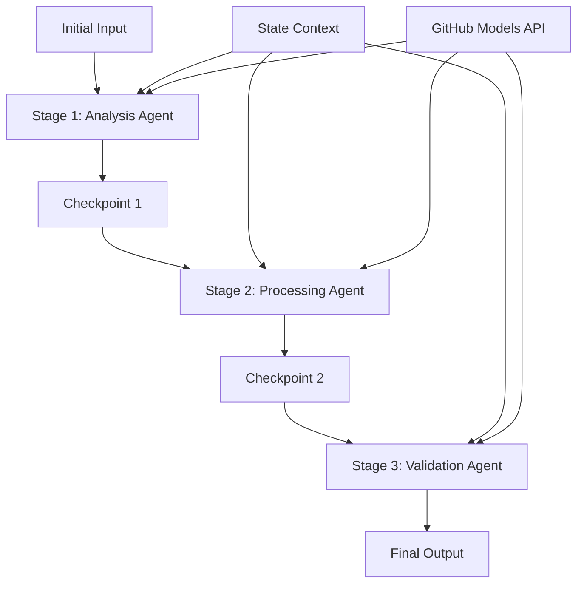

<!--
CO_OP_TRANSLATOR_METADATA:
{
  "original_hash": "1be9c8dcbd79a02d33d2c138684c1394",
  "translation_date": "2025-11-11T13:55:21+00:00",
  "source_file": "08-multi-agent/code_samples/workflows-agent-framework/dotNET/02.dotnet-agent-framework-workflow-ghmodel-sequential.md",
  "language_code": "no"
}
-->
# ⏩ Sekvensielle Agentarbeidsflyter med GitHub-modeller (.NET)

## 📋 Avansert veiledning for sekvensiell behandling

Denne notatboken demonstrerer **sekvensielle arbeidsflytmønstre** ved bruk av Microsoft Agent Framework for .NET og GitHub-modeller. Du vil lære hvordan du bygger sofistikerte, steg-for-steg behandlingspipelines der agenter utfører oppgaver i en spesifikk rekkefølge, med hvert trinn som bygger på resultatene fra det forrige.

## 🎯 Læringsmål

### 🔄 **Arkitektur for sekvensiell behandling**
- **Lineær arbeidsflytdesign**: Lag steg-for-steg behandlingspipelines med klare avhengigheter
- **Tilstandshåndtering**: Oppretthold kontekst og dataflyt gjennom sekvensielle arbeidsflytstadier
- **Integrasjon med GitHub-modeller**: Utnytt GitHubs AI-modeller i flertrinns .NET-arbeidsflyter
- **Enterprise-pipeline-mønstre**: Bygg produksjonsklare systemer for sekvensiell behandling

### 🏗️ **Avanserte sekvensielle mønstre**
- **Stage-Gate-behandling**: Implementer valideringskontroller mellom arbeidsflytstadier
- **Kontekstbevaring**: Oppretthold tilstand og akkumulert kunnskap gjennom alle stadier
- **Feilpropagering**: Håndter feil på en smidig måte i sekvensielle behandlingskjeder
- **Ytelsesoptimalisering**: Effektiv sekvensiell utførelse med minimalt overhead

### 🏢 **Sekvensielle applikasjoner for bedrifter**
- **Dokumentbehandlingspipeline**: Flertrinns dokumentanalyse, transformasjon og validering
- **Kvalitetssikringsarbeidsflyter**: Sekvensiell gjennomgang, validering og godkjenningsprosesser
- **Innholdsproduksjonspipeline**: Forskning → Skriving → Redigering → Gjennomgang → Publisering
- **Automatisering av forretningsprosesser**: Flertrinns forretningsarbeidsflyter med klare stadieavhengigheter

## ⚙️ Forutsetninger og oppsett

### 📦 **Nødvendige NuGet-pakker**

Essensielle pakker for .NET-sekvensielle arbeidsflyter:

```xml
<!-- Core AI Framework -->
<PackageReference Include="Microsoft.Extensions.AI" Version="9.9.0" />

<!-- Client Model Abstractions -->
<PackageReference Include="System.ClientModel" Version="1.6.1.0" />

<!-- Azure Identity and Async LINQ Support -->
<PackageReference Include="Azure.Identity" Version="1.15.0" />
<PackageReference Include="System.Linq.Async" Version="6.0.3" />

<!-- Local Agent Framework References -->
<!-- Microsoft.Agents.AI.dll - Core agent abstractions -->
<!-- Microsoft.Agents.AI.OpenAI.dll - GitHub Models integration -->
```

### 🔑 **Konfigurasjon av GitHub-modeller**

**Miljøoppsett (.env-fil):**
```env
GITHUB_TOKEN=your_github_personal_access_token
GITHUB_ENDPOINT=https://models.inference.ai.azure.com
GITHUB_MODEL_ID=gpt-4o-mini
```

**Konfigurasjonsadministrasjon:**
```csharp
// Load environment variables securely
Env.Load("../../../.env");
var githubToken = Environment.GetEnvironmentVariable("GITHUB_TOKEN");
var githubEndpoint = Environment.GetEnvironmentVariable("GITHUB_ENDPOINT");
var modelId = Environment.GetEnvironmentVariable("GITHUB_MODEL_ID");
```

### 🏗️ **Arkitektur for sekvensiell arbeidsflyt**



**Nøkkelkomponenter:**
- **Sekvensielle agenter**: Spesialiserte agenter for hvert behandlingsstadium
- **Tilstandskontekst**: Opprettholder akkumulert data og beslutninger gjennom stadier
- **Kontrollpunkter**: Valideringspunkter mellom stadier for å sikre kvalitet og konsistens
- **GitHub Models-klient**: Konsistent tilgang til AI-modeller gjennom alle stadier i arbeidsflyten

## 🎨 **Designmønstre for sekvensielle arbeidsflyter**

### 📝 **Dokumentbehandlingspipeline**
```
Raw Document → Content Extraction → Analysis → Validation → Structured Output
```

### 🎯 **Arbeidsflyt for innholdsproduksjon**
```
Brief/Requirements → Research → Content Creation → Review → Final Polish
```

### 🔍 **Kvalitetssikringspipeline**
```
Initial Review → Technical Validation → Compliance Check → Final Approval
```

### 💼 **Arbeidsflyt for forretningsintelligens**
```
Data Collection → Processing → Analysis → Report Generation → Distribution
```

## 🏢 **Fordeler med sekvensielle arbeidsflyter for bedrifter**

### 🎯 **Pålitelighet og kvalitet**
- **Deterministisk behandling**: Konsistente, repeterbare resultater gjennom strukturerte stadier
- **Kvalitetskontroller**: Valideringspunkter sikrer kvalitet i hvert stadium
- **Feilisolering**: Problemer i ett stadium sprer seg ikke til påfølgende stadier
- **Revisjonsspor**: Fullstendig sporing av beslutninger og transformasjoner i hvert stadium

### 📈 **Skalerbarhet og ytelse**
- **Modulær design**: Hvert stadium kan optimaliseres uavhengig
- **Ressursstyring**: Effektiv tildeling av AI-modellressurser gjennom stadier
- **Tilstandsoptimalisering**: Minimal tilstandsoverføring mellom stadier for optimal ytelse
- **Parallellstadiegrupper**: Flere sekvensielle arbeidsflyter kan kjøre parallelt

### 🔒 **Sikkerhet og samsvar**
- **Sikkerhet på stadienivå**: Ulike sikkerhetspolicyer for forskjellige behandlingsstadier
- **Datavalidering**: Sikre dataintegritet og samsvar ved hvert kontrollpunkt
- **Tilgangskontroll**: Granulære tillatelser for forskjellige stadier i arbeidsflyten
- **Regulatorisk samsvar**: Oppfyll regulatoriske krav gjennom strukturert behandling

### 📊 **Overvåking og analyse**
- **Metrikker på stadienivå**: Ytelsesovervåking for hvert stadium i arbeidsflyten
- **Identifisering av flaskehalser**: Identifiser og optimaliser langsomme stadier
- **Kvalitetsmetrikker**: Spor kvalitet og suksessrater i hvert stadium
- **Prosessoptimalisering**: Kontinuerlig forbedring basert på analyser på stadienivå

La oss bygge robuste sekvensielle AI-behandlingspipelines! 🚀

## 💻 Kjøre koden

Den komplette implementeringen er tilgjengelig i `02.dotnet-agent-framework-workflow-ghmodel-sequential.cs`. Denne filen demonstrerer en **tretrinns møbelanalysearbeidsflyt**:

1. **Trinn 1 - Salgsagent**: Analyserer møbelbilder og gir kjøpsforslag
2. **Trinn 2 - Prisagent**: Gir detaljerte prisoversikter og budsjettalternativer
3. **Trinn 3 - Tilbudsagent**: Genererer et profesjonelt tilbudsdokument i Markdown-format

### 🏗️ **Arbeidsflytarkitektur**

```
Image Input → Sales Analysis → Price Estimation → Quote Generation → Final Output
```

Hver agent:
- Mottar resultatet fra forrige stadium som kontekst
- Bygger videre på tidligere analyser med spesialisert ekspertise
- Opprettholder kontinuitet i arbeidsflyten gjennom tilstandshåndtering

### 🚀 Kjøre eksempelet

**Forutsetninger:**
- Plasser et møbelbilde på `../imgs/home.png` (eller oppdater variabelen `imgPath`)
- Konfigurer `.env`-filen din med GitHub Models-legitimasjon

```bash
# Make the script executable (Unix/Linux/macOS)
chmod +x 02.dotnet-agent-framework-workflow-ghmodel-sequential.cs

# Run the sequential workflow
./02.dotnet-agent-framework-workflow-ghmodel-sequential.cs
```

Eller på Windows:
```powershell
dotnet run 02.dotnet-agent-framework-workflow-ghmodel-sequential.cs
```

### 📝 Forventet resultat

Arbeidsflyten vil:
1. **Salgsagent**: Identifisere møbelartikler fra bildet og gi anbefalinger
2. **Prisagent**: Legge til detaljert prisanalyse med budsjettkategorier og shoppinganbefalinger
3. **Tilbudsagent**: Generere et formatert tilbudsdokument med all informasjon syntetisert

Det endelige resultatet vil være et omfattende, profesjonelt møbeltilbud basert på bildeanalyse.

### 🔧 Tilpasningsalternativer

**Endre agentoppførsel:**
```csharp
// Adjust agent instructions to change their focus
const string SalesAgentInstructions = "Your custom instructions...";
```

**Endre sekvensiell flyt:**
```csharp
// Add or reorder workflow stages
var workflow = new WorkflowBuilder(salesagent)
    .AddEdge(salesagent, priceagent)
    .AddEdge(priceagent, quoteagent)
    .AddEdge(quoteagent, newAgent)  // Add another stage
    .Build();
```

**Bruke annet input:**
```csharp
// Process text instead of images
ChatMessage userMessage = new ChatMessage(ChatRole.User, [
    new TextContent("Analyze pricing for a modern living room set")
]);
```

### 🎯 Virkelige applikasjoner

Dette sekvensielle mønsteret er ideelt for:
- **E-handel**: Produktanalyse → Prissetting → Tilbudsgenerering
- **Eiendom**: Eiendomsanalyse → Verdsettelse → Opprettelse av oppføringer
- **Forsikring**: Skadeanalyse → Vurdering → Tilbudsgenerering
- **Innholdsproduksjon**: Forskning → Skriving → Redigering → Publisering

### 🔍 Forstå tilstandsflyt

Hver agent i sekvensen mottar:
- **Originalt input**: Den opprinnelige brukermeldingen (bilde + tekst)
- **Tidligere agentutganger**: Alle tidligere agentresponser i samtalehistorikken
- **Akkumulert kontekst**: Fullstendig tilstand opprettholdt gjennom arbeidsflyten

Dette muliggjør sofistikert flertrinns behandling der hver agent bygger på omfattende kontekst fra alle tidligere stadier.

---

<!-- CO-OP TRANSLATOR DISCLAIMER START -->
**Ansvarsfraskrivelse**:  
Dette dokumentet er oversatt ved hjelp av AI-oversettelsestjenesten [Co-op Translator](https://github.com/Azure/co-op-translator). Selv om vi streber etter nøyaktighet, vær oppmerksom på at automatiske oversettelser kan inneholde feil eller unøyaktigheter. Det originale dokumentet på sitt opprinnelige språk bør anses som den autoritative kilden. For kritisk informasjon anbefales profesjonell menneskelig oversettelse. Vi er ikke ansvarlige for eventuelle misforståelser eller feiltolkninger som oppstår ved bruk av denne oversettelsen.
<!-- CO-OP TRANSLATOR DISCLAIMER END -->