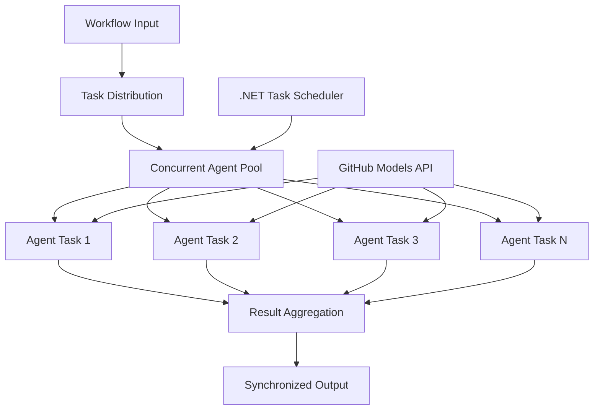

<!--
CO_OP_TRANSLATOR_METADATA:
{
  "original_hash": "b9c6e32c9b5f2fed20b6916984440d88",
  "translation_date": "2025-11-11T13:22:20+00:00",
  "source_file": "08-multi-agent/code_samples/workflows-agent-framework/dotNET/03.dotnet-agent-framework-workflow-ghmodel-concurrent.md",
  "language_code": "no"
}
-->
# ⚡ Samtidige Agentarbeidsflyter med GitHub-modeller (.NET)

## 📋 Opplæring i høyytelses parallell behandling

Denne veiledningen demonstrerer **samtidige arbeidsflytmønstre** ved bruk av Microsoft Agent Framework for .NET og GitHub-modeller. Du vil lære hvordan du bygger høyytelses arbeidsflyter for parallell behandling som maksimerer gjennomstrømning ved å kjøre flere AI-agenter samtidig, samtidig som du opprettholder koordinasjon og datakonsistens.

## 🎯 Læringsmål

### 🚀 **Grunnleggende om samtidig behandling**
- **Parallell agentutførelse**: Kjør flere AI-agenter samtidig for maksimal ytelse
- **Async/Await-mønstre**: Utnytt .NETs asynkrone programmeringsmodell for effektiv samtidighet
- **Integrasjon med GitHub-modeller**: Koordiner flere samtidige kall til GitHubs AI-modelltjeneste
- **Ressursstyring**: Håndter AI-modellressurser effektivt på tvers av samtidige operasjoner

### 🏗️ **Avansert samtidighetsarkitektur**
- **Oppgavebasert parallellisme**: Bruk .NET Task Parallel Library for optimal samtidig utførelse
- **Synkroniseringsmønstre**: Koordiner samtidige agenter og unngå kappløpsforhold
- **Lastbalansering**: Fordel arbeidet effektivt over tilgjengelig kapasitet for samtidig behandling
- **Feiltoleranse**: Håndter individuelle agentfeil uten å stoppe hele arbeidsflyten

### 🏢 **Samtidige applikasjoner for bedrifter**
- **Høyvolum dokumentbehandling**: Behandle flere dokumenter samtidig
- **Sanntidsinnholdsanalyse**: Samtidig analyse av innkommende datastrømmer
- **Optimalisering av batchbehandling**: Maksimer gjennomstrømning for storskala databehandlingsoperasjoner
- **Multimodal analyse**: Parallell behandling av ulike innholdstyper og formater

## ⚙️ Forutsetninger og oppsett

### 📦 **Nødvendige NuGet-pakker**

Essensielle pakker for høyytelses samtidige arbeidsflyter:

```xml
<!-- Core AI Framework with Async Support -->
<PackageReference Include="Microsoft.Extensions.AI" Version="9.9.0" />

<!-- Client Model Abstractions for API Communication -->
<PackageReference Include="System.ClientModel" Version="1.6.1.0" />

<!-- Azure Identity and Async LINQ for Advanced Operations -->
<PackageReference Include="Azure.Identity" Version="1.15.0" />
<PackageReference Include="System.Linq.Async" Version="6.0.3" />

<!-- Local Agent Framework References -->
<!-- Microsoft.Agents.AI.dll - Core agent abstractions with async support -->
<!-- Microsoft.Agents.AI.OpenAI.dll - GitHub Models integration with concurrency -->
```

### 🔑 **Konfigurasjon av GitHub-modeller**

**Miljøoppsett (.env-fil):**
```env
GITHUB_TOKEN=your_github_personal_access_token
GITHUB_ENDPOINT=https://models.inference.ai.azure.com
GITHUB_MODEL_ID=gpt-4o-mini
```

**Hensyn ved samtidig behandling:**
```csharp
// Configure for concurrent operations
var clientOptions = new OpenAIClientOptions()
{
    Endpoint = new Uri(githubEndpoint),
    // Configure connection pooling for concurrent requests
    NetworkTimeout = TimeSpan.FromMinutes(5)
};
```

### 🏗️ **Arkitektur for samtidig arbeidsflyt**



**Nøkkelkomponenter:**
- **Task Parallel Library**: .NETs innebygde støtte for samtidige operasjoner
- **Agentpool**: Flere agentinstanser for parallell behandling
- **Resultataggregasjon**: Koordinering og sammenslåing av resultater fra samtidige agenter
- **Synkroniseringspunkter**: Sikre datakonsistens på tvers av samtidige operasjoner

## 🎨 **Designmønstre for samtidig arbeidsflyt**

### 🔍 **Parallell forskning og analyse**
```
Research Topic → Concurrent Research Agents → Result Synthesis → Final Report
```

### 📊 **Databehandling fra flere kilder**
```
Data Sources → Parallel Processing Agents → Data Integration → Unified Output
```

### 🎭 **Innholdsproduksjonsprosess**
```
Content Requirements → Concurrent Content Generators → Quality Review → Final Content
```

### 🔄 **Fan-Out/Fan-In-behandling**
```
Single Input → Multiple Concurrent Processors → Result Aggregation → Single Output
```

## 🏢 **Fordeler med ytelse i bedrifter**

### ⚡ **Gjennomstrømning og skalerbarhet**
- **Lineær ytelsesskalerbarhet**: Legg til flere samtidige agenter for å øke gjennomstrømningen
- **Ressursutnyttelse**: Maksimal effektivitet av tilgjengelig AI-modellkapasitet
- **Redusert behandlingstid**: Betydelig tidsreduksjon gjennom parallell utførelse
- **Elastisk skalering**: Juster antall samtidige agenter dynamisk basert på arbeidsmengde

### 🛡️ **Pålitelighet og robusthet**
- **Feilisolering**: Individuelle agentfeil påvirker ikke andre samtidige operasjoner
- **Grasiøs degradering**: Systemet fortsetter å fungere med redusert agentkapasitet
- **Feilhåndtering**: Automatiske gjenopprettingsmekanismer for mislykkede samtidige operasjoner
- **Lastfordeling**: Jevn fordeling av arbeid over tilgjengelige agenter

### 📊 **Ytelsesovervåking**
- **Måling av samtidig utførelse**: Spor ytelsen til alle parallelle operasjoner
- **Analyse av ressursbruk**: Overvåk CPU-, minne- og nettverksbruk
- **Gjennomstrømningsanalyse**: Mål effektivitetsgevinster fra samtidig behandling
- **Flaskehalsdeteksjon**: Identifiser og løs ytelsesbegrensninger

### 🔧 **Utvikling og drift**
- **Asynkron programmeringsmodell**: Utnytt .NETs modne async/await-mønstre
- **Oppgavekoordinering**: Innebygd oppgavestyring og koordineringsfunksjoner
- **Unntakshåndtering**: Omfattende feilhåndtering for samtidige operasjoner
- **Feilsøkingsstøtte**: Visual Studio-feilsøkingsverktøy for samtidige arbeidsflyter

La oss bygge høyytelses samtidige AI-arbeidsflyter med .NET! 🚀

## 💻 Kjøre koden

Den komplette implementeringen er tilgjengelig i `03.dotnet-agent-framework-workflow-ghmodel-concurrent.cs`. Denne filen demonstrerer en **Fan-Out/Fan-In samtidig arbeidsflyt** for reiseplanlegging:

### 🏗️ **Arbeidsflytarkitektur**

```
User Request → ConcurrentStartExecutor → [Researcher Agent || Planner Agent] → ConcurrentAggregationExecutor → Final Output
```

**Nøkkelkomponenter:**

1. **ConcurrentStartExecutor**: Sender brukerforespørselen til alle agenter samtidig
2. **Researcher Agent**: Analyserer destinasjoner og attraksjoner parallelt
3. **Planner Agent**: Lager detaljerte reiseplaner parallelt
4. **ConcurrentAggregationExecutor**: Samler og slår sammen resultater fra begge agenter

### 🎯 **Fan-Out/Fan-In-mønster**

Denne arbeidsflyten demonstrerer det klassiske **Fan-Out/Fan-In**-mønsteret:
- **Fan-Out**: En innkommende melding sendes til flere agenter samtidig
- **Samtidig behandling**: Flere agenter jobber parallelt med samme oppgave
- **Fan-In**: Resultater fra alle agenter samles og aggregeres til én enkelt utdata

### 🚀 Kjøre eksempelet

```bash
# Make the script executable (Unix/Linux/macOS)
chmod +x 03.dotnet-agent-framework-workflow-ghmodel-concurrent.cs

# Run the concurrent workflow
./03.dotnet-agent-framework-workflow-ghmodel-concurrent.cs
```

Eller på Windows:
```powershell
dotnet run 03.dotnet-agent-framework-workflow-ghmodel-concurrent.cs
```

### 📝 Forventet utdata

Arbeidsflyten vil:
1. **Sende forespørsel**: Sende "Planlegg en tur til Seattle i desember" til begge agenter
2. **Samtidig behandling**: Begge agenter jobber samtidig:
   - Researcher identifiserer attraksjoner og detaljer
   - Planner lager reiserute og logistikk
3. **Aggregering**: Kombinerer begge svarene til en omfattende utdata
4. **Vis resultater**: Viser den sammenslåtte reiseplanen med all informasjon

### 🔧 Tilpasningsmuligheter

**Legg til flere samtidige agenter:**
```csharp
// Create additional specialized agents
AIAgent budgetAgent = openAIClient.GetChatClient(github_model_id).CreateAIAgent(
    name: "Budget-Agent", instructions: "Calculate travel costs...");

// Add to fan-out
var workflow = new WorkflowBuilder(startExecutor)
    .AddFanOutEdge(startExecutor, targets: [researcherAgent, plannerAgent, budgetAgent])
    .AddFanInEdge(aggregationExecutor, sources: [researcherAgent, plannerAgent, budgetAgent])
    .WithOutputFrom(aggregationExecutor)
    .Build();

// Update aggregation count
if (this._messages.Count == 3) { ... }
```

**Endre agentinstruksjoner:**
```csharp
const string ResearcherAgentInstructions = "Your custom instructions for research...";
const string PlanAgentInstructions = "Your custom instructions for planning...";
```

**Endre oppgaven:**
```csharp
StreamingRun run = await InProcessExecution.StreamAsync(
    workflow, 
    "Plan a European vacation for 2 weeks in summer"
);
```

### 🎯 Virkelige applikasjoner

Dette samtidige mønsteret er ideelt for:
- **Innholdsproduksjon**: Flere forfattere som lager ulike seksjoner samtidig
- **Kodegjennomgang**: Flere gjennomlesere som analyserer kode fra ulike perspektiver
- **Markedsundersøkelser**: Parallell analyse av ulike markedssegmenter
- **Dokumentbehandling**: Samtidig utvinning, analyse og validering
- **Flere perspektivanalyser**: Få ulike synspunkter på samme innspill

### 🔍 Forstå tilpassede eksekutører

**ConcurrentStartExecutor:**
- Implementerer `IMessageHandler<string>` for å akseptere strenginput
- Sender meldinger til alle tilkoblede agenter
- Sender `TurnToken` for å utløse samtidig behandling

**ConcurrentAggregationExecutor:**
- Implementerer `IMessageHandler<ChatMessage>` for å motta agentresponser
- Samler meldinger på en trådsikker måte
- Aggregerer når alle forventede svar er mottatt
- Leverer endelig utdata ved hjelp av `context.YieldOutputAsync()`

### ⚡ Ytelsesfordeler

**Samtidig vs Sekvensiell:**
- Sekvensiell: Agent1 (30s) → Agent2 (30s) = **60 sekunder totalt**
- Samtidig: Agent1 (30s) || Agent2 (30s) = **30 sekunder totalt**

**Gjennomstrømningsforbedring**: Opptil N× raskere for N samtidige agenter (avhengig av arbeidsmengde og ressurser)

### 🛡️ Feilhåndtering

Arbeidsflyten håndterer individuelle agentfeil på en smidig måte:
- Hvis én agent feiler, fortsetter de andre å behandle
- Aggregatoren kan implementere tidsavbruddslogikk
- Delvise resultater kan returneres om nødvendig

### 📊 Avanserte funksjoner

**Dynamisk antall agenter:**
Endre aggregeringslogikken for å støtte variabelt antall agenter:

```csharp
private int _expectedAgentCount;
private readonly List<ChatMessage> _messages = [];

public async ValueTask HandleAsync(ChatMessage message, IWorkflowContext context)
{
    this._messages.Add(message);
    if (this._messages.Count == _expectedAgentCount)
    {
        // Process aggregation
    }
}
```

Dette samtidige arbeidsflytmønsteret er essensielt for å bygge høyytelses, skalerbare AI-agentsystemer!

---

<!-- CO-OP TRANSLATOR DISCLAIMER START -->
**Ansvarsfraskrivelse**:  
Dette dokumentet er oversatt ved hjelp av AI-oversettelsestjenesten [Co-op Translator](https://github.com/Azure/co-op-translator). Selv om vi streber etter nøyaktighet, vær oppmerksom på at automatiserte oversettelser kan inneholde feil eller unøyaktigheter. Det originale dokumentet på sitt opprinnelige språk bør anses som den autoritative kilden. For kritisk informasjon anbefales profesjonell menneskelig oversettelse. Vi er ikke ansvarlige for misforståelser eller feiltolkninger som oppstår ved bruk av denne oversettelsen.
<!-- CO-OP TRANSLATOR DISCLAIMER END -->