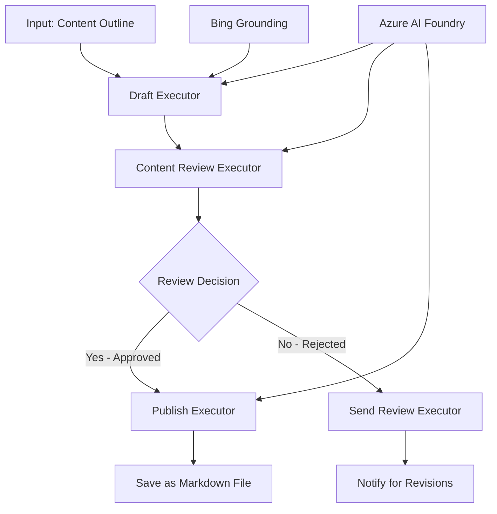

<!--
CO_OP_TRANSLATOR_METADATA:
{
  "original_hash": "8abd335151cee553293b637ee3d80d10",
  "translation_date": "2025-11-11T12:19:52+00:00",
  "source_file": "08-multi-agent/code_samples/workflows-agent-framework/dotNET/04.dotnet-agent-framework-workflow-aifoundry-condition.md",
  "language_code": "no"
}
-->
# 🔀 Betingede Agentarbeidsflyter med Azure AI Foundry (.NET)

## 📋 Veiledning for Intelligent Beslutningsbasert Arbeidsflyt

Denne notatboken demonstrerer **betingede arbeidsflytmønstre** ved bruk av Azure AI Foundry og Microsoft Agent Framework for .NET. Du vil lære hvordan du bygger avanserte, beslutningsdrevne arbeidsflyter som intelligent styrer prosessering basert på AI-analyse, forretningsregler og dynamiske betingelser for automatisering på bedriftsnivå.

## 🎯 Læringsmål

### 🧠 **Intelligent Beslutningsarkitektur**
- **Implementering av betinget logikk**: Bygg komplekse beslutningstrær med flere forgreningspunkter
- **AI-drevet ruting**: Bruk Azure AI Foundry-modeller for å ta intelligente rutingsbeslutninger
- **Dynamisk tilpasning av arbeidsflyt**: Endre arbeidsflytens oppførsel basert på analyse og betingelser under kjøring
- **Integrering av forretningsregler**: Inkluder forretningslogikk og samsvarskrav i arbeidsflyter

### 🔀 **Avanserte betingede mønstre**
- **Beslutningstaking basert på flere kriterier**: Vurder flere faktorer for rutingsbeslutninger
- **Kontekstbevisst prosessering**: Ta beslutninger basert på akkumulert arbeidsflytkontekst og historikk
- **Tilpasning av arbeidsflyt**: Juster prosesseringsveier dynamisk basert på sanntidsbetingelser
- **Integrering av regelmotor**: Implementer avanserte forretningsregelmotorer i arbeidsflyter

### 🏢 **Betingede applikasjoner for bedrifter**
- **Dokumentklassifisering og ruting**: Klassifiser og ruter dokumenter automatisk til passende arbeidsflyter
- **Kundebehandling**: Intelligent ruting av kundehenvendelser til spesialiserte team
- **Samsvar og risikohåndtering**: Bruk ulike validerings- og gjennomgangsprosesser basert på risikovurdering
- **Kvalitetssikringsarbeidsflyter**: Ruter innhold gjennom passende gjennomgangsprosesser basert på kvalitetsmålinger

## ⚙️ Forutsetninger og oppsett

### 📦 **Nødvendige NuGet-pakker**

Avanserte pakker for betinget arbeidsflytprosessering:

```xml
<!-- Core AI Framework -->
<PackageReference Include="Microsoft.Extensions.AI" Version="9.9.0" />

<!-- Azure AI Agents with Persistent State -->
<PackageReference Include="Azure.AI.Agents.Persistent" Version="1.2.0-beta.5" />

<!-- Azure Identity and Utilities -->
<PackageReference Include="Azure.Identity" Version="1.15.0" />
<PackageReference Include="System.Linq.Async" Version="6.0.3" />
<PackageReference Include="DotNetEnv" Version="3.1.1" />

<!-- Local Workflow Framework References -->
<!-- Microsoft.Agents.Workflows.dll - Advanced workflow orchestration -->
<!-- Microsoft.Agents.AI.AzureAI.dll - Azure AI Foundry integration -->
<!-- Microsoft.Agents.AI.dll - Core agent abstractions -->
```

### 🔑 **Azure AI Foundry-konfigurasjon**

**Nødvendige Azure-ressurser:**
- Azure AI Foundry-arbeidsområde med modeller for betinget prosessering
- Azure-abonnement med passende datakvoter og tillatelser
- Distribuerte AI-modeller for beslutningstaking og innholdsanalyse
- (Valgfritt) Bing Search API-tilkobling for grunnleggende funksjoner

**Miljøkonfigurasjon (.env-fil):**
```env
# Azure AI Foundry Configuration
AZURE_AI_PROJECT_ENDPOINT=https://your-project.cognitiveservices.azure.com/
BING_CONNECTION_ID=your-bing-connection-id
```

**Autentiseringsoppsett:**
```csharp
// Azure CLI or Managed Identity authentication
using Azure.Identity;
var credential = new AzureCliCredential();

// Load environment configuration
DotNetEnv.Env.Load("../../../.env");
```

### 🏗️ **Arkitektur for betinget arbeidsflyt**



**Nøkkelkomponenter:**
- **Draft Executor**: AI-agent som lager innledende innholdskladder fra disposisjoner
- **Content Review Executor**: AI-agent som evaluerer kvalitet og samsvar for kladdene
- **Betinget ruting**: Beslutningslogikk som ruter basert på gjennomgangsresultater
- **Publiserings-/gjennomgangsveier**: Separate prosesseringsveier for godkjent vs. avvist innhold
- **Tilstandsadministrasjon**: Opprettholder innhold og gjennomgangskontekst gjennom hele arbeidsflyten

## 🎨 **Designmønstre for betinget arbeidsflyt**

### 📋 **Innholdsproduksjon med kvalitetsporter**
```
Outline → Draft Creation → Quality Review → {Approve: Publish | Reject: Revise}
```

### 🎯 **Risikobasert dokumentprosessering**
```
Document → Risk Assessment → {Low: Standard | High: Enhanced Review}
```

### 🔍 **Intelligent kundeserviceruting**
```
Customer Query → Analysis → {Simple: FAQ Bot | Complex: Human Agent}
```

### 💼 **Samsvarsbaserte arbeidsflyter**
```
Content → Compliance Check → {Pass: Publish | Fail: Legal Review}
```

## 🏢 **Fordeler med betinget arbeidsflyt for bedrifter**

### 🎯 **Intelligent automatisering**
- **Smarte beslutninger**: AI-drevne rutingsbeslutninger basert på innholdsanalyse og kontekst
- **Tilpasset prosessering**: Arbeidsflyter som automatisk justeres basert på endrede betingelser
- **Håndheving av forretningsregler**: Automatisk anvendelse av komplekse forretningslogikker og retningslinjer
- **Kontekstbevisst ruting**: Beslutninger basert på full arbeidsflythistorikk og akkumulert kontekst

### 📈 **Operasjonell fortreffelighet**
- **Optimal ressursallokering**: Ruter arbeid til de mest passende spesialistene og prosessene
- **Redusert manuell intervensjon**: Automatisert beslutningstaking minimerer behovet for menneskelig ruting
- **Raskere løsningstider**: Direkte ruting til passende ekspertise og prosesseringskapasiteter
- **Konsekvent anvendelse**: Ensartet anvendelse av forretningsregler og beslutningskriterier

### 🛡️ **Risikohåndtering og samsvar**
- **Automatisk risikovurdering**: AI-drevet evaluering av innhold og situasjonsrisikonivåer
- **Samsvarshåndheving**: Automatisk ruting gjennom nødvendige regulatoriske prosesser
- **Anvendelse av sikkerhetsprotokoller**: Forsterkede sikkerhetstiltak basert på risikovurdering
- **Vedlikehold av revisjonsspor**: Full dokumentasjon av rutingsbeslutninger og begrunnelser

### 📊 **Analyse og kontinuerlig forbedring**
- **Beslutningsanalyse**: Spor effektiviteten og nøyaktigheten til rutingsbeslutninger
- **Mønsteridentifikasjon**: Identifiser trender og mønstre i rutingsbeslutninger over tid
- **Optimalisering av ytelse**: Kontinuerlig forbedring av beslutningskriterier og rutingseffektivitet
- **Forretningsinnsikt**: Innsikt i innholdskarakteristikker og prosesseringsbehov

### 🔧 **Teknisk fortreffelighet**
- **Vedvarende tilstandsadministrasjon**: Oppretthold kompleks tilstand gjennom arbeidsflytutførelse
- **Skalerbar arkitektur**: Håndter høye volum av betinget prosessering
- **Integreringsmuligheter**: Sømløs integrering med eksisterende forretningssystemer og prosesser
- **Overvåking og observasjon**: Omfattende sporing av arbeidsflytytelse og beslutninger

La oss bygge intelligente, beslutningsdrevne arbeidsflyter for bedrifter med .NET! 🚀

## 💻 Kjøre koden

Den komplette implementeringen er tilgjengelig i `04.dotnet-agent-framework-workflow-aifoundry-condition.cs`. Dette demonstrerer en **innholdsproduksjonsarbeidsflyt med kvalitetsporter**:

### 🏗️ **Arbeidsflytarkitektur**

```
Content Outline → Draft Creation → Quality Review → Conditional Routing:
                                                      ├─ Approved (>200 words) → Publish
                                                      └─ Rejected (<200 words) → Review Notification
```

**Agenter i arbeidsflyten:**
1. **Evangelist Agent**: Lager opplæringskladd fra disposisjoner med Bing-grunnlag
2. **Content Reviewer Agent**: Evaluerer kladdkvalitet (ordtelling, fullstendighet)
3. **Publisher Agent**: Lagre godkjent innhold som tidsstemplet Markdown-fil

**Egendefinerte utførere:**
1. **DraftExecutor**: Orkestrerer kladdoppretting
2. **ContentReviewExecutor**: Utfører kvalitetsvurdering
3. **PublishExecutor**: Håndterer publisering av godkjent innhold
4. **SendReviewExecutor**: Administrerer varsler om avvist innhold

### 🚀 Kjøre eksempelet

**Forutsetninger:**
- Konfigurert Azure AI Foundry-arbeidsområde
- Azure CLI-autentisering (`az login`)
- (Valgfritt) Bing Search-tilkobling for grunnlag

```bash
# Make the script executable (Unix/Linux/macOS)
chmod +x 04.dotnet-agent-framework-workflow-aifoundry-condition.cs

# Run the conditional workflow
./04.dotnet-agent-framework-workflow-aifoundry-condition.cs
```

Eller på Windows:
```powershell
dotnet run 04.dotnet-agent-framework-workflow-aifoundry-condition.cs
```

### 📝 Forventet resultat

Arbeidsflyten vil:
1. **Opprette agenter**: Initialisere tre spesialiserte Azure AI Foundry-agenter
2. **Generere kladd**: Evangelist-agent lager opplæringskladd fra disposisjon
3. **Gjennomgå innhold**: Content Reviewer evaluerer kladdkvalitet
4. **Betinget ruting**:
   - **Hvis godkjent (>200 ord)**: Publish Executor lagrer som Markdown-fil
   - **Hvis avvist (<200 ord)**: Send Review Notification
5. **Vis resultater**: Vise endelig arbeidsflytresultat

### 🔧 Tilpasningsmuligheter

**Endre gjennomgangskriterier:**
```csharp
const string ContentReviewerInstructions = @"
You are a content reviewer...
1. Check if content is more than 500 words (instead of 200)
2. Verify technical accuracy
3. Ensure proper formatting
...";
```

**Legg til flere betingede veier:**
```csharp
var workflow = new WorkflowBuilder(draftExecutor)
    .AddEdge(draftExecutor, contentReviewerExecutor)
    .AddEdge(contentReviewerExecutor, publishExecutor, condition: GetCondition("Excellent"))
    .AddEdge(contentReviewerExecutor, editExecutor, condition: GetCondition("Good"))
    .AddEdge(contentReviewerExecutor, sendReviewerExecutor, condition: GetCondition("Poor"))
    .Build();
```

**Endre innholdskrav:**
```csharp
string OUTLINE_Content = @"
# Your Custom Topic
## Section 1
https://your-reference-url
## Section 2
...
";
```

### 🎯 Virkelige applikasjoner

Dette mønsteret for betinget arbeidsflyt er ideelt for:
- **Innholdsadministrasjonssystemer**: Automatiserte redaksjonelle arbeidsflyter med kvalitetsporter
- **Dokumentprosessering**: Ruter dokumenter basert på klassifisering og samsvar
- **Kundestøtte**: Intelligent ruting av billetter basert på kompleksitet og hast
- **Juridisk gjennomgang**: Ruter kontrakter basert på risikovurdering og verdi
- **HR-prosesser**: Ruter søknader gjennom passende screeningarbeidsflyter

### 🔍 Forstå betinget logikk

**Betingelsesfunksjon:**
```csharp
public Func<object?, bool> GetCondition(string expectedResult) =>
    reviewResult => reviewResult is ReviewResult review && review.Result == expectedResult;
```

Denne funksjonen oppretter en predikat som:
1. Sjekker om resultatet er av typen `ReviewResult`
2. Sammenligner `Result`-egenskapen med forventet verdi
3. Returnerer sann/falsk for å avgjøre ruting

**Arbeidsflytkanter med betingelser:**
```csharp
.AddEdge(contentReviewerExecutor, publishExecutor, condition: GetCondition("Yes"))
.AddEdge(contentReviewerExecutor, sendReviewerExecutor, condition: GetCondition("No"))
```

### 📊 Avanserte funksjoner

**JSON-skjema validering:**
Arbeidsflyten bruker JSON-skjemaer for å sikre strukturerte svar:

```csharp
// Define response structure
public class ReviewResult
{
    [JsonPropertyName("review_result")]
    public string Result { get; set; } = string.Empty;
    
    [JsonPropertyName("reason")]
    public string Reason { get; set; } = string.Empty;
    
    [JsonPropertyName("draft_content")]
    public string DraftContent { get; set; } = string.Empty;
}

// Apply to agent
ResponseFormat = ChatResponseFormat.ForJsonSchema(
    AIJsonUtilities.CreateJsonSchema(typeof(ReviewResult)), 
    "ReviewResult", 
    "Review Result From DraftContent"
)
```

**Bing-grunnlagsintegrasjon:**
Evangelist-agenten bruker Bing-grunnlag for å få tilgang til sanntidsinformasjon:

```csharp
var bingGroundingConfig = new BingGroundingSearchConfiguration(bing_conn_id);
BingGroundingToolDefinition bingGroundingTool = new(
    new BingGroundingSearchToolParameters([bingGroundingConfig])
);
```

Dette gjør det mulig for agenten å følge URL-er i disposisjonen og hente oppdatert informasjon.

### 🛡️ Feilhåndtering

Arbeidsflyten inkluderer robust feilhåndtering for avvist innhold:
- Gjennomgangsfeil utløser den alternative veien
- Varsler gir klare avvisningsårsaker
- Innhold bevares for revisjon

### 🔄 Utvidelse av arbeidsflyten

**Legg til en revisjonsloop:**
Opprett en tilbakemeldingssløyfe som automatisk lager innhold på nytt:

```csharp
.AddEdge(contentReviewerExecutor, publishExecutor, condition: GetCondition("Yes"))
.AddEdge(contentReviewerExecutor, draftExecutor, condition: GetCondition("No")) // Loop back
```

**Implementer flernivågjennomgang:**
Legg til flere gjennomgangsstadier med ulike kriterier:

```csharp
.AddEdge(draftExecutor, technicalReviewer)
.AddEdge(technicalReviewer, editorialReviewer, condition: GetCondition("TechPass"))
.AddEdge(editorialReviewer, publishExecutor, condition: GetCondition("EditPass"))
```

Dette mønsteret for betinget arbeidsflyt gir grunnlaget for å bygge sofistikerte, intelligente automatiseringssystemer for bedrifter! 🚀

---

<!-- CO-OP TRANSLATOR DISCLAIMER START -->
**Ansvarsfraskrivelse**:  
Dette dokumentet er oversatt ved hjelp av AI-oversettelsestjenesten [Co-op Translator](https://github.com/Azure/co-op-translator). Selv om vi streber etter nøyaktighet, vær oppmerksom på at automatiserte oversettelser kan inneholde feil eller unøyaktigheter. Det originale dokumentet på dets opprinnelige språk bør anses som den autoritative kilden. For kritisk informasjon anbefales profesjonell menneskelig oversettelse. Vi er ikke ansvarlige for eventuelle misforståelser eller feiltolkninger som oppstår ved bruk av denne oversettelsen.
<!-- CO-OP TRANSLATOR DISCLAIMER END -->