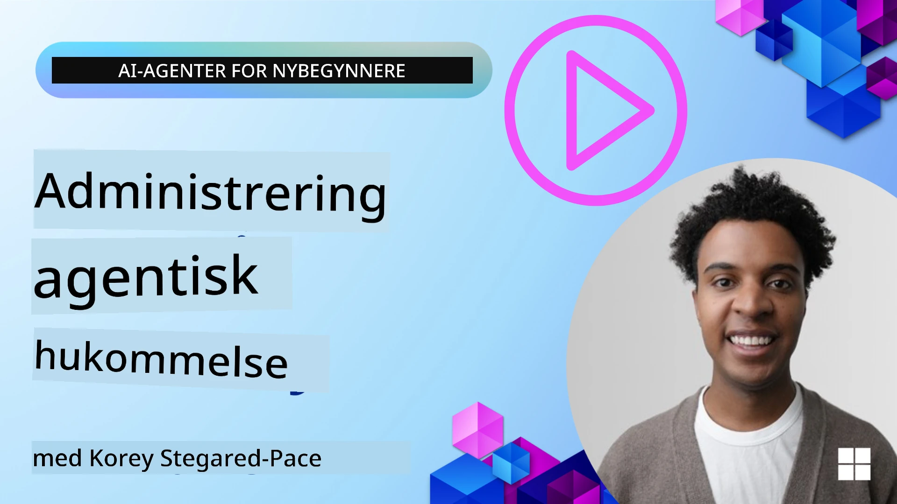

<!--
CO_OP_TRANSLATOR_METADATA:
{
  "original_hash": "a1d90991499ad697c4ad24decaf36968",
  "translation_date": "2025-12-09T12:27:33+00:00",
  "source_file": "13-agent-memory/README.md",
  "language_code": "no"
}
-->
# Minne for AI-agenter 

Når vi diskuterer de unike fordelene ved å lage AI-agenter, er det to ting som ofte nevnes: evnen til å bruke verktøy for å fullføre oppgaver og evnen til å forbedre seg over tid. Minne er grunnlaget for å skape selvforbedrende agenter som kan gi bedre opplevelser for brukerne våre.

I denne leksjonen skal vi se på hva minne er for AI-agenter, og hvordan vi kan administrere og bruke det til fordel for applikasjonene våre.

## Introduksjon

Denne leksjonen vil dekke:

• **Forståelse av AI-agentminne**: Hva minne er og hvorfor det er essensielt for agenter.

• **Implementering og lagring av minne**: Praktiske metoder for å legge til minnefunksjoner i AI-agenter, med fokus på korttids- og langtidsminne.

• **Gjøre AI-agenter selvforbedrende**: Hvordan minne gjør det mulig for agenter å lære av tidligere interaksjoner og forbedre seg over tid.

## Tilgjengelige implementeringer

Denne leksjonen inkluderer to omfattende notatbokveiledninger:

• **[13-agent-memory.ipynb](./13-agent-memory.ipynb)**: Implementerer minne ved hjelp av Mem0 og Azure AI Search med Semantic Kernel-rammeverket.

• **[13-agent-memory-cognee.ipynb](./13-agent-memory-cognee.ipynb)**: Implementerer strukturert minne ved hjelp av Cognee, som automatisk bygger en kunnskapsgraf støttet av embeddings, visualiserer grafen og muliggjør intelligent gjenfinning.

## Læringsmål

Etter å ha fullført denne leksjonen, vil du vite hvordan du:

• **Skiller mellom ulike typer AI-agentminne**, inkludert arbeidsminne, korttidsminne og langtidsminne, samt spesialiserte former som personaminne og episodisk minne.

• **Implementerer og administrerer korttids- og langtidsminne for AI-agenter** ved hjelp av Semantic Kernel-rammeverket, med verktøy som Mem0, Cognee, Whiteboard-minne og integrering med Azure AI Search.

• **Forstår prinsippene bak selvforbedrende AI-agenter** og hvordan robuste minnehåndteringssystemer bidrar til kontinuerlig læring og tilpasning.

## Forståelse av AI-agentminne

I bunn og grunn refererer **minne for AI-agenter til mekanismene som lar dem beholde og hente frem informasjon**. Denne informasjonen kan være spesifikke detaljer om en samtale, brukerpreferanser, tidligere handlinger eller til og med lærte mønstre.

Uten minne er AI-applikasjoner ofte tilstandsløse, noe som betyr at hver interaksjon starter fra bunnen av. Dette fører til en repeterende og frustrerende brukeropplevelse der agenten "glemmer" tidligere kontekst eller preferanser.

### Hvorfor er minne viktig?

En agents intelligens er nært knyttet til dens evne til å huske og bruke tidligere informasjon. Minne gjør det mulig for agenter å være:

• **Reflekterende**: Lære av tidligere handlinger og resultater.

• **Interaktive**: Opprettholde kontekst gjennom en pågående samtale.

• **Proaktive og reaktive**: Forutse behov eller reagere hensiktsmessig basert på historiske data.

• **Autonome**: Operere mer selvstendig ved å trekke på lagret kunnskap.

Målet med å implementere minne er å gjøre agenter mer **pålitelige og kapable**.

### Typer av minne

#### Arbeidsminne

Tenk på dette som et stykke kladdepapir en agent bruker under en enkelt, pågående oppgave eller tankeprosess. Det holder umiddelbar informasjon som trengs for å beregne neste steg.

For AI-agenter fanger arbeidsminne ofte opp den mest relevante informasjonen fra en samtale, selv om hele samtalehistorikken er lang eller avkortet. Det fokuserer på å trekke ut nøkkelpunkter som krav, forslag, beslutninger og handlinger.

**Eksempel på arbeidsminne**

I en reisebestillingsagent kan arbeidsminne fange opp brukerens nåværende forespørsel, som "Jeg vil bestille en tur til Paris". Dette spesifikke kravet holdes i agentens umiddelbare kontekst for å styre den nåværende interaksjonen.

#### Korttidsminne

Denne typen minne beholder informasjon i løpet av en enkelt samtale eller økt. Det er konteksten for den nåværende chatten, som gjør det mulig for agenten å referere til tidligere deler av dialogen.

**Eksempel på korttidsminne**

Hvis en bruker spør: "Hvor mye koster en flyreise til Paris?" og deretter følger opp med "Hva med overnatting der?", sørger korttidsminne for at agenten vet at "der" refererer til "Paris" i samme samtale.

#### Langtidsminne

Dette er informasjon som vedvarer på tvers av flere samtaler eller økter. Det lar agenter huske brukerpreferanser, historiske interaksjoner eller generell kunnskap over lengre tid. Dette er viktig for personalisering.

**Eksempel på langtidsminne**

Et langtidsminne kan lagre at "Ben liker ski og utendørsaktiviteter, foretrekker kaffe med fjellutsikt, og vil unngå avanserte skibakker på grunn av en tidligere skade". Denne informasjonen, lært fra tidligere interaksjoner, påvirker anbefalinger i fremtidige reiseplanleggingsøkter, noe som gjør dem svært personaliserte.

#### Personaminne

Denne spesialiserte typen minne hjelper en agent med å utvikle en konsistent "personlighet" eller "persona". Det lar agenten huske detaljer om seg selv eller sin tiltenkte rolle, noe som gjør interaksjoner mer flytende og fokuserte.

**Eksempel på personaminne**

Hvis reiseagenten er designet for å være en "ekspert på skiplanlegging", kan personaminne forsterke denne rollen, og påvirke svarene slik at de samsvarer med tonen og kunnskapen til en ekspert.

#### Arbeidsflyt-/episodisk minne

Dette minnet lagrer rekkefølgen av trinn en agent tar under en kompleks oppgave, inkludert suksesser og feil. Det er som å huske spesifikke "episoder" eller tidligere erfaringer for å lære av dem.

**Eksempel på episodisk minne**

Hvis agenten forsøkte å bestille en spesifikk flyreise, men det mislyktes på grunn av utilgjengelighet, kan episodisk minne registrere denne feilen, slik at agenten kan prøve alternative flyreiser eller informere brukeren om problemet på en mer informert måte ved et senere forsøk.

#### Enhetsminne

Dette innebærer å trekke ut og huske spesifikke enheter (som personer, steder eller ting) og hendelser fra samtaler. Det lar agenten bygge en strukturert forståelse av nøkkelpunktene som diskuteres.

**Eksempel på enhetsminne**

Fra en samtale om en tidligere tur kan agenten trekke ut "Paris", "Eiffeltårnet" og "middag på Le Chat Noir restaurant" som enheter. I en fremtidig interaksjon kan agenten huske "Le Chat Noir" og tilby å gjøre en ny reservasjon der.

#### Strukturert RAG (Retrieval Augmented Generation)

Selv om RAG er en bredere teknikk, fremheves "Strukturert RAG" som en kraftig minneteknologi. Den trekker ut tett, strukturert informasjon fra ulike kilder (samtaler, e-poster, bilder) og bruker det for å forbedre presisjon, gjenfinning og hastighet i svarene. I motsetning til klassisk RAG som kun baserer seg på semantisk likhet, arbeider Strukturert RAG med den iboende strukturen i informasjonen.

**Eksempel på strukturert RAG**

I stedet for bare å matche nøkkelord, kan Strukturert RAG analysere flydetaljer (destinasjon, dato, tid, flyselskap) fra en e-post og lagre dem på en strukturert måte. Dette muliggjør presise forespørsler som "Hvilket fly bestilte jeg til Paris på tirsdag?"

## Implementering og lagring av minne

Å implementere minne for AI-agenter innebærer en systematisk prosess med **minnehåndtering**, som inkluderer generering, lagring, gjenfinning, integrering, oppdatering og til og med "glemming" (eller sletting) av informasjon. Gjenfinning er en spesielt viktig del.

### Spesialiserte minneverktøy

#### Mem0

En måte å lagre og administrere agentminne på er ved å bruke spesialiserte verktøy som Mem0. Mem0 fungerer som et vedvarende minnelag, som lar agenter huske relevante interaksjoner, lagre brukerpreferanser og faktakontekst, og lære av suksesser og feil over tid. Ideen her er at tilstandsløse agenter blir til tilstandsfulle.

Det fungerer gjennom en **tofaset minneprosess: utvinning og oppdatering**. Først sendes meldinger lagt til en agents tråd til Mem0-tjenesten, som bruker en Large Language Model (LLM) for å oppsummere samtalehistorikk og trekke ut nye minner. Deretter bestemmer en LLM-drevet oppdateringsfase om disse minnene skal legges til, endres eller slettes, og lagrer dem i en hybrid datalagring som kan inkludere vektor-, graf- og nøkkel-verdi-databaser. Dette systemet støtter også ulike minnetyper og kan inkludere grafminne for å administrere relasjoner mellom enheter.

#### Cognee

En annen kraftig tilnærming er å bruke **Cognee**, en åpen kildekode for semantisk minne for AI-agenter som transformerer strukturert og ustrukturert data til søkbare kunnskapsgrafer støttet av embeddings. Cognee tilbyr en **to-lags arkitektur** som kombinerer vektorsøk med grafrelasjoner, slik at agenter kan forstå ikke bare hva informasjon er lik, men hvordan konsepter henger sammen.

Den utmerker seg i **hybrid gjenfinning** som blander vektorsøk, grafstruktur og LLM-resonnering - fra rå datainnhenting til grafbevisst spørsmål-svar. Systemet opprettholder **levende minne** som utvikler seg og vokser mens det forblir søkbart som én sammenkoblet graf, og støtter både kortsiktig øktkontekst og langsiktig vedvarende minne.

Cognee-notatboken ([13-agent-memory-cognee.ipynb](./13-agent-memory-cognee.ipynb)) demonstrerer hvordan man bygger dette enhetlige minnelaget, med praktiske eksempler på å hente inn ulike datakilder, visualisere kunnskapsgrafen og søke med ulike strategier tilpasset spesifikke agentbehov.

### Lagring av minne med RAG

I tillegg til spesialiserte minneverktøy som Mem0, kan du bruke robuste søketjenester som **Azure AI Search som backend for lagring og gjenfinning av minner**, spesielt for strukturert RAG.

Dette lar deg forankre agentens svar med dine egne data, og sikrer mer relevante og nøyaktige svar. Azure AI Search kan brukes til å lagre bruker-spesifikke reiseopplevelser, produktkataloger eller annen domenespesifikk kunnskap.

Azure AI Search støtter funksjoner som **Strukturert RAG**, som utmerker seg i å trekke ut og gjenfinne tett, strukturert informasjon fra store datasett som samtalehistorikk, e-poster eller til og med bilder. Dette gir "supermenneskelig presisjon og gjenfinning" sammenlignet med tradisjonelle tekstchunking- og embedding-tilnærminger.

## Gjøre AI-agenter selvforbedrende

Et vanlig mønster for selvforbedrende agenter innebærer å introdusere en **"kunnskapsagent"**. Denne separate agenten observerer hovedsamtalen mellom brukeren og den primære agenten. Dens rolle er å:

1. **Identifisere verdifull informasjon**: Bestemme om noen del av samtalen er verdt å lagre som generell kunnskap eller en spesifikk brukerpreferanse.

2. **Trekke ut og oppsummere**: Destillere essensiell læring eller preferanse fra samtalen.

3. **Lagre i en kunnskapsbase**: Bevare denne uttrukne informasjonen, ofte i en vektordatabase, slik at den kan hentes frem senere.

4. **Forsterke fremtidige forespørsler**: Når brukeren starter en ny forespørsel, henter kunnskapsagenten relevant lagret informasjon og legger den til brukerens prompt, og gir viktig kontekst til den primære agenten (ligner på RAG).

### Optimaliseringer for minne

• **Latenshåndtering**: For å unngå å bremse brukerinteraksjoner, kan en billigere, raskere modell brukes først for raskt å sjekke om informasjon er verdt å lagre eller hente, og kun utløse den mer komplekse utvinnings-/gjenfinningsprosessen når det er nødvendig.

• **Vedlikehold av kunnskapsbase**: For en voksende kunnskapsbase kan mindre brukt informasjon flyttes til "kald lagring" for å håndtere kostnader.

## Har du flere spørsmål om agentminne?

Bli med i [Azure AI Foundry Discord](https://aka.ms/ai-agents/discord) for å møte andre elever, delta på kontortid og få svar på spørsmålene dine om AI-agenter.

---

<!-- CO-OP TRANSLATOR DISCLAIMER START -->
**Ansvarsfraskrivelse**:  
Dette dokumentet er oversatt ved hjelp av AI-oversettelsestjenesten [Co-op Translator](https://github.com/Azure/co-op-translator). Selv om vi streber etter nøyaktighet, vær oppmerksom på at automatiserte oversettelser kan inneholde feil eller unøyaktigheter. Det originale dokumentet på sitt opprinnelige språk bør anses som den autoritative kilden. For kritisk informasjon anbefales profesjonell menneskelig oversettelse. Vi er ikke ansvarlige for eventuelle misforståelser eller feiltolkninger som oppstår ved bruk av denne oversettelsen.
<!-- CO-OP TRANSLATOR DISCLAIMER END -->