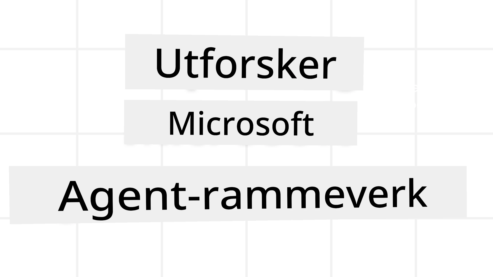
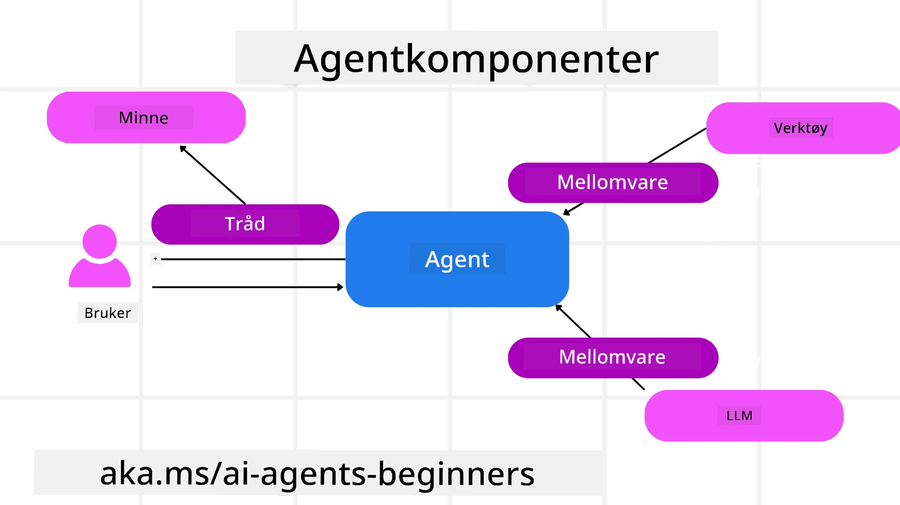

<!--
CO_OP_TRANSLATOR_METADATA:
{
  "original_hash": "19c4dab375acbc733855cc7f2f04edbc",
  "translation_date": "2025-10-02T15:44:41+00:00",
  "source_file": "14-microsoft-agent-framework/README.md",
  "language_code": "no"
}
-->
# Utforske Microsoft Agent Framework



### Introduksjon

Denne leksjonen vil dekke:

- Forstå Microsoft Agent Framework: Nøkkelfunksjoner og verdi  
- Utforske de viktigste konseptene i Microsoft Agent Framework
- Sammenligne MAF med Semantic Kernel og AutoGen: Migreringsveiledning

## Læringsmål

Etter å ha fullført denne leksjonen, vil du kunne:

- Bygge produksjonsklare AI-agenter ved hjelp av Microsoft Agent Framework
- Bruke de grunnleggende funksjonene i Microsoft Agent Framework til dine agentbaserte brukstilfeller
- Migrere og integrere eksisterende agentbaserte rammeverk og verktøy  

## Kodeeksempler 

Kodeeksempler for [Microsoft Agent Framework (MAF)](https://aka.ms/ai-agents-beginners/agent-framewrok) finnes i dette repositoriet under filene `xx-python-agent-framework` og `xx-dotnet-agent-framework`.

## Forstå Microsoft Agent Framework


[Microsoft Agent Framework (MAF)](https://aka.ms/ai-agents-beginners/agent-framewrok) bygger på erfaringene og lærdommene fra Semantic Kernel og AutoGen. Det tilbyr fleksibilitet til å håndtere et bredt spekter av agentbaserte brukstilfeller, både i produksjons- og forskningsmiljøer, inkludert:

- **Sekvensiell agentorkestrering** i scenarier der trinnvise arbeidsflyter er nødvendige.
- **Samtidig orkestrering** i scenarier der agenter må fullføre oppgaver samtidig.
- **Gruppechat-orkestrering** i scenarier der agenter kan samarbeide om én oppgave.
- **Overleveringsorkestrering** i scenarier der agenter overleverer oppgaven til hverandre etter hvert som deloppgaver fullføres.
- **Magnetisk orkestrering** i scenarier der en lederagent oppretter og endrer en oppgaveliste og koordinerer underagenter for å fullføre oppgaven.

For å levere AI-agenter i produksjon, inkluderer MAF også funksjoner for:

- **Observabilitet** gjennom bruk av OpenTelemetry, der hver handling av AI-agenten, inkludert verktøykall, orkestreringstrinn, resonnementsflyter og ytelsesovervåking, spores via Azure AI Foundry-dashbord.
- **Sikkerhet** ved å være vert for agenter direkte på Azure AI Foundry, som inkluderer sikkerhetskontroller som rollebasert tilgang, håndtering av privat data og innebygd innholdssikkerhet.
- **Holdbarhet** ettersom agenttråder og arbeidsflyter kan pause, gjenoppta og gjenopprette fra feil, noe som muliggjør lengre prosesser.
- **Kontroll** ettersom arbeidsflyter med menneskelig involvering støttes, der oppgaver merkes som krever menneskelig godkjenning.

Microsoft Agent Framework fokuserer også på å være interoperabel ved å:

- **Være sky-agnostisk** - Agenter kan kjøre i containere, lokalt og på tvers av ulike skyer.
- **Være leverandør-agnostisk** - Agenter kan opprettes gjennom din foretrukne SDK, inkludert Azure OpenAI og OpenAI.
- **Integrere åpne standarder** - Agenter kan bruke protokoller som Agent-to-Agent (A2A) og Model Context Protocol (MCP) for å oppdage og bruke andre agenter og verktøy.
- **Plugins og koblinger** - Tilkoblinger kan opprettes til data- og minnetjenester som Microsoft Fabric, SharePoint, Pinecone og Qdrant.

La oss se på hvordan disse funksjonene brukes i noen av de grunnleggende konseptene i Microsoft Agent Framework.

## Grunnleggende konsepter i Microsoft Agent Framework

### Agenter



**Opprette agenter**

Opprettelse av agenter gjøres ved å definere inferenstjenesten (LLM-leverandør), et sett med instruksjoner for AI-agenten å følge, og et tildelt `navn`:

```python
agent = AzureOpenAIChatClient(credential=AzureCliCredential()).create_agent( instructions="You are good at recommending trips to customers based on their preferences.", name="TripRecommender" )
```

Ovenstående bruker `Azure OpenAI`, men agenter kan opprettes ved hjelp av en rekke tjenester, inkludert `Azure AI Foundry Agent Service`:

```python
AzureAIAgentClient(async_credential=credential).create_agent( name="HelperAgent", instructions="You are a helpful assistant." ) as agent
```

OpenAI `Responses`, `ChatCompletion` API-er

```python
agent = OpenAIResponsesClient().create_agent( name="WeatherBot", instructions="You are a helpful weather assistant.", )
```

```python
agent = OpenAIChatClient().create_agent( name="HelpfulAssistant", instructions="You are a helpful assistant.", )
```

eller eksterne agenter ved bruk av A2A-protokollen:

```python
agent = A2AAgent( name=agent_card.name, description=agent_card.description, agent_card=agent_card, url="https://your-a2a-agent-host" )
```

**Kjøre agenter**

Agenter kjøres ved hjelp av metodene `.run` eller `.run_stream` for enten ikke-strømmende eller strømmende svar.

```python
result = await agent.run("What are good places to visit in Amsterdam?")
print(result.text)
```

```python
async for update in agent.run_stream("What are the good places to visit in Amsterdam?"):
    if update.text:
        print(update.text, end="", flush=True)

```

Hver agentkjøring kan også ha alternativer for å tilpasse parametere som `max_tokens` brukt av agenten, `tools` som agenten kan kalle, og til og med selve `modellen` som brukes av agenten.

Dette er nyttig i tilfeller der spesifikke modeller eller verktøy er nødvendige for å fullføre en brukers oppgave.

**Verktøy**

Verktøy kan defineres både når agenten opprettes:

```python
def get_attractions( location: Annotated[str, Field(description="The location to get the top tourist attractions for")], ) -> str: """Get the top tourist attractions for a given location.""" return f"The top attractions for {location} are." 


# When creating a ChatAgent directly 

agent = ChatAgent( chat_client=OpenAIChatClient(), instructions="You are a helpful assistant", tools=[get_attractions]

```

og også når agenten kjøres:

```python

result1 = await agent.run( "What's the best place to visit in Seattle?", tools=[get_attractions] # Tool provided for this run only )
```

**Agenttråder**

Agenttråder brukes til å håndtere samtaler med flere omganger. Tråder kan opprettes enten ved:

- Å bruke `get_new_thread()` som gjør det mulig å lagre tråden over tid
- Å opprette en tråd automatisk når agenten kjøres og bare ha tråden aktiv under den aktuelle kjøringen.

For å opprette en tråd ser koden slik ut:

```python
# Create a new thread. 
thread = agent.get_new_thread() # Run the agent with the thread. 
response = await agent.run("Hello, I am here to help you book travel. Where would you like to go?", thread=thread)

```

Du kan deretter serialisere tråden for å lagre den til senere bruk:

```python
# Create a new thread. 
thread = agent.get_new_thread() 

# Run the agent with the thread. 

response = await agent.run("Hello, how are you?", thread=thread) 

# Serialize the thread for storage. 

serialized_thread = await thread.serialize() 

# Deserialize the thread state after loading from storage. 

resumed_thread = await agent.deserialize_thread(serialized_thread)
```

**Agent-mellomvare**

Agenter samhandler med verktøy og LLM-er for å fullføre brukerens oppgaver. I visse scenarier ønsker vi å utføre eller spore handlinger mellom disse interaksjonene. Agent-mellomvare gjør det mulig for oss å gjøre dette gjennom:

*Funksjonsmellomvare*

Denne mellomvaren lar oss utføre en handling mellom agenten og en funksjon/verktøy som den vil kalle. Et eksempel på når dette kan brukes er når du ønsker å logge funksjonskallet.

I koden nedenfor definerer `next` om den neste mellomvaren eller den faktiske funksjonen skal kalles.

```python
async def logging_function_middleware(
    context: FunctionInvocationContext,
    next: Callable[[FunctionInvocationContext], Awaitable[None]],
) -> None:
    """Function middleware that logs function execution."""
    # Pre-processing: Log before function execution
    print(f"[Function] Calling {context.function.name}")

    # Continue to next middleware or function execution
    await next(context)

    # Post-processing: Log after function execution
    print(f"[Function] {context.function.name} completed")
```

*Chat-mellomvare*

Denne mellomvaren lar oss utføre eller logge en handling mellom agenten og forespørslene mellom LLM.

Dette inneholder viktig informasjon som `messages` som sendes til AI-tjenesten.

```python
async def logging_chat_middleware(
    context: ChatContext,
    next: Callable[[ChatContext], Awaitable[None]],
) -> None:
    """Chat middleware that logs AI interactions."""
    # Pre-processing: Log before AI call
    print(f"[Chat] Sending {len(context.messages)} messages to AI")

    # Continue to next middleware or AI service
    await next(context)

    # Post-processing: Log after AI response
    print("[Chat] AI response received")

```

**Agentminne**

Som dekket i leksjonen `Agentic Memory`, er minne et viktig element for å gjøre det mulig for agenten å operere over ulike kontekster. MAF tilbyr flere forskjellige typer minner:

*Minne i applikasjonen*

Dette er minnet som lagres i tråder under applikasjonens kjøretid.

```python
# Create a new thread. 
thread = agent.get_new_thread() # Run the agent with the thread. 
response = await agent.run("Hello, I am here to help you book travel. Where would you like to go?", thread=thread)
```

*Vedvarende meldinger*

Dette minnet brukes når samtalehistorikk lagres på tvers av ulike økter. Det defineres ved bruk av `chat_message_store_factory`:

```python
from agent_framework import ChatMessageStore

# Create a custom message store
def create_message_store():
    return ChatMessageStore()

agent = ChatAgent(
    chat_client=OpenAIChatClient(),
    instructions="You are a Travel assistant.",
    chat_message_store_factory=create_message_store
)

```

*Dynamisk minne*

Dette minnet legges til konteksten før agenter kjøres. Disse minnene kan lagres i eksterne tjenester som mem0:

```python
from agent_framework.mem0 import Mem0Provider

# Using Mem0 for advanced memory capabilities
memory_provider = Mem0Provider(
    api_key="your-mem0-api-key",
    user_id="user_123",
    application_id="my_app"
)

agent = ChatAgent(
    chat_client=OpenAIChatClient(),
    instructions="You are a helpful assistant with memory.",
    context_providers=memory_provider
)

```

**Agentobservabilitet**

Observabilitet er viktig for å bygge pålitelige og vedlikeholdbare agentbaserte systemer. MAF integreres med OpenTelemetry for å gi sporing og målinger for bedre observabilitet.

```python
from agent_framework.observability import get_tracer, get_meter

tracer = get_tracer()
meter = get_meter()
with tracer.start_as_current_span("my_custom_span"):
    # do something
    pass
counter = meter.create_counter("my_custom_counter")
counter.add(1, {"key": "value"})
```

### Arbeidsflyter

MAF tilbyr arbeidsflyter som er forhåndsdefinerte trinn for å fullføre en oppgave og inkluderer AI-agenter som komponenter i disse trinnene.

Arbeidsflyter består av ulike komponenter som gir bedre kontrollflyt. Arbeidsflyter muliggjør også **multi-agent orkestrering** og **kontrollpunkter** for å lagre arbeidsflytens tilstand.

De grunnleggende komponentene i en arbeidsflyt er:

**Utførere**

Utførere mottar innkommende meldinger, utfører sine tildelte oppgaver, og produserer deretter en utgående melding. Dette driver arbeidsflyten fremover mot å fullføre den større oppgaven. Utførere kan være enten AI-agenter eller egendefinert logikk.

**Kanter**

Kanter brukes til å definere flyten av meldinger i en arbeidsflyt. Disse kan være:

*Direkte kanter* - Enkle én-til-én-tilkoblinger mellom utførere:

```python
from agent_framework import WorkflowBuilder

builder = WorkflowBuilder()
builder.add_edge(source_executor, target_executor)
builder.set_start_executor(source_executor)
workflow = builder.build()
```

*Betingede kanter* - Aktiveres etter at en viss betingelse er oppfylt. For eksempel, når hotellrom ikke er tilgjengelige, kan en utfører foreslå andre alternativer.

*Switch-case kanter* - Ruter meldinger til forskjellige utførere basert på definerte betingelser. For eksempel, hvis en reisekunde har prioritert tilgang, vil oppgavene deres håndteres gjennom en annen arbeidsflyt.

*Fan-out kanter* - Sender én melding til flere mål.

*Fan-in kanter* - Samler flere meldinger fra forskjellige utførere og sender til ett mål.

**Hendelser**

For å gi bedre observabilitet i arbeidsflyter, tilbyr MAF innebygde hendelser for utførelse, inkludert:

- `WorkflowStartedEvent`  - Arbeidsflyten starter
- `WorkflowOutputEvent` - Arbeidsflyten produserer et utgangsresultat
- `WorkflowErrorEvent` - Arbeidsflyten støter på en feil
- `ExecutorInvokeEvent`  - Utfører starter behandling
- `ExecutorCompleteEvent`  - Utfører fullfører behandling
- `RequestInfoEvent` - En forespørsel utstedes

## Migrering fra andre rammeverk (Semantic Kernel og AutoGen)

### Forskjeller mellom MAF og Semantic Kernel

**Forenklet agentopprettelse**

Semantic Kernel krever opprettelse av en Kernel-instans for hver agent. MAF bruker en forenklet tilnærming ved å bruke utvidelser for de viktigste leverandørene.

```python
agent = AzureOpenAIChatClient(credential=AzureCliCredential()).create_agent( instructions="You are good at reccomending trips to customers based on their preferences.", name="TripRecommender" )
```

**Opprettelse av agenttråder**

Semantic Kernel krever at tråder opprettes manuelt. I MAF tildeles agenten direkte en tråd.

```python
thread = agent.get_new_thread() # Run the agent with the thread. 
```

**Registrering av verktøy**

I Semantic Kernel registreres verktøy til Kernel, og Kernel sendes deretter til agenten. I MAF registreres verktøy direkte under opprettelsen av agenten.

```python
agent = ChatAgent( chat_client=OpenAIChatClient(), instructions="You are a helpful assistant", tools=[get_attractions]
```

### Forskjeller mellom MAF og AutoGen

**Teams vs Arbeidsflyter**

`Teams` er strukturen for hendelsesdrevet aktivitet med agenter i AutoGen. MAF bruker `Workflows` som ruter data til utførere gjennom en grafbasert arkitektur.

**Opprettelse av verktøy**

AutoGen bruker `FunctionTool` for å pakke inn funksjoner som agenter kan kalle. MAF bruker @ai_function som fungerer på lignende måte, men også automatisk utleder skjemaer for hver funksjon.

**Agentadferd**

Agenter er enkeltomgangsagenter som standard i AutoGen, med mindre `max_tool_iterations` settes til noe høyere. Innen MAF er `ChatAgent` en fleromgangsagent som standard, noe som betyr at den vil fortsette å kalle verktøy til brukerens oppgave er fullført.

## Kodeeksempler 

Kodeeksempler for Microsoft Agent Framework finnes i dette repositoriet under filene `xx-python-agent-framework` og `xx-dotnet-agent-framework`.

## Har du flere spørsmål om Microsoft Agent Framework?

Bli med i [Azure AI Foundry Discord](https://aka.ms/ai-agents/discord) for å møte andre lærende, delta på kontortimer og få svar på spørsmålene dine om AI-agenter.

---

**Ansvarsfraskrivelse**:  
Dette dokumentet er oversatt ved hjelp av AI-oversettelsestjenesten [Co-op Translator](https://github.com/Azure/co-op-translator). Selv om vi streber etter nøyaktighet, vær oppmerksom på at automatiserte oversettelser kan inneholde feil eller unøyaktigheter. Det originale dokumentet på sitt opprinnelige språk bør anses som den autoritative kilden. For kritisk informasjon anbefales profesjonell menneskelig oversettelse. Vi er ikke ansvarlige for misforståelser eller feiltolkninger som oppstår ved bruk av denne oversettelsen.