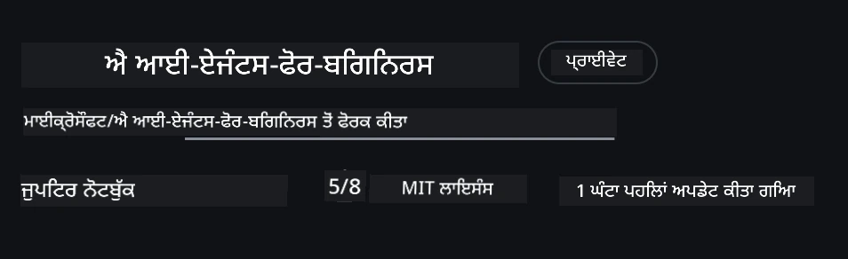
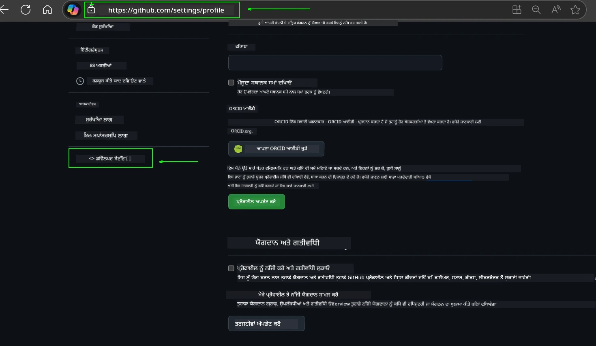
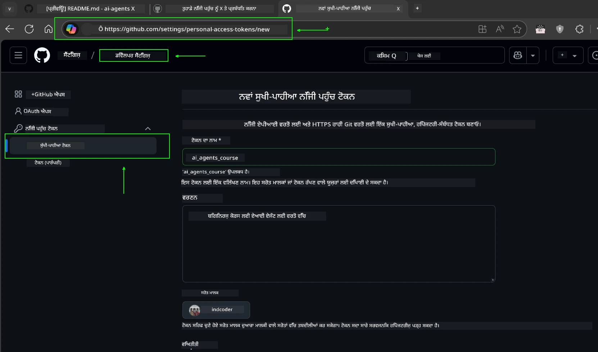
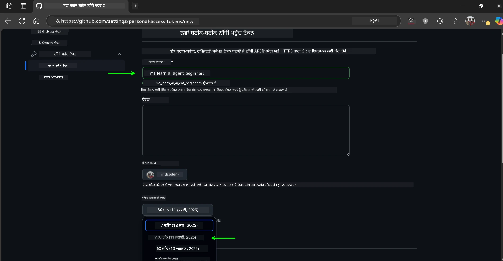
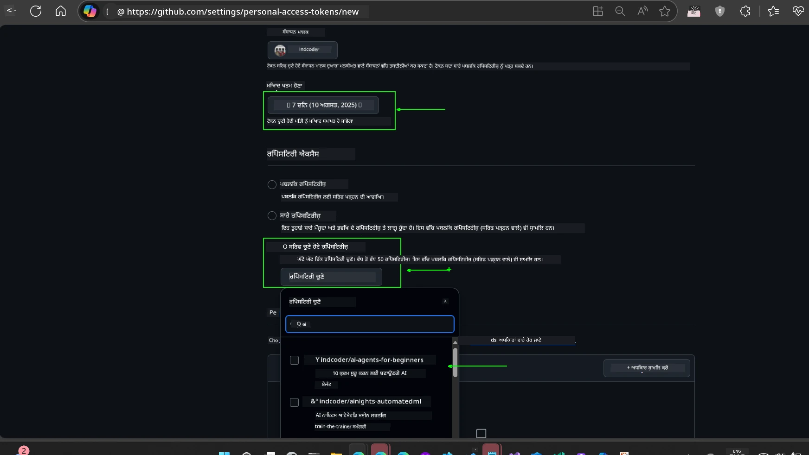
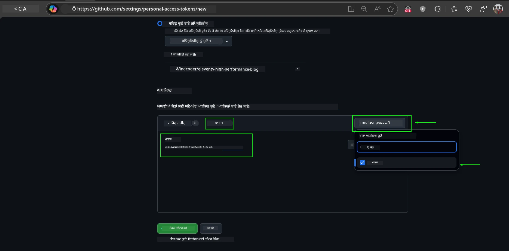
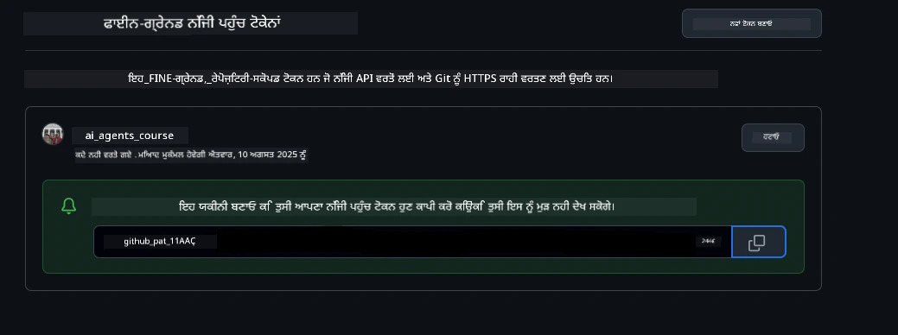
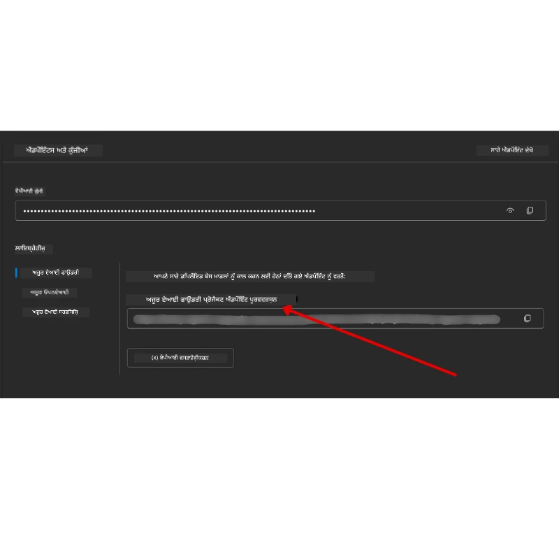

<!--
CO_OP_TRANSLATOR_METADATA:
{
  "original_hash": "63b1a8f6e840df15934935b728e569f0",
  "translation_date": "2025-12-03T14:14:57+00:00",
  "source_file": "00-course-setup/README.md",
  "language_code": "pa"
}
-->
# ਕੋਰਸ ਸੈਟਅਪ

## ਪਰਿਚਯ

ਇਸ ਪਾਠ ਵਿੱਚ ਤੁਸੀਂ ਸਿੱਖੋਗੇ ਕਿ ਇਸ ਕੋਰਸ ਦੇ ਕੋਡ ਨਮੂਨਿਆਂ ਨੂੰ ਕਿਵੇਂ ਚਲਾਇਆ ਜਾਵੇ।

## ਹੋਰ ਸਿੱਖਣ ਵਾਲਿਆਂ ਨਾਲ ਜੁੜੋ ਅਤੇ ਮਦਦ ਪ੍ਰਾਪਤ ਕਰੋ

ਆਪਣਾ ਰਿਪੋ ਕਲੋਨ ਕਰਨ ਤੋਂ ਪਹਿਲਾਂ, [AI Agents For Beginners Discord channel](https://aka.ms/ai-agents/discord) ਵਿੱਚ ਸ਼ਾਮਲ ਹੋ ਜਾਓ ਤਾਂ ਜੋ ਸੈਟਅਪ ਵਿੱਚ ਮਦਦ ਲੈ ਸਕੋ, ਕੋਰਸ ਬਾਰੇ ਕੋਈ ਵੀ ਸਵਾਲ ਪੁੱਛ ਸਕੋ, ਜਾਂ ਹੋਰ ਸਿੱਖਣ ਵਾਲਿਆਂ ਨਾਲ ਜੁੜ ਸਕੋ।

## ਇਸ ਰਿਪੋ ਨੂੰ ਕਲੋਨ ਜਾਂ ਫੋਰਕ ਕਰੋ

ਸ਼ੁਰੂ ਕਰਨ ਲਈ, ਕਿਰਪਾ ਕਰਕੇ GitHub Repository ਨੂੰ ਕਲੋਨ ਜਾਂ ਫੋਰਕ ਕਰੋ। ਇਸ ਨਾਲ ਤੁਹਾਡੇ ਕੋਲ ਕੋਰਸ ਮਟੀਰੀਅਲ ਦਾ ਆਪਣਾ ਵਰਜਨ ਹੋਵੇਗਾ ਤਾਂ ਜੋ ਤੁਸੀਂ ਕੋਡ ਨੂੰ ਚਲਾ ਸਕੋ, ਟੈਸਟ ਕਰ ਸਕੋ, ਅਤੇ ਇਸ ਵਿੱਚ ਸੋਧ ਕਰ ਸਕੋ!

ਇਹ <a href="https://github.com/microsoft/ai-agents-for-beginners/fork" target="_blank">ਰਿਪੋ ਨੂੰ ਫੋਰਕ ਕਰਨ</a> ਲਈ ਲਿੰਕ 'ਤੇ ਕਲਿੱਕ ਕਰਕੇ ਕੀਤਾ ਜਾ ਸਕਦਾ ਹੈ।

ਹੁਣ ਤੁਹਾਡੇ ਕੋਲ ਇਸ ਕੋਰਸ ਦਾ ਆਪਣਾ ਫੋਰਕ ਕੀਤਾ ਵਰਜਨ ਹੇਠਾਂ ਦਿੱਤੇ ਲਿੰਕ ਵਿੱਚ ਹੋਣਾ ਚਾਹੀਦਾ ਹੈ:



### ਸ਼ੈਲੋ ਕਲੋਨ (ਵਰਕਸ਼ਾਪ / ਕੋਡਸਪੇਸ ਲਈ ਸਿਫਾਰਸ਼ ਕੀਤੀ ਗਈ)

  >ਪੂਰਾ ਰਿਪੋਜ਼ਟਰੀ ਡਾਊਨਲੋਡ ਕਰਨ ਸਮੇਂ ਵੱਡਾ (~3 GB) ਹੋ ਸਕਦਾ ਹੈ। ਜੇ ਤੁਸੀਂ ਸਿਰਫ ਵਰਕਸ਼ਾਪ ਵਿੱਚ ਸ਼ਾਮਲ ਹੋ ਰਹੇ ਹੋ ਜਾਂ ਸਿਰਫ ਕੁਝ ਪਾਠ ਫੋਲਡਰਾਂ ਦੀ ਲੋੜ ਹੈ, ਤਾਂ ਸ਼ੈਲੋ ਕਲੋਨ (ਜਾਂ ਸਪਾਰਸ ਕਲੋਨ) ਇਤਿਹਾਸ ਨੂੰ ਛੋਟਾ ਕਰਕੇ ਅਤੇ/ਜਾਂ ਬਲੌਬਸ ਨੂੰ ਛੱਡ ਕੇ ਡਾਊਨਲੋਡ ਨੂੰ ਘਟਾਉਂਦਾ ਹੈ।

#### ਤੇਜ਼ ਸ਼ੈਲੋ ਕਲੋਨ — ਘੱਟ ਇਤਿਹਾਸ, ਸਾਰੇ ਫਾਈਲਾਂ

ਹੇਠਾਂ ਦਿੱਤੇ ਕਮਾਂਡਾਂ ਵਿੱਚ `<your-username>` ਨੂੰ ਆਪਣੇ ਫੋਰਕ URL ਨਾਲ ਬਦਲੋ (ਜਾਂ ਜੇ ਤੁਸੀਂ ਚਾਹੁੰਦੇ ਹੋ ਤਾਂ ਅੱਪਸਟ੍ਰੀਮ URL ਨਾਲ)।

ਸਿਰਫ ਤਾਜ਼ਾ ਕਮਿਟ ਇਤਿਹਾਸ ਕਲੋਨ ਕਰਨ ਲਈ (ਛੋਟਾ ਡਾਊਨਲੋਡ):

```bash|powershell
git clone --depth 1 https://github.com/<your-username>/ai-agents-for-beginners.git
```

ਇੱਕ ਵਿਸ਼ੇਸ਼ ਸ਼ਾਖਾ ਕਲੋਨ ਕਰਨ ਲਈ:

```bash|powershell
git clone --depth 1 --branch <branch-name> https://github.com/<your-username>/ai-agents-for-beginners.git
```

#### ਅੰਸ਼ਕ (ਸਪਾਰਸ) ਕਲੋਨ — ਘੱਟ ਬਲੌਬਸ + ਸਿਰਫ ਚੁਣੇ ਫੋਲਡਰ

ਇਹ ਅੰਸ਼ਕ ਕਲੋਨ ਅਤੇ ਸਪਾਰਸ-ਚੈਕਆਉਟ ਵਰਤਦਾ ਹੈ (Git 2.25+ ਦੀ ਲੋੜ ਹੈ ਅਤੇ ਅੰਸ਼ਕ ਕਲੋਨ ਸਹਾਇਤਾ ਨਾਲ ਆਧੁਨਿਕ Git ਦੀ ਸਿਫਾਰਸ਼ ਕੀਤੀ ਗਈ ਹੈ):

```bash|powershell
git clone --depth 1 --filter=blob:none --sparse https://github.com/<your-username>/ai-agents-for-beginners.git
```

ਰਿਪੋ ਫੋਲਡਰ ਵਿੱਚ ਜਾਓ:

```bash|powershell
cd ai-agents-for-beginners
```

ਫਿਰ ਇਹ ਨਿਰਧਾਰਤ ਕਰੋ ਕਿ ਤੁਹਾਨੂੰ ਕਿਹੜੇ ਫੋਲਡਰ ਚਾਹੀਦੇ ਹਨ (ਹੇਠਾਂ ਦਿੱਤੇ ਉਦਾਹਰਣ ਵਿੱਚ ਦੋ ਫੋਲਡਰ ਦਿਖਾਏ ਗਏ ਹਨ):

```bash|powershell
git sparse-checkout set 00-course-setup 01-intro-to-ai-agents
```

ਕਲੋਨ ਕਰਨ ਅਤੇ ਫਾਈਲਾਂ ਦੀ ਪੁਸ਼ਟੀ ਕਰਨ ਤੋਂ ਬਾਅਦ, ਜੇ ਤੁਹਾਨੂੰ ਸਿਰਫ ਫਾਈਲਾਂ ਦੀ ਲੋੜ ਹੈ ਅਤੇ ਜਗ੍ਹਾ ਖਾਲੀ ਕਰਨੀ ਹੈ (ਕੋਈ git ਇਤਿਹਾਸ ਨਹੀਂ), ਕਿਰਪਾ ਕਰਕੇ ਰਿਪੋਜ਼ਟਰੀ ਮੈਟਾਡੇਟਾ ਨੂੰ ਮਿਟਾ ਦਿਓ (💀ਅਣਰਿਵਰਸਿਬਲ — ਤੁਸੀਂ ਸਾਰੇ Git ਫੰਕਸ਼ਨਲਿਟੀ ਗੁਆ ਲਵੋਗੇ: ਕੋਈ ਕਮਿਟ, ਪੂਲ, ਪੁਸ਼, ਜਾਂ ਇਤਿਹਾਸ ਪਹੁੰਚ ਨਹੀਂ)।

```bash
# ਜੈਡਐਸਐਚ/ਬੈਸ਼
rm -rf .git
```

```powershell
# ਪਾਵਰਸ਼ੈਲ
Remove-Item -Recurse -Force .git
```

#### GitHub Codespaces ਵਰਤਣਾ (ਸਥਾਨਕ ਵੱਡੇ ਡਾਊਨਲੋਡ ਤੋਂ ਬਚਣ ਲਈ ਸਿਫਾਰਸ਼ ਕੀਤੀ ਗਈ)

- [GitHub UI](https://github.com/codespaces) ਰਾਹੀਂ ਇਸ ਰਿਪੋ ਲਈ ਨਵਾਂ Codespace ਬਣਾਓ।  

- ਨਵੀਂ ਬਣਾਈ ਗਈ ਕੋਡਸਪੇਸ ਦੇ ਟਰਮੀਨਲ ਵਿੱਚ, ਉਪਰੋਕਤ ਸ਼ੈਲੋ/ਸਪਾਰਸ ਕਲੋਨ ਕਮਾਂਡਾਂ ਵਿੱਚੋਂ ਇੱਕ ਚਲਾਓ ਤਾਂ ਜੋ ਸਿਰਫ ਤੁਹਾਨੂੰ ਲੋੜੀਂਦੇ ਪਾਠ ਫੋਲਡਰਾਂ ਨੂੰ ਕੋਡਸਪੇਸ ਵਰਕਸਪੇਸ ਵਿੱਚ ਲਿਆ ਸਕੋ।
- ਵਿਕਲਪਿਕ: ਕੋਡਸਪੇਸ ਵਿੱਚ ਕਲੋਨ ਕਰਨ ਤੋਂ ਬਾਅਦ, .git ਨੂੰ ਹਟਾਓ ਤਾਂ ਜੋ ਵਾਧੂ ਜਗ੍ਹਾ ਮੁੜ ਪ੍ਰਾਪਤ ਕੀਤੀ ਜਾ ਸਕੇ (ਉਪਰੋਕਤ ਹਟਾਉਣ ਕਮਾਂਡਾਂ ਵੇਖੋ)।
- ਨੋਟ: ਜੇ ਤੁਸੀਂ ਰਿਪੋ ਨੂੰ ਸਿੱਧੇ ਕੋਡਸਪੇਸ ਵਿੱਚ ਖੋਲ੍ਹਣਾ ਪਸੰਦ ਕਰਦੇ ਹੋ (ਬਿਨਾਂ ਵਾਧੂ ਕਲੋਨ), ਤਾਂ ਧਿਆਨ ਦਿਓ ਕਿ ਕੋਡਸਪੇਸ devcontainer ਵਾਤਾਵਰਣ ਬਣਾਏਗਾ ਅਤੇ ਫਿਰ ਵੀ ਤੁਹਾਨੂੰ ਲੋੜ ਤੋਂ ਵੱਧ ਪ੍ਰੋਵਿਜ਼ਨ ਕਰ ਸਕਦਾ ਹੈ। ਇੱਕ ਤਾਜ਼ਾ ਕੋਡਸਪੇਸ ਵਿੱਚ ਸ਼ੈਲੋ ਕਾਪੀ ਕਲੋਨ ਕਰਨਾ ਤੁਹਾਨੂੰ ਡਿਸਕ ਦੀ ਵਰਤੋਂ 'ਤੇ ਵਧੇਰੇ ਕੰਟਰੋਲ ਦਿੰਦਾ ਹੈ।

#### ਸੁਝਾਅ

- ਜੇ ਤੁਸੀਂ ਸੋਧ/ਕਮਿਟ ਕਰਨਾ ਚਾਹੁੰਦੇ ਹੋ ਤਾਂ ਹਮੇਸ਼ਾ ਕਲੋਨ URL ਨੂੰ ਆਪਣੇ ਫੋਰਕ ਨਾਲ ਬਦਲੋ।
- ਜੇ ਤੁਹਾਨੂੰ ਬਾਅਦ ਵਿੱਚ ਹੋਰ ਇਤਿਹਾਸ ਜਾਂ ਫਾਈਲਾਂ ਦੀ ਲੋੜ ਹੈ, ਤਾਂ ਤੁਸੀਂ ਉਹਨਾਂ ਨੂੰ ਫੈਚ ਕਰ ਸਕਦੇ ਹੋ ਜਾਂ ਸਪਾਰਸ-ਚੈਕਆਉਟ ਨੂੰ ਹੋਰ ਫੋਲਡਰ ਸ਼ਾਮਲ ਕਰਨ ਲਈ ਸਮਾਯੋਜਿਤ ਕਰ ਸਕਦੇ ਹੋ।

## ਕੋਡ ਚਲਾਉਣਾ

ਇਹ ਕੋਰਸ Jupyter Notebooks ਦੀ ਇੱਕ ਲੜੀ ਪੇਸ਼ ਕਰਦਾ ਹੈ ਜਿਸ ਨਾਲ ਤੁਸੀਂ AI Agents ਬਣਾਉਣ ਦਾ ਹੱਥ-ਅਨੁਭਵ ਪ੍ਰਾਪਤ ਕਰ ਸਕਦੇ ਹੋ।

ਕੋਡ ਨਮੂਨੇ ਹੇਠਾਂ ਦਿੱਤੇ ਵਿੱਚੋਂ ਕਿਸੇ ਇੱਕ ਦੀ ਵਰਤੋਂ ਕਰਦੇ ਹਨ:

**GitHub ਖਾਤਾ ਲੋੜੀਂਦਾ ਹੈ - ਮੁਫ਼ਤ**:

1) Semantic Kernel Agent Framework + GitHub Models Marketplace. (semantic-kernel.ipynb) ਦੇ ਤੌਰ 'ਤੇ ਲੇਬਲ ਕੀਤਾ ਗਿਆ ਹੈ।
2) AutoGen Framework + GitHub Models Marketplace. (autogen.ipynb) ਦੇ ਤੌਰ 'ਤੇ ਲੇਬਲ ਕੀਤਾ ਗਿਆ ਹੈ।

**Azure Subscription ਲੋੜੀਂਦਾ ਹੈ**:

3) Azure AI Foundry + Azure AI Agent Service. (azureaiagent.ipynb) ਦੇ ਤੌਰ 'ਤੇ ਲੇਬਲ ਕੀਤਾ ਗਿਆ ਹੈ।

ਅਸੀਂ ਤੁਹਾਨੂੰ ਤਿੰਨ ਕਿਸਮਾਂ ਦੇ ਉਦਾਹਰਣਾਂ ਨੂੰ ਅਜ਼ਮਾਉਣ ਲਈ ਪ੍ਰੇਰਿਤ ਕਰਦੇ ਹਾਂ ਤਾਂ ਜੋ ਤੁਸੀਂ ਵੇਖ ਸਕੋ ਕਿ ਤੁਹਾਡੇ ਲਈ ਕਿਹੜਾ ਵਧੀਆ ਕੰਮ ਕਰਦਾ ਹੈ।

ਤੁਹਾਡੇ ਦੁਆਰਾ ਚੁਣਿਆ ਗਿਆ ਵਿਕਲਪ ਇਹ ਨਿਰਧਾਰਤ ਕਰੇਗਾ ਕਿ ਹੇਠਾਂ ਦਿੱਤੇ ਸੈਟਅਪ ਕਦਮਾਂ ਵਿੱਚੋਂ ਕਿਹੜੇ ਦੀ ਲੋੜ ਹੈ:

## ਲੋੜਾਂ

- Python 3.12+
  - **NOTE**: ਜੇ ਤੁਹਾਡੇ ਕੋਲ Python3.12 ਇੰਸਟਾਲ ਨਹੀਂ ਹੈ, ਤਾਂ ਇਹ ਯਕੀਨੀ ਬਣਾਓ ਕਿ ਤੁਸੀਂ ਇਸਨੂੰ ਇੰਸਟਾਲ ਕਰੋ। ਫਿਰ requirements.txt ਫਾਈਲ ਤੋਂ ਸਹੀ ਵਰਜਨ ਇੰਸਟਾਲ ਕਰਨ ਲਈ python3.12 ਵਰਤ ਕੇ ਆਪਣਾ venv ਬਣਾਓ।
  
    >ਉਦਾਹਰਣ

    Python venv ਡਾਇਰੈਕਟਰੀ ਬਣਾਓ:

    ```bash|powershell
    python -m venv venv
    ```

    ਫਿਰ venv ਵਾਤਾਵਰਣ ਨੂੰ ਐਕਟੀਵੇਟ ਕਰੋ:

    ```bash
    # ਜੈਡਐਸਐਚ/ਬੈਸ਼
    source venv/bin/activate
    ```
  
    ```dos
    # Command Prompt for Windows
    venv\Scripts\activate
    ```

- .NET 10+: .NET ਵਰਤਣ ਵਾਲੇ ਨਮੂਨਾ ਕੋਡਾਂ ਲਈ, ਯਕੀਨੀ ਬਣਾਓ ਕਿ ਤੁਸੀਂ [.NET 10 SDK](https://dotnet.microsoft.com/download/dotnet/10.0) ਜਾਂ ਇਸ ਤੋਂ ਬਾਅਦ ਦਾ ਵਰਜਨ ਇੰਸਟਾਲ ਕਰੋ। ਫਿਰ, ਆਪਣੇ ਇੰਸਟਾਲ ਕੀਤੇ .NET SDK ਵਰਜਨ ਦੀ ਜਾਂਚ ਕਰੋ:

    ```bash|powershell
    dotnet --list-sdks
    ```

- GitHub ਖਾਤਾ - GitHub Models Marketplace ਤੱਕ ਪਹੁੰਚ ਲਈ
- Azure Subscription - Azure AI Foundry ਤੱਕ ਪਹੁੰਚ ਲਈ
- Azure AI Foundry ਖਾਤਾ - Azure AI Agent Service ਤੱਕ ਪਹੁੰਚ ਲਈ

ਅਸੀਂ ਇਸ ਰਿਪੋਜ਼ਟਰੀ ਦੇ ਰੂਟ ਵਿੱਚ ਇੱਕ `requirements.txt` ਫਾਈਲ ਸ਼ਾਮਲ ਕੀਤੀ ਹੈ ਜਿਸ ਵਿੱਚ ਸਾਰੇ ਲੋੜੀਂਦੇ Python ਪੈਕੇਜ ਹਨ ਜੋ ਕੋਡ ਨਮੂਨਿਆਂ ਨੂੰ ਚਲਾਉਣ ਲਈ ਲੋੜੀਂਦੇ ਹਨ।

ਤੁਸੀਂ ਇਸਨੂੰ ਹੇਠਾਂ ਦਿੱਤੇ ਕਮਾਂਡ ਨੂੰ ਆਪਣੇ ਟਰਮੀਨਲ ਵਿੱਚ ਰਿਪੋਜ਼ਟਰੀ ਦੇ ਰੂਟ 'ਤੇ ਚਲਾਕੇ ਇੰਸਟਾਲ ਕਰ ਸਕਦੇ ਹੋ:

```bash|powershell
pip install -r requirements.txt
```

ਅਸੀਂ ਕਿਸੇ ਵੀ ਟਕਰਾਅ ਅਤੇ ਸਮੱਸਿਆਵਾਂ ਤੋਂ ਬਚਣ ਲਈ Python ਵਰਚੁਅਲ ਵਾਤਾਵਰਣ ਬਣਾਉਣ ਦੀ ਸਿਫਾਰਸ਼ ਕਰਦੇ ਹਾਂ।

## VSCode ਸੈਟਅਪ ਕਰੋ

ਯਕੀਨੀ ਬਣਾਓ ਕਿ ਤੁਸੀਂ VSCode ਵਿੱਚ Python ਦਾ ਸਹੀ ਵਰਜਨ ਵਰਤ ਰਹੇ ਹੋ।


## GitHub Models ਵਰਤਣ ਵਾਲੇ ਨਮੂਨਿਆਂ ਲਈ ਸੈਟਅਪ

### ਕਦਮ 1: ਆਪਣਾ GitHub Personal Access Token (PAT) ਪ੍ਰਾਪਤ ਕਰੋ

ਇਹ ਕੋਰਸ GitHub Models Marketplace ਦੀ ਵਰਤੋਂ ਕਰਦਾ ਹੈ, ਜੋ ਤੁਹਾਨੂੰ ਵੱਡੇ ਭਾਸ਼ਾ ਮਾਡਲ (LLMs) ਤੱਕ ਮੁਫ਼ਤ ਪਹੁੰਚ ਪ੍ਰਦਾਨ ਕਰਦਾ ਹੈ ਜੋ ਤੁਸੀਂ AI Agents ਬਣਾਉਣ ਲਈ ਵਰਤੋਂ ਕਰੋਗੇ।

GitHub Models ਦੀ ਵਰਤੋਂ ਕਰਨ ਲਈ, ਤੁਹਾਨੂੰ [GitHub Personal Access Token](https://docs.github.com/en/authentication/keeping-your-account-and-data-secure/managing-your-personal-access-tokens) ਬਣਾਉਣ ਦੀ ਲੋੜ ਹੋਵੇਗੀ।

ਇਹ ਤੁਹਾਡੇ GitHub ਖਾਤੇ ਵਿੱਚ <a href="https://github.com/settings/personal-access-tokens" target="_blank">Personal Access Tokens settings</a> 'ਤੇ ਜਾ ਕੇ ਕੀਤਾ ਜਾ ਸਕਦਾ ਹੈ।

ਕਿਰਪਾ ਕਰਕੇ [Principle of Least Privilege](https://docs.github.com/en/get-started/learning-to-code/storing-your-secrets-safely) ਦੀ ਪਾਲਣਾ ਕਰੋ ਜਦੋਂ ਤੁਸੀਂ ਆਪਣਾ ਟੋਕਨ ਬਣਾਉਂਦੇ ਹੋ। ਇਸਦਾ ਮਤਲਬ ਹੈ ਕਿ ਤੁਹਾਨੂੰ ਟੋਕਨ ਨੂੰ ਸਿਰਫ ਉਹ ਅਧਿਕਾਰ ਦੇਣੇ ਚਾਹੀਦੇ ਹਨ ਜੋ ਇਸ ਕੋਰਸ ਵਿੱਚ ਕੋਡ ਨਮੂਨਿਆਂ ਨੂੰ ਚਲਾਉਣ ਲਈ ਲੋੜੀਂਦੇ ਹਨ।

1. **Developer settings** ਵਿੱਚ ਜਾ ਕੇ `Fine-grained tokens` ਵਿਕਲਪ ਚੁਣੋ।

   

   ਫਿਰ `Generate new token` ਚੁਣੋ।

   

2. ਆਪਣੇ ਟੋਕਨ ਲਈ ਇੱਕ ਵਰਣਨਾਤਮਕ ਨਾਮ ਦਿਓ ਜੋ ਇਸਦੇ ਉਦੇਸ਼ ਨੂੰ ਦਰਸਾਉਂਦਾ ਹੋਵੇ, ਇਸਨੂੰ ਬਾਅਦ ਵਿੱਚ ਪਛਾਣਨਾ ਆਸਾਨ ਬਣਾਉਂਦਾ ਹੈ।

    🔐 ਟੋਕਨ ਦੀ ਮਿਆਦ ਦੀ ਸਿਫਾਰਸ਼

    ਸਿਫਾਰਸ਼ ਕੀਤੀ ਮਿਆਦ: 30 ਦਿਨ
    ਜ਼ਿਆਦਾ ਸੁਰੱਖਿਅਤ ਰਵੱਈਏ ਲਈ, ਤੁਸੀਂ ਛੋਟੀ ਮਿਆਦ—ਜਿਵੇਂ 7 ਦਿਨ 🛡️ ਚੁਣ ਸਕਦੇ ਹੋ।
    ਇਹ ਇੱਕ ਸ਼ਾਨਦਾਰ ਤਰੀਕਾ ਹੈ ਕਿ ਆਪਣਾ ਨਿੱਜੀ ਟੀਚਾ ਸੈਟ ਕਰੋ ਅਤੇ ਕੋਰਸ ਪੂਰਾ ਕਰੋ ਜਦੋਂ ਤੁਹਾਡਾ ਸਿੱਖਣ ਦਾ ਜ਼ੋਰ ਉੱਚਾ ਹੋਵੇ 🚀।

    

3. ਟੋਕਨ ਦੀ ਸਕੋਪ ਨੂੰ ਇਸ ਰਿਪੋਜ਼ਟਰੀ ਦੇ ਫੋਰਕ ਤੱਕ ਸੀਮਿਤ ਕਰੋ।

    

4. ਟੋਕਨ ਦੇ ਅਧਿਕਾਰਾਂ ਨੂੰ ਸੀਮਿਤ ਕਰੋ: **Permissions** ਦੇ ਅਧੀਨ, **Account** ਟੈਬ 'ਤੇ ਕਲਿੱਕ ਕਰੋ, ਅਤੇ "+ Add permissions" ਬਟਨ 'ਤੇ ਕਲਿੱਕ ਕਰੋ। ਇੱਕ ਡ੍ਰਾਪਡਾਊਨ ਪ੍ਰਗਟ ਹੋਵੇਗਾ। ਕਿਰਪਾ ਕਰਕੇ **Models** ਦੀ ਖੋਜ ਕਰੋ ਅਤੇ ਇਸਦੇ ਲਈ ਬਾਕਸ ਚੈੱਕ ਕਰੋ।

    

5. ਟੋਕਨ ਬਣਾਉਣ ਤੋਂ ਪਹਿਲਾਂ ਲੋੜੀਂਦੇ ਅਧਿਕਾਰਾਂ ਦੀ ਪੁਸ਼ਟੀ ਕਰੋ। 

6. ਟੋਕਨ ਬਣਾਉਣ ਤੋਂ ਪਹਿਲਾਂ, ਯਕੀਨੀ ਬਣਾਓ ਕਿ ਤੁਸੀਂ ਟੋਕਨ ਨੂੰ ਸੁਰੱਖਿਅਤ ਜਗ੍ਹਾ ਜਿਵੇਂ ਕਿ ਪਾਸਵਰਡ ਮੈਨੇਜਰ ਵਾਲਟ ਵਿੱਚ ਸਟੋਰ ਕਰਨ ਲਈ ਤਿਆਰ ਹੋ, ਕਿਉਂਕਿ ਇਹ ਤੁਹਾਨੂੰ ਦੁਬਾਰਾ ਨਹੀਂ ਦਿਖਾਇਆ ਜਾਵੇਗਾ। 

ਆਪਣੇ ਨਵੇਂ ਬਣਾਏ ਟੋਕਨ ਨੂੰ ਕਾਪੀ ਕਰੋ। ਹੁਣ ਤੁਸੀਂ ਇਸਨੂੰ ਇਸ ਕੋਰਸ ਵਿੱਚ ਸ਼ਾਮਲ `.env` ਫਾਈਲ ਵਿੱਚ ਸ਼ਾਮਲ ਕਰੋਗੇ।

### ਕਦਮ 2: ਆਪਣੀ `.env` ਫਾਈਲ ਬਣਾਓ

ਆਪਣੀ `.env` ਫਾਈਲ ਬਣਾਉਣ ਲਈ ਆਪਣੇ ਟਰਮੀਨਲ ਵਿੱਚ ਹੇਠਾਂ ਦਿੱਤਾ ਕਮਾਂਡ ਚਲਾਓ।

```bash
# ਜੈਡਐਸਐਚ/ਬੈਸ਼
cp .env.example .env
```

```powershell
# ਪਾਵਰਸ਼ੈਲ
Copy-Item .env.example .env
```

ਇਹ ਉਦਾਹਰਣ ਫਾਈਲ ਨੂੰ ਕਾਪੀ ਕਰੇਗਾ ਅਤੇ `.env` ਤੁਹਾਡੇ ਡਾਇਰੈਕਟਰੀ ਵਿੱਚ ਬਣਾਏਗਾ ਜਿੱਥੇ ਤੁਸੀਂ ਵਾਤਾਵਰਣ ਚਰਾਂ ਦੀਆਂ ਮੁੱਲਾਂ ਭਰਦੇ ਹੋ।

ਆਪਣੇ ਟੋਕਨ ਨੂੰ ਕਾਪੀ ਕਰਕੇ, `.env` ਫਾਈਲ ਨੂੰ ਆਪਣੇ ਮਨਪਸੰਦ ਟੈਕਸਟ ਐਡੀਟਰ ਵਿੱਚ ਖੋਲ੍ਹੋ ਅਤੇ ਆਪਣੇ ਟੋਕਨ ਨੂੰ `GITHUB_TOKEN` ਫੀਲਡ ਵਿੱਚ ਪੇਸਟ ਕਰੋ।


ਹੁਣ ਤੁਸੀਂ ਇਸ ਕੋਰਸ ਦੇ ਕੋਡ ਨਮੂਨਿਆਂ ਨੂੰ ਚਲਾ ਸਕਦੇ ਹੋ।

## Azure AI Foundry ਅਤੇ Azure AI Agent Service ਵਰਤਣ ਵਾਲੇ ਨਮੂਨਿਆਂ ਲਈ ਸੈਟਅਪ

### ਕਦਮ 1: ਆਪਣਾ Azure ਪ੍ਰੋਜੈਕਟ ਐਂਡਪੌਇੰਟ ਪ੍ਰਾਪਤ ਕਰੋ

Azure AI Foundry ਵਿੱਚ ਹੱਬ ਅਤੇ ਪ੍ਰੋਜੈਕਟ ਬਣਾਉਣ ਦੇ ਕਦਮਾਂ ਦੀ ਪਾਲਣਾ ਕਰੋ: [Hub resources overview](https://learn.microsoft.com/azure/ai-foundry/concepts/ai-resources)

ਜਦੋਂ ਤੁਸੀਂ ਆਪਣਾ ਪ੍ਰੋਜੈਕਟ ਬਣਾਉਂਦੇ ਹੋ, ਤੁਹਾਨੂੰ ਆਪਣੇ ਪ੍ਰੋਜੈਕਟ ਲਈ ਕਨੈਕਸ਼ਨ ਸਟ੍ਰਿੰਗ ਪ੍ਰਾਪਤ ਕਰਨ ਦੀ ਲੋੜ ਹੋਵੇਗੀ।

ਇਹ Azure AI Foundry ਪੋਰਟਲ ਵਿੱਚ ਆਪਣੇ ਪ੍ਰੋਜੈਕਟ ਦੇ **Overview** ਪੇਜ 'ਤੇ ਜਾ ਕੇ ਕੀਤਾ ਜਾ ਸਕਦਾ ਹੈ।



### ਕਦਮ 2: ਆਪਣੀ `.env` ਫਾਈਲ ਬਣਾਓ

ਆਪਣੀ `.env` ਫਾਈਲ ਬਣਾਉਣ ਲਈ ਆਪਣੇ ਟਰਮੀਨਲ ਵਿੱਚ ਹੇਠਾਂ ਦਿੱਤਾ ਕਮਾਂਡ ਚਲਾਓ।

```bash
# ਜੈਡਐਸਐਚ/ਬੈਸ਼
cp .env.example .env
```

```powershell
# ਪਾਵਰਸ਼ੈਲ
Copy-Item .env.example .env
```

ਇਹ ਉਦਾਹਰਣ ਫਾਈਲ ਨੂੰ ਕਾਪੀ ਕਰੇਗਾ ਅਤੇ `.env` ਤੁਹਾਡੇ ਡਾਇਰੈਕਟਰੀ ਵਿੱਚ ਬਣਾਏਗਾ ਜਿੱਥੇ ਤੁਸੀਂ ਵਾਤਾਵਰਣ ਚਰਾਂ ਦੀਆਂ ਮੁੱਲਾਂ ਭਰਦੇ ਹੋ।

ਆਪਣੇ ਟੋਕਨ ਨੂੰ ਕਾਪੀ ਕਰਕੇ, `.env` ਫਾਈਲ ਨੂੰ ਆਪਣੇ ਮਨਪਸੰਦ ਟੈਕਸਟ ਐਡੀਟਰ ਵਿੱਚ ਖੋਲ੍ਹੋ ਅਤੇ ਆਪਣੇ ਟੋਕਨ ਨੂੰ `PROJECT_ENDPOINT` ਫੀਲਡ ਵਿੱਚ ਪੇਸਟ ਕਰੋ।

### ਕਦਮ 3: Azure ਵਿੱਚ ਸਾਈਨ ਇਨ ਕਰੋ

ਸੁਰੱਖਿਆ ਦੇ ਸ੍ਰੇਸ਼ਠ ਅਭਿਆਸ ਦੇ ਤੌਰ 'ਤੇ, ਅਸੀਂ [keyless authentication](https://learn.microsoft.com/azure/developer/ai/keyless-connections?tabs=csharp%2Cazure-cli?WT.mc_id=academic-105485-koreyst) ਦੀ ਵਰਤੋਂ ਕਰਕੇ Microsoft Entra ID ਨਾਲ Azure OpenAI ਵਿੱਚ ਪ੍ਰਮਾਣਿਕਤਾ ਪ੍ਰਾਪਤ ਕਰਾਂਗੇ। 

ਅਗਲੇ ਕਦਮ ਵਿੱਚ, ਟਰਮੀਨਲ ਖੋਲ੍ਹੋ ਅਤੇ `az login --use-device-code` ਚਲਾਓ ਤਾਂ ਜੋ ਆਪਣੇ Azure ਖ
ਜੇ ਤੁਹਾਨੂੰ ਇਸ ਸੈਟਅੱਪ ਨੂੰ ਚਲਾਉਣ ਵਿੱਚ ਕੋਈ ਸਮੱਸਿਆ ਆਉਂਦੀ ਹੈ, ਤਾਂ ਸਾਡੇ <a href="https://discord.gg/kzRShWzttr" target="_blank">Azure AI Community Discord</a> ਵਿੱਚ ਸ਼ਾਮਲ ਹੋਵੋ ਜਾਂ <a href="https://github.com/microsoft/ai-agents-for-beginners/issues?WT.mc_id=academic-105485-koreyst" target="_blank">ਇੱਕ ਸਮੱਸਿਆ ਬਣਾਓ</a>।

## ਅਗਲਾ ਪਾਠ

ਹੁਣ ਤੁਸੀਂ ਇਸ ਕੋਰਸ ਲਈ ਕੋਡ ਚਲਾਉਣ ਲਈ ਤਿਆਰ ਹੋ। AI ਏਜੰਟਸ ਦੀ ਦੁਨੀਆ ਬਾਰੇ ਹੋਰ ਸਿੱਖਣ ਦਾ ਆਨੰਦ ਲਓ! 

[AI ਏਜੰਟਸ ਅਤੇ ਏਜੰਟ ਵਰਤੋਂ ਦੇ ਕੇਸਾਂ ਦਾ ਪਰਿਚਯ](../01-intro-to-ai-agents/README.md)

---

<!-- CO-OP TRANSLATOR DISCLAIMER START -->
**ਅਸਵੀਕਰਤੀ**:  
ਇਹ ਦਸਤਾਵੇਜ਼ AI ਅਨੁਵਾਦ ਸੇਵਾ [Co-op Translator](https://github.com/Azure/co-op-translator) ਦੀ ਵਰਤੋਂ ਕਰਕੇ ਅਨੁਵਾਦ ਕੀਤਾ ਗਿਆ ਹੈ। ਜਦੋਂ ਕਿ ਅਸੀਂ ਸਹੀ ਹੋਣ ਦਾ ਯਤਨ ਕਰਦੇ ਹਾਂ, ਕਿਰਪਾ ਕਰਕੇ ਧਿਆਨ ਦਿਓ ਕਿ ਸਵੈਚਾਲਿਤ ਅਨੁਵਾਦਾਂ ਵਿੱਚ ਗਲਤੀਆਂ ਜਾਂ ਅਸੁਚੱਜੇਪਣ ਹੋ ਸਕਦੇ ਹਨ। ਇਸ ਦੀ ਮੂਲ ਭਾਸ਼ਾ ਵਿੱਚ ਮੌਜੂਦ ਮੂਲ ਦਸਤਾਵੇਜ਼ ਨੂੰ ਅਧਿਕਾਰਤ ਸਰੋਤ ਮੰਨਿਆ ਜਾਣਾ ਚਾਹੀਦਾ ਹੈ। ਮਹੱਤਵਪੂਰਨ ਜਾਣਕਾਰੀ ਲਈ, ਪੇਸ਼ੇਵਰ ਮਨੁੱਖੀ ਅਨੁਵਾਦ ਦੀ ਸਿਫਾਰਸ਼ ਕੀਤੀ ਜਾਂਦੀ ਹੈ। ਅਸੀਂ ਇਸ ਅਨੁਵਾਦ ਦੀ ਵਰਤੋਂ ਤੋਂ ਪੈਦਾ ਹੋਣ ਵਾਲੇ ਕਿਸੇ ਵੀ ਗਲਤਫਹਿਮੀ ਜਾਂ ਗਲਤ ਵਿਆਖਿਆ ਲਈ ਜ਼ਿੰਮੇਵਾਰ ਨਹੀਂ ਹਾਂ।
<!-- CO-OP TRANSLATOR DISCLAIMER END -->