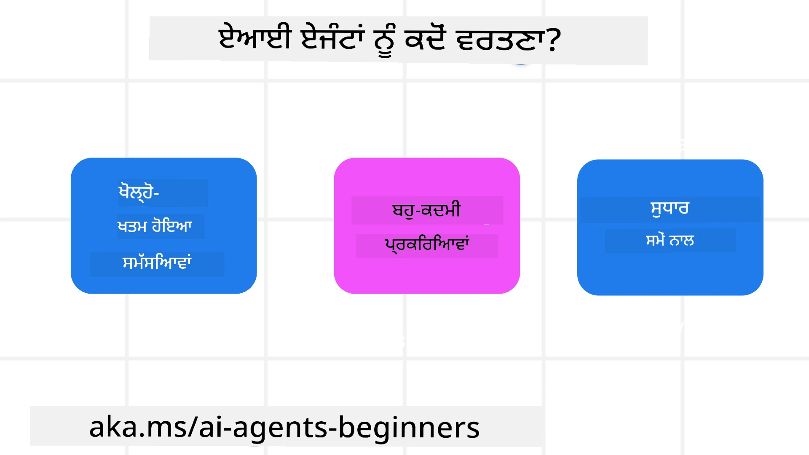

<!--
CO_OP_TRANSLATOR_METADATA:
{
  "original_hash": "cdd28bc00816d2773bb2b5968d782abc",
  "translation_date": "2025-11-11T11:08:16+00:00",
  "source_file": "01-intro-to-ai-agents/README.md",
  "language_code": "pa"
}
-->

> _(ਉਪਰ ਦਿੱਤੀ ਤਸਵੀਰ 'ਤੇ ਕਲਿੱਕ ਕਰਕੇ ਇਸ ਪਾਠ ਦਾ ਵੀਡੀਓ ਵੇਖੋ)_

# AI ਏਜੰਟਸ ਅਤੇ ਏਜੰਟ ਵਰਤੋਂ ਦੇ ਕੇਸਾਂ ਦਾ ਪਰਿਚਯ

"AI Agents for Beginners" ਕੋਰਸ ਵਿੱਚ ਤੁਹਾਡਾ ਸਵਾਗਤ ਹੈ! ਇਹ ਕੋਰਸ AI ਏਜੰਟਸ ਬਣਾਉਣ ਲਈ ਮੂਲ ਜਾਣਕਾਰੀ ਅਤੇ ਲਾਗੂ ਨਮੂਨੇ ਪ੍ਰਦਾਨ ਕਰਦਾ ਹੈ।

ਹੋਰ ਸਿੱਖਣ ਵਾਲਿਆਂ ਅਤੇ AI ਏਜੰਟ ਬਣਾਉਣ ਵਾਲਿਆਂ ਨਾਲ ਮਿਲਣ ਅਤੇ ਇਸ ਕੋਰਸ ਬਾਰੇ ਆਪਣੇ ਸਵਾਲ ਪੁੱਛਣ ਲਈ <a href="https://discord.gg/kzRShWzttr" target="_blank">Azure AI Discord Community</a> ਵਿੱਚ ਸ਼ਾਮਲ ਹੋਵੋ।

ਇਸ ਕੋਰਸ ਦੀ ਸ਼ੁਰੂਆਤ ਕਰਨ ਲਈ, ਅਸੀਂ ਪਹਿਲਾਂ ਇਹ ਸਮਝਣ ਦੀ ਕੋਸ਼ਿਸ਼ ਕਰਦੇ ਹਾਂ ਕਿ AI ਏਜੰਟਸ ਕੀ ਹਨ ਅਤੇ ਅਸੀਂ ਉਨ੍ਹਾਂ ਨੂੰ ਆਪਣੇ ਐਪਲੀਕੇਸ਼ਨ ਅਤੇ ਵਰਕਫਲੋਜ਼ ਵਿੱਚ ਕਿਵੇਂ ਵਰਤ ਸਕਦੇ ਹਾਂ।

## ਪਰਿਚਯ

ਇਸ ਪਾਠ ਵਿੱਚ ਇਹ ਸ਼ਾਮਲ ਹੈ:

- AI ਏਜੰਟਸ ਕੀ ਹਨ ਅਤੇ ਕਿਹੜੇ ਵੱਖ-ਵੱਖ ਕਿਸਮ ਦੇ ਏਜੰਟ ਹਨ?
- ਕਿਹੜੇ ਵਰਤੋਂ ਦੇ ਕੇਸ AI ਏਜੰਟਸ ਲਈ ਸਭ ਤੋਂ ਵਧੀਆ ਹਨ ਅਤੇ ਉਹ ਸਾਨੂੰ ਕਿਵੇਂ ਮਦਦ ਕਰ ਸਕਦੇ ਹਨ?
- ਏਜੰਟਿਕ ਹੱਲਾਂ ਨੂੰ ਡਿਜ਼ਾਈਨ ਕਰਨ ਵੇਲੇ ਕੁਝ ਮੂਲ ਬਿਲਡਿੰਗ ਬਲਾਕ ਕੀ ਹਨ?

## ਸਿੱਖਣ ਦੇ ਲਕਸ਼

ਇਸ ਪਾਠ ਨੂੰ ਪੂਰਾ ਕਰਨ ਤੋਂ ਬਾਅਦ, ਤੁਸੀਂ ਇਹ ਕਰਨ ਦੇ ਯੋਗ ਹੋਵੋਗੇ:

- AI ਏਜੰਟ ਦੇ ਸੰਕਲਪਾਂ ਨੂੰ ਸਮਝੋ ਅਤੇ ਉਹ ਹੋਰ AI ਹੱਲਾਂ ਤੋਂ ਕਿਵੇਂ ਵੱਖਰੇ ਹਨ।
- AI ਏਜੰਟਸ ਨੂੰ ਸਭ ਤੋਂ ਪ੍ਰਭਾਵਸ਼ਾਲੀ ਢੰਗ ਨਾਲ ਲਾਗੂ ਕਰੋ।
- ਯੂਜ਼ਰ ਅਤੇ ਗਾਹਕਾਂ ਲਈ ਉਤਪਾਦਕ ਢੰਗ ਨਾਲ ਏਜੰਟਿਕ ਹੱਲਾਂ ਡਿਜ਼ਾਈਨ ਕਰੋ।

## AI ਏਜੰਟਸ ਦੀ ਪਰਿਭਾਸ਼ਾ ਅਤੇ ਕਿਸਮਾਂ

### AI ਏਜੰਟਸ ਕੀ ਹਨ?

AI ਏਜੰਟਸ **ਸਿਸਟਮ** ਹਨ ਜੋ **ਵੱਡੇ ਭਾਸ਼ਾ ਮਾਡਲ (LLMs)** ਨੂੰ **ਕਰਮ ਕਰਨ** ਦੀ ਯੋਗਤਾ ਦਿੰਦੇ ਹਨ। ਇਹ LLMs ਨੂੰ **ਟੂਲਸ** ਅਤੇ **ਗਿਆਨ** ਤੱਕ ਪਹੁੰਚ ਦੇ ਕੇ ਉਨ੍ਹਾਂ ਦੀ ਯੋਗਤਾ ਨੂੰ ਵਧਾਉਂਦੇ ਹਨ।

ਆਓ ਇਸ ਪਰਿਭਾਸ਼ਾ ਨੂੰ ਛੋਟੇ ਹਿੱਸਿਆਂ ਵਿੱਚ ਵੰਡ ਕੇ ਸਮਝੀਏ:

- **ਸਿਸਟਮ** - ਏਜੰਟਸ ਨੂੰ ਸਿਰਫ ਇੱਕ ਇਕੱਲੇ ਕੰਪੋਨੈਂਟ ਵਜੋਂ ਨਹੀਂ, ਬਲਕਿ ਕਈ ਕੰਪੋਨੈਂਟਸ ਦੇ ਸਿਸਟਮ ਵਜੋਂ ਸੋਚਣਾ ਮਹੱਤਵਪੂਰਨ ਹੈ। AI ਏਜੰਟ ਦੇ ਮੂਲ ਪੱਧਰ ਦੇ ਕੰਪੋਨੈਂਟ ਹਨ:
  - **Environment** - ਉਹ ਪਰਿਬਲਿਤ ਸਥਾਨ ਜਿੱਥੇ AI ਏਜੰਟ ਕੰਮ ਕਰ ਰਿਹਾ ਹੈ। ਉਦਾਹਰਣ ਲਈ, ਜੇਕਰ ਸਾਡੇ ਕੋਲ ਇੱਕ ਯਾਤਰਾ ਬੁਕਿੰਗ AI ਏਜੰਟ ਹੈ, ਤਾਂ environment ਯਾਤਰਾ ਬੁਕਿੰਗ ਸਿਸਟਮ ਹੋ ਸਕਦਾ ਹੈ ਜੋ AI ਏਜੰਟ ਕੰਮ ਪੂਰਾ ਕਰਨ ਲਈ ਵਰਤਦਾ ਹੈ।
  - **Sensors** - Environment ਵਿੱਚ ਜਾਣਕਾਰੀ ਹੁੰਦੀ ਹੈ ਅਤੇ ਫੀਡਬੈਕ ਪ੍ਰਦਾਨ ਕਰਦਾ ਹੈ। AI ਏਜੰਟਸ ਸੈਂਸਰਾਂ ਦੀ ਵਰਤੋਂ ਕਰਕੇ environment ਦੀ ਮੌਜੂਦਾ ਸਥਿਤੀ ਬਾਰੇ ਜਾਣਕਾਰੀ ਇਕੱਠੀ ਅਤੇ ਵਿਆਖਿਆ ਕਰਦੇ ਹਨ। ਯਾਤਰਾ ਬੁਕਿੰਗ ਏਜੰਟ ਦੇ ਉਦਾਹਰਣ ਵਿੱਚ, ਯਾਤਰਾ ਬੁਕਿੰਗ ਸਿਸਟਮ ਹੋਟਲ ਦੀ ਉਪਲਬਧਤਾ ਜਾਂ ਉਡਾਨਾਂ ਦੀ ਕੀਮਤਾਂ ਵਰਗੀਆਂ ਜਾਣਕਾਰੀਆਂ ਪ੍ਰਦਾਨ ਕਰ ਸਕਦਾ ਹੈ।
  - **Actuators** - ਜਦੋਂ AI ਏਜੰਟ environment ਦੀ ਮੌਜੂਦਾ ਸਥਿਤੀ ਪ੍ਰਾਪਤ ਕਰਦਾ ਹੈ, ਤਾਂ ਮੌਜੂਦਾ ਕੰਮ ਲਈ ਏਜੰਟ ਇਹ ਨਿਰਧਾਰਤ ਕਰਦਾ ਹੈ ਕਿ environment ਨੂੰ ਬਦਲਣ ਲਈ ਕਿਹੜਾ ਕਰਮ ਕਰਨਾ ਹੈ। ਯਾਤਰਾ ਬੁਕਿੰਗ ਏਜੰਟ ਲਈ, ਇਹ ਯੂਜ਼ਰ ਲਈ ਉਪਲਬਧ ਕਮਰੇ ਨੂੰ ਬੁਕ ਕਰਨਾ ਹੋ ਸਕਦਾ ਹੈ।

**ਵੱਡੇ ਭਾਸ਼ਾ ਮਾਡਲ** - ਏਜੰਟਸ ਦਾ ਸੰਕਲਪ LLMs ਦੇ ਬਣਨ ਤੋਂ ਪਹਿਲਾਂ ਮੌਜੂਦ ਸੀ। LLMs ਨਾਲ AI ਏਜੰਟਸ ਬਣਾਉਣ ਦਾ ਫਾਇਦਾ ਇਹ ਹੈ ਕਿ ਉਹ ਮਨੁੱਖੀ ਭਾਸ਼ਾ ਅਤੇ ਡਾਟਾ ਦੀ ਵਿਆਖਿਆ ਕਰਨ ਦੀ ਯੋਗਤਾ ਰੱਖਦੇ ਹਨ। ਇਹ ਯੋਗਤਾ LLMs ਨੂੰ environment ਦੀ ਜਾਣਕਾਰੀ ਦੀ ਵਿਆਖਿਆ ਕਰਨ ਅਤੇ environment ਨੂੰ ਬਦਲਣ ਲਈ ਯੋਜਨਾ ਬਣਾਉਣ ਯੋਗ ਬਣਾਉਂਦੀ ਹੈ।

**ਕਰਮ ਕਰਨ** - AI ਏਜੰਟ ਸਿਸਟਮਾਂ ਤੋਂ ਬਾਹਰ, LLMs ਉਹਨਾਂ ਸਥਿਤੀਆਂ ਤੱਕ ਸੀਮਿਤ ਹਨ ਜਿੱਥੇ ਕਰਮ ਯੂਜ਼ਰ ਦੇ ਪ੍ਰੋਮਪਟ ਦੇ ਆਧਾਰ 'ਤੇ ਸਮੱਗਰੀ ਜਾਂ ਜਾਣਕਾਰੀ ਪੈਦਾ ਕਰਨਾ ਹੈ। AI ਏਜੰਟ ਸਿਸਟਮਾਂ ਦੇ ਅੰਦਰ, LLMs ਯੂਜ਼ਰ ਦੀ ਬੇਨਤੀ ਦੀ ਵਿਆਖਿਆ ਕਰਕੇ ਅਤੇ environment ਵਿੱਚ ਉਪਲਬਧ ਟੂਲਸ ਦੀ ਵਰਤੋਂ ਕਰਕੇ ਕੰਮ ਪੂਰੇ ਕਰ ਸਕਦੇ ਹਨ।

**ਟੂਲਸ ਤੱਕ ਪਹੁੰਚ** - LLMs ਨੂੰ ਕਿਹੜੇ ਟੂਲਸ ਤੱਕ ਪਹੁੰਚ ਹੈ, ਇਹ 1) ਉਹ environment ਜਿੱਥੇ ਇਹ ਕੰਮ ਕਰ ਰਿਹਾ ਹੈ ਅਤੇ 2) AI ਏਜੰਟ ਦੇ ਡਿਵੈਲਪਰ ਦੁਆਰਾ ਨਿਰਧਾਰਤ ਹੁੰਦਾ ਹੈ। ਸਾਡੇ ਯਾਤਰਾ ਏਜੰਟ ਦੇ ਉਦਾਹਰਣ ਵਿੱਚ, ਏਜੰਟ ਦੇ ਟੂਲਸ ਯਾਤਰਾ ਬੁਕਿੰਗ ਸਿਸਟਮ ਵਿੱਚ ਉਪਲਬਧ ਕਾਰਵਾਈਆਂ ਦੁਆਰਾ ਸੀਮਿਤ ਹਨ, ਅਤੇ/ਜਾਂ ਡਿਵੈਲਪਰ ਏਜੰਟ ਦੇ ਟੂਲਸ ਤੱਕ ਪਹੁੰਚ ਨੂੰ ਉਡਾਨਾਂ ਤੱਕ ਸੀਮਿਤ ਕਰ ਸਕਦਾ ਹੈ।

**Memory+Knowledge** - ਮੌਜੂਦਾ ਗੱਲਬਾਤ ਦੇ ਸੰਦਰਭ ਵਿੱਚ ਮੈਮੋਰੀ ਛੋਟੇ ਸਮੇਂ ਲਈ ਹੋ ਸਕਦੀ ਹੈ। ਲੰਬੇ ਸਮੇਂ ਲਈ, environment ਦੁਆਰਾ ਪ੍ਰਦਾਨ ਕੀਤੀ ਜਾਣਕਾਰੀ ਤੋਂ ਬਾਹਰ, AI ਏਜੰਟਸ ਹੋਰ ਸਿਸਟਮਾਂ, ਸੇਵਾਵਾਂ, ਟੂਲਸ, ਅਤੇ ਇੱਥੋਂ ਤੱਕ ਕਿ ਹੋਰ ਏਜੰਟਸ ਤੋਂ ਵੀ ਜਾਣਕਾਰੀ ਪ੍ਰਾਪਤ ਕਰ ਸਕਦੇ ਹਨ। ਯਾਤਰਾ ਏਜੰਟ ਦੇ ਉਦਾਹਰਣ ਵਿੱਚ, ਇਹ ਜਾਣਕਾਰੀ ਗਾਹਕ ਡਾਟਾਬੇਸ ਵਿੱਚ ਸਥਿਤ ਯੂਜ਼ਰ ਦੇ ਯਾਤਰਾ ਪਸੰਦਾਂ ਦੀ ਜਾਣਕਾਰੀ ਹੋ ਸਕਦੀ ਹੈ।

### ਵੱਖ-ਵੱਖ ਕਿਸਮ ਦੇ ਏਜੰਟ

ਹੁਣ ਜਦੋਂ ਸਾਡੇ ਕੋਲ AI ਏਜੰਟਸ ਦੀ ਇੱਕ ਆਮ ਪਰਿਭਾਸ਼ਾ ਹੈ, ਆਓ ਕੁਝ ਖਾਸ ਕਿਸਮ ਦੇ ਏਜੰਟਸ ਅਤੇ ਉਹ ਕਿਵੇਂ ਯਾਤਰਾ ਬੁਕਿੰਗ AI ਏਜੰਟ 'ਤੇ ਲਾਗੂ ਕੀਤੇ ਜਾ ਸਕਦੇ ਹਨ, ਦੇਖੀਏ।

| **ਏਜੰਟ ਦੀ ਕਿਸਮ**                | **ਵਰਣਨ**                                                                                                                       | **ਉਦਾਹਰਣ**                                                                                                                                                                                                                   |
| ----------------------------- | ------------------------------------------------------------------------------------------------------------------------------------- | ----------------------------------------------------------------------------------------------------------------------------------------------------------------------------------------------------------------------------- |
| **ਸਧਾਰਨ ਰਿਫਲੈਕਸ ਏਜੰਟਸ**      | ਪੂਰਵ-ਨਿਰਧਾਰਤ ਨਿਯਮਾਂ ਦੇ ਆਧਾਰ 'ਤੇ ਤੁਰੰਤ ਕਾਰਵਾਈ ਕਰਦੇ ਹਨ।                                                                                  | ਯਾਤਰਾ ਏਜੰਟ ਈਮੇਲ ਦੇ ਸੰਦਰਭ ਦੀ ਵਿਆਖਿਆ ਕਰਦਾ ਹੈ ਅਤੇ ਯਾਤਰਾ ਦੀਆਂ ਸ਼ਿਕਾਇਤਾਂ ਨੂੰ ਗਾਹਕ ਸੇਵਾ ਵੱਲ ਭੇਜਦਾ ਹੈ।                                                                                                                          |
| **ਮਾਡਲ-ਅਧਾਰਿਤ ਰਿਫਲੈਕਸ ਏਜੰਟਸ** | ਦੁਨੀਆ ਦੇ ਮਾਡਲ ਅਤੇ ਉਸ ਮਾਡਲ ਵਿੱਚ ਹੋਣ ਵਾਲੇ ਬਦਲਾਅ ਦੇ ਆਧਾਰ 'ਤੇ ਕਾਰਵਾਈ ਕਰਦੇ ਹਨ।                                                              | ਯਾਤਰਾ ਏਜੰਟ ਇਤਿਹਾਸਕ ਕੀਮਤਾਂ ਦੇ ਡਾਟਾ ਤੱਕ ਪਹੁੰਚ ਦੇ ਆਧਾਰ 'ਤੇ ਮਹੱਤਵਪੂਰਨ ਕੀਮਤ ਬਦਲਾਅ ਵਾਲੇ ਰੂਟਾਂ ਨੂੰ ਤਰਜੀਹ ਦਿੰਦਾ ਹੈ।                                                                                                             |
| **ਗੋਲ-ਅਧਾਰਿਤ ਏਜੰਟਸ**         | ਖਾਸ ਗੋਲ ਹਾਸਲ ਕਰਨ ਲਈ ਯੋਜਨਾਵਾਂ ਬਣਾਉਂਦੇ ਹਨ, ਗੋਲ ਦੀ ਵਿਆਖਿਆ ਕਰਕੇ ਅਤੇ ਉਸ ਤੱਕ ਪਹੁੰਚਣ ਲਈ ਕਾਰਵਾਈਆਂ ਨਿਰਧਾਰਤ ਕਰਦੇ ਹਨ।                                  | ਯਾਤਰਾ ਏਜੰਟ ਮੌਜੂਦਾ ਸਥਾਨ ਤੋਂ ਮੰਜ਼ਿਲ ਤੱਕ ਜ਼ਰੂਰੀ ਯਾਤਰਾ ਪ੍ਰਬੰਧ (ਕਾਰ, ਜਨਤਕ ਟ੍ਰਾਂਜ਼ਿਟ, ਉਡਾਨਾਂ) ਨਿਰਧਾਰਤ ਕਰਕੇ ਯਾਤਰਾ ਬੁਕ ਕਰਦਾ ਹੈ।                                                                                |
| **ਯੂਟਿਲਿਟੀ-ਅਧਾਰਿਤ ਏਜੰਟਸ**      | ਪਸੰਦਾਂ ਨੂੰ ਧਿਆਨ ਵਿੱਚ ਰੱਖਦੇ ਹਨ ਅਤੇ ਗੋਲ ਹਾਸਲ ਕਰਨ ਲਈ ਸੰਖਿਆਤਮਕ ਤੌਰ 'ਤੇ ਵਪਾਰਾਂ ਨੂੰ ਤੋਲਦੇ ਹਨ।                                               | ਯਾਤਰਾ ਏਜੰਟ ਯਾਤਰਾ ਬੁਕ ਕਰਦੇ ਸਮੇਂ ਸਹੂਲਤ ਵਿਰੁੱਧ ਲਾਗਤ ਨੂੰ ਤੋਲ ਕੇ ਯੂਟਿਲਿਟੀ ਨੂੰ ਵਧਾਉਂਦਾ ਹੈ।                                                                                                                                          |
| **ਸਿੱਖਣ ਵਾਲੇ ਏਜੰਟਸ**           | ਫੀਡਬੈਕ ਦੇ ਜਵਾਬ ਵਿੱਚ ਅਤੇ ਕਾਰਵਾਈਆਂ ਨੂੰ ਅਨੁਕੂਲ ਕਰਕੇ ਸਮੇਂ ਦੇ ਨਾਲ ਸੁਧਾਰ ਕਰਦੇ ਹਨ।                                                        | ਯਾਤਰਾ ਏਜੰਟ ਯਾਤਰਾ ਤੋਂ ਬਾਅਦ ਦੇ ਸਰਵੇਖਣਾਂ ਤੋਂ ਗਾਹਕ ਫੀਡਬੈਕ ਦੀ ਵਰਤੋਂ ਕਰਕੇ ਭਵਿੱਖ ਦੀਆਂ ਬੁਕਿੰਗਾਂ ਵਿੱਚ ਸੁਧਾਰ ਕਰਦਾ ਹੈ।                                                                                                               |
| **ਹਾਇਰਾਰਕੀਕਲ ਏਜੰਟਸ**       | ਇੱਕ ਟੀਅਰਡ ਸਿਸਟਮ ਵਿੱਚ ਕਈ ਏਜੰਟਸ ਦੀ ਵਿਸ਼ੇਸ਼ਤਾ, ਜਿੱਥੇ ਉੱਚ-ਪੱਧਰ ਦੇ ਏਜੰਟ ਕੰਮਾਂ ਨੂੰ ਛੋਟੇ ਕੰਮਾਂ ਵਿੱਚ ਵੰਡਦੇ ਹਨ ਜੋ ਹੇਠਲੇ ਪੱਧਰ ਦੇ ਏਜੰਟ ਪੂਰੇ ਕਰਦੇ ਹਨ। | ਯਾਤਰਾ ਏਜੰਟ ਇੱਕ ਯਾਤਰਾ ਰੱਦ ਕਰਦਾ ਹੈ, ਕੰਮ ਨੂੰ ਛੋਟੇ ਕੰਮਾਂ ਵਿੱਚ ਵੰਡ ਕੇ (ਉਦਾਹਰਣ ਲਈ, ਖਾਸ ਬੁਕਿੰਗਾਂ ਰੱਦ ਕਰਨਾ) ਅਤੇ ਹੇਠਲੇ ਪੱਧਰ ਦੇ ਏਜੰਟਸ ਨੂੰ ਪੂਰਾ ਕਰਨ ਲਈ, ਉੱਚ-ਪੱਧਰ ਦੇ ਏਜੰਟ ਨੂੰ ਵਾਪਸ ਰਿਪੋਰਟ ਕਰਦੇ ਹੋਏ।                                     |
| **ਮਲਟੀ-ਏਜੰਟ ਸਿਸਟਮ (MAS)** | ਏਜੰਟਸ ਕੰਮਾਂ ਨੂੰ ਸਵੈ-ਨਿਰਭਰਤ ਤੌਰ 'ਤੇ ਪੂਰਾ ਕਰਦੇ ਹਨ, ਜਾਂ ਸਹਿਯੋਗੀ ਜਾਂ ਮੁਕਾਬਲੇਵਾਦੀ ਢੰਗ ਨਾਲ।                                                           | ਸਹਿਯੋਗੀ: ਕਈ ਏਜੰਟਸ ਖਾਸ ਯਾਤਰਾ ਸੇਵਾਵਾਂ ਜਿਵੇਂ ਕਿ ਹੋਟਲ, ਉਡਾਨਾਂ, ਅਤੇ ਮਨੋਰੰਜਨ ਬੁਕ ਕਰਦੇ ਹਨ। ਮੁਕਾਬਲੇਵਾਦੀ: ਕਈ ਏਜੰਟਸ ਸਾਂਝੇ ਹੋਟਲ ਬੁਕਿੰਗ ਕੈਲੰਡਰ ਨੂੰ ਪ੍ਰਬੰਧਿਤ ਕਰਦੇ ਹਨ ਅਤੇ ਗਾਹਕਾਂ ਨੂੰ ਹੋਟਲ ਵਿੱਚ ਬੁਕ ਕਰਨ ਲਈ ਮੁਕਾਬਲਾ ਕਰਦੇ ਹਨ। |

## AI ਏਜੰਟਸ ਕਦੋਂ ਵਰਤਣੇ ਹਨ

ਪਿਛਲੇ ਭਾਗ ਵਿੱਚ, ਅਸੀਂ ਯਾਤਰਾ ਏਜੰਟ ਵਰਤੋਂ ਦੇ ਕੇਸ ਨੂੰ ਵਰਤ ਕੇ ਸਮਝਾਇਆ ਕਿ ਵੱਖ-ਵੱਖ ਕਿਸਮ ਦੇ ਏਜੰਟਸ ਨੂੰ ਯਾਤਰਾ ਬੁਕਿੰਗ ਦੇ ਵੱਖ-ਵੱਖ ਸਥਿਤੀਆਂ ਵਿੱਚ ਕਿਵੇਂ ਵਰਤਿਆ ਜਾ ਸਕਦਾ ਹੈ। ਅਸੀਂ ਇਸ ਐਪਲੀਕੇਸ਼ਨ ਨੂੰ ਪੂਰੇ ਕੋਰਸ ਵਿੱਚ ਵਰਤਦੇ ਰਹਾਂਗੇ।

ਆਓ ਉਹ ਵਰਤੋਂ ਦੇ ਕੇਸਾਂ ਦੇ ਕਿਸਮਾਂ ਦੇਖੀਏ ਜਿਨ੍ਹਾਂ ਲਈ AI ਏਜੰਟਸ ਸਭ ਤੋਂ ਵਧੀਆ ਹਨ:

- **ਖੁੱਲੇ-ਅੰਤ ਵਾਲੇ ਸਮੱਸਿਆਵਾਂ** - LLM ਨੂੰ ਕੰਮ ਪੂਰਾ ਕਰਨ ਲਈ ਜ਼ਰੂਰੀ ਕਦਮ ਨਿਰਧਾਰਤ ਕਰਨ ਦੇਣਾ ਕਿਉਂਕਿ ਇਹ ਹਮੇਸ਼ਾ ਵਰਕਫਲੋ ਵਿੱਚ ਹਾਰਡਕੋਡ ਨਹੀਂ ਕੀਤਾ ਜਾ ਸਕਦਾ।
- **ਮਲਟੀ-ਸਟੈਪ ਪ੍ਰਕਿਰਿਆਵਾਂ** - ਉਹ ਕੰਮ ਜਿਨ੍ਹਾਂ ਵਿੱਚ ਕੁਝ ਜਟਿਲਤਾ ਦੀ ਲੋੜ ਹੁੰਦੀ ਹੈ ਜਿਸ ਵਿੱਚ AI ਏਜੰਟ ਨੂੰ ਇੱਕ-ਸ਼ਾਟ ਰੀਟਰੀਵਲ ਦੀ ਬਜਾਏ ਕਈ ਵਾਰ ਟੂਲਸ ਜਾਂ ਜਾਣਕਾਰੀ ਦੀ ਵਰਤੋਂ ਕਰਨ ਦੀ ਲੋੜ ਹੁੰਦੀ ਹੈ।  
- **ਸਮੇਂ ਦੇ ਨਾਲ ਸੁਧਾਰ** - ਉਹ ਕੰਮ ਜਿੱਥੇ ਏਜੰਟ ਆਪਣੇ environment ਜਾਂ ਯੂਜ਼ਰਾਂ ਤੋਂ ਫੀਡਬੈਕ ਪ੍ਰਾਪਤ ਕਰਕੇ ਸਮੇਂ ਦੇ ਨਾਲ ਸੁਧਾਰ ਕਰ ਸਕਦਾ ਹੈ ਤਾਂ ਜੋ ਵਧੀਆ ਯੂਟਿਲਿਟੀ ਪ੍ਰਦਾਨ ਕੀਤੀ ਜਾ ਸਕੇ।

ਅਸੀਂ ਭਰੋਸੇਯੋਗ AI ਏਜੰਟਸ ਬਣਾਉਣ ਦੇ ਪਾਠ ਵਿੱਚ AI ਏਜੰਟਸ ਦੀ ਵਰਤੋਂ ਦੇ ਹੋਰ ਵਿਚਾਰਾਂ ਨੂੰ ਕਵਰ ਕਰਦੇ ਹਾਂ।

## ਏਜੰਟਿਕ ਹੱਲਾਂ ਦੇ ਮੂਲ ਤੱਤ

### ਏਜੰਟ ਵਿਕਾਸ

AI ਏਜੰਟ ਸਿਸਟਮ ਡਿਜ਼ਾਈਨ ਕਰਨ ਦਾ ਪਹਿਲਾ ਕਦਮ ਟੂਲਸ, ਕਾਰਵਾਈਆਂ, ਅਤੇ ਵਿਵਹਾਰਾਂ ਨੂੰ ਨਿਰਧਾਰਤ ਕਰਨਾ ਹੈ। ਇਸ ਕੋਰਸ ਵਿੱਚ, ਅਸੀਂ **Azure AI Agent Service** ਦੀ ਵਰਤੋਂ ਕਰਕੇ ਆਪਣੇ ਏਜੰਟਸ ਨੂੰ ਨਿਰਧਾਰਤ ਕਰਨ 'ਤੇ ਧਿਆਨ ਕੇਂਦਰਿਤ ਕਰਦੇ ਹਾਂ। ਇਹ ਹੇਠਾਂ ਦਿੱਤੀਆਂ ਵਿਸ਼ੇਸ਼ਤਾਵਾਂ ਪ੍ਰਦਾਨ ਕਰਦਾ ਹੈ:

- OpenAI, Mistral, ਅਤੇ Llama ਵਰਗੇ Open Models ਦੀ ਚੋਣ
- Tripadvisor ਵਰਗੇ ਪ੍ਰਦਾਤਾਵਾਂ ਦੁਆਰਾ Licensed Data ਦੀ ਵਰਤੋਂ
- OpenAPI 3.0 ਟੂਲਸ ਦੀ ਮਿਆਰੀਕ੍ਰਿਤ ਵਰਤੋਂ

### ਏਜੰਟਿਕ ਪੈਟਰਨ

LLMs ਨਾਲ ਸੰਚਾਰ ਪ੍ਰੋਮਪਟਸ ਦੁਆਰਾ ਹੁੰਦਾ ਹੈ। AI ਏਜੰਟਸ ਦੇ ਅਰਧ-ਸਵੈਚਾਲਕ ਸੁਭਾਵ ਦੇ ਕਾਰਨ, ਇਹ ਹਮੇਸ਼ਾ ਸੰਭਵ ਜਾਂ ਜ਼ਰੂਰੀ ਨਹੀਂ ਹੁੰਦਾ ਕਿ environment ਵਿੱਚ ਬਦਲਾਅ ਦੇ ਬਾਅਦ LLM ਨੂੰ ਮੈਨੁਅਲੀ ਤੌਰ 'ਤੇ ਦੁਬਾਰਾ ਪ੍ਰੋਮਪਟ ਕੀਤਾ ਜਾਵੇ। ਅਸੀਂ **Agentic Patterns** ਦੀ ਵਰਤੋਂ ਕਰਦੇ ਹਾਂ ਜੋ ਸਾਨੂੰ LLM ਨੂੰ ਕਈ ਕਦਮਾਂ 'ਤੇ ਵੱਧ ਸਕੇਲਬਲ ਢੰਗ ਨਾਲ ਪ੍ਰੋਮਪਟ ਕਰਨ ਦੀ ਆਗਿਆ ਦਿੰਦੇ ਹਨ।

ਇਹ ਕੋਰਸ ਕੁਝ ਮੌਜੂਦਾ ਲੋਕਪ੍ਰਿਯ Agentic Patterns ਵਿੱਚ ਵੰਡਿਆ ਗਿਆ ਹੈ।

### ਏਜੰਟਿਕ ਫਰੇਮਵਰਕਸ

Agentic Frameworks ਡਿਵੈਲਪਰਾਂ ਨੂੰ ਕੋਡ ਦੁਆਰਾ Agentic Patterns ਨੂੰ ਲਾਗੂ ਕਰਨ ਦੀ ਆਗਿਆ ਦਿੰਦੇ ਹਨ। ਇਹ ਫਰੇਮਵਰਕਸ ਟੈਂਪਲੇਟਸ, ਪਲੱਗਇਨਸ, ਅਤੇ ਟੂਲਸ ਪ੍ਰਦਾਨ ਕਰਦੇ ਹਨ ਜੋ ਵਧੀਆ AI ਏਜੰਟਸ ਦੇ ਸਹਿਯੋਗ ਲਈ ਸਹੂਲਤ ਦਿੰਦੇ ਹਨ। ਇਹ ਲਾਭ AI ਏਜੰਟ ਸਿਸਟਮਾਂ ਦੀ ਵਧੀਆ ਦ੍ਰਿਸ਼ਟਤਾ ਅਤੇ ਟ੍ਰਬਲਸ਼ੂਟਿੰਗ ਦੀ ਯੋਗਤਾ ਪ੍ਰਦਾਨ ਕਰਦੇ ਹਨ।

ਇਸ ਕੋਰਸ ਵਿੱਚ, ਅਸੀਂ ਰਿਸਰਚ-ਚਲਿਤ AutoGen Framework ਅਤੇ Semantic Kernel ਤੋਂ ਪ੍ਰੋਡਕਸ਼ਨ-ਤਿਆਰ Agent Framework ਦੀ ਖੋਜ ਕਰਾਂਗੇ।

## ਸੈਂਪਲ ਕੋਡ

- Python: [Agent Framework](./code_samples/01-python-agent-framework.ipynb)
- .NET: [Agent Framework](./code_samples/01-dotnet-agent-framework.md)

## AI ਏਜੰਟਸ ਬਾਰੇ ਹੋਰ ਸਵਾਲ ਹਨ?

[Azure AI Foundry Discord](https://aka.ms/ai-agents/discord) ਵਿੱਚ ਸ਼ਾਮਲ ਹੋਵੋ ਤਾਂ ਜੋ ਹੋਰ ਸਿੱਖਣ ਵਾਲਿਆਂ ਨਾਲ ਮਿਲ ਸਕੋ, ਦਫ਼ਤਰ ਦੇ ਘੰਟਿਆਂ ਵਿੱਚ ਸ਼ਾਮਲ ਹੋ ਸਕੋ ਅਤੇ ਆਪਣੇ AI ਏਜੰਟਸ ਦੇ ਸਵਾਲਾਂ ਦੇ ਜਵਾਬ ਪ੍ਰਾਪਤ ਕਰ ਸਕੋ।

## ਪਿਛਲਾ ਪਾਠ

[Course Setup](../00-course-setup/README.md)

## ਅਗਲਾ ਪਾਠ

---

<!-- CO-OP TRANSLATOR DISCLAIMER START -->
**ਅਸਵੀਕਰਤਾ**:  
ਇਹ ਦਸਤਾਵੇਜ਼ AI ਅਨੁਵਾਦ ਸੇਵਾ [Co-op Translator](https://github.com/Azure/co-op-translator) ਦੀ ਵਰਤੋਂ ਕਰਕੇ ਅਨੁਵਾਦ ਕੀਤਾ ਗਿਆ ਹੈ। ਜਦੋਂ ਕਿ ਅਸੀਂ ਸਹੀ ਹੋਣ ਦੀ ਕੋਸ਼ਿਸ਼ ਕਰਦੇ ਹਾਂ, ਕਿਰਪਾ ਕਰਕੇ ਧਿਆਨ ਦਿਓ ਕਿ ਸਵੈਚਾਲਿਤ ਅਨੁਵਾਦਾਂ ਵਿੱਚ ਗਲਤੀਆਂ ਜਾਂ ਅਸੁਚੀਤਤਾਵਾਂ ਹੋ ਸਕਦੀਆਂ ਹਨ। ਇਸ ਦੀ ਮੂਲ ਭਾਸ਼ਾ ਵਿੱਚ ਮੂਲ ਦਸਤਾਵੇਜ਼ ਨੂੰ ਅਧਿਕਾਰਤ ਸਰੋਤ ਮੰਨਿਆ ਜਾਣਾ ਚਾਹੀਦਾ ਹੈ। ਮਹੱਤਵਪੂਰਨ ਜਾਣਕਾਰੀ ਲਈ, ਪੇਸ਼ੇਵਰ ਮਨੁੱਖੀ ਅਨੁਵਾਦ ਦੀ ਸਿਫਾਰਸ਼ ਕੀਤੀ ਜਾਂਦੀ ਹੈ। ਅਸੀਂ ਇਸ ਅਨੁਵਾਦ ਦੀ ਵਰਤੋਂ ਤੋਂ ਪੈਦਾ ਹੋਣ ਵਾਲੇ ਕਿਸੇ ਵੀ ਗਲਤਫਹਿਮੀ ਜਾਂ ਗਲਤ ਵਿਆਖਿਆ ਲਈ ਜ਼ਿੰਮੇਵਾਰ ਨਹੀਂ ਹਾਂ।
<!-- CO-OP TRANSLATOR DISCLAIMER END -->