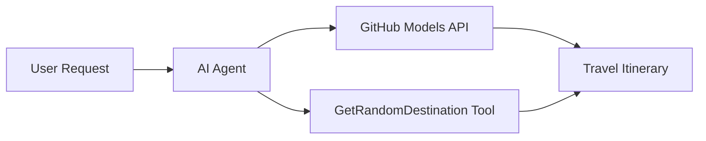

<!--
CO_OP_TRANSLATOR_METADATA:
{
  "original_hash": "5f351412e934f0833c8c821a0a60efaf",
  "translation_date": "2025-11-13T12:01:45+00:00",
  "source_file": "01-intro-to-ai-agents/code_samples/01-dotnet-agent-framework.md",
  "language_code": "pa"
}
-->
# 🌍 ਮਾਈਕਰੋਸਾਫਟ ਏਜੰਟ ਫਰੇਮਵਰਕ (.NET) ਨਾਲ AI ਯਾਤਰਾ ਏਜੰਟ

## 📋 ਸਨਰੀਓ ਝਲਕ

ਇਹ ਉਦਾਹਰਨ ਦਿਖਾਉਂਦੀ ਹੈ ਕਿ ਮਾਈਕਰੋਸਾਫਟ ਏਜੰਟ ਫਰੇਮਵਰਕ ਲਈ .NET ਦੀ ਵਰਤੋਂ ਕਰਕੇ ਇੱਕ ਬੁੱਧੀਮਾਨ ਯਾਤਰਾ ਯੋਜਨਾ ਏਜੰਟ ਕਿਵੇਂ ਬਣਾਇਆ ਜਾ ਸਕਦਾ ਹੈ। ਇਹ ਏਜੰਟ ਦੁਨੀਆ ਭਰ ਵਿੱਚ ਕਦੇ ਵੀ ਗਮਨ ਸਥਾਨਾਂ ਲਈ ਨਿੱਜੀ ਦਿਨ-ਯਾਤਰਾ ਯੋਜਨਾਵਾਂ ਸਵੈਚਾਲਿਤ ਤੌਰ 'ਤੇ ਤਿਆਰ ਕਰ ਸਕਦਾ ਹੈ।

### ਮੁੱਖ ਸਮਰੱਥਾਵਾਂ:

- 🎲 **ਰੈਂਡਮ ਸਥਾਨ ਚੋਣ**: ਛੁੱਟੀਆਂ ਦੇ ਸਥਾਨ ਚੁਣਨ ਲਈ ਇੱਕ ਕਸਟਮ ਟੂਲ ਦੀ ਵਰਤੋਂ ਕਰਦਾ ਹੈ
- 🗺️ **ਬੁੱਧੀਮਾਨ ਯਾਤਰਾ ਯੋਜਨਾ**: ਵਿਸਥਾਰਤ ਦਿਨ-ਦਰ-ਦਿਨ ਯੋਜਨਾਵਾਂ ਬਣਾਉਂਦਾ ਹੈ
- 🔄 **ਰਿਅਲ-ਟਾਈਮ ਸਟ੍ਰੀਮਿੰਗ**: ਤੁਰੰਤ ਅਤੇ ਸਟ੍ਰੀਮਿੰਗ ਜਵਾਬਾਂ ਦਾ ਸਮਰਥਨ ਕਰਦਾ ਹੈ
- 🛠️ **ਕਸਟਮ ਟੂਲ ਇੰਟੀਗ੍ਰੇਸ਼ਨ**: ਏਜੰਟ ਦੀ ਸਮਰੱਥਾ ਨੂੰ ਵਧਾਉਣ ਦਾ ਪ੍ਰਦਰਸ਼ਨ ਕਰਦਾ ਹੈ

## 🔧 ਤਕਨੀਕੀ ਆਰਕੀਟੈਕਚਰ

### ਕੋਰ ਤਕਨੀਕਾਂ

- **ਮਾਈਕਰੋਸਾਫਟ ਏਜੰਟ ਫਰੇਮਵਰਕ**: .NET ਲਈ AI ਏਜੰਟ ਵਿਕਾਸ ਲਈ ਨਵੀਂ ਲਾਗੂ ਕੀਤੀ ਗਈ ਤਕਨੀਕ
- **GitHub ਮਾਡਲ ਇੰਟੀਗ੍ਰੇਸ਼ਨ**: GitHub ਦੇ AI ਮਾਡਲ ਇੰਫਰੈਂਸ ਸੇਵਾ ਦੀ ਵਰਤੋਂ ਕਰਦਾ ਹੈ
- **OpenAI API ਅਨੁਕੂਲਤਾ**: OpenAI ਕਲਾਇੰਟ ਲਾਇਬ੍ਰੇਰੀਆਂ ਨੂੰ ਕਸਟਮ ਐਂਡਪੋਇੰਟਸ ਨਾਲ ਵਰਤਦਾ ਹੈ
- **ਸੁਰੱਖਿਅਤ ਸੰਰਚਨਾ**: ਵਾਤਾਵਰਣ-ਅਧਾਰਿਤ API ਕੁੰਜੀਆਂ ਦਾ ਪ੍ਰਬੰਧਨ

### ਮੁੱਖ ਹਿੱਸੇ

1. **AIAgent**: ਮੁੱਖ ਏਜੰਟ ਆਰਕੈਸਟਰੇਟਰ ਜੋ ਗੱਲਬਾਤ ਦੇ ਪ੍ਰਵਾਹ ਨੂੰ ਸੰਭਾਲਦਾ ਹੈ
2. **ਕਸਟਮ ਟੂਲ**: `GetRandomDestination()` ਫੰਕਸ਼ਨ ਜੋ ਏਜੰਟ ਲਈ ਉਪਲਬਧ ਹੈ
3. **ਚੈਟ ਕਲਾਇੰਟ**: GitHub ਮਾਡਲ-ਸਹਾਇਕ ਗੱਲਬਾਤ ਇੰਟਰਫੇਸ
4. **ਸਟ੍ਰੀਮਿੰਗ ਸਮਰਥਨ**: ਰਿਅਲ-ਟਾਈਮ ਜਵਾਬ ਤਿਆਰ ਕਰਨ ਦੀ ਸਮਰੱਥਾ

### ਇੰਟੀਗ੍ਰੇਸ਼ਨ ਪੈਟਰਨ



## 🚀 ਸ਼ੁਰੂਆਤ ਕਰਨਾ

### ਪੂਰਵ ਸ਼ਰਤਾਂ

- [.NET 10 SDK](https://dotnet.microsoft.com/download/dotnet/10.0) ਜਾਂ ਇਸ ਤੋਂ ਉੱਚਾ
- [GitHub ਮਾਡਲ API ਐਕਸੈਸ ਟੋਕਨ](https://docs.github.com/github-models/github-models-at-scale/using-your-own-api-keys-in-github-models)

### ਲੋੜੀਂਦੇ ਵਾਤਾਵਰਣ ਵੈਰੀਏਬਲ

```bash
# zsh/bash
export GH_TOKEN=<your_github_token>
export GH_ENDPOINT=https://models.github.ai/inference
export GH_MODEL_ID=openai/gpt-5-mini
```

```powershell
# PowerShell
$env:GH_TOKEN = "<your_github_token>"
$env:GH_ENDPOINT = "https://models.github.ai/inference"
$env:GH_MODEL_ID = "openai/gpt-5-mini"
```

### ਨਮੂਨਾ ਕੋਡ

ਕੋਡ ਉਦਾਹਰਨ ਚਲਾਉਣ ਲਈ,

```bash
# zsh/bash
chmod +x ./01-dotnet-agent-framework.cs
./01-dotnet-agent-framework.cs
```

ਜਾਂ dotnet CLI ਦੀ ਵਰਤੋਂ ਕਰਕੇ:

```bash
dotnet run ./01-dotnet-agent-framework.cs
```

ਪੂਰੇ ਕੋਡ ਲਈ [`01-dotnet-agent-framework.cs`](../../../../01-intro-to-ai-agents/code_samples/01-dotnet-agent-framework.cs) ਵੇਖੋ।

```csharp
#!/usr/bin/dotnet run

#:package Microsoft.Extensions.AI@9.*
#:package Microsoft.Agents.AI.OpenAI@1.*-*

using System.ClientModel;
using System.ComponentModel;

using Microsoft.Agents.AI;
using Microsoft.Extensions.AI;

using OpenAI;

// Tool Function: Random Destination Generator
// This static method will be available to the agent as a callable tool
// The [Description] attribute helps the AI understand when to use this function
// This demonstrates how to create custom tools for AI agents
[Description("Provides a random vacation destination.")]
static string GetRandomDestination()
{
    // List of popular vacation destinations around the world
    // The agent will randomly select from these options
    var destinations = new List<string>
    {
        "Paris, France",
        "Tokyo, Japan",
        "New York City, USA",
        "Sydney, Australia",
        "Rome, Italy",
        "Barcelona, Spain",
        "Cape Town, South Africa",
        "Rio de Janeiro, Brazil",
        "Bangkok, Thailand",
        "Vancouver, Canada"
    };

    // Generate random index and return selected destination
    // Uses System.Random for simple random selection
    var random = new Random();
    int index = random.Next(destinations.Count);
    return destinations[index];
}

// Extract configuration from environment variables
// Retrieve the GitHub Models API endpoint, defaults to https://models.github.ai/inference if not specified
// Retrieve the model ID, defaults to openai/gpt-5-mini if not specified
// Retrieve the GitHub token for authentication, throws exception if not specified
var github_endpoint = Environment.GetEnvironmentVariable("GH_ENDPOINT") ?? "https://models.github.ai/inference";
var github_model_id = Environment.GetEnvironmentVariable("GH_MODEL_ID") ?? "openai/gpt-5-mini";
var github_token = Environment.GetEnvironmentVariable("GH_TOKEN") ?? throw new InvalidOperationException("GH_TOKEN is not set.");

// Configure OpenAI Client Options
// Create configuration options to point to GitHub Models endpoint
// This redirects OpenAI client calls to GitHub's model inference service
var openAIOptions = new OpenAIClientOptions()
{
    Endpoint = new Uri(github_endpoint)
};

// Initialize OpenAI Client with GitHub Models Configuration
// Create OpenAI client using GitHub token for authentication
// Configure it to use GitHub Models endpoint instead of OpenAI directly
var openAIClient = new OpenAIClient(new ApiKeyCredential(github_token), openAIOptions);

// Create AI Agent with Travel Planning Capabilities
// Initialize OpenAI client, get chat client for specified model, and create AI agent
// Configure agent with travel planning instructions and random destination tool
// The agent can now plan trips using the GetRandomDestination function
AIAgent agent = openAIClient
    .GetChatClient(github_model_id)
    .CreateAIAgent(
        instructions: "You are a helpful AI Agent that can help plan vacations for customers at random destinations",
        tools: [AIFunctionFactory.Create(GetRandomDestination)]
    );

// Execute Agent: Plan a Day Trip
// Run the agent with streaming enabled for real-time response display
// Shows the agent's thinking and response as it generates the content
// Provides better user experience with immediate feedback
await foreach (var update in agent.RunStreamingAsync("Plan me a day trip"))
{
    await Task.Delay(10);
    Console.Write(update);
}
```

## 🎓 ਮੁੱਖ ਸਿੱਖਣ ਵਾਲੀਆਂ ਗੱਲਾਂ

1. **ਏਜੰਟ ਆਰਕੀਟੈਕਚਰ**: ਮਾਈਕਰੋਸਾਫਟ ਏਜੰਟ ਫਰੇਮਵਰਕ .NET ਵਿੱਚ AI ਏਜੰਟ ਬਣਾਉਣ ਲਈ ਇੱਕ ਸਾਫ਼, ਟਾਈਪ-ਸੇਫ਼ ਪਹੁੰਚ ਪ੍ਰਦਾਨ ਕਰਦਾ ਹੈ
2. **ਟੂਲ ਇੰਟੀਗ੍ਰੇਸ਼ਨ**: `[Description]` ਐਟ੍ਰਿਬਿਊਟ ਨਾਲ ਸਜਾਏ ਫੰਕਸ਼ਨ ਏਜੰਟ ਲਈ ਉਪਲਬਧ ਟੂਲ ਬਣ ਜਾਂਦੇ ਹਨ
3. **ਸੰਰਚਨਾ ਪ੍ਰਬੰਧਨ**: ਵਾਤਾਵਰਣ ਵੈਰੀਏਬਲ ਅਤੇ ਸੁਰੱਖਿਅਤ ਪ੍ਰਮਾਣ ਪੱਤਰ ਸੰਭਾਲ .NET ਦੇ ਸਰਵੋਤਮ ਅਭਿਆਸਾਂ ਦਾ ਪਾਲਣ ਕਰਦੇ ਹਨ
4. **OpenAI ਅਨੁਕੂਲਤਾ**: GitHub ਮਾਡਲ ਇੰਟੀਗ੍ਰੇਸ਼ਨ OpenAI-ਅਨੁਕੂਲ API ਦੇ ਜ਼ਰੀਏ ਬੇਰੁਕਾਵਟ ਕੰਮ ਕਰਦਾ ਹੈ

## 🔗 ਵਾਧੂ ਸਰੋਤ

- [ਮਾਈਕਰੋਸਾਫਟ ਏਜੰਟ ਫਰੇਮਵਰਕ ਦਸਤਾਵੇਜ਼](https://learn.microsoft.com/agent-framework)
- [GitHub ਮਾਡਲ ਮਾਰਕੀਟਪਲੇਸ](https://github.com/marketplace?type=models)
- [Microsoft.Extensions.AI](https://learn.microsoft.com/dotnet/ai/microsoft-extensions-ai)
- [.NET ਸਿੰਗਲ ਫਾਈਲ ਐਪਸ](https://devblogs.microsoft.com/dotnet/announcing-dotnet-run-app)

---

<!-- CO-OP TRANSLATOR DISCLAIMER START -->
**ਅਸਵੀਕਰਤੀ**:  
ਇਹ ਦਸਤਾਵੇਜ਼ AI ਅਨੁਵਾਦ ਸੇਵਾ [Co-op Translator](https://github.com/Azure/co-op-translator) ਦੀ ਵਰਤੋਂ ਕਰਕੇ ਅਨੁਵਾਦ ਕੀਤਾ ਗਿਆ ਹੈ। ਜਦੋਂ ਕਿ ਅਸੀਂ ਸਹੀ ਹੋਣ ਦਾ ਯਤਨ ਕਰਦੇ ਹਾਂ, ਕਿਰਪਾ ਕਰਕੇ ਧਿਆਨ ਦਿਓ ਕਿ ਸਵੈਚਾਲਿਤ ਅਨੁਵਾਦਾਂ ਵਿੱਚ ਗਲਤੀਆਂ ਜਾਂ ਅਸੁਚਨਾਵਾਂ ਹੋ ਸਕਦੀਆਂ ਹਨ। ਇਸ ਦੀ ਮੂਲ ਭਾਸ਼ਾ ਵਿੱਚ ਮੌਜੂਦ ਮੂਲ ਦਸਤਾਵੇਜ਼ ਨੂੰ ਅਧਿਕਾਰਕ ਸਰੋਤ ਮੰਨਿਆ ਜਾਣਾ ਚਾਹੀਦਾ ਹੈ। ਮਹੱਤਵਪੂਰਨ ਜਾਣਕਾਰੀ ਲਈ, ਪੇਸ਼ੇਵਰ ਮਨੁੱਖੀ ਅਨੁਵਾਦ ਦੀ ਸਿਫਾਰਸ਼ ਕੀਤੀ ਜਾਂਦੀ ਹੈ। ਅਸੀਂ ਇਸ ਅਨੁਵਾਦ ਦੀ ਵਰਤੋਂ ਤੋਂ ਪੈਦਾ ਹੋਣ ਵਾਲੀਆਂ ਕਿਸੇ ਵੀ ਗਲਤਫਹਮੀਆਂ ਜਾਂ ਗਲਤ ਵਿਆਖਿਆਵਾਂ ਲਈ ਜ਼ਿੰਮੇਵਾਰ ਨਹੀਂ ਹਾਂ।
<!-- CO-OP TRANSLATOR DISCLAIMER END -->