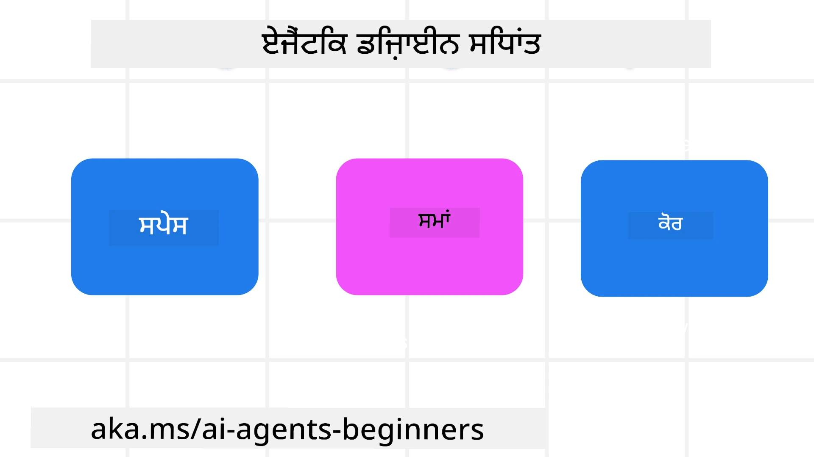

<!--
CO_OP_TRANSLATOR_METADATA:
{
  "original_hash": "d71524fe83a23829ae7a23b4031aaac8",
  "translation_date": "2025-11-13T12:07:15+00:00",
  "source_file": "03-agentic-design-patterns/README.md",
  "language_code": "pa"
}
-->

> _(ਉਪਰ ਦਿੱਤੀ ਤਸਵੀਰ 'ਤੇ ਕਲਿੱਕ ਕਰਕੇ ਇਸ ਪਾਠ ਦਾ ਵੀਡੀਓ ਵੇਖੋ)_
# AI ਏਜੰਟਿਕ ਡਿਜ਼ਾਈਨ ਸਿਧਾਂਤ

## ਪਰਿਚਯ

AI ਏਜੰਟਿਕ ਸਿਸਟਮ ਬਣਾਉਣ ਬਾਰੇ ਸੋਚਣ ਦੇ ਕਈ ਤਰੀਕੇ ਹਨ। ਜਦੋਂ ਕਿ ਜਨਰੇਟਿਵ AI ਡਿਜ਼ਾਈਨ ਵਿੱਚ ਅਸਪਸ਼ਟਤਾ ਇੱਕ ਖੂਬੀ ਹੈ, ਖਾਮੀ ਨਹੀਂ, ਇਹ ਕਈ ਵਾਰ ਇੰਜੀਨੀਅਰਾਂ ਲਈ ਇਹ ਸਮਝਣਾ ਮੁਸ਼ਕਲ ਹੋ ਜਾਂਦਾ ਹੈ ਕਿ ਸ਼ੁਰੂਆਤ ਕਿੱਥੋਂ ਕਰਨੀ ਹੈ। ਅਸੀਂ ਵਿਕਾਸਕਾਰਾਂ ਨੂੰ ਗਾਹਕ-ਕੇਂਦਰਤ ਏਜੰਟਿਕ ਸਿਸਟਮ ਬਣਾਉਣ ਵਿੱਚ ਸਹਾਇਤਾ ਕਰਨ ਲਈ ਮਨੁੱਖ-ਕੇਂਦਰਤ UX ਡਿਜ਼ਾਈਨ ਸਿਧਾਂਤਾਂ ਦਾ ਇੱਕ ਸੈੱਟ ਤਿਆਰ ਕੀਤਾ ਹੈ, ਜੋ ਉਨ੍ਹਾਂ ਦੇ ਕਾਰੋਬਾਰੀ ਲੋੜਾਂ ਨੂੰ ਹੱਲ ਕਰ ਸਕੇ। ਇਹ ਡਿਜ਼ਾਈਨ ਸਿਧਾਂਤ ਇੱਕ ਨਿਰਧਾਰਿਤ ਆਰਕੀਟੈਕਚਰ ਨਹੀਂ ਹਨ, ਸਗੋਂ ਉਹ ਟੀਮਾਂ ਲਈ ਇੱਕ ਸ਼ੁਰੂਆਤੀ ਬਿੰਦੂ ਹਨ ਜੋ ਏਜੰਟ ਅਨੁਭਵਾਂ ਨੂੰ ਪਰਿਭਾਸ਼ਿਤ ਅਤੇ ਵਿਕਸਿਤ ਕਰ ਰਹੀਆਂ ਹਨ।

ਸਧਾਰਨ ਤੌਰ 'ਤੇ, ਏਜੰਟਾਂ ਨੂੰ ਇਹ ਕਰਨਾ ਚਾਹੀਦਾ ਹੈ:

- ਮਨੁੱਖੀ ਸਮਰੱਥਾਵਾਂ ਨੂੰ ਵਧਾਉਣਾ ਅਤੇ ਸਕੇਲ ਕਰਨਾ (ਦਿਮਾਗੀ ਤੌਰ 'ਤੇ ਸੋਚਣਾ, ਸਮੱਸਿਆ ਹੱਲ ਕਰਨਾ, ਆਟੋਮੇਸ਼ਨ ਆਦਿ)
- ਗਿਆਨ ਦੇ ਖਾਲੀਪਣ ਨੂੰ ਪੂਰਾ ਕਰਨਾ (ਮੈਨੂੰ ਗਿਆਨ ਖੇਤਰਾਂ, ਅਨੁਵਾਦ ਆਦਿ ਬਾਰੇ ਅੱਪਡੇਟ ਕਰੋ)
- ਸਹਿਯੋਗ ਨੂੰ ਆਸਾਨ ਬਣਾਉਣਾ ਅਤੇ ਸਹਾਇਤਾ ਕਰਨਾ, ਜਿਵੇਂ ਅਸੀਂ ਵਿਅਕਤਿਗਤ ਤੌਰ 'ਤੇ ਹੋਰਾਂ ਨਾਲ ਕੰਮ ਕਰਨਾ ਪਸੰਦ ਕਰਦੇ ਹਾਂ
- ਸਾਨੂੰ ਆਪਣੇ ਆਪ ਦੇ ਬਿਹਤਰ ਸੰਸਕਰਣ ਬਣਾਉਣ ਵਿੱਚ ਮਦਦ ਕਰਨਾ (ਜਿਵੇਂ ਕਿ ਲਾਈਫ ਕੋਚ/ਟਾਸਕ ਮਾਸਟਰ, ਸਾਨੂੰ ਭਾਵਨਾਤਮਕ ਨਿਯਮਨ ਅਤੇ ਮਨਨਸ਼ੀਲਤਾ ਦੇ ਹੁਨਰ ਸਿਖਾਉਣਾ, ਲਚੀਲਾਪਨ ਬਣਾਉਣਾ ਆਦਿ)

## ਇਸ ਪਾਠ ਵਿੱਚ ਕੀ ਕਵਰ ਕੀਤਾ ਜਾਵੇਗਾ

- ਏਜੰਟਿਕ ਡਿਜ਼ਾਈਨ ਸਿਧਾਂਤ ਕੀ ਹਨ
- ਇਹ ਡਿਜ਼ਾਈਨ ਸਿਧਾਂਤ ਲਾਗੂ ਕਰਦੇ ਸਮੇਂ ਕਿਹੜੀਆਂ ਹਦਾਇਤਾਂ ਦੀ ਪਾਲਣਾ ਕਰਨੀ ਚਾਹੀਦੀ ਹੈ
- ਡਿਜ਼ਾਈਨ ਸਿਧਾਂਤਾਂ ਦੀ ਵਰਤੋਂ ਦੇ ਕੁਝ ਉਦਾਹਰਣ

## ਸਿੱਖਣ ਦੇ ਲਕਸ਼

ਇਸ ਪਾਠ ਨੂੰ ਪੂਰਾ ਕਰਨ ਤੋਂ ਬਾਅਦ, ਤੁਸੀਂ ਇਹ ਕਰਨ ਦੇ ਯੋਗ ਹੋਵੋਗੇ:

1. ਸਮਝਾਉਣਾ ਕਿ ਏਜੰਟਿਕ ਡਿਜ਼ਾਈਨ ਸਿਧਾਂਤ ਕੀ ਹਨ
2. ਏਜੰਟਿਕ ਡਿਜ਼ਾਈਨ ਸਿਧਾਂਤਾਂ ਦੀ ਵਰਤੋਂ ਲਈ ਹਦਾਇਤਾਂ ਨੂੰ ਸਮਝਾਉਣਾ
3. ਏਜੰਟਿਕ ਡਿਜ਼ਾਈਨ ਸਿਧਾਂਤਾਂ ਦੀ ਵਰਤੋਂ ਕਰਕੇ ਇੱਕ ਏਜੰਟ ਬਣਾਉਣ ਦੀ ਸਮਝ ਪ੍ਰਾਪਤ ਕਰਨਾ

## ਏਜੰਟਿਕ ਡਿਜ਼ਾਈਨ ਸਿਧਾਂਤ

### ਏਜੰਟ (ਸਪੇਸ)

ਇਹ ਉਹ ਵਾਤਾਵਰਣ ਹੈ ਜਿਸ ਵਿੱਚ ਏਜੰਟ ਕੰਮ ਕਰਦਾ ਹੈ। ਇਹ ਸਿਧਾਂਤ ਸਾਨੂੰ ਸਿੱਖਾਉਂਦੇ ਹਨ ਕਿ ਭੌਤਿਕ ਅਤੇ ਡਿਜ਼ੀਟਲ ਦੁਨੀਆਂ ਵਿੱਚ ਏਜੰਟਾਂ ਨੂੰ ਕਿਵੇਂ ਡਿਜ਼ਾਈਨ ਕਰਨਾ ਹੈ।

- **ਜੋੜਨਾ, ਨਾ ਕਿ ਘਟਾਉਣਾ** – ਲੋਕਾਂ ਨੂੰ ਹੋਰ ਲੋਕਾਂ, ਘਟਨਾਵਾਂ ਅਤੇ ਕਾਰਵਾਈਯੋਗ ਗਿਆਨ ਨਾਲ ਜੋੜਨ ਵਿੱਚ ਮਦਦ ਕਰੋ ਤਾਂ ਜੋ ਸਹਿਯੋਗ ਅਤੇ ਕਨੈਕਸ਼ਨ ਨੂੰ ਯਕੀਨੀ ਬਣਾਇਆ ਜਾ ਸਕੇ।
- ਏਜੰਟ ਘਟਨਾਵਾਂ, ਗਿਆਨ ਅਤੇ ਲੋਕਾਂ ਨੂੰ ਜੋੜਨ ਵਿੱਚ ਮਦਦ ਕਰਦੇ ਹਨ।
- ਏਜੰਟ ਲੋਕਾਂ ਨੂੰ ਇੱਕ-ਦੂਜੇ ਦੇ ਨੇੜੇ ਲਿਆਉਂਦੇ ਹਨ। ਉਹ ਲੋਕਾਂ ਦੀ ਜਗ੍ਹਾ ਲੈਣ ਜਾਂ ਉਨ੍ਹਾਂ ਨੂੰ ਘਟਾਉਣ ਲਈ ਨਹੀਂ ਬਣਾਏ ਗਏ।
- **ਆਸਾਨੀ ਨਾਲ ਪਹੁੰਚਯੋਗ ਪਰ ਕਈ ਵਾਰ ਅਦ੍ਰਿਸ਼ਯ** – ਏਜੰਟ ਮੁੱਖ ਤੌਰ 'ਤੇ ਪਿਛੋਕੜ ਵਿੱਚ ਕੰਮ ਕਰਦਾ ਹੈ ਅਤੇ ਸਿਰਫ਼ ਉਸ ਸਮੇਂ ਸਾਨੂੰ ਸੂਚਿਤ ਕਰਦਾ ਹੈ ਜਦੋਂ ਇਹ ਸਬੰਧਤ ਅਤੇ ਉਚਿਤ ਹੁੰਦਾ ਹੈ।
  - ਏਜੰਟ ਕਿਸੇ ਵੀ ਡਿਵਾਈਸ ਜਾਂ ਪਲੇਟਫਾਰਮ 'ਤੇ ਅਧਿਕਾਰਿਤ ਉਪਭੋਗਤਾਵਾਂ ਲਈ ਆਸਾਨੀ ਨਾਲ ਖੋਜਯੋਗ ਅਤੇ ਪਹੁੰਚਯੋਗ ਹੈ।
  - ਏਜੰਟ ਬਹੁ-ਮੋਡਲ ਇਨਪੁਟ ਅਤੇ ਆਉਟਪੁਟ (ਆਵਾਜ਼, ਟੈਕਸਟ ਆਦਿ) ਦਾ ਸਮਰਥਨ ਕਰਦਾ ਹੈ।
  - ਏਜੰਟ ਬਿਨਾਂ ਰੁਕਾਵਟ ਦੇ ਅੱਗੇ ਅਤੇ ਪਿਛੋਕੜ ਵਿੱਚ ਬਦਲ ਸਕਦਾ ਹੈ; ਪ੍ਰਯੋਗਕਰਤਾ ਦੀਆਂ ਲੋੜਾਂ ਨੂੰ ਸਮਝਣ ਦੇ ਅਧਾਰ 'ਤੇ ਪ੍ਰੋਐਕਟਿਵ ਅਤੇ ਰੀਐਕਟਿਵ ਵਿਚਕਾਰ ਬਦਲ ਸਕਦਾ ਹੈ।
  - ਏਜੰਟ ਅਦ੍ਰਿਸ਼ਯ ਰੂਪ ਵਿੱਚ ਕੰਮ ਕਰ ਸਕਦਾ ਹੈ, ਪਰ ਇਸ ਦੀ ਪਿਛੋਕੜ ਪ੍ਰਕਿਰਿਆ ਦਾ ਮਾਰਗ ਅਤੇ ਹੋਰ ਏਜੰਟਾਂ ਨਾਲ ਸਹਿਯੋਗ ਉਪਭੋਗਤਾ ਲਈ ਪਾਰਦਰਸ਼ੀ ਅਤੇ ਨਿਯੰਤਰਣਯੋਗ ਹੈ।

### ਏਜੰਟ (ਟਾਈਮ)

ਇਹ ਹੈ ਕਿ ਏਜੰਟ ਸਮੇਂ ਦੇ ਨਾਲ ਕਿਵੇਂ ਕੰਮ ਕਰਦਾ ਹੈ। ਇਹ ਸਿਧਾਂਤ ਸਾਨੂੰ ਸਿੱਖਾਉਂਦੇ ਹਨ ਕਿ ਪਿਛਲੇ, ਮੌਜੂਦਾ ਅਤੇ ਭਵਿੱਖ ਦੇ ਸੰਦਰਭ ਵਿੱਚ ਏਜੰਟਾਂ ਨੂੰ ਕਿਵੇਂ ਡਿਜ਼ਾਈਨ ਕਰਨਾ ਹੈ।

- **ਪਿਛਲਾ**: ਇਤਿਹਾਸ 'ਤੇ ਵਿਚਾਰ ਕਰਨਾ ਜੋ ਰਾਜ ਅਤੇ ਸੰਦਰਭ ਦੋਵਾਂ ਨੂੰ ਸ਼ਾਮਲ ਕਰਦਾ ਹੈ।
  - ਏਜੰਟ ਸਿਰਫ ਘਟਨਾ, ਲੋਕਾਂ ਜਾਂ ਰਾਜਾਂ ਤੋਂ ਪਰੇ ਰਿਚਰ ਇਤਿਹਾਸਕ ਡਾਟਾ ਦੇ ਵਿਸ਼ਲੇਸ਼ਣ ਦੇ ਅਧਾਰ 'ਤੇ ਹੋਰ ਸਬੰਧਤ ਨਤੀਜੇ ਪ੍ਰਦਾਨ ਕਰਦਾ ਹੈ।
  - ਏਜੰਟ ਪਿਛਲੀਆਂ ਘਟਨਾਵਾਂ ਤੋਂ ਕਨੈਕਸ਼ਨ ਬਣਾਉਂਦਾ ਹੈ ਅਤੇ ਮੌਜੂਦਾ ਸਥਿਤੀਆਂ ਨਾਲ ਜੁੜਨ ਲਈ ਯਾਦ 'ਤੇ ਸਹਿਯੋਗੀ ਤੌਰ 'ਤੇ ਵਿਚਾਰ ਕਰਦਾ ਹੈ।
- **ਹੁਣ**: ਸੂਚਿਤ ਕਰਨ ਨਾਲ ਵੱਧ ਪ੍ਰੇਰਿਤ ਕਰਨਾ।
  - ਏਜੰਟ ਲੋਕਾਂ ਨਾਲ ਸੰਚਾਰ ਕਰਨ ਲਈ ਇੱਕ ਵਿਸ਼ਾਲ ਪਹੁੰਚ ਦਾ ਪ੍ਰਤੀਕ ਹੈ। ਜਦੋਂ ਕੋਈ ਘਟਨਾ ਹੁੰਦੀ ਹੈ, ਏਜੰਟ ਸਥਿਰ ਸੂਚਨਾ ਜਾਂ ਹੋਰ ਸਥਿਰ ਰੂਪਕਤਾ ਤੋਂ ਪਰੇ ਜਾਂਦਾ ਹੈ। ਏਜੰਟ ਪ੍ਰਵਾਹਾਂ ਨੂੰ ਆਸਾਨ ਬਣਾਉਣ ਜਾਂ ਉਪਭੋਗਤਾ ਦੇ ਧਿਆਨ ਨੂੰ ਸਹੀ ਸਮੇਂ 'ਤੇ ਦਿਸ਼ਾ ਦੇਣ ਲਈ ਗਤੀਸ਼ੀਲ ਤੌਰ 'ਤੇ ਸੰਕੇਤ ਪੈਦਾ ਕਰ ਸਕਦਾ ਹੈ।
  - ਏਜੰਟ ਸੰਦਰਭ ਵਾਤਾਵਰਣ, ਸਮਾਜਿਕ ਅਤੇ ਸੱਭਿਆਚਾਰਕ ਬਦਲਾਵਾਂ ਦੇ ਅਧਾਰ 'ਤੇ ਜਾਣਕਾਰੀ ਪ੍ਰਦਾਨ ਕਰਦਾ ਹੈ ਅਤੇ ਉਪਭੋਗਤਾ ਦੇ ਇਰਾਦੇ ਅਨੁਸਾਰ ਹੋਰ ਅਨੁਕੂਲ ਹੁੰਦਾ ਹੈ।
  - ਏਜੰਟ ਦੀ ਗਤੀਵਿਧੀ ਕ੍ਰਮਬੱਧ ਹੋ ਸਕਦੀ ਹੈ, ਲੰਬੇ ਸਮੇਂ ਤੱਕ ਉਪਭੋਗਤਾਵਾਂ ਨੂੰ ਸਸ਼ਕਤ ਕਰਨ ਲਈ ਵਿਕਸਿਤ ਹੋ ਸਕਦੀ ਹੈ।
- **ਭਵਿੱਖ**: ਅਨੁਕੂਲਿਤ ਅਤੇ ਵਿਕਸਿਤ ਹੋਣਾ।
  - ਏਜੰਟ ਵੱਖ-ਵੱਖ ਡਿਵਾਈਸਾਂ, ਪਲੇਟਫਾਰਮਾਂ ਅਤੇ ਮੋਡੈਲਿਟੀਆਂ ਲਈ ਅਨੁਕੂਲ ਹੁੰਦਾ ਹੈ।
  - ਏਜੰਟ ਉਪਭੋਗਤਾ ਦੇ ਵਿਹਾਰ, ਪਹੁੰਚਯੋਗਤਾ ਦੀਆਂ ਲੋੜਾਂ ਲਈ ਅਨੁਕੂਲ ਹੁੰਦਾ ਹੈ ਅਤੇ ਮੁਫ਼ਤ ਤੌਰ 'ਤੇ ਕਸਟਮਾਈਜ਼ ਕੀਤਾ ਜਾ ਸਕਦਾ ਹੈ।
  - ਏਜੰਟ ਉਪਭੋਗਤਾ ਦੇ ਲਗਾਤਾਰ ਸੰਚਾਰ ਰਾਹੀਂ ਆਕਾਰ ਲੈਂਦਾ ਹੈ ਅਤੇ ਵਿਕਸਿਤ ਹੁੰਦਾ ਹੈ।

### ਏਜੰਟ (ਕੋਰ)

ਇਹ ਏਜੰਟ ਦੇ ਡਿਜ਼ਾਈਨ ਦੇ ਮੁੱਖ ਤੱਤ ਹਨ।

- **ਅਸਪਸ਼ਟਤਾ ਨੂੰ ਸਵੀਕਾਰ ਕਰੋ ਪਰ ਭਰੋਸਾ ਬਣਾਓ**।
  - ਏਜੰਟ ਦੀ ਕੁਝ ਹੱਦ ਤੱਕ ਅਸਪਸ਼ਟਤਾ ਉਮੀਦ ਕੀਤੀ ਜਾਂਦੀ ਹੈ। ਅਸਪਸ਼ਟਤਾ ਏਜੰਟ ਡਿਜ਼ਾਈਨ ਦਾ ਇੱਕ ਮੁੱਖ ਤੱਤ ਹੈ।
  - ਭਰੋਸਾ ਅਤੇ ਪਾਰਦਰਸ਼ਤਾ ਏਜੰਟ ਡਿਜ਼ਾਈਨ ਦੀਆਂ ਬੁਨਿਆਦੀ ਪਰਤਾਂ ਹਨ।
  - ਮਨੁੱਖ ਇਸ ਗੱਲ ਦਾ ਨਿਯੰਤਰਣ ਰੱਖਦੇ ਹਨ ਕਿ ਜਦੋਂ ਏਜੰਟ ਚਾਲੂ/ਬੰਦ ਹੈ ਅਤੇ ਏਜੰਟ ਦੀ ਸਥਿਤੀ ਹਰ ਸਮੇਂ ਸਪਸ਼ਟ ਦਿਖਾਈ ਦਿੰਦੀ ਹੈ।

## ਇਹ ਸਿਧਾਂਤ ਲਾਗੂ ਕਰਨ ਲਈ ਹਦਾਇਤਾਂ

ਜਦੋਂ ਤੁਸੀਂ ਪਿਛਲੇ ਡਿਜ਼ਾਈਨ ਸਿਧਾਂਤਾਂ ਦੀ ਵਰਤੋਂ ਕਰ ਰਹੇ ਹੋ, ਤਾਂ ਹੇਠਾਂ ਦਿੱਤੀਆਂ ਹਦਾਇਤਾਂ ਦੀ ਪਾਲਣਾ ਕਰੋ:

1. **ਪਾਰਦਰਸ਼ਤਾ**: ਉਪਭੋਗਤਾ ਨੂੰ ਦੱਸੋ ਕਿ AI ਸ਼ਾਮਲ ਹੈ, ਇਹ ਕਿਵੇਂ ਕੰਮ ਕਰਦਾ ਹੈ (ਪਿਛਲੇ ਕਾਰਵਾਈਆਂ ਸਮੇਤ), ਅਤੇ ਪ੍ਰਤੀਕਿਰਿਆ ਦੇਣ ਅਤੇ ਸਿਸਟਮ ਨੂੰ ਸੋਧਣ ਦਾ ਤਰੀਕਾ।
2. **ਨਿਯੰਤਰਣ**: ਉਪਭੋਗਤਾ ਨੂੰ ਕਸਟਮਾਈਜ਼ ਕਰਨ, ਪਸੰਦਾਂ ਨੂੰ ਨਿਰਧਾਰਤ ਕਰਨ ਅਤੇ ਸਿਸਟਮ ਅਤੇ ਇਸ ਦੇ ਗੁਣਾਂ 'ਤੇ ਨਿਯੰਤਰਣ ਕਰਨ ਦੇ ਯੋਗ ਬਣਾਓ (ਭੁੱਲਣ ਦੀ ਸਮਰੱਥਾ ਸਮੇਤ)।
3. **ਸਥਿਰਤਾ**: ਡਿਵਾਈਸਾਂ ਅਤੇ ਐਂਡਪੌਇੰਟਸ ਵਿੱਚ ਸਥਿਰ, ਬਹੁ-ਮੋਡਲ ਅਨੁਭਵਾਂ ਲਈ ਕੋਸ਼ਿਸ਼ ਕਰੋ। ਜਿੱਥੇ ਸੰਭਵ ਹੋਵੇ, ਜਾਣ-ਪਛਾਣ ਵਾਲੇ UI/UX ਤੱਤਾਂ ਦੀ ਵਰਤੋਂ ਕਰੋ (ਜਿਵੇਂ ਕਿ ਵੌਇਸ ਇੰਟਰੈਕਸ਼ਨ ਲਈ ਮਾਈਕਰੋਫੋਨ ਆਈਕਨ) ਅਤੇ ਉਪਭੋਗਤਾ ਦੇ ਜ਼ਹਿਨੀ ਬੋਝ ਨੂੰ ਘਟਾਓ (ਜਿਵੇਂ ਕਿ ਸੰਖੇਪ ਜਵਾਬਾਂ, ਵਿਜ਼ੂਅਲ ਸਹਾਇਕ ਅਤੇ 'ਹੋਰ ਸਿੱਖੋ' ਸਮੱਗਰੀ ਲਈ ਕੋਸ਼ਿਸ਼ ਕਰੋ)।

## ਇਹ ਸਿਧਾਂਤ ਅਤੇ ਹਦਾਇਤਾਂ ਵਰਤ ਕੇ ਟ੍ਰੈਵਲ ਏਜੰਟ ਕਿਵੇਂ ਡਿਜ਼ਾਈਨ ਕਰਨਾ ਹੈ

ਕਲਪਨਾ ਕਰੋ ਕਿ ਤੁਸੀਂ ਇੱਕ ਟ੍ਰੈਵਲ ਏਜੰਟ ਡਿਜ਼ਾਈਨ ਕਰ ਰਹੇ ਹੋ, ਇੱਥੇ ਇਹ ਹੈ ਕਿ ਤੁਸੀਂ ਡਿਜ਼ਾਈਨ ਸਿਧਾਂਤਾਂ ਅਤੇ ਹਦਾਇਤਾਂ ਦੀ ਵਰਤੋਂ ਬਾਰੇ ਕਿਵੇਂ ਸੋਚ ਸਕਦੇ ਹੋ:

1. **ਪਾਰਦਰਸ਼ਤਾ** – ਉਪਭੋਗਤਾ ਨੂੰ ਦੱਸੋ ਕਿ ਟ੍ਰੈਵਲ ਏਜੰਟ ਇੱਕ AI-ਸਮਰਥਿਤ ਏਜੰਟ ਹੈ। ਸ਼ੁਰੂਆਤ ਕਰਨ ਲਈ ਕੁਝ ਬੁਨਿਆਦੀ ਹਦਾਇਤਾਂ ਦਿਓ (ਜਿਵੇਂ ਕਿ ਇੱਕ "ਹੈਲੋ" ਸੁਨੇਹਾ, ਨਮੂਨਾ ਪ੍ਰੋਮਪਟ)। ਇਸ ਨੂੰ ਉਤਪਾਦ ਪੰਨੇ 'ਤੇ ਸਪਸ਼ਟ ਤੌਰ 'ਤੇ ਦਸਤਾਵੇਜ਼ ਕਰੋ। ਪਿਛਲੇ ਵਿੱਚ ਉਪਭੋਗਤਾ ਦੁਆਰਾ ਪੁੱਛੇ ਗਏ ਪ੍ਰੋਮਪਟਾਂ ਦੀ ਸੂਚੀ ਦਿਖਾਓ। ਸਪਸ਼ਟ ਕਰੋ ਕਿ ਪ੍ਰਤੀਕਿਰਿਆ ਕਿਵੇਂ ਦੇਣੀ ਹੈ (ਥੰਬਸ ਅੱਪ ਅਤੇ ਡਾਊਨ, ਫੀਡਬੈਕ ਭੇਜੋ ਬਟਨ ਆਦਿ)। ਸਪਸ਼ਟ ਤੌਰ 'ਤੇ ਦੱਸੋ ਜੇ ਏਜੰਟ ਦੀ ਵਰਤੋਂ ਜਾਂ ਵਿਸ਼ੇਸ਼ ਥੀਮਾਂ 'ਤੇ ਕੋਈ ਪਾਬੰਦੀ ਹੈ।
2. **ਨਿਯੰਤਰਣ** – ਇਹ ਯਕੀਨੀ ਬਣਾਓ ਕਿ ਉਪਭੋਗਤਾ ਨੂੰ ਸਿਸਟਮ ਪ੍ਰੋਮਪਟ ਵਰਗੀਆਂ ਚੀਜ਼ਾਂ ਨਾਲ ਏਜੰਟ ਨੂੰ ਸੋਧਣ ਦਾ ਤਰੀਕਾ ਸਪਸ਼ਟ ਹੈ। ਉਪਭੋਗਤਾ ਨੂੰ ਚੁਣਨ ਦੇ ਯੋਗ ਬਣਾਓ ਕਿ ਏਜੰਟ ਕਿੰਨਾ ਵਿਸਤਾਰਸ਼ੀਲ ਹੈ, ਇਸ ਦਾ ਲਿਖਣ ਦਾ ਅੰਦਾਜ਼, ਅਤੇ ਕੋਈ ਵੀ ਚੇਤਾਵਨੀ ਕਿ ਏਜੰਟ ਨੂੰ ਕਿਸ ਬਾਰੇ ਗੱਲ ਨਹੀਂ ਕਰਨੀ ਚਾਹੀਦੀ। ਉਪਭੋਗਤਾ ਨੂੰ ਕੋਈ ਵੀ ਜੁੜੀ ਫਾਈਲਾਂ ਜਾਂ ਡਾਟਾ, ਪ੍ਰੋਮਪਟ ਅਤੇ ਪਿਛਲੇ ਸੰਵਾਦ ਵੇਖਣ ਅਤੇ ਮਿਟਾਉਣ ਦੀ ਆਜ਼ਾਦੀ ਦਿਓ।
3. **ਸਥਿਰਤਾ** – ਇਹ ਯਕੀਨੀ ਬਣਾਓ ਕਿ ਸ਼ੇਅਰ ਪ੍ਰੋਮਪਟ, ਫਾਈਲ ਜਾਂ ਫੋਟੋ ਸ਼ਾਮਲ ਕਰੋ ਅਤੇ ਕਿਸੇ ਨੂੰ ਟੈਗ ਕਰਨ ਲਈ ਆਈਕਨ ਮਿਆਰੀ ਅਤੇ ਪਛਾਣਯੋਗ ਹਨ। ਫਾਈਲ ਅੱਪਲੋਡ/ਸ਼ੇਅਰ ਕਰਨ ਲਈ ਕਲਿੱਪ ਆਈਕਨ ਦੀ ਵਰਤੋਂ ਕਰੋ, ਅਤੇ ਗ੍ਰਾਫਿਕਸ ਅੱਪਲੋਡ ਕਰਨ ਲਈ ਇੱਕ ਚਿੱਤਰ ਆਈਕਨ ਦੀ ਵਰਤੋਂ ਕਰੋ।

## ਨਮੂਨਾ ਕੋਡ

- ਪਾਇਥਨ: [ਏਜੰਟ ਫਰੇਮਵਰਕ](./code_samples/03-python-agent-framework.ipynb)
- .NET: [ਏਜੰਟ ਫਰੇਮਵਰਕ](./code_samples/03-dotnet-agent-framework.md)

## AI ਏਜੰਟਿਕ ਡਿਜ਼ਾਈਨ ਪੈਟਰਨ ਬਾਰੇ ਹੋਰ ਸਵਾਲ ਹਨ?

[Azure AI Foundry Discord](https://aka.ms/ai-agents/discord) ਵਿੱਚ ਸ਼ਾਮਲ ਹੋਵੋ ਤਾਂ ਜੋ ਹੋਰ ਸਿੱਖਣ ਵਾਲਿਆਂ ਨਾਲ ਮਿਲ ਸਕੋ, ਦਫ਼ਤਰ ਦੇ ਘੰਟਿਆਂ ਵਿੱਚ ਸ਼ਾਮਲ ਹੋਵੋ ਅਤੇ ਆਪਣੇ AI ਏਜੰਟਾਂ ਦੇ ਸਵਾਲਾਂ ਦੇ ਜਵਾਬ ਪ੍ਰਾਪਤ ਕਰੋ।

## ਵਾਧੂ ਸਰੋਤ

- <a href="https://openai.com" target="_blank">ਏਜੰਟਿਕ AI ਸਿਸਟਮਾਂ ਦੇ ਗਵਰਨਿੰਗ ਲਈ ਅਭਿਆਸ | OpenAI</a>
- <a href="https://microsoft.com" target="_blank">HAX ਟੂਲਕਿਟ ਪ੍ਰੋਜੈਕਟ - ਮਾਈਕਰੋਸਾਫਟ ਰਿਸਰਚ</a>
- <a href="https://responsibleaitoolbox.ai" target="_blank">ਜਿੰਮੇਵਾਰ AI ਟੂਲਬਾਕਸ</a>

## ਪਿਛਲਾ ਪਾਠ

[ਏਜੰਟਿਕ ਫਰੇਮਵਰਕ ਦੀ ਖੋਜ](../02-explore-agentic-frameworks/README.md)

## ਅਗਲਾ ਪਾਠ

[ਟੂਲ ਯੂਜ਼ ਡਿਜ਼ਾਈਨ ਪੈਟਰਨ](../04-tool-use/README.md)

---

<!-- CO-OP TRANSLATOR DISCLAIMER START -->
**ਅਸਵੀਕਰਤੀ**:  
ਇਹ ਦਸਤਾਵੇਜ਼ AI ਅਨੁਵਾਦ ਸੇਵਾ [Co-op Translator](https://github.com/Azure/co-op-translator) ਦੀ ਵਰਤੋਂ ਕਰਕੇ ਅਨੁਵਾਦ ਕੀਤਾ ਗਿਆ ਹੈ। ਜਦੋਂ ਕਿ ਅਸੀਂ ਸਹੀ ਹੋਣ ਦੀ ਕੋਸ਼ਿਸ਼ ਕਰਦੇ ਹਾਂ, ਕਿਰਪਾ ਕਰਕੇ ਧਿਆਨ ਦਿਓ ਕਿ ਸਵੈਚਾਲਿਤ ਅਨੁਵਾਦਾਂ ਵਿੱਚ ਗਲਤੀਆਂ ਜਾਂ ਅਸੁਚੱਜੇਪਣ ਹੋ ਸਕਦੇ ਹਨ। ਇਸ ਦੀ ਮੂਲ ਭਾਸ਼ਾ ਵਿੱਚ ਮੌਜੂਦ ਮੂਲ ਦਸਤਾਵੇਜ਼ ਨੂੰ ਅਧਿਕਾਰਕ ਸਰੋਤ ਮੰਨਿਆ ਜਾਣਾ ਚਾਹੀਦਾ ਹੈ। ਮਹੱਤਵਪੂਰਨ ਜਾਣਕਾਰੀ ਲਈ, ਪੇਸ਼ੇਵਰ ਮਨੁੱਖੀ ਅਨੁਵਾਦ ਦੀ ਸਿਫਾਰਸ਼ ਕੀਤੀ ਜਾਂਦੀ ਹੈ। ਅਸੀਂ ਇਸ ਅਨੁਵਾਦ ਦੀ ਵਰਤੋਂ ਤੋਂ ਪੈਦਾ ਹੋਣ ਵਾਲੇ ਕਿਸੇ ਵੀ ਗਲਤਫਹਿਮੀ ਜਾਂ ਗਲਤ ਵਿਆਖਿਆ ਲਈ ਜ਼ਿੰਮੇਵਾਰ ਨਹੀਂ ਹਾਂ।
<!-- CO-OP TRANSLATOR DISCLAIMER END -->