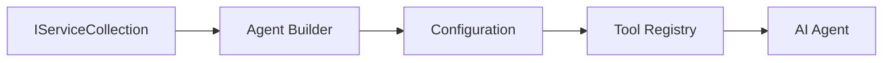

<!--
CO_OP_TRANSLATOR_METADATA:
{
  "original_hash": "bcc874e190347bd6a095aed56dc16de8",
  "translation_date": "2025-11-13T12:08:39+00:00",
  "source_file": "03-agentic-design-patterns/code_samples/03-dotnet-agent-framework.md",
  "language_code": "pa"
}
-->
# 🎨 GitHub ਮਾਡਲਾਂ ਨਾਲ Agentic ਡਿਜ਼ਾਈਨ ਪੈਟਰਨ (.NET)

## 📋 ਸਿੱਖਣ ਦੇ ਉਦੇਸ਼

ਇਹ ਉਦਾਹਰਨ Microsoft Agent Framework ਨੂੰ .NET ਵਿੱਚ GitHub ਮਾਡਲਾਂ ਦੇ ਇੰਟੀਗ੍ਰੇਸ਼ਨ ਨਾਲ ਵਰਤ ਕੇ ਬੁੱਧੀਮਾਨ ਏਜੰਟ ਬਣਾਉਣ ਲਈ ਉੱਚ-ਪੱਧਰੀ ਡਿਜ਼ਾਈਨ ਪੈਟਰਨ ਦਿਖਾਉਂਦੀ ਹੈ। ਤੁਸੀਂ ਪੇਸ਼ੇਵਰ ਪੈਟਰਨ ਅਤੇ ਆਰਕੀਟੈਕਚਰਲ ਪਹੁੰਚਾਂ ਸਿੱਖੋਗੇ ਜੋ ਏਜੰਟਾਂ ਨੂੰ ਉਤਪਾਦਨ-ਤਿਆਰ, ਸੰਭਾਲਯੋਗ ਅਤੇ ਸਕੇਲ ਕਰਨ ਯੋਗ ਬਣਾਉਂਦੀਆਂ ਹਨ।

### ਇੰਟਰਪ੍ਰਾਈਜ਼ ਡਿਜ਼ਾਈਨ ਪੈਟਰਨ

- 🏭 **ਫੈਕਟਰੀ ਪੈਟਰਨ**: ਡਿਪੈਂਡੈਂਸੀ ਇੰਜੈਕਸ਼ਨ ਨਾਲ ਮਿਆਰੀ ਏਜੰਟ ਬਣਾਉਣ
- 🔧 **ਬਿਲਡਰ ਪੈਟਰਨ**: ਫਲੂਐਂਟ ਏਜੰਟ ਕਨਫਿਗਰੇਸ਼ਨ ਅਤੇ ਸੈਟਅੱਪ
- 🧵 **ਥ੍ਰੈਡ-ਸੇਫ ਪੈਟਰਨ**: ਸਮਕਾਲੀ ਗੱਲਬਾਤ ਪ੍ਰਬੰਧਨ
- 📋 **ਰਿਪੋਜ਼ਟਰੀ ਪੈਟਰਨ**: ਸੰਗਠਿਤ ਟੂਲ ਅਤੇ ਸਮਰੱਥਾ ਪ੍ਰਬੰਧਨ

## 🎯 .NET-ਵਿਸ਼ੇਸ਼ ਆਰਕੀਟੈਕਚਰਲ ਫਾਇਦੇ

### ਇੰਟਰਪ੍ਰਾਈਜ਼ ਫੀਚਰ

- **ਮਜ਼ਬੂਤ ਟਾਈਪਿੰਗ**: ਕੰਪਾਈਲ-ਟਾਈਮ ਵੈਰੀਫਿਕੇਸ਼ਨ ਅਤੇ IntelliSense ਸਹਾਇਤਾ
- **ਡਿਪੈਂਡੈਂਸੀ ਇੰਜੈਕਸ਼ਨ**: ਬਿਲਟ-ਇਨ DI ਕੰਟੇਨਰ ਇੰਟੀਗ੍ਰੇਸ਼ਨ
- **ਕਨਫਿਗਰੇਸ਼ਨ ਪ੍ਰਬੰਧਨ**: IConfiguration ਅਤੇ Options ਪੈਟਰਨ
- **Async/Await**: ਪਹਿਲੀ-ਕਲਾਸ ਅਸਿੰਕ੍ਰੋਨਸ ਪ੍ਰੋਗ੍ਰਾਮਿੰਗ ਸਹਾਇਤਾ

### ਉਤਪਾਦਨ-ਤਿਆਰ ਪੈਟਰਨ

- **ਲੌਗਿੰਗ ਇੰਟੀਗ੍ਰੇਸ਼ਨ**: ILogger ਅਤੇ ਸਟ੍ਰਕਚਰਡ ਲੌਗਿੰਗ ਸਹਾਇਤਾ
- **ਹੈਲਥ ਚੈਕਸ**: ਬਿਲਟ-ਇਨ ਮਾਨੀਟਰਿੰਗ ਅਤੇ ਡਾਇਗਨੋਸਟਿਕਸ
- **ਕਨਫਿਗਰੇਸ਼ਨ ਵੈਰੀਫਿਕੇਸ਼ਨ**: ਡਾਟਾ ਐਨੋਟੇਸ਼ਨ ਨਾਲ ਮਜ਼ਬੂਤ ਟਾਈਪਿੰਗ
- **ਗਲਤੀ ਸੰਭਾਲ**: ਸਟ੍ਰਕਚਰਡ ਐਕਸਪਸ਼ਨ ਪ੍ਰਬੰਧਨ

## 🔧 ਤਕਨੀਕੀ ਆਰਕੀਟੈਕਚਰ

### ਕੋਰ .NET ਕੰਪੋਨੈਂਟਸ

- **Microsoft.Extensions.AI**: ਏਕਰੂਪ AI ਸੇਵਾ ਐਬਸਟ੍ਰੈਕਸ਼ਨ
- **Microsoft.Agents.AI**: ਇੰਟਰਪ੍ਰਾਈਜ਼ ਏਜੰਟ ਆਰਕੇਸਟ੍ਰੇਸ਼ਨ ਫਰੇਮਵਰਕ
- **GitHub ਮਾਡਲਾਂ ਦਾ ਇੰਟੀਗ੍ਰੇਸ਼ਨ**: ਉੱਚ-ਪ੍ਰਦਰਸ਼ਨ API ਕਲਾਇੰਟ ਪੈਟਰਨ
- **ਕਨਫਿਗਰੇਸ਼ਨ ਸਿਸਟਮ**: appsettings.json ਅਤੇ ਵਾਤਾਵਰਣ ਇੰਟੀਗ੍ਰੇਸ਼ਨ

### ਡਿਜ਼ਾਈਨ ਪੈਟਰਨ ਇੰਪਲੀਮੈਂਟੇਸ਼ਨ



## 🏗️ ਦਿਖਾਏ ਗਏ ਇੰਟਰਪ੍ਰਾਈਜ਼ ਪੈਟਰਨ

### 1. **ਕ੍ਰੀਏਸ਼ਨਲ ਪੈਟਰਨ**

- **ਏਜੰਟ ਫੈਕਟਰੀ**: ਸਥਿਰ ਕਨਫਿਗਰੇਸ਼ਨ ਨਾਲ ਕੇਂਦਰੀ ਏਜੰਟ ਬਣਾਉਣ
- **ਬਿਲਡਰ ਪੈਟਰਨ**: ਜਟਿਲ ਏਜੰਟ ਕਨਫਿਗਰੇਸ਼ਨ ਲਈ ਫਲੂਐਂਟ API
- **ਸਿੰਗਲਟਨ ਪੈਟਰਨ**: ਸਾਂਝੇ ਸਰੋਤ ਅਤੇ ਕਨਫਿਗਰੇਸ਼ਨ ਪ੍ਰਬੰਧਨ
- **ਡਿਪੈਂਡੈਂਸੀ ਇੰਜੈਕਸ਼ਨ**: ਢਿੱਲੀ ਕਪਲਿੰਗ ਅਤੇ ਟੈਸਟ ਕਰਨ ਯੋਗਤਾ

### 2. **ਬਿਹੇਵਿਅਰਲ ਪੈਟਰਨ**

- **ਸਟ੍ਰੈਟਜੀ ਪੈਟਰਨ**: ਬਦਲਣਯੋਗ ਟੂਲ ਐਗਜ਼ਿਕਿਊਸ਼ਨ ਸਟ੍ਰੈਟਜੀ
- **ਕਮਾਂਡ ਪੈਟਰਨ**: ਅਣਡੂ/ਰੀਡੂ ਸਮਰੱਥਾ ਨਾਲ ਏਜੰਟ ਓਪਰੇਸ਼ਨ ਨੂੰ ਐਨਕੈਪਸੂਲੇਟ ਕਰਨਾ
- **ਆਬਜ਼ਰਵਰ ਪੈਟਰਨ**: ਇਵੈਂਟ-ਡ੍ਰਿਵਨ ਏਜੰਟ ਲਾਈਫਸਾਈਕਲ ਪ੍ਰਬੰਧਨ
- **ਟੈਂਪਲੇਟ ਮੈਥਡ**: ਮਿਆਰੀ ਏਜੰਟ ਐਗਜ਼ਿਕਿਊਸ਼ਨ ਵਰਕਫਲੋਜ਼

### 3. **ਸਟਰਕਚਰਲ ਪੈਟਰਨ**

- **ਅਡਾਪਟਰ ਪੈਟਰਨ**: GitHub ਮਾਡਲਾਂ API ਇੰਟੀਗ੍ਰੇਸ਼ਨ ਲੇਅਰ
- **ਡਿਕੋਰੇਟਰ ਪੈਟਰਨ**: ਏਜੰਟ ਸਮਰੱਥਾ ਵਧਾਉਣਾ
- **ਫਸਾਡ ਪੈਟਰਨ**: ਸਰਲ ਏਜੰਟ ਇੰਟਰੈਕਸ਼ਨ ਇੰਟਰਫੇਸ
- **ਪ੍ਰਾਕਸੀ ਪੈਟਰਨ**: ਪ੍ਰਦਰਸ਼ਨ ਲਈ ਲੇਜ਼ੀ ਲੋਡਿੰਗ ਅਤੇ ਕੈਸ਼ਿੰਗ

## 📚 .NET ਡਿਜ਼ਾਈਨ ਸਿਧਾਂਤ

### SOLID ਸਿਧਾਂਤ

- **ਸਿੰਗਲ ਰਿਸਪਾਂਸਬਿਲਿਟੀ**: ਹਰ ਕੰਪੋਨੈਂਟ ਦਾ ਇੱਕ ਸਪਸ਼ਟ ਉਦੇਸ਼
- **ਓਪਨ/ਕਲੋਜ਼ਡ**: ਬਦਲਣਯੋਗ ਬਿਨਾਂ ਸੋਧ ਦੇ
- **ਲਿਸਕੋਵ ਸਬਸਟੀਟਿਊਸ਼ਨ**: ਇੰਟਰਫੇਸ-ਅਧਾਰਿਤ ਟੂਲ ਇੰਪਲੀਮੈਂਟੇਸ਼ਨ
- **ਇੰਟਰਫੇਸ ਸੈਗਰੇਗੇਸ਼ਨ**: ਕੇਂਦ੍ਰਿਤ, ਸੰਗਠਿਤ ਇੰਟਰਫੇਸ
- **ਡਿਪੈਂਡੈਂਸੀ ਇਨਵਰਸ਼ਨ**: ਐਬਸਟ੍ਰੈਕਸ਼ਨ 'ਤੇ ਨਿਰਭਰ ਕਰੋ, ਨਾਂ ਕਿ ਕਨਕ੍ਰੀਟਸ 'ਤੇ

### ਕਲੀਨ ਆਰਕੀਟੈਕਚਰ

- **ਡੋਮੇਨ ਲੇਅਰ**: ਕੋਰ ਏਜੰਟ ਅਤੇ ਟੂਲ ਐਬਸਟ੍ਰੈਕਸ਼ਨ
- **ਐਪਲੀਕੇਸ਼ਨ ਲੇਅਰ**: ਏਜੰਟ ਆਰਕੇਸਟ੍ਰੇਸ਼ਨ ਅਤੇ ਵਰਕਫਲੋਜ਼
- **ਇੰਫਰਾਸਟਰਕਚਰ ਲੇਅਰ**: GitHub ਮਾਡਲਾਂ ਦਾ ਇੰਟੀਗ੍ਰੇਸ਼ਨ ਅਤੇ ਬਾਹਰੀ ਸੇਵਾਵਾਂ
- **ਪ੍ਰੇਜ਼ੈਂਟੇਸ਼ਨ ਲੇਅਰ**: ਯੂਜ਼ਰ ਇੰਟਰੈਕਸ਼ਨ ਅਤੇ ਰਿਸਪਾਂਸ ਫਾਰਮੈਟਿੰਗ

## 🔒 ਇੰਟਰਪ੍ਰਾਈਜ਼ ਵਿਚਾਰ

### ਸੁਰੱਖਿਆ

- **ਕ੍ਰਿਡੈਂਸ਼ਲ ਪ੍ਰਬੰਧਨ**: IConfiguration ਨਾਲ ਸੁਰੱਖਿਅਤ API ਕੁੰਜੀ ਸੰਭਾਲ
- **ਇਨਪੁਟ ਵੈਰੀਫਿਕੇਸ਼ਨ**: ਮਜ਼ਬੂਤ ਟਾਈਪਿੰਗ ਅਤੇ ਡਾਟਾ ਐਨੋਟੇਸ਼ਨ ਵੈਰੀਡੇਸ਼ਨ
- **ਆਉਟਪੁੱਟ ਸੈਨੀਟਾਈਜ਼ੇਸ਼ਨ**: ਸੁਰੱਖਿਅਤ ਰਿਸਪਾਂਸ ਪ੍ਰੋਸੈਸਿੰਗ ਅਤੇ ਫਿਲਟਰਿੰਗ
- **ਆਡਿਟ ਲੌਗਿੰਗ**: ਵਿਸਤ੍ਰਿਤ ਓਪਰੇਸ਼ਨ ਟ੍ਰੈਕਿੰਗ

### ਪ੍ਰਦਰਸ਼ਨ

- **ਅਸਿੰਕ ਪੈਟਰਨ**: ਗੈਰ-ਅਵਰੋਧਕ I/O ਓਪਰੇਸ਼ਨ
- **ਕਨੈਕਸ਼ਨ ਪੂਲਿੰਗ**: ਕੁਸ਼ਲ HTTP ਕਲਾਇੰਟ ਪ੍ਰਬੰਧਨ
- **ਕੈਸ਼ਿੰਗ**: ਪ੍ਰਦਰਸ਼ਨ ਵਿੱਚ ਸੁਧਾਰ ਲਈ ਰਿਸਪਾਂਸ ਕੈਸ਼ਿੰਗ
- **ਸਰੋਤ ਪ੍ਰਬੰਧਨ**: ਸਹੀ ਨਿਪਟਾਰਾ ਅਤੇ ਸਾਫ਼-ਸੁਥਰਾ ਪੈਟਰਨ

### ਸਕੇਲਬਿਲਿਟੀ

- **ਥ੍ਰੈਡ ਸੇਫਟੀ**: ਸਮਕਾਲੀ ਏਜੰਟ ਐਗਜ਼ਿਕਿਊਸ਼ਨ ਸਹਾਇਤਾ
- **ਸਰੋਤ ਪੂਲਿੰਗ**: ਕੁਸ਼ਲ ਸਰੋਤ ਵਰਤੋਂ
- **ਲੋਡ ਪ੍ਰਬੰਧਨ**: ਰੇਟ ਲਿਮਿਟਿੰਗ ਅਤੇ ਬੈਕਪ੍ਰੈਸ਼ਰ ਹੈਂਡਲਿੰਗ
- **ਮਾਨੀਟਰਿੰਗ**: ਪ੍ਰਦਰਸ਼ਨ ਮੈਟ੍ਰਿਕਸ ਅਤੇ ਹੈਲਥ ਚੈਕਸ

## 🚀 ਉਤਪਾਦਨ ਡਿਪਲੋਇਮੈਂਟ

- **ਕਨਫਿਗਰੇਸ਼ਨ ਪ੍ਰਬੰਧਨ**: ਵਾਤਾਵਰਣ-ਵਿਸ਼ੇਸ਼ ਸੈਟਿੰਗਜ਼
- **ਲੌਗਿੰਗ ਸਟ੍ਰੈਟਜੀ**: ਕੋਰਲੇਸ਼ਨ IDs ਨਾਲ ਸਟ੍ਰਕਚਰਡ ਲੌਗਿੰਗ
- **ਗਲਤੀ ਸੰਭਾਲ**: ਗਲੋਬਲ ਐਕਸਪਸ਼ਨ ਹੈਂਡਲਿੰਗ ਨਾਲ ਸਹੀ ਰਿਕਵਰੀ
- **ਮਾਨੀਟਰਿੰਗ**: ਐਪਲੀਕੇਸ਼ਨ ਇਨਸਾਈਟਸ ਅਤੇ ਪ੍ਰਦਰਸ਼ਨ ਕਾਊਂਟਰ
- **ਟੈਸਟਿੰਗ**: ਯੂਨਿਟ ਟੈਸਟ, ਇੰਟੀਗ੍ਰੇਸ਼ਨ ਟੈਸਟ, ਅਤੇ ਲੋਡ ਟੈਸਟ ਪੈਟਰਨ

.NET ਨਾਲ ਇੰਟਰਪ੍ਰਾਈਜ਼-ਗ੍ਰੇਡ ਬੁੱਧੀਮਾਨ ਏਜੰਟ ਬਣਾਉਣ ਲਈ ਤਿਆਰ ਹੋ? ਆਓ ਕੁਝ ਮਜ਼ਬੂਤ ਆਰਕੀਟੈਕਚਰ ਬਣਾਈਏ! 🏢✨

## 🚀 ਸ਼ੁਰੂਆਤ ਕਰਨਾ

### ਪੂਰਵ ਸ਼ਰਤਾਂ

- [.NET 10 SDK](https://dotnet.microsoft.com/download/dotnet/10.0) ਜਾਂ ਇਸ ਤੋਂ ਉੱਚਾ
- [GitHub ਮਾਡਲਾਂ API ਐਕਸੈਸ ਟੋਕਨ](https://docs.github.com/github-models/github-models-at-scale/using-your-own-api-keys-in-github-models)

### ਲੋੜੀਂਦੇ ਵਾਤਾਵਰਣ ਵੈਰੀਏਬਲ

```bash
# zsh/bash
export GH_TOKEN=<your_github_token>
export GH_ENDPOINT=https://models.github.ai/inference
export GH_MODEL_ID=openai/gpt-5-mini
```

```powershell
# PowerShell
$env:GH_TOKEN = "<your_github_token>"
$env:GH_ENDPOINT = "https://models.github.ai/inference"
$env:GH_MODEL_ID = "openai/gpt-5-mini"
```

### ਨਮੂਨਾ ਕੋਡ

ਕੋਡ ਉਦਾਹਰਨ ਚਲਾਉਣ ਲਈ,

```bash
# zsh/bash
chmod +x ./03-dotnet-agent-framework.cs
./03-dotnet-agent-framework.cs
```

ਜਾਂ dotnet CLI ਦੀ ਵਰਤੋਂ ਕਰਦੇ ਹੋਏ:

```bash
dotnet run ./03-dotnet-agent-framework.cs
```

ਪੂਰੇ ਕੋਡ ਲਈ, ਵੇਖੋ [`03-dotnet-agent-framework.cs`](../../../../03-agentic-design-patterns/code_samples/03-dotnet-agent-framework.cs)।

```csharp
#!/usr/bin/dotnet run

#:package Microsoft.Extensions.AI@10.*
#:package Microsoft.Agents.AI.OpenAI@1.*-*

using System.ClientModel;
using System.ComponentModel;

using Microsoft.Agents.AI;
using Microsoft.Extensions.AI;

using OpenAI;

// Tool Function: Random Destination Generator
// This static method will be available to the agent as a callable tool
// The [Description] attribute helps the AI understand when to use this function
// This demonstrates how to create custom tools for AI agents
[Description("Provides a random vacation destination.")]
static string GetRandomDestination()
{
    // List of popular vacation destinations around the world
    // The agent will randomly select from these options
    var destinations = new List<string>
    {
        "Paris, France",
        "Tokyo, Japan",
        "New York City, USA",
        "Sydney, Australia",
        "Rome, Italy",
        "Barcelona, Spain",
        "Cape Town, South Africa",
        "Rio de Janeiro, Brazil",
        "Bangkok, Thailand",
        "Vancouver, Canada"
    };

    // Generate random index and return selected destination
    // Uses System.Random for simple random selection
    var random = new Random();
    int index = random.Next(destinations.Count);
    return destinations[index];
}

// Extract configuration from environment variables
// Retrieve the GitHub Models API endpoint, defaults to https://models.github.ai/inference if not specified
// Retrieve the model ID, defaults to openai/gpt-5-mini if not specified
// Retrieve the GitHub token for authentication, throws exception if not specified
var github_endpoint = Environment.GetEnvironmentVariable("GH_ENDPOINT") ?? "https://models.github.ai/inference";
var github_model_id = Environment.GetEnvironmentVariable("GH_MODEL_ID") ?? "openai/gpt-5-mini";
var github_token = Environment.GetEnvironmentVariable("GH_TOKEN") ?? throw new InvalidOperationException("GH_TOKEN is not set.");

// Configure OpenAI Client Options
// Create configuration options to point to GitHub Models endpoint
// This redirects OpenAI client calls to GitHub's model inference service
var openAIOptions = new OpenAIClientOptions()
{
    Endpoint = new Uri(github_endpoint)
};

// Initialize OpenAI Client with GitHub Models Configuration
// Create OpenAI client using GitHub token for authentication
// Configure it to use GitHub Models endpoint instead of OpenAI directly
var openAIClient = new OpenAIClient(new ApiKeyCredential(github_token), openAIOptions);

// Define Agent Identity and Comprehensive Instructions
// Agent name for identification and logging purposes
var AGENT_NAME = "TravelAgent";

// Detailed instructions that define the agent's personality, capabilities, and behavior
// This system prompt shapes how the agent responds and interacts with users
var AGENT_INSTRUCTIONS = """
You are a helpful AI Agent that can help plan vacations for customers.

Important: When users specify a destination, always plan for that location. Only suggest random destinations when the user hasn't specified a preference.

When the conversation begins, introduce yourself with this message:
"Hello! I'm your TravelAgent assistant. I can help plan vacations and suggest interesting destinations for you. Here are some things you can ask me:
1. Plan a day trip to a specific location
2. Suggest a random vacation destination
3. Find destinations with specific features (beaches, mountains, historical sites, etc.)
4. Plan an alternative trip if you don't like my first suggestion

What kind of trip would you like me to help you plan today?"

Always prioritize user preferences. If they mention a specific destination like "Bali" or "Paris," focus your planning on that location rather than suggesting alternatives.
""";

// Create AI Agent with Advanced Travel Planning Capabilities
// Initialize complete agent pipeline: OpenAI client → Chat client → AI agent
// Configure agent with name, detailed instructions, and available tools
// This demonstrates the .NET agent creation pattern with full configuration
AIAgent agent = openAIClient
    .GetChatClient(github_model_id)
    .CreateAIAgent(
        name: AGENT_NAME,
        instructions: AGENT_INSTRUCTIONS,
        tools: [AIFunctionFactory.Create(GetRandomDestination)]
    );

// Create New Conversation Thread for Context Management
// Initialize a new conversation thread to maintain context across multiple interactions
// Threads enable the agent to remember previous exchanges and maintain conversational state
// This is essential for multi-turn conversations and contextual understanding
AgentThread thread = agent.GetNewThread();

// Execute Agent: First Travel Planning Request
// Run the agent with an initial request that will likely trigger the random destination tool
// The agent will analyze the request, use the GetRandomDestination tool, and create an itinerary
// Using the thread parameter maintains conversation context for subsequent interactions
await foreach (var update in agent.RunStreamingAsync("Plan me a day trip", thread))
{
    await Task.Delay(10);
    Console.Write(update);
}

Console.WriteLine();

// Execute Agent: Follow-up Request with Context Awareness
// Demonstrate contextual conversation by referencing the previous response
// The agent remembers the previous destination suggestion and will provide an alternative
// This showcases the power of conversation threads and contextual understanding in .NET agents
await foreach (var update in agent.RunStreamingAsync("I don't like that destination. Plan me another vacation.", thread))
{
    await Task.Delay(10);
    Console.Write(update);
}
```

---

<!-- CO-OP TRANSLATOR DISCLAIMER START -->
**ਅਸਵੀਕਰਤੀ**:  
ਇਹ ਦਸਤਾਵੇਜ਼ AI ਅਨੁਵਾਦ ਸੇਵਾ [Co-op Translator](https://github.com/Azure/co-op-translator) ਦੀ ਵਰਤੋਂ ਕਰਕੇ ਅਨੁਵਾਦ ਕੀਤਾ ਗਿਆ ਹੈ। ਜਦੋਂ ਕਿ ਅਸੀਂ ਸਹੀ ਹੋਣ ਦਾ ਯਤਨ ਕਰਦੇ ਹਾਂ, ਕਿਰਪਾ ਕਰਕੇ ਧਿਆਨ ਦਿਓ ਕਿ ਸਵੈਚਾਲਿਤ ਅਨੁਵਾਦਾਂ ਵਿੱਚ ਗਲਤੀਆਂ ਜਾਂ ਅਸੁਚੱਜੇਪਣ ਹੋ ਸਕਦੇ ਹਨ। ਇਸ ਦੀ ਮੂਲ ਭਾਸ਼ਾ ਵਿੱਚ ਮੌਜੂਦ ਮੂਲ ਦਸਤਾਵੇਜ਼ ਨੂੰ ਅਧਿਕਾਰਕ ਸਰੋਤ ਮੰਨਿਆ ਜਾਣਾ ਚਾਹੀਦਾ ਹੈ। ਮਹੱਤਵਪੂਰਨ ਜਾਣਕਾਰੀ ਲਈ, ਪੇਸ਼ੇਵਰ ਮਨੁੱਖੀ ਅਨੁਵਾਦ ਦੀ ਸਿਫਾਰਸ਼ ਕੀਤੀ ਜਾਂਦੀ ਹੈ। ਅਸੀਂ ਇਸ ਅਨੁਵਾਦ ਦੀ ਵਰਤੋਂ ਤੋਂ ਪੈਦਾ ਹੋਣ ਵਾਲੇ ਕਿਸੇ ਵੀ ਗਲਤਫਹਿਮੀ ਜਾਂ ਗਲਤ ਵਿਆਖਿਆ ਲਈ ਜ਼ਿੰਮੇਵਾਰ ਨਹੀਂ ਹਾਂ।
<!-- CO-OP TRANSLATOR DISCLAIMER END -->