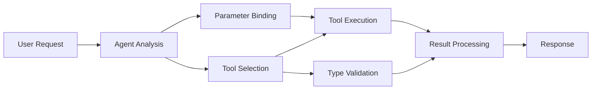

<!--
CO_OP_TRANSLATOR_METADATA:
{
  "original_hash": "91d6061e402489603f2ec8b528cae59b",
  "translation_date": "2025-11-18T17:16:16+00:00",
  "source_file": "04-tool-use/code_samples/04-dotnet-agent-framework.md",
  "language_code": "pa"
}
-->
# 🛠️ GitHub ਮਾਡਲਾਂ ਨਾਲ ਅਗਰਗਾਮੀ ਟੂਲ ਵਰਤੋਂ (.NET)

## 📋 ਸਿੱਖਣ ਦੇ ਉਦੇਸ਼

ਇਹ ਨੋਟਬੁੱਕ Microsoft Agent Framework ਨੂੰ .NET ਵਿੱਚ GitHub ਮਾਡਲਾਂ ਨਾਲ ਵਰਤ ਕੇ ਉੱਚ-ਪੱਧਰੀ ਟੂਲ ਇੰਟੀਗ੍ਰੇਸ਼ਨ ਪੈਟਰਨ ਦਿਖਾਉਂਦੀ ਹੈ। ਤੁਸੀਂ ਕਈ ਵਿਸ਼ੇਸ਼ ਟੂਲਾਂ ਨਾਲ ਉੱਚ-ਪੱਧਰੀ ਏਜੰਟ ਬਣਾਉਣ ਸਿੱਖੋਗੇ, C# ਦੀ ਮਜ਼ਬੂਤ ਟਾਈਪਿੰਗ ਅਤੇ .NET ਦੀਆਂ ਕਾਰੋਬਾਰੀ ਵਿਸ਼ੇਸ਼ਤਾਵਾਂ ਦਾ ਲਾਭ ਲੈਂਦੇ ਹੋਏ।

### ਅਗਰਗਾਮੀ ਟੂਲ ਸਮਰੱਥਾਵਾਂ ਜੋ ਤੁਸੀਂ ਸਿੱਖੋਗੇ

- 🔧 **ਮਲਟੀ-ਟੂਲ ਆਰਕੀਟੈਕਚਰ**: ਕਈ ਵਿਸ਼ੇਸ਼ ਸਮਰੱਥਾਵਾਂ ਵਾਲੇ ਏਜੰਟ ਬਣਾਉਣਾ
- 🎯 **ਟਾਈਪ-ਸੇਫ ਟੂਲ ਐਗਜ਼ਿਕਿਊਸ਼ਨ**: C# ਦੀ ਕੰਪਾਇਲ-ਟਾਈਮ ਵੈਰੀਫਿਕੇਸ਼ਨ ਦਾ ਲਾਭ ਲੈਣਾ
- 📊 **ਕਾਰੋਬਾਰੀ ਟੂਲ ਪੈਟਰਨ**: ਉਤਪਾਦਨ-ਤਿਆਰ ਟੂਲ ਡਿਜ਼ਾਈਨ ਅਤੇ ਗਲਤੀ ਸੰਭਾਲ
- 🔗 **ਟੂਲ ਕੰਪੋਜ਼ੀਸ਼ਨ**: ਜਟਿਲ ਕਾਰੋਬਾਰੀ ਵਰਕਫਲੋਜ਼ ਲਈ ਟੂਲਾਂ ਨੂੰ ਜੋੜਨਾ

## 🎯 .NET ਟੂਲ ਆਰਕੀਟੈਕਚਰ ਦੇ ਫਾਇਦੇ

### ਕਾਰੋਬਾਰੀ ਟੂਲ ਵਿਸ਼ੇਸ਼ਤਾਵਾਂ

- **ਕੰਪਾਇਲ-ਟਾਈਮ ਵੈਰੀਡੇਸ਼ਨ**: ਮਜ਼ਬੂਤ ਟਾਈਪਿੰਗ ਟੂਲ ਪੈਰਾਮੀਟਰ ਦੀ ਸਹੀਤਾ ਨੂੰ ਯਕੀਨੀ ਬਣਾਉਂਦੀ ਹੈ
- **ਡਿਪੈਂਡੈਂਸੀ ਇੰਜੈਕਸ਼ਨ**: IoC ਕੰਟੇਨਰ ਇੰਟੀਗ੍ਰੇਸ਼ਨ ਟੂਲ ਪ੍ਰਬੰਧਨ ਲਈ
- **Async/Await ਪੈਟਰਨ**: ਸਹੀ ਸਰੋਤ ਪ੍ਰਬੰਧਨ ਨਾਲ ਗੈਰ-ਬਲੌਕਿੰਗ ਟੂਲ ਐਗਜ਼ਿਕਿਊਸ਼ਨ
- **ਸੰਰਚਿਤ ਲੌਗਿੰਗ**: ਟੂਲ ਐਗਜ਼ਿਕਿਊਸ਼ਨ ਮਾਨੀਟਰਿੰਗ ਲਈ ਬਿਲਟ-ਇਨ ਲੌਗਿੰਗ ਇੰਟੀਗ੍ਰੇਸ਼ਨ

### ਉਤਪਾਦਨ-ਤਿਆਰ ਪੈਟਰਨ

- **ਐਕਸਪਸ਼ਨ ਹੈਂਡਲਿੰਗ**: ਟਾਈਪਡ ਐਕਸਪਸ਼ਨ ਨਾਲ ਵਿਸਤ੍ਰਿਤ ਗਲਤੀ ਪ੍ਰਬੰਧਨ
- **ਸਰੋਤ ਪ੍ਰਬੰਧਨ**: ਸਹੀ ਨਿਪਟਾਰਾ ਪੈਟਰਨ ਅਤੇ ਮੈਮੋਰੀ ਪ੍ਰਬੰਧਨ
- **ਪ੍ਰਦਰਸ਼ਨ ਮਾਨੀਟਰਿੰਗ**: ਬਿਲਟ-ਇਨ ਮੈਟ੍ਰਿਕਸ ਅਤੇ ਪ੍ਰਦਰਸ਼ਨ ਕਾਊਂਟਰ
- **ਕੰਫਿਗਰੇਸ਼ਨ ਪ੍ਰਬੰਧਨ**: ਵੈਰੀਡੇਸ਼ਨ ਨਾਲ ਟਾਈਪ-ਸੇਫ ਕੰਫਿਗਰੇਸ਼ਨ

## 🔧 ਤਕਨੀਕੀ ਆਰਕੀਟੈਕਚਰ

### ਕੋਰ .NET ਟੂਲ ਕੰਪੋਨੈਂਟ

- **Microsoft.Extensions.AI**: ਇਕਸਾਰ ਟੂਲ ਐਬਸਟ੍ਰੈਕਸ਼ਨ ਲੇਅਰ
- **Microsoft.Agents.AI**: ਕਾਰੋਬਾਰੀ-ਗਰੇਡ ਟੂਲ ਆਰਕੈਸਟ੍ਰੇਸ਼ਨ
- **GitHub ਮਾਡਲਾਂ ਇੰਟੀਗ੍ਰੇਸ਼ਨ**: ਉੱਚ-ਪ੍ਰਦਰਸ਼ਨ API ਕਲਾਇੰਟ ਨਾਲ ਕਨੈਕਸ਼ਨ ਪੂਲਿੰਗ

### ਟੂਲ ਐਗਜ਼ਿਕਿਊਸ਼ਨ ਪਾਈਪਲਾਈਨ



## 🛠️ ਟੂਲ ਸ਼੍ਰੇਣੀਆਂ ਅਤੇ ਪੈਟਰਨ

### 1. **ਡਾਟਾ ਪ੍ਰੋਸੈਸਿੰਗ ਟੂਲ**

- **ਇਨਪੁਟ ਵੈਰੀਡੇਸ਼ਨ**: ਡਾਟਾ ਐਨੋਟੇਸ਼ਨ ਨਾਲ ਮਜ਼ਬੂਤ ਟਾਈਪਿੰਗ
- **ਟ੍ਰਾਂਸਫਾਰਮ ਓਪਰੇਸ਼ਨ**: ਟਾਈਪ-ਸੇਫ ਡਾਟਾ ਕਨਵਰਜ਼ਨ ਅਤੇ ਫਾਰਮੈਟਿੰਗ
- **ਬਿਜ਼ਨਸ ਲਾਜਿਕ**: ਡੋਮੇਨ-ਵਿਸ਼ੇਸ਼ ਗਣਨਾ ਅਤੇ ਵਿਸ਼ਲੇਸ਼ਣ ਟੂਲ
- **ਆਉਟਪੁੱਟ ਫਾਰਮੈਟਿੰਗ**: ਸੰਰਚਿਤ ਜਵਾਬ ਜਨਰੇਸ਼ਨ

### 2. **ਇੰਟੀਗ੍ਰੇਸ਼ਨ ਟੂਲ**

- **API ਕਨੈਕਟਰ**: HttpClient ਨਾਲ RESTful ਸੇਵਾ ਇੰਟੀਗ੍ਰੇਸ਼ਨ
- **ਡਾਟਾਬੇਸ ਟੂਲ**: ਡਾਟਾ ਐਕਸੈਸ ਲਈ Entity Framework ਇੰਟੀਗ੍ਰੇਸ਼ਨ
- **ਫਾਈਲ ਓਪਰੇਸ਼ਨ**: ਵੈਰੀਡੇਸ਼ਨ ਨਾਲ ਸੁਰੱਖਿਅਤ ਫਾਈਲ ਸਿਸਟਮ ਓਪਰੇਸ਼ਨ
- **ਬਾਹਰੀ ਸੇਵਾਵਾਂ**: ਤੀਜੀ-ਪਾਰਟੀ ਸੇਵਾ ਇੰਟੀਗ੍ਰੇਸ਼ਨ ਪੈਟਰਨ

### 3. **ਯੂਟਿਲਿਟੀ ਟੂਲ**

- **ਟੈਕਸਟ ਪ੍ਰੋਸੈਸਿੰਗ**: ਸਟ੍ਰਿੰਗ ਮੈਨਿਪੂਲੇਸ਼ਨ ਅਤੇ ਫਾਰਮੈਟਿੰਗ ਯੂਟਿਲਿਟੀ
- **ਮਿਤੀ/ਸਮਾਂ ਓਪਰੇਸ਼ਨ**: ਸੱਭਿਆਚਾਰ-ਜਾਗਰੂਕ ਮਿਤੀ/ਸਮਾਂ ਗਣਨ
- **ਗਣਿਤ ਟੂਲ**: ਸਹੀ ਗਣਨਾ ਅਤੇ ਅੰਕੜੇਵਾਰ ਓਪਰੇਸ਼ਨ
- **ਵੈਰੀਡੇਸ਼ਨ ਟੂਲ**: ਕਾਰੋਬਾਰੀ ਨਿਯਮ ਵੈਰੀਡੇਸ਼ਨ ਅਤੇ ਡਾਟਾ ਵੈਰੀਫਿਕੇਸ਼ਨ

ਤਿਆਰ ਹੋ ਜਾਓ .NET ਵਿੱਚ ਸ਼ਕਤੀਸ਼ਾਲੀ, ਟਾਈਪ-ਸੇਫ ਟੂਲ ਸਮਰੱਥਾਵਾਂ ਨਾਲ ਕਾਰੋਬਾਰੀ-ਗਰੇਡ ਏਜੰਟ ਬਣਾਉਣ ਲਈ! 🏢⚡

## 🚀 ਸ਼ੁਰੂਆਤ ਕਰਨਾ

### ਪੂਰਵ ਸ਼ਰਤਾਂ

- [.NET 10 SDK](https://dotnet.microsoft.com/download/dotnet/10.0) ਜਾਂ ਇਸ ਤੋਂ ਉੱਚਾ
- [GitHub ਮਾਡਲਾਂ API ਐਕਸੈਸ ਟੋਕਨ](https://docs.github.com/github-models/github-models-at-scale/using-your-own-api-keys-in-github-models)

### ਲੋੜੀਂਦੇ ਵਾਤਾਵਰਣ ਵੈਰੀਏਬਲ

```bash
# zsh/bash
export GH_TOKEN=<your_github_token>
export GH_ENDPOINT=https://models.github.ai/inference
export GH_MODEL_ID=openai/gpt-5-mini
```

```powershell
# PowerShell
$env:GH_TOKEN = "<your_github_token>"
$env:GH_ENDPOINT = "https://models.github.ai/inference"
$env:GH_MODEL_ID = "openai/gpt-5-mini"
```

### ਨਮੂਨਾ ਕੋਡ

ਕੋਡ ਉਦਾਹਰਨ ਚਲਾਉਣ ਲਈ,

```bash
# zsh/bash
chmod +x ./04-dotnet-agent-framework.cs
./04-dotnet-agent-framework.cs
```

ਜਾਂ dotnet CLI ਦੀ ਵਰਤੋਂ ਕਰਦੇ ਹੋਏ:

```bash
dotnet run ./04-dotnet-agent-framework.cs
```

ਪੂਰੇ ਕੋਡ ਲਈ [`04-dotnet-agent-framework.cs`](../../../../04-tool-use/code_samples/04-dotnet-agent-framework.cs) ਵੇਖੋ।

```csharp
#!/usr/bin/dotnet run

#:package Microsoft.Extensions.AI@10.*
#:package Microsoft.Agents.AI.OpenAI@1.*-*

using System.ClientModel;
using System.ComponentModel;

using Microsoft.Agents.AI;
using Microsoft.Extensions.AI;

using OpenAI;

// Tool Function: Random Destination Generator
// This static method will be available to the agent as a callable tool
// The [Description] attribute helps the AI understand when to use this function
// This demonstrates how to create custom tools for AI agents
[Description("Provides a random vacation destination.")]
static string GetRandomDestination()
{
    // List of popular vacation destinations around the world
    // The agent will randomly select from these options
    var destinations = new List<string>
    {
        "Paris, France",
        "Tokyo, Japan",
        "New York City, USA",
        "Sydney, Australia",
        "Rome, Italy",
        "Barcelona, Spain",
        "Cape Town, South Africa",
        "Rio de Janeiro, Brazil",
        "Bangkok, Thailand",
        "Vancouver, Canada"
    };

    // Generate random index and return selected destination
    // Uses System.Random for simple random selection
    var random = new Random();
    int index = random.Next(destinations.Count);
    return destinations[index];
}

// Extract configuration from environment variables
// Retrieve the GitHub Models API endpoint, defaults to https://models.github.ai/inference if not specified
// Retrieve the model ID, defaults to openai/gpt-5-mini if not specified
// Retrieve the GitHub token for authentication, throws exception if not specified
var github_endpoint = Environment.GetEnvironmentVariable("GH_ENDPOINT") ?? "https://models.github.ai/inference";
var github_model_id = Environment.GetEnvironmentVariable("GH_MODEL_ID") ?? "openai/gpt-5-mini";
var github_token = Environment.GetEnvironmentVariable("GH_TOKEN") ?? throw new InvalidOperationException("GH_TOKEN is not set.");

// Configure OpenAI Client Options
// Create configuration options to point to GitHub Models endpoint
// This redirects OpenAI client calls to GitHub's model inference service
var openAIOptions = new OpenAIClientOptions()
{
    Endpoint = new Uri(github_endpoint)
};

// Initialize OpenAI Client with GitHub Models Configuration
// Create OpenAI client using GitHub token for authentication
// Configure it to use GitHub Models endpoint instead of OpenAI directly
var openAIClient = new OpenAIClient(new ApiKeyCredential(github_token), openAIOptions);

// Define Agent Identity and Comprehensive Instructions
// Agent name for identification and logging purposes
var AGENT_NAME = "TravelAgent";

// Detailed instructions that define the agent's personality, capabilities, and behavior
// This system prompt shapes how the agent responds and interacts with users
var AGENT_INSTRUCTIONS = """
You are a helpful AI Agent that can help plan vacations for customers.

Important: When users specify a destination, always plan for that location. Only suggest random destinations when the user hasn't specified a preference.

When the conversation begins, introduce yourself with this message:
"Hello! I'm your TravelAgent assistant. I can help plan vacations and suggest interesting destinations for you. Here are some things you can ask me:
1. Plan a day trip to a specific location
2. Suggest a random vacation destination
3. Find destinations with specific features (beaches, mountains, historical sites, etc.)
4. Plan an alternative trip if you don't like my first suggestion

What kind of trip would you like me to help you plan today?"

Always prioritize user preferences. If they mention a specific destination like "Bali" or "Paris," focus your planning on that location rather than suggesting alternatives.
""";

// Create AI Agent with Advanced Travel Planning Capabilities
// Initialize complete agent pipeline: OpenAI client → Chat client → AI agent
// Configure agent with name, detailed instructions, and available tools
// This demonstrates the .NET agent creation pattern with full configuration
AIAgent agent = openAIClient
    .GetChatClient(github_model_id)
    .CreateAIAgent(
        name: AGENT_NAME,
        instructions: AGENT_INSTRUCTIONS,
        tools: [AIFunctionFactory.Create(GetRandomDestination)]
    );

// Create New Conversation Thread for Context Management
// Initialize a new conversation thread to maintain context across multiple interactions
// Threads enable the agent to remember previous exchanges and maintain conversational state
// This is essential for multi-turn conversations and contextual understanding
AgentThread thread = agent.GetNewThread();

// Execute Agent: First Travel Planning Request
// Run the agent with an initial request that will likely trigger the random destination tool
// The agent will analyze the request, use the GetRandomDestination tool, and create an itinerary
// Using the thread parameter maintains conversation context for subsequent interactions
await foreach (var update in agent.RunStreamingAsync("Plan me a day trip", thread))
{
    await Task.Delay(10);
    Console.Write(update);
}

Console.WriteLine();

// Execute Agent: Follow-up Request with Context Awareness
// Demonstrate contextual conversation by referencing the previous response
// The agent remembers the previous destination suggestion and will provide an alternative
// This showcases the power of conversation threads and contextual understanding in .NET agents
await foreach (var update in agent.RunStreamingAsync("I don't like that destination. Plan me another vacation.", thread))
{
    await Task.Delay(10);
    Console.Write(update);
}
```

---

<!-- CO-OP TRANSLATOR DISCLAIMER START -->
**ਅਸਵੀਕਰਤੀਕਰਨ**:  
ਇਹ ਦਸਤਾਵੇਜ਼ AI ਅਨੁਵਾਦ ਸੇਵਾ [Co-op Translator](https://github.com/Azure/co-op-translator) ਦੀ ਵਰਤੋਂ ਕਰਕੇ ਅਨੁਵਾਦ ਕੀਤਾ ਗਿਆ ਹੈ। ਜਦੋਂ ਕਿ ਅਸੀਂ ਸਹੀ ਹੋਣ ਦਾ ਯਤਨ ਕਰਦੇ ਹਾਂ, ਕਿਰਪਾ ਕਰਕੇ ਧਿਆਨ ਦਿਓ ਕਿ ਸਵੈਚਾਲਿਤ ਅਨੁਵਾਦਾਂ ਵਿੱਚ ਗਲਤੀਆਂ ਜਾਂ ਅਸੁਚੱਜੇਪਣ ਹੋ ਸਕਦੇ ਹਨ। ਇਸ ਦੀ ਮੂਲ ਭਾਸ਼ਾ ਵਿੱਚ ਮੌਜੂਦ ਮੂਲ ਦਸਤਾਵੇਜ਼ ਨੂੰ ਅਧਿਕਾਰਤ ਸਰੋਤ ਮੰਨਿਆ ਜਾਣਾ ਚਾਹੀਦਾ ਹੈ। ਮਹੱਤਵਪੂਰਨ ਜਾਣਕਾਰੀ ਲਈ, ਪੇਸ਼ੇਵਰ ਮਨੁੱਖੀ ਅਨੁਵਾਦ ਦੀ ਸਿਫਾਰਸ਼ ਕੀਤੀ ਜਾਂਦੀ ਹੈ। ਅਸੀਂ ਇਸ ਅਨੁਵਾਦ ਦੀ ਵਰਤੋਂ ਤੋਂ ਪੈਦਾ ਹੋਣ ਵਾਲੇ ਕਿਸੇ ਵੀ ਗਲਤਫਹਿਮੀ ਜਾਂ ਗਲਤ ਵਿਆਖਿਆ ਲਈ ਜ਼ਿੰਮੇਵਾਰ ਨਹੀਂ ਹਾਂ।
<!-- CO-OP TRANSLATOR DISCLAIMER END -->