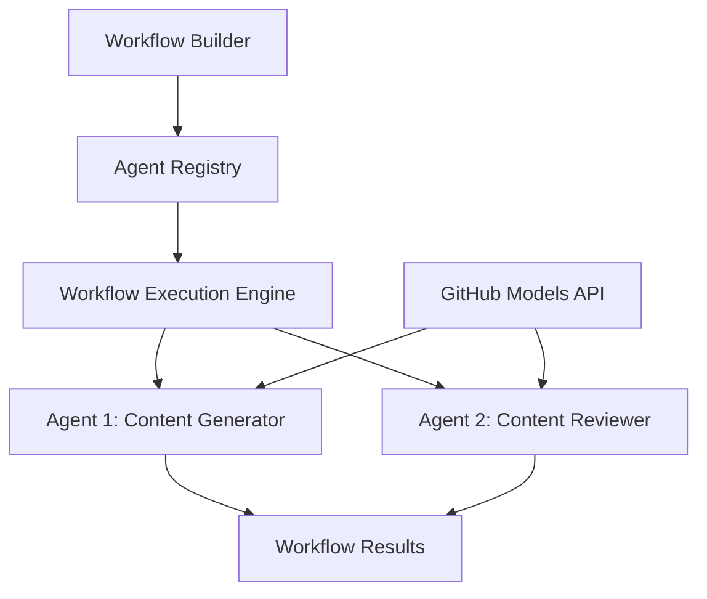

<!--
CO_OP_TRANSLATOR_METADATA:
{
  "original_hash": "034158688d0a45aae06dcbb21b0da5ae",
  "translation_date": "2025-11-11T12:46:49+00:00",
  "source_file": "08-multi-agent/code_samples/workflows-agent-framework/dotNET/01.dotnet-agent-framework-workflow-ghmodel-basic.md",
  "language_code": "pa"
}
-->
# 🔄 GitHub ਮਾਡਲਾਂ ਨਾਲ ਬੇਸਿਕ ਏਜੰਟ ਵਰਕਫਲੋਜ਼ (.NET)

## 📋 ਵਰਕਫਲੋ ਓਰਕੇਸਟ੍ਰੇਸ਼ਨ ਟਿਊਟੋਰਿਅਲ

ਇਹ ਨੋਟਬੁੱਕ Microsoft Agent Framework ਲਈ .NET ਅਤੇ GitHub ਮਾਡਲਾਂ ਦੀ ਵਰਤੋਂ ਕਰਕੇ ਉੱਚ-ਪੱਧਰੀ **ਏਜੰਟ ਵਰਕਫਲੋਜ਼** ਬਣਾਉਣ ਦਾ ਤਰੀਕਾ ਦਿਖਾਉਂਦੀ ਹੈ। ਤੁਸੀਂ ਸਿੱਖੋਗੇ ਕਿ ਕਿਵੇਂ ਬਹੁ-ਕਦਮ ਕਾਰੋਬਾਰੀ ਪ੍ਰਕਿਰਿਆਵਾਂ ਬਣਾਈਆਂ ਜਾ ਸਕਦੀਆਂ ਹਨ ਜਿੱਥੇ AI ਏਜੰਟ ਸਟ੍ਰਕਚਰਡ ਓਰਕੇਸਟ੍ਰੇਸ਼ਨ ਪੈਟਰਨਾਂ ਰਾਹੀਂ ਜਟਿਲ ਕੰਮ ਪੂਰੇ ਕਰਨ ਲਈ ਸਹਿਯੋਗ ਕਰਦੇ ਹਨ।

## 🎯 ਸਿੱਖਣ ਦੇ ਉਦੇਸ਼

### 🏗️ **ਵਰਕਫਲੋ ਆਰਕੀਟੈਕਚਰ ਦੇ ਮੂਲ ਤੱਤ**
- **ਵਰਕਫਲੋ ਬਿਲਡਰ**: ਜਟਿਲ ਬਹੁ-ਕਦਮ AI ਪ੍ਰਕਿਰਿਆਵਾਂ ਨੂੰ ਡਿਜ਼ਾਈਨ ਅਤੇ ਓਰਕੇਸਟ੍ਰੇਟ ਕਰੋ
- **ਏਜੰਟ ਕੋਆਰਡੀਨੇਸ਼ਨ**: ਵਰਕਫਲੋਜ਼ ਵਿੱਚ ਕਈ ਵਿਸ਼ੇਸ਼ ਏਜੰਟਾਂ ਨੂੰ ਕੋਆਰਡੀਨੇਟ ਕਰੋ
- **GitHub ਮਾਡਲਾਂ ਇੰਟੀਗ੍ਰੇਸ਼ਨ**: ਵਰਕਫਲੋਜ਼ ਵਿੱਚ GitHub ਦੇ AI ਮਾਡਲ ਇੰਫਰੈਂਸ ਸੇਵਾ ਦੀ ਵਰਤੋਂ ਕਰੋ
- **ਦ੍ਰਿਸ਼ਮਾਨ ਵਰਕਫਲੋ ਡਿਜ਼ਾਈਨ**: ਵਧੇਰੇ ਸਮਝ ਲਈ ਵਰਕਫਲੋ ਸਟ੍ਰਕਚਰ ਬਣਾਓ ਅਤੇ ਦਿਖਾਓ

### 🔄 **ਪ੍ਰਕਿਰਿਆ ਓਰਕੇਸਟ੍ਰੇਸ਼ਨ ਪੈਟਰਨ**
- **ਲਗਾਤਾਰ ਪ੍ਰਕਿਰਿਆ**: ਕਈ ਏਜੰਟ ਟਾਸਕਾਂ ਨੂੰ ਤਰਕਸੰਗਤ ਕ੍ਰਮ ਵਿੱਚ ਜੋੜੋ
- **ਸਟੇਟ ਮੈਨੇਜਮੈਂਟ**: ਵਰਕਫਲੋ ਸਟੇਜਾਂ ਵਿੱਚ ਸੰਦਰਭ ਅਤੇ ਡਾਟਾ ਪ੍ਰਵਾਹ ਨੂੰ ਬਣਾਈ ਰੱਖੋ
- **ਗਲਤੀ ਸੰਭਾਲ**: ਮਜ਼ਬੂਤ ਗਲਤੀ ਰਿਕਵਰੀ ਅਤੇ ਵਰਕਫਲੋ ਲਚਕਤਾ ਲਾਗੂ ਕਰੋ
- **ਪ੍ਰਦਰਸ਼ਨ ਅਪਟਿਮਾਈਜ਼ੇਸ਼ਨ**: ਐਂਟਰਪ੍ਰਾਈਜ਼-ਪੱਧਰ ਦੇ ਓਪਰੇਸ਼ਨਾਂ ਲਈ ਕੁਸ਼ਲ ਵਰਕਫਲੋਜ਼ ਡਿਜ਼ਾਈਨ ਕਰੋ

### 🏢 **ਐਂਟਰਪ੍ਰਾਈਜ਼ ਵਰਕਫਲੋ ਐਪਲੀਕੇਸ਼ਨ**
- **ਬਿਜ਼ਨਸ ਪ੍ਰਕਿਰਿਆ ਆਟੋਮੇਸ਼ਨ**: ਜਟਿਲ ਸੰਗਠਨਾਤਮਕ ਵਰਕਫਲੋਜ਼ ਨੂੰ ਆਟੋਮੇਟ ਕਰੋ
- **ਕੰਟੈਂਟ ਪ੍ਰੋਡਕਸ਼ਨ ਪਾਈਪਲਾਈਨ**: ਸਮੀਖਿਆ ਅਤੇ ਮਨਜ਼ੂਰੀ ਸਟੇਜਾਂ ਨਾਲ ਸੰਪਾਦਕੀ ਵਰਕਫਲੋਜ਼
- **ਕਸਟਮਰ ਸਰਵਿਸ ਆਟੋਮੇਸ਼ਨ**: ਬਹੁ-ਕਦਮ ਗਾਹਕ ਪੁੱਛਗਿੱਛ ਦਾ ਹੱਲ
- **ਡਾਟਾ ਪ੍ਰੋਸੈਸਿੰਗ ਵਰਕਫਲੋਜ਼**: AI-ਚਾਲਤ ਰੂਪਾਂਤਰਨ ਨਾਲ ETL ਵਰਕਫਲੋਜ਼

## ⚙️ ਪੂਰਵ ਸ਼ਰਤਾਂ ਅਤੇ ਸੈਟਅਪ

### 📦 **ਲੋੜੀਂਦੇ NuGet ਪੈਕੇਜ**

ਇਹ ਵਰਕਫਲੋ ਡੈਮੋ ਕਈ ਮੁੱਖ .NET ਪੈਕੇਜਾਂ ਦੀ ਵਰਤੋਂ ਕਰਦਾ ਹੈ:

```xml
<!-- Core AI Framework -->
<PackageReference Include="Microsoft.Extensions.AI" Version="9.9.0" />

<!-- Agent Framework (Local Development) -->
<!-- Microsoft.Agents.AI.dll - Core agent abstractions -->
<!-- Microsoft.Agents.AI.OpenAI.dll - OpenAI/GitHub Models integration -->

<!-- Configuration and Environment -->
<PackageReference Include="DotNetEnv" Version="3.1.1" />
```

### 🔑 **GitHub ਮਾਡਲਾਂ ਕਨਫਿਗਰੇਸ਼ਨ**

**ਵਾਤਾਵਰਣ ਸੈਟਅਪ (.env ਫਾਈਲ):**
```env
GITHUB_TOKEN=your_github_personal_access_token
GITHUB_ENDPOINT=https://models.inference.ai.azure.com
GITHUB_MODEL_ID=gpt-4o-mini
```

**GitHub ਮਾਡਲਾਂ ਤੱਕ ਪਹੁੰਚ:**
1. GitHub ਮਾਡਲਾਂ ਲਈ ਸਾਈਨ ਅੱਪ ਕਰੋ (ਵਰਤਮਾਨ ਵਿੱਚ ਪ੍ਰੀਵਿਊ ਵਿੱਚ)
2. ਮਾਡਲ ਪਹੁੰਚ ਅਧਿਕਾਰਾਂ ਨਾਲ ਨਿੱਜੀ ਪਹੁੰਚ ਟੋਕਨ ਜਨਰੇਟ ਕਰੋ
3. ਉਪਰੋਕਤ ਤਰੀਕੇ ਨਾਲ ਵਾਤਾਵਰਣ ਵੈਰੀਏਬਲਾਂ ਨੂੰ ਕਨਫਿਗਰ ਕਰੋ

### 🏗️ **ਵਰਕਫਲੋ ਆਰਕੀਟੈਕਚਰ ਝਲਕ**



**ਮੁੱਖ ਹਿੱਸੇ:**
- **WorkflowBuilder**: ਵਰਕਫਲੋਜ਼ ਡਿਜ਼ਾਈਨ ਕਰਨ ਲਈ ਮੁੱਖ ਓਰਕੇਸਟ੍ਰੇਸ਼ਨ ਇੰਜਨ
- **AIAgent**: ਵਿਸ਼ੇਸ਼ ਯੋਗਤਾਵਾਂ ਵਾਲੇ ਵਿਅਕਤੀਗਤ ਵਿਸ਼ੇਸ਼ ਏਜੰਟ
- **GitHub Models Client**: AI ਮਾਡਲ ਇੰਫਰੈਂਸ ਸੇਵਾ ਇੰਟੀਗ੍ਰੇਸ਼ਨ
- **Execution Context**: ਵਰਕਫਲੋ ਸਟੇਜਾਂ ਵਿੱਚ ਸਟੇਟ ਅਤੇ ਡਾਟਾ ਪ੍ਰਵਾਹ ਦਾ ਪ੍ਰਬੰਧਨ

## 🎨 **ਐਂਟਰਪ੍ਰਾਈਜ਼ ਵਰਕਫਲੋ ਡਿਜ਼ਾਈਨ ਪੈਟਰਨ**

### 📝 **ਕੰਟੈਂਟ ਪ੍ਰੋਡਕਸ਼ਨ ਵਰਕਫਲੋ**
```
User Request → Content Generation → Quality Review → Final Output
```

### 🔍 **ਡੌਕੂਮੈਂਟ ਪ੍ਰੋਸੈਸਿੰਗ ਪਾਈਪਲਾਈਨ**
```
Document Input → Analysis → Extraction → Validation → Structured Output
```

### 💼 **ਬਿਜ਼ਨਸ ਇੰਟੈਲੀਜੈਂਸ ਵਰਕਫਲੋ**
```
Data Collection → Processing → Analysis → Report Generation → Distribution
```

### 🤝 **ਕਸਟਮਰ ਸਰਵਿਸ ਆਟੋਮੇਸ਼ਨ**
```
Customer Inquiry → Classification → Processing → Response Generation → Follow-up
```

## 🏢 **ਐਂਟਰਪ੍ਰਾਈਜ਼ ਫਾਇਦੇ**

### 🎯 **ਭਰੋਸੇਯੋਗਤਾ ਅਤੇ ਸਕੇਲਬਿਲਟੀ**
- **ਡਿਟਰਮਿਨਿਸਟਿਕ ਐਗਜ਼ਿਕਿਊਸ਼ਨ**: ਲਗਾਤਾਰ, ਦੁਹਰਾਏ ਜਾ ਸਕਣ ਵਾਲੇ ਵਰਕਫਲੋ ਨਤੀਜੇ
- **ਗਲਤੀ ਰਿਕਵਰੀ**: ਕਿਸੇ ਵੀ ਵਰਕਫਲੋ ਸਟੇਜ 'ਤੇ ਨਾਕਾਮੀਆਂ ਦਾ ਸੁਚਾਰੂ ਸੰਭਾਲ
- **ਪ੍ਰਦਰਸ਼ਨ ਮਾਨੀਟਰਿੰਗ**: ਐਗਜ਼ਿਕਿਊਸ਼ਨ ਮੈਟ੍ਰਿਕਸ ਅਤੇ ਅਪਟਿਮਾਈਜ਼ੇਸ਼ਨ ਮੌਕਿਆਂ ਨੂੰ ਟ੍ਰੈਕ ਕਰੋ
- **ਸੰਸਾਧਨ ਪ੍ਰਬੰਧਨ**: AI ਮਾਡਲ ਸੰਸਾਧਨਾਂ ਦੀ ਕੁਸ਼ਲ ਵੰਡ ਅਤੇ ਵਰਤੋਂ

### 🔒 **ਸੁਰੱਖਿਆ ਅਤੇ ਅਨੁਕੂਲਤਾ**
- **ਸੁਰੱਖਿਅਤ ਪ੍ਰਮਾਣਿਕਤਾ**: API ਪਹੁੰਚ ਲਈ GitHub ਟੋਕਨ-ਅਧਾਰਿਤ ਪ੍ਰਮਾਣਿਕਤਾ
- **ਆਡਿਟ ਟ੍ਰੇਲਜ਼**: ਵਰਕਫਲੋ ਐਗਜ਼ਿਕਿਊਸ਼ਨ ਅਤੇ ਫੈਸਲੇ ਦੇ ਬਿੰਦੂਆਂ ਦੀ ਪੂਰੀ ਲਾਗਬੁੱਕ
- **ਪਹੁੰਚ ਨਿਯੰਤਰਣ**: ਵਰਕਫਲੋ ਐਗਜ਼ਿਕਿਊਸ਼ਨ ਅਤੇ ਮਾਨੀਟਰਿੰਗ ਲਈ ਵਿਸਤ੍ਰਿਤ ਅਧਿਕਾਰ
- **ਡਾਟਾ ਪ੍ਰਾਈਵੇਸੀ**: ਵਰਕਫਲੋਜ਼ ਵਿੱਚ ਸੰਵੇਦਨਸ਼ੀਲ ਜਾਣਕਾਰੀ ਦੀ ਸੁਰੱਖਿਅਤ ਸੰਭਾਲ

### 📊 **ਦ੍ਰਿਸ਼ਮਾਨਤਾ ਅਤੇ ਪ੍ਰਬੰਧਨ**
- **ਦ੍ਰਿਸ਼ਮਾਨ ਵਰਕਫਲੋ ਡਿਜ਼ਾਈਨ**: ਪ੍ਰਕਿਰਿਆ ਪ੍ਰਵਾਹ ਅਤੇ ਨਿਰਭਰਤਾਵਾਂ ਦੀ ਸਪਸ਼ਟ ਪ੍ਰਸਤੁਤੀ
- **ਐਗਜ਼ਿਕਿਊਸ਼ਨ ਮਾਨੀਟਰਿੰਗ**: ਵਰਕਫਲੋ ਪ੍ਰਗਤੀ ਅਤੇ ਪ੍ਰਦਰਸ਼ਨ ਦਾ ਰੀਅਲ-ਟਾਈਮ ਟ੍ਰੈਕਿੰਗ
- **ਗਲਤੀ ਰਿਪੋਰਟਿੰਗ**: ਵਿਸਤ੍ਰਿਤ ਗਲਤੀ ਵਿਸ਼ਲੇਸ਼ਣ ਅਤੇ ਡਿਬੱਗਿੰਗ ਯੋਗਤਾਵਾਂ
- **ਪ੍ਰਦਰਸ਼ਨ ਵਿਸ਼ਲੇਸ਼ਣ**: ਅਪਟਿਮਾਈਜ਼ੇਸ਼ਨ ਅਤੇ ਸਮਰੱਥਾ ਯੋਜਨਾ ਲਈ ਮੈਟ੍ਰਿਕਸ

ਆਓ ਆਪਣਾ ਪਹਿਲਾ ਐਂਟਰਪ੍ਰਾਈਜ਼-ਤਿਆਰ AI ਵਰਕਫਲੋ ਬਣਾਈਏ! 🚀

## 💻 ਕੋਡ ਚਲਾਉਣਾ

ਪੂਰੀ ਤਰ੍ਹਾਂ ਲਾਗੂ ਕਰਨ ਦੀ ਫਾਈਲ `01.dotnet-agent-framework-workflow-ghmodel-basic.cs` ਵਿੱਚ ਉਪਲਬਧ ਹੈ। ਇਹ ਫਾਈਲ ਦਿਖਾਉਂਦੀ ਹੈ:

1. **ਵਾਤਾਵਰਣ ਕਨਫਿਗਰੇਸ਼ਨ** - `.env` ਫਾਈਲ ਤੋਂ GitHub ਮਾਡਲਾਂ ਦੀ ਸਨਦ ਲੋਡ ਕਰਨਾ
2. **OpenAI ਕਲਾਇੰਟ ਸੈਟਅਪ** - GitHub ਮਾਡਲਾਂ ਐਂਡਪੌਇੰਟ ਵਰਤਣ ਲਈ ਕਲਾਇੰਟ ਕਨਫਿਗਰ ਕਰਨਾ
3. **ਏਜੰਟ ਬਣਾਉਣਾ** - ਵਿਸ਼ੇਸ਼ ਏਜੰਟਾਂ (ਫਰੰਟ ਡੈਸਕ ਅਤੇ ਕਾਂਸਿਆਰਜ) ਨੂੰ ਪਰਿਭਾਸ਼ਿਤ ਕਰਨਾ
4. **ਵਰਕਫਲੋ ਬਿਲਡਰ** - ਲਗਾਤਾਰ ਪ੍ਰਕਿਰਿਆ ਨਾਲ ਬਹੁ-ਏਜੰਟ ਵਰਕਫਲੋ ਬਣਾਉਣਾ
5. **ਵਰਕਫਲੋ ਐਗਜ਼ਿਕਿਊਸ਼ਨ** - ਸਟ੍ਰੀਮਿੰਗ ਨਤੀਜਿਆਂ ਨਾਲ ਵਰਕਫਲੋ ਚਲਾਉਣਾ

### 🚀 ਉਦਾਹਰਨ ਚਲਾਉਣਾ

```bash
# Make the script executable (Unix/Linux/macOS)
chmod +x 01.dotnet-agent-framework-workflow-ghmodel-basic.cs

# Run the workflow
./01.dotnet-agent-framework-workflow-ghmodel-basic.cs
```

ਜਾਂ Windows 'ਤੇ:
```powershell
dotnet run 01.dotnet-agent-framework-workflow-ghmodel-basic.cs
```

### 📝 ਉਮੀਦਵਾਰ ਨਤੀਜਾ

ਵਰਕਫਲੋ:
1. ਤੁਹਾਡੀ ਯਾਤਰਾ ਮੰਜ਼ਿਲ ਦੀ ਬੇਨਤੀ ਸਵੀਕਾਰ ਕਰੇਗਾ ("ਮੈਂ ਪੈਰਿਸ ਜਾਣਾ ਚਾਹੁੰਦਾ ਹਾਂ")
2. ਫਰੰਟ ਡੈਸਕ ਏਜੰਟ ਇੱਕ ਸ਼ੁਰੂਆਤੀ ਸਿਫਾਰਸ਼ ਪ੍ਰਦਾਨ ਕਰੇਗਾ
3. ਕਾਂਸਿਆਰਜ ਏਜੰਟ ਸਿਫਾਰਸ਼ ਦੀ ਸਮੀਖਿਆ ਅਤੇ ਸੁਧਾਰ ਕਰੇਗਾ
4. ਅੰਤਮ ਨਤੀਜਾ ਪੂਰੀ ਗੱਲਬਾਤ ਸਟ੍ਰੀਮ ਦਿਖਾਏਗਾ

### 🔧 ਕਸਟਮਾਈਜ਼ੇਸ਼ਨ

ਤੁਸੀਂ ਵਰਕਫਲੋ ਨੂੰ ਇਸ ਤਰੀਕੇ ਨਾਲ ਕਸਟਮਾਈਜ਼ ਕਰ ਸਕਦੇ ਹੋ:
- ਏਜੰਟ ਨਿਰਦੇਸ਼ਾਂ ਨੂੰ ਸੋਧ ਕੇ ਉਨ੍ਹਾਂ ਦੇ ਵਿਹਾਰ ਨੂੰ ਬਦਲੋ
- ਜਟਿਲ ਬਹੁ-ਕਦਮ ਵਰਕਫਲੋਜ਼ ਬਣਾਉਣ ਲਈ ਹੋਰ ਏਜੰਟ ਸ਼ਾਮਲ ਕਰੋ
- ਵੱਖ-ਵੱਖ ਸਥਿਤੀਆਂ ਦੀ ਜਾਂਚ ਕਰਨ ਲਈ ਯੂਜ਼ਰ ਸੁਨੇਹਾ ਬਦਲੋ
- ਵਰਕਫਲੋ ਐਜਜ਼ ਨੂੰ ਸੋਧ ਕੇ ਵੱਖ-ਵੱਖ ਐਗਜ਼ਿਕਿਊਸ਼ਨ ਪੈਟਰਨ ਬਣਾਓ

---

<!-- CO-OP TRANSLATOR DISCLAIMER START -->
**ਅਸਵੀਕਰਤਾ**:  
ਇਹ ਦਸਤਾਵੇਜ਼ AI ਅਨੁਵਾਦ ਸੇਵਾ [Co-op Translator](https://github.com/Azure/co-op-translator) ਦੀ ਵਰਤੋਂ ਕਰਕੇ ਅਨੁਵਾਦ ਕੀਤਾ ਗਿਆ ਹੈ। ਜਦੋਂ ਕਿ ਅਸੀਂ ਸਹੀ ਹੋਣ ਦੀ ਕੋਸ਼ਿਸ਼ ਕਰਦੇ ਹਾਂ, ਕਿਰਪਾ ਕਰਕੇ ਧਿਆਨ ਦਿਓ ਕਿ ਸਵੈਚਾਲਿਤ ਅਨੁਵਾਦਾਂ ਵਿੱਚ ਗਲਤੀਆਂ ਜਾਂ ਅਸੁਚੀਤਤਾਵਾਂ ਹੋ ਸਕਦੀਆਂ ਹਨ। ਮੂਲ ਦਸਤਾਵੇਜ਼ ਨੂੰ ਇਸਦੀ ਮੂਲ ਭਾਸ਼ਾ ਵਿੱਚ ਅਧਿਕਾਰਤ ਸਰੋਤ ਮੰਨਿਆ ਜਾਣਾ ਚਾਹੀਦਾ ਹੈ। ਮਹੱਤਵਪੂਰਨ ਜਾਣਕਾਰੀ ਲਈ, ਪੇਸ਼ੇਵਰ ਮਨੁੱਖੀ ਅਨੁਵਾਦ ਦੀ ਸਿਫਾਰਸ਼ ਕੀਤੀ ਜਾਂਦੀ ਹੈ। ਇਸ ਅਨੁਵਾਦ ਦੀ ਵਰਤੋਂ ਤੋਂ ਪੈਦਾ ਹੋਣ ਵਾਲੇ ਕਿਸੇ ਵੀ ਗਲਤਫਹਿਮੀ ਜਾਂ ਗਲਤ ਵਿਆਖਿਆ ਲਈ ਅਸੀਂ ਜ਼ਿੰਮੇਵਾਰ ਨਹੀਂ ਹਾਂ।
<!-- CO-OP TRANSLATOR DISCLAIMER END -->