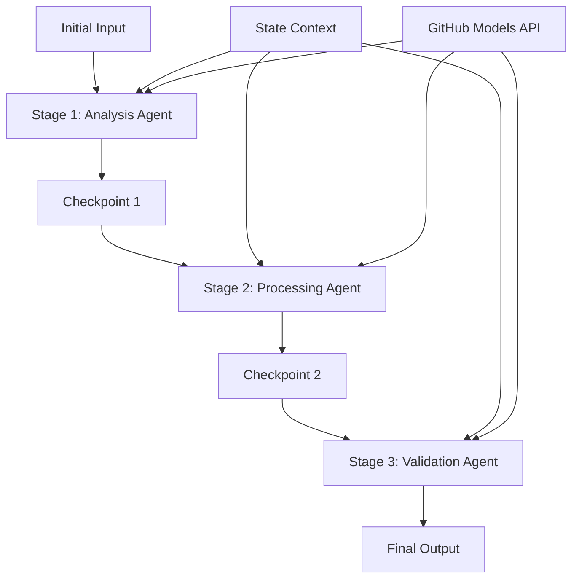

<!--
CO_OP_TRANSLATOR_METADATA:
{
  "original_hash": "1be9c8dcbd79a02d33d2c138684c1394",
  "translation_date": "2025-11-11T13:49:02+00:00",
  "source_file": "08-multi-agent/code_samples/workflows-agent-framework/dotNET/02.dotnet-agent-framework-workflow-ghmodel-sequential.md",
  "language_code": "pa"
}
-->
# ⏩ GitHub ਮਾਡਲਾਂ ਨਾਲ ਲਗਾਤਾਰ ਏਜੰਟ ਵਰਕਫਲੋਜ਼ (.NET)

## 📋 ਉੱਚ-ਸਤਹ ਲਗਾਤਾਰ ਪ੍ਰੋਸੈਸਿੰਗ ਟਿਊਟੋਰਿਅਲ

ਇਹ ਨੋਟਬੁੱਕ Microsoft Agent Framework ਲਈ .NET ਅਤੇ GitHub ਮਾਡਲਾਂ ਦੀ ਵਰਤੋਂ ਕਰਕੇ **ਲਗਾਤਾਰ ਵਰਕਫਲੋ ਪੈਟਰਨ** ਦਿਖਾਉਂਦੀ ਹੈ। ਤੁਸੀਂ ਸਿੱਖੋਗੇ ਕਿ ਕਿਵੇਂ ਉੱਚ-ਸਤਹ, ਕਦਮ-ਦਰ-ਕਦਮ ਪ੍ਰੋਸੈਸਿੰਗ ਪਾਈਪਲਾਈਨ ਬਣਾਈ ਜਾ ਸਕਦੀ ਹੈ ਜਿੱਥੇ ਏਜੰਟ ਇੱਕ ਨਿਰਧਾਰਤ ਕ੍ਰਮ ਵਿੱਚ ਕਾਰਵਾਈ ਕਰਦੇ ਹਨ, ਹਰ ਪੜਾਅ ਪਿਛਲੇ ਪੜਾਅ ਦੇ ਨਤੀਜਿਆਂ 'ਤੇ ਅਧਾਰਿਤ ਹੁੰਦਾ ਹੈ।

## 🎯 ਸਿੱਖਣ ਦੇ ਉਦੇਸ਼

### 🔄 **ਲਗਾਤਾਰ ਪ੍ਰੋਸੈਸਿੰਗ ਆਰਕੀਟੈਕਚਰ**
- **ਲਿਨੀਅਰ ਵਰਕਫਲੋ ਡਿਜ਼ਾਈਨ**: ਸਪਸ਼ਟ ਨਿਰਭਰਤਾਵਾਂ ਨਾਲ ਕਦਮ-ਦਰ-ਕਦਮ ਪ੍ਰੋਸੈਸਿੰਗ ਪਾਈਪਲਾਈਨ ਬਣਾਓ
- **ਸਟੇਟ ਮੈਨੇਜਮੈਂਟ**: ਲਗਾਤਾਰ ਵਰਕਫਲੋ ਪੜਾਅਾਂ ਵਿੱਚ ਸੰਦਰਭ ਅਤੇ ਡਾਟਾ ਪ੍ਰਵਾਹ ਨੂੰ ਬਣਾਈ ਰੱਖੋ
- **GitHub ਮਾਡਲਾਂ ਦਾ ਇੰਟੀਗ੍ਰੇਸ਼ਨ**: GitHub ਦੇ AI ਮਾਡਲਾਂ ਨੂੰ ਬਹੁ-ਪੜਾਅ .NET ਵਰਕਫਲੋਜ਼ ਵਿੱਚ ਵਰਤੋ
- **ਐਂਟਰਪ੍ਰਾਈਜ਼ ਪਾਈਪਲਾਈਨ ਪੈਟਰਨ**: ਉਤਪਾਦਨ-ਤਿਆਰ ਲਗਾਤਾਰ ਪ੍ਰੋਸੈਸਿੰਗ ਸਿਸਟਮ ਬਣਾਓ

### 🏗️ **ਉੱਚ-ਸਤਹ ਲਗਾਤਾਰ ਪੈਟਰਨ**
- **ਸਟੇਜ-ਗੇਟ ਪ੍ਰੋਸੈਸਿੰਗ**: ਵਰਕਫਲੋ ਪੜਾਅਾਂ ਦੇ ਵਿਚਕਾਰ ਵੈਧਤਾ ਚੈੱਕਪੋਇੰਟ ਲਾਗੂ ਕਰੋ
- **ਸੰਦਰਭ ਸੰਭਾਲ**: ਸਾਰੇ ਪੜਾਅਾਂ ਵਿੱਚ ਸਟੇਟ ਅਤੇ ਜਮ੍ਹਾਂ ਕੀਤੇ ਗਿਆਨ ਨੂੰ ਬਣਾਈ ਰੱਖੋ
- **ਗਲਤੀ ਪ੍ਰਸਾਰਣ**: ਲਗਾਤਾਰ ਪ੍ਰੋਸੈਸਿੰਗ ਚੇਨ ਵਿੱਚ ਨਾਕਾਮੀਆਂ ਨੂੰ ਸੁਚਾਰੂ ਤਰੀਕੇ ਨਾਲ ਸੰਭਾਲੋ
- **ਪ੍ਰਦਰਸ਼ਨ ਅਪਟਿਮਾਈਜ਼ੇਸ਼ਨ**: ਘੱਟ ਤੋਂ ਘੱਟ ਓਵਰਹੈੱਡ ਨਾਲ ਕੁਸ਼ਲ ਲਗਾਤਾਰ ਕਾਰਵਾਈ

### 🏢 **ਐਂਟਰਪ੍ਰਾਈਜ਼ ਲਗਾਤਾਰ ਐਪਲੀਕੇਸ਼ਨ**
- **ਦਸਤਾਵੇਜ਼ ਪ੍ਰੋਸੈਸਿੰਗ ਪਾਈਪਲਾਈਨ**: ਬਹੁ-ਪੜਾਅ ਦਸਤਾਵੇਜ਼ ਵਿਸ਼ਲੇਸ਼ਣ, ਰੂਪਾਂਤਰਣ, ਅਤੇ ਵੈਧਤਾ
- **ਗੁਣਵੱਤਾ ਅਸ਼ੁਰੈਂਸ ਵਰਕਫਲੋਜ਼**: ਲਗਾਤਾਰ ਸਮੀਖਾ, ਵੈਧਤਾ, ਅਤੇ ਮਨਜ਼ੂਰੀ ਪ੍ਰਕਿਰਿਆਵਾਂ
- **ਸਮੱਗਰੀ ਉਤਪਾਦਨ ਪਾਈਪਲਾਈਨ**: ਖੋਜ → ਲਿਖਾਈ → ਸੰਪਾਦਨ → ਸਮੀਖਾ → ਪ੍ਰਕਾਸ਼ਨ
- **ਵਪਾਰ ਪ੍ਰਕਿਰਿਆ ਆਟੋਮੇਸ਼ਨ**: ਸਪਸ਼ਟ ਪੜਾਅ ਨਿਰਭਰਤਾਵਾਂ ਨਾਲ ਬਹੁ-ਕਦਮ ਵਪਾਰ ਵਰਕਫਲੋਜ਼

## ⚙️ ਪੂਰਵ-ਸ਼ਰਤਾਂ ਅਤੇ ਸੈਟਅੱਪ

### 📦 **ਲੋੜੀਂਦੇ NuGet ਪੈਕੇਜ**

.NET ਲਗਾਤਾਰ ਵਰਕਫਲੋਜ਼ ਲਈ ਜ਼ਰੂਰੀ ਪੈਕੇਜ:

```xml
<!-- Core AI Framework -->
<PackageReference Include="Microsoft.Extensions.AI" Version="9.9.0" />

<!-- Client Model Abstractions -->
<PackageReference Include="System.ClientModel" Version="1.6.1.0" />

<!-- Azure Identity and Async LINQ Support -->
<PackageReference Include="Azure.Identity" Version="1.15.0" />
<PackageReference Include="System.Linq.Async" Version="6.0.3" />

<!-- Local Agent Framework References -->
<!-- Microsoft.Agents.AI.dll - Core agent abstractions -->
<!-- Microsoft.Agents.AI.OpenAI.dll - GitHub Models integration -->
```

### 🔑 **GitHub ਮਾਡਲਾਂ ਦੀ ਸੰਰਚਨਾ**

**ਵਾਤਾਵਰਣ ਸੈਟਅੱਪ (.env ਫਾਈਲ):**
```env
GITHUB_TOKEN=your_github_personal_access_token
GITHUB_ENDPOINT=https://models.inference.ai.azure.com
GITHUB_MODEL_ID=gpt-4o-mini
```

**ਸੰਰਚਨਾ ਪ੍ਰਬੰਧਨ:**
```csharp
// Load environment variables securely
Env.Load("../../../.env");
var githubToken = Environment.GetEnvironmentVariable("GITHUB_TOKEN");
var githubEndpoint = Environment.GetEnvironmentVariable("GITHUB_ENDPOINT");
var modelId = Environment.GetEnvironmentVariable("GITHUB_MODEL_ID");
```

### 🏗️ **ਲਗਾਤਾਰ ਵਰਕਫਲੋ ਆਰਕੀਟੈਕਚਰ**



**ਮੁੱਖ ਘਟਕਾ:**
- **ਲਗਾਤਾਰ ਏਜੰਟ**: ਹਰ ਪ੍ਰੋਸੈਸਿੰਗ ਪੜਾਅ ਲਈ ਵਿਸ਼ੇਸ਼ ਏਜੰਟ
- **ਸਟੇਟ ਸੰਦਰਭ**: ਸਾਰੇ ਪੜਾਅਾਂ ਵਿੱਚ ਜਮ੍ਹਾਂ ਕੀਤੇ ਡਾਟਾ ਅਤੇ ਫੈਸਲਿਆਂ ਨੂੰ ਬਣਾਈ ਰੱਖਦਾ ਹੈ
- **ਚੈੱਕਪੋਇੰਟ**: ਪੜਾਅਾਂ ਦੇ ਵਿਚਕਾਰ ਗੁਣਵੱਤਾ ਅਤੇ ਸਥਿਰਤਾ ਨੂੰ ਯਕੀਨੀ ਬਣਾਉਣ ਲਈ ਵੈਧਤਾ ਬਿੰਦੂ
- **GitHub ਮਾਡਲ ਕਲਾਇੰਟ**: ਸਾਰੇ ਵਰਕਫਲੋ ਪੜਾਅਾਂ ਵਿੱਚ ਸਥਿਰ AI ਮਾਡਲ ਪਹੁੰਚ

## 🎨 **ਲਗਾਤਾਰ ਵਰਕਫਲੋ ਡਿਜ਼ਾਈਨ ਪੈਟਰਨ**

### 📝 **ਦਸਤਾਵੇਜ਼ ਪ੍ਰੋਸੈਸਿੰਗ ਪਾਈਪਲਾਈਨ**
```
Raw Document → Content Extraction → Analysis → Validation → Structured Output
```

### 🎯 **ਸਮੱਗਰੀ ਰਚਨਾ ਵਰਕਫਲੋ**
```
Brief/Requirements → Research → Content Creation → Review → Final Polish
```

### 🔍 **ਗੁਣਵੱਤਾ ਅਸ਼ੁਰੈਂਸ ਪਾਈਪਲਾਈਨ**
```
Initial Review → Technical Validation → Compliance Check → Final Approval
```

### 💼 **ਵਪਾਰ ਬੁੱਧੀ ਵਰਕਫਲੋ**
```
Data Collection → Processing → Analysis → Report Generation → Distribution
```

## 🏢 **ਐਂਟਰਪ੍ਰਾਈਜ਼ ਲਗਾਤਾਰ ਫਾਇਦੇ**

### 🎯 **ਭਰੋਸੇਯੋਗਤਾ ਅਤੇ ਗੁਣਵੱਤਾ**
- **ਨਿਰਧਾਰਤ ਪ੍ਰੋਸੈਸਿੰਗ**: ਸੰਗਠਿਤ ਪੜਾਅਾਂ ਰਾਹੀਂ ਸਥਿਰ, ਦੁਹਰਾਏ ਜਾ ਸਕਣ ਵਾਲੇ ਨਤੀਜੇ
- **ਗੁਣਵੱਤਾ ਗੇਟ**: ਹਰ ਪੜਾਅ 'ਤੇ ਵੈਧਤਾ ਚੈੱਕਪੋਇੰਟ ਗੁਣਵੱਤਾ ਨੂੰ ਯਕੀਨੀ ਬਣਾਉਂਦੇ ਹਨ
- **ਗਲਤੀ ਅਲੱਗ ਕਰਨਾ**: ਇੱਕ ਪੜਾਅ ਵਿੱਚ ਸਮੱਸਿਆਵਾਂ ਅਗਲੇ ਪੜਾਅਾਂ ਵਿੱਚ ਨਹੀਂ ਫੈਲਦੀਆਂ
- **ਆਡਿਟ ਟ੍ਰੇਲਜ਼**: ਹਰ ਪੜਾਅ 'ਤੇ ਫੈਸਲਿਆਂ ਅਤੇ ਰੂਪਾਂਤਰਣਾਂ ਦੀ ਪੂਰੀ ਟ੍ਰੈਕਿੰਗ

### 📈 **ਸਕੇਲਬਿਲਟੀ ਅਤੇ ਪ੍ਰਦਰਸ਼ਨ**
- **ਮੋਡਿਊਲਰ ਡਿਜ਼ਾਈਨ**: ਹਰ ਪੜਾਅ ਨੂੰ ਅਲੱਗ-ਅਲੱਗ ਅਪਟਿਮਾਈਜ਼ ਕੀਤਾ ਜਾ ਸਕਦਾ ਹੈ
- **ਸੰਸਾਧਨ ਪ੍ਰਬੰਧਨ**: ਪੜਾਅਾਂ ਵਿੱਚ AI ਮਾਡਲ ਸੰਸਾਧਨਾਂ ਦਾ ਕੁਸ਼ਲ ਵਰਤੋਂ
- **ਸਟੇਟ ਅਪਟਿਮਾਈਜ਼ੇਸ਼ਨ**: ਵਧੀਆ ਪ੍ਰਦਰਸ਼ਨ ਲਈ ਪੜਾਅਾਂ ਵਿੱਚ ਘੱਟ ਤੋਂ ਘੱਟ ਸਟੇਟ ਟ੍ਰਾਂਸਫਰ
- **ਪੈਰਲਲ ਸਟੇਜ ਗਰੁੱਪ**: ਕਈ ਲਗਾਤਾਰ ਵਰਕਫਲੋਜ਼ ਪੈਰਲਲ ਚੱਲ ਸਕਦੇ ਹਨ

### 🔒 **ਸੁਰੱਖਿਆ ਅਤੇ ਅਨੁਕੂਲਤਾ**
- **ਪੜਾਅ-ਸਤਹ ਸੁਰੱਖਿਆ**: ਵੱਖ-ਵੱਖ ਪ੍ਰੋਸੈਸਿੰਗ ਪੜਾਅਾਂ ਲਈ ਵੱਖ-ਵੱਖ ਸੁਰੱਖਿਆ ਨੀਤੀਆਂ
- **ਡਾਟਾ ਵੈਧਤਾ**: ਹਰ ਚੈੱਕਪੋਇੰਟ 'ਤੇ ਡਾਟਾ ਦੀ ਅਖੰਡਤਾ ਅਤੇ ਅਨੁਕੂਲਤਾ ਨੂੰ ਯਕੀਨੀ ਬਣਾਉ
- **ਪਹੁੰਚ ਨਿਯੰਤਰਣ**: ਵੱਖ-ਵੱਖ ਵਰਕਫਲੋ ਪੜਾਅਾਂ ਲਈ ਵਿਸ਼ੇਸ਼ ਅਨੁਮਤੀਆਂ
- **ਨਿਯਮਕ ਅਨੁਕੂਲਤਾ**: ਸੰਗਠਿਤ ਪ੍ਰੋਸੈਸਿੰਗ ਰਾਹੀਂ ਨਿਯਮਕ ਜ਼ਰੂਰਤਾਂ ਨੂੰ ਪੂਰਾ ਕਰੋ

### 📊 **ਮਾਨੀਟਰਿੰਗ ਅਤੇ ਵਿਸ਼ਲੇਸ਼ਣ**
- **ਪੜਾਅ-ਸਤਹ ਮੈਟ੍ਰਿਕਸ**: ਹਰ ਵਰਕਫਲੋ ਪੜਾਅ ਲਈ ਪ੍ਰਦਰਸ਼ਨ ਮਾਨੀਟਰਿੰਗ
- **ਬੋਟਲਨੈਕ ਪਛਾਣ**: ਹੌਲੀ ਪੜਾਅਾਂ ਦੀ ਪਛਾਣ ਅਤੇ ਅਪਟਿਮਾਈਜ਼ ਕਰੋ
- **ਗੁਣਵੱਤਾ ਮੈਟ੍ਰਿਕਸ**: ਹਰ ਪੜਾਅ 'ਤੇ ਗੁਣਵੱਤਾ ਅਤੇ ਸਫਲਤਾ ਦਰਾਂ ਨੂੰ ਟ੍ਰੈਕ ਕਰੋ
- **ਪ੍ਰਕਿਰਿਆ ਅਪਟਿਮਾਈਜ਼ੇਸ਼ਨ**: ਪੜਾਅ-ਸਤਹ ਵਿਸ਼ਲੇਸ਼ਣ ਦੇ ਅਧਾਰ 'ਤੇ ਲਗਾਤਾਰ ਸੁਧਾਰ

ਚਲੋ ਮਜ਼ਬੂਤ ਲਗਾਤਾਰ AI ਪ੍ਰੋਸੈਸਿੰਗ ਪਾਈਪਲਾਈਨ ਬਣਾਈਏ! 🚀

## 💻 ਕੋਡ ਚਲਾਉਣਾ

ਪੂਰੀ ਕਾਰਵਾਈ `02.dotnet-agent-framework-workflow-ghmodel-sequential.cs` ਵਿੱਚ ਉਪਲਬਧ ਹੈ। ਇਹ ਫਾਈਲ **ਤਿੰਨ-ਪੜਾਅ ਫਰਨੀਚਰ ਵਿਸ਼ਲੇਸ਼ਣ ਵਰਕਫਲੋ** ਦਿਖਾਉਂਦੀ ਹੈ:

1. **ਪੜਾਅ 1 - ਸੇਲਜ਼ ਏਜੰਟ**: ਫਰਨੀਚਰ ਚਿੱਤਰਾਂ ਦਾ ਵਿਸ਼ਲੇਸ਼ਣ ਕਰਦਾ ਹੈ ਅਤੇ ਖਰੀਦ ਸਿਫਾਰਸ਼ਾਂ ਦਿੰਦਾ ਹੈ
2. **ਪੜਾਅ 2 - ਪ੍ਰਾਈਸ ਏਜੰਟ**: ਵਿਸਤ੍ਰਿਤ ਕੀਮਤ ਵਿਸ਼ਲੇਸ਼ਣ ਅਤੇ ਬਜਟ ਵਿਕਲਪ ਦਿੰਦਾ ਹੈ
3. **ਪੜਾਅ 3 - ਕੋਟ ਏਜੰਟ**: Markdown ਫਾਰਮੈਟ ਵਿੱਚ ਇੱਕ ਪੇਸ਼ੇਵਰ ਕੋਟ ਦਸਤਾਵੇਜ਼ ਤਿਆਰ ਕਰਦਾ ਹੈ

### 🏗️ **ਵਰਕਫਲੋ ਆਰਕੀਟੈਕਚਰ**

```
Image Input → Sales Analysis → Price Estimation → Quote Generation → Final Output
```

ਹਰ ਏਜੰਟ:
- ਪਿਛਲੇ ਪੜਾਅ ਤੋਂ ਨਤੀਜਾ ਸੰਦਰਭ ਵਜੋਂ ਪ੍ਰਾਪਤ ਕਰਦਾ ਹੈ
- ਪਿਛਲੇ ਵਿਸ਼ਲੇਸ਼ਣ 'ਤੇ ਵਿਸ਼ੇਸ਼ ਤਜਰਬੇ ਨਾਲ ਅਧਾਰਿਤ ਬਣਾਉਂਦਾ ਹੈ
- ਸਟੇਟ ਮੈਨੇਜਮੈਂਟ ਰਾਹੀਂ ਵਰਕਫਲੋ ਸਤਤਤਾ ਨੂੰ ਬਣਾਈ ਰੱਖਦਾ ਹੈ

### 🚀 ਉਦਾਹਰਨ ਚਲਾਉਣਾ

**ਪੂਰਵ-ਸ਼ਰਤਾਂ:**
- ਇੱਕ ਫਰਨੀਚਰ ਚਿੱਤਰ `../imgs/home.png` 'ਤੇ ਰੱਖੋ (ਜਾਂ `imgPath` ਵੈਰੀਏਬਲ ਨੂੰ ਅਪਡੇਟ ਕਰੋ)
- ਆਪਣੀ `.env` ਫਾਈਲ ਨੂੰ GitHub ਮਾਡਲਾਂ ਦੀ ਸਨਦ ਨਾਲ ਸੰਰਚਿਤ ਕਰੋ

```bash
# Make the script executable (Unix/Linux/macOS)
chmod +x 02.dotnet-agent-framework-workflow-ghmodel-sequential.cs

# Run the sequential workflow
./02.dotnet-agent-framework-workflow-ghmodel-sequential.cs
```

ਜਾਂ Windows 'ਤੇ:
```powershell
dotnet run 02.dotnet-agent-framework-workflow-ghmodel-sequential.cs
```

### 📝 ਉਮੀਦਵਾਰ ਨਤੀਜਾ

ਵਰਕਫਲੋ:
1. **ਸੇਲਜ਼ ਏਜੰਟ**: ਚਿੱਤਰ ਤੋਂ ਫਰਨੀਚਰ ਆਈਟਮਾਂ ਦੀ ਪਛਾਣ ਕਰੇਗਾ ਅਤੇ ਸਿਫਾਰਸ਼ਾਂ ਦਿੰਦਾ ਹੈ
2. **ਪ੍ਰਾਈਸ ਏਜੰਟ**: ਵਿਸਤ੍ਰਿਤ ਕੀਮਤ ਵਿਸ਼ਲੇਸ਼ਣ ਬਜਟ ਟੀਅਰ ਅਤੇ ਖਰੀਦ ਸਿਫਾਰਸ਼ਾਂ ਨਾਲ ਜੋੜੇਗਾ
3. **ਕੋਟ ਏਜੰਟ**: ਸਾਰੇ ਜਾਣਕਾਰੀ ਨੂੰ ਸੰਕਲਿਤ ਕਰਕੇ ਇੱਕ ਫਾਰਮੈਟ ਕੀਤੇ ਕੋਟ ਦਸਤਾਵੇਜ਼ ਤਿਆਰ ਕਰੇਗਾ

ਅੰਤਮ ਨਤੀਜਾ ਇੱਕ ਵਿਸ਼ਲੇਸ਼ਣ-ਅਧਾਰਿਤ, ਪੇਸ਼ੇਵਰ ਫਰਨੀਚਰ ਕੋਟ ਹੋਵੇਗਾ।

### 🔧 ਕਸਟਮਾਈਜ਼ੇਸ਼ਨ ਵਿਕਲਪ

**ਏਜੰਟ ਵਿਵਹਾਰ ਨੂੰ ਸੋਧੋ:**
```csharp
// Adjust agent instructions to change their focus
const string SalesAgentInstructions = "Your custom instructions...";
```

**ਲਗਾਤਾਰ ਪ੍ਰਵਾਹ ਬਦਲੋ:**
```csharp
// Add or reorder workflow stages
var workflow = new WorkflowBuilder(salesagent)
    .AddEdge(salesagent, priceagent)
    .AddEdge(priceagent, quoteagent)
    .AddEdge(quoteagent, newAgent)  // Add another stage
    .Build();
```

**ਵੱਖ-ਵੱਖ ਇਨਪੁਟ ਵਰਤੋ:**
```csharp
// Process text instead of images
ChatMessage userMessage = new ChatMessage(ChatRole.User, [
    new TextContent("Analyze pricing for a modern living room set")
]);
```

### 🎯 ਅਸਲ-ਦੁਨੀਆ ਦੇ ਐਪਲੀਕੇਸ਼ਨ

ਇਹ ਲਗਾਤਾਰ ਪੈਟਰਨ ਆਦਰਸ਼ ਹਨ:
- **ਈ-ਕਾਮਰਸ**: ਉਤਪਾਦ ਵਿਸ਼ਲੇਸ਼ਣ → ਕੀਮਤ → ਕੋਟ ਤਿਆਰ ਕਰਨਾ
- **ਅਸਲ ਜਾਇਦਾਦ**: ਜਾਇਦਾਦ ਵਿਸ਼ਲੇਸ਼ਣ → ਮੁੱਲ → ਸੂਚੀ ਤਿਆਰ ਕਰਨਾ
- **ਬੀਮਾ**: ਦਾਅਵਾ ਵਿਸ਼ਲੇਸ਼ਣ → ਮੁਲਾਂਕਣ → ਕੋਟ ਤਿਆਰ ਕਰਨਾ
- **ਸਮੱਗਰੀ ਰਚਨਾ**: ਖੋਜ → ਲਿਖਾਈ → ਸੰਪਾਦਨ → ਪ੍ਰਕਾਸ਼ਨ

### 🔍 ਸਟੇਟ ਪ੍ਰਵਾਹ ਨੂੰ ਸਮਝਣਾ

ਲਗਾਤਾਰ ਵਿੱਚ ਹਰ ਏਜੰਟ ਪ੍ਰਾਪਤ ਕਰਦਾ ਹੈ:
- **ਮੂਲ ਇਨਪੁਟ**: ਸ਼ੁਰੂਆਤੀ ਉਪਭੋਗਤਾ ਸੁਨੇਹਾ (ਚਿੱਤਰ + ਟੈਕਸਟ)
- **ਪਿਛਲੇ ਏਜੰਟ ਨਤੀਜੇ**: ਗੱਲਬਾਤ ਦੇ ਇਤਿਹਾਸ ਵਿੱਚ ਸਾਰੇ ਪਿਛਲੇ ਏਜੰਟ ਜਵਾਬ
- **ਜਮ੍ਹਾਂ ਕੀਤੇ ਸੰਦਰਭ**: ਪੂਰੀ ਸਟੇਟ ਜੋ ਸਾਰੇ ਪੜਾਅਾਂ ਵਿੱਚ ਬਣਾਈ ਰੱਖੀ ਜਾਂਦੀ ਹੈ

ਇਹ ਸੁਧਾਰਤ ਬਹੁ-ਪੜਾਅ ਪ੍ਰੋਸੈਸਿੰਗ ਨੂੰ ਯਕੀਨੀ ਬਣਾਉਂਦਾ ਹੈ ਜਿੱਥੇ ਹਰ ਏਜੰਟ ਪਿਛਲੇ ਸਾਰੇ ਪੜਾਅਾਂ ਦੇ ਵਿਸ਼ਲੇਸ਼ਣ ਅਤੇ ਸੰਦਰਭ 'ਤੇ ਅਧਾਰਿਤ ਬਣਾਉਂਦਾ ਹੈ।

---

<!-- CO-OP TRANSLATOR DISCLAIMER START -->
**ਅਸਵੀਕਰਤੀ**:  
ਇਹ ਦਸਤਾਵੇਜ਼ AI ਅਨੁਵਾਦ ਸੇਵਾ [Co-op Translator](https://github.com/Azure/co-op-translator) ਦੀ ਵਰਤੋਂ ਕਰਕੇ ਅਨੁਵਾਦ ਕੀਤਾ ਗਿਆ ਹੈ। ਜਦੋਂ ਕਿ ਅਸੀਂ ਸਹੀ ਹੋਣ ਦਾ ਯਤਨ ਕਰਦੇ ਹਾਂ, ਕਿਰਪਾ ਕਰਕੇ ਧਿਆਨ ਦਿਓ ਕਿ ਸਵੈਚਾਲਿਤ ਅਨੁਵਾਦਾਂ ਵਿੱਚ ਗਲਤੀਆਂ ਜਾਂ ਅਸੁੱਤੀਆਂ ਹੋ ਸਕਦੀਆਂ ਹਨ। ਇਸ ਦੀ ਮੂਲ ਭਾਸ਼ਾ ਵਿੱਚ ਮੂਲ ਦਸਤਾਵੇਜ਼ ਨੂੰ ਅਧਿਕਾਰਤ ਸਰੋਤ ਮੰਨਿਆ ਜਾਣਾ ਚਾਹੀਦਾ ਹੈ। ਮਹੱਤਵਪੂਰਨ ਜਾਣਕਾਰੀ ਲਈ, ਪੇਸ਼ੇਵਰ ਮਨੁੱਖੀ ਅਨੁਵਾਦ ਦੀ ਸਿਫਾਰਸ਼ ਕੀਤੀ ਜਾਂਦੀ ਹੈ। ਇਸ ਅਨੁਵਾਦ ਦੀ ਵਰਤੋਂ ਤੋਂ ਪੈਦਾ ਹੋਣ ਵਾਲੇ ਕਿਸੇ ਵੀ ਗਲਤਫਹਿਮੀ ਜਾਂ ਗਲਤ ਵਿਆਖਿਆ ਲਈ ਅਸੀਂ ਜ਼ਿੰਮੇਵਾਰ ਨਹੀਂ ਹਾਂ।
<!-- CO-OP TRANSLATOR DISCLAIMER END -->