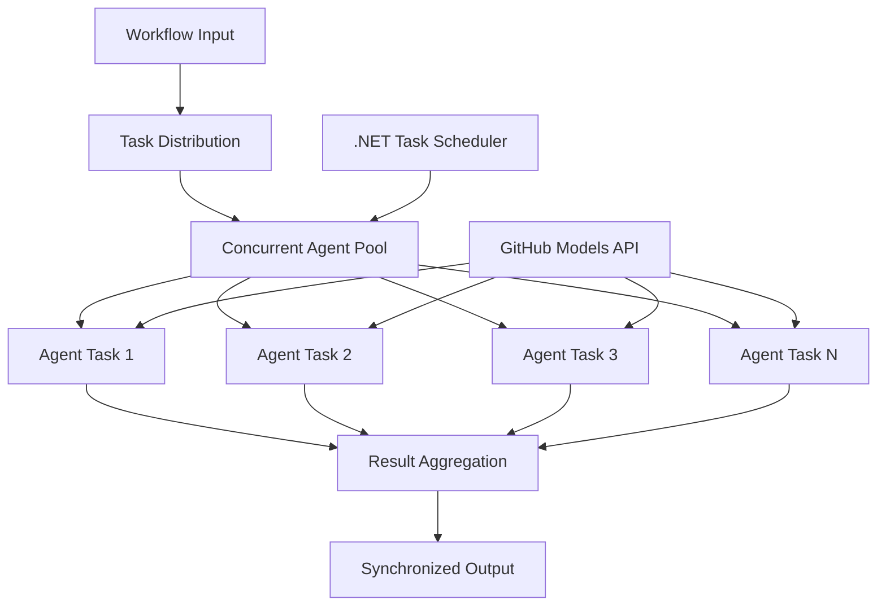

<!--
CO_OP_TRANSLATOR_METADATA:
{
  "original_hash": "b9c6e32c9b5f2fed20b6916984440d88",
  "translation_date": "2025-11-11T13:15:28+00:00",
  "source_file": "08-multi-agent/code_samples/workflows-agent-framework/dotNET/03.dotnet-agent-framework-workflow-ghmodel-concurrent.md",
  "language_code": "pa"
}
-->
# ⚡ GitHub ਮਾਡਲਾਂ ਨਾਲ ਸਮਕਾਲੀ ਏਜੰਟ ਵਰਕਫਲੋਜ਼ (.NET)

## 📋 ਉੱਚ-ਪ੍ਰਦਰਸ਼ਨ ਸਮਕਾਲੀ ਪ੍ਰੋਸੈਸਿੰਗ ਟਿਊਟੋਰਿਅਲ

ਇਹ ਨੋਟਬੁੱਕ **ਸਮਕਾਲੀ ਵਰਕਫਲੋ ਪੈਟਰਨ** ਨੂੰ Microsoft Agent Framework ਲਈ .NET ਅਤੇ GitHub ਮਾਡਲਾਂ ਨਾਲ ਵਰਤਣ ਦਾ ਪ੍ਰਦਰਸ਼ਨ ਕਰਦੀ ਹੈ। ਤੁਸੀਂ ਸਿੱਖੋਗੇ ਕਿ ਕਿਵੇਂ ਉੱਚ-ਪ੍ਰਦਰਸ਼ਨ, ਸਮਕਾਲੀ ਪ੍ਰੋਸੈਸਿੰਗ ਵਰਕਫਲੋਜ਼ ਬਣਾਉਣੇ ਹਨ ਜੋ ਕਈ AI ਏਜੰਟਾਂ ਨੂੰ ਇੱਕੋ ਸਮੇਂ ਚਲਾਉਣ ਦੁਆਰਾ throughput ਨੂੰ ਵਧਾਉਂਦੇ ਹਨ, ਜਦੋਂ ਕਿ ਸਹਿ-ਸੰਚਾਲਨ ਅਤੇ ਡਾਟਾ ਸਥਿਰਤਾ ਨੂੰ ਬਣਾਈ ਰੱਖਦੇ ਹਨ।

## 🎯 ਸਿੱਖਣ ਦੇ ਉਦੇਸ਼

### 🚀 **ਸਮਕਾਲੀ ਪ੍ਰੋਸੈਸਿੰਗ ਦੇ ਮੂਲ ਤੱਤ**
- **ਸਮਕਾਲੀ ਏਜੰਟ ਐਗਜ਼ਿਕਿਊਸ਼ਨ**: ਵੱਧ ਤੋਂ ਵੱਧ ਪ੍ਰਦਰਸ਼ਨ ਲਈ ਕਈ AI ਏਜੰਟਾਂ ਨੂੰ ਇੱਕੋ ਸਮੇਂ ਚਲਾਓ
- **Async/Await ਪੈਟਰਨ**: ਸਮਰੱਥ ਸਮਕਾਲੀਤਾ ਲਈ .NET ਦੇ async ਪ੍ਰੋਗਰਾਮਿੰਗ ਮਾਡਲ ਦਾ ਲਾਭ ਉਠਾਓ
- **GitHub ਮਾਡਲਾਂ ਦਾ ਇੰਟੀਗ੍ਰੇਸ਼ਨ**: GitHub ਦੇ AI ਮਾਡਲ ਇੰਫਰੈਂਸ ਸੇਵਾ ਲਈ ਕਈ ਸਮਕਾਲੀ ਕਾਲਾਂ ਦਾ ਸਹਿ-ਸੰਚਾਲਨ ਕਰੋ
- **ਸੰਸਾਧਨ ਪ੍ਰਬੰਧਨ**: ਸਮਕਾਲੀ ਕਾਰਵਾਈਆਂ ਵਿੱਚ AI ਮਾਡਲ ਸੰਸਾਧਨਾਂ ਨੂੰ ਸਮਰੱਥਵਾਨ ਢੰਗ ਨਾਲ ਪ੍ਰਬੰਧਿਤ ਕਰੋ

### 🏗️ **ਉੱਚ-ਸਤਹੀ ਸਮਕਾਲੀ ਆਰਕੀਟੈਕਚਰ**
- **ਟਾਸਕ-ਅਧਾਰਿਤ ਸਮਕਾਲੀਤਾ**: ਵਧੀਆ ਸਮਕਾਲੀ ਐਗਜ਼ਿਕਿਊਸ਼ਨ ਲਈ .NET ਟਾਸਕ ਪੈਰਲਲ ਲਾਇਬ੍ਰੇਰੀ ਦੀ ਵਰਤੋਂ ਕਰੋ
- **ਸੰਕਲਨ ਪੈਟਰਨ**: ਸਮਕਾਲੀ ਏਜੰਟਾਂ ਨੂੰ ਸਹਿ-ਸੰਚਾਲਿਤ ਕਰੋ ਜਦੋਂ ਕਿ ਰੇਸ ਸਥਿਤੀਆਂ ਤੋਂ ਬਚਦੇ ਹੋਏ
- **ਲੋਡ ਬੈਲੈਂਸਿੰਗ**: ਉਪਲਬਧ ਸਮਕਾਲੀ ਪ੍ਰੋਸੈਸਿੰਗ ਸਮਰੱਥਾ ਵਿੱਚ ਕੰਮ ਨੂੰ ਸਮਰੱਥਵਾਨ ਢੰਗ ਨਾਲ ਵੰਡੋ
- **ਫਾਲਟ ਟੋਲਰੈਂਸ**: ਪੂਰੇ ਵਰਕਫਲੋ ਨੂੰ ਰੋਕਣ ਤੋਂ ਬਿਨਾਂ ਵਿਅਕਤੀਗਤ ਏਜੰਟ ਦੀਆਂ ਨਾਕਾਮੀਆਂ ਨੂੰ ਸੰਭਾਲੋ

### 🏢 **ਇੰਟਰਪ੍ਰਾਈਜ਼ ਸਮਕਾਲੀ ਐਪਲੀਕੇਸ਼ਨ**
- **ਉੱਚ-ਵਾਲੀਅਮ ਦਸਤਾਵੇਜ਼ ਪ੍ਰੋਸੈਸਿੰਗ**: ਕਈ ਦਸਤਾਵੇਜ਼ਾਂ ਨੂੰ ਇੱਕੋ ਸਮੇਂ ਪ੍ਰੋਸੈਸ ਕਰੋ
- **ਰੀਅਲ-ਟਾਈਮ ਸਮੱਗਰੀ ਵਿਸ਼ਲੇਸ਼ਣ**: ਆਉਣ ਵਾਲੇ ਡਾਟਾ ਸਟ੍ਰੀਮਾਂ ਦੀ ਸਮਕਾਲੀ ਵਿਸ਼ਲੇਸ਼ਣ
- **ਬੈਚ ਪ੍ਰੋਸੈਸਿੰਗ ਅਪਟਿਮਾਈਜ਼ੇਸ਼ਨ**: ਵੱਡੇ ਪੈਮਾਨੇ ਦੇ ਡਾਟਾ ਪ੍ਰੋਸੈਸਿੰਗ ਕਾਰਵਾਈਆਂ ਲਈ throughput ਨੂੰ ਵਧਾਓ
- **ਮਲਟੀ-ਮੋਡਲ ਵਿਸ਼ਲੇਸ਼ਣ**: ਵੱਖ-ਵੱਖ ਸਮੱਗਰੀ ਕਿਸਮਾਂ ਅਤੇ ਫਾਰਮੈਟਾਂ ਦੀ ਸਮਕਾਲੀ ਪ੍ਰੋਸੈਸਿੰਗ

## ⚙️ ਪੂਰਵ-ਆਵਸ਼ਕਤਾਵਾਂ ਅਤੇ ਸੈਟਅੱਪ

### 📦 **ਲੋੜੀਂਦੇ NuGet ਪੈਕੇਜ**

ਉੱਚ-ਪ੍ਰਦਰਸ਼ਨ ਸਮਕਾਲੀ ਵਰਕਫਲੋਜ਼ ਲਈ ਜ਼ਰੂਰੀ ਪੈਕੇਜ:

```xml
<!-- Core AI Framework with Async Support -->
<PackageReference Include="Microsoft.Extensions.AI" Version="9.9.0" />

<!-- Client Model Abstractions for API Communication -->
<PackageReference Include="System.ClientModel" Version="1.6.1.0" />

<!-- Azure Identity and Async LINQ for Advanced Operations -->
<PackageReference Include="Azure.Identity" Version="1.15.0" />
<PackageReference Include="System.Linq.Async" Version="6.0.3" />

<!-- Local Agent Framework References -->
<!-- Microsoft.Agents.AI.dll - Core agent abstractions with async support -->
<!-- Microsoft.Agents.AI.OpenAI.dll - GitHub Models integration with concurrency -->
```

### 🔑 **GitHub ਮਾਡਲਾਂ ਦੀ ਸੰਰਚਨਾ**

**Environment Setup (.env ਫਾਈਲ):**
```env
GITHUB_TOKEN=your_github_personal_access_token
GITHUB_ENDPOINT=https://models.inference.ai.azure.com
GITHUB_MODEL_ID=gpt-4o-mini
```

**ਸਮਕਾਲੀ ਪ੍ਰੋਸੈਸਿੰਗ ਵਿਚਾਰ:**
```csharp
// Configure for concurrent operations
var clientOptions = new OpenAIClientOptions()
{
    Endpoint = new Uri(githubEndpoint),
    // Configure connection pooling for concurrent requests
    NetworkTimeout = TimeSpan.FromMinutes(5)
};
```

### 🏗️ **ਸਮਕਾਲੀ ਵਰਕਫਲੋ ਆਰਕੀਟੈਕਚਰ**



**ਮੁੱਖ ਹਿੱਸੇ:**
- **ਟਾਸਕ ਪੈਰਲਲ ਲਾਇਬ੍ਰੇਰੀ**: .NET ਦੀ ਸਮਕਾਲੀ ਕਾਰਵਾਈਆਂ ਲਈ ਅੰਦਰੂਨੀ ਸਹਾਇਤਾ
- **ਏਜੰਟ ਪੂਲ**: ਸਮਕਾਲੀ ਪ੍ਰੋਸੈਸਿੰਗ ਲਈ ਕਈ ਏਜੰਟ ਇੰਸਟੈਂਸ
- **ਨਤੀਜਾ ਸੰਕਲਨ**: ਸਮਕਾਲੀ ਏਜੰਟ ਨਤੀਜਿਆਂ ਦਾ ਸਹਿ-ਸੰਚਾਲਨ ਅਤੇ ਮਿਲਾਉਣਾ
- **ਸੰਕਲਨ ਬਿੰਦੂ**: ਸਮਕਾਲੀ ਕਾਰਵਾਈਆਂ ਵਿੱਚ ਡਾਟਾ ਸਥਿਰਤਾ ਨੂੰ ਯਕੀਨੀ ਬਣਾਓ

## 🎨 **ਸਮਕਾਲੀ ਵਰਕਫਲੋ ਡਿਜ਼ਾਈਨ ਪੈਟਰਨ**

### 🔍 **ਸਮਕਾਲੀ ਖੋਜ ਅਤੇ ਵਿਸ਼ਲੇਸ਼ਣ**
```
Research Topic → Concurrent Research Agents → Result Synthesis → Final Report
```

### 📊 **ਮਲਟੀ-ਸੋਰਸ ਡਾਟਾ ਪ੍ਰੋਸੈਸਿੰਗ**
```
Data Sources → Parallel Processing Agents → Data Integration → Unified Output
```

### 🎭 **ਸਮੱਗਰੀ ਜਨਰੇਸ਼ਨ ਪਾਈਪਲਾਈਨ**
```
Content Requirements → Concurrent Content Generators → Quality Review → Final Content
```

### 🔄 **Fan-Out/Fan-In ਪ੍ਰੋਸੈਸਿੰਗ**
```
Single Input → Multiple Concurrent Processors → Result Aggregation → Single Output
```

## 🏢 **ਇੰਟਰਪ੍ਰਾਈਜ਼ ਪ੍ਰਦਰਸ਼ਨ ਲਾਭ**

### ⚡ **Throughput ਅਤੇ ਸਕੇਲਬਿਲਟੀ**
- **ਲਿਨੀਅਰ ਪ੍ਰਦਰਸ਼ਨ ਸਕੇਲਿੰਗ**: throughput ਵਧਾਉਣ ਲਈ ਹੋਰ ਸਮਕਾਲੀ ਏਜੰਟ ਸ਼ਾਮਲ ਕਰੋ
- **ਸੰਸਾਧਨ ਦੀ ਵਰਤੋਂ**: ਉਪਲਬਧ AI ਮਾਡਲ ਸਮਰੱਥਾ ਦੀ ਵੱਧ ਤੋਂ ਵੱਧ ਕੁਸ਼ਲਤਾ
- **ਪ੍ਰੋਸੈਸਿੰਗ ਸਮਾਂ ਘਟਾਓ**: ਸਮਕਾਲੀ ਐਗਜ਼ਿਕਿਊਸ਼ਨ ਦੁਆਰਾ ਮਹੱਤਵਪੂਰਨ ਸਮਾਂ ਘਟਾਓ
- **Elastic Scaling**: ਵਰਕਲੋਡ ਦੇ ਅਧਾਰ 'ਤੇ ਸਮਕਾਲੀ ਏਜੰਟ ਗਿਣਤੀ ਨੂੰ ਗਤੀਸ਼ੀਲ ਤੌਰ 'ਤੇ ਸਮਰੂਪ ਕਰੋ

### 🛡️ **ਭਰੋਸੇਯੋਗਤਾ ਅਤੇ ਲਚੀਲਾਪਨ**
- **Fault Isolation**: ਵਿਅਕਤੀਗਤ ਏਜੰਟ ਨਾਕਾਮੀਆਂ ਹੋਰ ਸਮਕਾਲੀ ਕਾਰਵਾਈਆਂ ਨੂੰ ਪ੍ਰਭਾਵਿਤ ਨਹੀਂ ਕਰਦੀਆਂ
- **Graceful Degradation**: ਸਿਸਟਮ ਘਟਾਈ ਗਈ ਏਜੰਟ ਸਮਰੱਥਾ ਨਾਲ ਕੰਮ ਕਰਨਾ ਜਾਰੀ ਰੱਖਦਾ ਹੈ
- **Error Recovery**: ਫੇਲ੍ਹ ਸਮਕਾਲੀ ਕਾਰਵਾਈਆਂ ਲਈ ਆਟੋਮੈਟਿਕ ਰਿਟ੍ਰਾਈ ਮਕੈਨਿਜ਼ਮ
- **Load Distribution**: ਉਪਲਬਧ ਏਜੰਟਾਂ ਵਿੱਚ ਕੰਮ ਦੀ ਸਮਰੂਪ ਵੰਡ

### 📊 **ਪ੍ਰਦਰਸ਼ਨ ਮਾਨਟਰਿੰਗ**
- **ਸਮਕਾਲੀ ਐਗਜ਼ਿਕਿਊਸ਼ਨ ਮੈਟ੍ਰਿਕਸ**: ਸਾਰੇ ਸਮਕਾਲੀ ਕਾਰਵਾਈਆਂ ਦੇ ਪ੍ਰਦਰਸ਼ਨ ਨੂੰ ਟ੍ਰੈਕ ਕਰੋ
- **ਸੰਸਾਧਨ ਵਰਤੋਂ ਵਿਸ਼ਲੇਸ਼ਣ**: CPU, ਮੈਮੋਰੀ, ਅਤੇ ਨੈਟਵਰਕ ਵਰਤੋਂ ਦੀ ਮਾਨਟਰਿੰਗ ਕਰੋ
- **Throughput ਵਿਸ਼ਲੇਸ਼ਣ**: ਸਮਕਾਲੀ ਪ੍ਰੋਸੈਸਿੰਗ ਤੋਂ ਕੁਸ਼ਲਤਾ ਲਾਭ ਮਾਪੋ
- **Bottleneck Detection**: ਪ੍ਰਦਰਸ਼ਨ ਰੁਕਾਵਟਾਂ ਦੀ ਪਛਾਣ ਅਤੇ ਹੱਲ ਕਰੋ

### 🔧 **ਡਿਵੈਲਪਮੈਂਟ ਅਤੇ ਓਪਰੇਸ਼ਨ**
- **Async ਪ੍ਰੋਗਰਾਮਿੰਗ ਮਾਡਲ**: .NET ਦੇ ਪੱਕੇ async/await ਪੈਟਰਨਾਂ ਦਾ ਲਾਭ ਉਠਾਓ
- **ਟਾਸਕ ਸਹਿ-ਸੰਚਾਲਨ**: ਅੰਦਰੂਨੀ ਟਾਸਕ ਪ੍ਰਬੰਧਨ ਅਤੇ ਸਹਿ-ਸੰਚਾਲਨ ਸਮਰੱਥਾਵਾਂ
- **Exception Handling**: ਸਮਕਾਲੀ ਕਾਰਵਾਈਆਂ ਲਈ ਵਿਸਤ੍ਰਿਤ ਗਲਤੀ ਸੰਭਾਲ
- **Debugging Support**: Visual Studio ਡਿਬੱਗਿੰਗ ਟੂਲਜ਼ ਸਮਕਾਲੀ ਵਰਕਫਲੋਜ਼ ਲਈ

ਚਲੋ .NET ਨਾਲ ਉੱਚ-ਪ੍ਰਦਰਸ਼ਨ ਸਮਕਾਲੀ AI ਵਰਕਫਲੋਜ਼ ਬਣਾਈਏ! 🚀

## 💻 ਕੋਡ ਚਲਾਉਣਾ

ਪੂਰੀ ਇੰਪਲੀਮੈਂਟੇਸ਼ਨ `03.dotnet-agent-framework-workflow-ghmodel-concurrent.cs` ਵਿੱਚ ਉਪਲਬਧ ਹੈ। ਇਹ ਫਾਈਲ ਯਾਤਰਾ ਯੋਜਨਾ ਲਈ **Fan-Out/Fan-In ਸਮਕਾਲੀ ਵਰਕਫਲੋ** ਦਾ ਪ੍ਰਦਰਸ਼ਨ ਕਰਦੀ ਹੈ:

### 🏗️ **ਵਰਕਫਲੋ ਆਰਕੀਟੈਕਚਰ**

```
User Request → ConcurrentStartExecutor → [Researcher Agent || Planner Agent] → ConcurrentAggregationExecutor → Final Output
```

**ਮੁੱਖ ਹਿੱਸੇ:**

1. **ConcurrentStartExecutor**: ਉਪਭੋਗਤਾ ਦੀ ਬੇਨਤੀ ਨੂੰ ਇੱਕੋ ਸਮੇਂ ਸਾਰੇ ਏਜੰਟਾਂ ਨੂੰ ਪ੍ਰਸਾਰਿਤ ਕਰਦਾ ਹੈ
2. **Researcher Agent**: ਗੰਤੀਵਾਰ ਅਤੇ ਆਕਰਸ਼ਣਾਂ ਦੀ ਸਮਕਾਲੀ ਵਿਸ਼ਲੇਸ਼ਣ ਕਰਦਾ ਹੈ
3. **Planner Agent**: ਵਿਸਤ੍ਰਿਤ ਯਾਤਰਾ ਯੋਜਨਾਵਾਂ ਦੀ ਸਮਕਾਲੀ ਤਿਆਰੀ ਕਰਦਾ ਹੈ
4. **ConcurrentAggregationExecutor**: ਦੋਵੇਂ ਏਜੰਟਾਂ ਤੋਂ ਨਤੀਜੇ ਇਕੱਠੇ ਕਰਦਾ ਹੈ ਅਤੇ ਮਿਲਾਉਂਦਾ ਹੈ

### 🎯 **Fan-Out/Fan-In ਪੈਟਰਨ**

ਇਹ ਵਰਕਫਲੋ ਕਲਾਸਿਕ **Fan-Out/Fan-In** ਪੈਟਰਨ ਦਾ ਪ੍ਰਦਰਸ਼ਨ ਕਰਦਾ ਹੈ:
- **Fan-Out**: ਇੱਕ ਇਨਪੁਟ ਸੁਨੇਹਾ ਇੱਕੋ ਸਮੇਂ ਕਈ ਏਜੰਟਾਂ ਨੂੰ ਪ੍ਰਸਾਰਿਤ ਕੀਤਾ ਜਾਂਦਾ ਹੈ
- **ਸਮਕਾਲੀ ਪ੍ਰੋਸੈਸਿੰਗ**: ਕਈ ਏਜੰਟ ਇੱਕੋ ਕੰਮ 'ਤੇ ਸਮਕਾਲੀ ਤੌਰ 'ਤੇ ਕੰਮ ਕਰਦੇ ਹਨ
- **Fan-In**: ਸਾਰੇ ਏਜੰਟਾਂ ਤੋਂ ਨਤੀਜੇ ਇਕੱਠੇ ਕੀਤੇ ਜਾਂਦੇ ਹਨ ਅਤੇ ਇੱਕ ਆਉਟਪੁੱਟ ਵਿੱਚ ਮਿਲਾਏ ਜਾਂਦੇ ਹਨ

### 🚀 ਉਦਾਹਰਨ ਚਲਾਉਣਾ

```bash
# Make the script executable (Unix/Linux/macOS)
chmod +x 03.dotnet-agent-framework-workflow-ghmodel-concurrent.cs

# Run the concurrent workflow
./03.dotnet-agent-framework-workflow-ghmodel-concurrent.cs
```

ਜਾਂ Windows 'ਤੇ:
```powershell
dotnet run 03.dotnet-agent-framework-workflow-ghmodel-concurrent.cs
```

### 📝 ਉਮੀਦਵਾਰ ਨਤੀਜਾ

ਵਰਕਫਲੋ:
1. **ਬੇਨਤੀ ਪ੍ਰਸਾਰਿਤ ਕਰੇਗਾ**: "ਦਸੰਬਰ ਵਿੱਚ ਸਿਆਟਲ ਦੀ ਯਾਤਰਾ ਯੋਜਨਾ ਬਣਾਓ" ਦੋਵੇਂ ਏਜੰਟਾਂ ਨੂੰ ਭੇਜੇਗਾ
2. **ਸਮਕਾਲੀ ਪ੍ਰੋਸੈਸਿੰਗ**: ਦੋਵੇਂ ਏਜੰਟ ਇੱਕੋ ਸਮੇਂ ਕੰਮ ਕਰਨਗੇ:
   - Researcher ਆਕਰਸ਼ਣ ਅਤੇ ਵੇਰਵੇ ਪਛਾਣੇਗਾ
   - Planner ਇਤਿਹਾਸ ਅਤੇ ਲਾਜਿਸਟਿਕਸ ਬਣਾਏਗਾ
3. **Aggregation**: ਦੋਵੇਂ ਜਵਾਬਾਂ ਨੂੰ ਵਿਸਤ੍ਰਿਤ ਨਤੀਜੇ ਵਿੱਚ ਮਿਲਾਏਗਾ
4. **ਨਤੀਜੇ ਦਿਖਾਓ**: ਸਾਰੀ ਜਾਣਕਾਰੀ ਨਾਲ ਮਿਲੀ ਯਾਤਰਾ ਯੋਜਨਾ ਦਿਖਾਓ

### 🔧 ਕਸਟਮਾਈਜ਼ੇਸ਼ਨ ਵਿਕਲਪ

**ਹੋਰ ਸਮਕਾਲੀ ਏਜੰਟ ਸ਼ਾਮਲ ਕਰੋ:**
```csharp
// Create additional specialized agents
AIAgent budgetAgent = openAIClient.GetChatClient(github_model_id).CreateAIAgent(
    name: "Budget-Agent", instructions: "Calculate travel costs...");

// Add to fan-out
var workflow = new WorkflowBuilder(startExecutor)
    .AddFanOutEdge(startExecutor, targets: [researcherAgent, plannerAgent, budgetAgent])
    .AddFanInEdge(aggregationExecutor, sources: [researcherAgent, plannerAgent, budgetAgent])
    .WithOutputFrom(aggregationExecutor)
    .Build();

// Update aggregation count
if (this._messages.Count == 3) { ... }
```

**ਏਜੰਟ ਨਿਰਦੇਸ਼ਾਂ ਨੂੰ ਸੋਧੋ:**
```csharp
const string ResearcherAgentInstructions = "Your custom instructions for research...";
const string PlanAgentInstructions = "Your custom instructions for planning...";
```

**ਕੰਮ ਬਦਲੋ:**
```csharp
StreamingRun run = await InProcessExecution.StreamAsync(
    workflow, 
    "Plan a European vacation for 2 weeks in summer"
);
```

### 🎯 ਅਸਲ-ਦੁਨੀਆ ਦੇ ਐਪਲੀਕੇਸ਼ਨ

ਇਹ ਸਮਕਾਲੀ ਪੈਟਰਨ ਲਈ ਆਦਰਸ਼ ਹੈ:
- **ਸਮੱਗਰੀ ਰਚਨਾ**: ਕਈ ਲੇਖਕ ਇੱਕੋ ਸਮੇਂ ਵੱਖ-ਵੱਖ ਭਾਗ ਬਣਾਉਂਦੇ ਹਨ
- **ਕੋਡ ਸਮੀਖਿਆ**: ਕਈ ਸਮੀਖਿਆਕਾਰ ਵੱਖ-ਵੱਖ ਦ੍ਰਿਸ਼ਟੀਕੋਣਾਂ ਤੋਂ ਕੋਡ ਦਾ ਵਿਸ਼ਲੇਸ਼ਣ ਕਰਦੇ ਹਨ
- **ਬਾਜ਼ਾਰ ਖੋਜ**: ਵੱਖ-ਵੱਖ ਬਾਜ਼ਾਰ ਖੰਡਾਂ ਦੀ ਸਮਕਾਲੀ ਵਿਸ਼ਲੇਸ਼ਣ
- **ਦਸਤਾਵੇਜ਼ ਪ੍ਰੋਸੈਸਿੰਗ**: ਸਮਕਾਲੀ ਨਿਕਾਸ, ਵਿਸ਼ਲੇਸ਼ਣ, ਅਤੇ ਪ੍ਰਮਾਣਿਕਤਾ
- **ਮਲਟੀ-ਪPerspective ਵਿਸ਼ਲੇਸ਼ਣ**: ਇੱਕੋ ਇਨਪੁਟ 'ਤੇ ਵੱਖ-ਵੱਖ ਦ੍ਰਿਸ਼ਟੀਕੋਣ ਪ੍ਰਾਪਤ ਕਰਨਾ

### 🔍 ਕਸਟਮ ਐਗਜ਼ਿਕਿਊਟਰ ਨੂੰ ਸਮਝਣਾ

**ConcurrentStartExecutor:**
- `IMessageHandler<string>` ਨੂੰ ਲਾਗੂ ਕਰਦਾ ਹੈ ਤਾਂ ਜੋ string ਇਨਪੁਟ ਨੂੰ ਸਵੀਕਾਰ ਕਰ ਸਕੇ
- ਸੁਨੇਹੇ ਸਾਰੇ ਜੁੜੇ ਏਜੰਟਾਂ ਨੂੰ ਪ੍ਰਸਾਰਿਤ ਕਰਦਾ ਹੈ
- `TurnToken` ਭੇਜਦਾ ਹੈ ਤਾਂ ਜੋ ਸਮਕਾਲੀ ਪ੍ਰੋਸੈਸਿੰਗ ਸ਼ੁਰੂ ਹੋ ਸਕੇ

**ConcurrentAggregationExecutor:**
- `IMessageHandler<ChatMessage>` ਨੂੰ ਲਾਗੂ ਕਰਦਾ ਹੈ ਤਾਂ ਜੋ ਏਜੰਟ ਜਵਾਬ ਪ੍ਰਾਪਤ ਕਰ ਸਕੇ
- ਸੁਨੇਹੇ ਨੂੰ thread-safe ਢੰਗ ਨਾਲ ਇਕੱਠਾ ਕਰਦਾ ਹੈ
- ਜਦੋਂ ਸਾਰੇ ਉਮੀਦਵਾਰ ਜਵਾਬ ਆ ਜਾਂਦੇ ਹਨ, ਤਦ ਸੰਕਲਨ ਕਰਦਾ ਹੈ
- `context.YieldOutputAsync()` ਦੀ ਵਰਤੋਂ ਕਰਕੇ ਅੰਤਮ ਆਉਟਪੁੱਟ ਦਿੰਦਾ ਹੈ

### ⚡ ਪ੍ਰਦਰਸ਼ਨ ਲਾਭ

**ਸਮਕਾਲੀ ਵਿਰੁੱਧ ਕ੍ਰਮਵਾਰ:**
- ਕ੍ਰਮਵਾਰ: Agent1 (30s) → Agent2 (30s) = **ਕੁੱਲ 60 ਸਕਿੰਟ**
- ਸਮਕਾਲੀ: Agent1 (30s) || Agent2 (30s) = **ਕੁੱਲ 30 ਸਕਿੰਟ**

**Throughput ਸੁਧਾਰ**: N ਸਮਕਾਲੀ ਏਜੰਟਾਂ ਲਈ N× ਤੇਜ਼ (ਵਰਕਲੋਡ ਅਤੇ ਸੰਸਾਧਨਾਂ ਦੇ ਅਧਾਰ 'ਤੇ)

### 🛡️ ਗਲਤੀ ਸੰਭਾਲ

ਵਰਕਫਲੋ ਵਿਅਕਤੀਗਤ ਏਜੰਟ ਨਾਕਾਮੀਆਂ ਨੂੰ ਸੁਚਾਰੂ ਤੌਰ 'ਤੇ ਸੰਭਾਲਦਾ ਹੈ:
- ਜੇਕਰ ਇੱਕ ਏਜੰਟ ਫੇਲ੍ਹ ਹੋ ਜਾਂਦਾ ਹੈ, ਹੋਰ ਪ੍ਰੋਸੈਸਿੰਗ ਜਾਰੀ ਰਹਿੰਦੀ ਹੈ
- Aggregator timeout ਲਾਜ਼ਿਕ ਲਾਗੂ ਕਰ ਸਕਦਾ ਹੈ
- ਜੇ ਲੋੜ ਹੋਵੇ ਤਾਂ ਅਧੂਰੇ ਨਤੀਜੇ ਵਾਪਸ ਕੀਤੇ ਜਾ ਸਕਦੇ ਹਨ

### 📊 ਉੱਚਤਮ ਵਿਸ਼ੇਸ਼ਤਾਵਾਂ

**Dynamic Agent Count:**
ਸੰਕਲਨ ਲਾਜ਼ਿਕ ਨੂੰ ਵੱਖ-ਵੱਖ ਏਜੰਟ ਗਿਣਤੀਆਂ ਦਾ ਸਮਰੂਪ ਕਰਨ ਲਈ ਸੋਧੋ:

```csharp
private int _expectedAgentCount;
private readonly List<ChatMessage> _messages = [];

public async ValueTask HandleAsync(ChatMessage message, IWorkflowContext context)
{
    this._messages.Add(message);
    if (this._messages.Count == _expectedAgentCount)
    {
        // Process aggregation
    }
}
```

ਇਹ ਸਮਕਾਲੀ ਵਰਕਫਲੋ ਪੈਟਰਨ ਉੱਚ-ਪ੍ਰਦਰਸ਼ਨ, ਸਕੇਲਬਲ AI ਏਜੰਟ ਸਿਸਟਮ ਬਣਾਉਣ ਲਈ ਜ਼ਰੂਰੀ ਹੈ!

---

<!-- CO-OP TRANSLATOR DISCLAIMER START -->
**ਅਸਵੀਕਰਤੀ**:  
ਇਹ ਦਸਤਾਵੇਜ਼ AI ਅਨੁਵਾਦ ਸੇਵਾ [Co-op Translator](https://github.com/Azure/co-op-translator) ਦੀ ਵਰਤੋਂ ਕਰਕੇ ਅਨੁਵਾਦ ਕੀਤਾ ਗਿਆ ਹੈ। ਜਦੋਂ ਕਿ ਅਸੀਂ ਸਹੀ ਹੋਣ ਦੀ ਕੋਸ਼ਿਸ਼ ਕਰਦੇ ਹਾਂ, ਕਿਰਪਾ ਕਰਕੇ ਧਿਆਨ ਦਿਓ ਕਿ ਸਵੈਚਾਲਿਤ ਅਨੁਵਾਦਾਂ ਵਿੱਚ ਗਲਤੀਆਂ ਜਾਂ ਅਸੁਚੀਤਤਾਵਾਂ ਹੋ ਸਕਦੀਆਂ ਹਨ। ਮੂਲ ਦਸਤਾਵੇਜ਼ ਨੂੰ ਇਸਦੀ ਮੂਲ ਭਾਸ਼ਾ ਵਿੱਚ ਅਧਿਕਾਰਤ ਸਰੋਤ ਮੰਨਿਆ ਜਾਣਾ ਚਾਹੀਦਾ ਹੈ। ਮਹੱਤਵਪੂਰਨ ਜਾਣਕਾਰੀ ਲਈ, ਪੇਸ਼ੇਵਰ ਮਨੁੱਖੀ ਅਨੁਵਾਦ ਦੀ ਸਿਫਾਰਸ਼ ਕੀਤੀ ਜਾਂਦੀ ਹੈ। ਇਸ ਅਨੁਵਾਦ ਦੀ ਵਰਤੋਂ ਤੋਂ ਪੈਦਾ ਹੋਣ ਵਾਲੇ ਕਿਸੇ ਵੀ ਗਲਤਫਹਿਮੀ ਜਾਂ ਗਲਤ ਵਿਆਖਿਆ ਲਈ ਅਸੀਂ ਜ਼ਿੰਮੇਵਾਰ ਨਹੀਂ ਹਾਂ।
<!-- CO-OP TRANSLATOR DISCLAIMER END -->