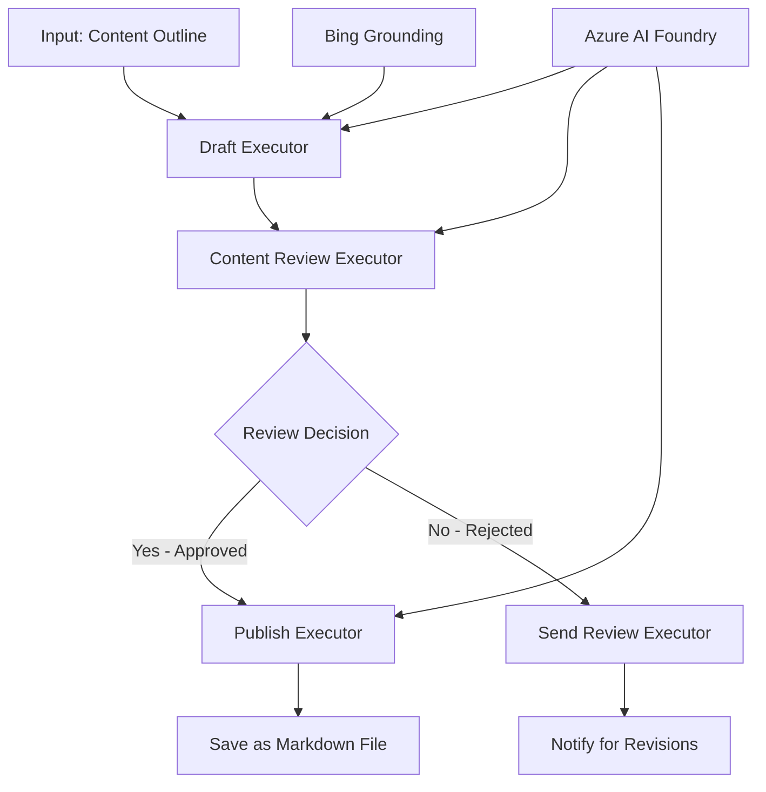

<!--
CO_OP_TRANSLATOR_METADATA:
{
  "original_hash": "8abd335151cee553293b637ee3d80d10",
  "translation_date": "2025-11-11T12:12:00+00:00",
  "source_file": "08-multi-agent/code_samples/workflows-agent-framework/dotNET/04.dotnet-agent-framework-workflow-aifoundry-condition.md",
  "language_code": "pa"
}
-->
# 🔀 ਐਜ਼ਰ ਏਆਈ ਫਾਊਂਡਰੀ (.NET) ਨਾਲ ਸ਼ਰਤਾਂ ਵਾਲੇ ਏਜੰਟ ਵਰਕਫਲੋਜ਼

## 📋 ਸਮਰਥਨਸ਼ੀਲ ਫੈਸਲੇ-ਅਧਾਰਿਤ ਵਰਕਫਲੋ ਟਿਊਟੋਰਿਅਲ

ਇਹ ਨੋਟਬੁੱਕ **ਸ਼ਰਤਾਂ ਵਾਲੇ ਵਰਕਫਲੋ ਪੈਟਰਨ** ਨੂੰ ਐਜ਼ਰ ਏਆਈ ਫਾਊਂਡਰੀ ਅਤੇ ਮਾਈਕਰੋਸਾਫਟ ਏਜੰਟ ਫਰੇਮਵਰਕ ਲਈ .NET ਦੀ ਵਰਤੋਂ ਕਰਕੇ ਦਰਸਾਉਂਦੀ ਹੈ। ਤੁਸੀਂ ਸਿੱਖੋਗੇ ਕਿ ਕਿਵੇਂ ਸੁਧਾਰਤ, ਫੈਸਲੇ-ਚਲਿਤ ਵਰਕਫਲੋ ਬਣਾਉਣੇ ਹਨ ਜੋ AI ਵਿਸ਼ਲੇਸ਼ਣ, ਕਾਰੋਬਾਰੀ ਨਿਯਮਾਂ ਅਤੇ ਗਤੀਸ਼ੀਲ ਸ਼ਰਤਾਂ ਦੇ ਅਧਾਰ 'ਤੇ ਪ੍ਰੋਸੈਸਿੰਗ ਨੂੰ ਸਮਰਥਨਸ਼ੀਲ ਤੌਰ 'ਤੇ ਰੂਟ ਕਰਦੇ ਹਨ।

## 🎯 ਸਿੱਖਣ ਦੇ ਉਦੇਸ਼

### 🧠 **ਸਮਰਥਨਸ਼ੀਲ ਫੈਸਲੇ ਦੀ ਆਰਚਿਟੈਕਚਰ**
- **ਸ਼ਰਤਾਂ ਵਾਲੀ ਲਾਜਿਕ ਦੀ ਲਾਗੂ ਕਰਨਾ**: ਕਈ ਸ਼ਾਖਾਵਾਂ ਵਾਲੇ ਜਟਿਲ ਫੈਸਲੇ ਦੇ ਰੁੱਖ ਬਣਾਓ
- **AI-ਚਲਿਤ ਰੂਟਿੰਗ**: ਸਮਰਥਨਸ਼ੀਲ ਰੂਟਿੰਗ ਫੈਸਲੇ ਕਰਨ ਲਈ ਐਜ਼ਰ ਏਆਈ ਫਾਊਂਡਰੀ ਮਾਡਲ ਦੀ ਵਰਤੋਂ ਕਰੋ
- **ਗਤੀਸ਼ੀਲ ਵਰਕਫਲੋ ਅਨੁਕੂਲਤਾ**: ਰਨਟਾਈਮ ਵਿਸ਼ਲੇਸ਼ਣ ਅਤੇ ਸ਼ਰਤਾਂ ਦੇ ਅਧਾਰ 'ਤੇ ਵਰਕਫਲੋ ਦੇ ਵਿਹਾਰ ਨੂੰ ਬਦਲੋ
- **ਕਾਰੋਬਾਰੀ ਨਿਯਮਾਂ ਦਾ ਸਮਰਥਨ**: ਵਰਕਫਲੋ ਵਿੱਚ ਕਾਰੋਬਾਰੀ ਲਾਜਿਕ ਅਤੇ ਅਨੁਕੂਲਤਾ ਦੀਆਂ ਜ਼ਰੂਰਤਾਂ ਨੂੰ ਸ਼ਾਮਲ ਕਰੋ

### 🔀 **ਉੱਚ-ਸਤਹ ਸ਼ਰਤਾਂ ਵਾਲੇ ਪੈਟਰਨ**
- **ਮਲਟੀ-ਕ੍ਰਾਈਟੇਰੀਆ ਫੈਸਲੇ ਲੈਣਾ**: ਰੂਟਿੰਗ ਫੈਸਲੇ ਲਈ ਕਈ ਕਾਰਕਾਂ ਦਾ ਮੁਲਾਂਕਣ ਕਰੋ
- **ਸੰਦੇਸ਼-ਅਧਾਰਿਤ ਪ੍ਰੋਸੈਸਿੰਗ**: ਵਰਕਫਲੋ ਸੰਦੇਸ਼ ਅਤੇ ਇਤਿਹਾਸ ਦੇ ਅਧਾਰ 'ਤੇ ਫੈਸਲੇ ਕਰੋ
- **ਅਨੁਕੂਲ ਵਰਕਫਲੋ ਸੋਧ**: ਰੀਅਲ-ਟਾਈਮ ਸ਼ਰਤਾਂ ਦੇ ਅਧਾਰ 'ਤੇ ਪ੍ਰੋਸੈਸਿੰਗ ਪਾਥਾਂ ਨੂੰ ਗਤੀਸ਼ੀਲ ਤੌਰ 'ਤੇ ਅਨੁਕੂਲ ਬਣਾਓ
- **ਨਿਯਮ ਇੰਜਨ ਸਮਰਥਨ**: ਵਰਕਫਲੋ ਵਿੱਚ ਜਟਿਲ ਕਾਰੋਬਾਰੀ ਨਿਯਮ ਇੰਜਨਾਂ ਨੂੰ ਲਾਗੂ ਕਰੋ

### 🏢 **ਕਾਰੋਬਾਰੀ ਸ਼ਰਤਾਂ ਵਾਲੇ ਐਪਲੀਕੇਸ਼ਨ**
- **ਦਸਤਾਵੇਜ਼ ਵਰਗੀਕਰਨ ਅਤੇ ਰੂਟਿੰਗ**: ਦਸਤਾਵੇਜ਼ਾਂ ਨੂੰ ਸਹੀ ਵਰਕਫਲੋਜ਼ ਵਿੱਚ ਸਵੈਚਾਲਿਤ ਤੌਰ 'ਤੇ ਵਰਗੀਕਰ ਅਤੇ ਰੂਟ ਕਰੋ
- **ਗਾਹਕ ਸੇਵਾ ਟ੍ਰਾਇਏਜ**: ਗਾਹਕ ਦੀਆਂ ਪੁੱਛਗਿੱਛਾਂ ਨੂੰ ਵਿਸ਼ੇਸ਼ ਹੈਂਡਲਿੰਗ ਟੀਮਾਂ ਨੂੰ ਸਮਰਥਨਸ਼ੀਲ ਤੌਰ 'ਤੇ ਰੂਟ ਕਰੋ
- **ਅਨੁਕੂਲਤਾ ਅਤੇ ਜੋਖਮ ਪ੍ਰੋਸੈਸਿੰਗ**: ਜੋਖਮ ਮੁਲਾਂਕਣ ਦੇ ਅਧਾਰ 'ਤੇ ਵੱਖ-ਵੱਖ ਪ੍ਰਮਾਣਿਕਤਾ ਅਤੇ ਸਮੀਖਿਆ ਪ੍ਰਕਿਰਿਆਵਾਂ ਲਾਗੂ ਕਰੋ
- **ਗੁਣਵੱਤਾ ਅਸ਼ੋਰੈਂਸ ਵਰਕਫਲੋਜ਼**: ਗੁਣਵੱਤਾ ਮਾਪਦੰਡਾਂ ਦੇ ਅਧਾਰ 'ਤੇ ਸਮੀਖਿਆ ਪ੍ਰਕਿਰਿਆਵਾਂ ਰਾਹੀਂ ਸਮੱਗਰੀ ਨੂੰ ਰੂਟ ਕਰੋ

## ⚙️ ਪੂਰਵ-ਸ਼ਰਤਾਂ ਅਤੇ ਸੈਟਅੱਪ

### 📦 **ਲੋੜੀਂਦੇ ਨੂਗੈਟ ਪੈਕੇਜ**

ਸ਼ਰਤਾਂ ਵਾਲੇ ਵਰਕਫਲੋ ਪ੍ਰੋਸੈਸਿੰਗ ਲਈ ਉੱਚ ਪੈਕੇਜ:

```xml
<!-- Core AI Framework -->
<PackageReference Include="Microsoft.Extensions.AI" Version="9.9.0" />

<!-- Azure AI Agents with Persistent State -->
<PackageReference Include="Azure.AI.Agents.Persistent" Version="1.2.0-beta.5" />

<!-- Azure Identity and Utilities -->
<PackageReference Include="Azure.Identity" Version="1.15.0" />
<PackageReference Include="System.Linq.Async" Version="6.0.3" />
<PackageReference Include="DotNetEnv" Version="3.1.1" />

<!-- Local Workflow Framework References -->
<!-- Microsoft.Agents.Workflows.dll - Advanced workflow orchestration -->
<!-- Microsoft.Agents.AI.AzureAI.dll - Azure AI Foundry integration -->
<!-- Microsoft.Agents.AI.dll - Core agent abstractions -->
```

### 🔑 **ਐਜ਼ਰ ਏਆਈ ਫਾਊਂਡਰੀ ਸੰਰਚਨਾ**

**ਲੋੜੀਂਦੇ ਐਜ਼ਰ ਸਰੋਤ:**
- ਸ਼ਰਤਾਂ ਵਾਲੇ ਪ੍ਰੋਸੈਸਿੰਗ ਮਾਡਲਾਂ ਨਾਲ ਐਜ਼ਰ ਏਆਈ ਫਾਊਂਡਰੀ ਵਰਕਸਪੇਸ
- ਸਹੀ ਕੰਪਿਊਟ ਕੋਟਾ ਅਤੇ ਅਧਿਕਾਰਾਂ ਨਾਲ ਐਜ਼ਰ ਸਬਸਕ੍ਰਿਪਸ਼ਨ
- ਫੈਸਲੇ ਲੈਣ ਅਤੇ ਸਮੱਗਰੀ ਵਿਸ਼ਲੇਸ਼ਣ ਲਈ ਤੈਨਾਤ AI ਮਾਡਲ
- (ਵਿਕਲਪਿਕ) ਗ੍ਰਾਊਂਡਿੰਗ ਸਮਰਥਨ ਲਈ ਬਿੰਗ ਸਰਚ API ਕਨੈਕਸ਼ਨ

**ਵਾਤਾਵਰਣ ਸੰਰਚਨਾ (.env ਫਾਈਲ):**
```env
# Azure AI Foundry Configuration
AZURE_AI_PROJECT_ENDPOINT=https://your-project.cognitiveservices.azure.com/
BING_CONNECTION_ID=your-bing-connection-id
```

**ਪ੍ਰਮਾਣਿਕਤਾ ਸੈਟਅੱਪ:**
```csharp
// Azure CLI or Managed Identity authentication
using Azure.Identity;
var credential = new AzureCliCredential();

// Load environment configuration
DotNetEnv.Env.Load("../../../.env");
```

### 🏗️ **ਸ਼ਰਤਾਂ ਵਾਲੀ ਵਰਕਫਲੋ ਆਰਚਿਟੈਕਚਰ**



**ਮੁੱਖ ਹਿੱਸੇ:**
- **ਡ੍ਰਾਫਟ ਐਗਜ਼ਿਕਿਊਟਰ**: AI ਏਜੰਟ ਜੋ ਰੂਪਰੇਖਾ ਤੋਂ ਸ਼ੁਰੂਆਤੀ ਸਮੱਗਰੀ ਡ੍ਰਾਫਟ ਬਣਾਉਂਦਾ ਹੈ
- **ਸਮੱਗਰੀ ਸਮੀਖਿਆ ਐਗਜ਼ਿਕਿਊਟਰ**: AI ਏਜੰਟ ਜੋ ਡ੍ਰਾਫਟ ਗੁਣਵੱਤਾ ਅਤੇ ਅਨੁਕੂਲਤਾ ਦਾ ਮੁਲਾਂਕਣ ਕਰਦਾ ਹੈ
- **ਸ਼ਰਤਾਂ ਵਾਲੀ ਰੂਟਿੰਗ**: ਸਮੀਖਿਆ ਦੇ ਨਤੀਜਿਆਂ ਦੇ ਅਧਾਰ 'ਤੇ ਫੈਸਲੇ ਦੀ ਲਾਜਿਕ ਜੋ ਰੂਟ ਕਰਦੀ ਹੈ
- **ਪਬਲਿਸ਼/ਸਮੀਖਿਆ ਪਾਥ**: ਮਨਜ਼ੂਰ ਕੀਤੀ ਅਤੇ ਰੱਦ ਕੀਤੀ ਸਮੱਗਰੀ ਲਈ ਵੱਖ-ਵੱਖ ਪ੍ਰੋਸੈਸਿੰਗ ਪਾਥ
- **ਸਟੇਟ ਮੈਨੇਜਮੈਂਟ**: ਵਰਕਫਲੋ ਦੇ ਦੌਰਾਨ ਸਮੱਗਰੀ ਅਤੇ ਸਮੀਖਿਆ ਸੰਦੇਸ਼ ਨੂੰ ਬਣਾਈ ਰੱਖਦਾ ਹੈ

## 🎨 **ਸ਼ਰਤਾਂ ਵਾਲੇ ਵਰਕਫਲੋ ਡਿਜ਼ਾਈਨ ਪੈਟਰਨ**

### 📋 **ਗੁਣਵੱਤਾ ਗੇਟਾਂ ਨਾਲ ਸਮੱਗਰੀ ਉਤਪਾਦਨ**
```
Outline → Draft Creation → Quality Review → {Approve: Publish | Reject: Revise}
```

### 🎯 **ਜੋਖਮ-ਅਧਾਰਿਤ ਦਸਤਾਵੇਜ਼ ਪ੍ਰੋਸੈਸਿੰਗ**
```
Document → Risk Assessment → {Low: Standard | High: Enhanced Review}
```

### 🔍 **ਸਮਰਥਨਸ਼ੀਲ ਗਾਹਕ ਸੇਵਾ ਰੂਟਿੰਗ**
```
Customer Query → Analysis → {Simple: FAQ Bot | Complex: Human Agent}
```

### 💼 **ਅਨੁਕੂਲਤਾ-ਚਲਿਤ ਵਰਕਫਲੋਜ਼**
```
Content → Compliance Check → {Pass: Publish | Fail: Legal Review}
```

## 🏢 **ਕਾਰੋਬਾਰੀ ਸ਼ਰਤਾਂ ਵਾਲੇ ਫਾਇਦੇ**

### 🎯 **ਸਮਰਥਨਸ਼ੀਲ ਆਟੋਮੇਸ਼ਨ**
- **ਸਮਰਥਨਸ਼ੀਲ ਫੈਸਲੇ ਲੈਣਾ**: ਸਮੱਗਰੀ ਵਿਸ਼ਲੇਸ਼ਣ ਅਤੇ ਸੰਦੇਸ਼ ਦੇ ਅਧਾਰ 'ਤੇ AI-ਚਲਿਤ ਰੂਟਿੰਗ ਫੈਸਲੇ
- **ਅਨੁਕੂਲ ਪ੍ਰੋਸੈਸਿੰਗ**: ਵਰਕਫਲੋ ਜੋ ਬਦਲ ਰਹੀਆਂ ਸ਼ਰਤਾਂ ਦੇ ਅਧਾਰ 'ਤੇ ਸਵੈਚਾਲਿਤ ਤੌਰ 'ਤੇ ਅਨੁਕੂਲ ਹੁੰਦੇ ਹਨ
- **ਕਾਰੋਬਾਰੀ ਨਿਯਮਾਂ ਦੀ ਲਾਗੂ ਕਰਨਾ**: ਜਟਿਲ ਕਾਰੋਬਾਰੀ ਲਾਜਿਕ ਅਤੇ ਨੀਤੀਆਂ ਦੀ ਸਵੈਚਾਲਿਤ ਲਾਗੂ
- **ਸੰਦੇਸ਼-ਅਧਾਰਿਤ ਰੂਟਿੰਗ**: ਪੂਰੇ ਵਰਕਫਲੋ ਇਤਿਹਾਸ ਅਤੇ ਸੰਦੇਸ਼ ਦੇ ਅਧਾਰ 'ਤੇ ਫੈਸਲੇ

### 📈 **ਚਾਲੂ ਕਰਨ ਦੀ ਸ਼ਾਨਦਾਰਤਾ**
- **ਸਰੋਤਾਂ ਦਾ ਅਨੁਕੂਲ ਵਰਤੋਂ**: ਕੰਮ ਨੂੰ ਸਭ ਤੋਂ ਉਚਿਤ ਵਿਸ਼ੇਸ਼ਜਨਾਂ ਅਤੇ ਪ੍ਰਕਿਰਿਆਵਾਂ ਨੂੰ ਰੂਟ ਕਰੋ
- **ਘੱਟ ਮੈਨੂਅਲ ਦਖਲ**: ਸਵੈਚਾਲਿਤ ਫੈਸਲੇ ਲੈਣ ਨਾਲ ਮਨੁੱਖੀ ਰੂਟਿੰਗ ਦੀ ਲੋੜ ਘੱਟ ਹੁੰਦੀ ਹੈ
- **ਤੇਜ਼ ਨਿਪਟਾਰਾ ਸਮੇਂ**: ਸਹੀ ਵਿਸ਼ੇਸ਼ਤਾ ਅਤੇ ਪ੍ਰਕਿਰਿਆ ਸਮਰਥਨ ਨੂੰ ਸਿੱਧਾ ਰੂਟਿੰਗ
- **ਸਥਿਰ ਲਾਗੂ ਕਰਨਾ**: ਕਾਰੋਬਾਰੀ ਨਿਯਮਾਂ ਅਤੇ ਫੈਸਲੇ ਦੇ ਮਾਪਦੰਡਾਂ ਦੀ ਇਕਸਾਰ ਲਾਗੂ

### 🛡️ **ਜੋਖਮ ਪ੍ਰਬੰਧਨ ਅਤੇ ਅਨੁਕੂਲਤਾ**
- **ਸਵੈਚਾਲਿਤ ਜੋਖਮ ਮੁਲਾਂਕਣ**: ਸਮੱਗਰੀ ਅਤੇ ਸਥਿਤੀ ਦੇ ਜੋਖਮ ਪੱਧਰਾਂ ਦਾ AI-ਚਲਿਤ ਮੁਲਾਂਕਣ
- **ਅਨੁਕੂਲਤਾ ਲਾਗੂ ਕਰਨਾ**: ਲੋੜੀਂਦੇ ਨਿਯਮਕ ਪ੍ਰਕਿਰਿਆਵਾਂ ਰਾਹੀਂ ਸਵੈਚਾਲਿਤ ਰੂਟਿੰਗ
- **ਸੁਰੱਖਿਆ ਪ੍ਰੋਟੋਕੋਲ ਲਾਗੂ ਕਰਨਾ**: ਜੋਖਮ ਮੁਲਾਂਕਣ ਦੇ ਅਧਾਰ 'ਤੇ ਵਧੀਕ ਸੁਰੱਖਿਆ ਉਪਾਅ ਲਾਗੂ
- **ਆਡਿਟ ਟ੍ਰੇਲ ਰੱਖਣਾ**: ਰੂਟਿੰਗ ਫੈਸਲੇ ਅਤੇ ਕਾਰਨ ਦੀ ਪੂਰੀ ਦਸਤਾਵੇਜ਼ੀ

### 📊 **ਵਿਸ਼ਲੇਸ਼ਣ ਅਤੇ ਲਗਾਤਾਰ ਸੁਧਾਰ**
- **ਫੈਸਲੇ ਦੀ ਵਿਸ਼ਲੇਸ਼ਣ**: ਰੂਟਿੰਗ ਫੈਸਲੇ ਦੀ ਪ੍ਰਭਾਵਸ਼ੀਲਤਾ ਅਤੇ ਸਹੀਤਾ ਨੂੰ ਟ੍ਰੈਕ ਕਰੋ
- **ਪੈਟਰਨ ਪਛਾਣ**: ਸਮੇਂ ਦੇ ਨਾਲ ਰੂਟਿੰਗ ਫੈਸਲੇ ਵਿੱਚ ਰੁਝਾਨ ਅਤੇ ਪੈਟਰਨ ਪਛਾਣੋ
- **ਪ੍ਰਦਰਸ਼ਨ ਅਨੁਕੂਲਤਾ**: ਫੈਸਲੇ ਦੇ ਮਾਪਦੰਡਾਂ ਅਤੇ ਰੂਟਿੰਗ ਦੀ ਕੁਸ਼ਲਤਾ ਦਾ ਲਗਾਤਾਰ ਸੁਧਾਰ
- **ਕਾਰੋਬਾਰੀ ਬੁੱਧੀਮਾਨੀ**: ਸਮੱਗਰੀ ਦੇ ਲੱਛਣਾਂ ਅਤੇ ਪ੍ਰਕਿਰਿਆਵਾਂ ਦੀਆਂ ਜ਼ਰੂਰਤਾਂ 'ਤੇ ਅੰਦਰੂਨੀ ਜਾਣਕਾਰੀ

### 🔧 **ਤਕਨੀਕੀ ਸ਼ਾਨਦਾਰਤਾ**
- **ਸਥਿਰ ਸਟੇਟ ਮੈਨੇਜਮੈਂਟ**: ਵਰਕਫਲੋ ਅਮਲ ਦੇ ਦੌਰਾਨ ਜਟਿਲ ਸਟੇਟ ਨੂੰ ਬਣਾਈ ਰੱਖੋ
- **ਸਕੇਲਯੋਗ ਆਰਚਿਟੈਕਚਰ**: ਉੱਚ-ਮਾਤਰਾ ਸ਼ਰਤਾਂ ਵਾਲੇ ਪ੍ਰੋਸੈਸਿੰਗ ਦੀਆਂ ਜ਼ਰੂਰਤਾਂ ਨੂੰ ਸੰਭਾਲੋ
- **ਇੰਟੀਗ੍ਰੇਸ਼ਨ ਸਮਰਥਨ**: ਮੌਜੂਦਾ ਕਾਰੋਬਾਰੀ ਸਿਸਟਮਾਂ ਅਤੇ ਪ੍ਰਕਿਰਿਆਵਾਂ ਨਾਲ ਬੇਰੋਕ ਟੀਕਾਕਰਨ
- **ਮਾਨੀਟਰਿੰਗ ਅਤੇ ਦ੍ਰਿਸ਼ਮਾਨਤਾ**: ਵਰਕਫਲੋ ਦੇ ਪ੍ਰਦਰਸ਼ਨ ਅਤੇ ਫੈਸਲੇ ਦੀ ਵਿਸ਼ਤ੍ਰਿਤ ਟ੍ਰੈਕਿੰਗ

ਆਓ .NET ਨਾਲ ਸਮਰਥਨਸ਼ੀਲ, ਫੈਸਲੇ-ਚਲਿਤ ਕਾਰੋਬਾਰੀ ਵਰਕਫਲੋ ਬਣਾਈਏ! 🚀

## 💻 ਕੋਡ ਚਲਾਉਣਾ

ਪੂਰੀ ਲਾਗੂ ਕਰਨ ਦੀ ਵਿਵਰਣਾ `04.dotnet-agent-framework-workflow-aifoundry-condition.cs` ਵਿੱਚ ਉਪਲਬਧ ਹੈ। ਇਹ **ਗੁਣਵੱਤਾ ਗੇਟਾਂ ਨਾਲ ਸਮੱਗਰੀ ਉਤਪਾਦਨ ਵਰਕਫਲੋ** ਨੂੰ ਦਰਸਾਉਂਦਾ ਹੈ:

### 🏗️ **ਵਰਕਫਲੋ ਆਰਚਿਟੈਕਚਰ**

```
Content Outline → Draft Creation → Quality Review → Conditional Routing:
                                                      ├─ Approved (>200 words) → Publish
                                                      └─ Rejected (<200 words) → Review Notification
```

**ਵਰਕਫਲੋ ਵਿੱਚ ਏਜੰਟ:**
1. **ਇਵੈਂਜਲਿਸਟ ਏਜੰਟ**: ਬਿੰਗ ਗ੍ਰਾਊਂਡਿੰਗ ਨਾਲ ਰੂਪਰੇਖਾ ਤੋਂ ਟਿਊਟੋਰਿਅਲ ਡ੍ਰਾਫਟ ਬਣਾਉਂਦਾ ਹੈ
2. **ਸਮੱਗਰੀ ਸਮੀਖਿਆਕਾਰ ਏਜੰਟ**: ਡ੍ਰਾਫਟ ਗੁਣਵੱਤਾ ਦਾ ਮੁਲਾਂਕਣ ਕਰਦਾ ਹੈ (ਸ਼ਬਦ ਗਿਣਤੀ, ਪੂਰਨਤਾ)
3. **ਪਬਲਿਸ਼ਰ ਏਜੰਟ**: ਮਨਜ਼ੂਰ ਕੀਤੀ ਸਮੱਗਰੀ ਨੂੰ ਟਾਈਮਸਟੈਂਪਡ ਮਾਰਕਡਾਊਨ ਫਾਈਲਾਂ ਵਜੋਂ ਸੇਵ ਕਰਦਾ ਹੈ

**ਕਸਟਮ ਐਗਜ਼ਿਕਿਊਟਰ:**
1. **DraftExecutor**: ਡ੍ਰਾਫਟ ਬਣਾਉਣ ਦੀ ਪ੍ਰਕਿਰਿਆ ਨੂੰ ਸੰਚਾਲਿਤ ਕਰਦਾ ਹੈ
2. **ContentReviewExecutor**: ਗੁਣਵੱਤਾ ਮੁਲਾਂਕਣ ਕਰਦਾ ਹੈ
3. **PublishExecutor**: ਮਨਜ਼ੂਰ ਕੀਤੀ ਸਮੱਗਰੀ ਦੇ ਪ੍ਰਕਾਸ਼ਨ ਨੂੰ ਸੰਭਾਲਦਾ ਹੈ
4. **SendReviewExecutor**: ਰੱਦ ਕੀਤੀ ਸਮੱਗਰੀ ਦੀਆਂ ਸੂਚਨਾਵਾਂ ਦਾ ਪ੍ਰਬੰਧਨ ਕਰਦਾ ਹੈ

### 🚀 ਉਦਾਹਰਨ ਚਲਾਉਣਾ

**ਪੂਰਵ-ਸ਼ਰਤਾਂ:**
- ਸੰਰਚਿਤ ਐਜ਼ਰ ਏਆਈ ਫਾਊਂਡਰੀ ਵਰਕਸਪੇਸ
- ਐਜ਼ਰ CLI ਪ੍ਰਮਾਣਿਕਤਾ (`az login`)
- (ਵਿਕਲਪਿਕ) ਗ੍ਰਾਊਂਡਿੰਗ ਲਈ ਬਿੰਗ ਸਰਚ ਕਨੈਕਸ਼ਨ

```bash
# Make the script executable (Unix/Linux/macOS)
chmod +x 04.dotnet-agent-framework-workflow-aifoundry-condition.cs

# Run the conditional workflow
./04.dotnet-agent-framework-workflow-aifoundry-condition.cs
```

ਜਾਂ Windows 'ਤੇ:
```powershell
dotnet run 04.dotnet-agent-framework-workflow-aifoundry-condition.cs
```

### 📝 ਉਮੀਦ ਕੀਤੀ ਨਤੀਜਾ

ਵਰਕਫਲੋ:
1. **ਏਜੰਟ ਬਣਾਏਗਾ**: ਤਿੰਨ ਵਿਸ਼ੇਸ਼ ਐਜ਼ਰ ਏਆਈ ਫਾਊਂਡਰੀ ਏਜੰਟ ਸ਼ੁਰੂ ਕਰੇਗਾ
2. **ਡ੍ਰਾਫਟ ਬਣਾਓ**: ਇਵੈਂਜਲਿਸਟ ਏਜੰਟ ਰੂਪਰੇਖਾ ਤੋਂ ਟਿਊਟੋਰਿਅਲ ਡ੍ਰਾਫਟ ਬਣਾਉਂਦਾ ਹੈ
3. **ਸਮੱਗਰੀ ਦੀ ਸਮੀਖਿਆ ਕਰੋ**: ਸਮੱਗਰੀ ਸਮੀਖਿਆਕਾਰ ਡ੍ਰਾਫਟ ਗੁਣਵੱਤਾ ਦਾ ਮੁਲਾਂਕਣ ਕਰਦਾ ਹੈ
4. **ਸ਼ਰਤਾਂ ਵਾਲੀ ਰੂਟਿੰਗ**:
   - **ਜੇ ਮਨਜ਼ੂਰ (>200 ਸ਼ਬਦ)**: ਪਬਲਿਸ਼ ਐਗਜ਼ਿਕਿਊਟਰ ਮਾਰਕਡਾਊਨ ਫਾਈਲ ਵਜੋਂ ਸੇਵ ਕਰਦਾ ਹੈ
   - **ਜੇ ਰੱਦ (<200 ਸ਼ਬਦ)**: ਸਮੀਖਿਆ ਸੂਚਨਾ ਭੇਜੋ
5. **ਨਤੀਜੇ ਦਿਖਾਓ**: ਅੰਤਮ ਵਰਕਫਲੋ ਨਤੀਜੇ ਦਿਖਾਓ

### 🔧 ਕਸਟਮਾਈਜ਼ੇਸ਼ਨ ਵਿਕਲਪ

**ਸਮੀਖਿਆ ਮਾਪਦੰਡ ਸੋਧੋ:**
```csharp
const string ContentReviewerInstructions = @"
You are a content reviewer...
1. Check if content is more than 500 words (instead of 200)
2. Verify technical accuracy
3. Ensure proper formatting
...";
```

**ਹੋਰ ਸ਼ਰਤਾਂ ਵਾਲੇ ਪਾਥ ਸ਼ਾਮਲ ਕਰੋ:**
```csharp
var workflow = new WorkflowBuilder(draftExecutor)
    .AddEdge(draftExecutor, contentReviewerExecutor)
    .AddEdge(contentReviewerExecutor, publishExecutor, condition: GetCondition("Excellent"))
    .AddEdge(contentReviewerExecutor, editExecutor, condition: GetCondition("Good"))
    .AddEdge(contentReviewerExecutor, sendReviewerExecutor, condition: GetCondition("Poor"))
    .Build();
```

**ਸਮੱਗਰੀ ਦੀਆਂ ਜ਼ਰੂਰਤਾਂ ਬਦਲੋ:**
```csharp
string OUTLINE_Content = @"
# Your Custom Topic
## Section 1
https://your-reference-url
## Section 2
...
";
```

### 🎯 ਅਸਲ-ਦੁਨੀਆ ਦੇ ਐਪਲੀਕੇਸ਼ਨ

ਇਹ ਸ਼ਰਤਾਂ ਵਾਲਾ ਵਰਕਫਲੋ ਪੈਟਰਨ ਇਨ੍ਹਾਂ ਲਈ ਆਦਰਸ਼ ਹੈ:
- **ਸਮੱਗਰੀ ਪ੍ਰਬੰਧਨ ਸਿਸਟਮ**: ਗੁਣਵੱਤਾ ਗੇਟਾਂ ਨਾਲ ਸਵੈਚਾਲਿਤ ਸੰਪਾਦਕੀ ਵਰਕਫਲੋ
- **ਦਸਤਾਵੇਜ਼ ਪ੍ਰੋਸੈਸਿੰਗ**: ਵਰਗੀਕਰਨ ਅਤੇ ਅਨੁਕੂਲਤਾ ਦੇ ਅਧਾਰ 'ਤੇ ਦਸਤਾਵੇਜ਼ਾਂ ਨੂੰ ਰੂਟ ਕਰੋ
- **ਗਾਹਕ ਸਹਾਇਤਾ**: ਜਟਿਲਤਾ ਅਤੇ ਤਤਕਾਲਤਾ ਦੇ ਅਧਾਰ 'ਤੇ ਸਮਰਥਨਸ਼ੀਲ ਟਿਕਟ ਰੂਟਿੰਗ
- **ਕਾਨੂੰਨੀ ਸਮੀਖਿਆ**: ਜੋਖਮ ਮੁਲਾਂਕਣ ਅਤੇ ਮੁੱਲ ਦੇ ਅਧਾਰ 'ਤੇ ਸਮਝੌਤਿਆਂ ਨੂੰ ਰੂਟ ਕਰੋ
- **HR ਪ੍ਰਕਿਰਿਆਵਾਂ**: ਸਹੀ ਸਕ੍ਰੀਨਿੰਗ ਵਰਕਫਲੋਜ਼ ਰਾਹੀਂ ਅਰਜ਼ੀਆਂ ਨੂੰ ਰੂਟ ਕਰੋ

### 🔍 ਸ਼ਰਤਾਂ ਵਾਲੀ ਲਾਜਿਕ ਨੂੰ ਸਮਝਣਾ

**ਸ਼ਰਤ ਫੰਕਸ਼ਨ:**
```csharp
public Func<object?, bool> GetCondition(string expectedResult) =>
    reviewResult => reviewResult is ReviewResult review && review.Result == expectedResult;
```

ਇਹ ਫੰਕਸ਼ਨ ਇੱਕ ਪਰੇਡੀਕੇਟ ਬਣਾਉਂਦਾ ਹੈ ਜੋ:
1. ਜਾਂਚਦਾ ਹੈ ਕਿ ਨਤੀਜਾ `ReviewResult` ਕਿਸਮ ਦਾ ਹੈ
2. `Result` ਗੁਣ ਨੂੰ ਉਮੀਦ ਕੀਤੀ ਮੁੱਲ ਨਾਲ ਤੁਲਨਾ ਕਰਦਾ ਹੈ
3. ਰੂਟਿੰਗ ਨੂੰ ਨਿਰਧਾਰਤ ਕਰਨ ਲਈ ਸੱਚ/ਝੂਠ ਵਾਪਸ ਕਰਦਾ ਹੈ

**ਸ਼ਰਤਾਂ ਨਾਲ ਵਰਕਫਲੋ ਐਜਜ਼:**
```csharp
.AddEdge(contentReviewerExecutor, publishExecutor, condition: GetCondition("Yes"))
.AddEdge(contentReviewerExecutor, sendReviewerExecutor, condition: GetCondition("No"))
```

### 📊 ਉੱਚ-ਸਤਹ ਵਿਸ਼ੇਸ਼ਤਾਵਾਂ

**JSON ਸਕੀਮਾ ਪ੍ਰਮਾਣਿਕਤਾ:**
ਵਰਕਫਲੋ JSON ਸਕੀਮਾਂ ਦੀ ਵਰਤੋਂ ਕਰਦਾ ਹੈ ਤਾਂ ਜੋ ਸੰਰਚਿਤ ਜਵਾਬਾਂ ਨੂੰ ਯਕੀਨੀ ਬਣਾਇਆ ਜਾ ਸਕੇ:

```csharp
// Define response structure
public class ReviewResult
{
    [JsonPropertyName("review_result")]
    public string Result { get; set; } = string.Empty;
    
    [JsonPropertyName("reason")]
    public string Reason { get; set; } = string.Empty;
    
    [JsonPropertyName("draft_content")]
    public string DraftContent { get; set; } = string.Empty;
}

// Apply to agent
ResponseFormat = ChatResponseFormat.ForJsonSchema(
    AIJsonUtilities.CreateJsonSchema(typeof(ReviewResult)), 
    "ReviewResult", 
    "Review Result From DraftContent"
)
```

**ਬਿੰਗ ਗ੍ਰਾਊਂਡਿੰਗ ਸਮਰਥਨ:**
ਇਵੈਂਜ

---

<!-- CO-OP TRANSLATOR DISCLAIMER START -->
**ਅਸਵੀਕਰਤਾ**:  
ਇਹ ਦਸਤਾਵੇਜ਼ AI ਅਨੁਵਾਦ ਸੇਵਾ [Co-op Translator](https://github.com/Azure/co-op-translator) ਦੀ ਵਰਤੋਂ ਕਰਕੇ ਅਨੁਵਾਦ ਕੀਤਾ ਗਿਆ ਹੈ। ਜਦੋਂ ਕਿ ਅਸੀਂ ਸਹੀ ਹੋਣ ਦੀ ਕੋਸ਼ਿਸ਼ ਕਰਦੇ ਹਾਂ, ਕਿਰਪਾ ਕਰਕੇ ਧਿਆਨ ਦਿਓ ਕਿ ਸਵੈਚਾਲਿਤ ਅਨੁਵਾਦਾਂ ਵਿੱਚ ਗਲਤੀਆਂ ਜਾਂ ਅਸੁਚੀਤਤਾਵਾਂ ਹੋ ਸਕਦੀਆਂ ਹਨ। ਇਸ ਦੀ ਮੂਲ ਭਾਸ਼ਾ ਵਿੱਚ ਮੂਲ ਦਸਤਾਵੇਜ਼ ਨੂੰ ਅਧਿਕਾਰਤ ਸਰੋਤ ਮੰਨਿਆ ਜਾਣਾ ਚਾਹੀਦਾ ਹੈ। ਮਹੱਤਵਪੂਰਨ ਜਾਣਕਾਰੀ ਲਈ, ਪੇਸ਼ੇਵਰ ਮਨੁੱਖੀ ਅਨੁਵਾਦ ਦੀ ਸਿਫਾਰਸ਼ ਕੀਤੀ ਜਾਂਦੀ ਹੈ। ਇਸ ਅਨੁਵਾਦ ਦੀ ਵਰਤੋਂ ਤੋਂ ਪੈਦਾ ਹੋਣ ਵਾਲੇ ਕਿਸੇ ਵੀ ਗਲਤਫਹਿਮੀ ਜਾਂ ਗਲਤ ਵਿਆਖਿਆ ਲਈ ਅਸੀਂ ਜ਼ਿੰਮੇਵਾਰ ਨਹੀਂ ਹਾਂ।
<!-- CO-OP TRANSLATOR DISCLAIMER END -->