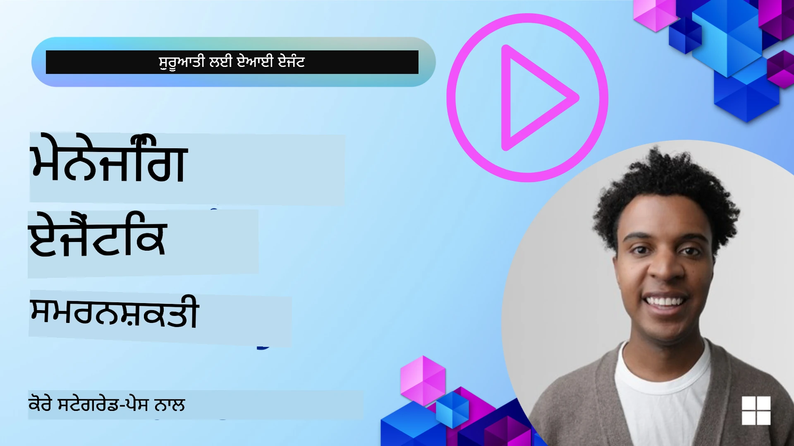

<!--
CO_OP_TRANSLATOR_METADATA:
{
  "original_hash": "a1d90991499ad697c4ad24decaf36968",
  "translation_date": "2025-12-09T12:13:29+00:00",
  "source_file": "13-agent-memory/README.md",
  "language_code": "pa"
}
-->
# ਏਆਈ ਏਜੰਟਾਂ ਲਈ ਮੈਮੋਰੀ 

ਜਦੋਂ ਏਆਈ ਏਜੰਟਾਂ ਬਣਾਉਣ ਦੇ ਵਿਲੱਖਣ ਫਾਇਦਿਆਂ ਬਾਰੇ ਗੱਲ ਕੀਤੀ ਜਾਂਦੀ ਹੈ, ਤਾਂ ਮੁੱਖ ਤੌਰ 'ਤੇ ਦੋ ਗੱਲਾਂ 'ਤੇ ਚਰਚਾ ਹੁੰਦੀ ਹੈ: ਟਾਸਕ ਪੂਰੇ ਕਰਨ ਲਈ ਟੂਲ ਕਾਲ ਕਰਨ ਦੀ ਸਮਰੱਥਾ ਅਤੇ ਸਮੇਂ ਦੇ ਨਾਲ ਸੁਧਾਰ ਕਰਨ ਦੀ ਯੋਗਤਾ। ਮੈਮੋਰੀ ਇੱਕ ਸਵੈ-ਸੁਧਾਰਕ ਏਜੰਟ ਬਣਾਉਣ ਦੀ ਬੁਨਿਆਦ ਹੈ ਜੋ ਸਾਡੇ ਯੂਜ਼ਰਾਂ ਲਈ ਵਧੀਆ ਤਜਰਬੇ ਪੈਦਾ ਕਰ ਸਕੇ।

ਇਸ ਪਾਠ ਵਿੱਚ, ਅਸੀਂ ਦੇਖਾਂਗੇ ਕਿ ਏਆਈ ਏਜੰਟਾਂ ਲਈ ਮੈਮੋਰੀ ਕੀ ਹੈ ਅਤੇ ਅਸੀਂ ਇਸਨੂੰ ਕਿਵੇਂ ਪ੍ਰਬੰਧਿਤ ਅਤੇ ਵਰਤ ਸਕਦੇ ਹਾਂ ਤਾਂ ਜੋ ਸਾਡੇ ਐਪਲੀਕੇਸ਼ਨਾਂ ਨੂੰ ਲਾਭ ਹੋਵੇ।

## ਪਰਿਚਯ

ਇਸ ਪਾਠ ਵਿੱਚ ਇਹ ਕਵਰ ਕੀਤਾ ਜਾਵੇਗਾ:

• **ਏਆਈ ਏਜੰਟ ਮੈਮੋਰੀ ਦੀ ਸਮਝ**: ਮੈਮੋਰੀ ਕੀ ਹੈ ਅਤੇ ਇਹ ਏਜੰਟਾਂ ਲਈ ਕਿਉਂ ਜ਼ਰੂਰੀ ਹੈ।

• **ਮੈਮੋਰੀ ਲਾਗੂ ਕਰਨਾ ਅਤੇ ਸਟੋਰ ਕਰਨਾ**: ਤੁਹਾਡੇ ਏਆਈ ਏਜੰਟਾਂ ਵਿੱਚ ਮੈਮੋਰੀ ਸਮਰੱਥਾਵਾਂ ਸ਼ਾਮਲ ਕਰਨ ਦੇ ਪ੍ਰੈਕਟਿਕਲ ਤਰੀਕੇ, ਖਾਸ ਕਰਕੇ ਸ਼ਾਰਟ-ਟਰਮ ਅਤੇ ਲਾਂਗ-ਟਰਮ ਮੈਮੋਰੀ 'ਤੇ ਧਿਆਨ ਦੇਣ।

• **ਏਆਈ ਏਜੰਟਾਂ ਨੂੰ ਸਵੈ-ਸੁਧਾਰਕ ਬਣਾਉਣਾ**: ਮੈਮੋਰੀ ਕਿਵੇਂ ਏਜੰਟਾਂ ਨੂੰ ਪਿਛਲੇ ਇੰਟਰੈਕਸ਼ਨ ਤੋਂ ਸਿੱਖਣ ਅਤੇ ਸਮੇਂ ਦੇ ਨਾਲ ਸੁਧਾਰ ਕਰਨ ਯੋਗ ਬਣਾਉਂਦੀ ਹੈ।

## ਉਪਲਬਧ ਇੰਪਲੀਮੈਂਟੇਸ਼ਨ

ਇਸ ਪਾਠ ਵਿੱਚ ਦੋ ਵਿਸਤ੍ਰਿਤ ਨੋਟਬੁੱਕ ਟਿਊਟੋਰੀਅਲ ਸ਼ਾਮਲ ਹਨ:

• **[13-agent-memory.ipynb](./13-agent-memory.ipynb)**: ਮੈਮੋਰੀ ਨੂੰ Mem0 ਅਤੇ Azure AI Search ਨਾਲ Semantic Kernel ਫਰੇਮਵਰਕ ਦੀ ਵਰਤੋਂ ਕਰਕੇ ਲਾਗੂ ਕਰਦਾ ਹੈ।

• **[13-agent-memory-cognee.ipynb](./13-agent-memory-cognee.ipynb)**: Cognee ਦੀ ਵਰਤੋਂ ਕਰਕੇ ਸਟ੍ਰਕਚਰਡ ਮੈਮੋਰੀ ਲਾਗੂ ਕਰਦਾ ਹੈ, ਜੋ ਕਿ ਇੰਬੈਡਿੰਗ ਦੁਆਰਾ ਸਮਰਥਿਤ ਨੋਲੇਜ ਗ੍ਰਾਫ ਬਣਾਉਂਦਾ ਹੈ, ਗ੍ਰਾਫ ਨੂੰ ਵਿਜੁਅਲਾਈਜ਼ ਕਰਦਾ ਹੈ, ਅਤੇ ਸਮਾਰਟ ਰੀਟਰੀਵਲ ਪ੍ਰਦਾਨ ਕਰਦਾ ਹੈ।

## ਸਿੱਖਣ ਦੇ ਲਕਸ਼

ਇਹ ਪਾਠ ਪੂਰਾ ਕਰਨ ਤੋਂ ਬਾਅਦ, ਤੁਸੀਂ ਇਹ ਜਾਣ ਸਕੋਗੇ:

• **ਏਆਈ ਏਜੰਟ ਮੈਮੋਰੀ ਦੇ ਵੱਖ-ਵੱਖ ਪ੍ਰਕਾਰਾਂ ਵਿੱਚ ਅੰਤਰ ਕਰਨਾ**, ਜਿਸ ਵਿੱਚ ਵਰਕਿੰਗ, ਸ਼ਾਰਟ-ਟਰਮ, ਅਤੇ ਲਾਂਗ-ਟਰਮ ਮੈਮੋਰੀ ਸ਼ਾਮਲ ਹਨ, ਨਾਲ ਹੀ ਵਿਸ਼ੇਸ਼ ਰੂਪਾਂ ਜਿਵੇਂ ਕਿ ਪੇਰਸੋਨਾ ਅਤੇ ਐਪੀਸੋਡਿਕ ਮੈਮੋਰੀ।

• **Semantic Kernel ਫਰੇਮਵਰਕ ਦੀ ਵਰਤੋਂ ਕਰਕੇ ਏਆਈ ਏਜੰਟਾਂ ਲਈ ਸ਼ਾਰਟ-ਟਰਮ ਅਤੇ ਲਾਂਗ-ਟਰਮ ਮੈਮੋਰੀ ਲਾਗੂ ਅਤੇ ਪ੍ਰਬੰਧਿਤ ਕਰਨਾ**, ਜਿਵੇਂ ਕਿ Mem0, Cognee, Whiteboard ਮੈਮੋਰੀ, ਅਤੇ Azure AI Search ਨਾਲ ਇੰਟੀਗ੍ਰੇਸ਼ਨ।

• **ਸਵੈ-ਸੁਧਾਰਕ ਏਆਈ ਏਜੰਟਾਂ ਦੇ ਮੂਲ ਸਿਧਾਂਤਾਂ ਨੂੰ ਸਮਝਣਾ** ਅਤੇ ਮਜ਼ਬੂਤ ਮੈਮੋਰੀ ਪ੍ਰਬੰਧਨ ਪ੍ਰਣਾਲੀਆਂ ਕਿਵੇਂ ਨਿਰੰਤਰ ਸਿੱਖਣ ਅਤੇ ਅਨੁਕੂਲਤਾ ਵਿੱਚ ਯੋਗਦਾਨ ਪਾਉਂਦੀਆਂ ਹਨ।

## ਏਆਈ ਏਜੰਟ ਮੈਮੋਰੀ ਦੀ ਸਮਝ

ਮੂਲ ਰੂਪ ਵਿੱਚ, **ਏਆਈ ਏਜੰਟਾਂ ਲਈ ਮੈਮੋਰੀ ਉਹ ਮਕੈਨਿਜ਼ਮ ਹਨ ਜੋ ਉਨ੍ਹਾਂ ਨੂੰ ਜਾਣਕਾਰੀ ਰੱਖਣ ਅਤੇ ਯਾਦ ਕਰਨ ਦੇ ਯੋਗ ਬਣਾਉਂਦੇ ਹਨ**। ਇਹ ਜਾਣਕਾਰੀ ਗੱਲਬਾਤ ਦੇ ਖਾਸ ਵੇਰਵੇ, ਯੂਜ਼ਰ ਦੀਆਂ ਪਸੰਦਾਂ, ਪਿਛਲੇ ਕਾਰਜਾਂ, ਜਾਂ ਸਿੱਖੇ ਪੈਟਰਨ ਹੋ ਸਕਦੇ ਹਨ।

ਮੈਮੋਰੀ ਤੋਂ ਬਿਨਾਂ, ਏਆਈ ਐਪਲੀਕੇਸ਼ਨ ਅਕਸਰ ਸਟੇਟਲੈੱਸ ਹੁੰਦੇ ਹਨ, ਜਿਸਦਾ ਮਤਲਬ ਹੈ ਕਿ ਹਰ ਇੰਟਰੈਕਸ਼ਨ ਨਵੇਂ ਸਿਰੇ ਤੋਂ ਸ਼ੁਰੂ ਹੁੰਦਾ ਹੈ। ਇਸ ਨਾਲ ਇੱਕ ਦੁਹਰਾਉਣ ਵਾਲਾ ਅਤੇ ਨਿਰਾਸ਼ਾਜਨਕ ਯੂਜ਼ਰ ਅਨੁਭਵ ਹੁੰਦਾ ਹੈ ਜਿੱਥੇ ਏਜੰਟ ਪਿਛਲੇ ਸੰਦਰਭ ਜਾਂ ਪਸੰਦਾਂ ਨੂੰ "ਭੁੱਲ" ਜਾਂਦਾ ਹੈ।

### ਮੈਮੋਰੀ ਕਿਉਂ ਮਹੱਤਵਪੂਰਨ ਹੈ?

ਏਜੰਟ ਦੀ ਬੁੱਧੀਮਾਨਤਾ ਇਸ ਦੀ ਯੋਗਤਾ ਨਾਲ ਗਹਿਰਾਈ ਨਾਲ ਜੁੜੀ ਹੋਈ ਹੈ ਕਿ ਉਹ ਪਿਛਲੀ ਜਾਣਕਾਰੀ ਨੂੰ ਯਾਦ ਕਰ ਸਕੇ ਅਤੇ ਵਰਤ ਸਕੇ। ਮੈਮੋਰੀ ਏਜੰਟਾਂ ਨੂੰ ਇਹ ਯੋਗ ਬਣਾਉਂਦੀ ਹੈ:

• **ਵਿਚਾਰਸ਼ੀਲ**: ਪਿਛਲੇ ਕਾਰਜਾਂ ਅਤੇ ਨਤੀਜਿਆਂ ਤੋਂ ਸਿੱਖਣਾ।

• **ਇੰਟਰੈਕਟਿਵ**: ਚਾਲੂ ਗੱਲਬਾਤ ਦੇ ਦੌਰਾਨ ਸੰਦਰਭ ਨੂੰ ਕਾਇਮ ਰੱਖਣਾ।

• **ਪ੍ਰੋਐਕਟਿਵ ਅਤੇ ਰੀਐਕਟਿਵ**: ਇਤਿਹਾਸਕ ਡਾਟਾ ਦੇ ਆਧਾਰ 'ਤੇ ਜ਼ਰੂਰਤਾਂ ਦਾ ਅਨੁਮਾਨ ਲਗਾਉਣਾ ਜਾਂ ਉਚਿਤ ਤਰੀਕੇ ਨਾਲ ਪ੍ਰਤੀਕਿਰਿਆ ਦੇਣਾ।

• **ਸਵੈ-ਨਿਰਭਰ**: ਸਟੋਰ ਕੀਤੀ ਗਿਆਨ ਦੀ ਵਰਤੋਂ ਕਰਕੇ ਵਧੇਰੇ ਸਵੈ-ਨਿਰਭਰਤਾ ਨਾਲ ਕੰਮ ਕਰਨਾ।

ਮੈਮੋਰੀ ਲਾਗੂ ਕਰਨ ਦਾ ਮਕਸਦ ਏਜੰਟਾਂ ਨੂੰ ਵਧੇਰੇ **ਭਰੋਸੇਯੋਗ ਅਤੇ ਸਮਰੱਥ** ਬਣਾਉਣਾ ਹੈ।

### ਮੈਮੋਰੀ ਦੇ ਪ੍ਰਕਾਰ

#### ਵਰਕਿੰਗ ਮੈਮੋਰੀ

ਇਸਨੂੰ ਇੱਕ ਕਾਗਜ਼ ਦੇ ਟੁਕੜੇ ਵਾਂਗ ਸੋਚੋ ਜੋ ਇੱਕ ਏਜੰਟ ਇੱਕੋ ਸਮੇਂ ਚੱਲ ਰਹੇ ਟਾਸਕ ਜਾਂ ਸੋਚਣ ਦੀ ਪ੍ਰਕਿਰਿਆ ਦੌਰਾਨ ਵਰਤਦਾ ਹੈ। ਇਹ ਤੁਰੰਤ ਜਾਣਕਾਰੀ ਰੱਖਦਾ ਹੈ ਜੋ ਅਗਲੇ ਕਦਮ ਦੀ ਗਣਨਾ ਕਰਨ ਲਈ ਲੋੜੀਂਦੀ ਹੁੰਦੀ ਹੈ।

ਏਆਈ ਏਜੰਟਾਂ ਲਈ, ਵਰਕਿੰਗ ਮੈਮੋਰੀ ਅਕਸਰ ਗੱਲਬਾਤ ਤੋਂ ਸਭ ਤੋਂ ਪ੍ਰਸੰਗਿਕ ਜਾਣਕਾਰੀ ਕੈਪਚਰ ਕਰਦੀ ਹੈ, ਭਾਵੇਂ ਪੂਰੀ ਚੈਟ ਇਤਿਹਾਸ ਲੰਬਾ ਜਾਂ ਕੱਟਿਆ ਹੋਇਆ ਹੋਵੇ। ਇਹ ਮੁੱਖ ਤੱਤਾਂ ਨੂੰ ਕੈਪਚਰ ਕਰਨ 'ਤੇ ਧਿਆਨ ਕੇਂਦਰਿਤ ਕਰਦੀ ਹੈ ਜਿਵੇਂ ਕਿ ਲੋੜਾਂ, ਪ੍ਰਸਤਾਵਾਂ, ਫੈਸਲੇ, ਅਤੇ ਕਾਰਵਾਈਆਂ।

**ਵਰਕਿੰਗ ਮੈਮੋਰੀ ਉਦਾਹਰਨ**

ਇੱਕ ਟਰੈਵਲ ਬੁਕਿੰਗ ਏਜੰਟ ਵਿੱਚ, ਵਰਕਿੰਗ ਮੈਮੋਰੀ ਯੂਜ਼ਰ ਦੀ ਮੌਜੂਦਾ ਬੇਨਤੀ ਕੈਪਚਰ ਕਰ ਸਕਦੀ ਹੈ, ਜਿਵੇਂ ਕਿ "ਮੈਂ ਪੈਰਿਸ ਦੀ ਯਾਤਰਾ ਬੁਕ ਕਰਨਾ ਚਾਹੁੰਦਾ ਹਾਂ"। ਇਹ ਖਾਸ ਲੋੜ ਮੌਜੂਦਾ ਇੰਟਰੈਕਸ਼ਨ ਨੂੰ ਗਾਈਡ ਕਰਨ ਲਈ ਏਜੰਟ ਦੇ ਤੁਰੰਤ ਸੰਦਰਭ ਵਿੱਚ ਰੱਖੀ ਜਾਂਦੀ ਹੈ।

#### ਸ਼ਾਰਟ ਟਰਮ ਮੈਮੋਰੀ

ਇਹ ਪ੍ਰਕਾਰ ਦੀ ਮੈਮੋਰੀ ਇੱਕ ਗੱਲਬਾਤ ਜਾਂ ਸੈਸ਼ਨ ਦੇ ਦੌਰਾਨ ਜਾਣਕਾਰੀ ਨੂੰ ਰੱਖਦੀ ਹੈ। ਇਹ ਮੌਜੂਦਾ ਚੈਟ ਦਾ ਸੰਦਰਭ ਹੈ, ਜੋ ਏਜੰਟ ਨੂੰ ਗੱਲਬਾਤ ਦੇ ਪਿਛਲੇ ਮੋੜਾਂ ਨੂੰ ਯਾਦ ਕਰਨ ਦੇ ਯੋਗ ਬਣਾਉਂਦੀ ਹੈ।

**ਸ਼ਾਰਟ ਟਰਮ ਮੈਮੋਰੀ ਉਦਾਹਰਨ**

ਜੇਕਰ ਕੋਈ ਯੂਜ਼ਰ ਪੁੱਛਦਾ ਹੈ, "ਪੈਰਿਸ ਲਈ ਫਲਾਈਟ ਦੀ ਕੀਮਤ ਕਿੰਨੀ ਹੋਵੇਗੀ?" ਅਤੇ ਫਿਰ ਅਗਲੇ ਸਵਾਲ ਵਿੱਚ ਕਹਿੰਦਾ ਹੈ "ਉਥੇ ਰਹਿਣ ਲਈ ਕੀ ਵਿਕਲਪ ਹਨ?", ਤਾਂ ਸ਼ਾਰਟ ਟਰਮ ਮੈਮੋਰੀ ਇਹ ਯਕੀਨੀ ਬਣਾਉਂਦੀ ਹੈ ਕਿ ਏਜੰਟ ਜਾਣਦਾ ਹੈ "ਉਥੇ" ਦਾ ਮਤਲਬ "ਪੈਰਿਸ" ਹੈ।

#### ਲਾਂਗ ਟਰਮ ਮੈਮੋਰੀ

ਇਹ ਉਹ ਜਾਣਕਾਰੀ ਹੈ ਜੋ ਕਈ ਗੱਲਬਾਤਾਂ ਜਾਂ ਸੈਸ਼ਨਾਂ ਵਿੱਚ ਕਾਇਮ ਰਹਿੰਦੀ ਹੈ। ਇਹ ਏਜੰਟਾਂ ਨੂੰ ਯੂਜ਼ਰ ਦੀਆਂ ਪਸੰਦਾਂ, ਇਤਿਹਾਸਕ ਇੰਟਰੈਕਸ਼ਨ, ਜਾਂ ਆਮ ਗਿਆਨ ਨੂੰ ਲੰਬੇ ਸਮੇਂ ਤੱਕ ਯਾਦ ਰੱਖਣ ਦੇ ਯੋਗ ਬਣਾਉਂਦੀ ਹੈ। ਇਹ ਨਿੱਜੀਕਰਨ ਲਈ ਮਹੱਤਵਪੂਰਨ ਹੈ।

**ਲਾਂਗ ਟਰਮ ਮੈਮੋਰੀ ਉਦਾਹਰਨ**

ਲਾਂਗ ਟਰਮ ਮੈਮੋਰੀ ਇਹ ਯਾਦ ਰੱਖ ਸਕਦੀ ਹੈ ਕਿ "ਬੈਨ ਨੂੰ ਸਕੀਇੰਗ ਅਤੇ ਬਾਹਰੀ ਗਤੀਵਿਧੀਆਂ ਪਸੰਦ ਹਨ, ਕਾਫੀ ਪਹਾੜੀ ਦ੍ਰਿਸ਼ ਦੇ ਨਾਲ ਪਸੰਦ ਹੈ, ਅਤੇ ਪਿਛਲੇ ਸੱਟ ਕਾਰਨ ਅਡਵਾਂਸਡ ਸਕੀ ਸਲੋਪ ਤੋਂ ਬਚਣਾ ਚਾਹੁੰਦਾ ਹੈ"। ਇਹ ਜਾਣਕਾਰੀ, ਪਿਛਲੇ ਇੰਟਰੈਕਸ਼ਨ ਤੋਂ ਸਿੱਖੀ ਗਈ, ਭਵਿੱਖ ਦੇ ਯਾਤਰਾ ਯੋਜਨਾ ਸੈਸ਼ਨਾਂ ਵਿੱਚ ਸਿਫਾਰਸ਼ਾਂ ਨੂੰ ਬਹੁਤ ਨਿੱਜੀ ਬਣਾਉਂਦੀ ਹੈ।

#### ਪੇਰਸੋਨਾ ਮੈਮੋਰੀ

ਇਹ ਵਿਸ਼ੇਸ਼ ਮੈਮੋਰੀ ਪ੍ਰਕਾਰ ਇੱਕ ਏਜੰਟ ਨੂੰ ਇੱਕ ਸਥਿਰ "ਪ੍ਰਸਨਾਲਿਟੀ" ਜਾਂ "ਪੇਰਸੋਨਾ" ਵਿਕਸਿਤ ਕਰਨ ਵਿੱਚ ਮਦਦ ਕਰਦੀ ਹੈ। ਇਹ ਏਜੰਟ ਨੂੰ ਆਪਣੇ ਬਾਰੇ ਜਾਂ ਆਪਣੇ ਇਰਾਦੇ ਵਾਲੇ ਭੂਮਿਕਾ ਬਾਰੇ ਵੇਰਵੇ ਯਾਦ ਰੱਖਣ ਦੇ ਯੋਗ ਬਣਾਉਂਦੀ ਹੈ, ਜਿਸ ਨਾਲ ਇੰਟਰੈਕਸ਼ਨ ਵਧੇਰੇ ਸਹਜ ਅਤੇ ਕੇਂਦਰਿਤ ਹੁੰਦੇ ਹਨ।

**ਪੇਰਸੋਨਾ ਮੈਮੋਰੀ ਉਦਾਹਰਨ**

ਜੇਕਰ ਟਰੈਵਲ ਏਜੰਟ ਨੂੰ "ਸਕੀ ਪਲਾਨਿੰਗ ਦੇ ਮਾਹਿਰ" ਵਜੋਂ ਡਿਜ਼ਾਈਨ ਕੀਤਾ ਗਿਆ ਹੈ, ਤਾਂ ਪੇਰਸੋਨਾ ਮੈਮੋਰੀ ਇਸ ਭੂਮਿਕਾ ਨੂੰ ਮਜ਼ਬੂਤ ਕਰ ਸਕਦੀ ਹੈ, ਜਿਸ ਨਾਲ ਇਸਦੇ ਜਵਾਬ ਮਾਹਿਰ ਦੇ ਲਹਿਜ਼ੇ ਅਤੇ ਗਿਆਨ ਦੇ ਨਾਲ ਸੰਗਤ ਬਣਾਉਂਦੇ ਹਨ।

#### ਵਰਕਫਲੋ/ਐਪੀਸੋਡਿਕ ਮੈਮੋਰੀ

ਇਹ ਮੈਮੋਰੀ ਇੱਕ ਜਟਿਲ ਟਾਸਕ ਦੌਰਾਨ ਇੱਕ ਏਜੰਟ ਦੁਆਰਾ ਕੀਤੇ ਗਏ ਕਦਮਾਂ ਦੇ ਕ੍ਰਮ ਨੂੰ ਸਟੋਰ ਕਰਦੀ ਹੈ, ਜਿਸ ਵਿੱਚ ਸਫਲਤਾ ਅਤੇ ਅਸਫਲਤਾ ਸ਼ਾਮਲ ਹਨ। ਇਹ ਪਿਛਲੇ "ਐਪੀਸੋਡ" ਜਾਂ ਤਜਰਬਿਆਂ ਨੂੰ ਯਾਦ ਰੱਖਣ ਵਾਂਗ ਹੈ।

**ਐਪੀਸੋਡਿਕ ਮੈਮੋਰੀ ਉਦਾਹਰਨ**

ਜੇਕਰ ਏਜੰਟ ਨੇ ਇੱਕ ਖਾਸ ਫਲਾਈਟ ਬੁਕ ਕਰਨ ਦੀ ਕੋਸ਼ਿਸ਼ ਕੀਤੀ ਪਰ ਇਹ ਅਨੁਪਲਬਧਤਾ ਕਾਰਨ ਫੇਲ੍ਹ ਹੋ ਗਈ, ਤਾਂ ਐਪੀਸੋਡਿਕ ਮੈਮੋਰੀ ਇਸ ਅਸਫਲਤਾ ਨੂੰ ਦਰਜ ਕਰ ਸਕਦੀ ਹੈ, ਜਿਸ ਨਾਲ ਏਜੰਟ ਬਦਲਵਾਂ ਫਲਾਈਟਾਂ ਦੀ ਕੋਸ਼ਿਸ਼ ਕਰ ਸਕਦਾ ਹੈ ਜਾਂ ਅਗਲੇ ਯਤਨ ਦੌਰਾਨ ਯੂਜ਼ਰ ਨੂੰ ਇਸ ਮੁੱਦੇ ਬਾਰੇ ਵਧੇਰੇ ਜਾਣਕਾਰੀ ਦੇ ਸਕਦਾ ਹੈ।

#### ਐਂਟਿਟੀ ਮੈਮੋਰੀ

ਇਸ ਵਿੱਚ ਗੱਲਬਾਤਾਂ ਤੋਂ ਖਾਸ ਐਂਟਿਟੀਆਂ (ਜਿਵੇਂ ਕਿ ਲੋਕ, ਸਥਾਨ, ਜਾਂ ਚੀਜ਼ਾਂ) ਅਤੇ ਘਟਨਾਵਾਂ ਨੂੰ ਕੈਪਚਰ ਅਤੇ ਯਾਦ ਰੱਖਣਾ ਸ਼ਾਮਲ ਹੈ। ਇਹ ਏਜੰਟ ਨੂੰ ਚਰਚਾ ਕੀਤੇ ਗਏ ਮੁੱਖ ਤੱਤਾਂ ਦੀ ਸਟ੍ਰਕਚਰਡ ਸਮਝ ਬਣਾਉਣ ਦੇ ਯੋਗ ਬਣਾਉਂਦੀ ਹੈ।

**ਐਂਟਿਟੀ ਮੈਮੋਰੀ ਉਦਾਹਰਨ**

ਇੱਕ ਪਿਛਲੇ ਯਾਤਰਾ ਬਾਰੇ ਗੱਲਬਾਤ ਤੋਂ, ਏਜੰਟ "ਪੈਰਿਸ," "ਐਫਲ ਟਾਵਰ," ਅਤੇ "Le Chat Noir ਰੈਸਟੋਰੈਂਟ ਵਿੱਚ ਡਿਨਰ" ਨੂੰ ਐਂਟਿਟੀਆਂ ਵਜੋਂ ਕੈਪਚਰ ਕਰ ਸਕਦਾ ਹੈ। ਭਵਿੱਖ ਦੇ ਇੰਟਰੈਕਸ਼ਨ ਵਿੱਚ, ਏਜੰਟ "Le Chat Noir" ਨੂੰ ਯਾਦ ਕਰ ਸਕਦਾ ਹੈ ਅਤੇ ਉੱਥੇ ਨਵੀਂ ਰਿਜ਼ਰਵੇਸ਼ਨ ਕਰਨ ਦੀ ਪੇਸ਼ਕਸ਼ ਕਰ ਸਕਦਾ ਹੈ।

#### ਸਟ੍ਰਕਚਰਡ RAG (ਰੀਟਰੀਵਲ ਆਗਮੈਂਟਡ ਜਨਰੇਸ਼ਨ)

ਜਦਕਿ RAG ਇੱਕ ਵਿਆਪਕ ਤਕਨੀਕ ਹੈ, "ਸਟ੍ਰਕਚਰਡ RAG" ਨੂੰ ਇੱਕ ਸ਼ਕਤੀਸ਼ਾਲੀ ਮੈਮੋਰੀ ਤਕਨੀਕ ਵਜੋਂ ਉਜਾਗਰ ਕੀਤਾ ਗਿਆ ਹੈ। ਇਹ ਵੱਖ-ਵੱਖ ਸਰੋਤਾਂ (ਗੱਲਬਾਤਾਂ, ਈਮੇਲਾਂ, ਚਿੱਤਰਾਂ) ਤੋਂ ਸੰਘਣੀ, ਸਟ੍ਰਕਚਰਡ ਜਾਣਕਾਰੀ ਕੈਪਚਰ ਕਰਦਾ ਹੈ ਅਤੇ ਇਸਨੂੰ ਜਵਾਬਾਂ ਵਿੱਚ ਸਹੀਪਨ, ਰੀਕਾਲ, ਅਤੇ ਗਤੀਸ਼ੀਲਤਾ ਵਧਾਉਣ ਲਈ ਵਰਤਦਾ ਹੈ। ਕਲਾਸਿਕ RAG ਦੇ ਵਿਰੁੱਧ, ਜੋ ਸਿਰਫ ਸੈਮੈਂਟਿਕ ਸਮਾਨਤਾ 'ਤੇ ਨਿਰਭਰ ਕਰਦਾ ਹੈ, ਸਟ੍ਰਕਚਰਡ RAG ਜਾਣਕਾਰੀ ਦੀ ਅੰਦਰੂਨੀ ਸਟ੍ਰਕਚਰ ਨਾਲ ਕੰਮ ਕਰਦਾ ਹੈ।

**ਸਟ੍ਰਕਚਰਡ RAG ਉਦਾਹਰਨ**

ਸਿਰਫ ਕੀਵਰਡ ਮੈਚ ਕਰਨ ਦੀ ਬਜਾਏ, ਸਟ੍ਰਕਚਰਡ RAG ਇੱਕ ਈਮੇਲ ਤੋਂ ਫਲਾਈਟ ਵੇਰਵੇ (ਗੰਤੀਵਾਰ, ਮਿਤੀ, ਸਮਾਂ, ਏਅਰਲਾਈਨ) ਨੂੰ ਪਾਰਸ ਕਰ ਸਕਦਾ ਹੈ ਅਤੇ ਇਸਨੂੰ ਸਟ੍ਰਕਚਰਡ ਤਰੀਕੇ ਨਾਲ ਸਟੋਰ ਕਰ ਸਕਦਾ ਹੈ। ਇਹ ਸਹੀ ਸਵਾਲਾਂ ਲਈ ਯੋਗ ਬਣਾਉਂਦਾ ਹੈ ਜਿਵੇਂ ਕਿ "ਮੈਂ ਮੰਗਲਵਾਰ ਨੂੰ ਪੈਰਿਸ ਲਈ ਕਿਹੜੀ ਫਲਾਈਟ ਬੁਕ ਕੀਤੀ ਸੀ?"

## ਮੈਮੋਰੀ ਲਾਗੂ ਕਰਨਾ ਅਤੇ ਸਟੋਰ ਕਰਨਾ

ਏਆਈ ਏਜੰਟਾਂ ਲਈ ਮੈਮੋਰੀ ਲਾਗੂ ਕਰਨਾ **ਮੈਮੋਰੀ ਪ੍ਰਬੰਧਨ** ਦੀ ਇੱਕ ਵਿਵਸਥਿਤ ਪ੍ਰਕਿਰਿਆ ਸ਼ਾਮਲ ਕਰਦਾ ਹੈ, ਜਿਸ ਵਿੱਚ ਜਾਣਕਾਰੀ ਪੈਦਾ ਕਰਨਾ, ਸਟੋਰ ਕਰਨਾ, ਰੀਟਰੀਵ ਕਰਨਾ, ਇੰਟੀਗ੍ਰੇਟ ਕਰਨਾ, ਅਪਡੇਟ ਕਰਨਾ, ਅਤੇ ਇੱਥੋਂ ਤੱਕ ਕਿ "ਭੁੱਲਣਾ" (ਜਾਂ ਮਿਟਾਉਣਾ) ਸ਼ਾਮਲ ਹੈ। ਰੀਟਰੀਵਲ ਖਾਸ ਤੌਰ 'ਤੇ ਇੱਕ ਮਹੱਤਵਪੂਰਨ ਪਹਲੂ ਹੈ।

### ਵਿਸ਼ੇਸ਼ ਮੈਮੋਰੀ ਟੂਲ

#### Mem0

ਏਜੰਟ ਮੈਮੋਰੀ ਨੂੰ ਸਟੋਰ ਅਤੇ ਪ੍ਰਬੰਧਿਤ ਕਰਨ ਦਾ ਇੱਕ ਤਰੀਕਾ ਵਿਸ਼ੇਸ਼ ਟੂਲਾਂ ਜਿਵੇਂ ਕਿ Mem0 ਦੀ ਵਰਤੋਂ ਕਰਨਾ ਹੈ। Mem0 ਇੱਕ ਸਥਾਈ ਮੈਮੋਰੀ ਲੇਅਰ ਵਜੋਂ ਕੰਮ ਕਰਦਾ ਹੈ, ਜੋ ਏਜੰਟਾਂ ਨੂੰ ਪ੍ਰਸੰਗਿਕ ਇੰਟਰੈਕਸ਼ਨ ਯਾਦ ਕਰਨ, ਯੂਜ਼ਰ ਦੀਆਂ ਪਸੰਦਾਂ ਅਤੇ ਤੱਥਾਤਮਕ ਸੰਦਰਭ ਸਟੋਰ ਕਰਨ, ਅਤੇ ਸਮੇਂ ਦੇ ਨਾਲ ਸਫਲਤਾਵਾਂ ਅਤੇ ਅਸਫਲਤਾਵਾਂ ਤੋਂ ਸਿੱਖਣ ਦੇ ਯੋਗ ਬਣਾਉਂਦਾ ਹੈ। ਇੱਥੇ ਵਿਚਾਰ ਇਹ ਹੈ ਕਿ ਸਟੇਟਲੈੱਸ ਏਜੰਟਾਂ ਨੂੰ ਸਟੇਟਫੁਲ ਬਣਾਇਆ ਜਾਵੇ।

ਇਹ **ਦੋ-ਚਰਣ ਮੈਮੋਰੀ ਪਾਈਪਲਾਈਨ: ਐਕਸਟ੍ਰੈਕਸ਼ਨ ਅਤੇ ਅਪਡੇਟ** ਰਾਹੀਂ ਕੰਮ ਕਰਦਾ ਹੈ। ਪਹਿਲਾਂ, ਏਜੰਟ ਦੇ ਥ੍ਰੈਡ ਵਿੱਚ ਸ਼ਾਮਲ ਕੀਤੇ ਗਏ ਸੁਨੇਹੇ Mem0 ਸੇਵਾ ਨੂੰ ਭੇਜੇ ਜਾਂਦੇ ਹਨ, ਜੋ ਗੱਲਬਾਤ ਦੇ ਇਤਿਹਾਸ ਨੂੰ ਸੰਖੇਪ ਕਰਨ ਅਤੇ ਨਵੀਆਂ ਮੈਮੋਰੀਆਂ ਕੈਪਚਰ ਕਰਨ ਲਈ ਇੱਕ ਵੱਡੇ ਭਾਸ਼ਾ

---

<!-- CO-OP TRANSLATOR DISCLAIMER START -->
**ਅਸਵੀਕਰਤਾ**:  
ਇਹ ਦਸਤਾਵੇਜ਼ AI ਅਨੁਵਾਦ ਸੇਵਾ [Co-op Translator](https://github.com/Azure/co-op-translator) ਦੀ ਵਰਤੋਂ ਕਰਕੇ ਅਨੁਵਾਦ ਕੀਤਾ ਗਿਆ ਹੈ। ਜਦੋਂ ਕਿ ਅਸੀਂ ਸਹੀ ਹੋਣ ਦਾ ਯਤਨ ਕਰਦੇ ਹਾਂ, ਕਿਰਪਾ ਕਰਕੇ ਧਿਆਨ ਦਿਓ ਕਿ ਸਵੈਚਾਲਿਤ ਅਨੁਵਾਦਾਂ ਵਿੱਚ ਗਲਤੀਆਂ ਜਾਂ ਅਸੁੱਤੀਆਂ ਹੋ ਸਕਦੀਆਂ ਹਨ। ਇਸ ਦੀ ਮੂਲ ਭਾਸ਼ਾ ਵਿੱਚ ਮੂਲ ਦਸਤਾਵੇਜ਼ ਨੂੰ ਅਧਿਕਾਰਤ ਸਰੋਤ ਮੰਨਿਆ ਜਾਣਾ ਚਾਹੀਦਾ ਹੈ। ਮਹੱਤਵਪੂਰਨ ਜਾਣਕਾਰੀ ਲਈ, ਪੇਸ਼ੇਵਰ ਮਨੁੱਖੀ ਅਨੁਵਾਦ ਦੀ ਸਿਫਾਰਸ਼ ਕੀਤੀ ਜਾਂਦੀ ਹੈ। ਇਸ ਅਨੁਵਾਦ ਦੀ ਵਰਤੋਂ ਤੋਂ ਪੈਦਾ ਹੋਣ ਵਾਲੇ ਕਿਸੇ ਵੀ ਗਲਤਫਹਿਮੀ ਜਾਂ ਗਲਤ ਵਿਆਖਿਆ ਲਈ ਅਸੀਂ ਜ਼ਿੰਮੇਵਾਰ ਨਹੀਂ ਹਾਂ।
<!-- CO-OP TRANSLATOR DISCLAIMER END -->