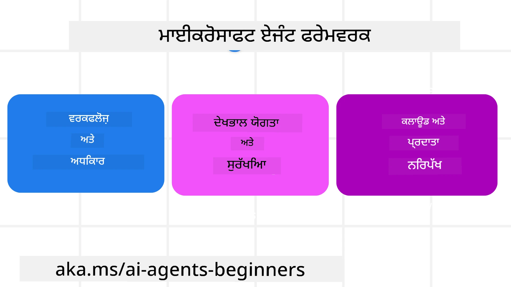
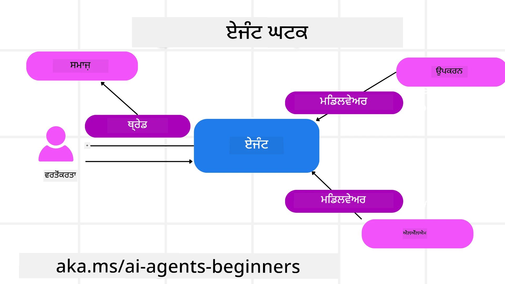

<!--
CO_OP_TRANSLATOR_METADATA:
{
  "original_hash": "19c4dab375acbc733855cc7f2f04edbc",
  "translation_date": "2025-10-02T11:17:34+00:00",
  "source_file": "14-microsoft-agent-framework/README.md",
  "language_code": "pa"
}
-->
# ਮਾਈਕਰੋਸਾਫਟ ਏਜੰਟ ਫਰੇਮਵਰਕ ਦੀ ਖੋਜ


### ਪਰਿਚਯ

ਇਸ ਪਾਠ ਵਿੱਚ ਤੁਸੀਂ ਸਿੱਖੋਗੇ:

- ਮਾਈਕਰੋਸਾਫਟ ਏਜੰਟ ਫਰੇਮਵਰਕ ਨੂੰ ਸਮਝਣਾ: ਮੁੱਖ ਵਿਸ਼ੇਸ਼ਤਾਵਾਂ ਅਤੇ ਮੁੱਲ  
- ਮਾਈਕਰੋਸਾਫਟ ਏਜੰਟ ਫਰੇਮਵਰਕ ਦੇ ਮੁੱਖ ਸੰਕਲਪਾਂ ਦੀ ਖੋਜ  
- MAF ਦੀ ਤੁਲਨਾ ਸੈਮੈਂਟਿਕ ਕਰਨਲ ਅਤੇ AutoGen ਨਾਲ: ਮਾਈਗ੍ਰੇਸ਼ਨ ਗਾਈਡ  

## ਸਿੱਖਣ ਦੇ ਲਕਸ਼

ਇਸ ਪਾਠ ਨੂੰ ਪੂਰਾ ਕਰਨ ਤੋਂ ਬਾਅਦ, ਤੁਸੀਂ ਇਹ ਜਾਣ ਸਕੋਗੇ:

- ਮਾਈਕਰੋਸਾਫਟ ਏਜੰਟ ਫਰੇਮਵਰਕ ਦੀ ਵਰਤੋਂ ਕਰਕੇ ਪ੍ਰੋਡਕਸ਼ਨ ਲਈ ਤਿਆਰ AI ਏਜੰਟ ਬਣਾਉਣਾ  
- ਆਪਣੇ ਏਜੰਟਿਕ ਕੇਸਾਂ ਵਿੱਚ ਮਾਈਕਰੋਸਾਫਟ ਏਜੰਟ ਫਰੇਮਵਰਕ ਦੀ ਮੁੱਖ ਵਿਸ਼ੇਸ਼ਤਾਵਾਂ ਨੂੰ ਲਾਗੂ ਕਰਨਾ  
- ਮੌਜੂਦਾ ਏਜੰਟਿਕ ਫਰੇਮਵਰਕ ਅਤੇ ਟੂਲਜ਼ ਨੂੰ ਮਾਈਗ੍ਰੇਟ ਅਤੇ ਇੰਟੀਗ੍ਰੇਟ ਕਰਨਾ  

## ਕੋਡ ਨਮੂਨੇ

[ਮਾਈਕਰੋਸਾਫਟ ਏਜੰਟ ਫਰੇਮਵਰਕ (MAF)](https://aka.ms/ai-agents-beginners/agent-framewrok) ਲਈ ਕੋਡ ਨਮੂਨੇ ਇਸ ਰਿਪੋਜ਼ਟਰੀ ਵਿੱਚ `xx-python-agent-framework` ਅਤੇ `xx-dotnet-agent-framework` ਫਾਈਲਾਂ ਹੇਠਾਂ ਮਿਲ ਸਕਦੇ ਹਨ।

## ਮਾਈਕਰੋਸਾਫਟ ਏਜੰਟ ਫਰੇਮਵਰਕ ਨੂੰ ਸਮਝਣਾ



[ਮਾਈਕਰੋਸਾਫਟ ਏਜੰਟ ਫਰੇਮਵਰਕ (MAF)](https://aka.ms/ai-agents-beginners/agent-framewrok) ਸੈਮੈਂਟਿਕ ਕਰਨਲ ਅਤੇ AutoGen ਤੋਂ ਪ੍ਰਾਪਤ ਤਜਰਬੇ ਅਤੇ ਸਿੱਖਿਆ 'ਤੇ ਅਧਾਰਿਤ ਹੈ। ਇਹ ਉਤਪਾਦਨ ਅਤੇ ਖੋਜ ਦੇ ਵਾਤਾਵਰਣਾਂ ਵਿੱਚ ਵੇਖੇ ਗਏ ਵੱਖ-ਵੱਖ ਏਜੰਟਿਕ ਕੇਸਾਂ ਨੂੰ ਹੱਲ ਕਰਨ ਲਈ ਲਚਕਦਾਰਤਾ ਪ੍ਰਦਾਨ ਕਰਦਾ ਹੈ, ਜਿਵੇਂ ਕਿ:

- **ਕ੍ਰਮਬੱਧ ਏਜੰਟ ਆਰਕੇਸਟਰੇਸ਼ਨ** ਜਿੱਥੇ ਕਦਮ-ਦਰ-ਕਦਮ ਵਰਕਫਲੋ ਦੀ ਲੋੜ ਹੁੰਦੀ ਹੈ।  
- **ਸਮਕਾਲੀ ਆਰਕੇਸਟਰੇਸ਼ਨ** ਜਿੱਥੇ ਏਜੰਟ ਇੱਕੋ ਸਮੇਂ ਵਿੱਚ ਕਈ ਕੰਮ ਪੂਰੇ ਕਰਦੇ ਹਨ।  
- **ਗਰੁੱਪ ਚੈਟ ਆਰਕੇਸਟਰੇਸ਼ਨ** ਜਿੱਥੇ ਏਜੰਟ ਇੱਕ ਕੰਮ 'ਤੇ ਮਿਲ ਕੇ ਕੰਮ ਕਰਦੇ ਹਨ।  
- **ਹੈਂਡਆਫ ਆਰਕੇਸਟਰੇਸ਼ਨ** ਜਿੱਥੇ ਏਜੰਟ ਇੱਕ ਦੂਜੇ ਨੂੰ ਸਬਟਾਸਕ ਪੂਰੇ ਹੋਣ 'ਤੇ ਕੰਮ ਸੌਂਪਦੇ ਹਨ।  
- **ਮੈਗਨੈਟਿਕ ਆਰਕੇਸਟਰੇਸ਼ਨ** ਜਿੱਥੇ ਮੈਨੇਜਰ ਏਜੰਟ ਟਾਸਕ ਲਿਸਟ ਬਣਾਉਂਦਾ ਹੈ, ਸੋਧ ਕਰਦਾ ਹੈ ਅਤੇ ਸਬਏਜੰਟਾਂ ਦੀ ਸਹਿਯੋਗ ਨਾਲ ਕੰਮ ਪੂਰਾ ਕਰਦਾ ਹੈ।  

ਉਤਪਾਦਨ ਵਿੱਚ AI ਏਜੰਟ ਪ੍ਰਦਾਨ ਕਰਨ ਲਈ, MAF ਵਿੱਚ ਇਹ ਵਿਸ਼ੇਸ਼ਤਾਵਾਂ ਸ਼ਾਮਲ ਹਨ:

- **ਅਵਲੋਕਨਯੋਗਤਾ** OpenTelemetry ਦੀ ਵਰਤੋਂ ਰਾਹੀਂ, ਜਿੱਥੇ AI ਏਜੰਟ ਦੀ ਹਰ ਕਾਰਵਾਈ, ਜਿਵੇਂ ਕਿ ਟੂਲ ਕਾਲ, ਆਰਕੇਸਟਰੇਸ਼ਨ ਕਦਮ, ਤਰਕ ਪ੍ਰਵਾਹ ਅਤੇ ਪ੍ਰਦਰਸ਼ਨ ਮਾਨੀਟਰਿੰਗ, Azure AI Foundry ਡੈਸ਼ਬੋਰਡਾਂ ਰਾਹੀਂ ਟ੍ਰੈਕ ਕੀਤੀ ਜਾ ਸਕਦੀ ਹੈ।  
- **ਸੁਰੱਖਿਆ** Azure AI Foundry 'ਤੇ ਏਜੰਟਾਂ ਦੀ ਮੂਲ ਹੋਸਟਿੰਗ ਰਾਹੀਂ, ਜਿਸ ਵਿੱਚ ਰੋਲ-ਅਧਾਰਿਤ ਪਹੁੰਚ, ਨਿੱਜੀ ਡਾਟਾ ਸੰਭਾਲ ਅਤੇ ਬਿਲਟ-ਇਨ ਸਮੱਗਰੀ ਸੁਰੱਖਿਆ ਸ਼ਾਮਲ ਹੈ।  
- **ਟਿਕਾਊਪਨ** ਜਿਵੇਂ ਕਿ ਏਜੰਟ ਥ੍ਰੈਡ ਅਤੇ ਵਰਕਫਲੋ ਰੁਕ ਸਕਦੇ ਹਨ, ਦੁਬਾਰਾ ਸ਼ੁਰੂ ਹੋ ਸਕਦੇ ਹਨ ਅਤੇ ਗਲਤੀਆਂ ਤੋਂ ਬਚ ਸਕਦੇ ਹਨ, ਜਿਸ ਨਾਲ ਲੰਬੇ ਚੱਲਣ ਵਾਲੇ ਪ੍ਰਕਿਰਿਆ ਸੰਭਵ ਹੁੰਦੇ ਹਨ।  
- **ਨਿਯੰਤਰਣ** ਜਿਵੇਂ ਕਿ ਮਨੁੱਖ-ਵਿੱਚ-ਲੂਪ ਵਰਕਫਲੋਜ਼ ਦਾ ਸਮਰਥਨ, ਜਿੱਥੇ ਕੰਮ ਮਨੁੱਖੀ ਮਨਜ਼ੂਰੀ ਦੀ ਲੋੜ ਵਾਲੇ ਚਿੰਨ੍ਹਿਤ ਕੀਤੇ ਜਾਂਦੇ ਹਨ।  

ਮਾਈਕਰੋਸਾਫਟ ਏਜੰਟ ਫਰੇਮਵਰਕ ਇਹ ਵੀ ਯਕੀਨੀ ਬਣਾਉਂਦਾ ਹੈ ਕਿ ਇਹ ਅੰਤਰਸੰਚਾਲੀਯ ਹੈ:

- **ਕਲਾਉਡ-ਅਗਨੋਸਟਿਕ ਹੋਣਾ** - ਏਜੰਟ ਕੰਟੇਨਰਾਂ ਵਿੱਚ, ਓਨ-ਪ੍ਰੇਮ ਅਤੇ ਵੱਖ-ਵੱਖ ਕਲਾਉਡਾਂ ਵਿੱਚ ਚੱਲ ਸਕਦੇ ਹਨ।  
- **ਪ੍ਰੋਵਾਈਡਰ-ਅਗਨੋਸਟਿਕ ਹੋਣਾ** - ਏਜੰਟ ਤੁਹਾਡੇ ਪਸੰਦੀਦਾ SDK ਰਾਹੀਂ ਬਣਾਏ ਜਾ ਸਕਦੇ ਹਨ, ਜਿਵੇਂ ਕਿ Azure OpenAI ਅਤੇ OpenAI।  
- **ਖੁੱਲੇ ਮਿਆਰਾਂ ਦਾ ਇੰਟੀਗ੍ਰੇਸ਼ਨ** - ਏਜੰਟ ਪ੍ਰੋਟੋਕੋਲ ਜਿਵੇਂ ਕਿ Agent-to-Agent (A2A) ਅਤੇ Model Context Protocol (MCP) ਦੀ ਵਰਤੋਂ ਕਰਕੇ ਹੋਰ ਏਜੰਟਾਂ ਅਤੇ ਟੂਲਾਂ ਦੀ ਖੋਜ ਅਤੇ ਵਰਤੋਂ ਕਰ ਸਕਦੇ ਹਨ।  
- **ਪਲੱਗਇਨ ਅਤੇ ਕਨੈਕਟਰ** - ਡਾਟਾ ਅਤੇ ਮੈਮੋਰੀ ਸੇਵਾਵਾਂ ਜਿਵੇਂ ਕਿ Microsoft Fabric, SharePoint, Pinecone ਅਤੇ Qdrant ਨਾਲ ਕਨੈਕਸ਼ਨ ਬਣਾਏ ਜਾ ਸਕਦੇ ਹਨ।  

ਆਓ, ਮਾਈਕਰੋਸਾਫਟ ਏਜੰਟ ਫਰੇਮਵਰਕ ਦੇ ਕੁਝ ਮੁੱਖ ਸੰਕਲਪਾਂ 'ਤੇ ਨਜ਼ਰ ਮਾਰਦੇ ਹਾਂ।

## ਮਾਈਕਰੋਸਾਫਟ ਏਜੰਟ ਫਰੇਮਵਰਕ ਦੇ ਮੁੱਖ ਸੰਕਲਪ

### ਏਜੰਟ



**ਏਜੰਟ ਬਣਾਉਣਾ**

ਏਜੰਟ ਬਣਾਉਣ ਲਈ, ਇਨਫਰੈਂਸ ਸੇਵਾ (LLM ਪ੍ਰੋਵਾਈਡਰ), AI ਏਜੰਟ ਲਈ ਹਦਾਇਤਾਂ ਅਤੇ ਇੱਕ `name` ਨਿਰਧਾਰਤ ਕੀਤਾ ਜਾਂਦਾ ਹੈ:

```python
agent = AzureOpenAIChatClient(credential=AzureCliCredential()).create_agent( instructions="You are good at recommending trips to customers based on their preferences.", name="TripRecommender" )
```
  
ਉਪਰੋਕਤ ਉਦਾਹਰਨ `Azure OpenAI` ਦੀ ਵਰਤੋਂ ਕਰਦੀ ਹੈ, ਪਰ ਏਜੰਟ ਵੱਖ-ਵੱਖ ਸੇਵਾਵਾਂ ਜਿਵੇਂ ਕਿ `Azure AI Foundry Agent Service` ਦੀ ਵਰਤੋਂ ਕਰਕੇ ਬਣਾਏ ਜਾ ਸਕਦੇ ਹਨ:

```python
AzureAIAgentClient(async_credential=credential).create_agent( name="HelperAgent", instructions="You are a helpful assistant." ) as agent
```
  
OpenAI `Responses`, `ChatCompletion` APIs

```python
agent = OpenAIResponsesClient().create_agent( name="WeatherBot", instructions="You are a helpful weather assistant.", )
```
  
```python
agent = OpenAIChatClient().create_agent( name="HelpfulAssistant", instructions="You are a helpful assistant.", )
```
  
ਜਾਂ ਦੂਰ-ਦਰਾਜ ਦੇ ਏਜੰਟ A2A ਪ੍ਰੋਟੋਕੋਲ ਦੀ ਵਰਤੋਂ ਕਰਕੇ:

```python
agent = A2AAgent( name=agent_card.name, description=agent_card.description, agent_card=agent_card, url="https://your-a2a-agent-host" )
```
  
**ਏਜੰਟ ਚਲਾਉਣਾ**

ਏਜੰਟ `.run` ਜਾਂ `.run_stream` ਮੈਥਡ ਦੀ ਵਰਤੋਂ ਕਰਕੇ ਚਲਾਏ ਜਾਂਦੇ ਹਨ, ਜੋ ਕਿ ਨਾਨ-ਸਟ੍ਰੀਮਿੰਗ ਜਾਂ ਸਟ੍ਰੀਮਿੰਗ ਜਵਾਬਾਂ ਲਈ ਹੁੰਦੇ ਹਨ।

```python
result = await agent.run("What are good places to visit in Amsterdam?")
print(result.text)
```
  
```python
async for update in agent.run_stream("What are the good places to visit in Amsterdam?"):
    if update.text:
        print(update.text, end="", flush=True)

```
  
ਹਰ ਏਜੰਟ ਰਨ ਵਿੱਚ ਪੈਰਾਮੀਟਰਾਂ ਨੂੰ ਕਸਟਮਾਈਜ਼ ਕਰਨ ਦੇ ਵਿਕਲਪ ਵੀ ਹੁੰਦੇ ਹਨ, ਜਿਵੇਂ ਕਿ `max_tokens`, `tools`, ਅਤੇ `model`।  

ਇਹ ਉਹ ਮਾਮਲਿਆਂ ਵਿੱਚ ਲਾਭਦਾਇਕ ਹੁੰਦਾ ਹੈ ਜਿੱਥੇ ਵਰਤੋਂਕਾਰ ਦੇ ਕੰਮ ਨੂੰ ਪੂਰਾ ਕਰਨ ਲਈ ਖਾਸ ਮਾਡਲ ਜਾਂ ਟੂਲ ਦੀ ਲੋੜ ਹੁੰਦੀ ਹੈ।

**ਟੂਲ**

ਟੂਲ ਦੋਵੇਂ, ਏਜੰਟ ਨੂੰ ਪਰਿਭਾਸ਼ਿਤ ਕਰਦੇ ਸਮੇਂ:

```python
def get_attractions( location: Annotated[str, Field(description="The location to get the top tourist attractions for")], ) -> str: """Get the top tourist attractions for a given location.""" return f"The top attractions for {location} are." 


# When creating a ChatAgent directly 

agent = ChatAgent( chat_client=OpenAIChatClient(), instructions="You are a helpful assistant", tools=[get_attractions]

```
  
ਅਤੇ ਏਜੰਟ ਚਲਾਉਣ ਸਮੇਂ ਵੀ ਪਰਿਭਾਸ਼ਿਤ ਕੀਤੇ ਜਾ ਸਕਦੇ ਹਨ:

```python

result1 = await agent.run( "What's the best place to visit in Seattle?", tools=[get_attractions] # Tool provided for this run only )
```
  
**ਏਜੰਟ ਥ੍ਰੈਡ**

ਏਜੰਟ ਥ੍ਰੈਡ ਬਹੁ-ਵਾਰਤਾ ਗੱਲਬਾਤਾਂ ਨੂੰ ਸੰਭਾਲਣ ਲਈ ਵਰਤੇ ਜਾਂਦੇ ਹਨ। ਥ੍ਰੈਡ ਬਣਾਏ ਜਾ ਸਕਦੇ ਹਨ:

- `get_new_thread()` ਦੀ ਵਰਤੋਂ ਕਰਕੇ, ਜੋ ਥ੍ਰੈਡ ਨੂੰ ਸਮੇਂ ਦੇ ਨਾਲ ਸੇਵ ਕਰਨ ਦੀ ਆਗਿਆ ਦਿੰਦਾ ਹੈ।  
- ਜਦੋਂ ਏਜੰਟ ਚਲਾਇਆ ਜਾਂਦਾ ਹੈ, ਤਾਂ ਥ੍ਰੈਡ ਆਪਣੇ ਆਪ ਬਣਦਾ ਹੈ ਅਤੇ ਸਿਰਫ ਮੌਜੂਦਾ ਰਨ ਦੌਰਾਨ ਰਹਿੰਦਾ ਹੈ।  

ਥ੍ਰੈਡ ਬਣਾਉਣ ਲਈ ਕੋਡ ਇਸ ਤਰ੍ਹਾਂ ਹੈ:

```python
# Create a new thread. 
thread = agent.get_new_thread() # Run the agent with the thread. 
response = await agent.run("Hello, I am here to help you book travel. Where would you like to go?", thread=thread)

```
  
ਤੁਸੀਂ ਥ੍ਰੈਡ ਨੂੰ ਸੇਵ ਕਰਨ ਲਈ ਸਿਰੀਅਲਾਈਜ਼ ਕਰ ਸਕਦੇ ਹੋ:

```python
# Create a new thread. 
thread = agent.get_new_thread() 

# Run the agent with the thread. 

response = await agent.run("Hello, how are you?", thread=thread) 

# Serialize the thread for storage. 

serialized_thread = await thread.serialize() 

# Deserialize the thread state after loading from storage. 

resumed_thread = await agent.deserialize_thread(serialized_thread)
```
  
**ਏਜੰਟ ਮਿਡਲਵੇਅਰ**

ਏਜੰਟ ਟੂਲਾਂ ਅਤੇ LLMs ਨਾਲ ਗੱਲਬਾਤ ਕਰਦੇ ਹਨ। ਕੁਝ ਮਾਮਲਿਆਂ ਵਿੱਚ, ਸਾਡੇ ਲਈ ਇਹ ਗੱਲਬਾਤਾਂ ਦੇ ਵਿਚਕਾਰ ਕਾਰਵਾਈ ਕਰਨਾ ਜਾਂ ਟ੍ਰੈਕ ਕਰਨਾ ਜ਼ਰੂਰੀ ਹੁੰਦਾ ਹੈ। ਏਜੰਟ ਮਿਡਲਵੇਅਰ ਇਸ ਨੂੰ ਸੰਭਾਲਣ ਲਈ ਵਰਤਿਆ ਜਾਂਦਾ ਹੈ:

*ਫੰਕਸ਼ਨ ਮਿਡਲਵੇਅਰ*

ਇਹ ਮਿਡਲਵੇਅਰ ਸਾਨੂੰ ਏਜੰਟ ਅਤੇ ਉਸ ਫੰਕਸ਼ਨ/ਟੂਲ ਦੇ ਵਿਚਕਾਰ ਕਾਰਵਾਈ ਕਰਨ ਦੀ ਆਗਿਆ ਦਿੰਦਾ ਹੈ, ਜਿਸ ਨੂੰ ਇਹ ਕਾਲ ਕਰੇਗਾ। ਉਦਾਹਰਣ ਲਈ, ਜਦੋਂ ਤੁਸੀਂ ਫੰਕਸ਼ਨ ਕਾਲ 'ਤੇ ਲਾਗਿੰਗ ਕਰਨਾ ਚਾਹੁੰਦੇ ਹੋ।

```python
async def logging_function_middleware(
    context: FunctionInvocationContext,
    next: Callable[[FunctionInvocationContext], Awaitable[None]],
) -> None:
    """Function middleware that logs function execution."""
    # Pre-processing: Log before function execution
    print(f"[Function] Calling {context.function.name}")

    # Continue to next middleware or function execution
    await next(context)

    # Post-processing: Log after function execution
    print(f"[Function] {context.function.name} completed")
```
  
*ਚੈਟ ਮਿਡਲਵੇਅਰ*

ਇਹ ਮਿਡਲਵੇਅਰ ਸਾਨੂੰ ਏਜੰਟ ਅਤੇ LLM ਦੇ ਵਿਚਕਾਰ ਗੱਲਬਾਤਾਂ ਨੂੰ ਲਾਗ ਕਰਨ ਦੀ ਆਗਿਆ ਦਿੰਦਾ ਹੈ।  

```python
async def logging_chat_middleware(
    context: ChatContext,
    next: Callable[[ChatContext], Awaitable[None]],
) -> None:
    """Chat middleware that logs AI interactions."""
    # Pre-processing: Log before AI call
    print(f"[Chat] Sending {len(context.messages)} messages to AI")

    # Continue to next middleware or AI service
    await next(context)

    # Post-processing: Log after AI response
    print("[Chat] AI response received")

```
  
**ਏਜੰਟ ਮੈਮੋਰੀ**

ਜਿਵੇਂ ਕਿ `Agentic Memory` ਪਾਠ ਵਿੱਚ ਕਵਰ ਕੀਤਾ ਗਿਆ ਹੈ, ਮੈਮੋਰੀ ਏਜੰਟ ਨੂੰ ਵੱਖ-ਵੱਖ ਸੰਦਰਭਾਂ ਵਿੱਚ ਕੰਮ ਕਰਨ ਯੋਗ ਬਣਾਉਣ ਲਈ ਮਹੱਤਵਪੂਰਨ ਤੱਤ ਹੈ। MAF ਵਿੱਚ ਕਈ ਕਿਸਮ ਦੀਆਂ ਮੈਮੋਰੀਆਂ ਹਨ:

*ਇਨ-ਮੈਮੋਰੀ ਸਟੋਰੇਜ*

ਇਹ ਮੈਮੋਰੀ ਥ੍ਰੈਡਾਂ ਵਿੱਚ ਐਪਲੀਕੇਸ਼ਨ ਰਨਟਾਈਮ ਦੌਰਾਨ ਸਟੋਰ ਕੀਤੀ ਜਾਂਦੀ ਹੈ।

```python
# Create a new thread. 
thread = agent.get_new_thread() # Run the agent with the thread. 
response = await agent.run("Hello, I am here to help you book travel. Where would you like to go?", thread=thread)
```
  
*ਪ੍ਰਿਸਿਸਟੈਂਟ ਮੈਸੇਜ*

ਇਹ ਮੈਮੋਰੀ ਵੱਖ-ਵੱਖ ਸੈਸ਼ਨਾਂ ਵਿੱਚ ਗੱਲਬਾਤ ਦੇ ਇਤਿਹਾਸ ਨੂੰ ਸਟੋਰ ਕਰਨ ਲਈ ਵਰਤੀ ਜਾਂਦੀ ਹੈ। ਇਹ `chat_message_store_factory` ਦੀ ਵਰਤੋਂ ਕਰਕੇ ਪਰਿਭਾਸ਼ਿਤ ਕੀਤੀ ਜਾਂਦੀ ਹੈ:

```python
from agent_framework import ChatMessageStore

# Create a custom message store
def create_message_store():
    return ChatMessageStore()

agent = ChatAgent(
    chat_client=OpenAIChatClient(),
    instructions="You are a Travel assistant.",
    chat_message_store_factory=create_message_store
)

```
  
*ਡਾਇਨਾਮਿਕ ਮੈਮੋਰੀ*

```python
from agent_framework.mem0 import Mem0Provider

# Using Mem0 for advanced memory capabilities
memory_provider = Mem0Provider(
    api_key="your-mem0-api-key",
    user_id="user_123",
    application_id="my_app"
)

agent = ChatAgent(
    chat_client=OpenAIChatClient(),
    instructions="You are a helpful assistant with memory.",
    context_providers=memory_provider
)

```
  
**ਏਜੰਟ ਅਵਲੋਕਨਯੋਗਤਾ**

```python
from agent_framework.observability import get_tracer, get_meter

tracer = get_tracer()
meter = get_meter()
with tracer.start_as_current_span("my_custom_span"):
    # do something
    pass
counter = meter.create_counter("my_custom_counter")
counter.add(1, {"key": "value"})
```
  
### ਵਰਕਫਲੋਜ਼

```python
from agent_framework import WorkflowBuilder

builder = WorkflowBuilder()
builder.add_edge(source_executor, target_executor)
builder.set_start_executor(source_executor)
workflow = builder.build()
```
  
```python
agent = AzureOpenAIChatClient(credential=AzureCliCredential()).create_agent( instructions="You are good at reccomending trips to customers based on their preferences.", name="TripRecommender" )
```
  
```python
thread = agent.get_new_thread() # Run the agent with the thread. 
```
  
```python
agent = ChatAgent( chat_client=OpenAIChatClient(), instructions="You are a helpful assistant", tools=[get_attractions]
```
  

## ਹੋਰ ਸਵਾਲ ਹਨ?

[Azure AI Foundry Discord](https://aka.ms/ai-agents/discord) 'ਤੇ ਸ਼ਾਮਲ ਹੋਵੋ।

---

**ਅਸਵੀਕਰਤੀ**:  
ਇਹ ਦਸਤਾਵੇਜ਼ AI ਅਨੁਵਾਦ ਸੇਵਾ [Co-op Translator](https://github.com/Azure/co-op-translator) ਦੀ ਵਰਤੋਂ ਕਰਕੇ ਅਨੁਵਾਦ ਕੀਤਾ ਗਿਆ ਹੈ। ਜਦੋਂ ਕਿ ਅਸੀਂ ਸਹੀ ਹੋਣ ਦੀ ਕੋਸ਼ਿਸ਼ ਕਰਦੇ ਹਾਂ, ਕਿਰਪਾ ਕਰਕੇ ਧਿਆਨ ਦਿਓ ਕਿ ਸਵੈਚਾਲਿਤ ਅਨੁਵਾਦਾਂ ਵਿੱਚ ਗਲਤੀਆਂ ਜਾਂ ਅਸੁਚੀਤਤਾਵਾਂ ਹੋ ਸਕਦੀਆਂ ਹਨ। ਇਸ ਦੀ ਮੂਲ ਭਾਸ਼ਾ ਵਿੱਚ ਮੌਜੂਦ ਦਸਤਾਵੇਜ਼ ਨੂੰ ਅਧਿਕਾਰਤ ਸਰੋਤ ਮੰਨਿਆ ਜਾਣਾ ਚਾਹੀਦਾ ਹੈ। ਮਹੱਤਵਪੂਰਨ ਜਾਣਕਾਰੀ ਲਈ, ਪੇਸ਼ੇਵਰ ਮਨੁੱਖੀ ਅਨੁਵਾਦ ਦੀ ਸਿਫਾਰਸ਼ ਕੀਤੀ ਜਾਂਦੀ ਹੈ। ਇਸ ਅਨੁਵਾਦ ਦੀ ਵਰਤੋਂ ਤੋਂ ਪੈਦਾ ਹੋਣ ਵਾਲੇ ਕਿਸੇ ਵੀ ਗਲਤ ਫਹਿਮੀ ਜਾਂ ਗਲਤ ਵਿਆਖਿਆ ਲਈ ਅਸੀਂ ਜ਼ਿੰਮੇਵਾਰ ਨਹੀਂ ਹਾਂ।