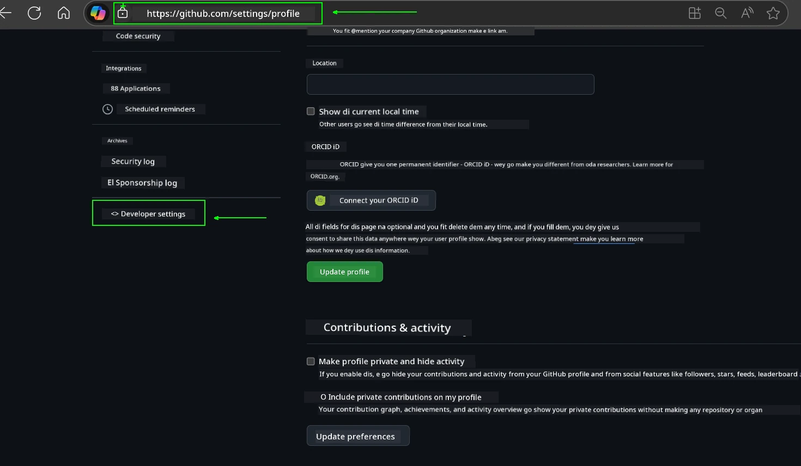
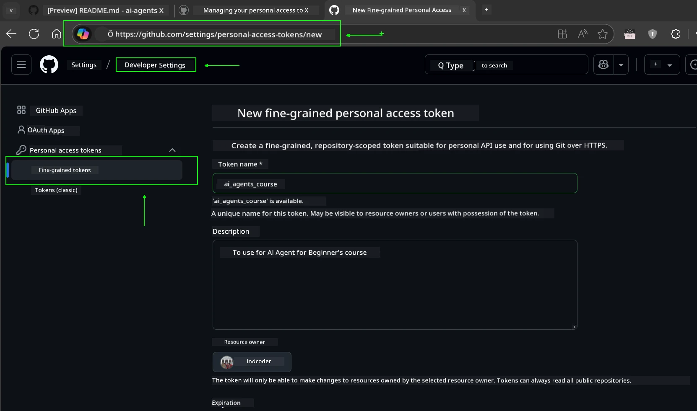
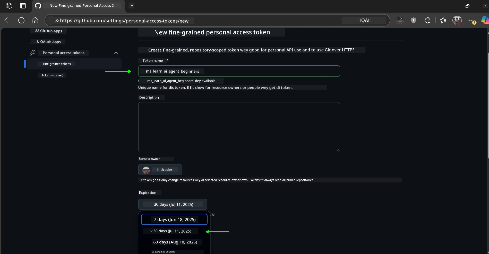
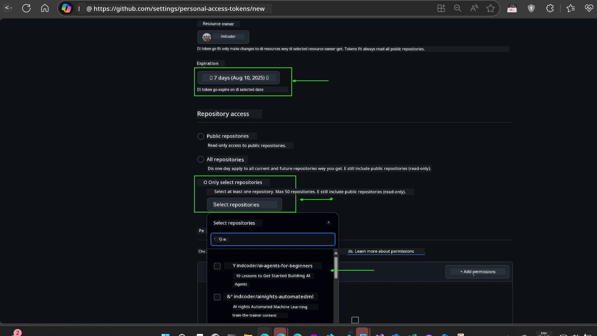
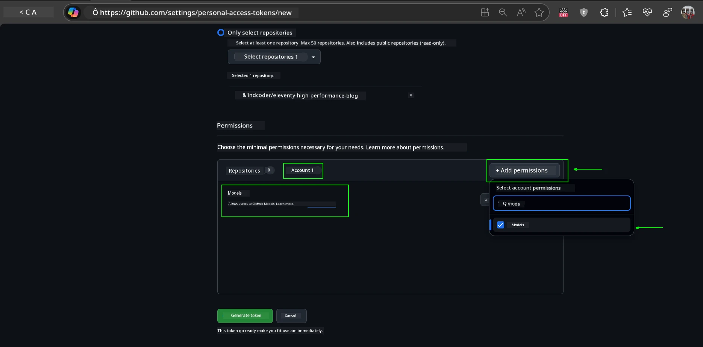
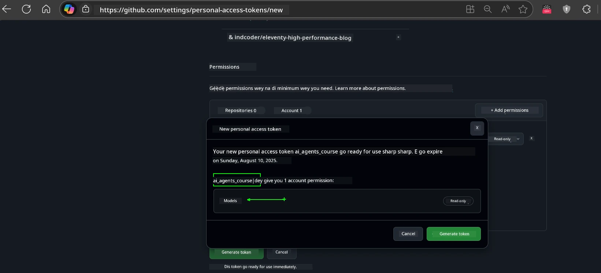
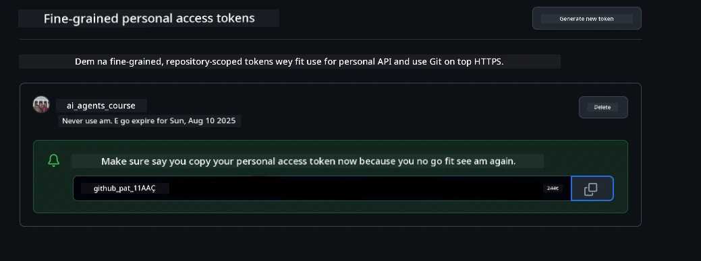
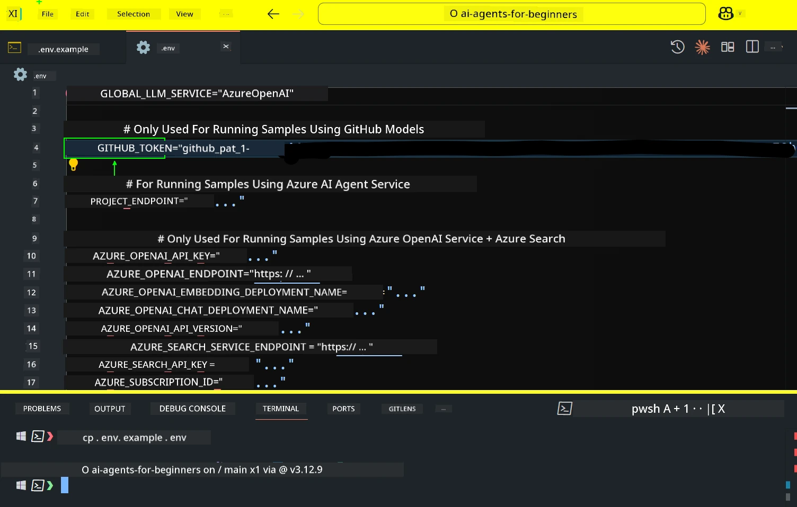
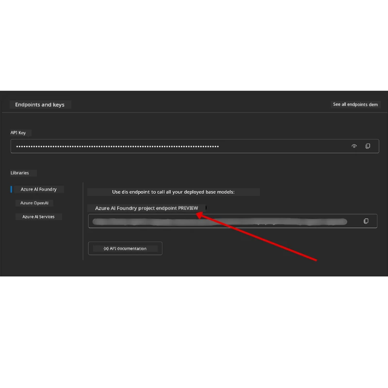

<!--
CO_OP_TRANSLATOR_METADATA:
{
  "original_hash": "63b1a8f6e840df15934935b728e569f0",
  "translation_date": "2025-12-03T15:19:20+00:00",
  "source_file": "00-course-setup/README.md",
  "language_code": "pcm"
}
-->
# Course Setup

## Introduction

Dis lesson go show how you fit run di code samples wey dey dis course.

## Join Other Learners and Get Help

Before you start to clone your repo, join di [AI Agents For Beginners Discord channel](https://aka.ms/ai-agents/discord) to get help for setup, ask any question about di course, or connect wit other learners.

## Clone or Fork dis Repo

To start, abeg clone or fork di GitHub Repository. Dis one go make you get your own version of di course material so you fit run, test, and change di code!

You fit do am by clicking di link to <a href="https://github.com/microsoft/ai-agents-for-beginners/fork" target="_blank">fork di repo</a>

You suppose don get your own forked version of dis course for di following link:


### Shallow Clone (e better for workshop / Codespaces)

  >Di full repository fit big (~3 GB) if you download di full history and all files. If na only workshop you dey attend or you need only few lesson folders, shallow clone (or sparse clone) go help you avoid di plenty download by cutting history and/or skipping blobs.

#### Quick shallow clone — minimal history, all files

Replace `<your-username>` for di commands below wit your fork URL (or di upstream URL if you prefer).

To clone only di latest commit history (small download):

```bash|powershell
git clone --depth 1 https://github.com/<your-username>/ai-agents-for-beginners.git
```

To clone one specific branch:

```bash|powershell
git clone --depth 1 --branch <branch-name> https://github.com/<your-username>/ai-agents-for-beginners.git
```

#### Partial (sparse) clone — minimal blobs + only selected folders

Dis one dey use partial clone and sparse-checkout (e need Git 2.25+ and e better make you use modern Git wey get partial clone support):

```bash|powershell
git clone --depth 1 --filter=blob:none --sparse https://github.com/<your-username>/ai-agents-for-beginners.git
```

Enter di repo folder:

```bash|powershell
cd ai-agents-for-beginners
```

Then choose di folders wey you want (example below show two folders):

```bash|powershell
git sparse-checkout set 00-course-setup 01-intro-to-ai-agents
```

After you don clone and confirm di files, if na only files you need and you wan free space (no git history), abeg delete di repository metadata (💀irreversible — you go lose all Git functionality: no commits, pulls, pushes, or history access).

```bash
# zsh/bash
rm -rf .git
```

```powershell
# PowerShell
Remove-Item -Recurse -Force .git
```

#### Use GitHub Codespaces (e better to avoid local big downloads)

- Create new Codespace for dis repo through di [GitHub UI](https://github.com/codespaces).  

- For di terminal of di new codespace wey you create, run one of di shallow/sparse clone commands above to bring only di lesson folders wey you need enter di Codespace workspace.
- Optional: after you don clone inside Codespaces, remove .git to free extra space (check di removal commands above).
- Note: If you prefer to open di repo directly for Codespaces (without extra clone), make you know say Codespaces go build di devcontainer environment and e fit still provision more than wetin you need. Cloning shallow copy inside fresh Codespace go give you more control over disk usage.

#### Tips

- Always replace di clone URL wit your fork if you wan edit/commit.
- If later you need more history or files, you fit fetch dem or adjust sparse-checkout to include extra folders.

## Running di Code

Dis course get series of Jupyter Notebooks wey you fit run to get hands-on experience to build AI Agents.

Di code samples dey use either:

**GitHub Account - Free**:

1) Semantic Kernel Agent Framework + GitHub Models Marketplace. E dey labelled as (semantic-kernel.ipynb)
2) AutoGen Framework + GitHub Models Marketplace. E dey labelled as (autogen.ipynb)

**Azure Subscription**:

3) Azure AI Foundry + Azure AI Agent Service. E dey labelled as (azureaiagent.ipynb)

We dey encourage you to try all three types of examples to see which one go work best for you.

Any option wey you choose go determine di setup steps wey you need follow below:

## Requirements

- Python 3.12+
  - **NOTE**: If Python3.12 no dey your system, make sure say you install am. Then create your venv using python3.12 to make sure say di correct versions dey installed from di requirements.txt file.
  
    >Example

    Create Python venv directory:

    ```bash|powershell
    python -m venv venv
    ```

    Then activate venv environment for:

    ```bash
    # zsh/bash
    source venv/bin/activate
    ```
  
    ```dos
    # Command Prompt for Windows
    venv\Scripts\activate
    ```

- .NET 10+: For di sample codes wey dey use .NET, make sure say you install [.NET 10 SDK](https://dotnet.microsoft.com/download/dotnet/10.0) or later. Then, check di .NET SDK version wey you don install:

    ```bash|powershell
    dotnet --list-sdks
    ```

- GitHub Account - To Access di GitHub Models Marketplace
- Azure Subscription - To Access di Azure AI Foundry
- Azure AI Foundry Account - To Access di Azure AI Agent Service

We don include `requirements.txt` file for di root of dis repository wey get all di Python packages wey you need to run di code samples.

You fit install dem by running di command below for your terminal for di root of di repository:

```bash|powershell
pip install -r requirements.txt
```

We dey recommend make you create Python virtual environment to avoid any wahala or issues.

## Setup VSCode

Make sure say you dey use di correct version of Python for VSCode.


## Set Up for Samples wey dey use GitHub Models 

### Step 1: Get Your GitHub Personal Access Token (PAT)

Dis course dey use di GitHub Models Marketplace, wey dey give free access to Large Language Models (LLMs) wey you go use to build AI Agents.

To use di GitHub Models, you go need to create [GitHub Personal Access Token](https://docs.github.com/en/authentication/keeping-your-account-and-data-secure/managing-your-personal-access-tokens).

You fit do am by going to your <a href="https://github.com/settings/personal-access-tokens" target="_blank">Personal Access Tokens settings</a> for your GitHub Account.

Abeg follow di [Principle of Least Privilege](https://docs.github.com/en/get-started/learning-to-code/storing-your-secrets-safely) when you dey create your token. Dis mean say you go only give di token di permissions wey e need to run di code samples for dis course.

1. Choose di `Fine-grained tokens` option for di left side of your screen by going to di **Developer settings**

   

   Then choose `Generate new token`.

   

2. Enter one name wey go describe di token purpose, so e go easy to identify later.

    🔐 Token Duration Recommendation

    Recommended duration: 30 days
    If you wan make e more secure, you fit choose shorter time—like 7 days 🛡️
    E go help you set personal target and finish di course while your learning dey strong 🚀.

    

3. Limit di token scope to your fork of dis repository.

    

4. Restrict di token permissions: Under **Permissions**, click **Account** tab, and click di "+ Add permissions" button. Dropdown go show. Search for **Models** and check di box for am.

    

5. Confirm di permissions wey you need before you generate di token. 

6. Before you generate di token, make sure say you ready to store di token for safe place like password manager vault, because e no go show again after you create am. 

Copy di new token wey you don create. You go now add am to your `.env` file wey dey dis course.

### Step 2: Create Your `.env` File

To create your `.env` file, run di command below for your terminal.

```bash
# zsh/bash
cp .env.example .env
```

```powershell
# PowerShell
Copy-Item .env.example .env
```

Dis one go copy di example file and create `.env` for your directory where you go fill di values for di environment variables.

With your token wey you don copy, open di `.env` file for your favorite text editor and paste di token inside di `GITHUB_TOKEN` field.



You suppose fit run di code samples for dis course now.

## Set Up for Samples wey dey use Azure AI Foundry and Azure AI Agent Service

### Step 1: Get Your Azure Project Endpoint

Follow di steps to create hub and project for Azure AI Foundry wey dey here: [Hub resources overview](https://learn.microsoft.com/azure/ai-foundry/concepts/ai-resources)

After you don create your project, you go need to get di connection string for your project.

You fit do am by going to di **Overview** page of your project for di Azure AI Foundry portal.



### Step 2: Create Your `.env` File

To create your `.env` file, run di command below for your terminal.

```bash
# zsh/bash
cp .env.example .env
```

```powershell
# PowerShell
Copy-Item .env.example .env
```

Dis one go copy di example file and create `.env` for your directory where you go fill di values for di environment variables.

With your token wey you don copy, open di `.env` file for your favorite text editor and paste di token inside di `PROJECT_ENDPOINT` field.

### Step 3: Sign in to Azure

As security best practice, we go use [keyless authentication](https://learn.microsoft.com/azure/developer/ai/keyless-connections?tabs=csharp%2Cazure-cli?WT.mc_id=academic-105485-koreyst) to authenticate to Azure OpenAI wit Microsoft Entra ID. 

Next, open terminal and run `az login --use-device-code` to sign in to your Azure account.

After you don log in, choose your subscription for di terminal.

## Extra Environment Variables - Azure Search and Azure OpenAI 

For di Agentic RAG Lesson - Lesson 5 - some samples dey wey dey use Azure Search and Azure OpenAI.

If you wan run dis samples, you go need to add di following environment variables to your `.env` file:

### Overview Page (Project)

- `AZURE_SUBSCRIPTION_ID` - Check **Project details** for di **Overview** page of your project.

- `AZURE_AI_PROJECT_NAME` - Look di top of di **Overview** page for your project.

- `AZURE_OPENAI_SERVICE` - Find am for di **Included capabilities** tab for **Azure OpenAI Service** for di **Overview** page.

### Management Center

- `AZURE_OPENAI_RESOURCE_GROUP` - Go **Project properties** for di **Overview** page of di **Management Center**.

- `GLOBAL_LLM_SERVICE` - Under **Connected resources**, find di **Azure AI Services** connection name. If e no dey listed, check di **Azure portal** under your resource group for di AI Services resource name.

### Models + Endpoints Page

- `AZURE_OPENAI_EMBEDDING_DEPLOYMENT_NAME` - Choose your embedding model (e.g., `text-embedding-ada-002`) and note di **Deployment name** from di model details.

- `AZURE_OPENAI_CHAT_DEPLOYMENT_NAME` - Choose your chat model (e.g., `gpt-4o-mini`) and note di **Deployment name** from di model details.

### Azure Portal

- `AZURE_OPENAI_ENDPOINT` - Look for **Azure AI services**, click am, then go **Resource Management**, **Keys and Endpoint**, scroll down to di "Azure OpenAI endpoints", and copy di one wey talk "Language APIs".

- `AZURE_OPENAI_API_KEY` - From di same screen, copy KEY 1 or KEY 2.

- `AZURE_SEARCH_SERVICE_ENDPOINT` - Find your **Azure AI Search** resource, click am, and see **Overview**.

- `AZURE_SEARCH_API_KEY` - Then go **Settings** and then **Keys** to copy di primary or secondary admin key.

### External Webpage

- `AZURE_OPENAI_API_VERSION` - Visit di [API version lifecycle](https://learn.microsoft.com/azure/ai-services/openai/api-version-deprecation#latest-ga-api-release) page under **Latest GA API release**.

### Setup keyless authentication

Instead of hardcode your credentials, we go use keyless connection wit Azure OpenAI. To do am, we go import `DefaultAzureCredential` and later call di `DefaultAzureCredential` function to get di credential.

```python
# Paiton
from azure.identity import DefaultAzureCredential, InteractiveBrowserCredential
```

## You dey stuck somewhere?
If you get any wahala to run dis setup, abeg join our <a href="https://discord.gg/kzRShWzttr" target="_blank">Azure AI Community Discord</a> or <a href="https://github.com/microsoft/ai-agents-for-beginners/issues?WT.mc_id=academic-105485-koreyst" target="_blank">create one issue</a>.

## Next Lesson

You don ready now to run di code for dis course. Enjoy as you dey learn more about di world of AI Agents!

[Introduction to AI Agents and Agent Use Cases](../01-intro-to-ai-agents/README.md)

---

<!-- CO-OP TRANSLATOR DISCLAIMER START -->
**Disclaimer**:  
Dis docu don dey translate wit AI translation service [Co-op Translator](https://github.com/Azure/co-op-translator). Even though we dey try make am accurate, abeg sabi say automatic translation fit get mistake or no correct well. Di original docu for im native language na di main correct source. For important information, e good make una use professional human translation. We no go fit take blame for any misunderstanding or wrong interpretation wey fit happen because of dis translation.
<!-- CO-OP TRANSLATOR DISCLAIMER END -->