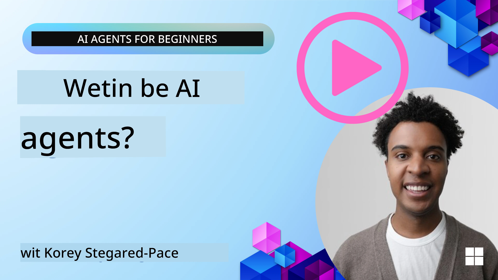
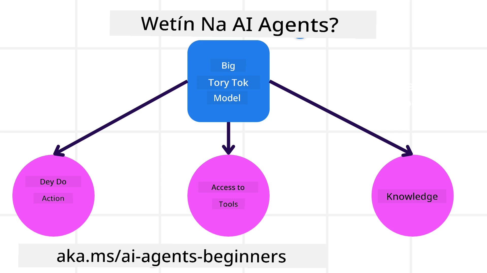
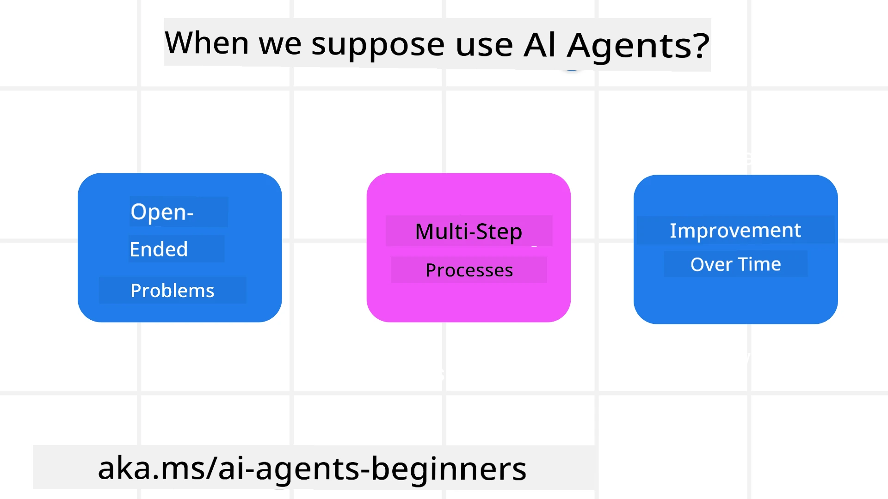

<!--
CO_OP_TRANSLATOR_METADATA:
{
  "original_hash": "cdd28bc00816d2773bb2b5968d782abc",
  "translation_date": "2025-11-11T14:11:36+00:00",
  "source_file": "01-intro-to-ai-agents/README.md",
  "language_code": "pcm"
}
-->

> _(Click di image wey dey up to watch di video for dis lesson)_

# Introduction to AI Agents and Agent Use Cases

Welcome to di "AI Agents for Beginners" course! Dis course go teach you di basic knowledge and show you example wey you fit use to build AI Agents.

Join di <a href="https://discord.gg/kzRShWzttr" target="_blank">Azure AI Discord Community</a> to meet oda learners and people wey dey build AI Agents, plus ask any question wey you get about dis course.

To start dis course, we go first understand wetin AI Agents be and how we fit use dem for di apps and workflows wey we dey build.

## Introduction

Dis lesson go cover:

- Wetin AI Agents be and di different types of agents wey dey.
- Wetin AI Agents fit do and how dem fit help us.
- Wetin be di basic things we need to sabi when we dey design Agentic Solutions.

## Learning Goals
After you finish dis lesson, you go fit:

- Sabi di concept of AI Agents and how dem different from oda AI solutions.
- Use AI Agents well well.
- Design Agentic solutions wey go work well for users and customers.

## Defining AI Agents and Types of AI Agents

### Wetin AI Agents Be?

AI Agents na **systems** wey dey make **Large Language Models(LLMs)** fit **do actions** by giving di LLMs **access to tools** and **knowledge**.

Make we break di definition into small parts:

- **System** - E dey important to see agents as system wey get many parts, no be just one thing. Di basic parts of AI Agent na:
  - **Environment** - Di space wey di AI Agent dey operate. For example, if we get travel booking AI Agent, di environment fit be di travel booking system wey di AI Agent dey use to do tasks.
  - **Sensors** - Environment dey give information and feedback. AI Agents dey use sensors to collect and understand di information about di environment state. For di Travel Booking Agent example, di travel booking system fit give info like hotel availability or flight prices.
  - **Actuators** - After di AI Agent don collect di environment state, e go decide wetin action e go take to change di environment. For di travel booking agent, e fit be to book available room for di user.

**Large Language Models** - Di idea of agents don dey before LLMs come. Di advantage of using LLMs for AI Agents na say dem sabi understand human language and data. Dis ability dey help LLMs understand di environment info and plan how to change di environment.

**Perform Actions** - Outside AI Agent systems, LLMs dey limited to only generate content or info based on wetin user ask. Inside AI Agent systems, LLMs fit do tasks by understanding wetin user want and using di tools wey dey di environment.

**Access To Tools** - Di tools wey LLM fit use na di environment wey e dey operate and wetin di developer of di AI Agent allow. For di travel agent example, di tools fit be di operations wey dey di booking system, or di developer fit limit di tools to flights only.

**Memory+Knowledge** - Memory fit be short-term for di conversation between di user and di agent. Long-term, di AI Agent fit collect knowledge from oda systems, services, tools, and even oda agents. For di travel agent example, dis knowledge fit be di user travel preferences wey dey customer database.

### Di different types of agents

Now we don sabi wetin AI Agents be, make we look di specific types of agents and how dem fit work for travel booking AI agent.

| **Agent Type**                | **Description**                                                                                                                       | **Example**                                                                                                                                                                                                                   |
| ----------------------------- | ------------------------------------------------------------------------------------------------------------------------------------- | ----------------------------------------------------------------------------------------------------------------------------------------------------------------------------------------------------------------------------- |
| **Simple Reflex Agents**      | Dem dey do immediate actions based on rules wey dem don set before.                                                                                  | Travel agent go read di email and send travel complaints go customer service.                                                                                                                          |
| **Model-Based Reflex Agents** | Dem dey act based on di model of di world and di changes wey dey di model.                                                              | Travel agent go focus on routes wey price don change well well based on historical pricing data.                                                                                                             |
| **Goal-Based Agents**         | Dem dey plan how to achieve goals by understanding di goal and deciding actions to reach am.                                  | Travel agent go arrange journey by planning di travel arrangements (car, public transit, flights) from di current location to di destination.                                                                                |
| **Utility-Based Agents**      | Dem dey check preferences and balance tradeoffs to decide how to achieve goals.                                               | Travel agent go balance convenience and cost when e dey book travel.                                                                                                                                          |
| **Learning Agents**           | Dem dey improve over time by using feedback to adjust actions.                                                        | Travel agent go use customer feedback from post-trip surveys to make di next bookings better.                                                                                                               |
| **Hierarchical Agents**       | Dem dey use multiple agents in levels, higher-level agents go divide tasks into smaller tasks for lower-level agents to finish. | Travel agent go cancel trip by dividing di task into smaller tasks (like canceling specific bookings) and lower-level agents go finish dem, then report back to di higher-level agent.                                     |
| **Multi-Agent Systems (MAS)** | Agents dey work independently, either cooperatively or competitively.                                                           | Cooperative: Many agents go book travel services like hotels, flights, and entertainment. Competitive: Many agents go manage and compete for di same hotel booking calendar to book customers into di hotel. |

## When to Use AI Agents

For di earlier section, we use di Travel Agent example to explain how di different types of agents fit work for different travel booking situations. We go continue to use dis example for di course.

Make we look di types of use cases wey AI Agents dey best for:

- **Open-Ended Problems** - Make di LLM decide wetin steps e need to complete task because e no fit always dey hardcoded into workflow.
- **Multi-Step Processes** - Tasks wey need complexity wey go make di AI Agent use tools or info over many turns, no be just one time.  
- **Improvement Over Time** - Tasks wey di agent fit dey improve over time by collecting feedback from di environment or users to do better work.

We go talk more about using AI Agents for di Building Trustworthy AI Agents lesson.

## Basics of Agentic Solutions

### Agent Development

Di first step to design AI Agent system na to define di tools, actions, and behaviors. For dis course, we go focus on using di **Azure AI Agent Service** to define our Agents. E get features like:

- Selection of Open Models like OpenAI, Mistral, and Llama
- Use of Licensed Data from providers like Tripadvisor
- Use of standardized OpenAPI 3.0 tools

### Agentic Patterns

Communication with LLMs na through prompts. Because AI Agents dey semi-autonomous, e no dey always possible or necessary to dey manually reprompt di LLM after di environment don change. We dey use **Agentic Patterns** wey go help us prompt di LLM over many steps in better way.

Dis course dey divided into some popular Agentic patterns wey dey now.

### Agentic Frameworks

Agentic Frameworks dey help developers use agentic patterns through code. Dis frameworks dey provide templates, plugins, and tools for better collaboration between AI Agents. Dem dey also help to monitor and fix problems for AI Agent systems.

For dis course, we go look di research-driven AutoGen framework and di production-ready Agent framework from Semantic Kernel.

## Sample Codes

- Python: [Agent Framework](./code_samples/01-python-agent-framework.ipynb)
- .NET: [Agent Framework](./code_samples/01-dotnet-agent-framework.md)

## Get More Questions about AI Agents?

Join di [Azure AI Foundry Discord](https://aka.ms/ai-agents/discord) to meet oda learners, attend office hours, and get answers to your AI Agents questions.

## Previous Lesson

[Course Setup](../00-course-setup/README.md)

## Next Lesson

[Exploring Agentic Frameworks](../02-explore-agentic-frameworks/README.md)

---

<!-- CO-OP TRANSLATOR DISCLAIMER START -->
**Disclaimer**:  
Dis dokyument don use AI translation service [Co-op Translator](https://github.com/Azure/co-op-translator) do di translation. Even as we dey try make am accurate, abeg sabi say machine translation fit get mistake or no dey correct well. Di original dokyument for im native language na di main source wey you go trust. For important information, e better make professional human translation dey use. We no go fit take blame for any misunderstanding or wrong interpretation wey fit happen because you use dis translation.
<!-- CO-OP TRANSLATOR DISCLAIMER END -->