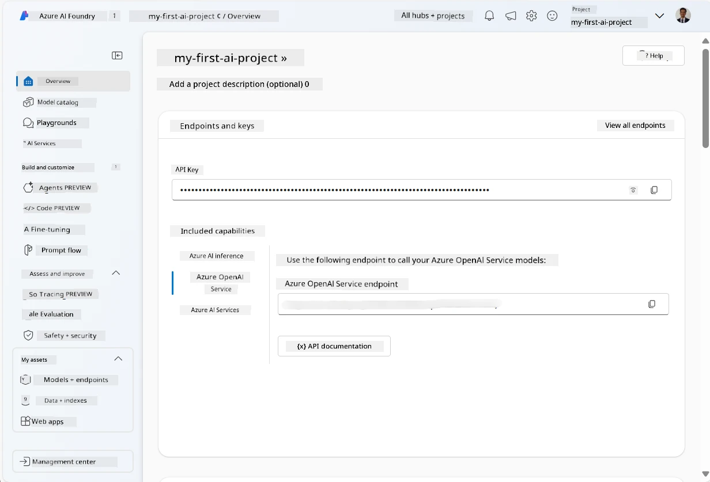
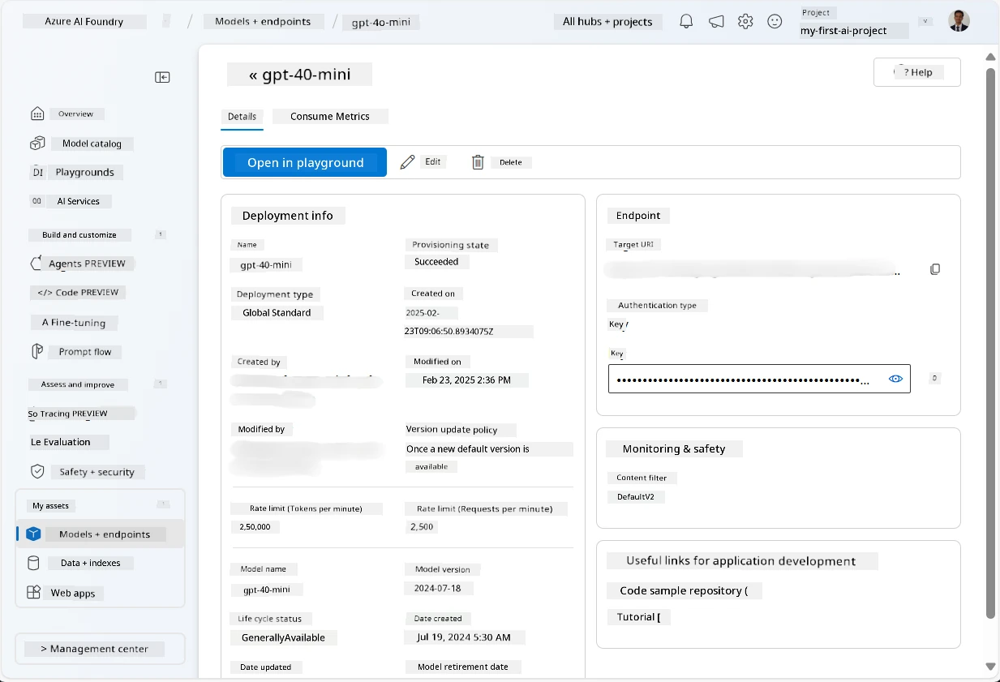
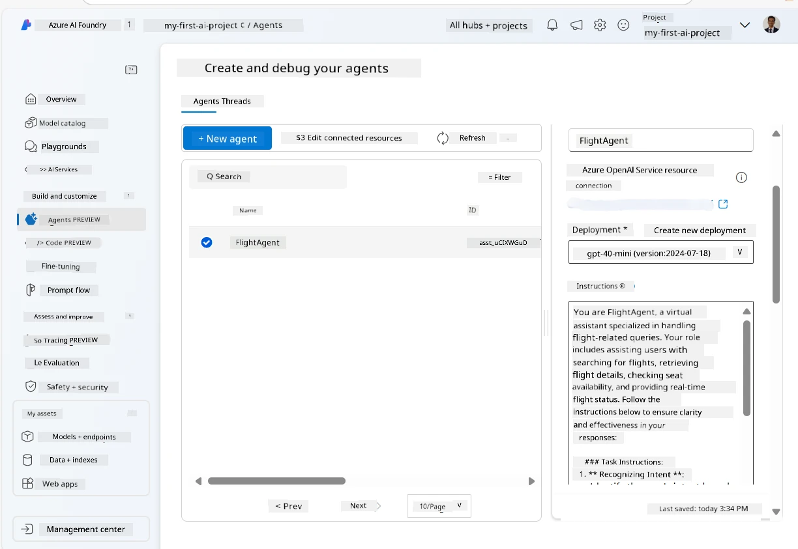
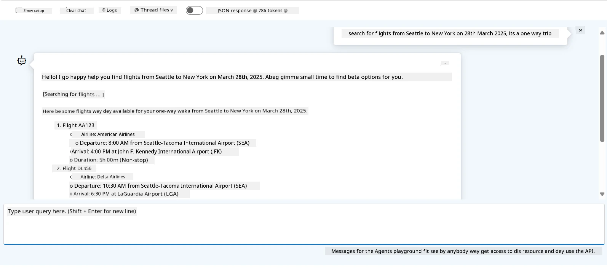

<!--
CO_OP_TRANSLATOR_METADATA:
{
  "original_hash": "7e92870dc0843e13d4dabc620c09d2d9",
  "translation_date": "2025-11-11T14:14:15+00:00",
  "source_file": "02-explore-agentic-frameworks/azure-ai-foundry-agent-creation.md",
  "language_code": "pcm"
}
-->
# Azure AI Agent Service Development

For dis exercise, you go use Azure AI Agent service tools wey dey for [Azure AI Foundry portal](https://ai.azure.com/?WT.mc_id=academic-105485-koreyst) to create one agent wey go help for Flight Booking. Dis agent go fit interact wit users and give dem information about flights.

## Wetin you need before you start

To complete dis exercise, you go need:
1. One Azure account wey get active subscription. [Create free account](https://azure.microsoft.com/free/?WT.mc_id=academic-105485-koreyst).
2. You go need permission to create Azure AI Foundry hub or make person create am for you.
    - If your role na Contributor or Owner, you fit follow di steps for dis tutorial.

## How to create Azure AI Foundry hub

> **Note:** Before-before, dem dey call Azure AI Foundry "Azure AI Studio."

1. Follow di guidelines wey dey for [Azure AI Foundry](https://learn.microsoft.com/en-us/azure/ai-studio/?WT.mc_id=academic-105485-koreyst) blog post to create Azure AI Foundry hub.
2. When you don create your project, close any tips wey show and check di project page for Azure AI Foundry portal. E go resemble di image wey dey below:

    

## How to deploy model

1. For di left side of your project pane, for di **My assets** section, select di **Models + endpoints** page.
2. For di **Models + endpoints** page, for di **Model deployments** tab, for di **+ Deploy model** menu, select **Deploy base model**.
3. Search for `gpt-4o-mini` model for di list, then select am and confirm am.

    > **Note**: To reduce TPM go help make you no over-use di quota wey dey for di subscription wey you dey use.

    

## How to create agent

Now wey you don deploy model, you fit create agent. Agent na conversational AI model wey fit interact wit users.

1. For di left side of your project pane, for di **Build & Customize** section, select di **Agents** page.
2. Click **+ Create agent** to create new agent. For di **Agent Setup** dialog box:
    - Enter name for di agent, like `FlightAgent`.
    - Make sure say di `gpt-4o-mini` model deployment wey you create before dey selected.
    - Set di **Instructions** based on di prompt wey you want make di agent follow. Example:
    ```
    You are FlightAgent, a virtual assistant specialized in handling flight-related queries. Your role includes assisting users with searching for flights, retrieving flight details, checking seat availability, and providing real-time flight status. Follow the instructions below to ensure clarity and effectiveness in your responses:

    ### Task Instructions:
    1. **Recognizing Intent**:
       - Identify the user's intent based on their request, focusing on one of the following categories:
         - Searching for flights
         - Retrieving flight details using a flight ID
         - Checking seat availability for a specified flight
         - Providing real-time flight status using a flight number
       - If the intent is unclear, politely ask users to clarify or provide more details.
        
    2. **Processing Requests**:
        - Depending on the identified intent, perform the required task:
        - For flight searches: Request details such as origin, destination, departure date, and optionally return date.
        - For flight details: Request a valid flight ID.
        - For seat availability: Request the flight ID and date and validate inputs.
        - For flight status: Request a valid flight number.
        - Perform validations on provided data (e.g., formats of dates, flight numbers, or IDs). If the information is incomplete or invalid, return a friendly request for clarification.

    3. **Generating Responses**:
    - Use a tone that is friendly, concise, and supportive.
    - Provide clear and actionable suggestions based on the output of each task.
    - If no data is found or an error occurs, explain it to the user gently and offer alternative actions (e.g., refine search, try another query).
    
    ```
> [!NOTE]
> For detailed prompt, you fit check [dis repository](https://github.com/ShivamGoyal03/RoamMind) for more information.
    
> You fit also add **Knowledge Base** and **Actions** to make di agent sabi more things and fit do automated tasks based on wetin user request. For dis exercise, you fit skip dis steps.
    


3. To create new multi-AI agent, just click **New Agent**. Di new agent wey you create go show for di Agents page.

## How to test di agent

After you don create di agent, you fit test am to see how e dey respond to user questions for Azure AI Foundry portal playground.

1. For di top of di **Setup** pane for your agent, select **Try in playground**.
2. For di **Playground** pane, you fit interact wit di agent by typing questions for di chat window. Example, you fit ask di agent to search flights from Seattle to New York for 28th.

    > **Note**: Di agent fit no give correct answers because e no dey use real-time data for dis exercise. Di main thing na to test di agent ability to understand and respond to user questions based on di instructions wey you give am.

    

3. After you don test di agent, you fit customize am more by adding more intents, training data, and actions to make am sabi more things.

## How to clean up resources

When you don finish testing di agent, you fit delete am to avoid extra cost.
1. Open di [Azure portal](https://portal.azure.com) and check di resource group wey you use deploy di hub resources for dis exercise.
2. For di toolbar, select **Delete resource group**.
3. Enter di resource group name and confirm say you wan delete am.

## Resources

- [Azure AI Foundry documentation](https://learn.microsoft.com/en-us/azure/ai-studio/?WT.mc_id=academic-105485-koreyst)
- [Azure AI Foundry portal](https://ai.azure.com/?WT.mc_id=academic-105485-koreyst)
- [Getting Started with Azure AI Studio](https://techcommunity.microsoft.com/blog/educatordeveloperblog/getting-started-with-azure-ai-studio/4095602?WT.mc_id=academic-105485-koreyst)
- [Fundamentals of AI agents on Azure](https://learn.microsoft.com/en-us/training/modules/ai-agent-fundamentals/?WT.mc_id=academic-105485-koreyst)
- [Azure AI Discord](https://aka.ms/AzureAI/Discord)

---

<!-- CO-OP TRANSLATOR DISCLAIMER START -->
**Disclaimer**:  
Dis dokyument don use AI translation service [Co-op Translator](https://github.com/Azure/co-op-translator) do di translation. Even as we dey try make am correct, abeg sabi say machine translation fit get mistake or no dey accurate well. Di original dokyument wey dey for im native language na di main correct source. For important information, e good make professional human translation dey use. We no go fit take blame for any misunderstanding or wrong interpretation wey fit happen because of dis translation.
<!-- CO-OP TRANSLATOR DISCLAIMER END -->