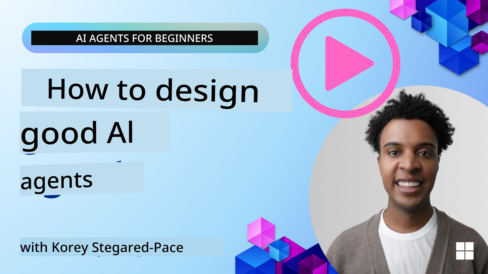
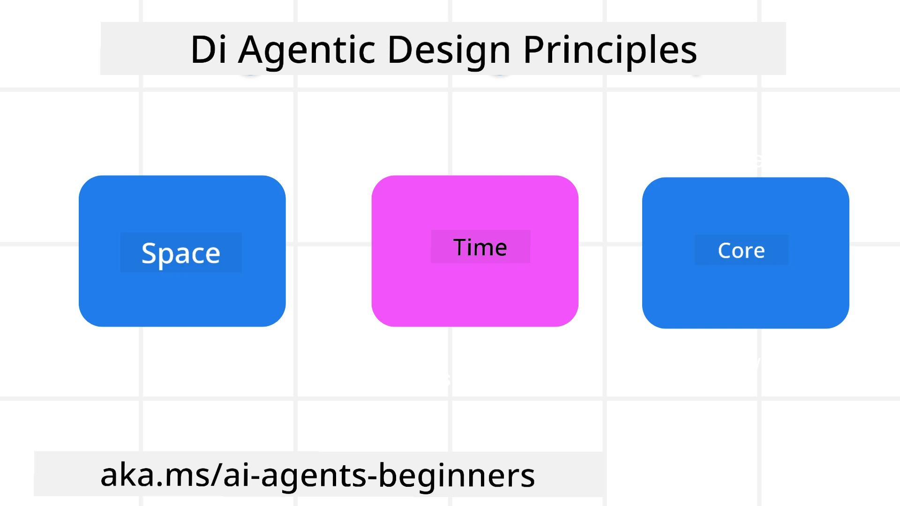

<!--
CO_OP_TRANSLATOR_METADATA:
{
  "original_hash": "d71524fe83a23829ae7a23b4031aaac8",
  "translation_date": "2025-11-13T15:02:55+00:00",
  "source_file": "03-agentic-design-patterns/README.md",
  "language_code": "pcm"
}
-->

> _(Click di image wey dey up to watch di video for dis lesson)_
# AI Agentic Design Principles

## Introduction

Plenty ways dey to think how to build AI Agentic Systems. Since say ambiguity na one feature wey dey Generative AI design, e fit hard for engineers to sabi where dem go start. We don create one set of human-centric UX Design Principles wey go help developers build customer-centric agentic systems wey go fit solve di business needs wey dem get. Dis design principles no be one fixed architecture, but na starting point for teams wey dey define and dey build agent experiences.

Generally, agents suppose:

- Help human beings do more and scale wetin dem fit do (brainstorming, problem-solving, automation, etc.)
- Fill di gap for knowledge (make I sabi di knowledge wey I no get, translation, etc.)
- Help and support collaboration for di way we as individuals dey like work with others
- Make us better version of ourselves (e.g., life coach/task master, help us learn emotional regulation and mindfulness skills, build resilience, etc.)

## Wetin Dis Lesson Go Cover

- Wetin be di Agentic Design Principles
- Guidelines wey you go follow when you dey use di design principles
- Examples of how to use di design principles

## Learning Goals

After you finish dis lesson, you go fit:

1. Explain wetin be di Agentic Design Principles
2. Explain di guidelines for how to use di Agentic Design Principles
3. Sabi how to build agent wey dey use di Agentic Design Principles

## Di Agentic Design Principles

### Agent (Space)

Dis na di environment wey di agent dey operate. Dis principles dey guide how we go design agents wey go fit engage for physical and digital worlds.

- **Connecting, no be collapsing** – help connect people to other people, events, and actionable knowledge to enable collaboration and connection.
- Agents dey help connect events, knowledge, and people.
- Agents dey bring people closer together. Dem no dey designed to replace or make people feel less.
- **E dey easy to access but sometimes e dey invisible** – agent dey operate for background and e go only show face when e dey relevant and appropriate.
  - Agent dey easy to find and access for authorized users for any device or platform.
  - Agent dey support multimodal inputs and outputs (sound, voice, text, etc.).
  - Agent fit move smoothly between foreground and background; between proactive and reactive, based on wetin e sense say user need.
  - Agent fit dey operate for invisible form, but di background process path and di way e dey collaborate with other Agents dey transparent and user fit control am.

### Agent (Time)

Dis na how di agent dey operate over time. Dis principles dey guide how we go design agents wey dey interact across di past, present, and future.

- **Past**: Reflect on history wey include both state and context.
  - Agent dey provide more relevant results based on analysis of richer historical data beyond only di event, people, or states.
  - Agent dey create connections from past events and e dey actively reflect on memory to engage with current situations.
- **Now**: Nudging more than notifying.
  - Agent dey use better approach to interact with people. When event happen, di Agent dey go beyond static notification or other static formality. Agent fit simplify flows or dynamically generate cues to direct di user attention at di right time.
  - Agent dey deliver information based on contextual environment, social and cultural changes and e dey tailored to wetin di user want.
  - Agent interaction fit dey gradual, dey grow in complexity to empower users for long term.
- **Future**: Adapting and evolving.
  - Agent dey adapt to different devices, platforms, and modalities.
  - Agent dey adapt to user behavior, accessibility needs, and e dey free for customization.
  - Agent dey shaped by and e dey evolve through continuous user interaction.

### Agent (Core)

Dis na di key elements wey dey di core of how agent dey designed.

- **Accept uncertainty but build trust**.
  - Small uncertainty for Agent na normal. Uncertainty na key element for agent design.
  - Trust and transparency na di foundation for Agent design.
  - Humans dey in control of when di Agent dey on/off and di Agent status dey always clear.

## Di Guidelines to Implement Dis Principles

When you dey use di design principles wey we talk before, follow dis guidelines:

1. **Transparency**: Inform di user say AI dey involved, how e dey work (including past actions), and how dem fit give feedback and modify di system.
2. **Control**: Make di user fit customize, specify preferences and personalize, and get control over di system and di attributes (including di ability to forget).
3. **Consistency**: Try make di experience dey consistent, multi-modal across devices and endpoints. Use familiar UI/UX elements where e dey possible (e.g., microphone icon for voice interaction) and reduce di customer cognitive load as much as e fit (e.g., aim for concise responses, visual aids, and ‘Learn More’ content).

## How To Design Travel Agent Using Dis Principles and Guidelines

Imagine say you dey design Travel Agent, dis na how you fit think about using di Design Principles and Guidelines:

1. **Transparency** – Inform di user say di Travel Agent na AI-enabled Agent. Provide small instructions on how to start (e.g., one “Hello” message, sample prompts). Write am clearly for di product page. Show di list of prompts wey user don ask before. Make am clear how dem fit give feedback (thumbs up and down, Send Feedback button, etc.). Talk clearly if di Agent get usage or topic restrictions.
2. **Control** – Make sure say e dey clear how di user fit modify di Agent after e don dey created with things like di System Prompt. Allow di user choose how verbose di Agent go be, di writing style, and any caveats on wetin di Agent no suppose talk about. Allow di user view and delete any files or data, prompts, and past conversations wey dey associated.
3. **Consistency** – Make sure say di icons for Share Prompt, add file or photo and tag person or thing dey standard and easy to recognize. Use di paperclip icon to show file upload/sharing with di Agent, and image icon to show graphics upload.

## Sample Codes

- Python: [Agent Framework](./code_samples/03-python-agent-framework.ipynb)
- .NET: [Agent Framework](./code_samples/03-dotnet-agent-framework.md)

## Get More Questions About AI Agentic Design Patterns?

Join di [Azure AI Foundry Discord](https://aka.ms/ai-agents/discord) to meet other learners, attend office hours and get answers to your AI Agents questions.

## Additional Resources

- <a href="https://openai.com" target="_blank">Practices for Governing Agentic AI Systems | OpenAI</a>
- <a href="https://microsoft.com" target="_blank">The HAX Toolkit Project - Microsoft Research</a>
- <a href="https://responsibleaitoolbox.ai" target="_blank">Responsible AI Toolbox</a>

## Previous Lesson

[Exploring Agentic Frameworks](../02-explore-agentic-frameworks/README.md)

## Next Lesson

[Tool Use Design Pattern](../04-tool-use/README.md)

---

<!-- CO-OP TRANSLATOR DISCLAIMER START -->
**Disclaimer**:  
Dis dokyument don use AI transleshion service [Co-op Translator](https://github.com/Azure/co-op-translator) do di transleshion. Even as we dey try make am accurate, abeg make you sabi say transleshion wey machine do fit get mistake or no dey correct well. Di original dokyument for im native language na di main source wey you go trust. For important mata, e good make professional human transleshion dey use. We no go fit take blame for any misunderstanding or wrong interpretation wey fit happen because you use dis transleshion.
<!-- CO-OP TRANSLATOR DISCLAIMER END -->