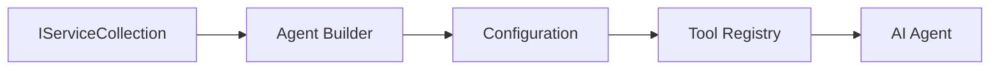

<!--
CO_OP_TRANSLATOR_METADATA:
{
  "original_hash": "bcc874e190347bd6a095aed56dc16de8",
  "translation_date": "2025-11-13T15:03:46+00:00",
  "source_file": "03-agentic-design-patterns/code_samples/03-dotnet-agent-framework.md",
  "language_code": "pcm"
}
-->
# 🎨 Agentic Design Patterns wit GitHub Models (.NET)

## 📋 Wetin You Go Learn

Dis example dey show enterprise-level design patterns wey you fit use build smart agents wit Microsoft Agent Framework for .NET wey dey work wit GitHub Models. You go sabi professional patterns and architectural ways wey go make agents ready for production, easy to maintain, and fit grow well.

### Enterprise Design Patterns

- 🏭 **Factory Pattern**: Way to create agents wey dey standard wit dependency injection
- 🔧 **Builder Pattern**: Smooth way to configure and set up agents
- 🧵 **Thread-Safe Patterns**: Manage conversations wey dey happen at the same time
- 📋 **Repository Pattern**: Arrange tools and manage wetin agents fit do

## 🎯 Benefits of .NET Architecture

### Enterprise Features

- **Strong Typing**: Validation wey dey happen when you dey compile and IntelliSense support
- **Dependency Injection**: Built-in DI container wey dey work well
- **Configuration Management**: IConfiguration and Options patterns
- **Async/Await**: First-class support for asynchronous programming

### Patterns wey fit Production

- **Logging Integration**: ILogger and structured logging support
- **Health Checks**: Built-in monitoring and diagnostics
- **Configuration Validation**: Strong typing wit data annotations
- **Error Handling**: Structured way to manage exceptions

## 🔧 Technical Architecture

### Core .NET Components

- **Microsoft.Extensions.AI**: Unified AI service abstractions
- **Microsoft.Agents.AI**: Framework wey dey manage enterprise agents
- **GitHub Models Integration**: High-performance API client patterns
- **Configuration System**: appsettings.json and environment integration

### How Design Patterns dey Work



## 🏗️ Enterprise Patterns wey Dem Show

### 1. **Creational Patterns**

- **Agent Factory**: Central place to create agents wit consistent configuration
- **Builder Pattern**: Smooth API for complex agent configuration
- **Singleton Pattern**: Manage shared resources and configuration
- **Dependency Injection**: Make am easy to test and reduce tight coupling

### 2. **Behavioral Patterns**

- **Strategy Pattern**: Changeable ways to execute tools
- **Command Pattern**: Encapsulate agent operations wit undo/redo
- **Observer Pattern**: Manage agent lifecycle wit events
- **Template Method**: Standard way to execute agent workflows

### 3. **Structural Patterns**

- **Adapter Pattern**: Layer wey dey integrate GitHub Models API
- **Decorator Pattern**: Add more capabilities to agents
- **Facade Pattern**: Make agent interaction simple
- **Proxy Pattern**: Lazy loading and caching for better performance

## 📚 .NET Design Principles

### SOLID Principles

- **Single Responsibility**: Make sure each component get one clear job
- **Open/Closed**: Fit extend am without changing original code
- **Liskov Substitution**: Use interface-based tool implementations
- **Interface Segregation**: Make interfaces focused and cohesive
- **Dependency Inversion**: Depend on abstractions, no be concrete implementations

### Clean Architecture

- **Domain Layer**: Core agent and tool abstractions
- **Application Layer**: Manage agent workflows
- **Infrastructure Layer**: Integrate GitHub Models and external services
- **Presentation Layer**: User interaction and response formatting

## 🔒 Enterprise Considerations

### Security

- **Credential Management**: Handle API keys securely wit IConfiguration
- **Input Validation**: Use strong typing and data annotation validation
- **Output Sanitization**: Process and filter responses securely
- **Audit Logging**: Track operations well

### Performance

- **Async Patterns**: Non-blocking I/O operations
- **Connection Pooling**: Manage HTTP clients efficiently
- **Caching**: Cache responses to improve performance
- **Resource Management**: Dispose and clean up resources properly

### Scalability

- **Thread Safety**: Support agents wey dey run at the same time
- **Resource Pooling**: Use resources well
- **Load Management**: Handle rate limiting and backpressure
- **Monitoring**: Check performance metrics and health

## 🚀 Production Deployment

- **Configuration Management**: Settings wey dey specific to environment
- **Logging Strategy**: Structured logging wit correlation IDs
- **Error Handling**: Manage exceptions globally wit recovery
- **Monitoring**: Use Application Insights and performance counters
- **Testing**: Unit tests, integration tests, and load testing patterns

Ready to build enterprise-level smart agents wit .NET? Make we architect something wey strong! 🏢✨

## 🚀 How to Start

### Wetin You Need

- [.NET 10 SDK](https://dotnet.microsoft.com/download/dotnet/10.0) or higher
- [GitHub Models API access token](https://docs.github.com/github-models/github-models-at-scale/using-your-own-api-keys-in-github-models)

### Environment Variables wey You Need

```bash
# zsh/bash
export GH_TOKEN=<your_github_token>
export GH_ENDPOINT=https://models.github.ai/inference
export GH_MODEL_ID=openai/gpt-5-mini
```

```powershell
# PowerShell
$env:GH_TOKEN = "<your_github_token>"
$env:GH_ENDPOINT = "https://models.github.ai/inference"
$env:GH_MODEL_ID = "openai/gpt-5-mini"
```

### Sample Code

To run the code example,

```bash
# zsh/bash
chmod +x ./03-dotnet-agent-framework.cs
./03-dotnet-agent-framework.cs
```

Or use dotnet CLI:

```bash
dotnet run ./03-dotnet-agent-framework.cs
```

Check [`03-dotnet-agent-framework.cs`](../../../../03-agentic-design-patterns/code_samples/03-dotnet-agent-framework.cs) for the full code.

```csharp
#!/usr/bin/dotnet run

#:package Microsoft.Extensions.AI@10.*
#:package Microsoft.Agents.AI.OpenAI@1.*-*

using System.ClientModel;
using System.ComponentModel;

using Microsoft.Agents.AI;
using Microsoft.Extensions.AI;

using OpenAI;

// Tool Function: Random Destination Generator
// This static method will be available to the agent as a callable tool
// The [Description] attribute helps the AI understand when to use this function
// This demonstrates how to create custom tools for AI agents
[Description("Provides a random vacation destination.")]
static string GetRandomDestination()
{
    // List of popular vacation destinations around the world
    // The agent will randomly select from these options
    var destinations = new List<string>
    {
        "Paris, France",
        "Tokyo, Japan",
        "New York City, USA",
        "Sydney, Australia",
        "Rome, Italy",
        "Barcelona, Spain",
        "Cape Town, South Africa",
        "Rio de Janeiro, Brazil",
        "Bangkok, Thailand",
        "Vancouver, Canada"
    };

    // Generate random index and return selected destination
    // Uses System.Random for simple random selection
    var random = new Random();
    int index = random.Next(destinations.Count);
    return destinations[index];
}

// Extract configuration from environment variables
// Retrieve the GitHub Models API endpoint, defaults to https://models.github.ai/inference if not specified
// Retrieve the model ID, defaults to openai/gpt-5-mini if not specified
// Retrieve the GitHub token for authentication, throws exception if not specified
var github_endpoint = Environment.GetEnvironmentVariable("GH_ENDPOINT") ?? "https://models.github.ai/inference";
var github_model_id = Environment.GetEnvironmentVariable("GH_MODEL_ID") ?? "openai/gpt-5-mini";
var github_token = Environment.GetEnvironmentVariable("GH_TOKEN") ?? throw new InvalidOperationException("GH_TOKEN is not set.");

// Configure OpenAI Client Options
// Create configuration options to point to GitHub Models endpoint
// This redirects OpenAI client calls to GitHub's model inference service
var openAIOptions = new OpenAIClientOptions()
{
    Endpoint = new Uri(github_endpoint)
};

// Initialize OpenAI Client with GitHub Models Configuration
// Create OpenAI client using GitHub token for authentication
// Configure it to use GitHub Models endpoint instead of OpenAI directly
var openAIClient = new OpenAIClient(new ApiKeyCredential(github_token), openAIOptions);

// Define Agent Identity and Comprehensive Instructions
// Agent name for identification and logging purposes
var AGENT_NAME = "TravelAgent";

// Detailed instructions that define the agent's personality, capabilities, and behavior
// This system prompt shapes how the agent responds and interacts with users
var AGENT_INSTRUCTIONS = """
You are a helpful AI Agent that can help plan vacations for customers.

Important: When users specify a destination, always plan for that location. Only suggest random destinations when the user hasn't specified a preference.

When the conversation begins, introduce yourself with this message:
"Hello! I'm your TravelAgent assistant. I can help plan vacations and suggest interesting destinations for you. Here are some things you can ask me:
1. Plan a day trip to a specific location
2. Suggest a random vacation destination
3. Find destinations with specific features (beaches, mountains, historical sites, etc.)
4. Plan an alternative trip if you don't like my first suggestion

What kind of trip would you like me to help you plan today?"

Always prioritize user preferences. If they mention a specific destination like "Bali" or "Paris," focus your planning on that location rather than suggesting alternatives.
""";

// Create AI Agent with Advanced Travel Planning Capabilities
// Initialize complete agent pipeline: OpenAI client → Chat client → AI agent
// Configure agent with name, detailed instructions, and available tools
// This demonstrates the .NET agent creation pattern with full configuration
AIAgent agent = openAIClient
    .GetChatClient(github_model_id)
    .CreateAIAgent(
        name: AGENT_NAME,
        instructions: AGENT_INSTRUCTIONS,
        tools: [AIFunctionFactory.Create(GetRandomDestination)]
    );

// Create New Conversation Thread for Context Management
// Initialize a new conversation thread to maintain context across multiple interactions
// Threads enable the agent to remember previous exchanges and maintain conversational state
// This is essential for multi-turn conversations and contextual understanding
AgentThread thread = agent.GetNewThread();

// Execute Agent: First Travel Planning Request
// Run the agent with an initial request that will likely trigger the random destination tool
// The agent will analyze the request, use the GetRandomDestination tool, and create an itinerary
// Using the thread parameter maintains conversation context for subsequent interactions
await foreach (var update in agent.RunStreamingAsync("Plan me a day trip", thread))
{
    await Task.Delay(10);
    Console.Write(update);
}

Console.WriteLine();

// Execute Agent: Follow-up Request with Context Awareness
// Demonstrate contextual conversation by referencing the previous response
// The agent remembers the previous destination suggestion and will provide an alternative
// This showcases the power of conversation threads and contextual understanding in .NET agents
await foreach (var update in agent.RunStreamingAsync("I don't like that destination. Plan me another vacation.", thread))
{
    await Task.Delay(10);
    Console.Write(update);
}
```

---

<!-- CO-OP TRANSLATOR DISCLAIMER START -->
**Disclaimer**:  
Dis dokyument don translate wit AI translation service [Co-op Translator](https://github.com/Azure/co-op-translator). Even as we dey try make sure say e correct, abeg make you sabi say machine translation fit get mistake or no dey accurate well. Di original dokyument for im native language na di main correct source. For important information, e good make you use professional human translation. We no go fit take blame for any misunderstanding or wrong interpretation wey fit happen because you use dis translation.
<!-- CO-OP TRANSLATOR DISCLAIMER END -->