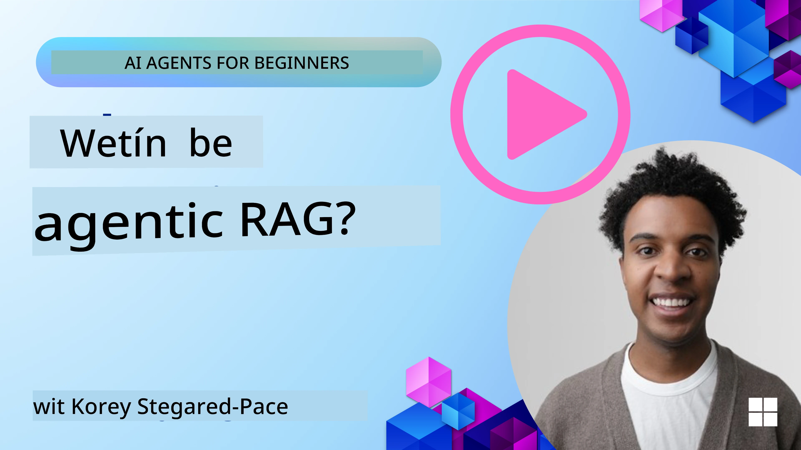
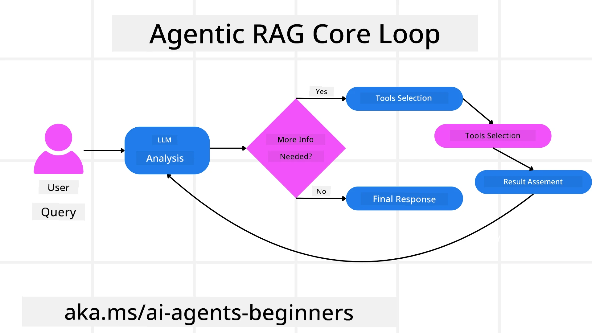
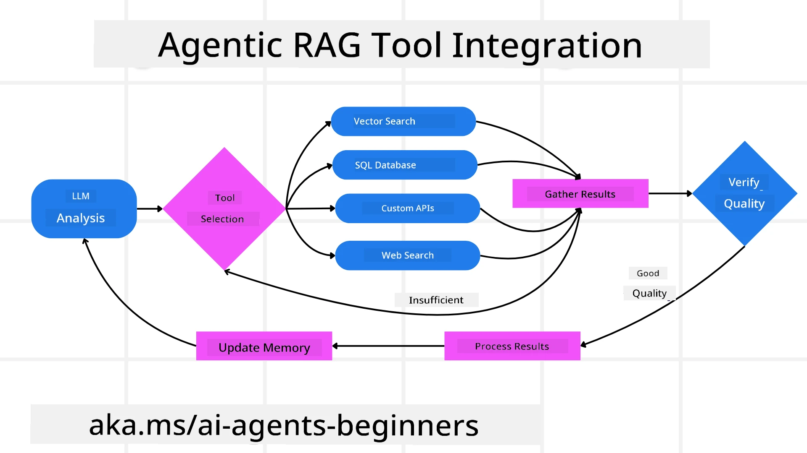
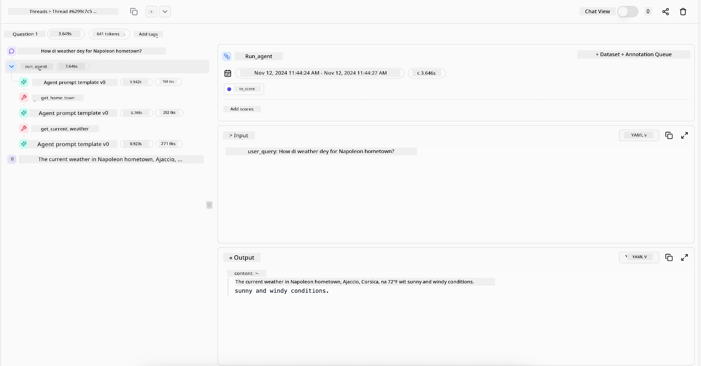

<!--
CO_OP_TRANSLATOR_METADATA:
{
  "original_hash": "0ebf6b2290db55dbf2d10cc49655523b",
  "translation_date": "2025-11-11T11:55:35+00:00",
  "source_file": "05-agentic-rag/README.md",
  "language_code": "pcm"
}
-->

> _(Click di image wey dey up to watch di video for dis lesson)_

# Agentic RAG

Dis lesson go explain well-well wetin Agentic Retrieval-Augmented Generation (Agentic RAG) be, one new AI way wey dey make big language models (LLMs) dey plan dia next move by demself while dem dey collect info from outside sources. E no be like di normal retrieval-then-read style, Agentic RAG dey use LLM many times, dey mix am with tool or function calls and structured outputs. Di system dey check di results, dey fix queries, dey use more tools if e need am, and e go continue dis process until e get di answer wey e dey look for.

## Introduction

Dis lesson go cover:

- **Understand Agentic RAG:** Learn about dis new AI way wey big language models (LLMs) dey plan dia next move by demself while dem dey collect info from outside sources.
- **Grasp Iterative Maker-Checker Style:** Understand how di LLM dey work in loop, dey mix tool or function calls and structured outputs to make sure di answer correct and fix bad queries.
- **Explore Practical Applications:** See di kind work wey Agentic RAG dey do well, like places wey correctness dey important, complex database work, and long workflows.

## Learning Goals

After you finish dis lesson, you go sabi:

- **Understanding Agentic RAG:** Learn about dis new AI way wey big language models (LLMs) dey plan dia next move by demself while dem dey collect info from outside sources.
- **Iterative Maker-Checker Style:** Understand di loop wey dey mix LLM calls, tool or function calls, and structured outputs to make sure di answer correct and fix bad queries.
- **Owning the Reasoning Process:** Understand how di system dey make decisions by itself on how e go solve problems without following fixed steps.
- **Workflow:** Learn how di agentic model dey decide by itself to collect market trend reports, find competitor data, check internal sales metrics, join di findings, and check di strategy.
- **Iterative Loops, Tool Integration, and Memory:** Learn how di system dey use loop interaction, dey keep memory of di steps, and dey avoid repeating di same thing.
- **Handling Failure Modes and Self-Correction:** See how di system dey fix itself when e make mistake, dey try again, dey use tools to check di problem, and dey ask human for help if e need am.
- **Boundaries of Agency:** Understand di limits of Agentic RAG, like di fact say e dey depend on di tools and rules wey human put for am.
- **Practical Use Cases and Value:** See di kind work wey Agentic RAG dey do well, like places wey correctness dey important, complex database work, and long workflows.
- **Governance, Transparency, and Trust:** Learn why e dey important to make sure di system dey follow rules, dey explain wetin e dey do, and dey get human oversight.

## Wetin Be Agentic RAG?

Agentic Retrieval-Augmented Generation (Agentic RAG) na one new AI way wey big language models (LLMs) dey plan dia next move by demself while dem dey collect info from outside sources. E no be like di normal retrieval-then-read style, Agentic RAG dey use LLM many times, dey mix am with tool or function calls and structured outputs. Di system dey check di results, dey fix queries, dey use more tools if e need am, and e go continue dis process until e get di answer wey e dey look for. Dis “maker-checker” style dey help make sure di answer correct, dey fix bad queries, and dey give better results.

Di system dey take charge of di reasoning process, dey rewrite failed queries, dey choose different ways to collect info, and dey use tools like vector search for Azure AI Search, SQL databases, or custom APIs before e finalize di answer. Wetin make agentic system different na di way e dey take charge of di reasoning process. Di normal RAG dey follow fixed steps, but agentic system dey decide di steps by itself based on di info wey e find.

## Defining Agentic Retrieval-Augmented Generation (Agentic RAG)

Agentic Retrieval-Augmented Generation (Agentic RAG) na one new AI way wey LLMs no just dey collect info from outside sources but dem dey plan dia next move by demself. E no be like di normal retrieval-then-read style or fixed prompt sequences, Agentic RAG dey use LLM many times, dey mix am with tool or function calls and structured outputs. Di system dey check di results, dey fix queries, dey use more tools if e need am, and e go continue dis process until e get di answer wey e dey look for.

Dis “maker-checker” style dey help make sure di answer correct, dey fix bad queries for structured databases (like NL2SQL), and dey give balanced, better results. Di system dey take charge of di reasoning process, dey rewrite failed queries, dey choose different ways to collect info, and dey use tools like vector search for Azure AI Search, SQL databases, or custom APIs before e finalize di answer. E no need complex frameworks, just simple loop of “LLM call → tool use → LLM call → …” fit give better and grounded outputs.

## Owning the Reasoning Process

Wetin make di system “agentic” na di way e dey take charge of di reasoning process. Di normal RAG dey depend on humans to plan di steps for di model: like chain-of-thought wey dey show wetin to collect and when. But agentic system dey decide by itself how e go solve di problem. E no dey just follow script; e dey decide di steps based on di info wey e find.

For example, if dem ask am to create product launch strategy, e no go just follow prompt wey explain di whole research and decision-making process. Instead, di agentic model go decide by itself to:

1. Collect current market trend reports using Bing Web Grounding.
2. Find competitor data using Azure AI Search.
3. Check historical internal sales metrics using Azure SQL Database.
4. Join di findings into one strategy using Azure OpenAI Service.
5. Check di strategy for gaps or mistakes, and if e need am, e go collect more info.

All dis steps—fixing queries, choosing sources, repeating until e dey satisfied—na di model dey decide, no be human wey dey plan am.

## Iterative Loops, Tool Integration, and Memory

Agentic system dey use loop interaction pattern:

- **Initial Call:** Di user go give di LLM di goal (like user prompt).
- **Tool Invocation:** If di model see say info dey miss or instruction no clear, e go choose tool or retrieval method—like vector database query (e.g. Azure AI Search Hybrid search over private data) or structured SQL call—to collect more info.
- **Assessment & Refinement:** Di model go check di data wey e collect, decide if e dey okay. If e no dey okay, e go fix di query, try another tool, or change di way e dey do am.
- **Repeat Until Satisfied:** Dis process go continue until di model feel say e don get enough info to give final, correct answer.
- **Memory & State:** Di system dey keep memory of di steps, so e fit remember wetin e don try before and avoid repeating di same thing. Dis dey help am make better decisions as e dey go.

Over time, dis dey make di model dey understand di problem better, so e fit handle complex, multi-step tasks without human dey change di prompt every time.

## Handling Failure Modes and Self-Correction

Agentic RAG dey also get strong way to fix itself. If di system jam wahala—like collecting wrong documents or bad queries—e fit:

- **Iterate and Re-Query:** Instead of giving bad answer, di model go try new search ways, rewrite database queries, or check other data sets.
- **Use Diagnostic Tools:** Di system fit use extra functions to check di problem or confirm di data wey e collect. Tools like Azure AI Tracing go help make sure di system dey work well.
- **Fallback on Human Oversight:** For big problems or when e dey fail many times, di model fit ask human for help. Di human go give feedback, and di model go learn from di correction.

Dis way wey di model dey fix itself dey make sure say e no be one-time system but one wey dey learn from di mistakes wey e make for di session.

## Boundaries of Agency

Even though di system dey work by itself for di task, Agentic RAG no be Artificial General Intelligence. Di “agentic” power dey limited to di tools, data sources, and rules wey human developers put for am. E no fit create new tools or go outside di domain wey dem set for am. Instead, e dey good for arranging di resources wey e get.

Di main difference from advanced AI na:

1. **Domain-Specific Autonomy:** Agentic RAG dey focus on user goals for di domain wey e sabi, dey use ways like query rewriting or tool selection to get better results.
2. **Infrastructure-Dependent:** Di system dey depend on di tools and data wey developers put for am. E no fit pass di boundaries without human help.
3. **Respect for Guardrails:** Rules, compliance, and business policies still dey very important. Di agent freedom dey always dey under safety measures and human oversight.

## Practical Use Cases and Value

Agentic RAG dey work well for places wey need correct answer and precision:

1. **Correctness-First Environments:** For compliance checks, regulatory analysis, or legal research, di agentic model fit dey verify facts many times, check different sources, and fix queries until e get correct answer.
2. **Complex Database Interactions:** For structured data wey queries dey fail or need adjustment, di system fit dey fix di queries by itself using Azure SQL or Microsoft Fabric OneLake, to make sure di final answer dey correct.
3. **Extended Workflows:** For long tasks wey dey change as new info dey come, Agentic RAG fit dey add new data, dey change di way e dey work as e dey learn more about di problem.

## Governance, Transparency, and Trust

As di system dey get more power to reason by itself, e dey important to make sure e dey follow rules and dey transparent:

- **Explainable Reasoning:** Di model fit show record of di queries wey e make, di sources wey e check, and di steps wey e follow to reach di answer. Tools like Azure AI Content Safety and Azure AI Tracing / GenAIOps fit help keep transparency and reduce risk.
- **Bias Control and Balanced Retrieval:** Developers fit adjust di way e dey collect info to make sure e dey balanced, dey check di outputs to see if bias dey or di data dey one-sided using custom models for advanced data science organizations with Azure Machine Learning.
- **Human Oversight and Compliance:** For sensitive tasks, human review still dey important. Agentic RAG no dey replace human judgment for big decisions—e dey help am by giving better options wey dem don check well.

Tools wey fit show clear record of actions dey very important. Without dem, e go hard to debug multi-step process. See dis example from Literal AI (di company wey dey behind Chainlit) for how Agent dey work:

## Conclusion

Agentic RAG na di next step for how AI systems dey handle complex, data-heavy tasks. By using loop interaction, choosing tools by itself, and fixing queries until e get better answer, di system dey move past di normal prompt-following to become more adaptive and dey make better decisions. Even though e dey limited by human-defined tools and rules, dis agentic power dey make AI interactions richer, more dynamic, and more useful for businesses and users.

### You Get More Questions About Agentic RAG?

Join di [Azure AI Foundry Discord](https://aka.ms/ai-agents/discord) to meet other learners, attend office hours, and ask your AI Agents questions.

## Additional Resources

- <a href="https://learn.microsoft.com/training/modules/use-own-data-azure-openai" target="_blank">Implement Retrieval Augmented Generation (RAG) with Azure OpenAI Service: Learn how to use your own data with di Azure OpenAI Service. Dis Microsoft Learn module dey explain well how to do RAG</a>
- <a href="https://learn.microsoft.com/azure/ai-studio/concepts/evaluation-approach-gen-ai" target="_blank">Evaluation of generative AI applications with Azure AI Foundry: Dis article dey talk about how to check and compare models for public datasets, including Agentic AI applications and RAG architectures</a>
- <a href="https://weaviate.io/blog/what-is-agentic-rag" target="_blank">What is Agentic RAG | Weaviate</a>
- <a href="https://ragaboutit.com/agentic-rag-a-complete-guide-to-agent-based-retrieval-augmented-generation/" target="_blank">Agentic RAG: Full Guide for Agent-Based Retrieval Augmented Generation – News from generation RAG</a>
- <a href="https://huggingface.co/learn/cookbook/agent_rag" target="_blank">Agentic RAG: make your RAG better with query reformulation and self-query! Hugging Face Open-Source AI Cookbook</a>
- <a href="https://youtu.be/aQ4yQXeB1Ss?si=2HUqBzHoeB5tR04U" target="_blank">Add Agentic Layers to RAG</a>
- <a href="https://www.youtube.com/watch?v=zeAyuLc_f3Q&t=244s" target="_blank">The Future of Knowledge Assistants: Jerry Liu</a>
- <a href="https://www.youtube.com/watch?v=AOSjiXP1jmQ" target="_blank">How to Build Agentic RAG Systems</a>
- <a href="https://ignite.microsoft.com/sessions/BRK102?source=sessions" target="_blank">Use Azure AI Foundry Agent Service to grow your AI agents</a>

### Academic Papers

- <a href="https://arxiv.org/abs/2303.17651" target="_blank">2303.17651 Self-Refine: Iterative Refinement with Self-Feedback</a>
- <a href="https://arxiv.org/abs/2303.11366" target="_blank">2303.11366 Reflexion: Language Agents with Verbal Reinforcement Learning</a>
- <a href="https://arxiv.org/abs/2305.11738" target="_blank">2305.11738 CRITIC: Large Language Models Fit Correct Demself with Tool-Interactive Critiquing</a>
- <a href="https://arxiv.org/abs/2501.09136" target="_blank">2501.09136 Agentic Retrieval-Augmented Generation: A Survey on Agentic RAG</a>

## Previous Lesson

[Tool Use Design Pattern](../04-tool-use/README.md)

## Next Lesson

[Building Trustworthy AI Agents](../06-building-trustworthy-agents/README.md)

---

<!-- CO-OP TRANSLATOR DISCLAIMER START -->
**Disclaimer**:  
Dis dokyument don use AI translation service [Co-op Translator](https://github.com/Azure/co-op-translator) do di translation. Even as we dey try make am accurate, abeg sabi say automated translations fit get mistake or no dey correct well. Di original dokyument for im native language na di main source wey you go fit trust. For important information, e better make professional human translation dey used. We no go fit take blame for any misunderstanding or wrong interpretation wey fit happen because you use dis translation.
<!-- CO-OP TRANSLATOR DISCLAIMER END -->