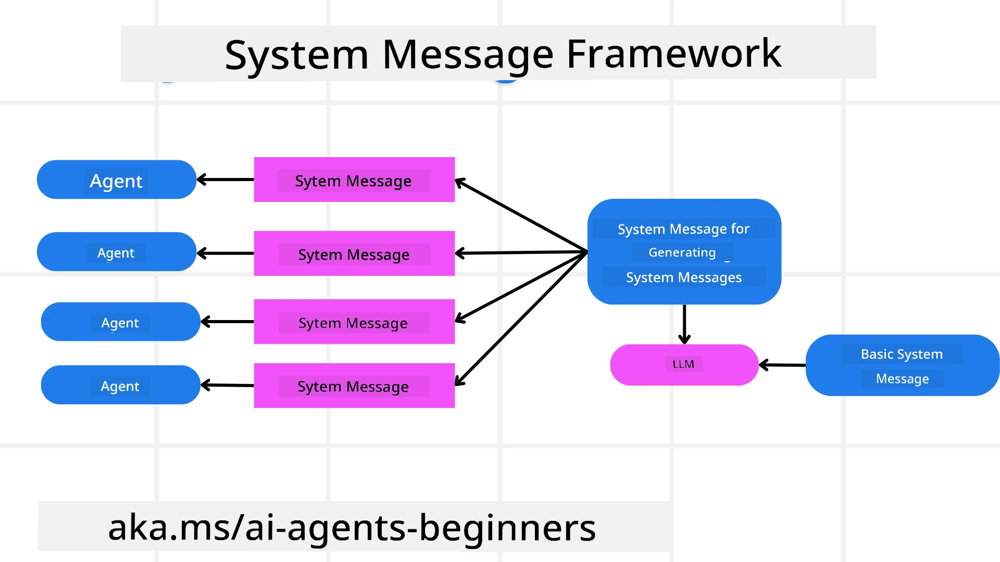
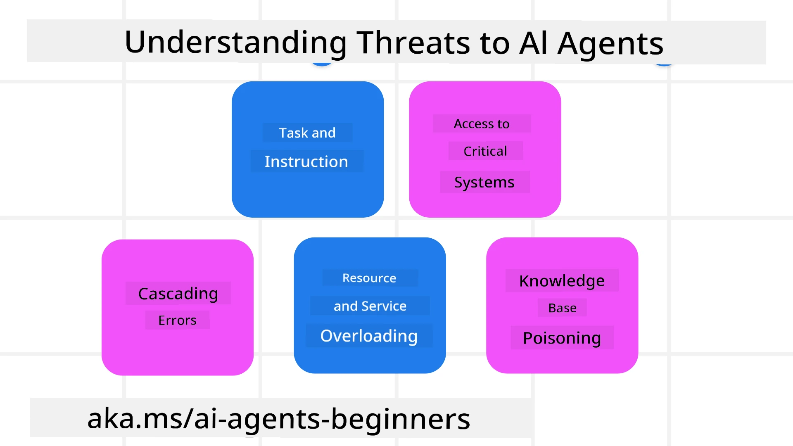
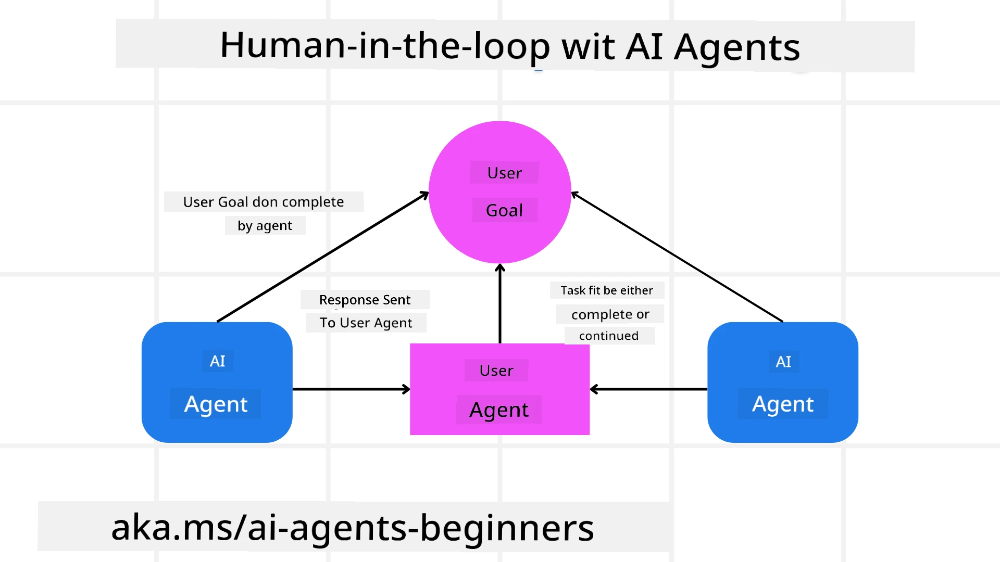

<!--
CO_OP_TRANSLATOR_METADATA:
{
  "original_hash": "498802b4c3c3cc486b86f27a12cebb34",
  "translation_date": "2025-11-11T11:57:06+00:00",
  "source_file": "06-building-trustworthy-agents/README.md",
  "language_code": "pcm"
}
-->
[](https://youtu.be/iZKkMEGBCUQ?si=Q-kEbcyHUMPoHp8L)

> _(Click di image wey dey up to watch di video for dis lesson)_

# How to Build AI Agents wey people go trust

## Introduction

Dis lesson go talk about:

- How to build and deploy AI Agents wey dey safe and dey work well
- Di important security things wey you go think about when you dey develop AI Agents.
- How to make sure say data and user privacy dey okay when you dey develop AI Agents.

## Learning Goals

After you finish dis lesson, you go sabi how to:

- See di risks wey fit happen when you dey create AI Agents and how to stop am.
- Put security measures to make sure say data and access dey managed well.
- Create AI Agents wey dey protect data privacy and still give better user experience.

## Safety

Make we first look how to build agentic applications wey dey safe. Safety mean say di AI agent go do wetin dem design am to do. As people wey dey build agentic applications, we get methods and tools wey go help us make sure say di agent dey safe:

### How to Build System Message Framework

If you don ever build AI application wey dey use Large Language Models (LLMs), you go sabi say e dey important to design strong system prompt or system message. Dis prompts dey set di rules, instructions, and guidelines for how di LLM go take interact with di user and data.

For AI Agents, di system prompt dey even more important because di AI Agents go need clear instructions to finish di tasks wey we design for dem.

To create system prompts wey fit scale, we fit use system message framework to build one or more agents for our application:



#### Step 1: Create Meta System Message 

Di meta prompt na wetin LLM go use to generate di system prompts for di agents wey we dey create. We go design am like template so we fit create plenty agents if we need am.

Example of meta system message we fit give LLM:

```plaintext
You are an expert at creating AI agent assistants. 
You will be provided a company name, role, responsibilities and other
information that you will use to provide a system prompt for.
To create the system prompt, be descriptive as possible and provide a structure that a system using an LLM can better understand the role and responsibilities of the AI assistant. 
```

#### Step 2: Create Basic Prompt

Di next step na to create basic prompt wey go describe di AI Agent. You go need include di role of di agent, di tasks wey di agent go complete, and di other responsibilities wey di agent get.

Example:

```plaintext
You are a travel agent for Contoso Travel that is great at booking flights for customers. To help customers you can perform the following tasks: lookup available flights, book flights, ask for preferences in seating and times for flights, cancel any previously booked flights and alert customers on any delays or cancellations of flights.  
```

#### Step 3: Give Basic System Message to LLM

Now we fit make di system message better by giving di meta system message as di system message and di basic system message.

Dis go produce system message wey dey well designed to guide our AI agents:

```markdown
**Company Name:** Contoso Travel  
**Role:** Travel Agent Assistant

**Objective:**  
You are an AI-powered travel agent assistant for Contoso Travel, specializing in booking flights and providing exceptional customer service. Your main goal is to assist customers in finding, booking, and managing their flights, all while ensuring that their preferences and needs are met efficiently.

**Key Responsibilities:**

1. **Flight Lookup:**
    
    - Assist customers in searching for available flights based on their specified destination, dates, and any other relevant preferences.
    - Provide a list of options, including flight times, airlines, layovers, and pricing.
2. **Flight Booking:**
    
    - Facilitate the booking of flights for customers, ensuring that all details are correctly entered into the system.
    - Confirm bookings and provide customers with their itinerary, including confirmation numbers and any other pertinent information.
3. **Customer Preference Inquiry:**
    
    - Actively ask customers for their preferences regarding seating (e.g., aisle, window, extra legroom) and preferred times for flights (e.g., morning, afternoon, evening).
    - Record these preferences for future reference and tailor suggestions accordingly.
4. **Flight Cancellation:**
    
    - Assist customers in canceling previously booked flights if needed, following company policies and procedures.
    - Notify customers of any necessary refunds or additional steps that may be required for cancellations.
5. **Flight Monitoring:**
    
    - Monitor the status of booked flights and alert customers in real-time about any delays, cancellations, or changes to their flight schedule.
    - Provide updates through preferred communication channels (e.g., email, SMS) as needed.

**Tone and Style:**

- Maintain a friendly, professional, and approachable demeanor in all interactions with customers.
- Ensure that all communication is clear, informative, and tailored to the customer's specific needs and inquiries.

**User Interaction Instructions:**

- Respond to customer queries promptly and accurately.
- Use a conversational style while ensuring professionalism.
- Prioritize customer satisfaction by being attentive, empathetic, and proactive in all assistance provided.

**Additional Notes:**

- Stay updated on any changes to airline policies, travel restrictions, and other relevant information that could impact flight bookings and customer experience.
- Use clear and concise language to explain options and processes, avoiding jargon where possible for better customer understanding.

This AI assistant is designed to streamline the flight booking process for customers of Contoso Travel, ensuring that all their travel needs are met efficiently and effectively.

```

#### Step 4: Make Small Changes and Improve

Di value of dis system message framework na say e go make am easy to create system messages for plenty agents and also improve di system messages as time dey go. E no dey common to get system message wey go work well for di first time for all di use cases. If you fit dey make small changes and improvements by changing di basic system message and running am through di system, e go help you compare and check di results.

## Understanding Threats

To build AI agents wey people go trust, e dey important to understand di risks and threats wey fit affect your AI agent. Make we look some of di threats wey fit happen to AI agents and how you fit plan and prepare for dem.



### Task and Instruction

**Description:** Bad people fit try change di instructions or goals of di AI agent by manipulating di inputs.

**Mitigation**: You fit use validation checks and input filters to catch dangerous prompts before di AI Agent process am. Since dis kind attack dey need plenty interaction with di Agent, you fit limit di number of turns for di conversation to stop dis kind attack.

### Access to Critical Systems

**Description**: If AI agent get access to systems and services wey dey store sensitive data, bad people fit attack di communication between di agent and di services. Dem fit attack di system directly or try get information about di systems through di agent.

**Mitigation**: AI agents suppose get access to systems only when e dey necessary to stop dis kind attack. Di communication between di agent and system suppose dey secure. You fit also use authentication and access control to protect di information.

### Resource and Service Overloading

**Description:** AI agents fit use different tools and services to complete tasks. Bad people fit use dis ability to attack di services by sending plenty requests through di AI Agent, wey fit cause system failure or high cost.

**Mitigation:** You fit put policies to limit di number of requests wey AI agent fit make to di service. You fit also limit di number of conversation turns and requests to di AI agent to stop dis kind attack.

### Knowledge Base Poisoning

**Description:** Dis kind attack no dey target di AI agent directly but di knowledge base and other services wey di AI agent dey use. E fit involve corrupting di data or information wey di AI agent dey use to complete task, wey go lead to biased or wrong response to di user.

**Mitigation:** You fit dey verify di data wey di AI agent dey use for di workflows regularly. Make sure say di access to dis data dey secure and only trusted people fit change am to avoid dis kind attack.

### Cascading Errors

**Description:** AI agents dey use different tools and services to complete tasks. Errors wey bad people cause fit lead to failure for other systems wey di AI agent dey connect to, wey go make di attack spread and hard to fix.

**Mitigation**: One way to stop dis na to make di AI Agent dey work inside limited environment, like using Docker container, to stop direct system attack. You fit also create fallback mechanisms and retry logic when some systems respond with error to stop bigger system failure.

## Human-in-the-Loop

Another way wey dey effective to build AI Agent systems wey people go trust na to use Human-in-the-loop. Dis one go create flow wey users fit give feedback to di Agents when dem dey run. Users go act like agents for multi-agent system and dem fit approve or stop di process wey dey run.



Example code snippet wey dey use AutoGen to show how dis concept dey work:

```python

# Create the agents.
model_client = OpenAIChatCompletionClient(model="gpt-4o-mini")
assistant = AssistantAgent("assistant", model_client=model_client)
user_proxy = UserProxyAgent("user_proxy", input_func=input)  # Use input() to get user input from console.

# Create the termination condition which will end the conversation when the user says "APPROVE".
termination = TextMentionTermination("APPROVE")

# Create the team.
team = RoundRobinGroupChat([assistant, user_proxy], termination_condition=termination)

# Run the conversation and stream to the console.
stream = team.run_stream(task="Write a 4-line poem about the ocean.")
# Use asyncio.run(...) when running in a script.
await Console(stream)

```

## Conclusion

To build AI agents wey people go trust, you need careful design, strong security measures, and dey improve di system regularly. By using structured meta prompting systems, understanding di threats wey fit happen, and putting plans to stop dem, developers fit create AI agents wey dey safe and dey work well. Plus, if you add human-in-the-loop approach, e go make sure say di AI agents dey follow wetin users need and reduce risks. As AI dey grow, e go dey important to always dey think about security, privacy, and di right way to use am to make sure say people trust AI systems.

### You get more questions about how to build AI Agents wey people go trust?

Join di [Azure AI Foundry Discord](https://aka.ms/ai-agents/discord) to meet other learners, attend office hours and get answers to your AI Agents questions.

## Additional Resources

- <a href="https://learn.microsoft.com/azure/ai-studio/responsible-use-of-ai-overview" target="_blank">Responsible AI overview</a>
- <a href="https://learn.microsoft.com/azure/ai-studio/concepts/evaluation-approach-gen-ai" target="_blank">Evaluation of generative AI models and AI applications</a>
- <a href="https://learn.microsoft.com/azure/ai-services/openai/concepts/system-message?context=%2Fazure%2Fai-studio%2Fcontext%2Fcontext&tabs=top-techniques" target="_blank">Safety system messages</a>
- <a href="https://blogs.microsoft.com/wp-content/uploads/prod/sites/5/2022/06/Microsoft-RAI-Impact-Assessment-Template.pdf?culture=en-us&country=us" target="_blank">Risk Assessment Template</a>

## Previous Lesson

[Agentic RAG](../05-agentic-rag/README.md)

## Next Lesson

[Planning Design Pattern](../07-planning-design/README.md)

---

<!-- CO-OP TRANSLATOR DISCLAIMER START -->
**Disclaimer**:  
Dis dokyument don use AI translation service [Co-op Translator](https://github.com/Azure/co-op-translator) do di translation. Even as we dey try make am accurate, abeg sabi say automated translations fit get mistake or no dey correct well. Di original dokyument for im native language na di main source wey you go fit trust. For important information, e better make professional human translation dey use. We no go fit take blame for any misunderstanding or wrong interpretation wey fit happen because you use dis translation.
<!-- CO-OP TRANSLATOR DISCLAIMER END -->