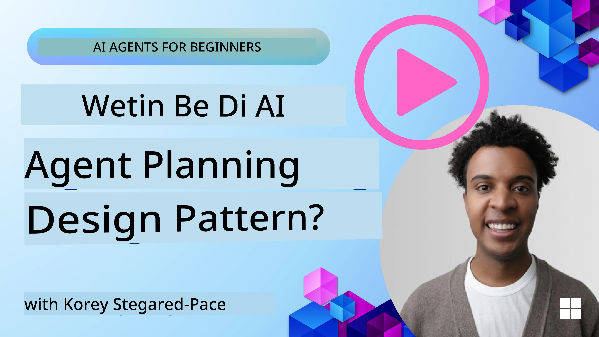
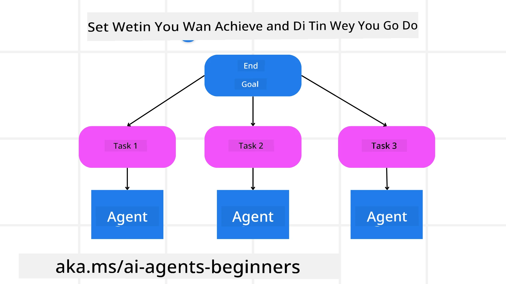

<!--
CO_OP_TRANSLATOR_METADATA:
{
  "original_hash": "43069833a0412210ad5c3cc93d9c2146",
  "translation_date": "2025-11-11T14:18:39+00:00",
  "source_file": "07-planning-design/README.md",
  "language_code": "pcm"
}
-->
[](https://youtu.be/kPfJ2BrBCMY?si=9pYpPXp0sSbK91Dr)

> _(Click di image wey dey up to watch di video for dis lesson)_

# Planning Design

## Introduction

Dis lesson go cover:

* How to set clear goal and break big task into small-small task wey person fit manage.
* How to use structured output to get better and machine-readable response.
* How to use event-driven method to handle tasks wey dey change or unexpected inputs.

## Learning Goals

After you finish dis lesson, you go sabi:

* How to set clear goal for AI agent, so e go know wetin e suppose achieve.
* How to break big task into small-small task wey dey make sense and arrange dem well.
* How to give agents di correct tools (like search tools or data analytics tools), decide when and how dem go use am, and handle wahala wey fit show.
* How to check di result of di small tasks, measure performance, and change actions to make di final result better.

## How to Set Goal and Break Task Down



Most tasks for real life dey too big to do am once. AI agent need clear objective to guide di way e go plan and act. For example, di goal fit be:

    "Make 3-day travel plan."

Even though e simple to talk, e still need make we refine am. Di clearer di goal, di better di agent (and di human wey dey work with am) go fit focus to get correct result, like full travel plan wey get flight options, hotel suggestions, and activity ideas.

### How to Break Task Down

Big or hard task go dey easier if you divide am into small-small tasks wey get goal.  
For di travel plan example, you fit divide di goal into:

* Flight Booking
* Hotel Booking
* Car Rental
* Personalization

Each small task fit dey handled by different agents or processes. One agent fit sabi how to find di best flight deals, another one fit sabi hotel booking, and so on. One agent wey dey coordinate go fit join all di results together to make one complete plan for di user.

Dis kind method dey allow make we dey improve di plan small-small. For example, you fit add agents wey sabi Food Recommendations or Local Activity Suggestions and make di plan better as time dey go.

### Structured Output

Big Language Models (LLMs) fit create structured output (like JSON) wey dey easy for other agents or services to read and use. Dis one dey very useful when many agents dey work together, so we fit use di tasks wey dem plan after di output don show. Check dis <a href="https://microsoft.github.io/autogen/stable/user-guide/core-user-guide/cookbook/structured-output-agent.html" target="_blank">blogpost</a> for quick summary.

Dis Python example dey show how planning agent fit break goal into small tasks and create structured plan:

```python
from pydantic import BaseModel
from enum import Enum
from typing import List, Optional, Union
import json
import os
from typing import Optional
from pprint import pprint
from autogen_core.models import UserMessage, SystemMessage, AssistantMessage
from autogen_ext.models.azure import AzureAIChatCompletionClient
from azure.core.credentials import AzureKeyCredential

class AgentEnum(str, Enum):
    FlightBooking = "flight_booking"
    HotelBooking = "hotel_booking"
    CarRental = "car_rental"
    ActivitiesBooking = "activities_booking"
    DestinationInfo = "destination_info"
    DefaultAgent = "default_agent"
    GroupChatManager = "group_chat_manager"

# Travel SubTask Model
class TravelSubTask(BaseModel):
    task_details: str
    assigned_agent: AgentEnum  # we want to assign the task to the agent

class TravelPlan(BaseModel):
    main_task: str
    subtasks: List[TravelSubTask]
    is_greeting: bool

client = AzureAIChatCompletionClient(
    model="gpt-4o-mini",
    endpoint="https://models.inference.ai.azure.com",
    # To authenticate with the model you will need to generate a personal access token (PAT) in your GitHub settings.
    # Create your PAT token by following instructions here: https://docs.github.com/en/authentication/keeping-your-account-and-data-secure/managing-your-personal-access-tokens
    credential=AzureKeyCredential(os.environ["GITHUB_TOKEN"]),
    model_info={
        "json_output": False,
        "function_calling": True,
        "vision": True,
        "family": "unknown",
    },
)

# Define the user message
messages = [
    SystemMessage(content="""You are an planner agent.
    Your job is to decide which agents to run based on the user's request.
                      Provide your response in JSON format with the following structure:
{'main_task': 'Plan a family trip from Singapore to Melbourne.',
 'subtasks': [{'assigned_agent': 'flight_booking',
               'task_details': 'Book round-trip flights from Singapore to '
                               'Melbourne.'}
    Below are the available agents specialised in different tasks:
    - FlightBooking: For booking flights and providing flight information
    - HotelBooking: For booking hotels and providing hotel information
    - CarRental: For booking cars and providing car rental information
    - ActivitiesBooking: For booking activities and providing activity information
    - DestinationInfo: For providing information about destinations
    - DefaultAgent: For handling general requests""", source="system"),
    UserMessage(
        content="Create a travel plan for a family of 2 kids from Singapore to Melboune", source="user"),
]

response = await client.create(messages=messages, extra_create_args={"response_format": 'json_object'})

response_content: Optional[str] = response.content if isinstance(
    response.content, str) else None
if response_content is None:
    raise ValueError("Response content is not a valid JSON string" )

pprint(json.loads(response_content))

# # Ensure the response content is a valid JSON string before loading it
# response_content: Optional[str] = response.content if isinstance(
#     response.content, str) else None
# if response_content is None:
#     raise ValueError("Response content is not a valid JSON string")

# # Print the response content after loading it as JSON
# pprint(json.loads(response_content))

# Validate the response content with the MathReasoning model
# TravelPlan.model_validate(json.loads(response_content))
```

### Planning Agent with Multi-Agent Orchestration

For dis example, Semantic Router Agent go get user request (like "I need hotel plan for my trip.").

Di planner go then:

* Get di Hotel Plan: Di planner go take di user message and, based on system prompt (wey include di available agent details), create structured travel plan.
* List Agents and Tools: Di agent registry go hold list of agents (like flight, hotel, car rental, and activities) plus di functions/tools wey dem get.
* Send di Plan to di Correct Agents: Di planner go send di message to di correct agent (if na one task) or use group chat manager for multi-agent collaboration.
* Summarize di Result: Di planner go summarize di plan wey e create to make am clear.
Dis Python code example dey show how dis steps go work:

```python

from pydantic import BaseModel

from enum import Enum
from typing import List, Optional, Union

class AgentEnum(str, Enum):
    FlightBooking = "flight_booking"
    HotelBooking = "hotel_booking"
    CarRental = "car_rental"
    ActivitiesBooking = "activities_booking"
    DestinationInfo = "destination_info"
    DefaultAgent = "default_agent"
    GroupChatManager = "group_chat_manager"

# Travel SubTask Model

class TravelSubTask(BaseModel):
    task_details: str
    assigned_agent: AgentEnum # we want to assign the task to the agent

class TravelPlan(BaseModel):
    main_task: str
    subtasks: List[TravelSubTask]
    is_greeting: bool
import json
import os
from typing import Optional

from autogen_core.models import UserMessage, SystemMessage, AssistantMessage
from autogen_ext.models.openai import AzureOpenAIChatCompletionClient

# Create the client with type-checked environment variables

client = AzureOpenAIChatCompletionClient(
    azure_deployment=os.getenv("AZURE_OPENAI_DEPLOYMENT_NAME"),
    model=os.getenv("AZURE_OPENAI_DEPLOYMENT_NAME"),
    api_version=os.getenv("AZURE_OPENAI_API_VERSION"),
    azure_endpoint=os.getenv("AZURE_OPENAI_ENDPOINT"),
    api_key=os.getenv("AZURE_OPENAI_API_KEY"),
)

from pprint import pprint

# Define the user message

messages = [
    SystemMessage(content="""You are an planner agent.
    Your job is to decide which agents to run based on the user's request.
    Below are the available agents specialized in different tasks:
    - FlightBooking: For booking flights and providing flight information
    - HotelBooking: For booking hotels and providing hotel information
    - CarRental: For booking cars and providing car rental information
    - ActivitiesBooking: For booking activities and providing activity information
    - DestinationInfo: For providing information about destinations
    - DefaultAgent: For handling general requests""", source="system"),
    UserMessage(content="Create a travel plan for a family of 2 kids from Singapore to Melbourne", source="user"),
]

response = await client.create(messages=messages, extra_create_args={"response_format": TravelPlan})

# Ensure the response content is a valid JSON string before loading it

response_content: Optional[str] = response.content if isinstance(response.content, str) else None
if response_content is None:
    raise ValueError("Response content is not a valid JSON string")

# Print the response content after loading it as JSON

pprint(json.loads(response_content))
```

Di output wey dis code go give fit dey used to send to `assigned_agent` and summarize di travel plan for di user.

```json
{
    "is_greeting": "False",
    "main_task": "Plan a family trip from Singapore to Melbourne.",
    "subtasks": [
        {
            "assigned_agent": "flight_booking",
            "task_details": "Book round-trip flights from Singapore to Melbourne."
        },
        {
            "assigned_agent": "hotel_booking",
            "task_details": "Find family-friendly hotels in Melbourne."
        },
        {
            "assigned_agent": "car_rental",
            "task_details": "Arrange a car rental suitable for a family of four in Melbourne."
        },
        {
            "assigned_agent": "activities_booking",
            "task_details": "List family-friendly activities in Melbourne."
        },
        {
            "assigned_agent": "destination_info",
            "task_details": "Provide information about Melbourne as a travel destination."
        }
    ]
}
```

Example notebook wey get dis code dey available [here](07-autogen.ipynb).

### Iterative Planning

Some tasks go need back-and-forth or re-planning, where di result of one task go affect di next one. For example, if di agent see unexpected data format when e dey book flight, e go need change di way e dey do di work before e move to hotel booking.

Plus, user feedback (like human wey talk say dem prefer earlier flight) fit make di agent re-plan small. Dis kind dynamic, back-and-forth method dey make sure di final solution go fit real-life wahala and user choice wey dey change.

e.g sample code

```python
from autogen_core.models import UserMessage, SystemMessage, AssistantMessage
#.. same as previous code and pass on the user history, current plan
messages = [
    SystemMessage(content="""You are a planner agent to optimize the
    Your job is to decide which agents to run based on the user's request.
    Below are the available agents specialized in different tasks:
    - FlightBooking: For booking flights and providing flight information
    - HotelBooking: For booking hotels and providing hotel information
    - CarRental: For booking cars and providing car rental information
    - ActivitiesBooking: For booking activities and providing activity information
    - DestinationInfo: For providing information about destinations
    - DefaultAgent: For handling general requests""", source="system"),
    UserMessage(content="Create a travel plan for a family of 2 kids from Singapore to Melbourne", source="user"),
    AssistantMessage(content=f"Previous travel plan - {TravelPlan}", source="assistant")
]
# .. re-plan and send the tasks to respective agents
```

For more detailed planning, check Magnetic One <a href="https://www.microsoft.com/research/articles/magentic-one-a-generalist-multi-agent-system-for-solving-complex-tasks" target="_blank">Blogpost</a> for how to handle big tasks.

## Summary

For dis article, we don look example of how we fit create planner wey go fit select di agents wey dey available. Di Planner go break di tasks down and assign di agents so dem go fit do di work. E dey assumed say di agents get di tools/functions wey dem need to do di task. Apart from di agents, you fit add other methods like reflection, summarizer, and round robin chat to make am better.

## Additional Resources

AutoGen Magentic One - Na Generalist multi-agent system wey dey solve big tasks and don get good results for many hard agentic benchmarks. Reference: <a href="https://github.com/microsoft/autogen/tree/main/python/packages/autogen-magentic-one" target="_blank">autogen-magentic-one</a>. For dis implementation, di orchestrator go create task-specific plan and give di tasks to di agents wey dey available. Apart from planning, di orchestrator go also track di progress of di task and re-plan if e need.

### You Get More Questions About Planning Design Pattern?

Join di [Azure AI Foundry Discord](https://aka.ms/ai-agents/discord) to meet other learners, attend office hours, and ask your AI Agents questions.

## Previous Lesson

[Building Trustworthy AI Agents](../06-building-trustworthy-agents/README.md)

## Next Lesson

[Multi-Agent Design Pattern](../08-multi-agent/README.md)

---

<!-- CO-OP TRANSLATOR DISCLAIMER START -->
**Disclaimer**:  
Dis dokyument don use AI transleshion service [Co-op Translator](https://github.com/Azure/co-op-translator) do di transleshion. Even as we dey try make am accurate, abeg make you sabi say machine transleshion fit get mistake or no correct well. Di original dokyument wey dey for im native language na di main source wey you go fit trust. For important informashon, e good make you use professional human transleshion. We no go fit take blame for any misunderstanding or wrong meaning wey fit happen because you use dis transleshion.
<!-- CO-OP TRANSLATOR DISCLAIMER END -->