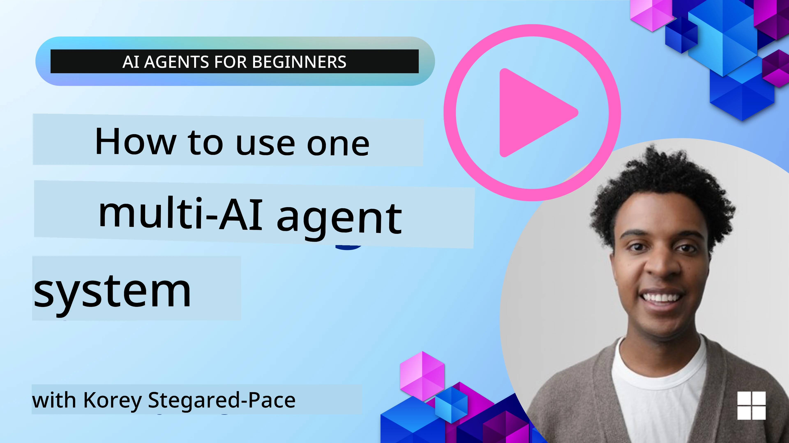
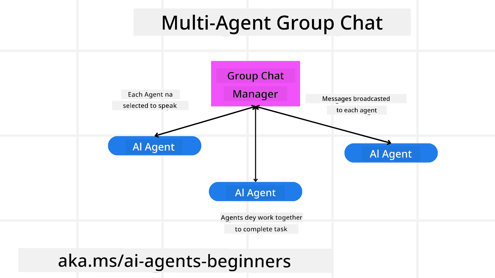
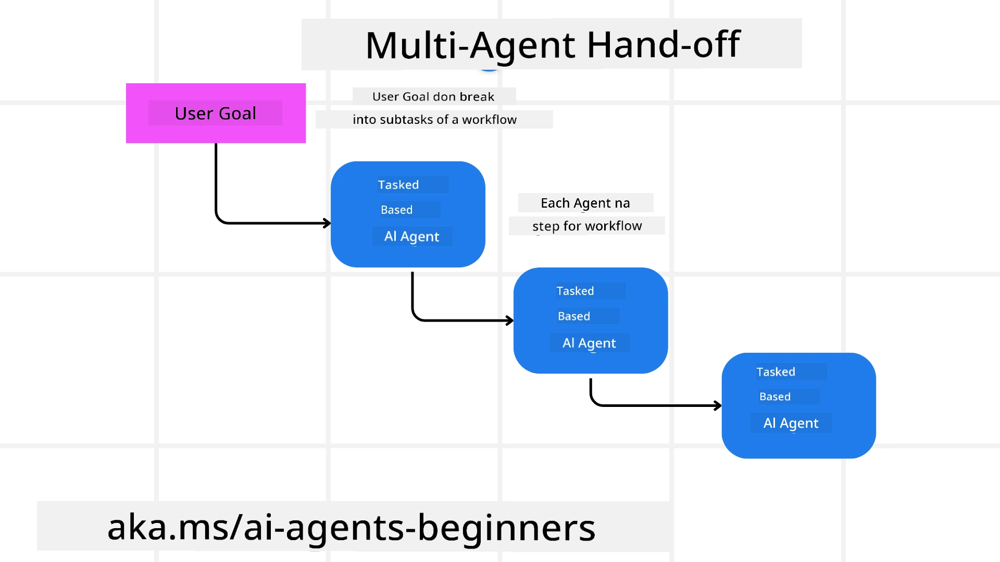

<!--
CO_OP_TRANSLATOR_METADATA:
{
  "original_hash": "1a008c204051cba8d0e253b75f261c41",
  "translation_date": "2025-11-11T11:57:23+00:00",
  "source_file": "08-multi-agent/README.md",
  "language_code": "pcm"
}
-->

> _(Click di image wey dey up to watch di video for dis lesson)_

# Multi-agent design patterns

Once you start dey work for project wey involve plenty agents, you go need think about di multi-agent design pattern. But e fit no clear immediately when you go switch to multi-agents and wetin be di benefits.

## Introduction

For dis lesson, we go try answer dis questions:

- Wetin be di kind scenarios wey multi-agents fit work well for?
- Wetin be di benefits of using multi-agents instead of just one agent wey dey do plenty tasks?
- Wetin be di building blocks to take implement di multi-agent design pattern?
- How we fit see how di multiple agents dey interact with each other?

## Learning Goals

After dis lesson, you suppose fit:

- Know di kind scenarios wey multi-agents fit work well for.
- Understand di benefits of using multi-agents instead of one agent.
- Sabi di building blocks to take implement di multi-agent design pattern.

Wetin be di bigger picture?

*Multi agents na design pattern wey allow plenty agents to work together to achieve one common goal.*

Dis pattern dey popular for different areas like robotics, autonomous systems, and distributed computing.

## Scenarios Where Multi-Agents Are Applicable

So, wetin be di kind scenarios wey go make sense to use multi-agents? Di answer be say plenty scenarios dey where using multiple agents go make sense, especially for di following cases:

- **Big work wey plenty**: Big work fit divide into smaller tasks wey agents go handle, so di work go dey faster. Example na big data processing task.
- **Tasks wey dey complex**: Tasks wey dey complex fit break into smaller parts wey different agents go handle, each one go specialize for di part wey e sabi well. Example na autonomous vehicles wey different agents dey handle navigation, obstacle detection, and communication with other vehicles.
- **Different expertise**: Different agents fit get different expertise, so dem go fit handle different parts of di task better pass one agent. Example na healthcare where agents fit dey manage diagnostics, treatment plans, and patient monitoring.

## Advantages of Using Multi-Agents Over a Singular Agent

One agent system fit work well for simple tasks, but for tasks wey dey complex, using plenty agents get plenty benefits:

- **Specialization**: Each agent fit specialize for one task. If one agent dey do everything, e fit confuse when di task dey complex. E fit even do task wey e no sabi well.
- **Scalability**: E dey easier to add more agents to di system instead of overloading one agent.
- **Fault Tolerance**: If one agent fail, di others go still dey work, so di system go still dey okay.

Make we use example. If we wan book trip for one person, one agent system go need handle everything like finding flights, booking hotels, and rental cars. To do dis, di agent go need tools for all di tasks, and e go make di system complex and hard to maintain. But if na multi-agent system, different agents go dey specialize for flights, hotels, and rental cars. Dis go make di system easier to maintain and scale.

Compare am to one small travel shop wey one person dey run versus franchise travel bureau wey get different people dey handle different parts of di trip booking process.

## Building Blocks of Implementing the Multi-Agent Design Pattern

Before you fit implement di multi-agent design pattern, you need understand di building blocks wey dey inside.

Make we use di example of booking trip for one person. Di building blocks go include:

- **Agent Communication**: Di agents wey dey find flights, book hotels, and rental cars go need dey communicate and share info about di user preferences and constraints. You go need decide di protocols and methods for dis communication. For example, di agent wey dey find flights go need share di travel dates with di hotel booking agent to make sure di hotel dey available for di same dates.
- **Coordination Mechanisms**: Di agents go need dey coordinate their actions to make sure di user preferences and constraints dey met. For example, di hotel booking agent go need coordinate with di rental car agent to make sure di hotel dey close to di airport if na wetin di user want.
- **Agent Architecture**: Di agents go need internal structure to make decisions and learn from di user interactions. For example, di flight agent fit use machine learning to recommend flights based on di user past preferences.
- **Visibility into Multi-Agent Interactions**: You go need tools to track how di agents dey interact. Dis fit include logging, monitoring tools, visualization tools, and performance metrics.
- **Multi-Agent Patterns**: Different patterns dey for multi-agent systems like centralized, decentralized, and hybrid architectures. You go need choose di one wey fit your use case.
- **Human in di loop**: Most times, human go dey involved, and di agents go need know when to ask for human intervention. For example, di user fit ask for specific hotel or flight wey di agents no recommend.

## Visibility into Multi-Agent Interactions

E dey important to get visibility into how di agents dey interact. Dis visibility go help for debugging, optimizing, and making sure di system dey effective. You go need tools to track agent activities and interactions. Example na dashboard wey go show di status of each agent, di user preferences, and di interactions between agents.

Make we look di aspects in detail:

- **Logging and Monitoring Tools**: You go need log di actions wey each agent dey take. Di log fit include di agent wey take di action, di action wey e take, di time, and di outcome.
- **Visualization Tools**: Tools wey go help you see di interactions between agents in clear way. Example na graph wey go show how info dey flow between agents.
- **Performance Metrics**: Metrics wey go help you track how effective di system dey. Example na time wey e take complete task, number of tasks wey agents complete, and di accuracy of di recommendations.

## Multi-Agent Patterns

Make we look some patterns wey you fit use to create multi-agent apps. Here be some patterns:

### Group chat

Dis pattern dey useful for group chat apps where agents fit dey communicate. Use cases na team collaboration, customer support, and social networking.

For dis pattern, each agent dey represent one user, and dem dey exchange messages using messaging protocol. E fit dey centralized or decentralized.

### Hand-off

Dis pattern dey useful for apps where agents fit dey hand over tasks to each other. Use cases na customer support, task management, and workflow automation.

For dis pattern, each agent dey represent one task or step for workflow, and dem dey hand over tasks based on rules.

### Collaborative filtering

Dis pattern dey useful for apps where agents fit dey work together to recommend things to users. Each agent fit get different expertise.

Example na stock market recommendation:

- **Industry expert**: One agent sabi one industry well.
- **Technical analysis**: Another agent sabi technical analysis.
- **Fundamental analysis**: Another agent sabi fundamental analysis. Together, dem fit give better recommendation.

## Scenario: Refund process

Imagine one customer dey try get refund for product. Plenty agents fit dey involved. Make we divide dem into agents wey dey specific for refund process and general agents wey fit work for other processes.

**Agents specific for refund process**:

- **Customer agent**: Di agent wey dey represent di customer and dey start di refund process.
- **Seller agent**: Di agent wey dey represent di seller and dey process di refund.
- **Payment agent**: Di agent wey dey handle di payment refund.
- **Resolution agent**: Di agent wey dey solve any issue wey fit happen during di refund process.
- **Compliance agent**: Di agent wey dey make sure di refund process follow regulations.

**General agents**:

- **Shipping agent**: Di agent wey dey handle shipping, fit work for refund and other shipping tasks.
- **Feedback agent**: Di agent wey dey collect feedback from customer.
- **Escalation agent**: Di agent wey dey handle issues wey need higher support.
- **Notification agent**: Di agent wey dey send notifications to customer.
- **Analytics agent**: Di agent wey dey analyze data for refund process.
- **Audit agent**: Di agent wey dey check di refund process to make sure e dey correct.
- **Reporting agent**: Di agent wey dey generate reports for refund process.
- **Knowledge agent**: Di agent wey dey keep knowledge base for refund and other processes.
- **Security agent**: Di agent wey dey ensure di refund process dey secure.
- **Quality agent**: Di agent wey dey make sure di refund process dey good.

Plenty agents dey wey fit work for refund process and other parts of your business. Dis go give you idea on how to choose di agents for your multi-agent system.

## Assignment
Design multi-agent system wey go help for customer support process. Identify di agents wey dey involved for di process, wetin dem go do, and how dem go dey work together. Make you think about di agents wey dey specific to di customer support process and di general agents wey fit dey useful for other parts of your business.

> Make you reason well before you check di solution wey dey below, you fit need more agents pass wetin you dey think.

> TIP: Think about di different stages for di customer support process and also di agents wey go dey needed for any system.

## Solution

[Solution](./solution/solution.md)

## Knowledge checks

Question: When you go fit consider to use multi-agents?

- [ ] A1: When work no too plenty and di task dey simple.
- [ ] A2: When work plenty well well.
- [ ] A3: When di task dey simple.

[Solution quiz](./solution/solution-quiz.md)

## Summary

For dis lesson, we don look di multi-agent design pattern, including di situations wey multi-agents go fit work well, di better thing wey dey for using multi-agents instead of just one agent, di main things wey dey needed to implement di multi-agent design pattern, and how you go fit see how di multiple agents dey work together.

### You get more questions about di Multi-Agent Design Pattern?

Join di [Azure AI Foundry Discord](https://aka.ms/ai-agents/discord) to meet other learners, attend office hours, and get answers to your AI Agents questions.

## Additional resources

- <a href="https://microsoft.github.io/autogen/stable/user-guide/core-user-guide/design-patterns/intro.html" target="_blank">AutoGen design patterns</a>
- <a href="https://www.analyticsvidhya.com/blog/2024/10/agentic-design-patterns/" target="_blank">Agentic design patterns</a>

## Previous Lesson

[Planning Design](../07-planning-design/README.md)

## Next Lesson

[Metacognition in AI Agents](../09-metacognition/README.md)

---

<!-- CO-OP TRANSLATOR DISCLAIMER START -->
**Disclaimer**:  
Dis dokyument don use AI transle-shun service [Co-op Translator](https://github.com/Azure/co-op-translator) do di transle-shun. Even as we dey try make am correct, abeg make you sabi say transle-shun wey machine do fit get mistake or no dey accurate well. Di original dokyument for im native language na di one wey you go take as di correct source. For important mata, e good make you use professional human transle-shun. We no go fit take blame for any misunderstanding or wrong interpretation wey fit happen because you use dis transle-shun.
<!-- CO-OP TRANSLATOR DISCLAIMER END -->