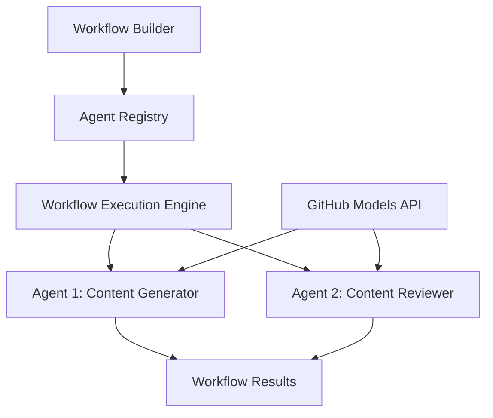

<!--
CO_OP_TRANSLATOR_METADATA:
{
  "original_hash": "034158688d0a45aae06dcbb21b0da5ae",
  "translation_date": "2025-11-11T13:03:46+00:00",
  "source_file": "08-multi-agent/code_samples/workflows-agent-framework/dotNET/01.dotnet-agent-framework-workflow-ghmodel-basic.md",
  "language_code": "pcm"
}
-->
# 🔄 Basic Agent Workflows wit GitHub Models (.NET)

## 📋 Workflow Orchestration Tutorial

Dis notebook dey show how pesin fit build beta **agent workflows** wit di Microsoft Agent Framework for .NET and GitHub Models. You go learn how to create multi-step business processes wey AI agents go dey work together to finish complex tasks through structured orchestration patterns.

## 🎯 Wetin You Go Learn

### 🏗️ **Workflow Architecture Basics**
- **Workflow Builder**: Design and arrange complex multi-step AI processes
- **Agent Coordination**: Arrange many specialized agents inside workflows
- **GitHub Models Integration**: Use GitHub AI model inference service inside workflows
- **Visual Workflow Design**: Create and see workflow structures for better understanding

### 🔄 **Process Orchestration Patterns**
- **Sequential Processing**: Arrange many agent tasks one after di other in correct order
- **State Management**: Keep context and data flow across workflow stages
- **Error Handling**: Put strong error recovery and workflow resilience
- **Performance Optimization**: Design workflows wey go work well for big enterprise operations

### 🏢 **Enterprise Workflow Applications**
- **Business Process Automation**: Automate complex organizational workflows
- **Content Production Pipeline**: Editorial workflows wit review and approval stages
- **Customer Service Automation**: Multi-step customer inquiry resolution
- **Data Processing Workflows**: ETL workflows wit AI-powered transformation

## ⚙️ Wetin You Need & Setup

### 📦 **NuGet Packages We You Go Need**

Dis workflow demo dey use some important .NET packages:

```xml
<!-- Core AI Framework -->
<PackageReference Include="Microsoft.Extensions.AI" Version="9.9.0" />

<!-- Agent Framework (Local Development) -->
<!-- Microsoft.Agents.AI.dll - Core agent abstractions -->
<!-- Microsoft.Agents.AI.OpenAI.dll - OpenAI/GitHub Models integration -->

<!-- Configuration and Environment -->
<PackageReference Include="DotNetEnv" Version="3.1.1" />
```

### 🔑 **GitHub Models Configuration**

**Environment Setup (.env file):**
```env
GITHUB_TOKEN=your_github_personal_access_token
GITHUB_ENDPOINT=https://models.inference.ai.azure.com
GITHUB_MODEL_ID=gpt-4o-mini
```

**GitHub Models Access:**
1. Register for GitHub Models (e still dey preview)
2. Generate personal access token wey get model access permissions
3. Configure environment variables as e dey show above

### 🏗️ **Workflow Architecture Overview**



**Main Components:**
- **WorkflowBuilder**: Main engine wey dey arrange workflows
- **AIAgent**: Individual specialized agents wey get specific skills
- **GitHub Models Client**: AI model inference service integration
- **Execution Context**: E dey manage state and data flow between workflow stages

## 🎨 **Enterprise Workflow Design Patterns**

### 📝 **Content Production Workflow**
```
User Request → Content Generation → Quality Review → Final Output
```

### 🔍 **Document Processing Pipeline**
```
Document Input → Analysis → Extraction → Validation → Structured Output
```

### 💼 **Business Intelligence Workflow**
```
Data Collection → Processing → Analysis → Report Generation → Distribution
```

### 🤝 **Customer Service Automation**
```
Customer Inquiry → Classification → Processing → Response Generation → Follow-up
```

## 🏢 **Enterprise Benefits**

### 🎯 **Reliability & Scalability**
- **Deterministic Execution**: Consistent, repeatable workflow results
- **Error Recovery**: E dey handle failures well for any workflow stage
- **Performance Monitoring**: Track execution metrics and find ways to improve
- **Resource Management**: Use AI model resources well and no waste am

### 🔒 **Security & Compliance**
- **Secure Authentication**: GitHub token-based authentication for API access
- **Audit Trails**: Full logging of workflow execution and decision points
- **Access Control**: Detailed permissions for workflow execution and monitoring
- **Data Privacy**: Handle sensitive information well and secure am inside workflows

### 📊 **Observability & Management**
- **Visual Workflow Design**: Clear representation of process flows and dependencies
- **Execution Monitoring**: Real-time tracking of workflow progress and performance
- **Error Reporting**: Detailed error analysis and debugging tools
- **Performance Analytics**: Metrics for improvement and capacity planning

Make we start to build your first enterprise-ready AI workflow! 🚀

## 💻 How to Run di Code

Di full implementation dey inside `01.dotnet-agent-framework-workflow-ghmodel-basic.cs`. Dis file dey show:

1. **Environment Configuration** - Load GitHub Models credentials from `.env` file
2. **OpenAI Client Setup** - Configure di client to use GitHub Models endpoint
3. **Agent Creation** - Define specialized agents (Front Desk and Concierge)
4. **Workflow Builder** - Create multi-agent workflow wit sequential processing
5. **Workflow Execution** - Run di workflow wit streaming results

### 🚀 How to Run di Example

```bash
# Make the script executable (Unix/Linux/macOS)
chmod +x 01.dotnet-agent-framework-workflow-ghmodel-basic.cs

# Run the workflow
./01.dotnet-agent-framework-workflow-ghmodel-basic.cs
```

Or for Windows:
```powershell
dotnet run 01.dotnet-agent-framework-workflow-ghmodel-basic.cs
```

### 📝 Wetin You Go See for Output

Di workflow go:
1. Accept your travel destination request ("I wan go Paris")
2. Di Front Desk agent go give initial recommendation
3. Di Concierge agent go check and improve di recommendation
4. Final output go show di full conversation stream

### 🔧 How to Change Am

You fit change di workflow by:
- Change agent instructions to make dem behave different
- Add more agents to create complex multi-step workflows
- Change di user message to test different scenarios
- Adjust di workflow edges to create different execution patterns

---

<!-- CO-OP TRANSLATOR DISCLAIMER START -->
**Disclaimer**:  
Dis dokyument don use AI transleto service [Co-op Translator](https://github.com/Azure/co-op-translator) do di translation. Even as we dey try make am accurate, abeg sabi say machine translation fit get mistake or no dey correct well. Di original dokyument wey dey for im native language na di main source wey you go fit trust. For important mata, e good make professional human transleto check am. We no go fit take blame for any misunderstanding or wrong interpretation wey fit happen because you use dis translation.
<!-- CO-OP TRANSLATOR DISCLAIMER END -->