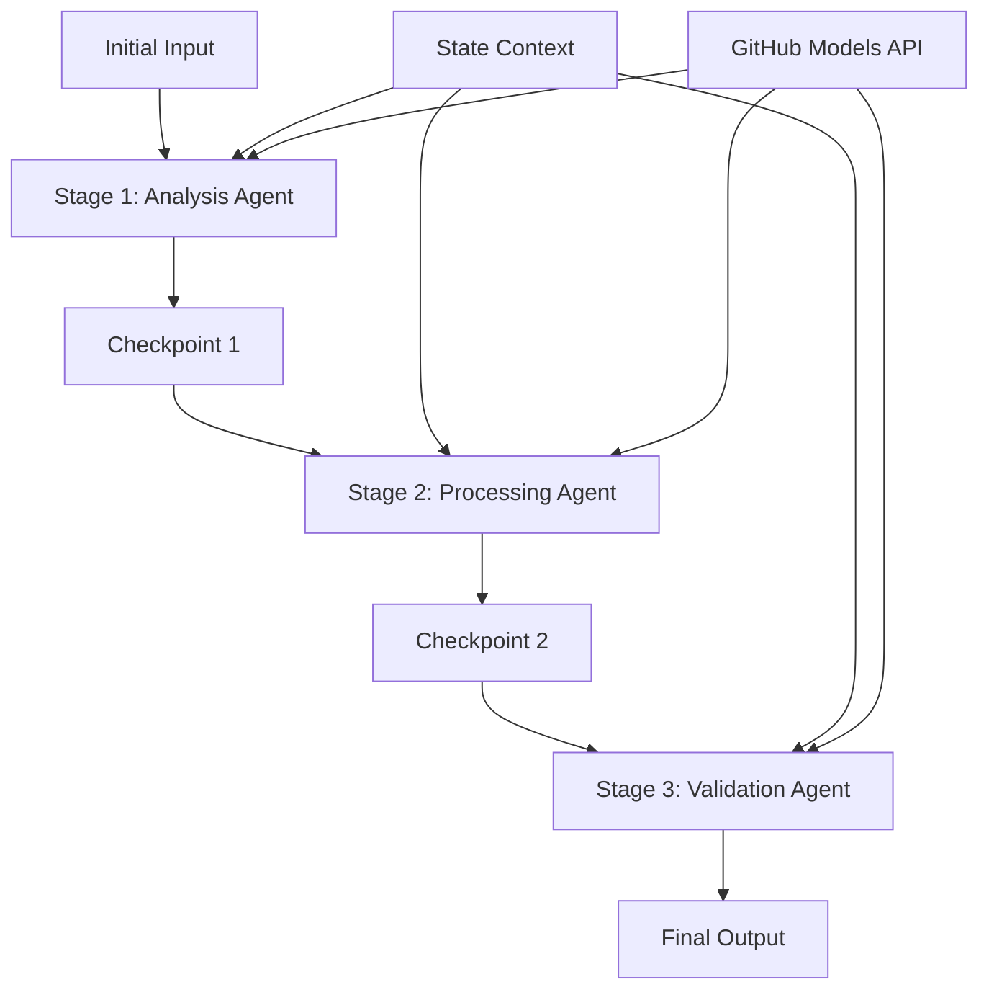

<!--
CO_OP_TRANSLATOR_METADATA:
{
  "original_hash": "1be9c8dcbd79a02d33d2c138684c1394",
  "translation_date": "2025-11-11T14:10:43+00:00",
  "source_file": "08-multi-agent/code_samples/workflows-agent-framework/dotNET/02.dotnet-agent-framework-workflow-ghmodel-sequential.md",
  "language_code": "pcm"
}
-->
# ⏩ Sequential Agent Workflows wit GitHub Models (.NET)

## 📋 Advanced Sequential Processing Tutorial

Dis notebook dey show **sequential workflow patterns** wey dey use Microsoft Agent Framework for .NET and GitHub Models. You go learn how to build beta, step-by-step processing pipelines wey agents go dey run one after the other, and each stage go dey use wetin the previous stage don do.

## 🎯 Wetin You Go Learn

### 🔄 **Sequential Processing Architecture**
- **Linear Workflow Design**: Create step-by-step processing pipelines wey get clear connection
- **State Management**: Keep context and data flow across all the workflow stages
- **GitHub Models Integration**: Use GitHub AI models for multi-stage .NET workflows
- **Enterprise Pipeline Patterns**: Build production-ready sequential processing systems

### 🏗️ **Advanced Sequential Patterns**
- **Stage-Gate Processing**: Put validation checkpoints between workflow stages
- **Context Preservation**: Keep state and all the knowledge wey don gather across all stages
- **Error Propagation**: Manage errors well well for sequential processing chains
- **Performance Optimization**: Make sure sequential execution dey fast and no dey waste resources

### 🏢 **Enterprise Sequential Applications**
- **Document Processing Pipeline**: Multi-stage document analysis, transformation, and validation
- **Quality Assurance Workflows**: Sequential review, validation, and approval processes
- **Content Production Pipeline**: Research → Writing → Editing → Review → Publishing
- **Business Process Automation**: Multi-step business workflows wey get clear stage connection

## ⚙️ Wetin You Need & Setup

### 📦 **NuGet Packages We You Go Need**

Important packages for .NET sequential workflows:

```xml
<!-- Core AI Framework -->
<PackageReference Include="Microsoft.Extensions.AI" Version="9.9.0" />

<!-- Client Model Abstractions -->
<PackageReference Include="System.ClientModel" Version="1.6.1.0" />

<!-- Azure Identity and Async LINQ Support -->
<PackageReference Include="Azure.Identity" Version="1.15.0" />
<PackageReference Include="System.Linq.Async" Version="6.0.3" />

<!-- Local Agent Framework References -->
<!-- Microsoft.Agents.AI.dll - Core agent abstractions -->
<!-- Microsoft.Agents.AI.OpenAI.dll - GitHub Models integration -->
```

### 🔑 **GitHub Models Configuration**

**Environment Setup (.env file):**
```env
GITHUB_TOKEN=your_github_personal_access_token
GITHUB_ENDPOINT=https://models.inference.ai.azure.com
GITHUB_MODEL_ID=gpt-4o-mini
```

**Configuration Management:**
```csharp
// Load environment variables securely
Env.Load("../../../.env");
var githubToken = Environment.GetEnvironmentVariable("GITHUB_TOKEN");
var githubEndpoint = Environment.GetEnvironmentVariable("GITHUB_ENDPOINT");
var modelId = Environment.GetEnvironmentVariable("GITHUB_MODEL_ID");
```

### 🏗️ **Sequential Workflow Architecture**



**Key Components:**
- **Sequential Agents**: Special agents for each processing stage
- **State Context**: Keep all the data and decisions wey don gather across stages
- **Checkpoints**: Validation points between stages to make sure say everything dey okay
- **GitHub Models Client**: Steady AI model access across all workflow stages

## 🎨 **Sequential Workflow Design Patterns**

### 📝 **Document Processing Pipeline**
```
Raw Document → Content Extraction → Analysis → Validation → Structured Output
```

### 🎯 **Content Creation Workflow**
```
Brief/Requirements → Research → Content Creation → Review → Final Polish
```

### 🔍 **Quality Assurance Pipeline**
```
Initial Review → Technical Validation → Compliance Check → Final Approval
```

### 💼 **Business Intelligence Workflow**
```
Data Collection → Processing → Analysis → Report Generation → Distribution
```

## 🏢 **Enterprise Sequential Benefits**

### 🎯 **Reliability & Quality**
- **Deterministic Processing**: Steady, repeatable results through structured stages
- **Quality Gates**: Validation checkpoints dey make sure say quality dey for each stage
- **Error Isolation**: If one stage get problem, e no go affect the next stage
- **Audit Trails**: Full tracking of all decisions and changes for each stage

### 📈 **Scalability & Performance**
- **Modular Design**: You fit optimize each stage one by one
- **Resource Management**: Use AI model resources well across stages
- **State Optimization**: Transfer small small state between stages to make performance better
- **Parallel Stage Groups**: Run many sequential workflows at the same time

### 🔒 **Security & Compliance**
- **Stage-Level Security**: Different security rules for different processing stages
- **Data Validation**: Make sure data dey correct and follow rules for each checkpoint
- **Access Control**: Give permission for different workflow stages
- **Regulatory Compliance**: Follow all the rules wey government put through structured processing

### 📊 **Monitoring & Analytics**
- **Stage-Level Metrics**: Check performance for each workflow stage
- **Bottleneck Identification**: Find and fix slow stages
- **Quality Metrics**: Track quality and success for each stage
- **Process Optimization**: Improve workflow based on stage-level analytics

Make we build strong sequential AI processing pipelines! 🚀

## 💻 How to Run the Code

The full implementation dey for `02.dotnet-agent-framework-workflow-ghmodel-sequential.cs`. Dis file dey show **three-stage furniture analysis workflow**:

1. **Stage 1 - Sales Agent**: E go check furniture images and give buying suggestions
2. **Stage 2 - Price Agent**: E go give detailed pricing breakdowns and budget options
3. **Stage 3 - Quote Agent**: E go create professional quote document for Markdown format

### 🏗️ **Workflow Architecture**

```
Image Input → Sales Analysis → Price Estimation → Quote Generation → Final Output
```

Each agent:
- E go use wetin the previous stage don do as context
- E go add e own analysis based on e expertise
- E go keep workflow continuity through state management

### 🚀 How to Run the Example

**Wetin You Need:**
- Put furniture image for `../imgs/home.png` (or change the `imgPath` variable)
- Set your `.env` file with GitHub Models credentials

```bash
# Make the script executable (Unix/Linux/macOS)
chmod +x 02.dotnet-agent-framework-workflow-ghmodel-sequential.cs

# Run the sequential workflow
./02.dotnet-agent-framework-workflow-ghmodel-sequential.cs
```

Or for Windows:
```powershell
dotnet run 02.dotnet-agent-framework-workflow-ghmodel-sequential.cs
```

### 📝 Wetin You Go See for Output

The workflow go:
1. **Sales Agent**: Identify furniture items from the image and give recommendations
2. **Price Agent**: Add detailed pricing analysis with budget tiers and shopping suggestions
3. **Quote Agent**: Create formatted quote document wey go join all the information together

The final output go be complete, professional furniture quote based on image analysis.

### 🔧 How You Fit Customize

**Change Agent Behavior:**
```csharp
// Adjust agent instructions to change their focus
const string SalesAgentInstructions = "Your custom instructions...";
```

**Change Sequential Flow:**
```csharp
// Add or reorder workflow stages
var workflow = new WorkflowBuilder(salesagent)
    .AddEdge(salesagent, priceagent)
    .AddEdge(priceagent, quoteagent)
    .AddEdge(quoteagent, newAgent)  // Add another stage
    .Build();
```

**Use Different Input:**
```csharp
// Process text instead of images
ChatMessage userMessage = new ChatMessage(ChatRole.User, [
    new TextContent("Analyze pricing for a modern living room set")
]);
```

### 🎯 Real-World Applications

Dis sequential pattern dey good for:
- **E-commerce**: Product analysis → Pricing → Quote generation
- **Real Estate**: Property analysis → Valuation → Listing creation
- **Insurance**: Claim analysis → Assessment → Quote generation
- **Content Creation**: Research → Writing → Editing → Publishing

### 🔍 How State Flow Work

Each agent for the sequence go get:
- **Original Input**: The first user message (image + text)
- **Previous Agent Outputs**: All the response wey the agents don give before
- **Accumulated Context**: Full state wey don dey keep since the workflow start

Dis one dey make multi-stage processing beta because each agent go dey use all the context wey don gather from the previous stages.

---

<!-- CO-OP TRANSLATOR DISCLAIMER START -->
**Disclaimer**:  
Dis dokyument don use AI translation service [Co-op Translator](https://github.com/Azure/co-op-translator) do di translation. Even as we dey try make am accurate, abeg make you sabi say machine translation fit get mistake or no dey correct well. Di original dokyument wey dey for im native language na di main source wey you go fit trust. For important information, e better make professional human translation dey use. We no go fit take blame for any misunderstanding or wrong interpretation wey fit happen because you use dis translation.
<!-- CO-OP TRANSLATOR DISCLAIMER END -->