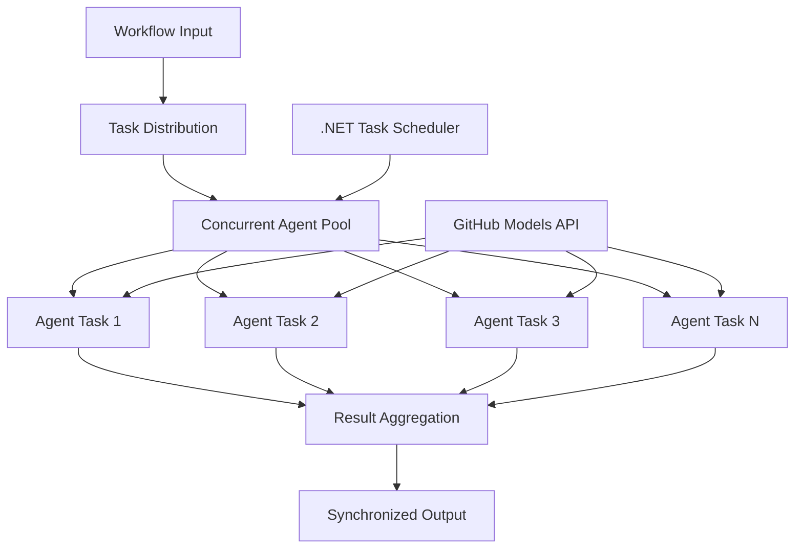

<!--
CO_OP_TRANSLATOR_METADATA:
{
  "original_hash": "b9c6e32c9b5f2fed20b6916984440d88",
  "translation_date": "2025-11-11T13:38:19+00:00",
  "source_file": "08-multi-agent/code_samples/workflows-agent-framework/dotNET/03.dotnet-agent-framework-workflow-ghmodel-concurrent.md",
  "language_code": "pcm"
}
-->
# ⚡ Concurrent Agent Workflows wit GitHub Models (.NET)

## 📋 High-Performance Parallel Processing Tutorial

Dis notebook dey show how **concurrent workflow patterns** dey work wit Microsoft Agent Framework for .NET and GitHub Models. You go sabi how to build workflows wey fit process plenty things at once, dey use multiple AI agents together, and still dey keep everything coordinated and consistent.

## 🎯 Wetin You Go Learn

### 🚀 **Concurrent Processing Basics**
- **Parallel Agent Execution**: Run plenty AI agents at the same time to get better performance
- **Async/Await Patterns**: Use .NET async programming model to make concurrency work well
- **GitHub Models Integration**: Manage plenty calls to GitHub AI model inference service at once
- **Resource Management**: Manage AI model resources well for concurrent operations

### 🏗️ **Advanced Concurrency Architecture**
- **Task-Based Parallelism**: Use .NET Task Parallel Library to make concurrent execution better
- **Synchronization Patterns**: Make sure concurrent agents no dey clash or cause wahala
- **Load Balancing**: Share work well across all available processing capacity
- **Fault Tolerance**: If one agent fail, e no go stop the whole workflow

### 🏢 **Enterprise Concurrent Applications**
- **High-Volume Document Processing**: Process plenty documents at the same time
- **Real-Time Content Analysis**: Analyze data wey dey come in real-time
- **Batch Processing Optimization**: Process large-scale data faster
- **Multi-Modal Analysis**: Process different types and formats of content together

## ⚙️ Wetin You Need & Setup

### 📦 **NuGet Packages We You Need**

Dis packages dey important for high-performance concurrent workflows:

```xml
<!-- Core AI Framework with Async Support -->
<PackageReference Include="Microsoft.Extensions.AI" Version="9.9.0" />

<!-- Client Model Abstractions for API Communication -->
<PackageReference Include="System.ClientModel" Version="1.6.1.0" />

<!-- Azure Identity and Async LINQ for Advanced Operations -->
<PackageReference Include="Azure.Identity" Version="1.15.0" />
<PackageReference Include="System.Linq.Async" Version="6.0.3" />

<!-- Local Agent Framework References -->
<!-- Microsoft.Agents.AI.dll - Core agent abstractions with async support -->
<!-- Microsoft.Agents.AI.OpenAI.dll - GitHub Models integration with concurrency -->
```

### 🔑 **GitHub Models Configuration**

**Environment Setup (.env file):**
```env
GITHUB_TOKEN=your_github_personal_access_token
GITHUB_ENDPOINT=https://models.inference.ai.azure.com
GITHUB_MODEL_ID=gpt-4o-mini
```

**Concurrent Processing Considerations:**
```csharp
// Configure for concurrent operations
var clientOptions = new OpenAIClientOptions()
{
    Endpoint = new Uri(githubEndpoint),
    // Configure connection pooling for concurrent requests
    NetworkTimeout = TimeSpan.FromMinutes(5)
};
```

### 🏗️ **Concurrent Workflow Architecture**



**Key Components:**
- **Task Parallel Library**: .NET get built-in support for concurrent operations
- **Agent Pool**: Plenty agent instances to process things at once
- **Result Aggregation**: Combine results from all agents wey dey work together
- **Synchronization Points**: Make sure data dey consistent across all operations

## 🎨 **Concurrent Workflow Design Patterns**

### 🔍 **Parallel Research & Analysis**
```
Research Topic → Concurrent Research Agents → Result Synthesis → Final Report
```

### 📊 **Multi-Source Data Processing**
```
Data Sources → Parallel Processing Agents → Data Integration → Unified Output
```

### 🎭 **Content Generation Pipeline**
```
Content Requirements → Concurrent Content Generators → Quality Review → Final Content
```

### 🔄 **Fan-Out/Fan-In Processing**
```
Single Input → Multiple Concurrent Processors → Result Aggregation → Single Output
```

## 🏢 **Enterprise Performance Benefits**

### ⚡ **Throughput & Scalability**
- **Linear Performance Scaling**: Add more agents to process faster
- **Resource Utilization**: Use AI model capacity well
- **Reduced Processing Time**: Save time by running things together
- **Elastic Scaling**: Adjust agent count based on workload

### 🛡️ **Reliability & Resilience**
- **Fault Isolation**: If one agent fail, e no go affect others
- **Graceful Degradation**: System go still dey work even if agent capacity reduce
- **Error Recovery**: Retry failed operations automatically
- **Load Distribution**: Share work well across all agents

### 📊 **Performance Monitoring**
- **Concurrent Execution Metrics**: Check how all operations dey perform
- **Resource Usage Analytics**: Monitor CPU, memory, and network usage
- **Throughput Analysis**: Measure how concurrency dey improve efficiency
- **Bottleneck Detection**: Find and fix performance issues

### 🔧 **Development & Operations**
- **Async Programming Model**: Use .NET async/await patterns wey don mature
- **Task Coordination**: Manage tasks well wit built-in tools
- **Exception Handling**: Handle errors well for concurrent operations
- **Debugging Support**: Use Visual Studio tools to debug workflows

Make we build high-performance concurrent AI workflows wit .NET! 🚀

## 💻 How to Run the Code

The full implementation dey inside `03.dotnet-agent-framework-workflow-ghmodel-concurrent.cs`. Dis file dey show **Fan-Out/Fan-In concurrent workflow** for travel planning:

### 🏗️ **Workflow Architecture**

```
User Request → ConcurrentStartExecutor → [Researcher Agent || Planner Agent] → ConcurrentAggregationExecutor → Final Output
```

**Key Components:**

1. **ConcurrentStartExecutor**: Send user request to all agents at once
2. **Researcher Agent**: Analyze destinations and attractions together
3. **Planner Agent**: Create detailed travel plans together
4. **ConcurrentAggregationExecutor**: Collect and combine results from all agents

### 🎯 **Fan-Out/Fan-In Pattern**

Dis workflow dey show classic **Fan-Out/Fan-In** pattern:
- **Fan-Out**: One input message go to plenty agents at once
- **Concurrent Processing**: Plenty agents dey work on the same task together
- **Fan-In**: Results from all agents dey combine into one output

### 🚀 How to Run Example

```bash
# Make the script executable (Unix/Linux/macOS)
chmod +x 03.dotnet-agent-framework-workflow-ghmodel-concurrent.cs

# Run the concurrent workflow
./03.dotnet-agent-framework-workflow-ghmodel-concurrent.cs
```

Or for Windows:
```powershell
dotnet run 03.dotnet-agent-framework-workflow-ghmodel-concurrent.cs
```

### 📝 Wetin You Go See

The workflow go:
1. **Broadcast Request**: Send "Plan a trip to Seattle in December" to all agents
2. **Concurrent Processing**: All agents go dey work together:
   - Researcher go find attractions and details
   - Planner go create itinerary and logistics
3. **Aggregation**: Combine all responses into one output
4. **Display Results**: Show the full travel plan wit all information

### 🔧 How to Customize

**Add More Concurrent Agents:**
```csharp
// Create additional specialized agents
AIAgent budgetAgent = openAIClient.GetChatClient(github_model_id).CreateAIAgent(
    name: "Budget-Agent", instructions: "Calculate travel costs...");

// Add to fan-out
var workflow = new WorkflowBuilder(startExecutor)
    .AddFanOutEdge(startExecutor, targets: [researcherAgent, plannerAgent, budgetAgent])
    .AddFanInEdge(aggregationExecutor, sources: [researcherAgent, plannerAgent, budgetAgent])
    .WithOutputFrom(aggregationExecutor)
    .Build();

// Update aggregation count
if (this._messages.Count == 3) { ... }
```

**Change Agent Instructions:**
```csharp
const string ResearcherAgentInstructions = "Your custom instructions for research...";
const string PlanAgentInstructions = "Your custom instructions for planning...";
```

**Change the Task:**
```csharp
StreamingRun run = await InProcessExecution.StreamAsync(
    workflow, 
    "Plan a European vacation for 2 weeks in summer"
);
```

### 🎯 Real-World Use Cases

Dis concurrent pattern dey good for:
- **Content Creation**: Plenty writers dey create different sections at once
- **Code Review**: Plenty reviewers dey check code from different angles
- **Market Research**: Analyze different market segments together
- **Document Processing**: Extract, analyze, and validate documents at once
- **Multi-Perspective Analysis**: Get different views on the same input

### 🔍 How Custom Executors Work

**ConcurrentStartExecutor:**
- E dey use `IMessageHandler<string>` to accept string input
- E dey send messages to all agents
- E dey use `TurnToken` to start concurrent processing

**ConcurrentAggregationExecutor:**
- E dey use `IMessageHandler<ChatMessage>` to collect agent responses
- E dey collect messages in a way wey no go cause wahala
- E dey combine all responses when e don get everything
- E dey give final output wit `context.YieldOutputAsync()`

### ⚡ Performance Benefits

**Concurrent vs Sequential:**
- Sequential: Agent1 (30s) → Agent2 (30s) = **60 seconds total**
- Concurrent: Agent1 (30s) || Agent2 (30s) = **30 seconds total**

**Throughput improvement**: Fit dey up to N× faster for N agents (depending on workload and resources)

### 🛡️ Error Handling

Dis workflow dey handle agent failures well:
- If one agent fail, others go still dey work
- Aggregator fit use timeout logic
- E fit return partial results if e need

### 📊 Advanced Features

**Dynamic Agent Count:**
Change the aggregation logic to support different agent counts:

```csharp
private int _expectedAgentCount;
private readonly List<ChatMessage> _messages = [];

public async ValueTask HandleAsync(ChatMessage message, IWorkflowContext context)
{
    this._messages.Add(message);
    if (this._messages.Count == _expectedAgentCount)
    {
        // Process aggregation
    }
}
```

Dis concurrent workflow pattern dey very important for building high-performance, scalable AI agent systems!

---

<!-- CO-OP TRANSLATOR DISCLAIMER START -->
**Disclaimer**:  
Dis dokyument don use AI translet service [Co-op Translator](https://github.com/Azure/co-op-translator) do di translet. Even as we dey try make am correct, abeg sabi say machine translet fit get mistake or no dey accurate well. Di original dokyument wey dey for im native language na di one wey you go take as di correct source. For important informate, e good make professional human translet am. We no go fit take blame for any misunderstanding or wrong interpretation wey fit happen because you use dis translet.
<!-- CO-OP TRANSLATOR DISCLAIMER END -->