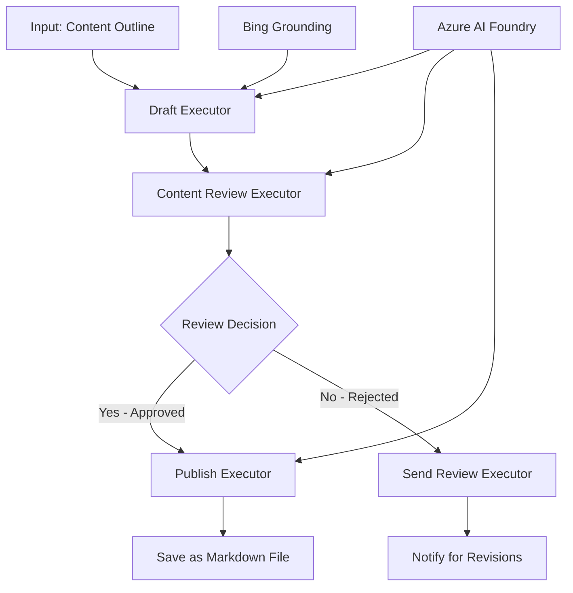

<!--
CO_OP_TRANSLATOR_METADATA:
{
  "original_hash": "8abd335151cee553293b637ee3d80d10",
  "translation_date": "2025-11-11T12:37:53+00:00",
  "source_file": "08-multi-agent/code_samples/workflows-agent-framework/dotNET/04.dotnet-agent-framework-workflow-aifoundry-condition.md",
  "language_code": "pcm"
}
-->
# 🔀 Conditional Agent Workflows wit Azure AI Foundry (.NET)

## 📋 Tutorial for Intelligent Decision-Based Workflow

Dis notebook dey show how **conditional workflow patterns** dey work wit Azure AI Foundry and di Microsoft Agent Framework for .NET. You go sabi how to build beta workflows wey dey use decision-making to route processing based on AI analysis, business rules, and conditions wey dey change for enterprise automation.

## 🎯 Wetin You Go Learn

### 🧠 **Intelligent Decision Architecture**
- **How to Use Conditional Logic**: Build decision trees wey get plenty branching points
- **AI-Powered Routing**: Use Azure AI Foundry models to make smart routing decisions
- **Dynamic Workflow Adaptation**: Change workflow behavior based on runtime analysis and conditions
- **Enterprise Rule Integration**: Put business logic and compliance requirements inside workflows

### 🔀 **Advanced Conditional Patterns**
- **Multi-Criteria Decision Making**: Check plenty factors to make routing decisions
- **Context-Aware Processing**: Make decisions based on workflow context and history wey don gather
- **Adaptive Workflow Modification**: Change processing paths based on wetin dey happen for real-time
- **Rule Engine Integration**: Put beta business rule engines inside workflows

### 🏢 **Enterprise Conditional Applications**
- **Document Classification & Routing**: Automatically classify and send documents to di correct workflows
- **Customer Service Triage**: Use smart routing to send customer inquiries to di correct teams
- **Compliance & Risk Processing**: Apply different validation and review processes based on risk assessment
- **Quality Assurance Workflows**: Send content go di correct review processes based on quality metrics

## ⚙️ Wetin You Need & Setup

### 📦 **NuGet Packages We You Need**

Advanced packages for conditional workflow processing:

```xml
<!-- Core AI Framework -->
<PackageReference Include="Microsoft.Extensions.AI" Version="9.9.0" />

<!-- Azure AI Agents with Persistent State -->
<PackageReference Include="Azure.AI.Agents.Persistent" Version="1.2.0-beta.5" />

<!-- Azure Identity and Utilities -->
<PackageReference Include="Azure.Identity" Version="1.15.0" />
<PackageReference Include="System.Linq.Async" Version="6.0.3" />
<PackageReference Include="DotNetEnv" Version="3.1.1" />

<!-- Local Workflow Framework References -->
<!-- Microsoft.Agents.Workflows.dll - Advanced workflow orchestration -->
<!-- Microsoft.Agents.AI.AzureAI.dll - Azure AI Foundry integration -->
<!-- Microsoft.Agents.AI.dll - Core agent abstractions -->
```

### 🔑 **Azure AI Foundry Configuration**

**Azure Resources We You Need:**
- Azure AI Foundry workspace wey get conditional processing models
- Azure subscription wey get di correct compute quotas and permissions
- AI models wey don deploy for decision making and content analysis
- (Optional) Bing Search API connection for grounding capabilities

**Environment Configuration (.env file):**
```env
# Azure AI Foundry Configuration
AZURE_AI_PROJECT_ENDPOINT=https://your-project.cognitiveservices.azure.com/
BING_CONNECTION_ID=your-bing-connection-id
```

**Authentication Setup:**
```csharp
// Azure CLI or Managed Identity authentication
using Azure.Identity;
var credential = new AzureCliCredential();

// Load environment configuration
DotNetEnv.Env.Load("../../../.env");
```

### 🏗️ **Conditional Workflow Architecture**



**Key Components:**
- **Draft Executor**: AI agent wey dey create initial content drafts from outlines
- **Content Review Executor**: AI agent wey dey check draft quality and compliance
- **Conditional Routing**: Decision logic wey dey route based on review results
- **Publish/Review Paths**: Different processing paths for approved vs rejected content
- **State Management**: E dey keep content and review context throughout workflow

## 🎨 **Conditional Workflow Design Patterns**

### 📋 **Content Production wit Quality Gates**
```
Outline → Draft Creation → Quality Review → {Approve: Publish | Reject: Revise}
```

### 🎯 **Risk-Based Document Processing**
```
Document → Risk Assessment → {Low: Standard | High: Enhanced Review}
```

### 🔍 **Intelligent Customer Service Routing**
```
Customer Query → Analysis → {Simple: FAQ Bot | Complex: Human Agent}
```

### 💼 **Compliance-Driven Workflows**
```
Content → Compliance Check → {Pass: Publish | Fail: Legal Review}
```

## 🏢 **Enterprise Conditional Benefits**

### 🎯 **Intelligent Automation**
- **Smart Decision Making**: AI-powered routing decisions based on content analysis and context
- **Adaptive Processing**: Workflows wey dey adjust automatically based on wetin dey change
- **Business Rule Enforcement**: Automatic application of complex business logic and policies
- **Context-Aware Routing**: Decisions wey dey based on full workflow history and context wey don gather

### 📈 **Operational Excellence**
- **Optimized Resource Allocation**: Send work go di correct specialists and processes
- **Reduced Manual Intervention**: Automated decision making dey reduce di need for human routing
- **Faster Resolution Times**: Direct routing go di correct expertise and processing capabilities
- **Consistent Application**: Uniform application of business rules and decision criteria

### 🛡️ **Risk Management & Compliance**
- **Automated Risk Assessment**: AI-powered evaluation of content and situation risk levels
- **Compliance Enforcement**: Automatic routing through di required regulatory processes
- **Security Protocol Application**: Beta security measures wey dey apply based on risk assessment
- **Audit Trail Maintenance**: Complete documentation of routing decisions and di reason behind am

### 📊 **Analytics & Continuous Improvement**
- **Decision Analytics**: Track how routing decisions dey work and how correct dem be
- **Pattern Recognition**: See trends and patterns for routing decisions over time
- **Performance Optimization**: Improve decision criteria and routing efficiency
- **Business Intelligence**: Insights into content characteristics and processing requirements

### 🔧 **Technical Excellence**
- **Persistent State Management**: E dey keep complex state across workflow execution
- **Scalable Architecture**: E fit handle high-volume conditional processing requirements
- **Integration Capabilities**: E dey work well wit existing business systems and processes
- **Monitoring & Observability**: E dey track workflow performance and decisions well well

Make we build intelligent, decision-driven enterprise workflows wit .NET! 🚀

## 💻 How to Run di Code

Di complete implementation dey inside `04.dotnet-agent-framework-workflow-aifoundry-condition.cs`. E dey show **content production workflow wit quality gates**:

### 🏗️ **Workflow Architecture**

```
Content Outline → Draft Creation → Quality Review → Conditional Routing:
                                                      ├─ Approved (>200 words) → Publish
                                                      └─ Rejected (<200 words) → Review Notification
```

**Agents for di Workflow:**
1. **Evangelist Agent**: E dey create tutorial drafts from outlines wit Bing grounding
2. **Content Reviewer Agent**: E dey check draft quality (word count, completeness)
3. **Publisher Agent**: E dey save approved content as timestamped Markdown files

**Custom Executors:**
1. **DraftExecutor**: E dey manage draft creation
2. **ContentReviewExecutor**: E dey do quality assessment
3. **PublishExecutor**: E dey handle approved content publication
4. **SendReviewExecutor**: E dey manage rejected content notifications

### 🚀 How to Run di Example

**Wetin You Need:**
- Azure AI Foundry workspace wey don configure
- Azure CLI authentication (`az login`)
- (Optional) Bing Search connection for grounding

```bash
# Make the script executable (Unix/Linux/macOS)
chmod +x 04.dotnet-agent-framework-workflow-aifoundry-condition.cs

# Run the conditional workflow
./04.dotnet-agent-framework-workflow-aifoundry-condition.cs
```

Or for Windows:
```powershell
dotnet run 04.dotnet-agent-framework-workflow-aifoundry-condition.cs
```

### 📝 Wetin You Go See for Output

Di workflow go:
1. **Create Agents**: Initialize three specialized Azure AI Foundry agents
2. **Generate Draft**: Evangelist agent go create tutorial draft from outline
3. **Review Content**: Content Reviewer go check draft quality
4. **Conditional Routing**:
   - **If e dey approved (>200 words)**: Publish executor go save am as Markdown file
   - **If e dey rejected (<200 words)**: Send review notification
5. **Show Results**: Display di final workflow outcome

### 🔧 How You Fit Customize

**Change Review Criteria:**
```csharp
const string ContentReviewerInstructions = @"
You are a content reviewer...
1. Check if content is more than 500 words (instead of 200)
2. Verify technical accuracy
3. Ensure proper formatting
...";
```

**Add More Conditional Paths:**
```csharp
var workflow = new WorkflowBuilder(draftExecutor)
    .AddEdge(draftExecutor, contentReviewerExecutor)
    .AddEdge(contentReviewerExecutor, publishExecutor, condition: GetCondition("Excellent"))
    .AddEdge(contentReviewerExecutor, editExecutor, condition: GetCondition("Good"))
    .AddEdge(contentReviewerExecutor, sendReviewerExecutor, condition: GetCondition("Poor"))
    .Build();
```

**Change Content Requirements:**
```csharp
string OUTLINE_Content = @"
# Your Custom Topic
## Section 1
https://your-reference-url
## Section 2
...
";
```

### 🎯 Real-World Applications

Dis conditional workflow pattern dey good for:
- **Content Management Systems**: Automated editorial workflows wit quality gates
- **Document Processing**: Route documents based on classification and compliance
- **Customer Support**: Intelligent ticket routing based on complexity and urgency
- **Legal Review**: Route contracts based on risk assessment and value
- **HR Processes**: Route applications through di correct screening workflows

### 🔍 How Conditional Logic Dey Work

**Condition Function:**
```csharp
public Func<object?, bool> GetCondition(string expectedResult) =>
    reviewResult => reviewResult is ReviewResult review && review.Result == expectedResult;
```

Dis function dey create one predicate wey:
1. Check if di result na type `ReviewResult`
2. Compare di `Result` property wit di expected value
3. Return true/false to decide routing

**Workflow Edges wit Conditions:**
```csharp
.AddEdge(contentReviewerExecutor, publishExecutor, condition: GetCondition("Yes"))
.AddEdge(contentReviewerExecutor, sendReviewerExecutor, condition: GetCondition("No"))
```

### 📊 Advanced Features

**JSON Schema Validation:**
Di workflow dey use JSON schemas to make sure responses dey structured:

```csharp
// Define response structure
public class ReviewResult
{
    [JsonPropertyName("review_result")]
    public string Result { get; set; } = string.Empty;
    
    [JsonPropertyName("reason")]
    public string Reason { get; set; } = string.Empty;
    
    [JsonPropertyName("draft_content")]
    public string DraftContent { get; set; } = string.Empty;
}

// Apply to agent
ResponseFormat = ChatResponseFormat.ForJsonSchema(
    AIJsonUtilities.CreateJsonSchema(typeof(ReviewResult)), 
    "ReviewResult", 
    "Review Result From DraftContent"
)
```

**Bing Grounding Integration:**
Di Evangelist agent dey use Bing grounding to get real-time information:

```csharp
var bingGroundingConfig = new BingGroundingSearchConfiguration(bing_conn_id);
BingGroundingToolDefinition bingGroundingTool = new(
    new BingGroundingSearchToolParameters([bingGroundingConfig])
);
```

Dis one dey help di agent follow URLs for di outline and collect current information.

### 🛡️ Error Handling

Di workflow get beta error handling for rejected content:
- Review failures go trigger di alternative path
- Notifications go show clear reasons why dem reject am
- Content go dey preserved for revision

### 🔄 How to Extend di Workflow

**Add Revision Loop:**
Create feedback loop wey go re-draft content automatically:

```csharp
.AddEdge(contentReviewerExecutor, publishExecutor, condition: GetCondition("Yes"))
.AddEdge(contentReviewerExecutor, draftExecutor, condition: GetCondition("No")) // Loop back
```

**Implement Multi-Level Review:**
Add plenty review stages wit different criteria:

```csharp
.AddEdge(draftExecutor, technicalReviewer)
.AddEdge(technicalReviewer, editorialReviewer, condition: GetCondition("TechPass"))
.AddEdge(editorialReviewer, publishExecutor, condition: GetCondition("EditPass"))
```

Dis conditional workflow pattern na di foundation to build beta, intelligent enterprise automation systems! 🚀

---

<!-- CO-OP TRANSLATOR DISCLAIMER START -->
**Disclaimer**:  
Dis dokyument don use AI transleshion service [Co-op Translator](https://github.com/Azure/co-op-translator) do di transleshion. Even as we dey try make am accurate, abeg make you sabi say automatik transleshion fit get mistake or no correct well. Di original dokyument wey dey for im native language na di main source wey you go fit trust. For important mata, e good make you use professional human transleshion. We no go fit take blame for any misunderstanding or wrong interpretation wey fit happen because you use dis transleshion.
<!-- CO-OP TRANSLATOR DISCLAIMER END -->