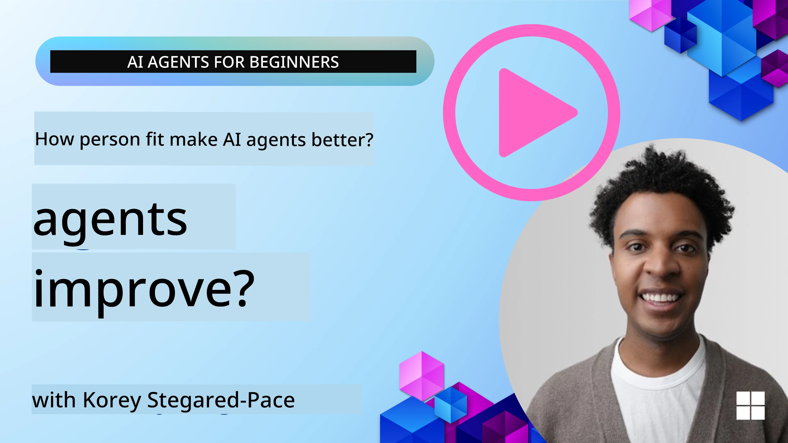
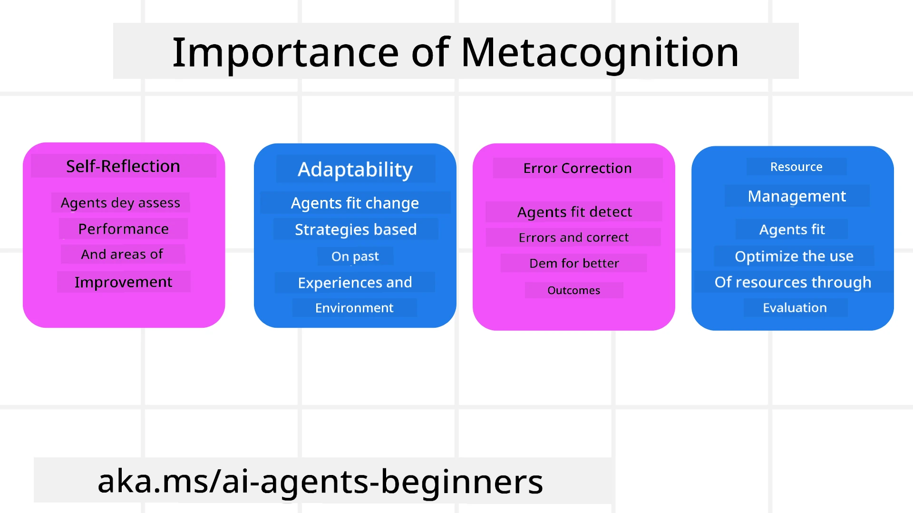
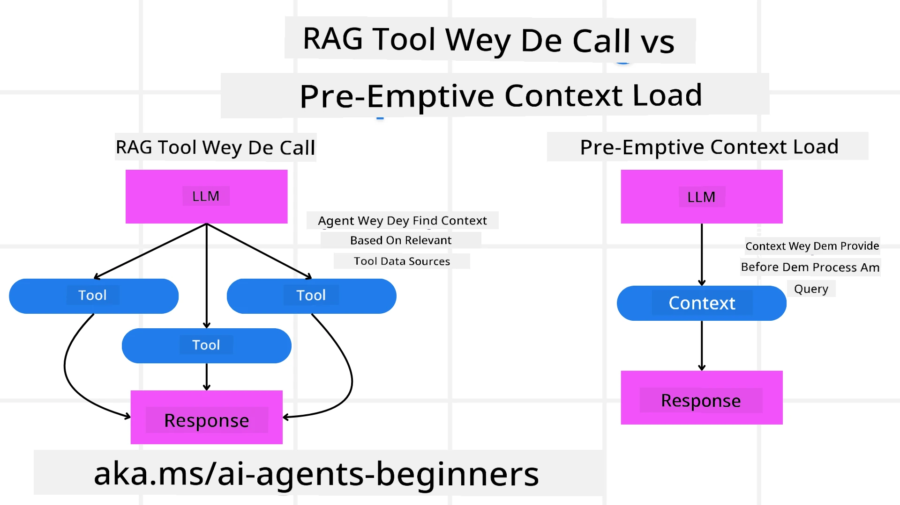

<!--
CO_OP_TRANSLATOR_METADATA:
{
  "original_hash": "5f0deef171fc3a68d5d3d770a8bfb03d",
  "translation_date": "2025-11-11T11:53:42+00:00",
  "source_file": "09-metacognition/README.md",
  "language_code": "pcm"
}
-->
[](https://youtu.be/His9R6gw6Ec?si=3_RMb8VprNvdLRhX)

> _(Click di image wey dey up to watch di video for dis lesson)_
# Metacognition for AI Agents

## Introduction

Welcome to di lesson wey dey talk about metacognition for AI agents! Dis chapter na for people wey dey start to sabi AI and wan know how AI agents fit dey reason about dia own thinking. By di end of dis lesson, you go sabi di main ideas and get practical examples wey go help you use metacognition for AI agent design.

## Learning Goals

After you finish dis lesson, you go fit:

1. Understand wetin reasoning loops mean for agent definitions.
2. Use planning and evaluation techniques to help agents wey dey correct dia own mistakes.
3. Create your own agents wey fit dey change code to do tasks.

## Introduction to Metacognition

Metacognition na di higher-level thinking process wey involve person dey reason about how dem dey think. For AI agents, e mean say dem fit dey check and adjust wetin dem dey do based on self-awareness and wetin dem don learn before. Metacognition, or "thinking about thinking," na one important idea for di way we dey build agentic AI systems. E mean say AI systems go sabi dia own internal processes and fit dey monitor, control, and change dia behavior as e dey necessary. Just like how we dey read di room or dey look problem. Dis self-awareness fit help AI systems make better decisions, find mistakes, and improve dia performance over time—e still connect to di Turing test and di talk about whether AI go take over.

For agentic AI systems, metacognition fit help solve plenty wahala like:
- Transparency: Make sure say AI systems fit explain di reason behind dia decisions.
- Reasoning: Make AI systems sabi how to join information together and make better decisions.
- Adaptation: Make AI systems fit adjust to new environments and changes.
- Perception: Help AI systems sabi how to recognize and understand di data wey dem dey collect.

### Wetin Be Metacognition?

Metacognition, or "thinking about thinking," na di higher-level thinking process wey involve self-awareness and control of how person dey think. For AI, metacognition dey give agents di power to check and change dia strategies and actions, wey go make dem sabi solve problems and make decisions better. If you understand metacognition, you fit design AI agents wey go dey smarter, more flexible, and efficient. True metacognition go make AI dey reason about dia own reasoning.

Example: “I choose cheaper flights because… I fit miss direct flights, so make I check again.”
Dey track how or why e choose one particular route.
- Noting say e make mistake because e depend too much on wetin di user like last time, so e go change di way e dey make decisions, no be just di final recommendation.
- Diagnosing patterns like, “Anytime I hear di user talk ‘too crowded,’ I no go only remove some attractions but also go sabi say di way I dey pick ‘top attractions’ dey wrong if I dey always rank by popularity.”

### Why Metacognition Important for AI Agents

Metacognition dey very important for AI agent design because:



- Self-Reflection: Agents fit check dia own performance and know where dem need to improve.
- Adaptability: Agents fit change dia strategies based on wetin dem don learn before and new situations.
- Error Correction: Agents fit find and fix mistakes by demself, wey go make dia results more correct.
- Resource Management: Agents fit plan and manage resources like time and computer power better.

## Di Parts of AI Agent

Before we go deep into metacognitive processes, e good make we understand di basic parts of AI agent. AI agent dey usually get:

- Persona: Di personality and character of di agent, wey go show how e dey interact with users.
- Tools: Di things wey di agent fit do.
- Skills: Di knowledge and expertise wey di agent get.

All dis parts dey work together to form one "expertise unit" wey fit do specific tasks.

**Example**:
Imagine one travel agent wey dey plan holiday for you and dey change di plan based on real-time data and wetin customers don experience before.

### Example: Metacognition for Travel Agent Service

Imagine say you wan design one travel agent service wey AI dey power. Dis agent, "Travel Agent," dey help users plan dia vacations. To add metacognition, Travel Agent go dey check and change wetin e dey do based on self-awareness and wetin e don learn before. See how metacognition fit work:

#### Current Task

Di task na to help one user plan trip go Paris.

#### Steps to Complete di Task

1. **Gather User Preferences**: Ask di user about dia travel dates, budget, wetin dem like (e.g., museums, food, shopping), and any special request.
2. **Retrieve Information**: Find flight options, hotels, attractions, and restaurants wey match di user preferences.
3. **Generate Recommendations**: Give di user one plan wey get flight details, hotel bookings, and activities wey dem fit do.
4. **Adjust Based on Feedback**: Ask di user for feedback about di plan and change am if e no match wetin dem want.

#### Needed Resources

- Access to flight and hotel booking databases.
- Information about attractions and restaurants for Paris.
- Feedback from users wey don use di service before.

#### Experience and Self-Reflection

Travel Agent go use metacognition to check how e dey perform and learn from wetin e don do before. For example:

1. **Analyzing User Feedback**: Travel Agent go look di feedback wey users give to know wetin dem like and wetin dem no like. E go use di information to improve di next recommendations.
2. **Adaptability**: If user don talk before say dem no like crowded places, Travel Agent go make sure say e no recommend popular tourist spots during di busy time.
3. **Error Correction**: If Travel Agent don make mistake before, like recommending hotel wey don full, e go learn to dey check availability well before e recommend.

#### Practical Developer Example

Dis na one simple example of how Travel Agent code fit look if e dey use metacognition:

```python
class Travel_Agent:
    def __init__(self):
        self.user_preferences = {}
        self.experience_data = []

    def gather_preferences(self, preferences):
        self.user_preferences = preferences

    def retrieve_information(self):
        # Search for flights, hotels, and attractions based on preferences
        flights = search_flights(self.user_preferences)
        hotels = search_hotels(self.user_preferences)
        attractions = search_attractions(self.user_preferences)
        return flights, hotels, attractions

    def generate_recommendations(self):
        flights, hotels, attractions = self.retrieve_information()
        itinerary = create_itinerary(flights, hotels, attractions)
        return itinerary

    def adjust_based_on_feedback(self, feedback):
        self.experience_data.append(feedback)
        # Analyze feedback and adjust future recommendations
        self.user_preferences = adjust_preferences(self.user_preferences, feedback)

# Example usage
travel_agent = Travel_Agent()
preferences = {
    "destination": "Paris",
    "dates": "2025-04-01 to 2025-04-10",
    "budget": "moderate",
    "interests": ["museums", "cuisine"]
}
travel_agent.gather_preferences(preferences)
itinerary = travel_agent.generate_recommendations()
print("Suggested Itinerary:", itinerary)
feedback = {"liked": ["Louvre Museum"], "disliked": ["Eiffel Tower (too crowded)"]}
travel_agent.adjust_based_on_feedback(feedback)
```

#### Why Metacognition Matter

- **Self-Reflection**: Agents fit check dia performance and know where dem need to improve.
- **Adaptability**: Agents fit change dia strategies based on feedback and new situations.
- **Error Correction**: Agents fit find and fix mistakes by demself.
- **Resource Management**: Agents fit plan and manage resources like time and computer power better.

If you add metacognition, Travel Agent go fit give better and more correct travel recommendations, wey go make di user experience better.

---

## 2. Planning for Agents

Planning na one important part of how AI agents dey behave. E mean say dem go plan di steps wey dem need to take to achieve one goal, dey consider di current situation, resources, and possible wahala.

### Di Things Wey Planning Need

- **Current Task**: Make di task clear.
- **Steps to Complete di Task**: Break di task into small steps wey person fit do.
- **Required Resources**: Know di resources wey you need.
- **Experience**: Use wetin you don learn before to plan well.

**Example**:
Dis na di steps wey Travel Agent go take to help user plan dia trip well:

### Steps for Travel Agent

1. **Gather User Preferences**
   - Ask di user for details about dia travel dates, budget, wetin dem like, and any special request.
   - Examples: "When you wan travel?" "How much you wan spend?" "Wetin you like do for vacation?"

2. **Retrieve Information**
   - Find travel options wey match di user preferences.
   - **Flights**: Look for flights wey dey inside di user budget and travel dates.
   - **Accommodations**: Find hotels or places wey match di user preferences for location, price, and wetin dem get.
   - **Attractions and Restaurants**: Find popular places and food wey di user go like.

3. **Generate Recommendations**
   - Put di information together to make one plan wey fit di user.
   - Add flight details, hotel bookings, and activities wey di user go enjoy.

4. **Present Itinerary to User**
   - Show di plan to di user make dem check am.
   - Example: "Dis na di plan for your trip go Paris. E get flight details, hotel bookings, and activities wey I recommend. Wetin you think?"

5. **Collect Feedback**
   - Ask di user for feedback about di plan.
   - Examples: "You like di flight options?" "Di hotel dey okay for you?" "You wan add or remove any activity?"

6. **Adjust Based on Feedback**
   - Change di plan based on wetin di user talk.
   - Make di changes for flight, hotel, and activities to match di user preferences.

7. **Final Confirmation**
   - Show di updated plan to di user make dem confirm am.
   - Example: "I don change di plan based on wetin you talk. Dis na di new plan. E dey okay for you?"

8. **Book and Confirm Reservations**
   - Once di user agree, book di flights, hotels, and activities.
   - Send di confirmation details to di user.

9. **Provide Ongoing Support**
   - Dey ready to help di user if dem need anything before or during dia trip.
   - Example: "If you need help for your trip, just let me know anytime!"

### Example Interaction

```python
class Travel_Agent:
    def __init__(self):
        self.user_preferences = {}
        self.experience_data = []

    def gather_preferences(self, preferences):
        self.user_preferences = preferences

    def retrieve_information(self):
        flights = search_flights(self.user_preferences)
        hotels = search_hotels(self.user_preferences)
        attractions = search_attractions(self.user_preferences)
        return flights, hotels, attractions

    def generate_recommendations(self):
        flights, hotels, attractions = self.retrieve_information()
        itinerary = create_itinerary(flights, hotels, attractions)
        return itinerary

    def adjust_based_on_feedback(self, feedback):
        self.experience_data.append(feedback)
        self.user_preferences = adjust_preferences(self.user_preferences, feedback)

# Example usage within a booing request
travel_agent = Travel_Agent()
preferences = {
    "destination": "Paris",
    "dates": "2025-04-01 to 2025-04-10",
    "budget": "moderate",
    "interests": ["museums", "cuisine"]
}
travel_agent.gather_preferences(preferences)
itinerary = travel_agent.generate_recommendations()
print("Suggested Itinerary:", itinerary)
feedback = {"liked": ["Louvre Museum"], "disliked": ["Eiffel Tower (too crowded)"]}
travel_agent.adjust_based_on_feedback(feedback)
```

## 3. Corrective RAG System

First, make we understand di difference between RAG Tool and Pre-emptive Context Load



### Retrieval-Augmented Generation (RAG)

RAG dey join retrieval system with generative model. When person ask question, di retrieval system go find di correct documents or data from outside source, and di information wey dem find go help di generative model give better answer wey match di question.

For RAG system, di agent dey find di correct information from knowledge base and use am to give di right answer or action.

### Corrective RAG Approach

Corrective RAG dey use RAG techniques to fix mistakes and make sure say AI agents dey give correct answers. Dis one involve:

1. **Prompting Technique**: Use special prompts to guide di agent to find di correct information.
2. **Tool**: Use algorithms and methods wey go help di agent check di information wey e find and give correct answers.
3. **Evaluation**: Dey always check di agent performance and dey make changes to improve di accuracy and efficiency.

#### Example: Corrective RAG for Search Agent

Imagine one search agent wey dey find information from di internet to answer user questions. Corrective RAG fit work like dis:

1. **Prompting Technique**: Create search queries based on wetin di user talk.
2. **Tool**: Use machine learning and natural language processing to rank and filter di search results.
3. **Evaluation**: Check user feedback to find and fix mistakes for di information wey di agent find.

### Corrective RAG for Travel Agent

Corrective RAG (Retrieval-Augmented Generation) dey make AI sabi how to find and give information while e dey fix any mistake. Make we see how Travel Agent fit use Corrective RAG to give better travel recommendations.

Dis one involve:

- **Prompting Technique:** Use special prompts to guide di agent to find di correct information.
- **Tool:** Use algorithms wey go help di agent check di information wey e find and give correct answers.
- **Evaluation:** Dey always check di agent performance and dey make changes to improve di accuracy and efficiency.

#### Steps to Use Corrective RAG for Travel Agent

1. **Initial User Interaction**
   - Travel Agent go ask di user for dia preferences like destination, travel dates, budget, and wetin dem like.
   - Example:

     ```python
     preferences = {
         "destination": "Paris",
         "dates": "2025-04-01 to 2025-04-10",
         "budget": "moderate",
         "interests": ["museums", "cuisine"]
     }
     ```

2. **Retrieval of Information**
   - Travel Agent go find information about flights, hotels, attractions, and restaurants based on wetin di user talk.
   - Example:

     ```python
     flights = search_flights(preferences)
     hotels = search_hotels(preferences)
     attractions = search_attractions(preferences)
     ```

3. **Generating Initial Recommendations**
   - Travel Agent go use di information wey e find to create one plan for di user.
   - Example:

     ```python
     itinerary = create_itinerary(flights, hotels, attractions)
     print("Suggested Itinerary:", itinerary)
     ```

4. **Collecting User Feedback**
   - Travel Agent go ask di user for feedback about di plan wey e create.
   - Example:

     ```python
     feedback = {
         "liked": ["Louvre Museum"],
         "disliked": ["Eiffel Tower (too crowded)"]
     }
     ```

5. **Corrective RAG Process**
   - **Prompting Technique**: Travel Agent go create new search queries based on wetin di user talk.
     - Example:

       ```python
       if "disliked" in feedback:
           preferences["avoid"] = feedback["disliked"]
       ```

   - **Tool**: Travel Agent go use algorithms to rank and filter di new search results, dey focus on wetin di user talk.
     - Example:

       ```python
       new_attractions = search_attractions(preferences)
       new_itinerary = create_itinerary(flights, hotels, new_attractions)
       print("Updated Itinerary:", new_itinerary)
       ```

   - **Evaluation**: Travel Agent go dey check di relevance and accuracy of di recommendations by looking di user feedback and dey make changes.
     - Example:

       ```python
       def adjust_preferences(preferences, feedback):
           if "liked" in feedback:
               preferences["favorites"] = feedback["liked"]
           if "disliked" in feedback:
               preferences["avoid"] = feedback["disliked"]
           return preferences

       preferences = adjust_preferences(preferences, feedback)
       ```

#### Practical Example

Dis na one simple Python code example wey dey show how Travel Agent fit use Corrective RAG:

```python
class Travel_Agent:
    def __init__(self):
        self.user_preferences = {}
        self.experience_data = []

    def gather_preferences(self, preferences):
        self.user_preferences = preferences

    def retrieve_information(self):
        flights = search_flights(self.user_preferences)
        hotels = search_hotels(self.user_preferences)
        attractions = search_attractions(self.user_preferences)
        return flights, hotels, attractions

    def generate_recommendations(self):
        flights, hotels, attractions = self.retrieve_information()
        itinerary = create_itinerary(flights, hotels, attractions)
        return itinerary

    def adjust_based_on_feedback(self, feedback):
        self.experience_data.append(feedback)
        self.user_preferences = adjust_preferences(self.user_preferences, feedback)
        new_itinerary = self.generate_recommendations()
        return new_itinerary

# Example usage
travel_agent = Travel_Agent()
preferences = {
    "destination": "Paris",
    "dates": "2025-04-01 to 2025-04-10",
    "budget": "moderate",
    "interests": ["museums", "cuisine"]
}
travel_agent.gather_preferences(preferences)
itinerary = travel_agent.generate_recommendations()
print("Suggested Itinerary:", itinerary)
feedback = {"liked": ["Louvre Museum"], "disliked": ["Eiffel Tower (too crowded)"]}
new_itinerary = travel_agent.adjust_based_on_feedback(feedback)
print("Updated Itinerary:", new_itinerary)
```

### Pre-emptive Context Load
Pre-emptive Context Load mean say you go load all di important info wey di model need before e go process any query. Dis one mean say di model go get access to di info from di beginning, so e fit give better answer without needing to find extra data while e dey work.

Example wey simple for how pre-emptive context load fit work for travel agent app for Python:

```python
class TravelAgent:
    def __init__(self):
        # Pre-load popular destinations and their information
        self.context = {
            "Paris": {"country": "France", "currency": "Euro", "language": "French", "attractions": ["Eiffel Tower", "Louvre Museum"]},
            "Tokyo": {"country": "Japan", "currency": "Yen", "language": "Japanese", "attractions": ["Tokyo Tower", "Shibuya Crossing"]},
            "New York": {"country": "USA", "currency": "Dollar", "language": "English", "attractions": ["Statue of Liberty", "Times Square"]},
            "Sydney": {"country": "Australia", "currency": "Dollar", "language": "English", "attractions": ["Sydney Opera House", "Bondi Beach"]}
        }

    def get_destination_info(self, destination):
        # Fetch destination information from pre-loaded context
        info = self.context.get(destination)
        if info:
            return f"{destination}:\nCountry: {info['country']}\nCurrency: {info['currency']}\nLanguage: {info['language']}\nAttractions: {', '.join(info['attractions'])}"
        else:
            return f"Sorry, we don't have information on {destination}."

# Example usage
travel_agent = TravelAgent()
print(travel_agent.get_destination_info("Paris"))
print(travel_agent.get_destination_info("Tokyo"))
```

#### Explanation

1. **Initialization (`__init__` method)**: Di `TravelAgent` class dey load dictionary wey get info about popular places like Paris, Tokyo, New York, and Sydney. Di dictionary get details like di country, currency, language, and di main attractions for each place.

2. **Retrieving Information (`get_destination_info` method)**: If person ask about one particular place, di `get_destination_info` method go find di info from di dictionary wey dem don already load.

If you load di context first, di travel agent app go fit answer quick-quick without needing to find di info from outside source for real-time. E go make di app fast and sharp.

### Bootstrapping di Plan with Goal Before You Start to Dey Adjust

Bootstrapping plan with goal mean say you go first set clear target or wetin you wan achieve. If you set di goal from di start, di model go use am as guide as e dey work step by step. Dis one go make sure say every step dey bring you closer to wetin you wan achieve, and e go make di process sharp and focused.

Example of how you fit bootstrap travel plan with goal before you start to dey adjust for travel agent for Python:

### Scenario

Travel agent wan plan custom vacation for client. Di goal na to create travel plan wey go make di client happy based on wetin dem like and di money wey dem get.

### Steps

1. Define wetin di client like and di money wey dem get.
2. Bootstrap di first plan based on wetin dem like.
3. Adjust di plan step by step to make di client happy.

#### Python Code

```python
class TravelAgent:
    def __init__(self, destinations):
        self.destinations = destinations

    def bootstrap_plan(self, preferences, budget):
        plan = []
        total_cost = 0

        for destination in self.destinations:
            if total_cost + destination['cost'] <= budget and self.match_preferences(destination, preferences):
                plan.append(destination)
                total_cost += destination['cost']

        return plan

    def match_preferences(self, destination, preferences):
        for key, value in preferences.items():
            if destination.get(key) != value:
                return False
        return True

    def iterate_plan(self, plan, preferences, budget):
        for i in range(len(plan)):
            for destination in self.destinations:
                if destination not in plan and self.match_preferences(destination, preferences) and self.calculate_cost(plan, destination) <= budget:
                    plan[i] = destination
                    break
        return plan

    def calculate_cost(self, plan, new_destination):
        return sum(destination['cost'] for destination in plan) + new_destination['cost']

# Example usage
destinations = [
    {"name": "Paris", "cost": 1000, "activity": "sightseeing"},
    {"name": "Tokyo", "cost": 1200, "activity": "shopping"},
    {"name": "New York", "cost": 900, "activity": "sightseeing"},
    {"name": "Sydney", "cost": 1100, "activity": "beach"},
]

preferences = {"activity": "sightseeing"}
budget = 2000

travel_agent = TravelAgent(destinations)
initial_plan = travel_agent.bootstrap_plan(preferences, budget)
print("Initial Plan:", initial_plan)

refined_plan = travel_agent.iterate_plan(initial_plan, preferences, budget)
print("Refined Plan:", refined_plan)
```

#### Code Explanation

1. **Initialization (`__init__` method)**: Di `TravelAgent` class dey start with list of places wey get attributes like name, cost, and activity type.

2. **Bootstrapping di Plan (`bootstrap_plan` method)**: Dis method dey create di first travel plan based on wetin di client like and di money wey dem get. E go check di list of places and add di ones wey match di client preference and fit di money.

3. **Matching Preferences (`match_preferences` method)**: Dis method dey check if di place match wetin di client like.

4. **Adjusting di Plan (`iterate_plan` method)**: Dis method dey improve di first plan by trying to replace di places for di plan with better ones wey go still match di client preference and money.

5. **Calculating Cost (`calculate_cost` method)**: Dis method dey calculate di total money for di plan, including any new place wey dem add.

#### Example Usage

- **First Plan**: Di travel agent go create di first plan based on di client preference for sightseeing and di money wey dem get, like $2000.
- **Better Plan**: Di travel agent go adjust di plan to make am better, so e go fit di client preference and money.

If you bootstrap di plan with clear goal (like to make di client happy) and adjust di plan step by step, di travel agent go fit create custom and better travel plan for di client. Dis way, di travel plan go match di client preference and money from di start and e go dey better as dem dey adjust am.

### How to Use LLM for Re-ranking and Scoring

Big Language Models (LLMs) fit help to re-rank and score by checking how relevant and good di info wey dem find or di answer wey dem generate be. Dis na how e dey work:

**Retrieval:** First step na to find set of documents or answers wey fit di query.

**Re-ranking:** Di LLM go check di documents or answers and arrange dem based on how relevant and good dem be. Dis one go make sure say di best info dey first.

**Scoring:** Di LLM go give score to each document or answer to show how relevant and good e be. Dis one go help to pick di best answer or document for di user.

If you use LLMs for re-ranking and scoring, di system go fit give better and more relevant info, and e go make di user experience better.

Example of how travel agent fit use Big Language Model (LLM) to re-rank and score travel places based on wetin di user like for Python:

#### Scenario - Travel based on Preferences

Travel agent wan recommend di best travel places to client based on wetin dem like. Di LLM go help to re-rank and score di places so di best options go dey first.

#### Steps:

1. Collect wetin di user like.
2. Find list of travel places wey fit.
3. Use di LLM to re-rank and score di places based on wetin di user like.

How you fit use Azure OpenAI Services for dis:

#### Requirements

1. You need Azure subscription.
2. Create Azure OpenAI resource and get API key.

#### Example Python Code

```python
import requests
import json

class TravelAgent:
    def __init__(self, destinations):
        self.destinations = destinations

    def get_recommendations(self, preferences, api_key, endpoint):
        # Generate a prompt for the Azure OpenAI
        prompt = self.generate_prompt(preferences)
        
        # Define headers and payload for the request
        headers = {
            'Content-Type': 'application/json',
            'Authorization': f'Bearer {api_key}'
        }
        payload = {
            "prompt": prompt,
            "max_tokens": 150,
            "temperature": 0.7
        }
        
        # Call the Azure OpenAI API to get the re-ranked and scored destinations
        response = requests.post(endpoint, headers=headers, json=payload)
        response_data = response.json()
        
        # Extract and return the recommendations
        recommendations = response_data['choices'][0]['text'].strip().split('\n')
        return recommendations

    def generate_prompt(self, preferences):
        prompt = "Here are the travel destinations ranked and scored based on the following user preferences:\n"
        for key, value in preferences.items():
            prompt += f"{key}: {value}\n"
        prompt += "\nDestinations:\n"
        for destination in self.destinations:
            prompt += f"- {destination['name']}: {destination['description']}\n"
        return prompt

# Example usage
destinations = [
    {"name": "Paris", "description": "City of lights, known for its art, fashion, and culture."},
    {"name": "Tokyo", "description": "Vibrant city, famous for its modernity and traditional temples."},
    {"name": "New York", "description": "The city that never sleeps, with iconic landmarks and diverse culture."},
    {"name": "Sydney", "description": "Beautiful harbour city, known for its opera house and stunning beaches."},
]

preferences = {"activity": "sightseeing", "culture": "diverse"}
api_key = 'your_azure_openai_api_key'
endpoint = 'https://your-endpoint.com/openai/deployments/your-deployment-name/completions?api-version=2022-12-01'

travel_agent = TravelAgent(destinations)
recommendations = travel_agent.get_recommendations(preferences, api_key, endpoint)
print("Recommended Destinations:")
for rec in recommendations:
    print(rec)
```

#### Code Explanation - Preference Booker

1. **Initialization**: Di `TravelAgent` class dey start with list of travel places wey get attributes like name and description.

2. **Getting Recommendations (`get_recommendations` method)**: Dis method dey create prompt for Azure OpenAI service based on wetin di user like and e go make HTTP POST request to Azure OpenAI API to get re-ranked and scored places.

3. **Generating Prompt (`generate_prompt` method)**: Dis method dey create prompt for Azure OpenAI, e go include wetin di user like and di list of places. Di prompt go guide di model to re-rank and score di places based on wetin di user like.

4. **API Call**: Di `requests` library dey make HTTP POST request to Azure OpenAI API endpoint. Di response go get di re-ranked and scored places.

5. **Example Usage**: Di travel agent go collect wetin di user like (like sightseeing and culture) and use Azure OpenAI service to get re-ranked and scored recommendations for travel places.

Make sure say you replace `your_azure_openai_api_key` with your real Azure OpenAI API key and `https://your-endpoint.com/...` with di real endpoint URL of your Azure OpenAI deployment.

If you use LLM for re-ranking and scoring, di travel agent go fit give more personal and relevant travel recommendations to clients, and e go make di experience better.

### RAG: Prompting Technique vs Tool

Retrieval-Augmented Generation (RAG) fit be both prompting technique and tool for AI agent development. If you sabi di difference, e go help you use RAG well for your project.

#### RAG as Prompting Technique

**Wetin e be?**

- As prompting technique, RAG dey involve how you go create specific queries or prompts to find di correct info from big database. Di info go then dey used to generate answer or action.

**How e dey work:**

1. **Formulate Prompts**: Create prompts or queries wey dey structured well based on di task or wetin di user talk.
2. **Retrieve Information**: Use di prompts to find di correct data from knowledge base or dataset.
3. **Generate Response**: Combine di info wey you find with generative AI models to give better answer.

**Example for Travel Agent**:

- User Input: "I wan visit museums for Paris."
- Prompt: "Find di top museums for Paris."
- Retrieved Information: Details about Louvre Museum, Musée d'Orsay, etc.
- Generated Response: "Here be di top museums for Paris: Louvre Museum, Musée d'Orsay, and Centre Pompidou."

#### RAG as Tool

**Wetin e be?**

- As tool, RAG na system wey dey automate di retrieval and generation process, so developers no need to dey create prompts for every query.

**How e dey work:**

1. **Integration**: Put RAG inside di AI agent system, so e go dey handle di retrieval and generation work automatically.
2. **Automation**: Di tool go manage everything from user input to di final answer without needing prompts for every step.
3. **Efficiency**: E go make di agent work better by making di retrieval and generation process fast and sharp.

**Example for Travel Agent**:

- User Input: "I wan visit museums for Paris."
- RAG Tool: E go automatically find info about museums and generate answer.
- Generated Response: "Here be di top museums for Paris: Louvre Museum, Musée d'Orsay, and Centre Pompidou."

### Comparison

| Aspect                 | Prompting Technique                                        | Tool                                                  |
|------------------------|-------------------------------------------------------------|-------------------------------------------------------|
| **Manual vs Automatic**| Manual way to create prompts for every query.               | Automatic way to handle retrieval and generation.     |
| **Control**            | You fit control di retrieval process more.                  | E dey automate di retrieval and generation.           |
| **Flexibility**        | You fit create custom prompts based on wetin you need.      | E dey better for big projects.                        |
| **Complexity**         | You go need to dey create and adjust prompts.               | E easy to put inside AI agent system.                 |

### Practical Examples

**Prompting Technique Example:**

```python
def search_museums_in_paris():
    prompt = "Find top museums in Paris"
    search_results = search_web(prompt)
    return search_results

museums = search_museums_in_paris()
print("Top Museums in Paris:", museums)
```

**Tool Example:**

```python
class Travel_Agent:
    def __init__(self):
        self.rag_tool = RAGTool()

    def get_museums_in_paris(self):
        user_input = "I want to visit museums in Paris."
        response = self.rag_tool.retrieve_and_generate(user_input)
        return response

travel_agent = Travel_Agent()
museums = travel_agent.get_museums_in_paris()
print("Top Museums in Paris:", museums)
```

### Evaluating Relevancy

To check relevancy na one important thing for AI agent work. E dey make sure say di info wey di agent find and di answer wey e give dey correct and useful for di user. Make we see how to check relevancy for AI agents, with examples and techniques.

#### Key Concepts for Checking Relevancy

1. **Context Awareness**:
   - Di agent need to sabi di context of wetin di user dey ask to find di correct info.
   - Example: If person ask for "best restaurants for Paris," di agent suppose consider di person taste, like di kind food and di money wey dem get.

2. **Accuracy**:
   - Di info wey di agent give suppose correct and up-to-date.
   - Example: Make e recommend restaurants wey still dey open and get better reviews.

3. **User Intent**:
   - Di agent suppose understand wetin di user really want to give di best info.
   - Example: If person ask for "cheap hotels," di agent suppose focus on affordable options.

4. **Feedback Loop**:
   - If di agent dey collect and check user feedback, e go help am improve how e dey check relevancy.
   - Example: Use di ratings and feedback wey users give for past recommendations to make di next ones better.

#### Practical Techniques for Checking Relevancy

1. **Relevance Scoring**:
   - Give score to each item wey you find based on how e match di user query and wetin dem like.
   - Example:

     ```python
     def relevance_score(item, query):
         score = 0
         if item['category'] in query['interests']:
             score += 1
         if item['price'] <= query['budget']:
             score += 1
         if item['location'] == query['destination']:
             score += 1
         return score
     ```

2. **Filtering and Ranking**:
   - Remove di items wey no make sense and arrange di remaining ones based on di score.
   - Example:

     ```python
     def filter_and_rank(items, query):
         ranked_items = sorted(items, key=lambda item: relevance_score(item, query), reverse=True)
         return ranked_items[:10]  # Return top 10 relevant items
     ```

3. **Natural Language Processing (NLP)**:
   - Use NLP to understand wetin di user dey ask and find di correct info.
   - Example:

     ```python
     def process_query(query):
         # Use NLP to extract key information from the user's query
         processed_query = nlp(query)
         return processed_query
     ```

4. **User Feedback Integration**:
   - Collect user feedback about di recommendations and use am to adjust how you dey check relevancy.
   - Example:

     ```python
     def adjust_based_on_feedback(feedback, items):
         for item in items:
             if item['name'] in feedback['liked']:
                 item['relevance'] += 1
             if item['name'] in feedback['disliked']:
                 item['relevance'] -= 1
         return items
     ```

#### Example: Checking Relevancy for Travel Agent

Dis na example of how Travel Agent fit check di relevancy of travel recommendations:

```python
class Travel_Agent:
    def __init__(self):
        self.user_preferences = {}
        self.experience_data = []

    def gather_preferences(self, preferences):
        self.user_preferences = preferences

    def retrieve_information(self):
        flights = search_flights(self.user_preferences)
        hotels = search_hotels(self.user_preferences)
        attractions = search_attractions(self.user_preferences)
        return flights, hotels, attractions

    def generate_recommendations(self):
        flights, hotels, attractions = self.retrieve_information()
        ranked_hotels = self.filter_and_rank(hotels, self.user_preferences)
        itinerary = create_itinerary(flights, ranked_hotels, attractions)
        return itinerary

    def filter_and_rank(self, items, query):
        ranked_items = sorted(items, key=lambda item: self.relevance_score(item, query), reverse=True)
        return ranked_items[:10]  # Return top 10 relevant items

    def relevance_score(self, item, query):
        score = 0
        if item['category'] in query['interests']:
            score += 1
        if item['price'] <= query['budget']:
            score += 1
        if item['location'] == query['destination']:
            score += 1
        return score

    def adjust_based_on_feedback(self, feedback, items):
        for item in items:
            if item['name'] in feedback['liked']:
                item['relevance'] += 1
            if item['name'] in feedback['disliked']:
                item['relevance'] -= 1
        return items

# Example usage
travel_agent = Travel_Agent()
preferences = {
    "destination": "Paris",
    "dates": "2025-04-01 to 2025-04-10",
    "budget": "moderate",
    "interests": ["museums", "cuisine"]
}
travel_agent.gather_preferences(preferences)
itinerary = travel_agent.generate_recommendations()
print("Suggested Itinerary:", itinerary)
feedback = {"liked": ["Louvre Museum"], "disliked": ["Eiffel Tower (too crowded)"]}
updated_items = travel_agent.adjust_based_on_feedback(feedback, itinerary['hotels'])
print("Updated Itinerary with Feedback:", updated_items)
```

### Search with Intent

Search with intent mean say you go understand wetin di user really want or di reason why dem dey ask di question, so you fit find and give di best info. Dis one no be just to match words, but to understand di user need and di context.

#### Key Concepts for Search with Intent

1. **Understanding User Intent**:
   - User intent fit be three types: informational, navigational, and transactional.
     - **Informational Intent**: Di user dey find info about one topic (e.g., "Wetin be di best museums for Paris?").
     - **Navigational Intent**: Di user wan go one particular website or page (e.g., "Louvre Museum official website").
     - **Transactional Intent**: Di user wan do something like book flight or buy something (e.g., "Book flight to Paris").

2. **Context Awareness**:
   - Check di context of di user query to know wetin dem really want. Dis one include di past chats, wetin di user like, and di details of di current query.

3. **Natural Language Processing (NLP)**:
   - Use NLP to understand di natural language wey di user use. Dis one include things like recognizing names, checking di mood of di user, and breaking di query down.

4. **Personalization**:
   - Make di search results match di user history, wetin dem like, and di feedback dem don give before. Dis one go make di info wey you find more relevant.

#### Practical Example: Search with Intent for Travel Agent

Make we use Travel Agent as example to see how search with intent fit work.
1. **Gather User Preference**

   ```python
   class Travel_Agent:
       def __init__(self):
           self.user_preferences = {}

       def gather_preferences(self, preferences):
           self.user_preferences = preferences
   ```

2. **Understand Wetin User Wan Do**

   ```python
   def identify_intent(query):
       if "book" in query or "purchase" in query:
           return "transactional"
       elif "website" in query or "official" in query:
           return "navigational"
       else:
           return "informational"
   ```

3. **Know Di Context**

   ```python
   def analyze_context(query, user_history):
       # Combine current query with user history to understand context
       context = {
           "current_query": query,
           "user_history": user_history
       }
       return context
   ```

4. **Search an Personalize Result**

   ```python
   def search_with_intent(query, preferences, user_history):
       intent = identify_intent(query)
       context = analyze_context(query, user_history)
       if intent == "informational":
           search_results = search_information(query, preferences)
       elif intent == "navigational":
           search_results = search_navigation(query)
       elif intent == "transactional":
           search_results = search_transaction(query, preferences)
       personalized_results = personalize_results(search_results, user_history)
       return personalized_results

   def search_information(query, preferences):
       # Example search logic for informational intent
       results = search_web(f"best {preferences['interests']} in {preferences['destination']}")
       return results

   def search_navigation(query):
       # Example search logic for navigational intent
       results = search_web(query)
       return results

   def search_transaction(query, preferences):
       # Example search logic for transactional intent
       results = search_web(f"book {query} to {preferences['destination']}")
       return results

   def personalize_results(results, user_history):
       # Example personalization logic
       personalized = [result for result in results if result not in user_history]
       return personalized[:10]  # Return top 10 personalized results
   ```

5. **Example of How E Dey Work**

   ```python
   travel_agent = Travel_Agent()
   preferences = {
       "destination": "Paris",
       "interests": ["museums", "cuisine"]
   }
   travel_agent.gather_preferences(preferences)
   user_history = ["Louvre Museum website", "Book flight to Paris"]
   query = "best museums in Paris"
   results = search_with_intent(query, preferences, user_history)
   print("Search Results:", results)
   ```

---

## 4. Generate Code as Tool

Code wey dey generate dey use AI model to write an run code, solve big problem an make work easy.

### Code Generating Agents

Code wey dey generate dey use AI model to write an run code. Dis agents fit solve big problem, make work easy, an give beta insight by generating an running code for different programming language.

#### Wetin You Fit Use Am Do

1. **Automated Code Generation**: Generate small code for specific work like data analysis, web scraping, or machine learning.
2. **SQL as RAG**: Use SQL query to collect an change data from database.
3. **Solve Problem**: Create an run code to solve specific problem like make algorithm beta or analyze data.

#### Example: Code Generating Agent for Data Analysis

Imagine say you wan design code generating agent. See how e go work:

1. **Task**: Analyze dataset to see trend an pattern.
2. **Steps**:
   - Load di dataset for data analysis tool.
   - Generate SQL query to filter an arrange di data.
   - Run di query an collect di result.
   - Use di result take do graph an insight.
3. **Wetin You Go Need**: Access to di dataset, data analysis tools, an SQL.
4. **Experience**: Use past analysis result to make di next one more accurate an relevant.

### Example: Code Generating Agent for Travel Agent

For dis example, we go design code generating agent, Travel Agent, wey go help people plan dia travel by generating an running code. Dis agent fit do work like find travel option, filter result, an arrange travel plan using generative AI.

#### Overview of di Code Generating Agent

1. **Gather User Preference**: Collect wetin user want like destination, travel date, budget, an wetin dem like.
2. **Generate Code to Collect Data**: Generate small code to find data about flight, hotel, an attraction.
3. **Run di Code**: Run di code wey e generate to collect real-time info.
4. **Generate Travel Plan**: Arrange di data wey e collect into travel plan wey fit di person.
5. **Change Based on Feedback**: Collect wetin user talk an generate new code if e need to make di result beta.

#### Step-by-Step Implementation

1. **Gather User Preference**

   ```python
   class Travel_Agent:
       def __init__(self):
           self.user_preferences = {}

       def gather_preferences(self, preferences):
           self.user_preferences = preferences
   ```

2. **Generate Code to Collect Data**

   ```python
   def generate_code_to_fetch_data(preferences):
       # Example: Generate code to search for flights based on user preferences
       code = f"""
       def search_flights():
           import requests
           response = requests.get('https://api.example.com/flights', params={preferences})
           return response.json()
       """
       return code

   def generate_code_to_fetch_hotels(preferences):
       # Example: Generate code to search for hotels
       code = f"""
       def search_hotels():
           import requests
           response = requests.get('https://api.example.com/hotels', params={preferences})
           return response.json()
       """
       return code
   ```

3. **Run di Code**

   ```python
   def execute_code(code):
       # Execute the generated code using exec
       exec(code)
       result = locals()
       return result

   travel_agent = Travel_Agent()
   preferences = {
       "destination": "Paris",
       "dates": "2025-04-01 to 2025-04-10",
       "budget": "moderate",
       "interests": ["museums", "cuisine"]
   }
   travel_agent.gather_preferences(preferences)
   
   flight_code = generate_code_to_fetch_data(preferences)
   hotel_code = generate_code_to_fetch_hotels(preferences)
   
   flights = execute_code(flight_code)
   hotels = execute_code(hotel_code)

   print("Flight Options:", flights)
   print("Hotel Options:", hotels)
   ```

4. **Generate Travel Plan**

   ```python
   def generate_itinerary(flights, hotels, attractions):
       itinerary = {
           "flights": flights,
           "hotels": hotels,
           "attractions": attractions
       }
       return itinerary

   attractions = search_attractions(preferences)
   itinerary = generate_itinerary(flights, hotels, attractions)
   print("Suggested Itinerary:", itinerary)
   ```

5. **Change Based on Feedback**

   ```python
   def adjust_based_on_feedback(feedback, preferences):
       # Adjust preferences based on user feedback
       if "liked" in feedback:
           preferences["favorites"] = feedback["liked"]
       if "disliked" in feedback:
           preferences["avoid"] = feedback["disliked"]
       return preferences

   feedback = {"liked": ["Louvre Museum"], "disliked": ["Eiffel Tower (too crowded)"]}
   updated_preferences = adjust_based_on_feedback(feedback, preferences)
   
   # Regenerate and execute code with updated preferences
   updated_flight_code = generate_code_to_fetch_data(updated_preferences)
   updated_hotel_code = generate_code_to_fetch_hotels(updated_preferences)
   
   updated_flights = execute_code(updated_flight_code)
   updated_hotels = execute_code(updated_hotel_code)
   
   updated_itinerary = generate_itinerary(updated_flights, updated_hotels, attractions)
   print("Updated Itinerary:", updated_itinerary)
   ```

### Use Environmental Awareness an Reasoning

If you sabi di table schema, e fit help make di query generation process beta by using environmental awareness an reasoning.

See example of how e fit work:

1. **Understand di Schema**: Di system go sabi di table schema an use am to guide di query generation.
2. **Change Based on Feedback**: Di system go change wetin user want based on feedback an reason which field for di schema need update.
3. **Generate an Run Query**: Di system go generate an run query to collect updated flight an hotel data based on di new preference.

See updated Python code example wey dey show dis concept:

```python
def adjust_based_on_feedback(feedback, preferences, schema):
    # Adjust preferences based on user feedback
    if "liked" in feedback:
        preferences["favorites"] = feedback["liked"]
    if "disliked" in feedback:
        preferences["avoid"] = feedback["disliked"]
    # Reasoning based on schema to adjust other related preferences
    for field in schema:
        if field in preferences:
            preferences[field] = adjust_based_on_environment(feedback, field, schema)
    return preferences

def adjust_based_on_environment(feedback, field, schema):
    # Custom logic to adjust preferences based on schema and feedback
    if field in feedback["liked"]:
        return schema[field]["positive_adjustment"]
    elif field in feedback["disliked"]:
        return schema[field]["negative_adjustment"]
    return schema[field]["default"]

def generate_code_to_fetch_data(preferences):
    # Generate code to fetch flight data based on updated preferences
    return f"fetch_flights(preferences={preferences})"

def generate_code_to_fetch_hotels(preferences):
    # Generate code to fetch hotel data based on updated preferences
    return f"fetch_hotels(preferences={preferences})"

def execute_code(code):
    # Simulate execution of code and return mock data
    return {"data": f"Executed: {code}"}

def generate_itinerary(flights, hotels, attractions):
    # Generate itinerary based on flights, hotels, and attractions
    return {"flights": flights, "hotels": hotels, "attractions": attractions}

# Example schema
schema = {
    "favorites": {"positive_adjustment": "increase", "negative_adjustment": "decrease", "default": "neutral"},
    "avoid": {"positive_adjustment": "decrease", "negative_adjustment": "increase", "default": "neutral"}
}

# Example usage
preferences = {"favorites": "sightseeing", "avoid": "crowded places"}
feedback = {"liked": ["Louvre Museum"], "disliked": ["Eiffel Tower (too crowded)"]}
updated_preferences = adjust_based_on_feedback(feedback, preferences, schema)

# Regenerate and execute code with updated preferences
updated_flight_code = generate_code_to_fetch_data(updated_preferences)
updated_hotel_code = generate_code_to_fetch_hotels(updated_preferences)

updated_flights = execute_code(updated_flight_code)
updated_hotels = execute_code(updated_hotel_code)

updated_itinerary = generate_itinerary(updated_flights, updated_hotels, feedback["liked"])
print("Updated Itinerary:", updated_itinerary)
```

#### Explanation - Booking Based on Feedback

1. **Schema Awareness**: Di `schema` dictionary dey show how to change preference based on feedback. E get field like `favorites` an `avoid`, with di adjustment wey follow.
2. **Change Preference (`adjust_based_on_feedback` method)**: Dis method dey change preference based on wetin user talk an di schema.
3. **Environment-Based Adjustments (`adjust_based_on_environment` method)**: Dis method dey customize di adjustment based on di schema an feedback.
4. **Generate an Run Query**: Di system dey generate code to collect updated flight an hotel data based on di new preference an simulate di query execution.
5. **Generate Travel Plan**: Di system go create updated travel plan based on di new flight, hotel, an attraction data.

If di system sabi di environment an reason based on di schema, e fit generate query wey go dey more accurate an relevant, wey go make di travel recommendation beta an more personal.

### Use SQL as Retrieval-Augmented Generation (RAG) Technique

SQL (Structured Query Language) na strong tool to interact with database. If you use am as part of Retrieval-Augmented Generation (RAG) approach, SQL fit collect relevant data from database to help generate response or action for AI agents. Make we see how SQL fit work as RAG technique for Travel Agent.

#### Key Concepts

1. **Database Interaction**:
   - SQL dey use to query database, collect relevant info, an change data.
   - Example: Collect flight detail, hotel info, an attraction from travel database.

2. **Integration with RAG**:
   - SQL query dey generate based on wetin user talk an wetin dem want.
   - Di data wey e collect go dey used to generate personal recommendation or action.

3. **Dynamic Query Generation**:
   - Di AI agent dey generate SQL query based on di context an wetin user need.
   - Example: Customize SQL query to filter result based on budget, date, an wetin dem like.

#### Applications

- **Automated Code Generation**: Generate small code for specific work.
- **SQL as RAG**: Use SQL query to change data.
- **Solve Problem**: Create an run code to solve problem.

**Example**:
Data analysis agent:

1. **Task**: Analyze dataset to find trend.
2. **Steps**:
   - Load di dataset.
   - Generate SQL query to filter data.
   - Run query an collect result.
   - Generate graph an insight.
3. **Resources**: Dataset access, SQL.
4. **Experience**: Use past result to make di next one beta.

#### Practical Example: Use SQL for Travel Agent

1. **Gather User Preference**

   ```python
   class Travel_Agent:
       def __init__(self):
           self.user_preferences = {}

       def gather_preferences(self, preferences):
           self.user_preferences = preferences
   ```

2. **Generate SQL Query**

   ```python
   def generate_sql_query(table, preferences):
       query = f"SELECT * FROM {table} WHERE "
       conditions = []
       for key, value in preferences.items():
           conditions.append(f"{key}='{value}'")
       query += " AND ".join(conditions)
       return query
   ```

3. **Run SQL Query**

   ```python
   import sqlite3

   def execute_sql_query(query, database="travel.db"):
       connection = sqlite3.connect(database)
       cursor = connection.cursor()
       cursor.execute(query)
       results = cursor.fetchall()
       connection.close()
       return results
   ```

4. **Generate Recommendation**

   ```python
   def generate_recommendations(preferences):
       flight_query = generate_sql_query("flights", preferences)
       hotel_query = generate_sql_query("hotels", preferences)
       attraction_query = generate_sql_query("attractions", preferences)
       
       flights = execute_sql_query(flight_query)
       hotels = execute_sql_query(hotel_query)
       attractions = execute_sql_query(attraction_query)
       
       itinerary = {
           "flights": flights,
           "hotels": hotels,
           "attractions": attractions
       }
       return itinerary

   travel_agent = Travel_Agent()
   preferences = {
       "destination": "Paris",
       "dates": "2025-04-01 to 2025-04-10",
       "budget": "moderate",
       "interests": ["museums", "cuisine"]
   }
   travel_agent.gather_preferences(preferences)
   itinerary = generate_recommendations(preferences)
   print("Suggested Itinerary:", itinerary)
   ```

#### Example SQL Query

1. **Flight Query**

   ```sql
   SELECT * FROM flights WHERE destination='Paris' AND dates='2025-04-01 to 2025-04-10' AND budget='moderate';
   ```

2. **Hotel Query**

   ```sql
   SELECT * FROM hotels WHERE destination='Paris' AND budget='moderate';
   ```

3. **Attraction Query**

   ```sql
   SELECT * FROM attractions WHERE destination='Paris' AND interests='museums, cuisine';
   ```

If you use SQL as part of Retrieval-Augmented Generation (RAG) technique, AI agents like Travel Agent fit collect an use relevant data to give accurate an personal recommendation.

### Example of Metacognition

To show how metacognition fit work, make we create simple agent wey dey think about how e dey make decision while e dey solve problem. For dis example, we go build system wey go help agent choose hotel, but e go check di way e dey reason an change di way e dey do things if e make mistake or choose something wey no good.

We go simulate dis with simple example wey agent go choose hotel based on price an quality, but e go "think" about di choice an adjust if e no make sense.

#### How Dis Show Metacognition:

1. **First Decision**: Di agent go pick di cheapest hotel, without thinking about di quality.
2. **Think an Check**: After di first choice, di agent go check if di hotel na "bad" choice based on wetin user talk. If di quality no good, e go think about di reason.
3. **Change Strategy**: Di agent go change di way e dey do things based on di thinking, switch from "cheapest" to "highest_quality", so e go dey make beta decision next time.

See example:

```python
class HotelRecommendationAgent:
    def __init__(self):
        self.previous_choices = []  # Stores the hotels chosen previously
        self.corrected_choices = []  # Stores the corrected choices
        self.recommendation_strategies = ['cheapest', 'highest_quality']  # Available strategies

    def recommend_hotel(self, hotels, strategy):
        """
        Recommend a hotel based on the chosen strategy.
        The strategy can either be 'cheapest' or 'highest_quality'.
        """
        if strategy == 'cheapest':
            recommended = min(hotels, key=lambda x: x['price'])
        elif strategy == 'highest_quality':
            recommended = max(hotels, key=lambda x: x['quality'])
        else:
            recommended = None
        self.previous_choices.append((strategy, recommended))
        return recommended

    def reflect_on_choice(self):
        """
        Reflect on the last choice made and decide if the agent should adjust its strategy.
        The agent considers if the previous choice led to a poor outcome.
        """
        if not self.previous_choices:
            return "No choices made yet."

        last_choice_strategy, last_choice = self.previous_choices[-1]
        # Let's assume we have some user feedback that tells us whether the last choice was good or not
        user_feedback = self.get_user_feedback(last_choice)

        if user_feedback == "bad":
            # Adjust strategy if the previous choice was unsatisfactory
            new_strategy = 'highest_quality' if last_choice_strategy == 'cheapest' else 'cheapest'
            self.corrected_choices.append((new_strategy, last_choice))
            return f"Reflecting on choice. Adjusting strategy to {new_strategy}."
        else:
            return "The choice was good. No need to adjust."

    def get_user_feedback(self, hotel):
        """
        Simulate user feedback based on hotel attributes.
        For simplicity, assume if the hotel is too cheap, the feedback is "bad".
        If the hotel has quality less than 7, feedback is "bad".
        """
        if hotel['price'] < 100 or hotel['quality'] < 7:
            return "bad"
        return "good"

# Simulate a list of hotels (price and quality)
hotels = [
    {'name': 'Budget Inn', 'price': 80, 'quality': 6},
    {'name': 'Comfort Suites', 'price': 120, 'quality': 8},
    {'name': 'Luxury Stay', 'price': 200, 'quality': 9}
]

# Create an agent
agent = HotelRecommendationAgent()

# Step 1: The agent recommends a hotel using the "cheapest" strategy
recommended_hotel = agent.recommend_hotel(hotels, 'cheapest')
print(f"Recommended hotel (cheapest): {recommended_hotel['name']}")

# Step 2: The agent reflects on the choice and adjusts strategy if necessary
reflection_result = agent.reflect_on_choice()
print(reflection_result)

# Step 3: The agent recommends again, this time using the adjusted strategy
adjusted_recommendation = agent.recommend_hotel(hotels, 'highest_quality')
print(f"Adjusted hotel recommendation (highest_quality): {adjusted_recommendation['name']}")
```

#### Agent Metacognition Ability

Di main thing here na di agent ability to:
- Check di choice wey e make before an di way e dey reason.
- Change di way e dey do things based on di thinking, na wetin we dey call metacognition.

Dis na simple way of metacognition where di system fit change di way e dey reason based on wetin e think about di feedback.

### Conclusion

Metacognition na strong tool wey fit make AI agents more smart, flexible, an efficient. If you add metacognitive process, you fit design agents wey go dey more intelligent an dey work well. Use di extra resources to learn more about dis interesting world of metacognition for AI agents.

### You Get More Question About Metacognition Design Pattern?

Join di [Azure AI Foundry Discord](https://aka.ms/ai-agents/discord) to meet other learners, attend office hours an get your AI Agents question answered.

## Previous Lesson

[Multi-Agent Design Pattern](../08-multi-agent/README.md)

## Next Lesson

[AI Agents in Production](../10-ai-agents-production/README.md)

---

<!-- CO-OP TRANSLATOR DISCLAIMER START -->
**Disclaimer**:  
Dis dokyument don use AI translation service [Co-op Translator](https://github.com/Azure/co-op-translator) do di translation. Even as we dey try make am accurate, abeg sabi say automated translations fit get mistake or no dey correct well. Di original dokyument for im native language na di main source wey you go fit trust. For important information, e better make professional human translation dey use. We no go fit take blame for any misunderstanding or wrong interpretation wey fit happen because you use dis translation.
<!-- CO-OP TRANSLATOR DISCLAIMER END -->