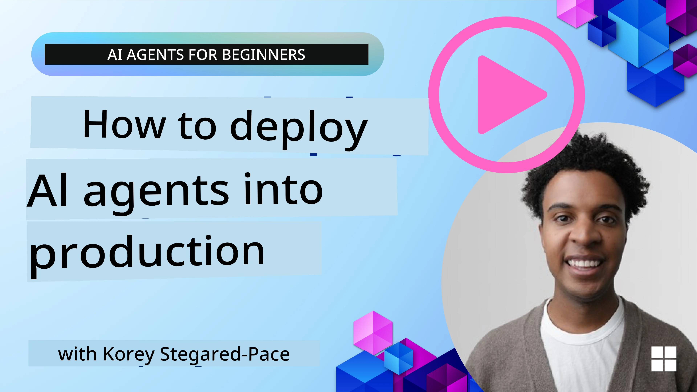

<!--
CO_OP_TRANSLATOR_METADATA:
{
  "original_hash": "cdfd0acc8592c1af14f8637833450375",
  "translation_date": "2025-11-11T14:12:55+00:00",
  "source_file": "10-ai-agents-production/README.md",
  "language_code": "pcm"
}
-->
# AI Agents for Production: Observability & Evaluation

[](https://youtu.be/l4TP6IyJxmQ?si=reGOyeqjxFevyDq9)

As AI agents dey move from experimental prototype go real-world application, e dey important to sabi how dem dey behave, monitor dia performance, and evaluate dia output well well.

## Wetin You Go Learn

After you finish dis lesson, you go sabi:
- Di main idea of agent observability and evaluation
- Di techniques wey go help improve di performance, cost, and effectiveness of agents
- Wetin and how you fit evaluate your AI agents well well
- How you fit control cost when you dey deploy AI agents for production
- How you fit instrument agents wey you build with AutoGen

Di goal na to give you di knowledge wey go help you change your "black box" agents to transparent, manageable, and dependable systems.

_**Note:** E dey important to deploy AI Agents wey safe and trustworthy. Check di [Building Trustworthy AI Agents](./06-building-trustworthy-agents/README.md) lesson too._

## Traces and Spans

Observability tools like [Langfuse](https://langfuse.com/) or [Azure AI Foundry](https://learn.microsoft.com/en-us/azure/ai-foundry/what-is-azure-ai-foundry) dey usually represent agent runs as traces and spans.

- **Trace** na di full agent task from di beginning to di end (like handling user query).
- **Spans** na di small small steps inside di trace (like calling language model or retrieving data).


Without observability, AI agent go be like "black box" - you no go fit see wetin dey happen inside, e go hard to diagnose problem or optimize performance. But with observability, agents go turn "glass box," wey go give transparency wey dey important to build trust and make sure say dem dey work as dem suppose.

## Why Observability Matter for Production Environment

When AI agents dey enter production environment, e dey bring new challenges and requirements. Observability no be just "nice-to-have" again, e don turn critical capability:

*   **Debugging and Root-Cause Analysis**: If agent fail or e produce unexpected output, observability tools go provide di traces wey go help you find di source of di error. Dis dey important for complex agents wey fit involve many LLM calls, tool interactions, and conditional logic.
*   **Latency and Cost Management**: AI agents dey rely on LLMs and other external APIs wey dem dey bill per token or per call. Observability go help track dis calls well well, so you fit identify operations wey dey slow or expensive. Dis go help teams optimize prompts, choose better models, or redesign workflows to manage cost and give better user experience.
*   **Trust, Safety, and Compliance**: For many applications, e dey important to make sure say agents dey behave safe and ethical. Observability dey provide audit trail of agent actions and decisions. You fit use am detect and solve issues like prompt injection, harmful content generation, or mishandling of personal information (PII). For example, you fit review traces to understand why agent give one kind response or use one specific tool.
*   **Continuous Improvement Loops**: Observability data na di foundation of iterative development process. By monitoring how agents dey perform for real world, teams fit identify areas wey need improvement, gather data to fine-tune models, and validate di impact of changes. Dis go create feedback loop wey production insights from online evaluation go inform offline experimentation and refinement, wey go lead to better agent performance.

## Di Key Metrics We You Go Track

To monitor and understand agent behavior, you go need track different metrics and signals. Even though di specific metrics fit depend on di agent purpose, some dey important for all.

Here be di common metrics wey observability tools dey monitor:

**Latency:** How fast di agent dey respond? Long waiting time dey spoil user experience. You suppose measure latency for tasks and di individual steps by tracing agent runs. For example, if agent dey take 20 seconds for all model calls, you fit use faster model or run di model calls together to make am faster.

**Costs:** How much e dey cost per agent run? AI agents dey rely on LLM calls wey dem dey bill per token or external APIs. If agent dey use tool too much or dey make many prompts, e fit make cost high. For example, if agent dey call LLM five times for small improvement, you go need check if di cost dey worth am or if you fit reduce di calls or use cheaper model. Real-time monitoring fit also help you see unexpected cost increase (like bugs wey dey cause excessive API loops).

**Request Errors:** How many requests di agent fail? Dis fit include API errors or failed tool calls. To make your agent strong for production, you fit set up fallbacks or retries. For example, if LLM provider A no dey work, you fit switch to LLM provider B as backup.

**User Feedback:** Direct user evaluation dey give better insight. Dis fit include ratings (👍thumbs-up/👎down, ⭐1-5 stars) or comments. If feedback dey bad regularly, e mean say di agent no dey work as e suppose.

**Implicit User Feedback:** User behavior dey give indirect feedback even if dem no rate am. Dis fit include question rephrasing, repeated queries or retry button clicks. For example, if users dey ask di same question many times, e mean say di agent no dey work well.

**Accuracy:** How often di agent dey produce correct or desirable output? Di definition of accuracy fit change (like problem-solving correctness, information retrieval accuracy, user satisfaction). Di first step na to define wetin success mean for your agent. You fit track accuracy with automated checks, evaluation scores, or task completion labels. For example, mark traces as "succeeded" or "failed."

**Automated Evaluation Metrics:** You fit set up automated evals. For example, you fit use LLM to score di agent output like if e dey helpful, accurate, or not. Some open source libraries dey wey fit help you score different aspects of di agent. For example, [RAGAS](https://docs.ragas.io/) for RAG agents or [LLM Guard](https://llm-guard.com/) to detect harmful language or prompt injection.

To monitor AI agent health well well, you go need combine dis metrics. For di [example notebook](./code_samples/10_autogen_evaluation.ipynb) wey dey dis chapter, we go show you how dis metrics dey look for real examples but first, we go learn how typical evaluation workflow dey.

## Instrument Your Agent

To gather tracing data, you go need instrument your code. Di goal na to make di agent code dey emit traces and metrics wey observability platform fit capture, process, and visualize.

**OpenTelemetry (OTel):** [OpenTelemetry](https://opentelemetry.io/) don become industry standard for LLM observability. E dey provide APIs, SDKs, and tools to generate, collect, and export telemetry data.

Plenty instrumentation libraries dey wey dey wrap existing agent frameworks and make am easy to export OpenTelemetry spans to observability tool. Below na example of how to instrument AutoGen agent with [OpenLit instrumentation library](https://github.com/openlit/openlit):

```python
import openlit

openlit.init(tracer = langfuse._otel_tracer, disable_batch = True)
```

Di [example notebook](./code_samples/10_autogen_evaluation.ipynb) for dis chapter go show you how to instrument your AutoGen agent.

**Manual Span Creation:** Even though instrumentation libraries dey provide good baseline, sometimes you go need more detailed or custom information. You fit manually create spans to add custom application logic. More importantly, you fit enrich di spans with custom attributes (tags or metadata). Dis attributes fit include business-specific data, intermediate computations, or any context wey fit help debugging or analysis, like `user_id`, `session_id`, or `model_version`.

Example of how to create traces and spans manually with [Langfuse Python SDK](https://langfuse.com/docs/sdk/python/sdk-v3): 

```python
from langfuse import get_client
 
langfuse = get_client()
 
span = langfuse.start_span(name="my-span")
 
span.end()
```

## Agent Evaluation

Observability dey give us metrics, but evaluation na di process of analyzing di data (and performing tests) to know how well AI agent dey perform and how you fit improve am. In other words, once you get di traces and metrics, how you go use dem judge di agent and make decisions?

Regular evaluation dey important because AI agents no dey always behave di same way and dem fit change (through updates or model behavior wey dey shift) – without evaluation, you no go sabi if your "smart agent" dey do di work well or e don spoil.

Two types of evaluation dey for AI agents: **online evaluation** and **offline evaluation**. Both dey important, and dem dey work together. Normally, we dey start with offline evaluation because na di minimum step wey you need before you deploy any agent.

### Offline Evaluation


Dis one na to evaluate di agent for controlled environment, usually with test datasets, no be live user queries. You go use curated datasets wey you sabi di expected output or correct behavior, then run your agent on top am.

For example, if you build math word-problem agent, you fit get [test dataset](https://huggingface.co/datasets/gsm8k) of 100 problems wey get answers. Offline evaluation dey usually happen during development (and fit dey part of CI/CD pipelines) to check improvement or prevent regression. Di benefit na say e dey **repeatable and you fit get clear accuracy metrics because you get ground truth**. You fit also simulate user queries and measure di agent response against ideal answers or use automated metrics wey we don talk about.

Di main challenge for offline eval na to make sure say your test dataset dey complete and dey relevant – di agent fit perform well for fixed test set but fit meet different queries for production. So, you go need dey update test sets with new edge cases and examples wey reflect real-world scenarios​. Mix of small “smoke test” cases and bigger evaluation sets dey useful: small sets for quick checks and bigger ones for broad performance metrics​.

### Online Evaluation 


Dis one na to evaluate di agent for live, real-world environment, i.e. during actual usage for production. Online evaluation dey involve monitoring di agent performance for real user interactions and analyzing di outcomes continuously.

For example, you fit track success rates, user satisfaction scores, or other metrics for live traffic. Di advantage of online evaluation na say e **fit capture things wey you no go expect for lab setting** – you fit observe model drift over time (if di agent effectiveness dey reduce as input patterns dey change) and catch unexpected queries or situations wey no dey your test data​. E dey give true picture of how di agent dey behave for di real world.

Online evaluation dey involve collecting implicit and explicit user feedback, as we don talk, and fit also involve shadow tests or A/B tests (where new version of di agent dey run side by side to compare with di old one). Di challenge na say e fit hard to get reliable labels or scores for live interactions – you fit rely on user feedback or downstream metrics (like whether user click di result).

### Combine Di Two

Online and offline evaluations no dey cancel each other; dem dey work together. Insights from online monitoring (like new types of user queries wey di agent no dey perform well) fit help improve offline test datasets. On di other hand, agents wey perform well for offline tests fit dey deployed confidently and monitored online.

Many teams dey use dis loop:

_evaluate offline -> deploy -> monitor online -> collect new failure cases -> add to offline dataset -> refine agent -> repeat_.

## Common Problems

When you deploy AI agents for production, you fit face different challenges. Here be some common problems and wetin you fit do:

| **Problem**    | **Wetin You Fit Do**   |
| ------------- | ------------------ |
| AI Agent no dey perform tasks well well | - Refine di prompt wey you give di AI Agent; make di objectives clear.<br>- Check if dividing di tasks into subtasks and handling dem by multiple agents go help. |
| AI Agent dey enter continuous loops  | - Make sure say you get clear termination terms and conditions so di Agent go sabi when to stop.<br>- For complex tasks wey need reasoning and planning, use bigger model wey dey specialize for reasoning tasks. |
| AI Agent tool calls no dey perform well   | - Test and validate di tool output outside di agent system.<br>- Refine di defined parameters, prompts, and naming of tools.  |
| Multi-Agent system no dey perform well | - Refine di prompts wey you give each agent to make sure say dem dey specific and different from each other.<br>- Build hierarchical system wey go use "routing" or controller agent to decide which agent go handle di task. |

Most of dis problems fit dey identified better if observability dey. Di traces and metrics wey we don talk about go help you know exactly where di problem dey for di agent workflow, so debugging and optimization go dey easier.

## Managing Costs
Here be some ways wey you fit take manage di cost of deploying AI agents for production:

**Use Smaller Models:** Small Language Models (SLMs) fit do well for some agentic use-cases and e go reduce cost well well. As we don talk before, to build evaluation system wey go help you check and compare performance with bigger models na di best way to sabi how SLM go perform for your use case. You fit use SLMs for simple tasks like intent classification or parameter extraction, and keep bigger models for di tasks wey need complex reasoning.

**Use Router Model:** Another way na to use different models wey get different sizes. You fit use LLM/SLM or serverless function to route requests based on how complex dem be to di models wey fit handle am well. Dis one go help reduce cost and still make sure say di right tasks dey perform well. For example, you fit send simple queries go smaller, faster models, and only use di expensive big models for di tasks wey need complex reasoning.

**Cache Responses:** To sabi di common requests and tasks and provide di responses before dem pass through your agentic system na better way to reduce di number of similar requests. You fit even set up flow wey go check how similar one request be to di cached requests using more basic AI models. Dis method fit reduce cost well well for frequently asked questions or common workflows.

## Make we see how e go work for real life

For di [example notebook for dis section](./code_samples/10_autogen_evaluation.ipynb), we go see examples of how we fit use observability tools to monitor and evaluate our agent.

### You get more questions about AI Agents for Production?

Join di [Azure AI Foundry Discord](https://aka.ms/ai-agents/discord) to meet other learners, attend office hours and get answers to your AI Agents questions.

## Previous Lesson

[Metacognition Design Pattern](../09-metacognition/README.md)

## Next Lesson

[Agentic Protocols](../11-agentic-protocols/README.md)

---

<!-- CO-OP TRANSLATOR DISCLAIMER START -->
**Disclaimer**:  
Dis dokyument don translate wit AI translation service [Co-op Translator](https://github.com/Azure/co-op-translator). Even though we dey try make am accurate, abeg make you sabi say machine translation fit get mistake or no dey correct well. Di original dokyument for di language wey dem write am first na di main source wey you go trust. For important information, e better make professional human translator check am. We no go fit take blame for any misunderstanding or wrong interpretation wey fit happen because you use dis translation.
<!-- CO-OP TRANSLATOR DISCLAIMER END -->